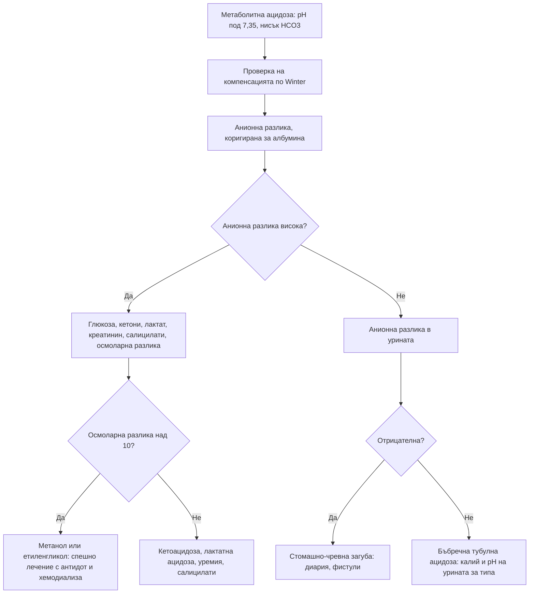

# Глава 31. Киселинно-алкални нарушения

> **Част VI. Бъбреци, пикочни пътища и вътрешна среда**

## Цели на главата

- Да се тълкуват кръвно-газовите резултати по стъпаловиден подход.
- Да се изчисляват анионната разлика, очакваната компенсация, делта-съотношението и осмоларната разлика.
- Да се изброяват причините за метаболитна ацидоза с висока и с нормална анионна разлика.
- Да се разграничават хлор-чувствителната и хлор-резистентната метаболитна алкалоза.
- Да се разпознават смесените нарушения и токсичните причини (метанол, етиленгликол, салицилати).

## Ключови моменти

- Кръвно-газовият анализ се тълкува стъпаловидно: pH, първично нарушение, адекватност на компенсацията, анионна разлика (коригирана за албумина), делта-съотношение и осмоларна разлика *(SORT C [1, 4])*.
- Неадекватната компенсация означава второ, съпътстващо нарушение. Компенсацията никога не нормализира напълно pH.
- Метаболитната ацидоза с висока анионна разлика се запомня с GOLDMARK. Осмоларна разлика над 10 насочва към метанол или етиленгликол, при които лечението с антидот не се отлага *(SORT B [5, 8])*.
- Кетоацидоза с нормална глюкоза се среща при SGLT2 инхибитори и при алкохолна кетоацидоза *(SORT C [6])*.
- Венозните газове са достатъчни за pH, бикарбонат, лактат и калий. Нормалното венозно pCO₂ изключва хиперкапния, но повишеното се потвърждава с артериални газове *(SORT B [2, 3])*.
- Хипервентилацията „от тревожност“ е диагноза след изключване на хипоксемията, метаболитната ацидоза и белодробната тромбемболия.

---

## 1. Нормални стойности

| Показател | Нормални стойности |
|---|---|
| pH | 7,35–7,45 |
| pCO₂ | 35–45 mmHg (4,7–6,0 kPa) |
| HCO₃⁻ | 22–26 mmol/l |
| Базов излишък | −2 до +2 mmol/l |
| Анионна разлика (Na⁺ − [Cl⁻ + HCO₃⁻]) | ≈ 8–12 mmol/l (зависи от лабораторията) |
| Лактат | < 2 mmol/l |

**Корекция на анионната разлика за албумина:** коригирана анионна разлика = измерена + 0,25 × (40 − албумин в g/l) [1]. При хипоалбуминемия „нормалната“ анионна разлика може да скрие метаболитна ацидоза с висока анионна разлика.

**Венозни кръвни газове.** За pH (артериалното е средно с около 0,03 по-високо), HCO₃⁻, лактат и калий те са достатъчни. Венозното pCO₂ не е взаимозаменяемо с артериалното поради голямата индивидуална вариация [2]. Нормалното венозно pCO₂ практически изключва хиперкапния, но повишеното трябва да се потвърди с артериални газове [3]. За оксигенацията се използват артериални газове или пулсова оксиметрия.

---

## 2. Стъпаловиден подход

Подходът следва физиологичния модел на оценка [4].

1. **pH:** ацидемия (< 7,35) или алкалемия (> 7,45)?
2. **Първично нарушение:**
   - ацидемия с нисък HCO₃⁻ — метаболитна ацидоза;
   - ацидемия с висок pCO₂ — респираторна ацидоза;
   - алкалемия с висок HCO₃⁻ — метаболитна алкалоза;
   - алкалемия с нисък pCO₂ — респираторна алкалоза.
3. **Адекватна ли е компенсацията?**

| Първично нарушение | Очаквана компенсация |
|---|---|
| Метаболитна ацидоза | pCO₂ (mmHg) = 1,5 × HCO₃⁻ + 8 ± 2 (**формула на Winter**) |
| Метаболитна алкалоза | pCO₂ се повишава с около 0,7 mmHg на всеки 1 mmol/l повишение на HCO₃⁻ |
| Остра респираторна ацидоза | HCO₃⁻ се повишава с 1 mmol/l на всеки 10 mmHg pCO₂ |
| Хронична респираторна ацидоза | HCO₃⁻ се повишава с 3,5 mmol/l на всеки 10 mmHg pCO₂ |
| Остра респираторна алкалоза | HCO₃⁻ спада с 2 mmol/l на всеки 10 mmHg pCO₂ |
| Хронична респираторна алкалоза | HCO₃⁻ спада с 5 mmol/l на всеки 10 mmHg pCO₂ |

   Ако компенсацията се различава от очакваната, съществува **второ, съпътстващо нарушение**. Компенсацията никога не връща pH до нормата и никога не го „надминава“.

4. **Анионна разлика** (при всяка метаболитна ацидоза, а и при всеки кръвно-газов анализ).
5. **Делта-съотношение** при висока анионна разлика: (анионна разлика − 12) / (24 − HCO₃⁻).
   - < 0,4 — ацидоза с нормална анионна разлика;
   - 0,4–0,8 — съчетание на ацидоза с висока и ацидоза с нормална анионна разлика;
   - 0,8–2 — чиста ацидоза с висока анионна разлика;
   - > 2 — ацидоза с висока анионна разлика и съпътстваща метаболитна алкалоза (или предшестваща компенсирана респираторна ацидоза).
6. **Осмоларна разлика** при необяснима ацидоза с висока анионна разлика: измерен осмолалитет − изчислен (2 × Na⁺ + глюкоза + урея, в mmol/l). Разлика **> 10** насочва към токсични алкохоли.

---

## 3. Метаболитна ацидоза с висока анионна разлика

Причините се запомнят с мнемониката **GOLDMARK** [5]:

| Буква | Причина | Насочващи белези |
|---|---|---|
| **G** | Гликоли (етиленгликол, пропиленгликол) | Антифриз; объркване, **оксалатни кристали** в урината, ОБУ; висока осмоларна разлика |
| **O** | 5-оксопролин (пироглутаминова киселина) | Хроничен прием на парацетамол при недохранени пациенти, особено жени |
| **L** | L-лактат | **Шок, сепсис**, исхемия (мезентериална!), гърчове, чернодробна недостатъчност, **метформин** (особено при ОБУ), тиаминов дефицит, отравяне с цианиди и въглероден оксид |
| **D** | D-лактат | Синдром на късото черво; епизоди на объркване след въглехидратна храна |
| **M** | **Метанол** | Нелегален или домашно дестилиран алкохол; **зрителни нарушения** („снежна буря“, слепота), коремна болка, висока осмоларна разлика |
| **A** | Аспирин (салицилати) | Шум в ушите, гадене, хипервентилация; смесена респираторна алкалоза и метаболитна ацидоза |
| **R** | Бъбречна недостатъчност (*renal failure*) | Уремия (обикновено при eGFR < 15–20) |
| **K** | **Кетоацидоза** | **Диабетна** (включително **еугликемична** при SGLT2 инхибитори [6]), **алкохолна** (след запой и гладуване, глюкозата често е нормална или ниска), от гладуване |

## 4. Метаболитна ацидоза с нормална анионна разлика (хиперхлоремична)

| Механизъм | Причини |
|---|---|
| **Стомашно-чревна загуба на бикарбонат** | **Диария**, илеостома, фистули на панкреаса и тънкото черво, уретероентеростомия |
| **Бъбречна загуба или нарушена екскреция на киселини** | **Бъбречна тубулна ацидоза** (тип 1, 2, 4), ранно ХБЗ, ацетазоламид, топирамат |
| **Ятрогенна** | **Вливане на големи количества физиологичен разтвор** |
| **Ендокринна** | Надбъбречна недостатъчност (хипоалдостеронизъм) |

**Анионна разлика в урината** (Na⁺ + K⁺ − Cl⁻):

- **отрицателна** — бъбреците отделят амоний нормално, значи загубата е стомашно-чревна;
- **положителна** — бъбречна тубулна ацидоза (дистална).

### 4.1. Бъбречна тубулна ацидоза

| Тип | Механизъм | Калий | pH на урината | Причини и белези |
|---|---|---|---|---|
| **Тип 1 (дистална)** | Нарушена секреция на H⁺ | Нисък | > 5,5 | Синдром на Sjögren, системен лупус еритематодес, амфотерицин, литий; нефрокалциноза, камъни |
| **Тип 2 (проксимална)** | Нарушена реабсорбция на HCO₃⁻ | Нисък | < 5,5 (при тежка ацидоза) | **Синдром на Fanconi** (глюкозурия при нормална глюкоза, фосфатурия, аминоацидурия); миелом, тенофовир, ифосфамид, ацетазоламид |
| **Тип 4** | Хипоалдостеронизъм или резистентност към алдостерон | **Висок** | < 5,5 | **Диабетна нефропатия** (хипоренинемичен хипоалдостеронизъм), АСЕ инхибитори и сартани, НСПВС, триметоприм, хепарин, болест на Addison |

---

## 5. Метаболитна алкалоза

| Тип | Хлор в урината | Причини |
|---|---|---|
| **Хлор-чувствителна** | < 20 mmol/l | **Повръщане**, назогастрална аспирация, **прекратен** прием на диуретици, след хиперкапния, вилозен аденом, загуба на обем |
| **Хлор-резистентна с хипертония** | > 20 mmol/l | **Първичен алдостеронизъм**, синдром на Cushing, реноваскуларна хипертония, **женско биле**, синдром на Liddle |
| **Хлор-резистентна без хипертония** | > 20 mmol/l | **Текущ прием на диуретици**, синдроми на Bartter и Gitelman, тежка хипокалиемия, хипомагнезиемия |
| **Прием на основи** | Различен | Калциево-алкален синдром (калциеви добавки и антиациди), натриев бикарбонат, при нарушена бъбречна функция |

---

## 6. Респираторна ацидоза

| Група | Причини |
|---|---|
| **Потискане на дихателния център** | Опиоиди, бензодиазепини, алкохол, инсулт, травма на главата |
| **Нервно-мускулни заболявания** | Синдром на Guillain-Barré, миастения гравис, амиотрофична латерална склероза, миопатии, тежка хипокалиемия и хипофосфатемия, ботулизъм |
| **Гръдна стена** | Кифосколиоза, **синдром на хиповентилация при затлъстяване**, подвижен гръден кош при травма |
| **Дихателни пътища и бял дроб** | **ХОББ**, тежка астма (в късния стадий), пневмония, белодробен оток, обструкция на горните дихателни пътища |

**Кислородна терапия при ХОББ.** Прекомерното подаване на кислород при пациенти със задържане на CO₂ може да влоши хиперкапнията. Целевата сатурация е 88–92% [7].

## 7. Респираторна алкалоза

| Група | Причини |
|---|---|
| **Хипоксемия** | Белодробна тромбемболия, пневмония, астма (в ранния стадий), висока надморска височина |
| **Централна стимулация** | Тревожност и хипервентилация, болка, треска, инсулт, менингит, тумори |
| **Лекарства и токсини** | **Салицилати** (в ранния стадий), прогестерон |
| **Системни** | **Сепсис** (в ранния стадий), **чернодробна недостатъчност**, бременност, хипертиреоидизъм |
| **Ятрогенна** | Прекомерна механична вентилация |

**Хипервентилацията поради тревожност** е диагноза, която се поставя след изключване на хипоксемията и метаболитната ацидоза. SpO₂ е нормална, pCO₂ е ниско, а pO₂ е нормално или високо.

---

## 8. Смесени нарушения: типични примери

| Клинична ситуация | Нарушения |
|---|---|
| **Отравяне със салицилати** | Респираторна алкалоза + метаболитна ацидоза с висока анионна разлика |
| **Сепсис** | Лактатна ацидоза + респираторна алкалоза |
| **Диабетна кетоацидоза с повръщане** | Метаболитна ацидоза с висока анионна разлика + метаболитна алкалоза (делта-съотношение > 2) |
| **ХОББ с диуретици** | Респираторна ацидоза + метаболитна алкалоза |
| **Сърдечен арест** | Респираторна ацидоза + лактатна ацидоза |
| **Диария с кетоза от гладуване** | Ацидоза с нормална анионна разлика + ацидоза с висока анионна разлика |

---

## 9. Безопасна диагностична стратегия

| Въпрос | Отговор |
|---|---|
| **Вероятна диагноза** | Диабетна кетоацидоза, лактатна ацидоза при сепсис, диария, повръщане, диуретици, ХОББ |
| **Сериозни заболявания, които не бива да се пропускат** | **Отравяне с метанол и етиленгликол**, салицилати; **мезентериална исхемия** (лактат); сепсис; **еугликемична кетоацидоза** при SGLT2 инхибитори; дихателна недостатъчност при нервно-мускулни заболявания |
| **Чести капани** | „Нормална“ анионна разлика при хипоалбуминемия; алкохолна кетоацидоза с нормална глюкоза; хипервентилация, приета за тревожност, при белодробна тромбемболия или ацидоза; метформин при ОБУ |
| **Маскиращи заболявания** | Лекарства, захарен диабет, бъбречна недостатъчност |
| **Психосоциални аспекти** | Злоупотреба с алкохол, самоотравяне, хранителни разстройства (повръщане, слабителни) |

---

## 10. Диагностичен алгоритъм при метаболитна ацидоза

---

## 11. Червени флагове и насочване

### 11.1. Червени флагове

- pH под 7,2 или бикарбонат под 10 mmol/l.
- Метаболитна ацидоза с висока осмоларна разлика или със зрителни нарушения (метанол, етиленгликол).
- Лактат над 4 mmol/l или повишен лактат при силна коремна болка с бедна находка (сепсис, мезентериална исхемия).
- Кетоацидоза, включително с нормална глюкоза при SGLT2 инхибитор.
- Хиперкапния с нарушено съзнание или нервно-мускулна слабост.
- Съмнение за отравяне със салицилати (шум в ушите, хипервентилация, повръщане).

### 11.2. Кога и колко спешно да насочим

| Спешност | Клинична ситуация |
|---|---|
| **Незабавно (112 или спешно отделение)** | pH под 7,2; съмнение за отравяне с метанол, етиленгликол или салицилати; кетоацидоза; лактатна ацидоза при сепсис или исхемия; хиперкапнична дихателна недостатъчност с нарушено съзнание |
| **В същия ден** | Ацидоза с нормална анионна разлика и изразена хипокалиемия; метаболитна алкалоза с тежка хипокалиемия; метформин при остро бъбречно увреждане с повишен лактат |
| **Бързо (до 2 седмици)** | Подозрение за бъбречна тубулна ацидоза със системно заболяване (синдром на Sjögren, миелом) |
| **Планово** | Хлор-резистентна метаболитна алкалоза с хипертония (скрининг за първичен алдостеронизъм); хронична бъбречна тубулна ацидоза |
| **Проследяване в общата практика** | Лека метаболитна алкалоза от диуретик след корекция; хронична компенсирана респираторна ацидоза при стабилна ХОББ |

---

## 12. Клинични перли

- При всеки кръвно-газов анализ изчислявайте анионната разлика и я коригирайте за албумина.
- Неадекватната компенсация означава второ нарушение.
- Метаболитна ацидоза с висока анионна разлика, зрителни нарушения и анамнеза за нелегален алкохол: метанол. Не чакайте нивото. Започнете лечение.
- Кетоацидоза с нормална глюкоза при пациент на SGLT2 инхибитор е реалност (еугликемична кетоацидоза).
- Алкохолната кетоацидоза протича с нормална или ниска глюкоза след запой и повръщане.
- Хипервентилацията „от тревожност“ е диагноза след изключване. Метаболитната ацидоза и белодробната тромбемболия също водят до учестено дишане.
- Повишеният лактат при силна коремна болка с бедна находка е късен, но зловещ белег на мезентериална исхемия.

---

## 13. Клиничен случай

**Етап 1 — представяне.** Мъж на 45 години е доведен от семейството си заради объркване, повръщане и коремна болка. Предната вечер е пил домашно произведена ракия, купена от непознат, заедно с двама приятели. Единият от тях е хоспитализиран с „неясно отравяне“. Пациентът съобщава, че „вижда като през мъгла“.

> **Въпрос 1.** Кое отравяне трябва да се подозира?

**Етап 2 — изследвания.** pH 7,12, pCO₂ 22 mmHg, HCO₃⁻ 8 mmol/l, Na⁺ 140 mmol/l, Cl⁻ 102 mmol/l, глюкоза 6 mmol/l, урея 5 mmol/l, измерен осмолалитет 330 mOsm/kg. Етанол не се открива, кетоните са следи, лактатът е 3 mmol/l.

> **Въпрос 2.** Какво е киселинно-алкалното нарушение? Изчислете анионната и осмоларната разлика.

> **Въпрос 3.** Какво е лечението?

Обсъждане и отговори

**Отговор 1.** Отравяне с **метанол**: нелегален алкохол, групово заболяване и зрителни нарушения.

**Отговор 2.**

- Анионната разлика е 140 − (102 + 8) = **30 mmol/l**, т.е. висока.
- Очакваното pCO₂ по Winter е 1,5 × 8 + 8 = 20 ± 2 mmHg. Компенсацията е адекватна.
- Изчисленият осмолалитет е 2 × 140 + 6 + 5 = 291 mOsm/kg. **Осмоларната разлика е 39 mOsm/kg** — силно повишена.

Това е метаболитна ацидоза с висока анионна и висока осмоларна разлика. Метанолът се метаболизира до мравчена киселина, която уврежда зрителния нерв.

**Отговор 3.** Лечението е спешно: **фомепизол** или етанол (блокират алкохолдехидрогеназата), **хемодиализа** и фолиева киселина [8]. Нивото на метанола не се изчаква. Трябва незабавно да се уведомят здравните власти и да се открият другите консуматори.

**Поука.** Осмоларната разлика е прост и бърз ключ към диагнозата на отравянето с токсични алкохоли. Отравянията с метанол от нелегален алкохол продължават да се срещат.

---

## Обобщение

- Киселинно-алкалните нарушения се тълкуват стъпаловидно: pH, първично нарушение, компенсация, анионна разлика, делта-съотношение и осмоларна разлика.
- Метаболитната ацидоза е с висока (GOLDMARK) или с нормална анионна разлика (диария, бъбречна тубулна ацидоза, физиологичен разтвор). Анионната разлика в урината разграничава стомашно-чревната от бъбречната загуба.
- Метаболитната алкалоза се разделя по хлора в урината на хлор-чувствителна и хлор-резистентна. Респираторните нарушения отразяват хиповентилация или хипервентилация.
- Смесените нарушения са чести при отравяне със салицилати, сепсис и кетоацидоза с повръщане. Токсичните алкохоли изискват незабавно лечение.

## Самопроверка

### Въпроси с един верен отговор

**1.** *(основно ниво)* pH 7,28, pCO₂ 30 mmHg, HCO₃⁻ 14 mmol/l. Адекватна ли е компенсацията?

- **А.** Да, очакваното pCO₂ по Winter е 27–31 mmHg
- **Б.** Не, има съпътстваща респираторна ацидоза
- **В.** Не, има съпътстваща респираторна алкалоза
- **Г.** Компенсацията не може да се оцени
- **Д.** Първичното нарушение е респираторно

Отговор и обосновка

**Верен отговор: А.** По формулата на Winter очакваното pCO₂ е 1,5 × 14 + 8 = 29 ± 2 mmHg, т.е. 27–31 mmHg. Измереното 30 mmHg е в този интервал, затова компенсацията е адекватна и няма второ нарушение.

**2.** *(основно ниво)* Na⁺ 138, Cl⁻ 110, HCO₃⁻ 14 mmol/l, албумин 40 g/l при пациент с диария от 5 дни. Каква е анионната разлика и какво означава?

- **А.** 14 — висока, кетоацидоза
- **Б.** 14 — нормална, хиперхлоремична ацидоза от загуба на бикарбонат
- **В.** 24 — висока, лактатна ацидоза
- **Г.** 4 — ниска, миелом
- **Д.** 28 — висока, метанол

Отговор и обосновка

**Верен отговор: Б.** Анионната разлика е 138 − (110 + 14) = 14 mmol/l, т.е. в нормата или гранична. Ацидозата с нормална анионна разлика при диария се дължи на стомашно-чревна загуба на бикарбонат. Анионната разлика в урината би била отрицателна.

**3.** *(основно ниво)* Пациент с ХОББ има SpO₂ 84% на стаен въздух. Каква е целевата сатурация при кислородолечението?

- **А.** 98–100%
- **Б.** 94–98%
- **В.** 88–92%
- **Г.** 80–84%
- **Д.** Над 95% на всяка цена

Отговор и обосновка

**Верен отговор: В.** При риск от хиперкапнична дихателна недостатъчност целта е 88–92% [7]. Прекомерният кислород може да влоши хиперкапнията.

**4.** *(напреднало ниво)* Жена на 58 години с диабет тип 2 приема емпаглифлозин. След гастроентерит има повръщане и учестено дишане. Глюкозата е 9 mmol/l, pH 7,18, HCO₃⁻ 9 mmol/l, а кетоните в кръвта са 4,5 mmol/l. Коя е диагнозата?

- **А.** Лактатна ацидоза от метформин
- **Б.** Еугликемична диабетна кетоацидоза при SGLT2 инхибитор
- **В.** Метаболитна алкалоза от повръщането
- **Г.** Хипервентилация от тревожност
- **Д.** Алкохолна кетоацидоза

Отговор и обосновка

**Верен отговор: Б.** Кетоацидозата с почти нормална глюкоза при пациент на SGLT2 инхибитор с остро заболяване е еугликемична диабетна кетоацидоза [6]. Тя е спешно състояние, а SGLT2 инхибиторът се спира. Нормалната глюкоза не изключва кетоацидоза.

**5.** *(напреднало ниво)* Пациент с ацидоза с висока анионна разлика има анионна разлика 26 mmol/l и HCO₃⁻ 20 mmol/l. Какво показва делта-съотношението?

- **А.** Под 0,4 — ацидоза с нормална анионна разлика
- **Б.** 0,4–0,8 — смесена ацидоза
- **В.** 0,8–2 — чиста ацидоза с висока анионна разлика
- **Г.** Над 2 — съпътстваща метаболитна алкалоза
- **Д.** Не може да се изчисли

Отговор и обосновка

**Верен отговор: Г.** Делта-съотношението е (26 − 12) / (24 − 20) = 14 / 4 = 3,5. Стойност над 2 означава, че бикарбонатът е спаднал по-малко от очакваното — има съпътстваща метаболитна алкалоза (например от повръщане) или предшестваща компенсирана респираторна ацидоза.

### Задача

При пациент с хипоалбуминемия (албумин 20 g/l) Na⁺ е 136 mmol/l, Cl⁻ — 104 mmol/l, а HCO₃⁻ — 18 mmol/l. Изчислете анионната разлика и я коригирайте за албумина. Какъв е изводът?

Решение

Измерена анионна разлика = 136 − (104 + 18) = **14 mmol/l** (изглежда гранична). Коригирана = 14 + 0,25 × (40 − 20) = 14 + 5 = **19 mmol/l** — **висока** [1]. Без корекцията ацидозата с висока анионна разлика (например лактатна при сепсис) би била пропусната. Следват лактат, кетони, креатинин и при нужда осмоларна разлика.

### OSCE станция: Тълкуване на кръвно-газов анализ

**Време:** 8 минути. **Ниво:** напреднало (специализанти).

**Задача за кандидата.** Тълкувайте кръвно-газовия анализ на жена на 32 години, приета с повръщане, объркване и шум в ушите след прием на неизвестни таблетки.

**Информация за симулирания пациент (за изпитващия).** pH 7,40, pCO₂ 25 mmHg, HCO₃⁻ 15 mmol/l, Na⁺ 140 mmol/l, Cl⁻ 102 mmol/l, албумин 40 g/l, глюкоза 5,5 mmol/l, урея 4 mmol/l, измерен осмолалитет 292 mOsm/kg, лактат 2,5 mmol/l.

**Рубрика за оценяване**

| Критерий | Точки |
|---|---|
| Отбелязва, че нормалното pH не изключва нарушение | 1 |
| Изчислява анионната разлика (23 mmol/l, висока) | 2 |
| Изчислява очакваното pCO₂ по Winter (30,5 ± 2 mmHg) и разпознава, че измереното е по-ниско — съпътстваща респираторна алкалоза | 2 |
| Изчислява осмоларната разлика (около 3 mOsm/kg, нормална) | 1 |
| Свързва смесеното нарушение (респираторна алкалоза и метаболитна ацидоза с висока анионна разлика) и шума в ушите с отравяне със салицилати | 2 |
| Предлага ниво на салицилати, парацетамол и спешно лечение в болница | 2 |
| Посочва нуждата от психиатрична оценка след стабилизиране | 1 |
| **Общо** | **11** |

**Праг за успешно представяне:** 8 от 11 точки, включително разпознаването на смесеното нарушение.

## Литература

1. Figge J, Jabor A, Kazda A, Fencl V. Anion gap and hypoalbuminemia. Crit Care Med. 1998;26(11):1807-10. doi:10.1097/00003246-199811000-00019. PMID: 9824071.
2. Byrne AL, Bennett M, Chatterji R, Symons R, Pace NL, Thomas PS. Peripheral venous and arterial blood gas analysis in adults: are they comparable? A systematic review and meta-analysis. Respirology. 2014;19(2):168-175. doi:10.1111/resp.12225. PMID: 24383789.
3. Byrne AL, Pace NL, Thomas PS, Symons RL, Chatterji R, Bennett M. Peripheral venous blood gas analysis for the diagnosis of respiratory failure, hypercarbia and metabolic disturbance in adults. Cochrane Database Syst Rev. 2025;6(6):CD010841. doi:10.1002/14651858.CD010841.pub2. PMID: 40557830.
4. Berend K, de Vries AP, Gans RO. Physiological approach to assessment of acid-base disturbances. N Engl J Med. 2014;371(15):1434-45. doi:10.1056/NEJMra1003327. PMID: 25295502.
5. Mehta AN, Emmett JB, Emmett M. GOLD MARK: an anion gap mnemonic for the 21st century. Lancet. 2008;372(9642):892. doi:10.1016/S0140-6736(08)61398-7. PMID: 18790311.
6. Peters AL, Buschur EO, Buse JB, Cohan P, Diner JC, Hirsch IB. Euglycemic Diabetic Ketoacidosis: A Potential Complication of Treatment With Sodium-Glucose Cotransporter 2 Inhibition. Diabetes Care. 2015;38(9):1687-93. doi:10.2337/dc15-0843. PMID: 26078479.
7. O'Driscoll BR, Howard LS, Earis J, Mak V. BTS guideline for oxygen use in adults in healthcare and emergency settings. Thorax. 2017;72(Suppl 1):ii1-ii90. doi:10.1136/thoraxjnl-2016-209729. PMID: 28507176.
8. Roberts DM, Yates C, Megarbane B, Winchester JF, Maclaren R, Gosselin S, et al. Recommendations for the role of extracorporeal treatments in the management of acute methanol poisoning: a systematic review and consensus statement. Crit Care Med. 2015;43(2):461-72. doi:10.1097/CCM.0000000000000708. PMID: 25493973.

*Последна проверка на съдържанието: септември 2026 г. Следващ планиран преглед: септември 2027 г. (вж. „Политика за актуализация“ в README).*

<!-- навигация -->

---

[← Глава 30. Електролитни нарушения](30-elektroliti.md) · [Съдържание](../README.md) · [Глава 32. Анемия →](32-anemia.md)
