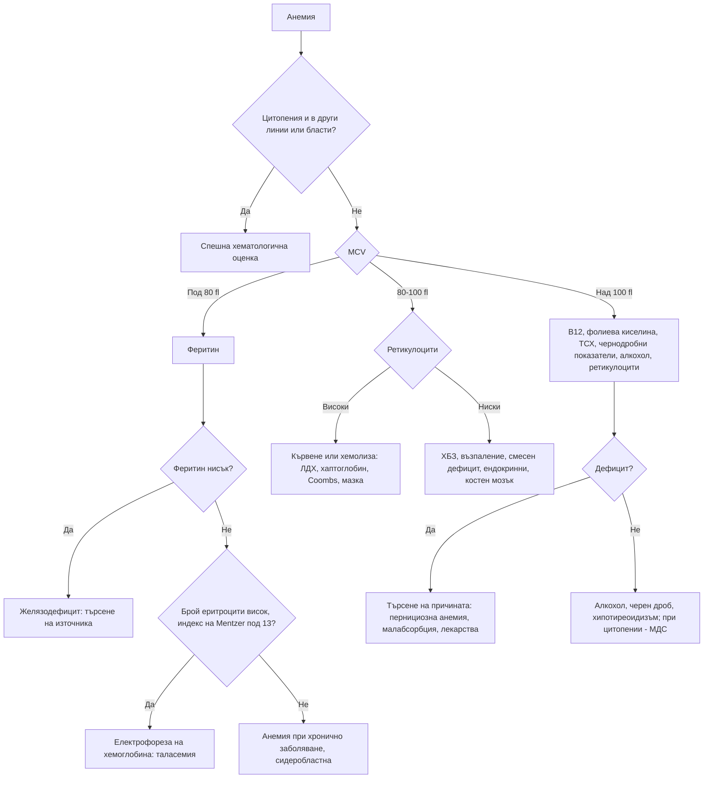

# Глава 32. Анемия

> **Част VII. Кръв и кръвотворни органи**

## Цели на главата

- Да се дефинира анемията и да се оценява нейната тежест и темп на развитие.
- Да се класифицира анемията по средния обем на еритроцитите (MCV) и по броя на ретикулоцитите.
- Да се тълкуват показателите на железния метаболизъм, включително при възпаление.
- Да се разграничават желязодефицитната анемия и бета-таласемия минор.
- Да се разпознават хемолизата, дефицитът на B12 и фолиева киселина и костномозъчните заболявания.
- Да се търси източникът на желязодефицит.

---

## 1. Определение

**Анемия** (по СЗО): хемоглобин под **130 g/l при мъже** и под **120 g/l при небременни жени**. При бременност границата е около 110 g/l в I триместър и около 105 g/l във II–III триместър. Референтните граници варират според лабораторията, възрастта и етническия произход.

**Клиничните прояви** зависят повече от **скоростта** на развитие, отколкото от абсолютната стойност. Хроничната анемия с хемоглобин 70 g/l може да протича с минимални симптоми. Остра загуба на същото количество кръв предизвиква шок.

**Симптоми:** умора, задух при усилие, сърцебиене, световъртеж, главоболие, стенокардия, клаудикация, декомпенсация на сърдечна недостатъчност.

**Специфични белези:**

- **желязодефицит** — койлонихия, ангуларен хейлит, глосит, пика (желание за ядене на лед, пръст, нишесте), синдром на неспокойните крака;
- **дефицит на B12** — невропатия, атаксия, когнитивни нарушения, глосит;
- **хемолиза** — жълтеница, тъмна урина, спленомегалия.

---

## 2. Класификация по MCV

| Микроцитна (MCV < 80 fl) | Нормоцитна (MCV 80–100 fl) | Макроцитна (MCV > 100 fl) |
|---|---|---|
| **Желязодефицитна анемия** (най-честата) | **Остра кръвозагуба** | **Мегалобластна**: дефицит на **B12** или **фолиева киселина**, лекарства (метотрексат, хидроксиурея, азатиоприн, зидовудин) |
| **Таласемия** (особено бета-таласемия минор) | **Анемия при хронично заболяване** (възпаление) | **Немегалобластна**: **алкохол**, чернодробно заболяване, **хипотиреоидизъм**, **ретикулоцитоза** (хемолиза, кървене) |
| Анемия при хронично заболяване (в 20–30% от случаите) | **Хронично бъбречно заболяване** | **Миелодиспластичен синдром** |
| Сидеробластна анемия (вродена, алкохол, олово) | **Хемолиза** | Мултиплен миелом |
| Отравяне с олово | Смесен дефицит (желязо + B12) | Апластична анемия |
| | Костномозъчна недостатъчност или инфилтрация (миелодиспластичен синдром, апластична анемия, миелом, метастази, левкемия) | Бременност, новородени (физиологично) |
| | Ендокринни (хипотиреоидизъм, хипогонадизъм, надбъбречна недостатъчност) | |
| | Бременност (разреждане) | |

## 3. Класификация по ретикулоцитите

Ретикулоцитите показват дали костният мозък отговаря на анемията.

- **Високи ретикулоцити** (> 2–3% или > 100 × 10⁹/l) — **периферна загуба или разрушаване**: кървене, **хемолиза**, възстановяване след лечение на дефицит.
- **Ниски ретикулоцити** — **нарушена продукция**: дефицити (желязо, B12, фолиева киселина), анемия при хронично заболяване, ХБЗ, костномозъчни заболявания.

---

## 4. Безопасна диагностична стратегия

| Въпрос | Отговор |
|---|---|
| **Вероятна диагноза** | Желязодефицитна анемия (менструални загуби, стомашно-чревно кървене, недостатъчен прием), анемия при хронично заболяване, ХБЗ, бета-таласемия минор |
| **Сериозни заболявания, които не бива да се пропускат** | **Карцином на стомашно-чревния тракт** като източник на желязодефицит; **остра левкемия**, **миелодиспластичен синдром**, **миелом**; **хемолиза** (включително микроангиопатична — тромботична тромбоцитопенична пурпура, хемолитично-уремичен синдром); тежък **дефицит на B12** с неврологично засягане; апластична анемия |
| **Чести капани** | **Бета-таласемия минор**, лекувана с желязо; **цьолиакия** като причина за рефрактерен желязодефицит; нормален феритин при възпаление, маскиращ желязодефицит; смесен дефицит с нормален MCV; дефицит на B12 при метформин и ИПП; автоимунен атрофичен гастрит; ангиодисплазии; фолиев дефицит при алкохолизъм |
| **Маскиращи заболявания** | Хронично бъбречно заболяване, хипотиреоидизъм, злокачествени заболявания, лекарства, възпалителни заболявания |
| **Психосоциални аспекти** | Недохранване, алкохол, ограничителни диети, бедност |

---

## 5. Желязодефицитна анемия

### 5.1. Лабораторна диагноза

| Показател | Желязодефицит | Анемия при хронично заболяване | Бета-таласемия минор |
|---|---|---|---|
| **Феритин** | **Нисък** (< 15–30 µg/l) | Нормален или висок | Нормален |
| Трансферинова сатурация | < 20% (често < 16%) | Ниска или нормална | Нормална |
| Серумно желязо | Ниско | Ниско | Нормално |
| Общ железосвързващ капацитет (трансферин) | **Висок** | **Нисък** | Нормален |
| MCV | Нисък | Нормален или нисък | **Много нисък** за степента на анемията |
| Брой еритроцити | Нисък | Нисък | **Нормален или висок** |
| RDW (разпределение на еритроцитите по обем) | **Повишено** | Нормално | Нормално или леко повишено |
| **Индекс на Mentzer** (MCV / брой еритроцити в 10¹²/l) | > 13 | — | **< 13** |
| Електрофореза на хемоглобина | Нормална | Нормална | **HbA₂ > 3,5%** |

**Феритинът при възпаление.** Той е белтък на острата фаза и се повишава при възпаление, инфекция, чернодробно заболяване и злокачествено заболяване. Затова при възпаление стойности до около 100 µg/l могат да бъдат съвместими с желязодефицит. В такъв случай помага трансфериновата сатурация под 20%.

**Бета-таласемия минор.** В България носителството на бета-таласемия се среща при около 2–3% от населението, по-често в някои региони. Лека микроцитна анемия с нормален или висок брой еритроцити и нормален феритин е бета-таласемия минор, докато не се докаже противното. Лечението с желязо е ненужно и дори вредно. Важно е генетично консултиране преди бременност, за да се избегне раждане на дете с таласемия майор.

### 5.2. Причини за желязодефицит

| Група | Причини |
|---|---|
| **Загуба на кръв** | **Обилна менструация** (най-честата причина при жени в детеродна възраст); **стомашно-чревно кървене** (карцином на дебелото черво и стомаха, пептична язва, езофагит, НСПВС, ангиодисплазии, възпалителни болести на червата, хемороиди); хематурия; често кръводаряване; наследствена хеморагична телеангиектазия |
| **Нарушена резорбция** | **Цьолиакия**, **автоимунен атрофичен гастрит**, *H. pylori*, гастректомия и бариатрични операции, **ИПП**, възпалителни болести на червата |
| **Повишени нужди** | Бременност, кърмене, растеж, лечение с еритропоетин |
| **Недостатъчен прием** | Вегетарианска и веганска диета, недохранване (рядко единствена причина при възрастни в развитите страни) |

### 5.3. Търсене на източника

- **Мъже и жени след менопаузата:** **горна ендоскопия и колоноскопия** и серология за цьолиакия. Изследване на урината за хематурия.
- **Жени в детеродна възраст:** оценка на менструалните загуби, серология за цьолиакия. Ендоскопия при стомашно-чревни симптоми, възраст над 50 години, фамилна анамнеза за колоректален карцином или неповлияване от лечението.
- **При нормални ендоскопии и персистиране:** видеокапсулна ендоскопия на тънкото черво.

---

## 6. Макроцитна анемия

### 6.1. Дефицит на витамин B12

- **Причини:**
  - **пернициозна анемия** (автоимунен атрофичен гастрит; антитела срещу вътрешния фактор и срещу париеталните клетки);
  - гастректомия и бариатрични операции;
  - заболяване или резекция на терминалния илеум (болест на Crohn);
  - **метформин**, **ИПП**;
  - веганска диета;
  - азотен оксид (рекреационна употреба на „райски газ“ — тежка миелопатия при млади хора);
  - рядко — широката тения (*Diphyllobothrium latum*).
- **Неврологични прояви:** периферна невропатия, **подостра комбинирана дегенерация** на гръбначния мозък (засягане на задните и страничните стълбове — атаксия, нарушено вибрационно и ставно-мускулно усещане, спастичност), когнитивни нарушения, депресия. **Неврологичното засягане може да предшества анемията или да протича без нея.**
- **Лабораторни белези:** макроцитоза, **хиперсегментирани неутрофили**, понякога панцитопения, повишени ЛДХ и неконюгиран билирубин (неефективна еритропоеза); нисък B12; при гранични стойности — **повишени метилмалонова киселина и хомоцистеин**.

### 6.2. Дефицит на фолиева киселина

Недостатъчен прием (алкохол, недохранване, възрастни хора), повишени нужди (бременност, хемолиза), малабсорбция (цьолиакия), лекарства (метотрексат, триметоприм, фенитоин). Неврологични прояви липсват. Хомоцистеинът е повишен, а метилмалоновата киселина е нормална.

**Никога не се лекува само с фолиева киселина, преди да се изключи дефицит на B12.** Това може да влоши неврологичното увреждане.

### 6.3. Немегалобластна макроцитоза

Алкохол (най-честата причина при макроцитоза без анемия), чернодробно заболяване, хипотиреоидизъм, ретикулоцитоза, миелодиспластичен синдром (при възрастни хора с цитопении), лекарства.

---

## 7. Хемолитична анемия

**Лабораторни белези на хемолиза:**

- **повишени ретикулоцити**;
- **повишена ЛДХ**;
- **повишен неконюгиран билирубин**;
- **понижен (неизмерим) хаптоглобин**;
- при интраваскуларна хемолиза — хемоглобинурия и хемосидеринурия.

**Директният антиглобулинов тест (тест на Coombs)** разделя хемолизата на имунна и неимунна.

| Имунна (положителен тест на Coombs) | Неимунна (отрицателен тест на Coombs) |
|---|---|
| **Автоимунна хемолитична анемия с топли антитела** — идиопатична, при хронична лимфоцитна левкемия, лимфоми, системен лупус еритематодес, лекарства | **Наследствена сфероцитоза** (сфероцити, фамилна анамнеза, спленомегалия, жлъчни камъни) |
| **Болест на студовите аглутинини** — *Mycoplasma*, EBV, лимфопролиферативни заболявания; акроцианоза на студ | **Дефицит на Г6ФД** — епизоди на хемолиза след **бакла (фава)**, инфекции и лекарства (примахин, дапсон, нитрофурантоин, сулфонамиди, расбуриказа); „ухапани“ клетки и телца на Heinz; по-чест при хора от средиземноморски, африкански и близкоизточен произход |
| **Хемолитична трансфузионна реакция** | Хемоглобинопатии (таласемия, сърповидноклетъчна болест) |
| **Хемолитична болест на новороденото** | **Микроангиопатична хемолитична анемия** — **шистоцити**; тромботична тромбоцитопенична пурпура, хемолитично-уремичен синдром, ДВС, **HELLP синдром**, малигнена хипертония, механични клапи |
| | Пароксизмална нощна хемоглобинурия (хемолиза, тромбози, цитопении) |
| | Инфекции (**малария**, клостридиален сепсис), токсини (змийска отрова, олово, мед при болест на Wilson), изгаряния |

**Микроангиопатична хемолитична анемия с тромбоцитопения** (шистоцити в мазката) е **спешно състояние**. Тромботичната тромбоцитопенична пурпура е летална без спешна плазмафереза.

---

## 8. Нормоцитна анемия с ниски ретикулоцити

- **Анемия при хронично заболяване** (възпаление, инфекция, злокачествено заболяване). Лабораторно: ниско серумно желязо, нисък трансферин, нормален или висок феритин.
- **Хронично бъбречно заболяване** — дефицит на еритропоетин, обикновено при eGFR < 30–45 ml/min.
- **Костномозъчна недостатъчност или инфилтрация.** Насочват към нея **цитопенията в повече от една линия**, бластите и левкоеритробластната картина в мазката (незрели гранулоцити и нормобласти — при инфилтрация от метастази, миелофиброза, миелом, лимфом).
- **Ендокринни причини:** хипотиреоидизъм, хипогонадизъм при мъже, надбъбречна недостатъчност, хипопитуитаризъм.
- **Смесен дефицит** (желязо + B12 или фолиева киселина). MCV може да е нормален, а RDW е силно повишено.

---

## 9. Червени флагове

- Хемоглобин под 70–80 g/l или бързо спадане.
- Симптоми на хемодинамична нестабилност, стенокардия, сърдечна недостатъчност.
- **Цитопения в повече от една линия** (панцитопения) или **бласти в мазката**.
- **Шистоцити** и тромбоцитопения (тромботична микроангиопатия).
- Жълтеница с анемия и тъмна урина (хемолиза).
- Желязодефицитна анемия при мъж или при жена след менопаузата (карцином на стомашно-чревния тракт).
- Неврологични симптоми при дефицит на B12.
- Лимфаденопатия, спленомегалия, треска, нощно изпотяване, загуба на тегло.
- Болки в костите, хиперкалциемия, бъбречна недостатъчност (миелом).

---

## 10. Изследвания

**Първи етап:**

- ПКК с индекси (MCV, MCH, RDW), **ретикулоцити**;
- **мазка от периферна кръв**;
- **феритин**, трансферинова сатурация;
- витамин B12, фолиева киселина;
- креатинин, чернодробни показатели, CRP, ТСХ.

**Втори етап (според находките):**

- ЛДХ, билирубин, хаптоглобин, директен тест на Coombs (хемолиза);
- електрофореза на хемоглобина (таласемия);
- антитела срещу вътрешния фактор, метилмалонова киселина;
- серология за цьолиакия;
- ендоскопии;
- електрофореза на серумните белтъци и свободни леки вериги (миелом);
- **костномозъчна пункция и биопсия** (цитопении, бласти, неясна анемия).

---

## 11. Диагностичен алгоритъм

---

## 12. Клинични перли

- Всяка желязодефицитна анемия при мъж или при жена след менопаузата изисква изследване на стомашно-чревния тракт, дори при положителен отговор на желязо.
- Микроцитоза с нормален или висок брой еритроцити и нормален феритин е бета-таласемия минор. Не я лекувайте с желязо.
- Феритинът е висок при възпаление. Нормалният феритин не изключва желязодефицит при пациент с възпалително заболяване.
- Дефицитът на B12 може да причини тежко неврологично увреждане без анемия.
- Не давайте фолиева киселина без предварително изключване на дефицит на B12.
- Анемия + тромбоцитопения + шистоцити = тромботична микроангиопатия. Това е спешно състояние.
- Хемолиза след консумация на бакла или след определени лекарства: дефицит на Г6ФД.
- Рефрактерна желязодефицитна анемия: цьолиакия, *H. pylori*, атрофичен гастрит, продължаващо кървене или неспазване на лечението.
- Възрастен пациент с макроцитоза и цитопении: миелодиспластичен синдром.

---

## 13. Клиничен случай

**Случай.** Жена на 32 години е насочена за „рефрактерна желязодефицитна анемия“. Приема перорално желязо от 8 месеца без ефект и има стомашно-чревни оплаквания от лечението. Изследвания: хемоглобин 112 g/l, MCV 64 fl, брой еритроцити 5,6 × 10¹²/l, RDW нормално, феритин 68 µg/l. Родителите ѝ са от Южна България. Планира бременност.

**Въпроси.** 1) Желязодефицит ли е това? 2) Какво изследване е показано и защо е важно в момента?

**Обсъждане.** Много ниският MCV при лека анемия, **високият брой еритроцити**, нормалното RDW, **нормалният феритин** и **индексът на Mentzer** (64 / 5,6 ≈ 11,4, т.е. под 13) насочват към **бета-таласемия минор**, а не към желязодефицит. Електрофорезата на хемоглобина показва HbA₂ 5,2%, което потвърждава диагнозата. Желязото се спира. Тъй като пациентката планира бременност, **партньорът ѝ трябва да бъде изследван**. Ако и двамата са носители, рискът детето да има таласемия майор е 25%. Необходимо е генетично консултиране с възможност за пренатална диагностика.

**Поука.** Не всяка микроцитоза е желязодефицит. В България бета-таласемия минор трябва винаги да се има предвид.
