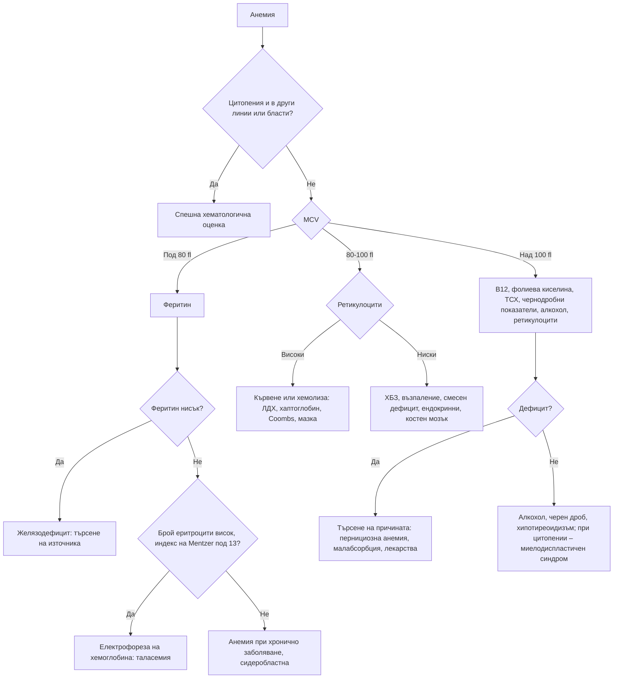

# Глава 32. Анемия

> **Част VII. Кръв и кръвотворни органи**

## Цели на главата

- Да се дефинира анемията и да се оценява нейната тежест и темп на развитие.
- Да се класифицира анемията по средния обем на еритроцитите (MCV) и по броя на ретикулоцитите.
- Да се тълкуват показателите на железния метаболизъм, включително при възпаление.
- Да се разграничават желязодефицитната анемия и бета-таласемия минор.
- Да се разпознават хемолизата, дефицитът на B12 и фолиева киселина и костномозъчните заболявания.
- Да се търси източникът на желязодефицит.

## Ключови моменти

- Анемията по СЗО (2024) е хемоглобин под 130 g/l при мъже и под 120 g/l при небременни жени; при бременност – под 110 g/l в I и III и под 105 g/l във II триместър [1].
- Анемията се класифицира по MCV (микроцитна, нормоцитна, макроцитна) и по ретикулоцитите (загуба или разрушаване срещу нарушена продукция).
- Нисък феритин потвърждава желязодефицита, но при възпаление феритин до около 100 µg/l е съвместим с дефицит. Желязодефицитната анемия при мъж или жена след менопаузата изисква горна ендоскопия, колоноскопия и серология за цьолиакия *(SORT B [3])*.
- Микроцитоза с нормален или висок брой еритроцити и нормален феритин (индекс на Mentzer под 13) е бета-таласемия минор. В България носителите са около 2–3% [2, 4, 5].
- Дефицитът на B12 може да причини тежко неврологично увреждане без анемия. Фолиева киселина не се дава, преди да се изключи дефицит на B12 *(SORT C [6])*.
- Анемия с тромбоцитопения и шистоцити е тромботична микроангиопатия – спешно състояние *(SORT C [7])*.

---

## 1. Определение

Анемия (по СЗО, 2024): хемоглобин под 130 g/l при мъже и под 120 g/l при небременни жени на възраст 15–65 години. При бременност границата е 110 g/l в I и III триместър и 105 g/l във II триместър [1]. Референтните граници варират според лабораторията, възрастта и етническия произход.

Клиничните прояви зависят повече от скоростта на развитие, отколкото от абсолютната стойност. Хроничната анемия с хемоглобин 70 g/l може да протича с минимални симптоми. Остра загуба на същото количество кръв предизвиква шок.

**Симптоми:** умора, задух при усилие, сърцебиене, световъртеж, главоболие, стенокардия, клаудикация, декомпенсация на сърдечна недостатъчност.

**Специфични белези:**

- **желязодефицит** – койлонихия, ангуларен хейлит, глосит, пика (желание за ядене на лед, пръст, нишесте), синдром на неспокойните крака;
- **дефицит на B12** – невропатия, атаксия, когнитивни нарушения, глосит;
- **хемолиза** – жълтеница, тъмна урина, спленомегалия.

---

## 2. Класификация по MCV

*Таблица 32.1. Класификация по MCV.*

| Микроцитна (MCV < 80 fl) | Нормоцитна (MCV 80–100 fl) | Макроцитна (MCV > 100 fl) |
|---|---|---|
| **Желязодефицитна анемия** (най-честата) | **Остра кръвозагуба** | Мегалобластна: дефицит на B12 или фолиева киселина, лекарства (метотрексат, хидроксиурея, азатиоприн, зидовудин) |
| **Таласемия** (особено бета-таласемия минор) | Анемия при хронично заболяване (възпаление) | Немегалобластна: алкохол, чернодробно заболяване, хипотиреоидизъм, ретикулоцитоза (хемолиза, кървене) |
| Анемия при хронично заболяване (в 20–30% от случаите) | **Хронично бъбречно заболяване** | **Миелодиспластичен синдром** |
| Сидеробластна анемия (вродена, алкохол, олово) | **Хемолиза** | Мултиплен миелом |
| Отравяне с олово | Смесен дефицит (желязо + B12) | Апластична анемия |
| | Костномозъчна недостатъчност или инфилтрация (миелодиспластичен синдром, апластична анемия, миелом, метастази, левкемия) | Бременност, новородени (физиологично) |
| | Ендокринни (хипотиреоидизъм, хипогонадизъм, надбъбречна недостатъчност) | |
| | Бременност (разреждане) | |

## 3. Класификация по ретикулоцитите

Ретикулоцитите показват дали костният мозък отговаря на анемията.

- Високи ретикулоцити (> 2–3% или > 100 × 10⁹/l) – периферна загуба или разрушаване: кървене, хемолиза, възстановяване след лечение на дефицит.
- **Ниски ретикулоцити** – **нарушена продукция**: дефицити (желязо, B12, фолиева киселина), анемия при хронично заболяване, ХБЗ, костномозъчни заболявания.

---

## 4. Безопасна диагностична стратегия

*Таблица 32.2. Безопасна диагностична стратегия.*

| Въпрос | Отговор |
|---|---|
| **Вероятна диагноза** | Желязодефицитна анемия (менструални загуби, стомашно-чревно кървене, недостатъчен прием), анемия при хронично заболяване, ХБЗ, бета-таласемия минор |
| **Сериозни заболявания, които не бива да се пропускат** | Карцином на стомашно-чревния тракт като източник на желязодефицит; остра левкемия, миелодиспластичен синдром, миелом; хемолиза (включително микроангиопатична – тромботична тромбоцитопенична пурпура, хемолитично-уремичен синдром); тежък дефицит на B12 с неврологично засягане; апластична анемия |
| **Чести капани** | Бета-таласемия минор, лекувана с желязо; цьолиакия като причина за рефрактерен желязодефицит; нормален феритин при възпаление, маскиращ желязодефицит; смесен дефицит с нормален MCV; дефицит на B12 при метформин и ИПП; автоимунен атрофичен гастрит; ангиодисплазии; фолиев дефицит при алкохолизъм |
| **Маскиращи заболявания** | Хронично бъбречно заболяване, хипотиреоидизъм, злокачествени заболявания, лекарства, възпалителни заболявания |
| **Психосоциални аспекти** | Недохранване, алкохол, ограничителни диети, бедност |

---

## 5. Желязодефицитна анемия

### 5.1. Лабораторна диагноза

*Таблица 32.3. Желязодефицитна анемия: лабораторна диагноза.*

| Показател | Желязодефицит | Анемия при хронично заболяване | Бета-таласемия минор |
|---|---|---|---|
| **Феритин** | Нисък (< 15–30 µg/l) | Нормален или висок | Нормален |
| Трансферинова сатурация | < 20% (често < 16%) | Ниска или нормална | Нормална |
| Серумно желязо | Ниско | Ниско | Нормално |
| Общ железосвързващ капацитет (трансферин) | **Висок** | **Нисък** | Нормален |
| MCV | Нисък | Нормален или нисък | Много нисък за степента на анемията |
| Брой еритроцити | Нисък | Нисък | **Нормален или висок** |
| RDW (разпределение на еритроцитите по обем) | **Повишено** | Нормално | Нормално или леко повишено |
| **Индекс на Mentzer** (MCV / брой еритроцити в 10¹²/l) [2] | > 13 | – | **< 13** |
| Електрофореза на хемоглобина | Нормална | Нормална | **HbA₂ > 3,5%** |

**Феритинът при възпаление.** Той е белтък на острата фаза и се повишава при възпаление, инфекция, чернодробно заболяване и злокачествено заболяване. Затова при възпаление стойности до около 100 µg/l могат да бъдат съвместими с желязодефицит. В такъв случай помага трансфериновата сатурация под 20% [3].

**Бета-таласемия минор.** В България носителството на бета-таласемия се среща при около 2–3% от населението, а в някои региони значително по-често [4, 5]. Лека микроцитна анемия с нормален или висок брой еритроцити и нормален феритин е бета-таласемия минор до доказване на противното. Лечението с желязо е ненужно и дори вредно. Важно е генетично консултиране преди бременност, за да се избегне раждане на дете с таласемия майор.

### 5.2. Причини за желязодефицит

*Таблица 32.4. Причини за железен дефицит.*

| Група | Причини |
|---|---|
| **Загуба на кръв** | Обилна менструация (най-честата причина при жени в детеродна възраст); стомашно-чревно кървене (карцином на дебелото черво и стомаха, пептична язва, езофагит, НСПВС, ангиодисплазии, възпалителни болести на червата, хемороиди); хематурия; често кръводаряване; наследствена хеморагична телеангиектазия |
| **Нарушена резорбция** | Цьолиакия, автоимунен атрофичен гастрит, *H. pylori*, гастректомия и бариатрични операции, ИПП, възпалителни болести на червата |
| **Повишени нужди** | Бременност, кърмене, растеж, лечение с еритропоетин |
| **Недостатъчен прием** | Вегетарианска и веганска диета, недохранване (рядко единствена причина при възрастни в развитите страни) |

### 5.3. Търсене на източника

- **Мъже и жени след менопаузата:** **горна ендоскопия и колоноскопия** и серология за цьолиакия. Изследване на урината за хематурия [3].
- **Жени в детеродна възраст:** оценка на менструалните загуби, серология за цьолиакия. Ендоскопия при стомашно-чревни симптоми, възраст над 50 години, фамилна анамнеза за колоректален карцином или неповлияване от лечението.
- **При нормални ендоскопии и персистиране:** видеокапсулна ендоскопия на тънкото черво.

---

## 6. Макроцитна анемия

### 6.1. Дефицит на витамин B12

- **Причини:**
  - **пернициозна анемия** (автоимунен атрофичен гастрит; антитела срещу вътрешния фактор и срещу париеталните клетки);
  - гастректомия и бариатрични операции;
  - заболяване или резекция на терминалния илеум (болест на Crohn);
  - метформин, ИПП;
  - веганска диета;
  - азотен оксид (рекреационна употреба на „райски газ“ – тежка миелопатия при млади хора);
  - рядко – широката тения (*Diphyllobothrium latum*).
- **Неврологични прояви:** периферна невропатия, подостра комбинирана дегенерация на гръбначния мозък (засягане на задните и страничните стълбове – атаксия, нарушено вибрационно и ставно-мускулно усещане, спастичност), когнитивни нарушения, депресия. Неврологичното засягане може да предшества анемията или да протича без нея.
- **Лабораторни белези:** макроцитоза, хиперсегментирани неутрофили, понякога панцитопения, повишени ЛДХ и неконюгиран билирубин (неефективна еритропоеза); нисък B12; при гранични стойности – повишени метилмалонова киселина и хомоцистеин [6].

### 6.2. Дефицит на фолиева киселина

Недостатъчен прием (алкохол, недохранване, възрастни хора), повишени нужди (бременност, хемолиза), малабсорбция (цьолиакия), лекарства (метотрексат, триметоприм, фенитоин). Неврологични прояви липсват. Хомоцистеинът е повишен, а метилмалоновата киселина е нормална.

**Никога не се лекува само с фолиева киселина, преди да се изключи дефицит на B12.** Това може да влоши неврологичното увреждане [6].

### 6.3. Немегалобластна макроцитоза

Алкохол (най-честата причина при макроцитоза без анемия), чернодробно заболяване, хипотиреоидизъм, ретикулоцитоза, миелодиспластичен синдром (при възрастни хора с цитопении), лекарства.

---

## 7. Хемолитична анемия

**Лабораторни белези на хемолиза:**

- **повишени ретикулоцити**;
- **повишена ЛДХ**;
- **повишен неконюгиран билирубин**;
- **понижен (неизмерим) хаптоглобин**;
- при интраваскуларна хемолиза – хемоглобинурия и хемосидеринурия.

**Директният антиглобулинов тест (тест на Coombs)** разделя хемолизата на имунна и неимунна.

*Таблица 32.5. Хемолитична анемия.*

| Имунна (положителен тест на Coombs) | Неимунна (отрицателен тест на Coombs) |
|---|---|
| **Автоимунна хемолитична анемия с топли антитела** – идиопатична, при хронична лимфоцитна левкемия, лимфоми, системен лупус еритематодес, лекарства | Наследствена сфероцитоза (сфероцити, фамилна анамнеза, спленомегалия, жлъчни камъни) |
| **Болест на студовите аглутинини** – *Mycoplasma*, EBV, лимфопролиферативни заболявания; акроцианоза на студ | Дефицит на Г6ФД – епизоди на хемолиза след бакла (фава), инфекции и лекарства (примахин, дапсон, нитрофурантоин, сулфонамиди, расбуриказа); „ухапани“ клетки и телца на Heinz; по-чест при хора от средиземноморски, африкански и близкоизточен произход |
| **Хемолитична трансфузионна реакция** | Хемоглобинопатии (таласемия, сърповидноклетъчна болест) |
| **Хемолитична болест на новороденото** | Микроангиопатична хемолитична анемия – шистоцити; тромботична тромбоцитопенична пурпура, хемолитично-уремичен синдром, ДВС, HELLP синдром, малигнена хипертония, механични клапи |
| | Пароксизмална нощна хемоглобинурия (хемолиза, тромбози, цитопении) |
| | Инфекции (малария, клостридиален сепсис), токсини (змийска отрова, олово, мед при болест на Wilson), изгаряния |

Микроангиопатична хемолитична анемия с тромбоцитопения (шистоцити в мазката) е спешно състояние. Тромботичната тромбоцитопенична пурпура е летална без спешна плазмафереза [7].

---

## 8. Нормоцитна анемия с ниски ретикулоцити

- **Анемия при хронично заболяване** (възпаление, инфекция, злокачествено заболяване). Лабораторно: ниско серумно желязо, нисък трансферин, нормален или висок феритин.
- **Хронично бъбречно заболяване** – дефицит на еритропоетин, обикновено при eGFR < 30–45 ml/min.
- **Костномозъчна недостатъчност или инфилтрация.** Насочват към нея **цитопенията в повече от една линия**, бластите и левкоеритробластната картина в мазката (незрели гранулоцити и нормобласти – при инфилтрация от метастази, миелофиброза, миелом, лимфом).
- **Ендокринни причини:** хипотиреоидизъм, хипогонадизъм при мъже, надбъбречна недостатъчност, хипопитуитаризъм.
- **Смесен дефицит** (желязо + B12 или фолиева киселина). MCV може да е нормален, а RDW е силно повишено.

---

## 9. Червени флагове

- Хемоглобин под 70–80 g/l или бързо спадане.
- Симптоми на хемодинамична нестабилност, стенокардия, сърдечна недостатъчност.
- Цитопения в повече от една линия (панцитопения) или бласти в мазката.
- **Шистоцити** и тромбоцитопения (тромботична микроангиопатия).
- Жълтеница с анемия и тъмна урина (хемолиза).
- Желязодефицитна анемия при мъж или при жена след менопаузата (карцином на стомашно-чревния тракт).
- Неврологични симптоми при дефицит на B12.
- Лимфаденопатия, спленомегалия, треска, нощно изпотяване, загуба на тегло.
- Болки в костите, хиперкалциемия, бъбречна недостатъчност (миелом).

---

## 10. Изследвания

**Първи етап:**

- ПКК с индекси (MCV, MCH, RDW), **ретикулоцити**;
- **мазка от периферна кръв**;
- **феритин**, трансферинова сатурация;
- витамин B12, фолиева киселина;
- креатинин, чернодробни показатели, CRP, ТСХ.

**Втори етап (според находките):**

- ЛДХ, билирубин, хаптоглобин, директен тест на Coombs (хемолиза);
- електрофореза на хемоглобина (таласемия);
- антитела срещу вътрешния фактор, метилмалонова киселина;
- серология за цьолиакия;
- ендоскопии;
- електрофореза на серумните белтъци и свободни леки вериги (миелом);
- **костномозъчна пункция и биопсия** (цитопении, бласти, неясна анемия).

---

## 11. Диагностичен алгоритъм

*Фигура 32.1. Диагностичен алгоритъм: анемия. Схема на авторите въз основа на източниците, цитирани в главата.*

Текстово описание на фигура 32.1

1. Анемия. Следва: към т. 2.
2. **Въпрос:** Цитопения и в други линии или бласти? Да – към т. 3; Не – към т. 4.
3. Спешна хематологична оценка.
4. **Въпрос:** MCV Под 80 fl – към т. 5; 80-100 fl – към т. 6; Над 100 fl – към т. 7.
5. Феритин. Следва: към т. 8.
6. **Въпрос:** Ретикулоцити Високи – към т. 9; Ниски – към т. 10.
7. B12, фолиева киселина, ТСХ, чернодробни показатели, алкохол, ретикулоцити. Следва: към т. 11.
8. **Въпрос:** Феритин нисък? Да – към т. 12; Не – към т. 13.
9. Кървене или хемолиза: ЛДХ, хаптоглобин, Coombs, мазка.
10. ХБЗ, възпаление, смесен дефицит, ендокринни, костен мозък.
11. **Въпрос:** Дефицит? Да – към т. 14; Не – към т. 15.
12. Желязодефицит: търсене на източника.
13. **Въпрос:** Брой еритроцити висок, индекс на Mentzer под 13? Да – към т. 16; Не – към т. 17.
14. Търсене на причината: пернициозна анемия, малабсорбция, лекарства.
15. Алкохол, черен дроб, хипотиреоидизъм; при цитопении – миелодиспластичен синдром.
16. Електрофореза на хемоглобина: таласемия.
17. Анемия при хронично заболяване, сидеробластна.

---

## 12. Кога и колко спешно да насочим

*Таблица 32.6. Кога и колко спешно да насочим.*

| Спешност | Клинична ситуация |
|---|---|
| **Незабавно (112 или спешно отделение)** | Анемия с хемодинамична нестабилност, стенокардия или активно кървене; анемия с тромбоцитопения и шистоцити (тромботична микроангиопатия) [7]; тежка хемолиза |
| **В същия ден** | Хемоглобин под 70–80 g/l без ясна причина; панцитопения или бласти в мазката; дефицит на B12 с неврологични симптоми (атаксия, подостра комбинирана дегенерация) |
| **Бързо (до 2 седмици)** | Желязодефицитна анемия при мъж или жена след менопаузата (горна ендоскопия и колоноскопия) [3]; анемия с лимфаденопатия, спленомегалия или B-симптоми; анемия с хиперкалциемия или бъбречно увреждане (миелом) |
| **Планово** | Рефрактерна желязодефицитна анемия въпреки лечението; хемолиза без признаци на тежест; макроцитоза с цитопения при възрастен човек (миелодиспластичен синдром) |
| **Проследяване в общата практика** | Желязодефицитна анемия при жена в детеродна възраст с обилна менструация; бета-таласемия минор (генетично консултиране преди бременност); лека анемия при ХБЗ или хронично възпаление |

---

## 13. Клинични перли

- Всяка желязодефицитна анемия при мъж или при жена след менопаузата изисква изследване на стомашно-чревния тракт, дори при положителен отговор на желязо.
- Микроцитоза с нормален или висок брой еритроцити и нормален феритин е бета-таласемия минор. Не я лекувайте с желязо.
- Феритинът е висок при възпаление. Нормалният феритин не изключва желязодефицит при пациент с възпалително заболяване.
- Дефицитът на B12 може да причини тежко неврологично увреждане без анемия.
- Не давайте фолиева киселина без предварително изключване на дефицит на B12.
- Анемия + тромбоцитопения + шистоцити = тромботична микроангиопатия. Това е спешно състояние.
- Хемолиза след консумация на бакла или след определени лекарства: дефицит на Г6ФД.
- Рефрактерна желязодефицитна анемия: цьолиакия, *H. pylori*, атрофичен гастрит, продължаващо кървене или неспазване на лечението.
- Възрастен пациент с макроцитоза и цитопении: миелодиспластичен синдром.

---

## 14. Клиничен случай

**Етап 1 – представяне.** Жена на 32 години е насочена за „рефрактерна желязодефицитна анемия“. Приема перорално желязо от 8 месеца без ефект и има стомашно-чревни оплаквания от лечението. Родителите ѝ са от Южна България. Планира бременност.

> **Въпрос 1.** Кои въпроси и изследвания ще уточнят дали това е желязодефицит?

**Етап 2 – изследвания.** Хемоглобин 112 g/l, MCV 64 fl, брой еритроцити 5,6 × 10¹²/l, RDW нормално, феритин 68 µg/l.

> **Въпрос 2.** Желязодефицит ли е това?

> **Въпрос 3.** Кое изследване е показано и защо е важно точно сега?

Обсъждане и отговори

**Отговор 1.** Феритин, трансферинова сатурация, брой еритроцити, RDW и индекс на Mentzer. Уточняват се менструалните загуби, стомашно-чревните симптоми и спазването на лечението.

**Отговор 2.** Не. Много ниският MCV при лека анемия, високият брой еритроцити, нормалното RDW, нормалният феритин и индексът на Mentzer (64 / 5,6 ≈ 11,4, т.е. под 13) насочват към бета-таласемия минор [2].

**Отговор 3.** Електрофорезата на хемоглобина показва HbA₂ 5,2%, което потвърждава диагнозата. Желязото се спира. Пациентката планира бременност, затова **партньорът ѝ трябва да бъде изследван**. Ако и двамата са носители, рискът детето да има таласемия майор е 25%. Необходимо е генетично консултиране с възможност за пренатална диагностика.

**Поука.** Не всяка микроцитоза е желязодефицит. В България бета-таласемия минор трябва винаги да се има предвид [4, 5].

---

## Обобщение

- Анемията се определя по праговете на СЗО (2024) и се класифицира по MCV и ретикулоцитите. Клиничните прояви зависят повече от скоростта на развитие, отколкото от стойността на хемоглобина.
- Желязодефицитът е най-честата причина. Източникът му трябва да се търси, особено при мъже и жени след менопаузата.
- Бета-таласемия минор, анемията при хронично заболяване и смесеният дефицит са чести капани при тълкуването на показателите.
- Дефицитът на B12, хемолизата и костномозъчните заболявания изискват насочени изследвания. Цитопенията в няколко линии и шистоцитите са червени флагове.

## Самопроверка

### Въпроси с един верен отговор

**1.** *(основно ниво)* Жена на 28 години във II триместър на бременността има хемоглобин 108 g/l. Има ли анемия по СЗО (2024)?

- **А.** Да, защото прагът е 110 g/l през цялата бременност
- **Б.** Не, защото прагът във II триместър е 105 g/l
- **В.** Да, защото прагът е 120 g/l
- **Г.** Не, защото при бременност анемия не се диагностицира
- **Д.** Не може да се прецени без феритин

Отговор и обосновка

**Верен отговор: Б.** По СЗО (2024) прагът е 110 g/l в I и III триместър и 105 g/l във II триместър [1]. Хемоглобин 108 g/l във II триместър не е анемия, но при следващи изследвания в III триместър прагът отново е 110 g/l.

**2.** *(основно ниво)* Мъж на 60 години има хемоглобин 105 g/l, MCV 72 fl и феритин 8 µg/l. Няма стомашно-чревни симптоми. Кое е правилното поведение?

- **А.** Перорално желязо и контрол след 3 месеца без други изследвания
- **Б.** Желязо, горна ендоскопия, колоноскопия и серология за цьолиакия
- **В.** Електрофореза на хемоглобина
- **Г.** Костномозъчна биопсия
- **Д.** Само FIT

Отговор и обосновка

**Верен отговор: Б.** Желязодефицитната анемия при мъж изисква изследване на целия стомашно-чревен тракт и серология за цьолиакия, дори без симптоми [3]. А пропуска карцином. В и Г не отговарят на ниския феритин. Д не замества ендоскопиите.

**3.** *(основно ниво)* Жена на 55 години има изтръпване на краката, нестабилна походка и нарушено вибрационно усещане. Хемоглобинът е нормален, а MCV е 99 fl. Кое изследване е задължително?

- **А.** ЯМР на главата само
- **Б.** Витамин B12 (и при гранична стойност – метилмалонова киселина)
- **В.** Фолиева киселина и лечение с фолиева киселина
- **Г.** Феритин
- **Д.** Електромиография само

Отговор и обосновка

**Верен отговор: Б.** Дефицитът на B12 може да причини подостра комбинирана дегенерация на гръбначния мозък без анемия [6]. В е опасно, защото фолиевата киселина без B12 може да влоши неврологичното увреждане. А, Г и Д не отговарят на хипотезата.

**4.** *(напреднало ниво)* Жена на 40 години има хемоглобин 82 g/l, тромбоцити 22 × 10⁹/l, шистоцити в мазката, повишена ЛДХ, объркване и субфебрилитет. Кое е правилното поведение?

- **А.** Преливане на тромбоцити и контрол след седмица
- **Б.** Незабавно насочване заради подозрение за тромботична тромбоцитопенична пурпура
- **В.** Желязо и витамин B12
- **Г.** Кортикостероид перорално и наблюдение
- **Д.** Костномозъчна биопсия планово

Отговор и обосновка

**Верен отговор: Б.** Микроангиопатичната хемолитична анемия с тромбоцитопения, неврологични симптоми и треска насочва към тромботична тромбоцитопенична пурпура, която е летална без спешна плазмафереза [7]. А може да влоши състоянието. В, Г и Д забавят лечението.

**5.** *(напреднало ниво)* Мъж на 30 години от средиземноморски произход има жълтеница и тъмна урина 2 дни след консумация на бакла. Хемоглобинът е 90 g/l, ретикулоцитите са повишени, а тестът на Coombs е отрицателен. Коя е най-вероятната диагноза?

- **А.** Автоимунна хемолитична анемия
- **Б.** Дефицит на Г6ФД
- **В.** Наследствена сфероцитоза
- **Г.** Пароксизмална нощна хемоглобинурия
- **Д.** Болест на студовите аглутинини

Отговор и обосновка

**Верен отговор: Б.** Епизодът на Coombs-отрицателна хемолиза след бакла е типичен за дефицит на Г6ФД. А и Д протичат с положителен тест на Coombs. В обикновено е хронична, с фамилна анамнеза. Г протича с тромбози и цитопении.

### Задача

При жена на 34 години хемоглобинът е 108 g/l, MCV – 66 fl, броят на еритроцитите – 5,4 × 10¹²/l, RDW е нормално, а феритинът – 55 µg/l. Изчислете индекса на Mentzer и определете следващата стъпка.

Решение

Индексът на Mentzer = MCV / брой еритроцити = 66 / 5,4 ≈ 12,2 (под 13). Заедно с високия брой еритроцити, нормалното RDW и нормалния феритин това насочва към бета-таласемия минор, а не към желязодефицит [2]. Следващата стъпка е електрофореза на хемоглобина (HbA₂ над 3,5% потвърждава носителството). Желязо не се дава. Ако пациентката планира бременност, се изследва и партньорът и се предлага генетично консултиране [4].

### OSCE станция: Тълкуване на кръвна картина при анемия

**Време:** 8 минути. **Ниво:** основно (студенти, специализанти).

**Задача за кандидата.** Тълкувайте резултатите на жена на 68 години с умора и предложете план.

**Информация за симулирания пациент (за изпитващия).** Хемоглобин 98 g/l, MCV 112 fl, левкоцити 3,1 × 10⁹/l, тромбоцити 110 × 10⁹/l, ретикулоцити ниски. Витамин B12 90 pmol/l (нисък), фолиева киселина – нормална. Има изтръпване на пръстите на краката. Приема метформин от 10 години и омепразол.

*Таблица 32.7. OSCE станция „Тълкуване на кръвна картина при анемия“ – критерии за оценяване.*

| Критерий | Точки |
|---|---|
| Определя анемията като макроцитна с ниски ретикулоцити (нарушена продукция) | 2 |
| Разпознава панцитопенията като възможна проява на мегалобластна анемия | 1 |
| Свързва ниския B12 с метформина, омепразола и възможна пернициозна анемия | 2 |
| Предлага антитела срещу вътрешния фактор и мазка (хиперсегментирани неутрофили) | 1 |
| Разпознава неврологичните симптоми като показание за бързо лечение | 1 |
| Посочва, че не се дава само фолиева киселина | 1 |
| Посочва, че при персистиране на цитопенията след лечението е нужна хематологична оценка (миелодиспластичен синдром) | 2 |
| Обяснява плана на пациентката | 1 |
| **Общо** | **11** |

**Праг за успешно представяне:** 8 от 11 точки, включително връзката с лекарствата и неврологичното засягане.

## Литература

1. World Health Organization. Guideline on haemoglobin cutoffs to define anaemia in individuals and populations. Geneva: WHO; 2024. Достъпно на: https://www.who.int/publications/i/item/9789240088542
2. Mentzer WC Jr. Differentiation of iron deficiency from thalassaemia trait. Lancet. 1973;1(7808):882. doi:10.1016/s0140-6736(73)91446-3. PMID: 4123424.
3. Snook J, Bhala N, Beales ILP, Cannings D, Kightley C, Logan RP, et al. British Society of Gastroenterology guidelines for the management of iron deficiency anaemia in adults. Gut. 2021;70(11):2030-2051. doi:10.1136/gutjnl-2021-325210. PMID: 34497146.
4. Petkov GH, Efremov GD. Molecular basis of beta-thalassemia and other hemoglobinopathies in Bulgaria: an update. Hemoglobin. 2007;31(2):225-32. doi:10.1080/03630260701290316. PMID: 17486505.
5. Kalaydjieva L, Eigel A, Horst J. The molecular basis of beta thalassaemia in Bulgaria. J Med Genet. 1989;26(10):614-8. doi:10.1136/jmg.26.10.614. PMID: 2577233.
6. Devalia V, Hamilton MS, Molloy AM; British Committee for Standards in Haematology. Guidelines for the diagnosis and treatment of cobalamin and folate disorders. Br J Haematol. 2014;166(4):496-513. doi:10.1111/bjh.12959. PMID: 24942828.
7. Zheng XL, Vesely SK, Cataland SR, Coppo P, Geldziler B, Iorio A, et al. ISTH guidelines for the diagnosis of thrombotic thrombocytopenic purpura. J Thromb Haemost. 2020;18(10):2486-2495. doi:10.1111/jth.15006. PMID: 32914582.

*Последна проверка на съдържанието: септември 2026 г. Следващ планиран преглед: септември 2027 г. (вж. „Политика за актуализация“ в README).*

<!-- навигация -->

---

[← Глава 31. Киселинно-алкални нарушения](31-kiselinno-alkalni.md) · [Съдържание](../README.md) · [Глава 33. Отклонения в левкоцитите и тромбоцитите; еритроцитоза →](33-levkotsiti-trombotsiti.md)
