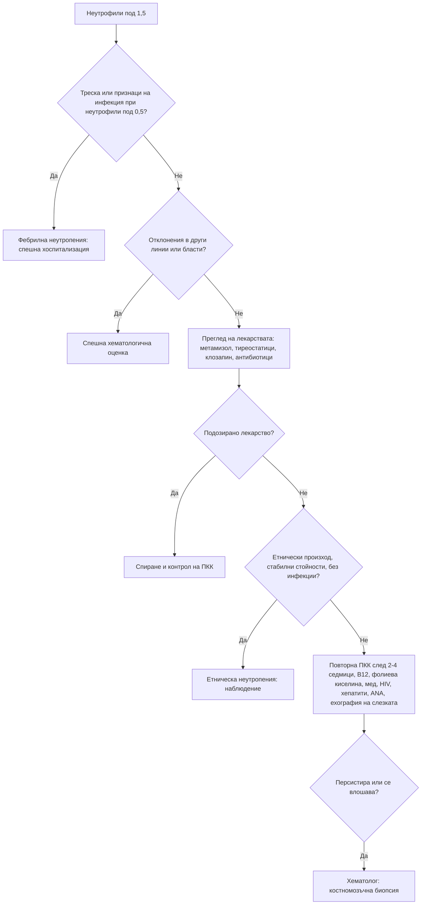

# Глава 33. Отклонения в левкоцитите и тромбоцитите; еритроцитоза

> **Част VII. Кръв и кръвотворни органи**

## Цели на главата

- Да се тълкуват отклоненията в отделните левкоцитни популации: неутрофили, лимфоцити, моноцити, еозинофили, базофили.
- Да се разпознава тежката неутропения и лекарствената агранулоцитоза, включително от метамизол.
- Да се подхожда систематично към тромбоцитопенията и тромбоцитозата.
- Да се разграничават първичната и вторичната еритроцитоза.
- Да се използва мазката от периферна кръв като диагностичен инструмент.

---

## 1. Основни принципи

- **Абсолютните стойности** са по-важни от процентите.
- **Изолираното** леко отклонение при здрав човек често е преходно или е вариант на нормата. Изследването се **повтаря** след 2–6 седмици.
- **Отклонения в повече от една клетъчна линия** или **незрели клетки** (бласти) изискват спешна хематологична оценка.
- **Мазката от периферна кръв** е евтино и изключително информативно изследване.

---

## А. ЛЕВКОЦИТИ

## 2. Неутрофилия (> 7,5 × 10⁹/l)

| Група | Причини |
|---|---|
| **Инфекции** | Бактериални (най-честа причина), някои гъбични |
| **Възпаление и тъканна некроза** | Ревматоиден артрит, васкулити, възпалителни болести на червата, миокарден инфаркт, изгаряния, панкреатит |
| **Физиологичен стрес** | Операция, травма, гърчове, интензивно усилие, бременност |
| **Лекарства** | **Кортикостероиди** (демаргинация), литий, бета-агонисти, адреналин, G-CSF |
| **Други реактивни** | **Тютюнопушене**, затлъстяване, след спленектомия, кървене, хемолиза, диабетна кетоацидоза, злокачествени тумори |
| **Първични (миелопролиферативни)** | **Хронична миелоидна левкемия** (базофилия, еозинофилия, изместване наляво с миелоцити, спленомегалия; BCR-ABL1), други миелопролиферативни неоплазми, хронична неутрофилна левкемия |

**Левкемоидна реакция** (левкоцити > 50 × 10⁹/l с изместване наляво) се наблюдава при тежки инфекции (например *C. difficile*), злокачествени заболявания и тежко кървене. Тя трябва да се разграничи от хроничната миелоидна левкемия. **Хиперлевкоцитоза** над 100 × 10⁹/l при остра левкемия е спешно състояние поради левкостаза.

## 3. Неутропения

| Степен | Абсолютен брой неутрофили (× 10⁹/l) |
|---|---|
| Лека | 1,0–1,5 |
| Умерена | 0,5–1,0 |
| **Тежка** | **< 0,5** (висок риск от тежки инфекции) |

**Причини:**

- **Етническа неутропения** (неутрофили, свързани с Duffy-нулев фенотип) — хора от африкански и близкоизточен произход; доброкачествена, без повишен риск от инфекции.
- **Инфекции:** вирусни (грип, EBV, хепатити, HIV, COVID-19), тежък сепсис, туберкулоза, бруцелоза, коремен тиф, **лайшманиоза**, рикетсиози.
- **Лекарства — идиосинкратична агранулоцитоза:**
  - **метамизол** (аналгин) — широко използван в България, включително без рецепта;
  - **тиамазол, карбимазол, пропилтиоурацил** — затова пациентите на тиреостатици трябва да спрат лекарството и да изследват ПКК при треска или болки в гърлото;
  - **клозапин** (изисква редовно мониториране);
  - сулфасалазин, триметоприм/сулфаметоксазол, бета-лактами (високи дози, продължително), ванкомицин, карбамазепин, деферипрон, ритуксимаб (късна неутропения).
- **Лекарства — дозозависими:** химиотерапия, азатиоприн (особено при дефицит на TPMT), метотрексат, микофенолат, валганцикловир.
- **Хранителни дефицити:** B12, фолиева киселина, **мед**, гладуване.
- **Автоимунни:** системен лупус еритематодес, **синдром на Felty** (ревматоиден артрит, спленомегалия, неутропения), левкемия от големи гранулирани лимфоцити, автоимунна неутропения.
- **Хиперспленизъм.**
- **Костномозъчна недостатъчност или инфилтрация:** апластична анемия, миелодиспластичен синдром, левкемии, миелофиброза, метастази.
- **Вродени:** циклична неутропения (цикли от около 21 дни), тежка вродена неутропения.
- Алкохол.

**Фебрилната неутропения** (температура ≥ 38 °C при неутрофили < 0,5 × 10⁹/l) е **спешно състояние**. Изисква незабавна хоспитализация и емпирична антибиотична терапия.

## 4. Лимфоцитоза (> 4 × 10⁹/l)

- **Вирусни инфекции:** EBV и CMV (атипични лимфоцити), хепатити.
- **Коклюш** (изразена лимфоцитоза при деца), токсоплазмоза, туберкулоза.
- **Преходна стресова лимфоцитоза** (травма, сърдечни събития), тютюнопушене, след спленектомия.
- **Хронична лимфоцитна левкемия** (възрастни хора, „смачкани“ клетки в мазката, **имунофенотипизация** с поточна цитометрия: > 5 × 10⁹/l моноклонални B-лимфоцити). При под 5 × 10⁹/l без други прояви се говори за моноклонална B-лимфоцитоза.
- Други лимфопролиферативни заболявания: левкемична фаза на лимфоми, космоклетъчна левкемия (с **моноцитопения** и спленомегалия), левкемия от големи гранулирани лимфоцити (с неутропения и ревматоиден артрит).
- Остра лимфобластна левкемия.
- Лекарствена свръхчувствителност (DRESS синдром).

## 5. Лимфопения (< 1,0 × 10⁹/l)

HIV, **кортикостероиди**, химиотерапия и ритуксимаб, лимфом на Hodgkin, системен лупус еритематодес, саркоидоза, туберкулоза, вирусни инфекции (COVID-19, грип), алкохол, недохранване, уремия, обикновена вариабилна имунна недостатъчност, лъчетерапия.

## 6. Моноцитоза (> 1,0 × 10⁹/l)

Туберкулоза, **инфекциозен ендокардит**, бруцелоза, възстановяване след неутропения, възпалителни болести на червата, саркоидоза, **хронична миеломоноцитна левкемия** (персистираща моноцитоза над 3 месеца при възрастни хора), остра миелоидна левкемия с моноцитна диференциация.

## 7. Еозинофилия (> 0,5 × 10⁹/l)

| Група | Причини |
|---|---|
| **Алергични** | Астма, алергичен ринит, атопичен дерматит |
| **Лекарства** | **DRESS синдром** (антиепилептични, алопуринол, сулфонамиди, антибиотици) |
| **Паразити (хелминти)** | *Strongyloides* (може да персистира десетилетия; риск от хиперинфекция при кортикостероиди!), *Toxocara*, **трихинела**, **ехинокок** (особено при пропускане на кистата), *Fasciola*, *Ascaris* (синдром на Löffler), анкилостоми, шистозоми |
| **Белодробни** | Алергична бронхопулмонална аспергилоза, еозинофилна пневмония, **еозинофилна грануломатоза с полиангиит** |
| **Стомашно-чревни** | Еозинофилен езофагит и гастроентерит |
| **Ендокринни** | **Надбъбречна недостатъчност** |
| **Злокачествени** | Лимфом на Hodgkin, T-клетъчни лимфоми, солидни тумори |
| **Кожни** | Булозен пемфигоид |
| **Миелоидни неоплазми** | Хронична еозинофилна левкемия, системна мастоцитоза, неоплазми с пренареждане на PDGFRA/PDGFRB |
| **Хипереозинофилен синдром** | Еозинофили > 1,5 × 10⁹/l с органно увреждане (сърце — ендокардна фиброза, бял дроб, кожа, нерви) |
| **Други** | Холестеролова емболия, IgG4-свързано заболяване |

## 8. Базофилия

Хронична миелоидна левкемия и други миелопролиферативни неоплазми, хипотиреоидизъм (лека), алергии, възпалителни болести на червата.

---

## Б. ТРОМБОЦИТИ

## 9. Тромбоцитопения (< 150 × 10⁹/l)

### 9.1. Първо изключете псевдотромбоцитопения

**EDTA-индуцираната агрегация на тромбоцитите** дава фалшиво нисък брой. В мазката се виждат тромбоцитни агрегати. Броят се **повтаря в епруветка с цитрат**.

### 9.2. Причини

| Механизъм | Причини |
|---|---|
| **Намалена продукция** | Костномозъчна недостатъчност или инфилтрация (левкемия, миелодиспластичен синдром, апластична анемия, миелофиброза, метастази), дефицит на B12 и фолиева киселина, **алкохол** (пряка токсичност), вирусни инфекции (HIV, хепатит C, EBV, парвовирус B19), химиотерапия, лъчетерапия, линезолид |
| **Повишено разрушаване — имунно** | **Имунна тромбоцитопения** (изолирана тромбоцитопения с иначе нормални ПКК и мазка; при деца след вирусна инфекция), **лекарствена** (**хинин** — включително от тоник, хепарин, ванкомицин, бета-лактами, триметоприм/сулфаметоксазол, карбамазепин, валпроат), **хепарин-индуцирана тромбоцитопения**, системен лупус еритематодес, антифосфолипиден синдром, HIV, хепатит C, *H. pylori*, хронична лимфоцитна левкемия, посттрансфузионна пурпура |
| **Повишено разрушаване — неимунно** | **Тромботична микроангиопатия** (тромботична тромбоцитопенична пурпура, хемолитично-уремичен синдром), **ДВС**, **HELLP синдром** и прееклампсия, сепсис, механични клапи |
| **Секвестрация** | **Хиперспленизъм** (цироза с портална хипертония — обикновено 50–100 × 10⁹/l) |
| **Разреждане** | **Гестационна тромбоцитопения** (III триместър, обикновено > 70 × 10⁹/l), масивни кръвопреливания |
| **Инфекции, особено важни в България** | **Кримска-Конго хеморагична треска**, **хантавирусна инфекция**, лептоспироза, марсилска треска, бруцелоза, малария (при пътували), денга |

### 9.3. Тежест

- **< 50 × 10⁹/l** — риск от кървене при процедури и травми.
- **< 20–30 × 10⁹/l** — риск от спонтанно кървене.
- **< 10 × 10⁹/l** — висок риск от тежко (включително вътречерепно) кървене.

### 9.4. Спешни ситуации

- Тромбоцитопения с **шистоцити** и хемолиза (тромботична тромбоцитопенична пурпура — нужна е спешна плазмафереза).
- Тромбоцитопения с **бласти** или с други цитопении.
- Тромбоцитопения с активно кървене.
- **Хепарин-индуцирана тромбоцитопения** с тромбоза.
- ДВС.
- Бременна с тромбоцитопения и хипертония или повишени чернодробни ензими (HELLP).
- Новооткрита тромбоцитопения под 20 × 10⁹/l.

### 9.5. Точков сбор 4T за хепарин-индуцирана тромбоцитопения

| Критерий | 2 точки | 1 точка | 0 точки |
|---|---|---|---|
| **Тромбоцитопения** | Спад > 50% и най-ниска стойност ≥ 20 × 10⁹/l | Спад 30–50% или най-ниска стойност 10–19 × 10⁹/l | Спад < 30% или най-ниска стойност < 10 × 10⁹/l |
| **Време** | 5–10 дни след началото на хепарина или ≤ 1 ден при скорошна (в последните 30 дни) експозиция | Съвместимо, но неясно; след 10-ия ден; или ≤ 1 ден при експозиция преди 30–100 дни | ≤ 4 дни без скорошна експозиция |
| **Тромбоза** | Нова тромбоза, кожна некроза, системна реакция след болус | Прогресираща или рецидивираща тромбоза, суспектна тромбоза | Няма |
| **Друга причина** | Няма | Възможна | Сигурна |

Сбор 0–3 означава ниска вероятност, 4–5 междинна, а 6–8 висока.

## 10. Тромбоцитоза (> 450 × 10⁹/l)

| Реактивна (80–90% от случаите) | Първична (клонална) |
|---|---|
| **Желязодефицит** | **Есенциална тромбоцитемия** (JAK2, CALR, MPL) |
| Инфекция, възпаление (ревматоиден артрит, възпалителни болести на червата) | Полицитемия вера |
| **Злокачествени заболявания** (бял дроб, стомашно-чревен тракт, яйчник, бъбрек) | Първична миелофиброза |
| След спленектомия, хипоспленизъм | Хронична миелоидна левкемия (BCR-ABL1) |
| След кървене, травма, операция | Миелодиспластичен синдром с del(5q) |
| „Отскок“ след тромбоцитопения (спиране на алкохола, лечение с B12) | |

**Тромбоцитозата като маркер за злокачествено заболяване.** При възрастни хора в общата практика необяснимата тромбоцитоза е свързана със значимо повишен риск от злокачествено заболяване. Британските препоръки (NICE) предвиждат при възраст ≥ 40 години с тромбоцитоза да се обсъди рентгенография на гръдния кош, а при съответни симптоми — ендоскопия и ехография на ендометриума.

**Белези, насочващи към първична тромбоцитоза:**

- персистиране над 3 месеца без реактивна причина;
- спленомегалия;
- тромбози или кървене;
- **еритромелалгия** и микроваскуларни симптоми (главоболие, зрителни нарушения);
- много високи стойности, над 1000 × 10⁹/l. При тях има риск от придобита болест на von Willebrand и кървене.

---

## В. ЕРИТРОЦИТОЗА (ПОЛИЦИТЕМИЯ)

## 11. Определение и класификация

**Еритроцитозата** е хемоглобин > 165 g/l при мъже и > 160 g/l при жени или хематокрит > 49% при мъже и > 48% при жени.

| Тип | Причини | Еритропоетин |
|---|---|---|
| **Относителна (привидна)** | Дехидратация, диуретици, „стресова“ полицитемия (синдром на Gaisböck — мъже с наднормено тегло, хипертония, тютюнопушене) | — |
| **Първична** | **Полицитемия вера** (мутация JAK2 V617F в около 95% от случаите, JAK2 екзон 12 в около 3%) | **Нисък** |
| **Вторична — хипоксична** | ХОББ, **обструктивна сънна апнея**, хиповентилация при затлъстяване, висока надморска височина, цианотични вродени сърдечни пороци, **тютюнопушене** (карбоксихемоглобин), хронична експозиция на въглероден оксид, хемоглобини с висок афинитет към кислорода | Висок или нормален |
| **Вторична — нехипоксична** | **Тестостерон** и анаболни стероиди (много честа причина), еритропоетин (допинг), **SGLT2 инхибитори** (лека), тумори, секретиращи еритропоетин (**бъбречноклетъчен карцином**, хепатоцелуларен карцином, хемангиобластом на малкия мозък, големи миоми на матката, феохромоцитом), бъбречни кисти, хидронефроза, след бъбречна трансплантация | Висок или нормален |

**Белези, насочващи към полицитемия вера:** **сърбеж след топла вана или душ** (аквагенен пруритус), **еритромелалгия**, спленомегалия, **тромбози на необичайни места** (синдром на Budd-Chiari, тромбоза на порталната вена, церебрални венозни синуси), съпътстваща левкоцитоза и тромбоцитоза, зачервено лице, главоболие.

**Изследвания:** повторна ПКК, **JAK2 V617F**, серумен еритропоетин, SpO₂, изследване на съня, анамнеза за тютюнопушене и прием на тестостерон, ехография на бъбреците и корема, при нужда костномозъчна биопсия.

---

## 12. Мазка от периферна кръв: основни находки

| Находка | Значение |
|---|---|
| **Бласти** | Остра левкемия — спешно |
| Пръчици на Auer | Остра миелоидна левкемия (промиелоцитната левкемия е спешно състояние поради ДВС) |
| „Смачкани“ клетки | Хронична лимфоцитна левкемия |
| Атипични (реактивни) лимфоцити | Инфекциозна мононуклеоза, CMV, остра HIV инфекция |
| Хиперсегментирани неутрофили | Дефицит на B12 или фолиева киселина |
| Токсична грануларност, телца на Döhle | Бактериална инфекция |
| Псевдо-Pelger-Huët клетки | Миелодиспластичен синдром |
| **Шистоцити** | Тромботична микроангиопатия, ДВС, механични клапи — спешно |
| Сфероцити | Наследствена сфероцитоза, автоимунна хемолиза |
| „Ухапани“ клетки, телца на Heinz | Дефицит на Г6ФД |
| Прицелни клетки | Таласемия, чернодробно заболяване, хипоспленизъм |
| Каплевидни клетки, левкоеритробластна картина | Миелофиброза, костномозъчна инфилтрация |
| Телца на Howell-Jolly | Хипоспленизъм, аспления |
| Монетни стълбчета (руло) | Парапротеинемия (миелом) |
| Тромбоцитни агрегати | Псевдотромбоцитопения |
| Гигантски тромбоцити | Имунна тромбоцитопения, миелопролиферативни неоплазми, наследствени тромбоцитопатии |
| Паразити в еритроцитите | **Малария**, бабезиоза |

---

## 13. Безопасна диагностична стратегия

| Въпрос | Отговор |
|---|---|
| **Вероятна диагноза** | Реактивни промени при инфекция и възпаление, лекарства, тютюнопушене, желязодефицит (тромбоцитоза), вирусни инфекции |
| **Сериозни заболявания, които не бива да се пропускат** | **Остра левкемия**, **агранулоцитоза**, фебрилна неутропения, тромботична тромбоцитопенична пурпура, ДВС, хепарин-индуцирана тромбоцитопения, хронична миелоидна левкемия, миелопролиферативни неоплазми с тромбози, хеморагични трески |
| **Чести капани** | Псевдотромбоцитопения; етническа неутропения; кортикостероидна неутрофилия, приета за инфекция; **метамизол** като причина за агранулоцитоза; тестостерон като причина за еритроцитоза; *Strongyloides* при еозинофилия преди кортикостероидна терапия |
| **Маскиращи заболявания** | Лекарства, злокачествени заболявания, автоимунни заболявания, HIV |
| **Психосоциални аспекти** | Алкохолизъм, злоупотреба с анаболни стероиди, самолечение с аналгетици |

---

## 14. Диагностичен алгоритъм при неутропения

---

## 15. Клинични перли

- Болки в гърлото и треска при пациент на тиамазол или карбимазол: незабавна ПКК.
- Метамизолът (аналгин) може да причини агранулоцитоза дори след кратък прием. Питайте за него при всяка необяснима неутропения.
- Изолираната тромбоцитопения с агрегати в мазката е артефакт. Повторете изследването с цитрат.
- Тромбоцитопения, която започва 5–10 дни след началото на хепарин, особено с тромбоза: хепарин-индуцирана тромбоцитопения. Хепаринът се спира.
- Хинин (включително от тоник или „таблетки за крампи“) може да причини тежка имунна тромбоцитопения.
- Треска, тромбоцитопения и повишени трансаминази след ухапване от кърлеж в ендемичен район: Кримска-Конго хеморагична треска. Строги мерки за инфекциозен контрол.
- Еозинофилия при пациент, който ще получава кортикостероиди и е живял в ендемичен район: изключете *Strongyloides*.
- Сърбеж след топъл душ и висок хематокрит: полицитемия вера.
- Необяснима тромбоцитоза при възрастен човек може да е първият признак на злокачествено заболяване.

---

## 16. Клиничен случай

**Случай.** Жена на 58 години от 3 дни има висока температура, силни болки в гърлото и язви в устата. От месеци приема често метамизол (аналгин) за главоболие, през последната седмица почти ежедневно. При прегледа: температура 39,4 °C, пулс 112/min, АН 104/66 mmHg, некротични язви по сливиците и венците. ПКК: левкоцити 1,1 × 10⁹/l, неутрофили 0,05 × 10⁹/l, хемоглобин и тромбоцити нормални.

**Въпроси.** 1) Каква е диагнозата? 2) Какво е поведението?

**Обсъждане.** Изолираната тежка неутропения (агранулоцитоза) при прием на метамизол, треската и некротичният тонзилит са типична картина на **лекарствено индуцирана агранулоцитоза**. Това е **фебрилна неутропения**, т.е. спешно състояние. Пациентката се хоспитализира веднага. Взимат се хемокултури и се започва емпирично широкоспектърно антибиотично лечение, а при нужда и G-CSF. Метамизолът се спира окончателно и се документира като противопоказан. Агранулоцитозата обикновено отзвучава за 1–2 седмици след спирането на лекарството. Ангината при агранулоцитоза може да се сбърка с обикновен тонзилит. Пълната кръвна картина е задължителна при тежка ангина, особено при пациенти, които приемат рискови лекарства.

**Поука.** Всеки пациент с треска и болки в гърлото, който приема метамизол, тиреостатици, клозапин или сулфасалазин, трябва да има незабавна ПКК.
