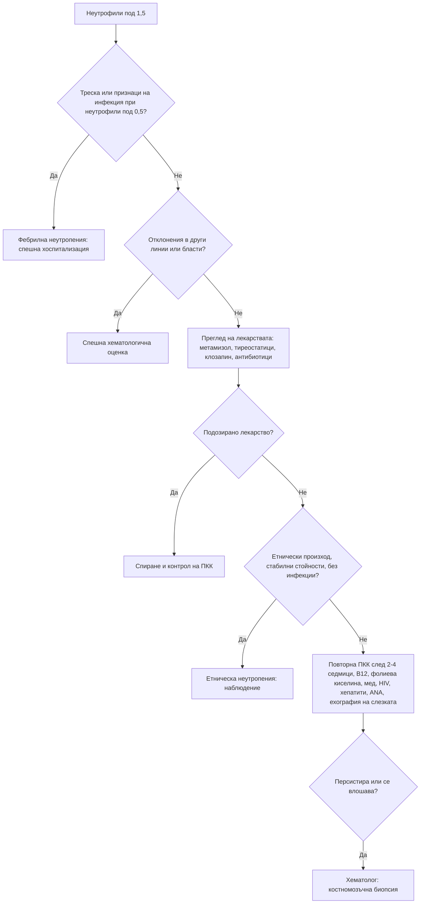

# Глава 33. Отклонения в левкоцитите и тромбоцитите; еритроцитоза

> **Част VII. Кръв и кръвотворни органи**

## Цели на главата

- Да се тълкуват отклоненията в отделните левкоцитни популации: неутрофили, лимфоцити, моноцити, еозинофили, базофили.
- Да се разпознава тежката неутропения и лекарствената агранулоцитоза, включително от метамизол.
- Да се тълкуват тромбоцитопенията и тромбоцитозата по стъпки: потвърждаване (псевдотромбоцитопения), натривка, съпътстващи находки, спешност.
- Да се разграничават първичната и вторичната еритроцитоза.
- Да се използва мазката от периферна кръв като диагностичен инструмент.

## Ключови моменти

- Абсолютните стойности са по-важни от процентите. Изолираното леко отклонение при здрав човек се повтаря след 2–6 седмици, а отклоненията в няколко линии или бластите налагат спешна хематологична оценка.
- Треска при неутрофили под 0,5 × 10⁹/l е фебрилна неутропения — спешно състояние *(SORT C [3])*.
- Метамизолът, тиреостатиците, клозапинът и сулфасалазинът могат да предизвикат агранулоцитоза. При треска или болки в гърлото се прави незабавно ПКК *(SORT C [2])*.
- Изолираната тромбоцитопения с агрегати в мазката е артефакт. Тромбоцитопения 5–10 дни след началото на хепарин се оценява с точковия сбор 4T *(SORT B [5])*.
- Необяснимата тромбоцитоза при възрастен човек може да е първи белег на злокачествено заболяване *(SORT B [6])*.
- Еритроцитозата е относителна, първична (полицитемия вера, JAK2) или вторична (хипоксия, тестостерон, тумори, секретиращи еритропоетин) [7].

---

## 1. Основни принципи

- **Абсолютните стойности** са по-важни от процентите.
- **Изолираното** леко отклонение при здрав човек често е преходно или е вариант на нормата. Изследването се **повтаря** след 2–6 седмици.
- **Отклонения в повече от една клетъчна линия** или **незрели клетки** (бласти) изискват спешна хематологична оценка.
- **Мазката от периферна кръв** е евтино и изключително информативно изследване.

---

## А. ЛЕВКОЦИТИ

## 2. Неутрофилия (> 7,5 × 10⁹/l)

| Група | Причини |
|---|---|
| **Инфекции** | Бактериални (най-честа причина), някои гъбични |
| **Възпаление и тъканна некроза** | Ревматоиден артрит, васкулити, възпалителни болести на червата, миокарден инфаркт, изгаряния, панкреатит |
| **Физиологичен стрес** | Операция, травма, гърчове, интензивно усилие, бременност |
| **Лекарства** | **Кортикостероиди** (демаргинация), литий, бета-агонисти, адреналин, G-CSF |
| **Други реактивни** | **Тютюнопушене**, затлъстяване, след спленектомия, кървене, хемолиза, диабетна кетоацидоза, злокачествени тумори |
| **Първични (миелопролиферативни)** | **Хронична миелоидна левкемия** (базофилия, еозинофилия, изместване наляво с миелоцити, спленомегалия; BCR-ABL1), други миелопролиферативни неоплазми, хронична неутрофилна левкемия |

**Левкемоидна реакция** (левкоцити > 50 × 10⁹/l с изместване наляво) се наблюдава при тежки инфекции (например *C. difficile*), злокачествени заболявания и тежко кървене. Тя трябва да се разграничи от хроничната миелоидна левкемия. **Хиперлевкоцитоза** над 100 × 10⁹/l при остра левкемия е спешно състояние поради левкостаза.

## 3. Неутропения

| Степен | Абсолютен брой неутрофили (× 10⁹/l) |
|---|---|
| Лека | 1,0–1,5 |
| Умерена | 0,5–1,0 |
| **Тежка** | **< 0,5** (висок риск от тежки инфекции) |

**Причини:**

- **Етническа неутропения** (неутрофили, свързани с Duffy-нулев фенотип) — хора от африкански и близкоизточен произход; доброкачествена, без повишен риск от инфекции [1].
- **Инфекции:** вирусни (грип, EBV, хепатити, HIV, COVID-19), тежък сепсис, туберкулоза, бруцелоза, коремен тиф, **лайшманиоза**, рикетсиози.
- **Лекарства — идиосинкратична агранулоцитоза:**
  - **метамизол** (аналгин) — широко използван в България, включително без рецепта. Европейската агенция по лекарствата засили предупрежденията: при треска, болки в гърлото или язви в устата лекарството се спира и незабавно се изследва ПКК; комбинацията с метотрексат се избягва [2];
  - **тиамазол, карбимазол, пропилтиоурацил** — затова пациентите на тиреостатици трябва да спрат лекарството и да изследват ПКК при треска или болки в гърлото;
  - **клозапин** (изисква редовно мониториране);
  - сулфасалазин, триметоприм/сулфаметоксазол, бета-лактами (високи дози, продължително), ванкомицин, карбамазепин, деферипрон, ритуксимаб (късна неутропения).
- **Лекарства — дозозависими:** химиотерапия, азатиоприн (особено при дефицит на TPMT), метотрексат, микофенолат, валганцикловир.
- **Хранителни дефицити:** B12, фолиева киселина, **мед**, гладуване.
- **Автоимунни:** системен лупус еритематодес, **синдром на Felty** (ревматоиден артрит, спленомегалия, неутропения), левкемия от големи гранулирани лимфоцити, автоимунна неутропения.
- **Хиперспленизъм.**
- **Костномозъчна недостатъчност или инфилтрация:** апластична анемия, миелодиспластичен синдром, левкемии, миелофиброза, метастази.
- **Вродени:** циклична неутропения (цикли от около 21 дни), тежка вродена неутропения.
- Алкохол.

**Фебрилната неутропения** (температура над 38 °C или други белези на сепсис при неутрофили < 0,5 × 10⁹/l — определение на NICE, използвано и в глава 77) е **спешно състояние** [3]. Изисква незабавна хоспитализация и емпирична антибиотична терапия.

## 4. Лимфоцитоза (> 4 × 10⁹/l)

- **Вирусни инфекции:** EBV и CMV (атипични лимфоцити), хепатити.
- **Коклюш** (изразена лимфоцитоза при деца), токсоплазмоза, туберкулоза.
- **Преходна стресова лимфоцитоза** (травма, сърдечни събития), тютюнопушене, след спленектомия.
- **Хронична лимфоцитна левкемия** (възрастни хора, „смачкани“ клетки в мазката, **имунофенотипизация** с поточна цитометрия: > 5 × 10⁹/l моноклонални B-лимфоцити). При под 5 × 10⁹/l без други прояви се говори за моноклонална B-лимфоцитоза.
- Други лимфопролиферативни заболявания: левкемична фаза на лимфоми, космоклетъчна левкемия (с **моноцитопения** и спленомегалия), левкемия от големи гранулирани лимфоцити (с неутропения и ревматоиден артрит).
- Остра лимфобластна левкемия.
- Лекарствена свръхчувствителност (DRESS синдром).

## 5. Лимфопения (< 1,0 × 10⁹/l)

HIV, **кортикостероиди**, химиотерапия и ритуксимаб, лимфом на Hodgkin, системен лупус еритематодес, саркоидоза, туберкулоза, вирусни инфекции (COVID-19, грип), алкохол, недохранване, уремия, обикновена вариабилна имунна недостатъчност, лъчетерапия.

## 6. Моноцитоза (> 1,0 × 10⁹/l)

Туберкулоза, **инфекциозен ендокардит**, бруцелоза, възстановяване след неутропения, възпалителни болести на червата, саркоидоза, **хронична миеломоноцитна левкемия** (персистираща моноцитоза над 3 месеца при възрастни хора), остра миелоидна левкемия с моноцитна диференциация.

## 7. Еозинофилия (> 0,5 × 10⁹/l)

| Група | Причини |
|---|---|
| **Алергични** | Астма, алергичен ринит, атопичен дерматит |
| **Лекарства** | **DRESS синдром** (антиепилептични, алопуринол, сулфонамиди, антибиотици) |
| **Паразити (хелминти)** | *Strongyloides* (може да персистира десетилетия; риск от хиперинфекция при кортикостероиди!), *Toxocara*, **трихинела**, **ехинокок** (особено при пропускане на кистата), *Fasciola*, *Ascaris* (синдром на Löffler), анкилостоми, шистозоми |
| **Белодробни** | Алергична бронхопулмонална аспергилоза, еозинофилна пневмония, **еозинофилна грануломатоза с полиангиит** |
| **Стомашно-чревни** | Еозинофилен езофагит и гастроентерит |
| **Ендокринни** | **Надбъбречна недостатъчност** |
| **Злокачествени** | Лимфом на Hodgkin, T-клетъчни лимфоми, солидни тумори |
| **Кожни** | Булозен пемфигоид |
| **Миелоидни неоплазми** | Хронична еозинофилна левкемия, системна мастоцитоза, неоплазми с пренареждане на PDGFRA/PDGFRB |
| **Хипереозинофилен синдром** | Еозинофили > 1,5 × 10⁹/l с органно увреждане (сърце — ендокардна фиброза, бял дроб, кожа, нерви) |
| **Други** | Холестеролова емболия, IgG4-свързано заболяване |

## 8. Базофилия

Хронична миелоидна левкемия и други миелопролиферативни неоплазми, хипотиреоидизъм (лека), алергии, възпалителни болести на червата.

---

## Б. ТРОМБОЦИТИ

## 9. Тромбоцитопения (< 150 × 10⁹/l)

### 9.1. Първо изключете псевдотромбоцитопения

**EDTA-индуцираната агрегация на тромбоцитите** дава фалшиво нисък брой. В мазката се виждат тромбоцитни агрегати. Броят се **повтаря в епруветка с цитрат**.

### 9.2. Причини

| Механизъм | Причини |
|---|---|
| **Намалена продукция** | Костномозъчна недостатъчност или инфилтрация (левкемия, миелодиспластичен синдром, апластична анемия, миелофиброза, метастази), дефицит на B12 и фолиева киселина, **алкохол** (пряка токсичност), вирусни инфекции (HIV, хепатит C, EBV, парвовирус B19), химиотерапия, лъчетерапия, линезолид |
| **Повишено разрушаване — имунно** | **Имунна тромбоцитопения** (изолирана тромбоцитопения с иначе нормални ПКК и мазка; при деца след вирусна инфекция), **лекарствена** (**хинин** — включително от тоник, хепарин, ванкомицин, бета-лактами, триметоприм/сулфаметоксазол, карбамазепин, валпроат), **хепарин-индуцирана тромбоцитопения**, системен лупус еритематодес, антифосфолипиден синдром, HIV, хепатит C, *H. pylori*, хронична лимфоцитна левкемия, посттрансфузионна пурпура |
| **Повишено разрушаване — неимунно** | **Тромботична микроангиопатия** (тромботична тромбоцитопенична пурпура, хемолитично-уремичен синдром), **ДВС**, **HELLP синдром** и прееклампсия, сепсис, механични клапи |
| **Секвестрация** | **Хиперспленизъм** (цироза с портална хипертония — обикновено 50–100 × 10⁹/l) |
| **Разреждане** | **Гестационна тромбоцитопения** (III триместър, обикновено > 70 × 10⁹/l), масивни кръвопреливания |
| **Инфекции, особено важни в България** | **Кримска-Конго хеморагична треска** [4], **хантавирусна инфекция**, лептоспироза, марсилска треска, бруцелоза, малария (при пътували), денга |

### 9.3. Тежест

- **< 50 × 10⁹/l** — риск от кървене при процедури и травми.
- **< 20–30 × 10⁹/l** — риск от спонтанно кървене.
- **< 10 × 10⁹/l** — висок риск от тежко (включително вътречерепно) кървене.

### 9.4. Спешни ситуации

- Тромбоцитопения с **шистоцити** и хемолиза (тромботична тромбоцитопенична пурпура — нужна е спешна плазмафереза).
- Тромбоцитопения с **бласти** или с други цитопении.
- Тромбоцитопения с активно кървене.
- **Хепарин-индуцирана тромбоцитопения** с тромбоза.
- ДВС.
- Бременна с тромбоцитопения и хипертония или повишени чернодробни ензими (HELLP).
- Новооткрита тромбоцитопения под 20 × 10⁹/l.

### 9.5. Точков сбор 4T за хепарин-индуцирана тромбоцитопения [5]

| Критерий | 2 точки | 1 точка | 0 точки |
|---|---|---|---|
| **Тромбоцитопения** | Спад > 50% и най-ниска стойност ≥ 20 × 10⁹/l | Спад 30–50% или най-ниска стойност 10–19 × 10⁹/l | Спад < 30% или най-ниска стойност < 10 × 10⁹/l |
| **Време** | 5–10 дни след началото на хепарина или ≤ 1 ден при скорошна (в последните 30 дни) експозиция | Съвместимо, но неясно; след 10-ия ден; или ≤ 1 ден при експозиция преди 30–100 дни | ≤ 4 дни без скорошна експозиция |
| **Тромбоза** | Нова тромбоза, кожна некроза, системна реакция след болус | Прогресираща или рецидивираща тромбоза, суспектна тромбоза | Няма |
| **Друга причина** | Няма | Възможна | Сигурна |

Сбор 0–3 означава ниска вероятност, 4–5 междинна, а 6–8 висока.

## 10. Тромбоцитоза (> 450 × 10⁹/l)

| Реактивна (80–90% от случаите) | Първична (клонална) |
|---|---|
| **Желязодефицит** | **Есенциална тромбоцитемия** (JAK2, CALR, MPL) |
| Инфекция, възпаление (ревматоиден артрит, възпалителни болести на червата) | Полицитемия вера |
| **Злокачествени заболявания** (бял дроб, стомашно-чревен тракт, яйчник, бъбрек) | Първична миелофиброза |
| След спленектомия, хипоспленизъм | Хронична миелоидна левкемия (BCR-ABL1) |
| След кървене, травма, операция | Миелодиспластичен синдром с del(5q) |
| „Отскок“ след тромбоцитопения (спиране на алкохола, лечение с B12) | |

**Тромбоцитозата като маркер за злокачествено заболяване.** При възрастни хора в общата практика необяснимата тромбоцитоза е свързана със значимо повишен риск от злокачествено заболяване [6]. Британските препоръки (NICE) предвиждат при възраст ≥ 40 години с тромбоцитоза да се обсъди рентгенография на гръдния кош, а при съответни симптоми — ендоскопия и ехография на ендометриума.

**Белези, насочващи към първична тромбоцитоза:**

- персистиране над 3 месеца без реактивна причина;
- спленомегалия;
- тромбози или кървене;
- **еритромелалгия** и микроваскуларни симптоми (главоболие, зрителни нарушения);
- много високи стойности, над 1000 × 10⁹/l. При тях има риск от придобита болест на von Willebrand и кървене.

---

## В. ЕРИТРОЦИТОЗА (ПОЛИЦИТЕМИЯ)

## 11. Определение и класификация

**Еритроцитозата** е хемоглобин > 165 g/l при мъже и > 160 g/l при жени или хематокрит > 49% при мъже и > 48% при жени (прагове от критериите на СЗО за полицитемия вера) [7].

| Тип | Причини | Еритропоетин |
|---|---|---|
| **Относителна (привидна)** | Дехидратация, диуретици, „стресова“ полицитемия (синдром на Gaisböck — мъже с наднормено тегло, хипертония, тютюнопушене) | — |
| **Първична** | **Полицитемия вера** (мутация JAK2 V617F в около 95% от случаите, JAK2 екзон 12 в около 3%) | **Нисък** |
| **Вторична — хипоксична** | ХОББ, **обструктивна сънна апнея**, хиповентилация при затлъстяване, висока надморска височина, цианотични вродени сърдечни пороци, **тютюнопушене** (карбоксихемоглобин), хронична експозиция на въглероден оксид, хемоглобини с висок афинитет към кислорода | Висок или нормален |
| **Вторична — нехипоксична** | **Тестостерон** и анаболни стероиди (много честа причина), еритропоетин (допинг), **SGLT2 инхибитори** (лека), тумори, секретиращи еритропоетин (**бъбречноклетъчен карцином**, хепатоцелуларен карцином, хемангиобластом на малкия мозък, големи миоми на матката, феохромоцитом), бъбречни кисти, хидронефроза, след бъбречна трансплантация | Висок или нормален |

**Белези, насочващи към полицитемия вера:** **сърбеж след топла вана или душ** (аквагенен пруритус), **еритромелалгия**, спленомегалия, **тромбози на необичайни места** (синдром на Budd-Chiari, тромбоза на порталната вена, церебрални венозни синуси), съпътстваща левкоцитоза и тромбоцитоза, зачервено лице, главоболие.

**Изследвания:** повторна ПКК, **JAK2 V617F**, серумен еритропоетин, SpO₂, изследване на съня, анамнеза за тютюнопушене и прием на тестостерон, ехография на бъбреците и корема, при нужда костномозъчна биопсия.

---

## 12. Мазка от периферна кръв: основни находки

| Находка | Значение |
|---|---|
| **Бласти** | Остра левкемия — спешно |
| Пръчици на Auer | Остра миелоидна левкемия (промиелоцитната левкемия е спешно състояние поради ДВС) |
| „Смачкани“ клетки | Хронична лимфоцитна левкемия |
| Атипични (реактивни) лимфоцити | Инфекциозна мононуклеоза, CMV, остра HIV инфекция |
| Хиперсегментирани неутрофили | Дефицит на B12 или фолиева киселина |
| Токсична грануларност, телца на Döhle | Бактериална инфекция |
| Псевдо-Pelger-Huët клетки | Миелодиспластичен синдром |
| **Шистоцити** | Тромботична микроангиопатия, ДВС, механични клапи — спешно |
| Сфероцити | Наследствена сфероцитоза, автоимунна хемолиза |
| „Ухапани“ клетки, телца на Heinz | Дефицит на Г6ФД |
| Прицелни клетки | Таласемия, чернодробно заболяване, хипоспленизъм |
| Каплевидни клетки, левкоеритробластна картина | Миелофиброза, костномозъчна инфилтрация |
| Телца на Howell-Jolly | Хипоспленизъм, аспления |
| Монетни стълбчета (руло) | Парапротеинемия (миелом) |
| Тромбоцитни агрегати | Псевдотромбоцитопения |
| Гигантски тромбоцити | Имунна тромбоцитопения, миелопролиферативни неоплазми, наследствени тромбоцитопатии |
| Паразити в еритроцитите | **Малария**, бабезиоза |

---

## 13. Безопасна диагностична стратегия

| Въпрос | Отговор |
|---|---|
| **Вероятна диагноза** | Реактивни промени при инфекция и възпаление, лекарства, тютюнопушене, желязодефицит (тромбоцитоза), вирусни инфекции |
| **Сериозни заболявания, които не бива да се пропускат** | **Остра левкемия**, **агранулоцитоза**, фебрилна неутропения, тромботична тромбоцитопенична пурпура, ДВС, хепарин-индуцирана тромбоцитопения, хронична миелоидна левкемия, миелопролиферативни неоплазми с тромбози, хеморагични трески |
| **Чести капани** | Псевдотромбоцитопения; етническа неутропения; кортикостероидна неутрофилия, приета за инфекция; **метамизол** като причина за агранулоцитоза; тестостерон като причина за еритроцитоза; *Strongyloides* при еозинофилия преди кортикостероидна терапия |
| **Маскиращи заболявания** | Лекарства, злокачествени заболявания, автоимунни заболявания, HIV |
| **Психосоциални аспекти** | Алкохолизъм, злоупотреба с анаболни стероиди, самолечение с аналгетици |

---

## 14. Диагностичен алгоритъм при неутропения

---

## 15. Червени флагове и насочване

### 15.1. Червени флагове

- Треска при неутрофили под 0,5 × 10⁹/l.
- Бласти в мазката или отклонения в повече от една клетъчна линия.
- Тромбоцитопения с шистоцити и хемолиза или с активно кървене.
- Новооткрита тромбоцитопения под 20 × 10⁹/l.
- Тромбоцитопения 5–10 дни след началото на хепарин, особено с тромбоза.
- Треска, тромбоцитопения и повишени трансаминази след ухапване от кърлеж (Кримска-Конго хеморагична треска).
- Левкоцити над 100 × 10⁹/l (хиперлевкоцитоза) или еритроцитоза с тромбоза на необичайно място.

### 15.2. Кога и колко спешно да насочим

| Спешност | Клинична ситуация |
|---|---|
| **Незабавно (112 или спешно отделение)** | Фебрилна неутропения [3]; тромбоцитопения с шистоцити (тромботична тромбоцитопенична пурпура), с активно кървене или под 10 × 10⁹/l; подозрение за ДВС; подозрение за Кримска-Конго хеморагична треска [4]; хиперлевкоцитоза |
| **В същия ден** | Бласти в мазката или нови цитопении в няколко линии; неутрофили под 0,5 × 10⁹/l без треска; подозрение за хепарин-индуцирана тромбоцитопения; бременна с тромбоцитопения и хипертония (HELLP) |
| **Бързо (до 2 седмици)** | Персистираща необяснима тромбоцитоза при възраст 40 и повече години (рентгенография на гръден кош и насочени изследвания) [6]; лимфоцитоза с лимфаденопатия или спленомегалия; подозрение за хронична миелоидна левкемия |
| **Планово** | Персистираща еритроцитоза без хипоксична причина (JAK2, еритропоетин); персистираща еозинофилия над 1,5 × 10⁹/l без органно увреждане; стабилна лека неутропения с неясна причина |
| **Проследяване в общата практика** | Етническа неутропения; реактивни отклонения след отзвучаване на инфекцията; вторична еритроцитоза при тютюнопушене или тестостерон след корекция |

---

## 16. Клинични перли

- Болки в гърлото и треска при пациент на тиамазол или карбимазол: незабавна ПКК.
- Метамизолът (аналгин) може да причини агранулоцитоза дори след кратък прием. Питайте за него при всяка необяснима неутропения.
- Изолираната тромбоцитопения с агрегати в мазката е артефакт. Повторете изследването с цитрат.
- Тромбоцитопения, която започва 5–10 дни след началото на хепарин, особено с тромбоза: хепарин-индуцирана тромбоцитопения. Хепаринът се спира.
- Хинин (включително от тоник или „таблетки за крампи“) може да причини тежка имунна тромбоцитопения.
- Треска, тромбоцитопения и повишени трансаминази след ухапване от кърлеж в ендемичен район: Кримска-Конго хеморагична треска. Строги мерки за инфекциозен контрол.
- Еозинофилия при пациент, който ще получава кортикостероиди и е живял в ендемичен район: изключете *Strongyloides*.
- Сърбеж след топъл душ и висок хематокрит: полицитемия вера.
- Необяснима тромбоцитоза при възрастен човек може да е първият признак на злокачествено заболяване.

---

## 17. Клиничен случай

**Етап 1 — представяне.** Жена на 58 години от 3 дни има висока температура, силни болки в гърлото и язви в устата. От месеци приема често метамизол (аналгин) за главоболие, а през последната седмица почти ежедневно.

> **Въпрос 1.** Кое изследване е задължително веднага и защо?

**Етап 2 — преглед и изследвания.** Температура 39,4 °C, пулс 112/min, АН 104/66 mmHg, некротични язви по сливиците и венците. ПКК: левкоцити 1,1 × 10⁹/l, неутрофили 0,05 × 10⁹/l, хемоглобин и тромбоцити нормални.

> **Въпрос 2.** Каква е диагнозата?

> **Въпрос 3.** Какво е поведението?

Обсъждане и отговори

**Отговор 1.** ПКК с диференциално броене. Тежката „ангина“ при пациент, който приема метамизол, може да е проява на агранулоцитоза [2].

**Отговор 2.** Изолираната тежка неутропения (агранулоцитоза) при прием на метамизол, треската и некротичният тонзилит са типична картина на **лекарствено индуцирана агранулоцитоза**. Това е **фебрилна неутропения** [3].

**Отговор 3.** Незабавна хоспитализация, хемокултури и емпирично широкоспектърно антибиотично лечение, а при нужда и G-CSF. Метамизолът се спира окончателно и се документира като противопоказан. Агранулоцитозата обикновено отзвучава за 1–2 седмици след спирането на лекарството.

**Поука.** Всеки пациент с треска и болки в гърлото, който приема метамизол, тиреостатици, клозапин или сулфасалазин, трябва да има незабавна ПКК.

---

## Обобщение

- Отклоненията в левкоцитите и тромбоцитите най-често са реактивни, но отклоненията в няколко линии, бластите и шистоцитите изискват спешна оценка.
- Неутропенията се оценява по степента и причината. Лекарствената агранулоцитоза (метамизол, тиреостатици, клозапин) и фебрилната неутропения са спешни състояния.
- Тромбоцитопенията се потвърждава (псевдотромбоцитопения) и се изяснява по механизма. Тромбоцитозата е най-често реактивна, но при възрастни хора може да е маркер за злокачествено заболяване.
- Еритроцитозата се разграничава на относителна, първична и вторична. Мазката от периферна кръв е евтино и много информативно изследване.

## Самопроверка

### Въпроси с един верен отговор

**1.** *(основно ниво)* Тромбоцитите на здрав мъж са 45 × 10⁹/l, без кървене, а останалите показатели на ПКК са нормални. В мазката се виждат тромбоцитни агрегати. Коя е следващата стъпка?

- **А.** Костномозъчна биопсия
- **Б.** Повторно изследване в епруветка с цитрат
- **В.** Кортикостероид
- **Г.** Преливане на тромбоцити
- **Д.** Изследване за хепатит C и HIV

Отговор и обосновка

**Верен отговор: Б.** Агрегатите в мазката насочват към EDTA-индуцирана псевдотромбоцитопения. Броят се повтаря в епруветка с цитрат. А, В и Г са излишни и потенциално вредни.

**2.** *(основно ниво)* Жена на 35 години приема тиамазол от месец. Има треска и болки в гърлото от вчера. Кое е правилното поведение?

- **А.** Антибиотик за тонзилит и продължаване на тиамазола
- **Б.** Спиране на тиамазола и незабавна ПКК
- **В.** Увеличаване на дозата на тиамазола
- **Г.** Контрол след седмица
- **Д.** Изследване на ТСХ

Отговор и обосновка

**Верен отговор: Б.** Треската и болките в гърлото при тиреостатик налагат спиране на лекарството и незабавна ПКК заради риска от агранулоцитоза. При неутропения с треска пациентката се хоспитализира.

**3.** *(основно ниво)* Пациент на нискомолекулен хепарин след операция има тромбоцити 180 × 10⁹/l на 1-вия ден и 70 × 10⁹/l на 7-мия ден. Появява се оток на крака. Какъв е вероятният сбор 4T?

- **А.** 0–3 — ниска вероятност
- **Б.** 4–5 — междинна вероятност
- **В.** 6–8 — висока вероятност за хепарин-индуцирана тромбоцитопения
- **Г.** Сборът не е приложим при нискомолекулен хепарин
- **Д.** Не може да се изчисли без антитела

Отговор и обосновка

**Верен отговор: В.** Спад над 50% с най-ниска стойност над 20 × 10⁹/l (2 точки), начало на 7-мия ден (2 точки), нова тромбоза (2 точки) и липса на друга явна причина (2 точки) — сбор 6–8, висока вероятност [5]. Хепаринът се спира и се започва нехепаринов антикоагулант.

**4.** *(напреднало ниво)* Мъж на 72 години има тромбоцити 520 × 10⁹/l при две изследвания, без инфекция и без желязодефицит. Пуши и е отслабнал с 3 kg. Кое е най-подходящото поведение?

- **А.** Успокояване — реактивна тромбоцитоза
- **Б.** Рентгенография на гръден кош и насочено търсене на злокачествено заболяване
- **В.** Аспирин и контрол след година
- **Г.** Само JAK2 мутация
- **Д.** Спленектомия

Отговор и обосновка

**Верен отговор: Б.** Необяснимата тромбоцитоза при възрастен човек е свързана със значимо повишен риск от злокачествено заболяване, особено на белия дроб и стомашно-чревния тракт [6]. Загубата на тегло и тютюнопушенето засилват подозрението. Г е оправдано при изключени вторични причини, но не е първа стъпка.

**5.** *(напреднало ниво)* Мъж на 52 години има хемоглобин 185 g/l, хематокрит 55%, сърбеж след топъл душ и спленомегалия. SpO₂ е 98%, не пуши и не приема тестостерон. Кое изследване е най-подходящо?

- **А.** Полисомнография
- **Б.** JAK2 V617F и серумен еритропоетин
- **В.** Ехокардиография
- **Г.** Само повторна ПКК след година
- **Д.** Кръвно-газов анализ

Отговор и обосновка

**Верен отговор: Б.** Аквагенният сърбеж, спленомегалията и еритроцитозата без хипоксия и без тестостерон насочват към полицитемия вера. JAK2 V617F е положителен при около 95% от случаите, а еритропоетинът е нисък [7]. А и Д са за вторична хипоксична еритроцитоза.

### Задача

Жена на 29 години от Нигерия има неутрофили 1,1 × 10⁹/l при три изследвания за 6 месеца. Няма инфекции, лекарства или други отклонения в ПКК, а прегледът е нормален. Как ще тълкувате резултата и какво ще направите?

Решение

Лека, стабилна неутропения без инфекции, без други цитопении и без лекарства при човек от африкански произход е най-вероятно **неутропения, свързана с Duffy-нулевия фенотип** (етническа неутропения) [1]. Тя е доброкачествена и не повишава риска от инфекции. Не са нужни костномозъчна биопсия или ограничения. Важно е резултатът да се документира, за да не се спират ненужно лекарства (например химиотерапия или клозапин) и да не се правят излишни изследвания. При нови инфекции, спадане под 0,5 × 10⁹/l или поява на други отклонения се прави хематологична оценка.

### OSCE станция: Съобщаване на риска от агранулоцитоза

**Време:** 6 минути. **Ниво:** основно (студенти, специализанти).

**Задача за кандидата.** Жена на 40 години започва тиамазол за болест на Graves. Обяснете ѝ риска от агранулоцитоза и какво да прави при симптоми.

**Информация за симулирания пациент (за изпитващия).** Работи като учителка. Често има „настинки“ от децата и приема аналгин при главоболие.

**Рубрика за оценяване**

| Критерий | Точки |
|---|---|
| Обяснява с прости думи какво е агранулоцитоза и че е рядка, но опасна | 1 |
| Изброява симптомите: треска, болки в гърлото, язви в устата, неразположение | 2 |
| Обяснява действието при симптоми: спиране на тиамазола и незабавна ПКК | 2 |
| Предупреждава да не приема метамизол (аналгин), защото също може да предизвика агранулоцитоза | 2 |
| Дава писмена информация и контакт за спешни случаи | 1 |
| Проверява разбирането с метода „обяснете ми обратно“ | 1 |
| Проявява емпатия и отговаря на въпросите | 1 |
| **Общо** | **10** |

**Праг за успешно представяне:** 7 от 10 точки, включително действието при симптоми и предупреждението за метамизол.

## Литература

1. Merz LE, Story CM, Osei MA, Jolley K, Ren S, Park HS, et al. Absolute neutrophil count by Duffy status among healthy Black and African American adults. Blood Adv. 2023;7(3):317-320. doi:10.1182/bloodadvances.2022007679. PMID: 35994632.
2. Wildner O, Wenker I, Storre S, Stammschulte T. Metamizole-induced agranulocytosis: utilisation trends, pharmacovigilance signals and regulatory risk-minimisation in Switzerland. Swiss Med Wkly. 2026;156:5062. doi:10.57187/5062. PMID: 42371928.
3. National Institute for Health and Care Excellence. Neutropenic sepsis: prevention and management in people with cancer (Clinical guideline CG151). London: NICE; 2012. Достъпно на: https://www.nice.org.uk/guidance/cg151
4. Ngoc K, Stoikov I, Trifonova I, Panayotova E, Taseva E, Trifonova I, et al. Molecular and Clinical Characterization of Crimean-Congo Hemorrhagic Fever in Bulgaria, 2015-2024. Pathogens. 2025;14(8):785. doi:10.3390/pathogens14080785. PMID: 40872295.
5. Lo GK, Juhl D, Warkentin TE, Sigouin CS, Eichler P, Greinacher A. Evaluation of pretest clinical score (4 T's) for the diagnosis of heparin-induced thrombocytopenia in two clinical settings. J Thromb Haemost. 2006;4(4):759-65. doi:10.1111/j.1538-7836.2006.01787.x. PMID: 16634744.
6. Bailey SE, Ukoumunne OC, Shephard EA, Hamilton W. Clinical relevance of thrombocytosis in primary care: a prospective cohort study of cancer incidence using English electronic medical records and cancer registry data. Br J Gen Pract. 2017;67(659):e405-e413. doi:10.3399/bjgp17X691109. PMID: 28533199.
7. Khoury JD, Solary E, Abla O, Akkari Y, Alaggio R, Apperley JF, et al. The 5th edition of the World Health Organization Classification of Haematolymphoid Tumours: Myeloid and Histiocytic/Dendritic Neoplasms. Leukemia. 2022;36(7):1703-1719. doi:10.1038/s41375-022-01613-1. PMID: 35732831.

*Последна проверка на съдържанието: септември 2026 г. Следващ планиран преглед: септември 2027 г. (вж. „Политика за актуализация“ в README).*

<!-- навигация -->

---

[← Глава 32. Анемия](32-anemia.md) · [Съдържание](../README.md) · [Глава 34. Хеморагична диатеза и склонност към тромбози →](34-hemoragichna-diateza-tromboza.md)
