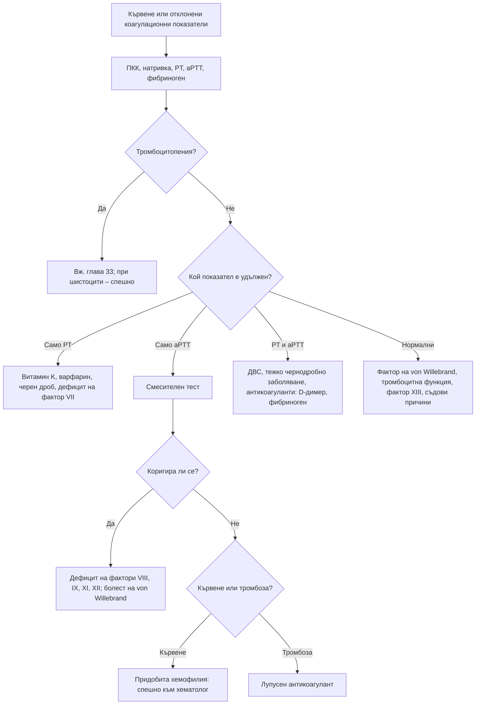

# Глава 34. Хеморагична диатеза и склонност към тромбози

> **Част VII. Кръв и кръвотворни органи**

## Цели на главата

- Да се оценява систематично анамнезата за кървене.
- Да се разграничава кървенето от кожата и лигавиците (тромбоцитно, съдово, болест на von Willebrand) от кървенето в дълбоките тъкани (коагулационни дефекти).
- Да се тълкуват протромбиновото време, aPTT, фибриногенът и смесителният тест.
- Да се разпознава придобитата хемофилия като спешно състояние.
- Да се определя кога е оправдано изследване за тромбофилия и за скрито злокачествено заболяване след венозен тромбемболизъм.

## Ключови моменти

- Структурираната анамнеза за кървене (ISTH-BAT) е най-добрият първоначален скрининг. Отклонен е сбор ≥ 4 при мъже, ≥ 6 при жени и ≥ 3 при деца *(SORT B [2, 3])*.
- Типът на кървенето насочва към механизма. Кожата и лигавиците подсказват тромбоцитен дефект или болест на von Willebrand, а хемартрозите и мускулните хематоми – дефицит на коагулационен фактор.
- Пурпура с треска е менингококцемия до доказване на противното. Пациентът се насочва спешно към болница *(SORT C [4])*.
- Ново кървене с необяснимо удължено aPTT налага да се мисли за придобита хемофилия. Смесителният тест включва 2-часова инкубация, но решаващо е измерването на фактор VIII *(SORT B [7])*.
- Кръвонасяданията по трупа, ушите и шията при дете под 4 години и всяко кръвонасядане при кърмаче под 5 месеца изискват оценка за умишлена травма *(SORT B [8])*.
- Не се изследва за тромбофилия след провокиран епизод и докато антикоагулацията продължава *(SORT C [10])*. След непровокиран епизод без симптоми е достатъчен ограничен скрининг за рак *(SORT B [12, 13])*.

---

## А. Хеморагична диатеза

### 1. Анамнеза за кървене

Анамнезата е най-важната част от оценката. Използват се структурирани въпросници, например ISTH-BAT [1]. Отклонен е сбор ≥ 4 при мъже, ≥ 6 при жени и ≥ 3 при деца [2]. При ниска вероятност за заболяване (например в общата практика) валидираният въпросник е първата стъпка. Той показва на кого са нужни специализирани изследвания [3]. Въпросите обхващат:

- кръвонасядания без травма, особено големи, по трупа или многобройни;
- кървене от носа (продължително, двустранно, налагащо тампонада);
- продължително кървене от малки рани;
- кървене от венците;
- **кървене след екстракция на зъб** и след операции (налагащо ревизия или кръвопреливане);
- **обилна менструация** (смяна на превръзката по-често от 2 часа, съсиреци > 2,5 cm, „наводняване“, желязодефицитна анемия), особено от менархето;
- **кървене след раждане**;
- мускулни хематоми, **хемартрози**;
- кървене от храносмилателния тракт, хематурия;
- вътречерепен кръвоизлив;
- **фамилна анамнеза** (хемофилията се предава свързано с X-хромозомата, болестта на von Willebrand обикновено автозомно-доминантно);
- **лекарства** – аспирин, клопидогрел, прасугрел, тикагрелор, антикоагуланти, НСПВС, SSRI, билки (гинко, чесън, джинджифил в големи дози), рибено масло.

### 2. Тип на кървенето

*Таблица 34.1. Хеморагична диатеза: тип на кървенето.*

| Белег | Тромбоцитен или съдов дефект, болест на von Willebrand | Коагулационен дефект (хемофилия) |
|---|---|---|
| Кожа | Петехии, пурпура, малки екхимози | Големи екхимози, подкожни хематоми |
| Лигавици | Носово кървене, кървене от венците, менорагия, стомашно-чревно кървене | По-рядко |
| Дълбоки тъкани | Рядко | **Хемартрози, мускулни хематоми** |
| Кървене след порязване | Веднага, продължително | Често нормално в началото, после забавено кървене |
| Кървене след операция | Веднага | Забавено, часове до дни |

### 3. Пурпура

- **Петехии** – точковидни кръвоизливи (< 2 mm), които не избледняват при натиск.
- **Непалпируема пурпура:**
  - тромбоцитопения и тромбоцитна дисфункция;
  - **сенилна (актинична) пурпура** – по гърба на предмишниците и ръцете при възрастни хора;
  - **стероидна пурпура**;
  - **скорбут** – перифоликуларни кръвоизливи, „тирбушонови“ косми, кървене от венците; възрастни хора, които живеят сами, алкохолици, хора с ограничителни диети;
  - амилоидоза – периорбитална пурпура („очи на миеща мечка“), пурпура след притискане на кожата;
  - синдром на Ehlers-Danlos;
  - травма или насилие.
- **Палпируема пурпура** – **васкулит на малките съдове**: IgA васкулит (пурпура на Henoch-Schönlein), кожен левкоцитокластичен васкулит (лекарства, инфекции), криоглобулинемия (хепатит C), ANCA-свързани васкулити, системен лупус еритематодес.
- **Пурпура с треска** – **менингококцемия** до доказване на противното (спешно състояние) [4]; също рикетсиози, ендокардит, ДВС.

### 4. Причини за хеморагична диатеза

*Таблица 34.2. Причини за хеморагична диатеза.*

| Група | Причини |
|---|---|
| **Съдови** | Сенилна пурпура, кортикостероиди, скорбут, наследствена хеморагична телеангиектазия (телеангиектазии по устните, езика и пръстите, рецидивиращи кръвотечения от носа, стомашно-чревно кървене, артериовенозни малформации), синдром на Ehlers-Danlos, васкулити, амилоидоза |
| **Брой на тромбоцитите** | Тромбоцитопения (вж. глава 33) |
| **Функция на тромбоцитите** | Лекарства (антитромбоцитни средства, НСПВС); уремия; болест на von Willebrand (най-честото наследствено нарушение на хемостазата – около 1% при популационни изследвания, като повечето случаи са леки [5]; менорагия, кървене от носа, кървене след екстракция на зъб); наследствени тромбоцитопатии (тромбастения на Glanzmann, синдром на Bernard-Soulier); миелопролиферативни неоплазми |
| **Придобита болест на von Willebrand** | Аортна стеноза (синдром на Heyde) [6], механични помпи за лявата камера, хипотиреоидизъм, лимфопролиферативни заболявания и моноклонални гамапатии, много висок брой тромбоцити |
| **Коагулационни фактори – наследствени** | Хемофилия A (фактор VIII) и B (фактор IX) – свързани с X-хромозомата, мъже, хемартрози; носителките също могат да кървят. Дефицит на фактор XI, редки дефицити на фактори VII, X, V, II, фибриноген, фактор XIII (нормални PT и aPTT, забавено кървене) |
| **Коагулационни фактори – придобити** | Чернодробно заболяване; дефицит на витамин K (малабсорбция, антибиотици, недохранване, холестаза, новородени); антикоагуланти (варфарин, аценокумарол, директни орални антикоагуланти, хепарини); ДВС (сепсис, злокачествени заболявания – особено остра промиелоцитна левкемия, акушерски усложнения, травма, ухапване от змия); придобита хемофилия A (автоантитела срещу фактор VIII – възрастни хора, следродилен период, автоимунни и злокачествени заболявания) [7]; масивни кръвопреливания |
| **Хиперфибринолиза** | Карцином на простатата, цироза, тромболиза |

### 5. Тълкуване на коагулационните показатели

*Таблица 34.3. Тълкуване на коагулационните показатели.*

| Находка | Причини |
|---|---|
| **Удължено само протромбиново време (PT, INR)** | Дефицит на витамин K (в началото), варфарин, чернодробно заболяване (в началото), дефицит на фактор VII, инхибитори на фактор Xa (ривароксабан, апиксабан – различен ефект) |
| **Удължено само aPTT** | Нефракциониран хепарин; хемофилия A и B; дефицит на фактор XI; болест на von Willebrand (при нисък фактор VIII); дефицит на фактор XII (без кървене); лупусен антикоагулант (тромбози, а не кървене); придобита хемофилия (смесителният тест не коригира, особено след инкубация); дабигатран |
| **Удължени PT и aPTT** | ДВС, тежко чернодробно заболяване, тежък дефицит на витамин K, свръхдозиране на варфарин, директни орални антикоагуланти, дефицит на фактори X, V, II или фибриноген, масивни кръвопреливания |
| **Нормални PT, aPTT и тромбоцити при кървене** | Болест на von Willebrand (лека форма), тромбоцитна дисфункция (включително лекарствена), дефицит на фактор XIII, съдови нарушения (наследствена хеморагична телеангиектазия, синдром на Ehlers-Danlos, скорбут), нарушения на фибринолизата |
| **Нисък фибриноген, висок D-димер, тромбоцитопения, удължено PT** | **ДВС** |

**Смесителен тест** (плазма на пациента + нормална плазма в съотношение 1:1):

- коригира удълженото време – дефицит на фактор;
- **не коригира** – **инхибитор** (лупусен антикоагулант, антитела срещу фактор VIII, хепарин).

Антителата при придобита хемофилия действат бавно и зависят от температурата. Затова веднага след смесването aPTT може да се коригира, а след 2 часа инкубация при 37 °C отново да е удължено. Смесителният тест не доказва и не изключва придобита хемофилия. Решаващо е измерването на фактор VIII, а наличието на лупусен антикоагулант не я изключва [7].

### 6. Кръвонасядания при деца

Винаги трябва да се мисли и за **умишлена травма**. Подозрителни са белезите от правилото TEN-4-FACESp. При деца под 4 години то има чувствителност около 96% и специфичност около 87% [8]:

- **кръвонасядания при кърмаче, което още не пълзи** („който не пълзи, рядко се удря“);
- кръвонасядания по **трупа, ушите и шията** при деца под 4 години;
- **всякакви** кръвонасядания при кърмачета под 5-месечна възраст;
- кръвонасядания с форма на предмет или на пръсти;
- кръвоизливи в юздичката на устната, в ъгъла на челюстта, по бузите, клепачите и под конюнктивата.

В диференциалната диагноза влизат също имунната тромбоцитопения (след вирусна инфекция), левкемията, хемофилията, болестта на von Willebrand, IgA васкулитът и менингококцемията.

### 7. Безопасна диагностична стратегия при кървене

*Таблица 34.4. Безопасна диагностична стратегия при кървене.*

| Въпрос | Отговор |
|---|---|
| **Вероятна диагноза** | Лекарства (антитромбоцитни средства, антикоагуланти, НСПВС), сенилна пурпура, болест на von Willebrand, тромбоцитопения, чернодробно заболяване |
| **Сериозни заболявания, които не бива да се пропускат** | Менингококцемия; остра левкемия; ДВС (включително при остра промиелоцитна левкемия); придобита хемофилия; тромботична тромбоцитопенична пурпура; хеморагична треска; вътречерепен кръвоизлив при антикоагулация; умишлена травма |
| **Чести капани** | Болест на von Willebrand при жени с обилна менструация; дефицит на витамин K при антибиотици и недохранване; скорбут при възрастни хора; придобита болест на von Willebrand при аортна стеноза; взаимодействия на варфарина с антибиотици; лупусен антикоагулант, приет за хеморагична диатеза |
| **Маскиращи заболявания** | Лекарства, чернодробни заболявания, бъбречна недостатъчност, лимфопролиферативни заболявания |
| **Психосоциални аспекти** | Насилие (деца, жени, възрастни хора), самонараняване, симулирано кървене |

---

## Б. Склонност към тромбози

### 8. Рискови фактори за венозен тромбемболизъм

**Триадата на Virchow:** застой на кръвта, увреждане на съдовата стена и хиперкоагулабилитет.

- **Провокиран** венозен тромбемболизъм:
  - **голям преходен рисков фактор** – операция, травма, имобилизация над 3 дни, хоспитализация;
  - **малък преходен рисков фактор** – естрогени, бременност и следродилен период, дълго пътуване, лека травма.
- **Непровокиран** – без идентифициран рисков фактор. Рискът от рецидив е по-висок.

### 9. Тромбофилии

*Таблица 34.5. Наследствени и придобити тромбофилии.*

| Вид | Състояния |
|---|---|
| **Наследствени** | Фактор V Leiden (най-честата при европейците); мутация в гена на протромбина G20210A; дефицит на протеин C, протеин S и антитромбин (по-редки, но с по-висок риск) |
| **Придобити** | Антифосфолипиден синдром; злокачествени заболявания; миелопролиферативни неоплазми (JAK2 V617F – особено при тромбози на спланхничните вени, дори при нормална ПКК); пароксизмална нощна хемоглобинурия (тромбози на необичайни места с хемолиза и цитопении); нефрозен синдром (тромбоза на бъбречната вена); възпалителни болести на червата; хепарин-индуцирана тромбоцитопения; естрогени, бременност; затлъстяване; сърдечна недостатъчност; COVID-19; хиперхомоцистеинемия; болест на Behçet (венозни тромбози при млади мъже); синдром на Cushing; лекарства (L-аспарагиназа, талидомид, леналидомид, тамоксифен) |

Антифосфолипиден синдром (класификационни критерии ACR/EULAR от 2023 г. – създадени за научни изследвания, а не за поставяне на диагноза при отделния пациент) [9]: клинични прояви (венозни или артериални тромбози, микроваскуларно засягане, акушерски усложнения, клапно засягане, тромбоцитопения) и персистиращи лабораторни маркери (лупусен антикоагулант, антикардиолипинови антитела, антитела срещу бета-2-гликопротеин I в средни до високи титри, потвърдени след поне 12 седмици).

### 10. Кога да се изследва за тромбофилия

Изследването за тромбофилия **не е рутинно**. Резултатът рядко променя лечението. NICE не препоръчва изследване след провокиран епизод и докато антикоагулацията продължава [10]. Обсъжда се при:

- непровокиран венозен тромбемболизъм, ако се планира спиране на антикоагулацията – антифосфолипидни антитела, а наследствена тромбофилия само при роднина от първа степен с венозен тромбемболизъм [10];
- тромбоза на **необичайно място** (церебрални венозни синуси, спланхнични вени) – антифосфолипидни антитела и JAK2 дори при нормална ПКК, а при отклонения в ПКК и маркери за пароксизмална нощна хемоглобинурия [11];
- рецидивиращ венозен тромбемболизъм;
- **артериална тромбоза в млада възраст** без други съдови рискови фактори (антифосфолипиден синдром) [11];
- **повтарящи се спонтанни аборти** и други акушерски усложнения (антифосфолипиден синдром);
- кожна некроза при започване на варфарин (дефицит на протеин C).

**Време на изследването:** не по време на острия епизод и не по време на антикоагулантна терапия. Протеин C, протеин S и антитромбин се понижават, а лупусният антикоагулант се влияе от антикоагулантите. Роднините без симптоми не се изследват рутинно [10].

### 11. Скрито злокачествено заболяване след непровокиран венозен тромбемболизъм

- В следващата година злокачествено заболяване се открива при около 5% от пациентите [12]. Най-чести са карциномите на панкреаса, белия дроб, яйчника, мозъка и лимфомите.
- Препоръчва се ограничен скрининг: анамнеза, преглед, ПКК, бъбречни и чернодробни показатели, PT и aPTT [10]. Много протоколи добавят калций, изследване на урината, рентгенография на гръден кош и скрининговите изследвания, подходящи за възрастта (мамография, цитонамазка, изследване за колоректален карцином) [13].
- Рутинната КТ на корема и таза не намалява пропуснатите карциноми и не подобрява преживяемостта. Допълнителни изследвания се правят само при симптоми и белези [10, 13].

### 12. Артериална тромбоза при млади хора

Трябва да се мисли за:

- антифосфолипиден синдром;
- парадоксална емболия през отворен овален прозорец;
- васкулити, дисекации;
- кокаин и амфетамини;
- миелопролиферативни неоплазми;
- пароксизмална нощна хемоглобинурия;
- хепарин-индуцирана тромбоцитопения;
- сърдечни източници (предсърдно мъждене, ендокардит, миксом);
- хиперхомоцистеинемия;
- тютюнопушене и орални контрацептиви (особено в комбинация);
- болест на Fabry.

---

## 13. Диагностичен алгоритъм при отклонени коагулационни показатели

*Фигура 34.1. Диагностичен алгоритъм при отклонени коагулационни показатели. Схема на авторите въз основа на източниците, цитирани в главата.*

Текстово описание на фигура 34.1

1. Кървене или отклонени коагулационни показатели. Следва: към т. 2.
2. ПКК, натривка, PT, aPTT, фибриноген. Следва: към т. 3.
3. **Въпрос:** Тромбоцитопения? Да – към т. 4; Не – към т. 5.
4. Вж. глава 33; при шистоцити – спешно.
5. **Въпрос:** Кой показател е удължен? Само PT – към т. 6; Само aPTT – към т. 7; PT и aPTT – към т. 8; Нормални – към т. 9.
6. Витамин K, варфарин, черен дроб, дефицит на фактор VII.
7. Смесителен тест. Следва: към т. 10.
8. ДВС, тежко чернодробно заболяване, антикоагуланти: D-димер, фибриноген.
9. Фактор на von Willebrand, тромбоцитна функция, фактор XIII, съдови причини.
10. **Въпрос:** Коригира ли се? Да – към т. 11; Не – към т. 12.
11. Дефицит на фактори VIII, IX, XI, XII; болест на von Willebrand.
12. **Въпрос:** Кървене или тромбоза? Кървене – към т. 13; Тромбоза – към т. 14.
13. Придобита хемофилия: спешно към хематолог.
14. Лупусен антикоагулант.

---

## 14. Червени флагове и насочване

### 14.1. Червени флагове

- Неизбледняващ петехиален или пурпурен обрив с треска или тежко общо състояние.
- Ново кървене с изолирано удължено aPTT при човек без предишна анамнеза за кървене.
- Кървене с тромбоцитопения, шистоцити или признаци на ДВС.
- Главоболие, неврологична находка, хемартроза или голямо кървене при прием на антикоагулант.
- Кръвонасядания при кърмаче или по трупа, ушите и шията при дете под 4 години.
- Тромбоза на необичайно място – мозъчни венозни синуси, портална, мезентериална или чернодробни вени.
- Кожна некроза в първите дни след започване на варфарин.

### 14.2. Кога и колко спешно да насочим

*Таблица 34.6. Кога и колко спешно да насочим.*

| Спешност | Клинична ситуация |
|---|---|
| **Незабавно (112 или спешно отделение)** | Пурпура с треска – при силно подозрение за менингококова болест се прилага цефтриаксон или бензилпеницилин, ако това не забавя транспорта [4]; кървене с хемодинамична нестабилност; вътречерепен кръвоизлив или голямо кървене при антикоагулант; подозрение за ДВС или тромботична тромбоцитопенична пурпура; придобита хемофилия с активно кървене [7] |
| **В същия ден** | Ново кървене с необяснимо удължено aPTT [7]; хемартроза при известна хемофилия; подозрение за умишлена травма при дете (педиатър и социални служби по местния протокол) [8]; тромбоза на необичайно място |
| **Бързо (до 2 седмици)** | Отклонен сбор по ISTH-BAT с обилна менструация, кървене след екстракция на зъб или след операция [2, 3]; необяснимо удължено aPTT преди планова операция [7] |
| **Планово** | Фамилна анамнеза за наследствено нарушение на хемостазата преди операция или раждане; обсъждане на тромбофилия след непровокиран епизод, ако се планира спиране на антикоагулацията [10] |
| **Проследяване в общата практика** | Сенилна и стероидна пурпура; кръвонасядания от лекарства с коригируема причина; провокиран венозен тромбемболизъм (без изследване за тромбофилия) [10]; ограничен скрининг за рак след непровокиран епизод [10, 13] |

---

## 15. Клинични перли

- Анамнезата за кървене е по-ценна от скрининговите коагулационни тестове.
- Обилна менструация от менархето насам: изследвайте за болест на von Willebrand.
- Удълженото aPTT без кървене може да е лупусен антикоагулант, който повишава риска от **тромбоза**, или дефицит на фактор XII, който няма клинично значение.
- Внезапни обширни кръвонасядания и мускулни хематоми при възрастен човек без анамнеза за кървене, с изолирано удължено aPTT: придобита хемофилия. Това е спешно състояние.
- Пурпура и треска: менингококцемия до доказване на противното.
- Кървене от венците, перифоликуларни кръвоизливи и лоши хранителни навици: скорбут.
- Тромбоза на порталната вена или синдром на Budd-Chiari: изследвайте JAK2 дори при нормална ПКК.
- Кървене от стомашно-чревния тракт от ангиодисплазии при пациент с аортна стеноза: синдром на Heyde (придобита болест на von Willebrand).

---

## 16. Клиничен случай

**Етап 1 – клинична картина.** Мъж на 74 години идва с обширни кръвонасядания по ръцете и трупа от 10 дни и болезнено подуване на дясното бедро след незначително удряне. Никога не е имал проблеми с кървене, включително при операция на херния преди 15 години. Не приема антикоагуланти и антитромбоцитни средства. Преди 2 месеца е диагностициран с ревматична полимиалгия.

> **Въпрос 1.** Какво подсказва липсата на предишна анамнеза за кървене?

**Етап 2 – изследвания.** Хемоглобин 92 g/l, тромбоцити 245 × 10⁹/l, PT нормално, **aPTT 78 s** (норма до 36 s), фибриноген нормален. Веднага след смесване с нормална плазма aPTT е 41 s, а след 2 часа инкубация при 37 °C е 69 s.

> **Въпрос 2.** Как ще тълкувате смесителния тест и коя е най-вероятната диагноза?

> **Въпрос 3.** Колко спешно е състоянието и какво не бива да се прави?

Обсъждане и отговори

**Отговор 1.** Кървенето е **придобито**, а не наследствено. Човек с наследствен дефект вероятно би кървял при операцията на херния. Трябва да се търсят лекарства, чернодробно заболяване, ДВС, тромбоцитопения и инхибитори.

**Отговор 2.** Почти пълната корекция веднага след смесването, последвана от ново удължаване след инкубация, е типична за зависим от времето и температурата инхибитор на фактор VIII. Кървенето в кожата и мускулите при възрастен човек с изолирано удължено aPTT насочва към придобита хемофилия A [7]. Изследванията показват фактор VIII 2% и висок титър на инхибитора. Придобитата хемофилия често е свързана с автоимунни или злокачествени заболявания.

**Отговор 3.** Състоянието е **спешно**, защото кървенето може да бъде животозастрашаващо. Пациентът се насочва в същия ден към хематологичен център. Необходими са хемостатични средства, които заобикалят фактор VIII, и имуносупресия. Интрамускулни инжекции, ненужни венепункции и инвазивни процедури трябва да се избягват [7]. Търсят се подлежащи заболявания, включително злокачествено.

**Поука.** Ново кървене при човек, който досега не е кървял, изисква търсене на придобита причина. Смесителният тест трябва да включва инкубация, а решаващо е измерването на фактор VIII.

---

## Обобщение

- Оценката на кървенето започва със структурирана анамнеза и типа на кървенето. Скрининговите коагулационни тестове не заместват анамнезата.
- PT, aPTT, фибриногенът и смесителният тест разграничават дефицит от инхибитор. Нормалните тестове не изключват болест на von Willebrand, дефицит на фактор XIII и съдови причини.
- Спешни състояния са пурпурата с треска, ДВС, придобитата хемофилия, тромботичната тромбоцитопенична пурпура и голямото кървене при антикоагуланти.
- Изследването за тромбофилия е избирателно. Тромбозата на необичайно място насочва към антифосфолипиден синдром, миелопролиферативна неоплазма и пароксизмална нощна хемоглобинурия. След непровокиран венозен тромбемболизъм се прави ограничен скрининг за рак.

## Самопроверка

### Въпроси с един верен отговор

**1.** *(основно ниво)* Жена на 24 години има обилна менструация от менархето, кървене след екстракция на зъб и чести кръвотечения от носа. ПКК, PT и aPTT са нормални. Кое е най-вероятното заболяване?

- **А.** Хемофилия A
- **Б.** Болест на von Willebrand
- **В.** Дефицит на фактор XII
- **Г.** Имунна тромбоцитопения
- **Д.** Лупусен антикоагулант

Отговор и обосновка

**Верен отговор: Б.** Кървенето от лигавиците от менархето е типично за болест на von Willebrand. Нормалните PT и aPTT не я изключват. Изследват се антигенът и активността на фактора на von Willebrand и фактор VIII [3]. Дефицитът на фактор XII и лупусният антикоагулант не причиняват кървене, а тромбоцитите са нормални.

**2.** *(основно ниво)* Момче на 3 години има температура 39 °C и бързо разпространяващ се петехиален обрив, който не избледнява при натиск. Кое е правилното поведение в общата практика?

- **А.** ПКК и контрол на следващия ден
- **Б.** Антипиретик и наблюдение у дома
- **В.** Спешен транспорт до болница и парентерален цефтриаксон или бензилпеницилин, ако това не забавя транспорта
- **Г.** Антихистамин
- **Д.** Коагулационни изследвания преди решението

Отговор и обосновка

**Верен отговор: В.** Неизбледняващият обрив с треска е червен флаг за менингококова болест. Детето се транспортира спешно до болница. При силно подозрение антибиотикът се прилага още извън болницата, ако това не забавя транспорта [4]. Изследванията не бива да забавят лечението.

**3.** *(основно ниво)* Мъж на 68 години има първа непровокирана дълбока венозна тромбоза на крака. Няма оплаквания, прегледът е нормален, ПКК, бъбречните и чернодробните показатели, PT и aPTT са нормални. Кое е най-подходящото търсене на скрит рак?

- **А.** КТ на гръден кош, корем и таз
- **Б.** ПЕТ-КТ
- **В.** Панел от туморни маркери
- **Г.** Участие в скрининговите програми според възрастта и допълнителни изследвания само при симптоми или белези
- **Д.** Колоноскопия и гастроскопия при всички

Отговор и обосновка

**Верен отговор: Г.** Рутинната КТ на корема и таза не намалява пропуснатите карциноми и не подобрява преживяемостта [13]. NICE препоръчва анамнеза, преглед и базови изследвания, а допълнителни изследвания само при симптоми или белези [10].

**4.** *(напреднало ниво)* Жена на 30 години има тромбоза на порталната вена без цироза и без провокиращ фактор. ПКК е нормална. Кое изследване е най-подходящо?

- **А.** Само фактор V Leiden
- **Б.** JAK2 V617F и антифосфолипидни антитела
- **В.** Протеин C по време на лечение с варфарин
- **Г.** Не са нужни изследвания
- **Д.** D-димер

Отговор и обосновка

**Верен отговор: Б.** При тромбоза на спланхничните вени без провокиращ фактор се изследват JAK2 дори при нормална ПКК и антифосфолипидни антитела [11]. Протеин C не може да се тълкува по време на лечение с варфарин.

**5.** *(напреднало ниво)* Мъж на 76 години има обширни подкожни хематоми от 5 дни. Тромбоцитите са 260 × 10⁹/l, PT е нормално, aPTT е 72 s. Веднага след смесване с нормална плазма aPTT почти се коригира, а след 2 часа инкубация при 37 °C отново е удължено. Коя е най-вероятната диагноза?

- **А.** Дефицит на фактор XII
- **Б.** Лупусен антикоагулант
- **В.** Придобита хемофилия A
- **Г.** Болест на von Willebrand тип 1
- **Д.** Дефицит на витамин K

Отговор и обосновка

**Верен отговор: В.** Инхибиторите на фактор VIII при придобита хемофилия зависят от времето и температурата. Удължаването след инкубация е типично [7]. Дефицитът на фактор XII и лупусният антикоагулант не причиняват кървене, а при дефицит на витамин K първо се удължава PT.

### Задача

Жена на 45 години е насочена за планова холецистектомия. Изследванията показват aPTT 52 s (норма до 36 s) при нормални PT и тромбоцити. Никога не е кървила при раждания, екстракции на зъби и порязвания. Как ще подходите?

Решение

Необяснимото удължаване на aPTT преди операция не бива да се пренебрегва [7]. Първо се повтаря изследването, за да се изключи грешка при вземането на кръвта: замърсяване с хепарин, недобре напълнена епруветка или много висок хематокрит. След това се взема структурирана анамнеза за кървене (ISTH-BAT) [1]. При потвърдено удължаване се правят смесителен тест с инкубация, фактори VIII, IX, XI и XII и изследване за лупусен антикоагулант. Дефицитът на фактор XII и лупусният антикоагулант не носят риск от кървене, но лупусният антикоагулант повишава риска от тромбоза. Дефицит на фактор VIII, IX или XI изисква консултация с хематолог преди операцията.

### OSCE станция: Анамнеза за кървене при обилна менструация

**Време:** 8 минути. **Ниво:** основно (студенти, специализанти).

**Задача за кандидата.** Девойка на 17 години се оплаква от обилна менструация и умора. Снемете структурирана анамнеза за кървене и обяснете следващите стъпки.

**Информация за симулирания пациент (за изпитващия).** Менструацията продължава 8 дни, сменя превръзката на всеки час в първите дни и има съсиреци. Преди година е кървяла дълго след екстракция на зъб. Майка ѝ има същите оплаквания.

*Таблица 34.7. OSCE станция „Анамнеза за кървене при обилна менструация“ – критерии за оценяване.*

| Критерий | Точки |
|---|---|
| Представя се, осигурява поверителност и получава съгласие | 1 |
| Оценява количествено менструацията: продължителност, честота на смяна, съсиреци над 2,5 cm, „наводняване“, отсъствия от училище | 2 |
| Пита за други прояви: кръвонасядания, кървене от носа и венците, след екстракция на зъб и след операции | 2 |
| Пита за фамилна анамнеза и лекарства (НСПВС, аспирин, билки) | 1 |
| Търси симптоми на анемия и желязодефицит | 1 |
| Обяснява следващите стъпки: ПКК, феритин, PT, aPTT, фибриноген, изследване за болест на von Willebrand и консултация с хематолог | 2 |
| Проверява разбирането и дава възможност за въпроси | 1 |
| **Общо** | **10** |

**Праг за успешно изпълнение:** 7 от 10 точки, включително количественото описание на менструацията и въпросите за други прояви.

## Литература

1. Rodeghiero F, Tosetto A, Abshire T, Arnold DM, Coller B, James P, et al. ISTH/SSC bleeding assessment tool: a standardized questionnaire and a proposal for a new bleeding score for inherited bleeding disorders. J Thromb Haemost. 2010;8(9):2063-5. doi:10.1111/j.1538-7836.2010.03975.x. PMID: 20626619.
2. Elbatarny M, Mollah S, Grabell J, Bae S, Deforest M, Tuttle A, et al. Normal range of bleeding scores for the ISTH-BAT: adult and pediatric data from the merging project. Haemophilia. 2014;20(6):831-5. doi:10.1111/hae.12503. PMID: 25196510.
3. James PD, Connell NT, Ameer B, Di Paola J, Eikenboom J, Giraud N, et al. ASH ISTH NHF WFH 2021 guidelines on the diagnosis of von Willebrand disease. Blood Adv. 2021;5(1):280-300. doi:10.1182/bloodadvances.2020003265. PMID: 33570651.
4. National Institute for Health and Care Excellence. Meningitis (bacterial) and meningococcal disease: recognition, diagnosis and management (NICE guideline NG240). London: NICE; 2024. Достъпно на: https://www.nice.org.uk/guidance/ng240
5. Rodeghiero F, Castaman G, Dini E. Epidemiological investigation of the prevalence of von Willebrand's disease. Blood. 1987;69(2):454-9. PMID: 3492222.
6. Vincentelli A, Susen S, Le Tourneau T, Six I, Fabre O, Juthier F, et al. Acquired von Willebrand syndrome in aortic stenosis. N Engl J Med. 2003;349(4):343-9. doi:10.1056/NEJMoa022831. PMID: 12878741.
7. Tiede A, Collins P, Knoebl P, Teitel J, Kessler C, Shima M, et al. International recommendations on the diagnosis and treatment of acquired hemophilia A. Haematologica. 2020;105(7):1791-1801. doi:10.3324/haematol.2019.230771. PMID: 32381574.
8. Pierce MC, Kaczor K, Lorenz DJ, Bertocci G, Fingarson AK, Makoroff K, et al. Validation of a Clinical Decision Rule to Predict Abuse in Young Children Based on Bruising Characteristics. JAMA Netw Open. 2021;4(4):e215832. doi:10.1001/jamanetworkopen.2021.5832. PMID: 33852003.
9. Barbhaiya M, Zuily S, Naden R, Hendry A, Manneville F, Amigo MC, et al. The 2023 ACR/EULAR Antiphospholipid Syndrome Classification Criteria. Arthritis Rheumatol. 2023;75(10):1687-1702. doi:10.1002/art.42624. PMID: 37635643.
10. National Institute for Health and Care Excellence. Venous thromboembolic diseases: diagnosis, management and thrombophilia testing (NICE guideline NG158). London: NICE; 2020 [актуализирано 2023]. Достъпно на: https://www.nice.org.uk/guidance/ng158
11. Arachchillage DJ, Mackillop L, Chandratheva A, Motawani J, MacCallum P, Laffan M. Thrombophilia testing: A British Society for Haematology guideline. Br J Haematol. 2022;198(3):443-458. doi:10.1111/bjh.18239. PMID: 35645034.
12. van Es N, Le Gal G, Otten HM, Robin P, Piccioli A, Lecumberri R, et al. Screening for Occult Cancer in Patients With Unprovoked Venous Thromboembolism: A Systematic Review and Meta-analysis of Individual Patient Data. Ann Intern Med. 2017;167(6):410-417. doi:10.7326/M17-0868. PMID: 28828492.
13. Carrier M, Lazo-Langner A, Shivakumar S, Tagalakis V, Zarychanski R, Solymoss S, et al. Screening for Occult Cancer in Unprovoked Venous Thromboembolism. N Engl J Med. 2015;373(8):697-704. doi:10.1056/NEJMoa1506623. PMID: 26095467.

*Последна проверка на съдържанието: септември 2026 г. Следващ планиран преглед: септември 2027 г. (вж. „Политика за актуализация“ в README).*

<!-- навигация -->

---

[← Глава 33. Отклонения в левкоцитите и тромбоцитите; еритроцитоза](33-levkotsiti-trombotsiti.md) · [Съдържание](../README.md) · [Глава 35. Повишени възпалителни показатели и парапротеинемия →](35-vazpalitelni-pokazateli-paraproteini.md)
