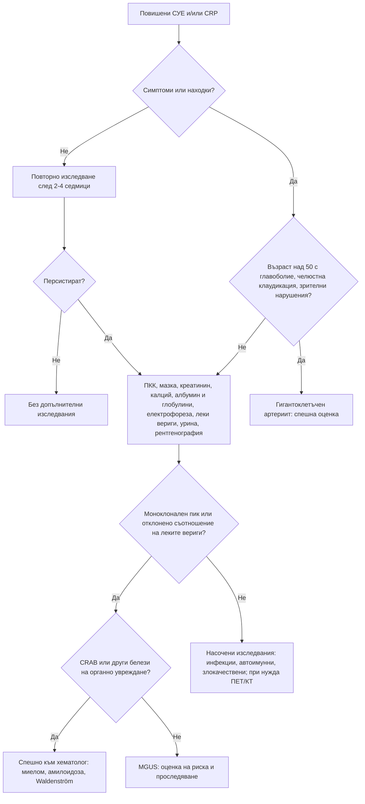

# Глава 35. Повишени възпалителни показатели и парапротеинемия

> **Част VII. Кръв и кръвотворни органи**

## Цели на главата

- Да се разбират физиологията и ограниченията на СУЕ и CRP.
- Да се тълкуват несъответствията между СУЕ и CRP.
- Да се подхожда систематично към необяснимо повишените възпалителни показатели.
- Да се разграничават моноклоналната гамапатия с неясно значение (MGUS), тлеещият миелом, мултипленият миелом, макроглобулинемията на Waldenström и AL амилоидозата.
- Да се разпознава миеломът в общата практика.

---

## 1. СУЕ и CRP

| Характеристика | СУЕ | CRP |
|---|---|---|
| Същност | Скорост на утаяване на еритроцитите; зависи главно от **фибриногена и имуноглобулините** | Белтък на острата фаза, синтезиран в черния дроб под влияние на IL-6 |
| Динамика | Бавна: повишава се и се нормализира за седмици | Бърза: повишава се за 6–8 часа, достига максимум за около 48 часа, полуживот около 19 часа |
| Влияние на други фактори | Възраст, женски пол, бременност, **анемия**, затлъстяване, ХБЗ, **парапротеини**, форма на еритроцитите | Малко; повишава се при затлъстяване |
| Приблизителна горна граница | Мъже: възраст/2 mm/h; жени: (възраст + 10)/2 mm/h | < 5–10 mg/l |

### 1.1. Несъответствия

| Висока СУЕ при нормален CRP | Висок CRP при нормална СУЕ |
|---|---|
| **Парапротеинемия** (миелом, макроглобулинемия на Waldenström) | Ранно остро възпаление или инфекция (първите 1–2 дни) |
| **Системен лупус еритематодес** (активен, без серозит и без инфекция) | Хипофибриногенемия (ДВС, чернодробна недостатъчност) |
| Поликлонална хипергамаглобулинемия (хронично чернодробно заболяване, HIV, синдром на Sjögren) | Полицитемия |
| Анемия, бременност, ХБЗ, напреднала възраст, затлъстяване | Сърповидноклетъчна болест, сфероцитоза |
| | Сърдечна недостатъчност (ниска СУЕ) |

**При активен системен лупус еритематодес CRP обикновено е нормален или леко повишен.** Висок CRP при пациент с лупус насочва към **инфекция** или **серозит**.

### 1.2. Много високи стойности

- **СУЕ > 100 mm/h:**
  - **инфекции** — ендокардит, остеомиелит, туберкулоза, абсцеси;
  - **злокачествени заболявания** — **миелом**, лимфоми, метастатични карциноми;
  - **васкулити** — гигантоклетъчен артериит, ревматична полимиалгия;
  - системен лупус еритематодес, ревматоиден артрит;
  - тежко ХБЗ, нефрозен синдром.
- **CRP > 100 mg/l:**
  - най-често **бактериална инфекция**;
  - също васкулити, болест на Still при възрастни, панкреатит, тъканна некроза, травма и операция, пристъп на подагра, някои злокачествени заболявания (бъбречноклетъчен карцином, лимфом);
  - някои вирусни инфекции (аденовирус, грип, COVID-19).

---

## 2. Подход към необяснимо повишените възпалителни показатели

### 2.1. Безопасна диагностична стратегия

| Въпрос | Отговор |
|---|---|
| **Вероятна диагноза** | Скорошна или текуща инфекция, ревматична полимиалгия (при възрастни хора), възпалителни ставни заболявания, затлъстяване, анемия |
| **Сериозни заболявания, които не бива да се пропускат** | **Гигантоклетъчен артериит** (риск от слепота), **мултиплен миелом**, лимфоми, солидни тумори, **инфекциозен ендокардит**, туберкулоза, скрити абсцеси, остеомиелит (включително вертебрален), васкулити |
| **Чести капани** | Зъбни абсцеси, простатит, синузит; лекарства; подостър тиреоидит; болест на Crohn; неразпознат нефрозен синдром |
| **Маскиращи заболявания** | Злокачествени заболявания, автоимунни заболявания, туберкулоза, ендокардит |
| **Психосоциални аспекти** | Тревожност при случайно открити отклонения |

### 2.2. Стъпки

1. **Повторете изследването** след 2–4 седмици, ако пациентът е без симптоми. Леките отклонения често са преходни.
2. **Насочена анамнеза:**
   - общи симптоми: треска, нощно изпотяване, загуба на тегло;
   - **главоболие, болезненост на скалпа, челюстна клаудикация, зрителни нарушения** (гигантоклетъчен артериит);
   - **сутрешна скованост на раменния и тазовия пояс** (ревматична полимиалгия);
   - болки в гърба и костите (миелом, метастази, спондилодисцит);
   - ставни болки, обриви, феномен на Raynaud;
   - кашлица, уринарни симптоми, стомашно-чревни симптоми, зъбни проблеми.
3. **Физикален преглед:** темпорални артерии, стави, лимфни възли, слезка, сърдечни шумове, кожа, гърди, простата, щитовидна жлеза, зъби.
4. **Изследвания:**
   - ПКК с мазка, креатинин, чернодробни показатели, **калций**, **албумин и общ белтък** (изчисляване на глобулините);
   - **електрофореза на серумните белтъци и свободни леки вериги**;
   - изследване на урината;
   - рентгенография на гръден кош;
   - ТСХ, феритин.
5. **Насочени изследвания** според находките: ANA, ANCA, ревматоиден фактор и анти-CCP, хемокултури, ехография на корема, ехокардиография, ехография или биопсия на темпоралните артерии, КТ или ПЕТ/КТ.

### 2.3. Глобулини

- **Глобулини** = общ белтък − албумин.
- **Високи глобулини** — парапротеинемия (моноклонален пик) или **поликлонална хипергамаглобулинемия**. Причините за поликлоналната хипергамаглобулинемия са хронично възпаление, хронично чернодробно заболяване (цироза, автоимунен хепатит), HIV, синдром на Sjögren, саркоидоза и IgG4-свързано заболяване.
- **Ниски глобулини** — **хипогамаглобулинемия**. Причините са обикновена вариабилна имунна недостатъчност, хронична лимфоцитна левкемия, **миелом** (потискане на нормалните имуноглобулини, особено при миелом на леките вериги), нефрозен синдром, ритуксимаб. Хипогамаглобулинемията е честа причина за рецидивиращи инфекции.

---

## 3. Моноклонални гамапатии

### 3.1. Изследвания

- **Електрофореза на серумните белтъци** — открива моноклоналния пик (М-протеин).
- **Имунофиксация** — определя вида на тежката и леката верига.
- **Свободни леки вериги в серума (капа и ламбда) и тяхното съотношение.** Нормалното съотношение е 0,26–1,65, а при ХБЗ до около 3,1. Изследването е особено важно за откриване на миелома на леките вериги, който често не дава пик при електрофорезата.
- Електрофореза и имунофиксация на урината (белтък на Bence Jones). **Уринната лента не открива леките вериги.**

### 3.2. Видове моноклонални гамапатии

| Заболяване | Критерии и белези |
|---|---|
| **MGUS** (моноклонална гамапатия с неясно значение) | М-протеин < 30 g/l; клонални плазмоцити в костния мозък < 10%; **липса** на органно увреждане. Среща се при около 3% от хората над 50 години. Риск от прогресия около 1% годишно: не-IgM MGUS към миелом, IgM MGUS към макроглобулинемия на Waldenström и лимфом, MGUS на леките вериги към миелом на леките вериги и AL амилоидоза. По-висок риск при М-протеин ≥ 15 g/l, тип, различен от IgG, и отклонено съотношение на леките вериги |
| **Тлеещ миелом** | М-протеин ≥ 30 g/l (или в урината ≥ 500 mg/24 h) и/или клонални плазмоцити 10–60%, без органно увреждане |
| **Мултиплен миелом** | Клонални плазмоцити ≥ 10% (или плазмоцитом) **и** поне едно от следните: **CRAB** — **хиперкалциемия** (> 2,75 mmol/l), **бъбречна недостатъчност** (креатинин > 177 µmol/l или креатининов клирънс < 40 ml/min), **анемия** (хемоглобин < 100 g/l или с > 20 g/l под долната граница), **костни лезии** (≥ 1 остеолитична лезия); или биомаркери за злокачественост — клонални плазмоцити ≥ 60%, съотношение на засегнатата към незасегнатата лека верига ≥ 100 (засегнатата лека верига ≥ 100 mg/l), > 1 огнищна лезия ≥ 5 mm при ЯМР |
| **Макроглобулинемия на Waldenström** | IgM парапротеин, лимфоплазмоцитен лимфом; **хипервискозитет** (главоболие, зрителни нарушения, кървене от лигавиците, разширени вени на ретината), лимфаденопатия, спленомегалия, криоглобулинемия, невропатия (анти-MAG антитела) |
| **AL амилоидоза** | Моноклонални леки вериги (по-често ламбда), депозирани като амилоид: **нефрозен синдром**, **сърдечна недостатъчност** (рестриктивна кардиомиопатия, нисък волтаж в ЕКГ при задебелени стени), периферна и вегетативна невропатия, синдром на карпалния тунел, хепатомегалия, **макроглосия**, периорбитална пурпура |
| **Други** | Моноклонална гамапатия с бъбречно значение, синдром POEMS (полиневропатия, органомегалия, ендокринопатия, М-протеин, кожни промени — обикновено ламбда), криоглобулинемия тип I и II, хронична лимфоцитна левкемия и лимфоми с М-протеин |

### 3.3. Проследяване на MGUS

Контрол след 6 месеца, след това ежегодно (при много нисък риск по-рядко). Проследяват се ПКК, креатинин, калций, М-протеинът и леките вериги, както и **нови симптоми**: болки в костите, умора, инфекции, отоци, невропатия, задух.

---

## 4. Миеломът в общата практика

### 4.1. Кога да се мисли за миелом

- **Персистираща болка в гърба или костите**, особено при възраст над 60 години, нощна болка.
- **Фрактура без адекватна травма** (включително компресионни фрактури на прешлените).
- Умора, анемия.
- **Рецидивиращи бактериални инфекции** (пневмонии).
- **Хиперкалциемия**: жажда, запек, объркване.
- **Необяснимо ОБУ или ХБЗ**, особено с „бедна“ урина при лентата, но висок белтък/креатинин.
- **Висока СУЕ** при нормален CRP, високи глобулини.
- Симптоми на хипервискозитет.

### 4.2. Изследвания в общата практика

Британските препоръки (NICE) предвиждат при възраст ≥ 60 години с персистираща болка в костите (особено в гърба) или с необяснима фрактура да се изследват ПКК, калций, СУЕ или вискозитет на плазмата, **електрофореза на серумните белтъци и свободни леки вериги** (или белтък на Bence Jones в урината).

---

## 5. Диагностичен алгоритъм

---

## 6. Клинични перли

- Много висока СУЕ при нормален CRP: мислете за миелом и за системен лупус еритематодес.
- При лупус висок CRP означава инфекция или серозит, докато не се докаже противното.
- Възрастен пациент с болки в гърба, анемия, висока СУЕ и повишен креатинин: миелом.
- Уринната лента не открива леките вериги. Изследвайте свободните леки вериги в серума.
- Високите глобулини (разлика между общия белтък и албумина) са евтин ключ към диагнозата на парапротеинемията.
- Рецидивиращите пневмонии при възрастен човек могат да се дължат на хипогамаглобулинемия при миелом или хронична лимфоцитна левкемия.
- Нефрозен синдром, сърдечна недостатъчност със задебелени стени, невропатия и макроглосия: AL амилоидоза.

---

## 7. Клиничен случай

**Случай.** Мъж на 71 години се оплаква от болки в кръста от 3 месеца, по-силни нощем, и от нарастваща умора. Лекуван е с НСПВС без ефект. Изследвания: хемоглобин 98 g/l, СУЕ 98 mm/h, CRP 6 mg/l, креатинин 168 µmol/l (преди година 88 µmol/l), коригиран калций 2,92 mmol/l, общ белтък 96 g/l, албумин 34 g/l. Уринната лента е без белтък.

**Въпроси.** 1) Какви са насочващите белези? 2) Кои изследвания ще потвърдят диагнозата?

**Обсъждане.** Възрастта, персистиращата нощна болка в гърба, **анемията**, **много високата СУЕ при нормален CRP**, **новото бъбречно увреждане**, **хиперкалциемията** и **високите глобулини** (96 − 34 = 62 g/l) са класическа картина на **мултиплен миелом**. Отрицателната уринна лента не изключва протеинурия от леки вериги. Изследванията показват IgG капа моноклонален пик от 42 g/l, силно повишени свободни капа вериги и отклонено съотношение на леките вериги. Нискодозовата КТ на цялото тяло показва множество остеолитични лезии и компресионна фрактура на L2. Костномозъчната биопсия установява 45% клонални плазмоцити. НСПВС трябва да бъдат спрени, защото увреждат допълнително бъбреците.

**Поука.** Болката в гърба при възрастен човек с анемия и висока СУЕ изисква електрофореза и изследване на леките вериги.
