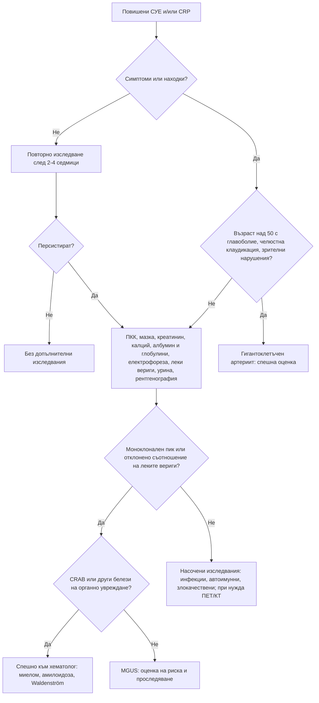

# Глава 35. Повишени възпалителни показатели и парапротеинемия

> **Част VII. Кръв и кръвотворни органи**

## Цели на главата

- Да се обясняват физиологията и ограниченията на СУЕ и CRP.
- Да се тълкуват несъответствията между СУЕ и CRP.
- Да се състави план за изследване при необяснимо повишени СУЕ и CRP според клиничния контекст.
- Да се разграничават моноклоналната гамапатия с неясно значение (MGUS), тлеещият миелом, мултипленият миелом, макроглобулинемията на Waldenström и AL амилоидозата.
- Да се разпознава миеломът в общата практика.

## Ключови моменти

- СУЕ се влияе от възрастта, пола, анемията и парапротеините. Горната граница е приблизително възраст/2 при мъжете и (възраст + 10)/2 при жените *(SORT C [2])*.
- CRP се повишава за часове и спада бързо. Затова е по-добър маркер за остра инфекция и за проследяване на лечението [1].
- Много висока СУЕ при нормален CRP насочва към парапротеинемия или системен лупус еритематодес.
- При възраст над 50 години с ново главоболие, челюстна клаудикация или зрителни нарушения се започва кортикостероид и пациентът се насочва спешно за гигантоклетъчен артериит *(SORT C [3])*.
- При възраст 60 и повече години с персистираща болка в костите или необяснима фрактура се изследват ПКК, калций, СУЕ, електрофореза и свободни леки вериги *(SORT C [10])*. Нормални хемоглобин и СУЕ правят миелома малко вероятен *(SORT B [9])*.
- MGUS се открива при около 3% от хората над 50 години и прогресира с около 1% годишно. Честотата на контролите зависи от риска *(SORT B [6, 7])*.

---

## 1. СУЕ и CRP

*Таблица 35.1. СУЕ и CRP.*

| Характеристика | СУЕ | CRP |
|---|---|---|
| Същност | Скорост на утаяване на еритроцитите; зависи главно от фибриногена и имуноглобулините | Белтък на острата фаза, синтезиран в черния дроб под влияние на IL-6 |
| Динамика | Бавна: повишава се и се нормализира за седмици | Бърза: повишава се за 6–8 часа, достига максимум за около 48 часа, полуживот около 19 часа [1] |
| Влияние на други фактори | Възраст, женски пол, бременност, анемия, затлъстяване, ХБЗ, парапротеини, форма на еритроцитите | Малко; повишава се при затлъстяване |
| Приблизителна горна граница | Мъже: възраст/2 mm/h; жени: (възраст + 10)/2 mm/h [2] | < 5–10 mg/l |

### 1.1. Несъответствия

*Таблица 35.2. СУЕ и CRP: несъответствия.*

| Висока СУЕ при нормален CRP | Висок CRP при нормална СУЕ |
|---|---|
| **Парапротеинемия** (миелом, макроглобулинемия на Waldenström) | Ранно остро възпаление или инфекция (първите 1–2 дни) |
| **Системен лупус еритематодес** (активен, без серозит и без инфекция) | Хипофибриногенемия (ДВС, чернодробна недостатъчност) |
| Поликлонална хипергамаглобулинемия (хронично чернодробно заболяване, HIV, синдром на Sjögren) | Полицитемия |
| Анемия, бременност, ХБЗ, напреднала възраст, затлъстяване | Сърповидноклетъчна болест, сфероцитоза |
| | Сърдечна недостатъчност (ниска СУЕ) |

При активен системен лупус еритематодес CRP обикновено е нормален или леко повишен. Висок CRP при пациент с лупус насочва към инфекция или серозит.

### 1.2. Много високи стойности

- **СУЕ > 100 mm/h:**
  - **инфекции** – ендокардит, остеомиелит, туберкулоза, абсцеси;
  - **злокачествени заболявания** – **миелом**, лимфоми, метастатични карциноми;
  - **васкулити** – гигантоклетъчен артериит, ревматична полимиалгия;
  - системен лупус еритематодес, ревматоиден артрит;
  - тежко ХБЗ, нефрозен синдром.
- **CRP > 100 mg/l:**
  - най-често **бактериална инфекция**;
  - също васкулити, болест на Still при възрастни, панкреатит, тъканна некроза, травма и операция, пристъп на подагра, някои злокачествени заболявания (бъбречноклетъчен карцином, лимфом);
  - някои вирусни инфекции (аденовирус, грип, COVID-19).

---

## 2. Подход към необяснимо повишените възпалителни показатели

### 2.1. Безопасна диагностична стратегия

*Таблица 35.3. Подход към необяснимо повишените възпалителни показатели: безопасна диагностична стратегия.*

| Въпрос | Отговор |
|---|---|
| **Вероятна диагноза** | Скорошна или текуща инфекция, ревматична полимиалгия (при възрастни хора), възпалителни ставни заболявания, затлъстяване, анемия |
| **Сериозни заболявания, които не бива да се пропускат** | Гигантоклетъчен артериит (риск от слепота) [3], мултиплен миелом, лимфоми, солидни тумори, инфекциозен ендокардит, туберкулоза, скрити абсцеси, остеомиелит (включително вертебрален), васкулити |
| **Чести капани** | Зъбни абсцеси, простатит, синузит; лекарства; подостър тиреоидит; болест на Crohn; неразпознат нефрозен синдром |
| **Маскиращи заболявания** | Злокачествени заболявания, автоимунни заболявания, туберкулоза, ендокардит |
| **Психосоциални аспекти** | Тревожност при случайно открити отклонения |

### 2.2. Стъпки

1. **Повторете изследването** след 2–4 седмици, ако пациентът е без симптоми. Леките отклонения често са преходни.
2. **Насочена анамнеза:**
   - общи симптоми: треска, нощно изпотяване, загуба на тегло;
   - **главоболие, болезненост на скалпа, челюстна клаудикация, зрителни нарушения** (гигантоклетъчен артериит);
   - **сутрешна скованост на раменния и тазовия пояс** (ревматична полимиалгия);
   - болки в гърба и костите (миелом, метастази, спондилодисцит);
   - ставни болки, обриви, феномен на Raynaud;
   - кашлица, уринарни симптоми, стомашно-чревни симптоми, зъбни проблеми.
3. **Физикален преглед:** темпорални артерии, стави, лимфни възли, слезка, сърдечни шумове, кожа, гърди, простата, щитовидна жлеза, зъби.
4. **Изследвания:**
   - ПКК с мазка, креатинин, чернодробни показатели, калций, албумин и общ белтък (изчисляване на глобулините);
   - **електрофореза на серумните белтъци и свободни леки вериги**;
   - изследване на урината;
   - рентгенография на гръден кош;
   - ТСХ, феритин.
5. **Насочени изследвания** според находките: ANA, ANCA, ревматоиден фактор и анти-CCP, хемокултури, ехография на корема, ехокардиография, ехография или биопсия на темпоралните артерии, КТ или ПЕТ/КТ.

### 2.3. Глобулини

- **Глобулини** = общ белтък − албумин.
- **Високи глобулини** – парапротеинемия (моноклонален пик) или **поликлонална хипергамаглобулинемия**. Причините за поликлоналната хипергамаглобулинемия са хронично възпаление, хронично чернодробно заболяване (цироза, автоимунен хепатит), HIV, синдром на Sjögren, саркоидоза и IgG4-свързано заболяване.
- **Ниски глобулини** – хипогамаглобулинемия. Причините са обикновена вариабилна имунна недостатъчност, хронична лимфоцитна левкемия, миелом (потискане на нормалните имуноглобулини, особено при миелом на леките вериги), нефрозен синдром, ритуксимаб. Хипогамаглобулинемията е честа причина за рецидивиращи инфекции.

---

## 3. Моноклонални гамапатии

### 3.1. Изследвания

- **Електрофореза на серумните белтъци** – открива моноклоналния пик (М-протеин).
- **Имунофиксация** – определя вида на тежката и леката верига.
- **Свободни леки вериги в серума (капа и ламбда) и тяхното съотношение.** Нормалното съотношение е 0,26–1,65 [4], а при ХБЗ горната граница е около 3,1 [5]. Изследването е особено важно за откриване на миелома на леките вериги, който често не дава пик при електрофорезата.
- Електрофореза и имунофиксация на урината (белтък на Bence Jones). **Уринната лента не открива леките вериги.**

### 3.2. Видове моноклонални гамапатии

*Таблица 35.4. Видове моноклонални гамапатии.*

| Заболяване | Критерии и белези |
|---|---|
| **MGUS** (моноклонална гамапатия с неясно значение) | М-протеин < 30 g/l; клонални плазмоцити в костния мозък < 10%; липса на органно увреждане. Среща се при около 3% от хората над 50 години. Риск от прогресия около 1% годишно [6]: не-IgM MGUS към миелом, IgM MGUS към макроглобулинемия на Waldenström и лимфом, MGUS на леките вериги към миелом на леките вериги и AL амилоидоза. По-висок риск при М-протеин ≥ 15 g/l, тип, различен от IgG, и отклонено съотношение на леките вериги [6, 7] |
| **Тлеещ миелом** [8] | М-протеин ≥ 30 g/l (или в урината ≥ 500 mg/24 h) и/или клонални плазмоцити 10–60%, без органно увреждане |
| **Мултиплен миелом** [8] | Клонални плазмоцити ≥ 10% (или плазмоцитом) и поне едно от следните: CRAB – хиперкалциемия (> 2,75 mmol/l или с > 0,25 mmol/l над горната граница), бъбречна недостатъчност (креатинин > 177 µmol/l или креатининов клирънс < 40 ml/min), анемия (хемоглобин < 100 g/l или с > 20 g/l под долната граница), костни лезии (≥ 1 остеолитична лезия); или биомаркери за злокачественост – клонални плазмоцити ≥ 60%, съотношение на засегнатата към незасегнатата лека верига ≥ 100 (засегнатата лека верига ≥ 100 mg/l), > 1 огнищна лезия ≥ 5 mm при ЯМР |
| **Макроглобулинемия на Waldenström** | IgM парапротеин, лимфоплазмоцитен лимфом; хипервискозитет (главоболие, зрителни нарушения, кървене от лигавиците, разширени вени на ретината), лимфаденопатия, спленомегалия, криоглобулинемия, невропатия (анти-MAG антитела) |
| **AL амилоидоза** | Моноклонални леки вериги (по-често ламбда), депозирани като амилоид: нефрозен синдром, сърдечна недостатъчност (рестриктивна кардиомиопатия, нисък волтаж в ЕКГ при задебелени стени), периферна и вегетативна невропатия, синдром на карпалния тунел, хепатомегалия, макроглосия, периорбитална пурпура |
| **Други** | Моноклонална гамапатия с бъбречно значение, синдром POEMS (полиневропатия, органомегалия, ендокринопатия, М-протеин, кожни промени – обикновено ламбда), криоглобулинемия тип I и II, хронична лимфоцитна левкемия и лимфоми с М-протеин |

### 3.3. Проследяване на MGUS

Контрол след 6 месеца. При нисък риск (IgG, М-протеин < 15 g/l и нормално съотношение на леките вериги) контролите продължават на 2–3 години или при нови симптоми. При междинен и висок риск контролите са ежегодни, до края на живота [6]. Проследяват се ПКК, креатинин, калций, М-протеинът и леките вериги, както и **нови симптоми**: болки в костите, умора, инфекции, отоци, невропатия, задух.

---

## 4. Миеломът в общата практика

### 4.1. Кога да се мисли за миелом

- **Персистираща болка в гърба или костите**, особено при възраст над 60 години, нощна болка.
- **Фрактура без адекватна травма** (включително компресионни фрактури на прешлените).
- Умора, анемия.
- **Рецидивиращи бактериални инфекции** (пневмонии).
- **Хиперкалциемия**: жажда, запек, объркване.
- **Необяснимо ОБУ или ХБЗ**, особено с „бедна“ урина при лентата, но висок белтък/креатинин.
- **Висока СУЕ** (или вискозитет на плазмата) при нормален CRP, високи глобулини. СУЕ и вискозитетът са по-полезни от CRP. Нормални СУЕ и хемоглобин правят миелома малко вероятен [9].
- Симптоми на хипервискозитет.

### 4.2. Изследвания в общата практика

Британските препоръки (NICE) предвиждат при възраст ≥ 60 години с персистираща болка в костите (особено в гърба) или с необяснима фрактура да се изследват ПКК, калций, СУЕ или вискозитет на плазмата, **електрофореза на серумните белтъци и свободни леки вериги** (или белтък на Bence Jones в урината) [10]. Ако резултатите насочват към миелом, пациентът се насочва по пътя за съмнение за рак [10].

---

## 5. Диагностичен алгоритъм

*Фигура 35.1. Диагностичен алгоритъм: повишени възпалителни показатели и парапротеинемия. Схема на авторите въз основа на източниците, цитирани в главата.*

Текстово описание на фигура 35.1

1. Повишени СУЕ и/или CRP. Следва: към т. 2.
2. **Въпрос:** Симптоми или находки? Не – към т. 3; Да – към т. 4.
3. Повторно изследване след 2-4 седмици. Следва: към т. 5.
4. **Въпрос:** Възраст над 50 с главоболие, челюстна клаудикация, зрителни нарушения? Да – към т. 6; Не – към т. 7.
5. **Въпрос:** Персистират? Не – към т. 8; Да – към т. 7.
6. Гигантоклетъчен артериит: спешна оценка.
7. ПКК, мазка, креатинин, калций, албумин и глобулини, електрофореза, леки вериги, урина, рентгенография. Следва: към т. 9.
8. Без допълнителни изследвания.
9. **Въпрос:** Моноклонален пик или отклонено съотношение на леките вериги? Да – към т. 10; Не – към т. 11.
10. **Въпрос:** CRAB или други белези на органно увреждане? Да – към т. 12; Не – към т. 13.
11. Насочени изследвания: инфекции, автоимунни, злокачествени; при нужда ПЕТ/КТ.
12. Спешно към хематолог: миелом, амилоидоза, Waldenström.
13. MGUS: оценка на риска и проследяване.

---

## 6. Червени флагове и насочване

### 6.1. Червени флагове

- Възраст над 50 години с ново главоболие, болезненост на скалпа, челюстна клаудикация или зрителни нарушения.
- Болки в гърба или костите с анемия, хиперкалциемия, бъбречно увреждане или висока СУЕ.
- Болки в гърба с неврологична находка, слабост в краката или нарушено уриниране.
- Симптоми на хипервискозитет: главоболие, зрителни нарушения, кървене от лигавиците, объркване.
- Нов моноклонален пик с анемия, хиперкалциемия, бъбречно увреждане или костни лезии, или със симптоми на амилоидоза (нефрозен синдром, сърдечна недостатъчност, невропатия).
- Треска с нов сърдечен шум или с болки в гърба (ендокардит, спондилодисцит).
- Висок CRP с тахикардия, хипотония или объркване.

### 6.2. Кога и колко спешно да насочим

*Таблица 35.5. Кога и колко спешно да насочим.*

| Спешност | Клинична ситуация |
|---|---|
| **Незабавно (112 или спешно отделение)** | Сепсис; хиперкалциемия с объркване или дехидратация; симптоми на хипервискозитет; подозрение за компресия на гръбначния мозък; гигантоклетъчен артериит със загуба на зрение |
| **В същия ден** | Подозрение за гигантоклетъчен артериит – кортикостероид веднага и спешна оценка [3]; остро бъбречно увреждане с М-протеин или с подозрение за миелом; подозрение за ендокардит |
| **Бързо (до 2 седмици)** | Резултати, насочващи към миелом, по пътя за съмнение за рак [10]; необяснима лимфаденопатия или спленомегалия с повишени възпалителни показатели |
| **Планово** | Нов MGUS с междинен или висок риск [6]; поликлонална хипергамаглобулинемия с неясна причина; хипогамаглобулинемия с рецидивиращи инфекции |
| **Проследяване в общата практика** | MGUS с нисък риск [6]; леко повишени показатели без симптоми – повторно изследване след 2–4 седмици |

---

## 7. Клинични перли

- Много висока СУЕ при нормален CRP: помислете за миелом и за системен лупус еритематодес.
- При лупус висок CRP означава инфекция или серозит до доказване на противното.
- Възрастен пациент с болки в гърба, анемия, висока СУЕ и повишен креатинин: миелом.
- Уринната лента не открива леките вериги. Изследвайте свободните леки вериги в серума.
- Високите глобулини (разлика между общия белтък и албумина) са евтин ключ към диагнозата на парапротеинемията.
- Рецидивиращите пневмонии при възрастен човек могат да се дължат на хипогамаглобулинемия при миелом или хронична лимфоцитна левкемия.
- Нефрозен синдром, сърдечна недостатъчност със задебелени стени, невропатия и макроглосия: AL амилоидоза.

---

## 8. Клиничен случай

**Етап 1 – представяне.** Мъж на 71 години се оплаква от болки в кръста от 3 месеца, по-силни нощем, и от нарастваща умора. Лекуван е с НСПВС без ефект. Няма неврологична находка.

> **Въпрос 1.** Кои белези са тревожни и кои изследвания ще назначите?

**Етап 2 – изследвания.** Хемоглобин 98 g/l, СУЕ 98 mm/h, CRP 6 mg/l, креатинин 168 µmol/l (преди година 88 µmol/l), коригиран калций 2,92 mmol/l, общ белтък 96 g/l, албумин 34 g/l. Уринната лента е без белтък.

> **Въпрос 2.** Коя е най-вероятната диагноза и защо уринната лента е отрицателна?

> **Въпрос 3.** Какво ще направите с НСПВС и колко спешно ще насочите пациента?

Обсъждане и отговори

**Отговор 1.** Тревожни са възрастта, персистиращата нощна болка и липсата на ефект от лечението. Те насочват към злокачествено заболяване – миелом или костни метастази. Назначават се ПКК, креатинин, калций, СУЕ или вискозитет на плазмата, електрофореза на серумните белтъци и свободни леки вериги [10].

**Отговор 2.** Анемията, много високата СУЕ при нормален CRP, новото бъбречно увреждане, хиперкалциемията и високите глобулини (96 − 34 = 62 g/l) са класическа картина на мултиплен миелом. Уринната лента открива главно албумин, а не леки вериги. Затова отрицателната лента не изключва протеинурия от леки вериги. Изследванията показват IgG капа моноклонален пик от 42 g/l и силно отклонено съотношение на свободните леки вериги. Нискодозовата КТ на цялото тяло показва множество остеолитични лезии и компресионна фрактура на L2. Костномозъчната биопсия установява 45% клонални плазмоцити [8].

**Отговор 3.** НСПВС се спират, защото увреждат допълнително бъбреците. Пациентът се хидратира. Острото бъбречно увреждане и хиперкалциемията при подозрение за миелом налагат хематологична оценка **в същия ден**, защото ранното лечение може да спаси бъбречната функция.

**Поука.** Болката в гърба при възрастен човек с анемия и висока СУЕ изисква електрофореза и изследване на свободните леки вериги.

---

## Обобщение

- СУЕ и CRP са неспецифични. Тълкуват се според клиничния контекст, възрастта и динамиката, а несъответствията между тях са диагностичен ключ.
- При леко повишени показатели без симптоми изследването се повтаря. При персистиране се прави базов панел, включително калций, глобулини, електрофореза и свободни леки вериги.
- Гигантоклетъчният артериит, миеломът, ендокардитът, скритите инфекции и злокачествените заболявания са сериозните диагнози, които не бива да се пропускат.
- Моноклоналните гамапатии се разграничават по размера на М-протеина, дела на клоналните плазмоцити и органното увреждане (CRAB и биомаркерите за злокачественост).

## Самопроверка

### Въпроси с един верен отговор

**1.** *(основно ниво)* Жена на 72 години има СУЕ 38 mm/h при профилактичен преглед. Няма оплаквания, прегледът е нормален, а CRP и хемоглобинът са нормални. Кое е най-подходящото тълкуване?

- **А.** Патологично висока СУЕ – КТ на цялото тяло
- **Б.** В границите за възрастта и пола – не са нужни допълнителни изследвания
- **В.** Електрофореза и костномозъчна биопсия
- **Г.** Започване на преднизолон
- **Д.** Ревматоиден фактор и ANA

Отговор и обосновка

**Верен отговор: Б.** Приблизителната горна граница за жена на 72 години е (72 + 10)/2 = 41 mm/h [2]. При липса на симптоми и находки не са нужни допълнителни изследвания.

**2.** *(основно ниво)* Мъж на 76 години от 2 седмици има ново главоболие в слепоочията, болезненост при сресване и болка в челюстта при дъвчене. СУЕ е 84 mm/h, CRP е 46 mg/l, а зрението е нормално. Кое е правилното поведение?

- **А.** НСПВС и контрол след седмица
- **Б.** Кортикостероид веднага и спешно насочване за потвърждаване на диагнозата
- **В.** Лечение едва след резултата от биопсията
- **Г.** КТ на главата и планово насочване
- **Д.** Антибиотик за синузит

Отговор и обосновка

**Верен отговор: Б.** Клиничната картина е типична за гигантоклетъчен артериит. Лечението не се отлага заради биопсията или ехографията, защото рискът от слепота е висок [3].

**3.** *(основно ниво)* Жена на 67 години има персистираща болка в гърба от 2 месеца. Кои изследвания препоръчва NICE за оценка за миелом?

- **А.** Само рентгенография на гръбначния стълб
- **Б.** ПКК, калций, СУЕ или вискозитет на плазмата, електрофореза на серумните белтъци и свободни леки вериги
- **В.** Само CRP
- **Г.** Уринна лента за белтък
- **Д.** Туморни маркери CEA и CA 19-9

Отговор и обосновка

**Верен отговор: Б.** Това е препоръката на NICE при възраст 60 и повече години с персистираща болка в костите или необяснима фрактура [10]. Уринната лента не открива леките вериги, а CRP е по-малко полезен от СУЕ [9].

**4.** *(напреднало ниво)* Мъж на 64 години има IgG капа М-протеин 9 g/l и нормално съотношение на свободните леки вериги. ПКК, калцият и креатининът са нормални, а оплаквания няма. Кое е най-подходящото проследяване?

- **А.** Незабавна костномозъчна биопсия
- **Б.** Електрофореза след 6 месеца, а при стабилни резултати на 2–3 години или при симптоми
- **В.** Химиотерапия
- **Г.** Изследване всеки месец
- **Д.** Не е нужно проследяване

Отговор и обосновка

**Верен отговор: Б.** Това е MGUS с нисък риск (IgG, М-протеин < 15 g/l, нормално съотношение на леките вериги). Проследяването е по-рядко, но не се прекратява [6].

**5.** *(напреднало ниво)* Мъж на 70 години има 15% клонални плазмоцити в костния мозък и IgG М-протеин 25 g/l. Хемоглобинът е 128 g/l, калцият 2,4 mmol/l, креатининът 90 µmol/l. ЯМР показва 3 огнищни лезии над 5 mm. Коя е диагнозата?

- **А.** MGUS
- **Б.** Тлеещ миелом
- **В.** Мултиплен миелом
- **Г.** Макроглобулинемия на Waldenström
- **Д.** AL амилоидоза

Отговор и обосновка

**Верен отговор: В.** Повече от една огнищна лезия ≥ 5 mm при ЯМР е биомаркер за злокачественост. Той определя мултиплен миелом дори без анемия, хиперкалциемия или бъбречно увреждане [8]. Без този биомаркер находката би отговаряла на тлеещ миелом.

### Задача

Жена на 34 години със системен лупус еритематодес има температура 38,6 °C, СУЕ 70 mm/h и CRP 120 mg/l. Предлага се да се увеличи дозата на кортикостероида заради „обостряне“. Как ще тълкувате показателите и какво ще направите?

Решение

При активен лупус СУЕ често е висока, но CRP обикновено е нормален или леко повишен. Висок CRP при пациент с лупус насочва към инфекция или серозит до доказване на противното. Преди увеличаване на имуносупресията се търси инфекция: преглед, хемокултури, изследване на урината, рентгенография на гръден кош и при нужда други изследвания. Проверяват се и белезите на серозит (плеврален или перикарден триене, ехография). Увеличаването на кортикостероида при неразпозната инфекция може да бъде опасно.

### OSCE станция: Съобщаване на диагнозата MGUS

**Време:** 7 минути. **Ниво:** основно (студенти, специализанти).

**Задача за кандидата.** Мъж на 62 години е чул от лаборатория, че има „парапротеин“, и е много притеснен. Хематологът е потвърдил MGUS с нисък риск. Обяснете диагнозата и плана за проследяване.

**Информация за симулирания пациент (за изпитващия).** Страхува се, че има рак. Баща му е починал от миелом.

*Таблица 35.6. OSCE станция „Съобщаване на диагнозата MGUS“ – критерии за оценяване.*

| Критерий | Точки |
|---|---|
| Проверява какво знае пациентът и какво го тревожи | 1 |
| Обяснява с прости думи какво е MGUS и че не е рак | 2 |
| Обяснява риска от прогресия (около 1% годишно) без да плаши и без да омаловажава | 2 |
| Обяснява плана за проследяване: контрол след 6 месеца, а после според риска | 2 |
| Изброява симптомите, при които да потърси помощ по-рано: болки в костите, умора, чести инфекции, отоци, изтръпване, задух | 2 |
| Проверява разбирането и дава писмена информация | 1 |
| **Общо** | **10** |

**Праг за успешно представяне:** 7 от 10 точки, включително обяснението на риска и симптомите за ранно търсене на помощ.

## Литература

1. Pepys MB, Hirschfield GM. C-reactive protein: a critical update. J Clin Invest. 2003;111(12):1805-12. doi:10.1172/JCI18921. PMID: 12813013.
2. Miller A, Green M, Robinson D. Simple rule for calculating normal erythrocyte sedimentation rate. Br Med J (Clin Res Ed). 1983;286(6361):266. doi:10.1136/bmj.286.6361.266. PMID: 6402065.
3. Mackie SL, Dejaco C, Appenzeller S, Camellino D, Duftner C, Gonzalez-Chiappe S, et al. British Society for Rheumatology guideline on diagnosis and treatment of giant cell arteritis. Rheumatology (Oxford). 2020;59(3):e1-e23. doi:10.1093/rheumatology/kez672. PMID: 31970405.
4. Katzmann JA, Clark RJ, Abraham RS, Bryant S, Lymp JF, Bradwell AR, et al. Serum reference intervals and diagnostic ranges for free kappa and free lambda immunoglobulin light chains: relative sensitivity for detection of monoclonal light chains. Clin Chem. 2002;48(9):1437-44. PMID: 12194920.
5. Hutchison CA, Harding S, Hewins P, Mead GP, Townsend J, Bradwell AR, et al. Quantitative assessment of serum and urinary polyclonal free light chains in patients with chronic kidney disease. Clin J Am Soc Nephrol. 2008;3(6):1684-90. doi:10.2215/CJN.02290508. PMID: 18945993.
6. Kyle RA, Durie BG, Rajkumar SV, Landgren O, Blade J, Merlini G, et al. Monoclonal gammopathy of undetermined significance (MGUS) and smoldering (asymptomatic) multiple myeloma: IMWG consensus perspectives risk factors for progression and guidelines for monitoring and management. Leukemia. 2010;24(6):1121-7. doi:10.1038/leu.2010.60. PMID: 20410922.
7. Kyle RA, Larson DR, Therneau TM, Dispenzieri A, Kumar S, Cerhan JR, et al. Long-Term Follow-up of Monoclonal Gammopathy of Undetermined Significance. N Engl J Med. 2018;378(3):241-249. doi:10.1056/NEJMoa1709974. PMID: 29342381.
8. Rajkumar SV, Dimopoulos MA, Palumbo A, Blade J, Merlini G, Mateos MV, et al. International Myeloma Working Group updated criteria for the diagnosis of multiple myeloma. Lancet Oncol. 2014;15(12):e538-48. doi:10.1016/S1470-2045(14)70442-5. PMID: 25439696.
9. Koshiaris C, Van den Bruel A, Oke JL, Nicholson BD, Shephard E, Braddick M, et al. Early detection of multiple myeloma in primary care using blood tests: a case-control study in primary care. Br J Gen Pract. 2018;68(674):e586-e593. doi:10.3399/bjgp18X698357. PMID: 30104326.
10. National Institute for Health and Care Excellence. Suspected cancer: recognition and referral (NICE guideline NG12). London: NICE; 2015 [актуализирано 2026]. Достъпно на: https://www.nice.org.uk/guidance/ng12

*Последна проверка на съдържанието: септември 2026 г. Следващ планиран преглед: септември 2027 г. (вж. „Политика за актуализация“ в README).*

<!-- навигация -->

---

[← Глава 34. Хеморагична диатеза и склонност към тромбози](34-hemoragichna-diateza-tromboza.md) · [Съдържание](../README.md) · [Глава 36. Хипергликемия и хипогликемия →](36-hiper-hipoglikemia.md)
