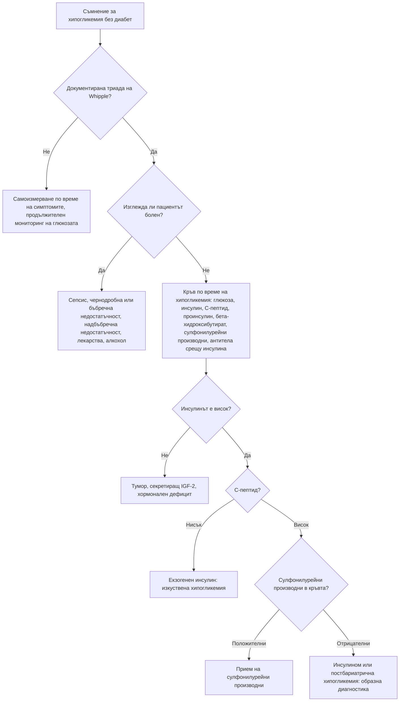

# Глава 36. Хипергликемия и хипогликемия

> **Част VIII. Ендокринна система и обмяна на веществата**

## Цели на главата

- Да се прилагат диагностичните критерии за захарен диабет и преддиабет.
- Да се разграничават типовете захарен диабет: тип 1, тип 2, LADA, MODY, вторичен (включително панкреатогенен) и лекарствен.
- Да се разпознават острите хипергликемични състояния: диабетна кетоацидоза и хиперосмоларно хипергликемично състояние.
- Да се прилага триадата на Whipple и да се изброяват причините за хипогликемия при пациент без диабет.
- Да се тълкуват инсулинът, C-пептидът и бета-хидроксибутиратът по време на хипогликемия.

## Ключови моменти

- Диабетът се диагностицира с глюкоза на гладно ≥ 7,0 mmol/l, глюкоза на 2-рия час ≥ 11,1 mmol/l, HbA1c ≥ 48 mmol/mol или случайна глюкоза ≥ 11,1 mmol/l със симптоми. Без категорична хипергликемия е нужен втори отклонен резултат *(SORT B [1])*.
- HbA1c е ненадежден при хемоглобинопатии, променена обмяна на еритроцитите, желязодефицит, бременност и бързо развиващ се диабет тип 1 [1].
- Слабо тяло, бърза загуба на тегло, кетоза и автоимунни заболявания при възрастен с „диабет тип 2“ налагат изследване на антитела срещу GAD и C-пептид *(SORT C [3])*.
- Диабетната кетоацидоза може да протече с глюкоза под 11,1 mmol/l, особено при SGLT2 инхибитори. Затова се измерват кетоните в кръвта *(SORT C [6])*.
- При човек без диабет хипогликемията се изследва само при документирана триада на Whipple. Кръвта се взема по време на хипогликемията *(SORT C [10])*.
- Новооткрит диабет със загуба на тегло след 60-годишна възраст налага изследване за карцином на панкреаса *(SORT C [5])*.

### Първите 60 секунди

- Измерете капилярната глюкоза при всеки пациент с нарушено съзнание, гърч, объркване или странно поведение.
- Глюкоза < 3,9 mmol/l при човек в съзнание, който може да гълта: 15–20 g глюкоза или друг бърз въглехидрат. Измерете отново след 15 минути и повторете при нужда [9].
- При нарушено съзнание не давайте нищо през устата. Приложете глюкагон 1 mg мускулно или подкожно или венозна глюкоза и се обадете на 112.
- При висока глюкоза с повръщане, коремна болка, задух или сънливост измерете кетоните в кръвта. При кетони ≥ 3 mmol/l се обадете на 112 [6].
- При пациент на SGLT2 инхибитор с гадене, повръщане или неразположение измерете кетоните дори при нормална глюкоза [6].

---

## А. Хипергликемия

### 1. Диагностични критерии за захарен диабет

Захарният диабет се диагностицира при **едно** от следните [1]:

| Критерий | Стойност |
|---|---|
| Глюкоза на гладно (венозна плазма) | ≥ 7,0 mmol/l |
| Глюкоза на 2-рия час при орален глюкозотолерантен тест (75 g) | ≥ 11,1 mmol/l |
| HbA1c | ≥ 48 mmol/mol (6,5%) |
| Случайна глюкоза със **симптоми** (полиурия, полидипсия, загуба на тегло) | ≥ 11,1 mmol/l |

При липса на категорична хипергликемия диагнозата се **потвърждава** с втори отклонен резултат. Той може да е от друго изследване в същата проба (например HbA1c и глюкоза на гладно) или от повторно изследване [1].

**Преддиабет:**

- нарушена гликемия на гладно — 6,1–6,9 mmol/l (по СЗО) или 5,6–6,9 mmol/l (по ADA) [1];
- нарушен глюкозен толеранс — 7,8–11,0 mmol/l на 2-рия час;
- HbA1c 42–47 mmol/mol (6,0–6,4%) по NICE [2] или 39–47 mmol/mol (5,7–6,4%) по ADA [1] (същите два прага са посочени и в приложение А).

**HbA1c е ненадежден при** [1]:

- **хемоглобинопатии** (включително таласемия);
- хемолиза, скорошно кървене или кръвопреливане, лечение на желязодефицит (фалшиво нисък);
- **желязодефицит** (фалшиво висок);
- бременност;
- ХБЗ в напреднал стадий, лечение с еритропоетин;
- **бързо развиващ се диабет** (тип 1), при който HbA1c още не е „догонил“ гликемията.

### 2. Типове захарен диабет

| Тип | Типичен пациент | Ключови белези | Изследвания |
|---|---|---|---|
| **Тип 1** | Деца и млади хора (но може на всяка възраст) | Остро начало, загуба на тегло, **кетоза**, слабо тяло | **Автоантитела** (GAD, IA-2, ZnT8, инсулинови), нисък C-пептид |
| **LADA** (латентен автоимунен диабет при възрастни) | Възрастни, често с нормално тегло | Първоначално се повлиява от перорални средства, но бързо прогресира към инсулинова зависимост; лична или фамилна анамнеза за автоимунни заболявания. Съставлява 2–12% от диабета, започнал в зряла възраст [3] | Антитела срещу GAD; C-пептид [3] |
| **Тип 2** | Възрастни, но все по-често и млади хора | Затлъстяване, метаболитен синдром, фамилна анамнеза, постепенно начало | Клинична диагноза |
| **MODY** (моногенен диабет) | Млади хора (обикновено под 25–35 години) | **Силна фамилна анамнеза в няколко поколения** (автозомно-доминантно унаследяване), липса на затлъстяване, липса на автоантитела, запазен C-пептид. GCK-MODY — лека, стабилна хипергликемия на гладно, не изисква лечение. HNF1A-MODY — отлично повлияване от сулфонилурейни производни | Калкулатор за вероятност от MODY, след това генетично изследване [4] |
| **Панкреатогенен (тип 3c)** | Хроничен панкреатит, резекция на панкреаса, муковисцидоза, хемохроматоза, **карцином на панкреаса** | Стеаторея, екзокринна недостатъчност | Фекална еластаза, образни изследвания |
| **Ендокринни причини** | — | Синдром на Cushing, акромегалия, феохромоцитом, хипертиреоидизъм, глюкагоном | Специфични изследвания |
| **Лекарствен** | — | **Глюкокортикоиди**, тиазиди (леко), бета-блокери, антипсихотици (оланзапин, клозапин), калциневринови инхибитори (такролимус), имунни чекпойнт инхибитори (остър автоимунен диабет), статини (леко) | Анамнеза |
| **Гестационен** | Бременни | Диагностициран за първи път през бременността (обикновено II–III триместър) | Орален глюкозотолерантен тест |

**Кога да се подозира диабет тип 1 или LADA при възрастен с „диабет тип 2“:**

- нормално тегло или слабо тяло;
- бърза загуба на тегло, кетонурия;
- бързо влошаване въпреки лечението;
- лична или фамилна анамнеза за автоимунни заболявания (хипотиреоидизъм, цьолиакия, витилиго, пернициозна анемия);
- възраст под 50 години.

**Кога да се подозира карцином на панкреаса:** новооткрит диабет със загуба на тегло след 60-годишна възраст. NICE препоръчва спешна КТ на корема (вж. глава 6) [5].

### 3. Остри хипергликемични състояния

| Белег | Диабетна кетоацидоза | Хиперосмоларно хипергликемично състояние |
|---|---|---|
| Типичен пациент | Диабет тип 1, но и тип 2 | Възрастни хора с диабет тип 2 |
| Начало | Часове до дни | Дни до седмици |
| Глюкоза | ≥ 11,1 mmol/l или известен диабет. Около 10% от случаите са с по-ниска глюкоза, най-често при SGLT2 инхибитори — **еугликемична кетоацидоза** [6] | ≥ 30 mmol/l по британските препоръки [7] или ≥ 33,3 mmol/l по консенсуса от 2024 г. [6] |
| Кетони в кръвта (бета-хидроксибутират) | ≥ 3 mmol/l | < 3 mmol/l |
| pH / бикарбонат | pH < 7,3 и/или бикарбонат < 18 mmol/l [6]; британските препоръки използват < 15 mmol/l [8] | pH ≥ 7,3 и бикарбонат ≥ 15 mmol/l |
| Осмолалитет | Различен | **> 320 mOsm/kg** [6, 7] |
| Клинична картина | Повръщане, **коремна болка**, **дишане на Kussmaul**, плодов мирис на дъха, дехидратация | Тежка дехидратация, **нарушено съзнание**, фокални неврологични симптоми, тромбози |
| Провокиращи фактори | Инфекция, пропуснат инсулин, нов диабет, SGLT2 инхибитори, алкохол, миокарден инфаркт | Инфекция, инсулт, миокарден инфаркт, лекарства (кортикостероиди, диуретици) |

---

## Б. Хипогликемия

### 4. Определение

**Триада на Whipple:**

1. симптоми на хипогликемия;
2. документирана ниска плазмена глюкоза;
3. облекчаване на симптомите след повишаване на глюкозата.

При пациенти с диабет [9]:

- **ниво 1** — < 3,9 mmol/l и ≥ 3,0 mmol/l;
- **ниво 2** — < 3,0 mmol/l;
- **ниво 3** — тежка хипогликемия, при която пациентът се нуждае от чужда помощ.

При хора **без диабет** хипогликемията се изследва само ако е документирана **триада на Whipple** (обикновено при глюкоза < 3,0 mmol/l) [10].

**Симптоми:**

- **автономни** — тремор, сърцебиене, изпотяване, глад, тревожност;
- **невроглюкопенични** — объркване, нарушено поведение, двойно виждане, фокален дефицит, гърчове, кома.

Възрастните хора и пациентите с дълъг диабет често имат **нарушено разпознаване на хипогликемията**.

### 5. Причини за хипогликемия

| Група | Причини |
|---|---|
| **Лекарства** (най-честа причина) | **Инсулин**, **сулфонилурейни производни** (особено при ХБЗ и възрастни хора); хинин, пентамидин, флуорохинолони, бета-блокери (маскират симптомите) |
| **Алкохол** | Особено при гладуване (инхибира глюконеогенезата) |
| **Тежки заболявания** | **Сепсис**, **чернодробна недостатъчност**, **бъбречна недостатъчност**, сърдечна недостатъчност, недохранване, анорексия |
| **Хормонален дефицит** | **Надбъбречна недостатъчност** (особено при деца), дефицит на растежен хормон, хипопитуитаризъм |
| **Тумори** | **Инсулином** (хипогликемия на гладно или при усилие); тумори, които не произхождат от островните клетки и секретират IGF-2 (големи мезенхимни тумори, хепатоцелуларен карцином) |
| **Постпрандиална хипогликемия** | **След бариатрична операция** (особено стомашен байпас) — 1–3 часа след хранене; дъмпинг синдром; нарушен глюкозен толеранс в ранния стадий (рядко значима) |
| **Автоимунни** | Антитела срещу инсулина (синдром на Hirata), антитела срещу инсулиновия рецептор |
| **Изкуствена** | **Тайно прилагане на инсулин или сулфонилурейни производни** — медицински работници, роднини на диабетици |
| **Вродени** | Гликогенози, вродени дефекти на метаболизма (при деца) |

### 6. Изследвания по време на хипогликемия

Кръвта се взема **по време на спонтанна хипогликемия** или при **72-часов тест с гладуване** в болнични условия. Изследват се и антителата срещу инсулина [10].

| Причина | Инсулин | C-пептид | Проинсулин | Бета-хидроксибутират | Сулфонилурейни производни в кръвта |
|---|---|---|---|---|---|
| **Инсулином** | ↑ | ↑ | ↑ | ↓ | Отрицателни |
| **Прием на сулфонилурейни производни** | ↑ | ↑ | ↑ | ↓ | **Положителни** |
| **Екзогенен инсулин** | **↑↑** | **↓** | ↓ | ↓ | Отрицателни |
| **Антитела срещу инсулина** | **Много ↑** | ↑ | ↑ | ↓ | Отрицателни |
| **Тумори, секретиращи IGF-2** | ↓ | ↓ | ↓ | ↓ | Отрицателни; високо съотношение IGF-2/IGF-1 |
| **Не-инсулинови причини** (гладуване, чернодробна недостатъчност, надбъбречна недостатъчност, алкохол) | ↓ | ↓ | ↓ | **↑** | Отрицателни |

**Ключов извод:** **висок инсулин с нисък C-пептид** означава екзогенен инсулин (изкуствена хипогликемия).

---

## 7. Безопасна диагностична стратегия

| Въпрос | Отговор |
|---|---|
| **Вероятна диагноза** | Диабет тип 2; хипогликемия от инсулин или сулфонилурейни производни |
| **Сериозни заболявания, които не бива да се пропускат** | **Диабетна кетоацидоза** (включително еугликемична); **хиперосмоларно състояние**; **тежка хипогликемия**; **карцином на панкреаса** при новооткрит диабет; **надбъбречна недостатъчност**; сепсис; инсулином |
| **Чести капани** | LADA, диагностициран като тип 2; MODY; ненадежден HbA1c при хемоглобинопатии и анемия; кортикостероиден диабет; SGLT2 инхибитори и кетоацидоза; хипогликемия от сулфонилурейни производни при ХБЗ; хипогликемия, приета за инсулт или гърч; изкуствена хипогликемия |
| **Маскиращи заболявания** | Захарен диабет (като причина за умора, загуба на тегло, инфекции, сърбеж), лекарства, заболявания на щитовидната жлеза |
| **Психосоциални аспекти** | Изкуствена хипогликемия, хранителни разстройства при диабет тип 1 (пропускане на инсулин с цел отслабване), депресия |

---

## 8. Диагностичен алгоритъм при хипогликемия при пациент без диабет

*Фигура 36.1. Диагностичен алгоритъм при хипогликемия при пациент без диабет. Схема на авторите въз основа на източниците, цитирани в главата.*

Текстово описание на фигура 36.1

1. Съмнение за хипогликемия без диабет. Следва: към т. 2.
2. **Въпрос:** Документирана триада на Whipple? Не — към т. 3; Да — към т. 4.
3. Самоизмерване по време на симптомите, продължителен мониторинг на глюкозата.
4. **Въпрос:** Изглежда ли пациентът болен? Да — към т. 5; Не — към т. 6.
5. Сепсис, чернодробна или бъбречна недостатъчност, надбъбречна недостатъчност, лекарства, алкохол.
6. Кръв по време на хипогликемия: глюкоза, инсулин, C-пептид, проинсулин, бета-хидроксибутират, сулфонилурейни производни, антитела срещу инсулина. Следва: към т. 7.
7. **Въпрос:** Инсулинът е висок? Не — към т. 8; Да — към т. 9.
8. Тумор, секретиращ IGF-2, хормонален дефицит.
9. **Въпрос:** C-пептид? Нисък — към т. 10; Висок — към т. 11.
10. Екзогенен инсулин: изкуствена хипогликемия.
11. **Въпрос:** Сулфонилурейни производни в кръвта? Положителни — към т. 12; Отрицателни — към т. 13.
12. Прием на сулфонилурейни производни.
13. Инсулином или постбариатрична хипогликемия: образна диагностика.

---

## 9. Червени флагове и насочване

### 9.1. Червени флагове

- Кетони в кръвта ≥ 3 mmol/l или повръщане и невъзможност за прием на течности при диабет тип 1.
- Новооткрита хипергликемия с кетоза, бърза загуба на тегло или повръщане, особено при деца и млади хора.
- Глюкоза ≥ 30 mmol/l с дехидратация или нарушено съзнание.
- Гадене, повръщане, коремна болка или задух при прием на SGLT2 инхибитор, дори при нормална глюкоза.
- Хипогликемия с нарушено съзнание, гърч или нужда от чужда помощ.
- Хипогликемия от сулфонилурейни производни, особено при възрастни хора и при ХБЗ.
- Документирана хипогликемия при човек без диабет.
- Новооткрит диабет със загуба на тегло при възраст над 60 години.

### 9.2. Кога и колко спешно да насочим

| Спешност | Клинична ситуация |
|---|---|
| **Незабавно (112 или спешно отделение)** | Подозрение за диабетна кетоацидоза или хиперосмоларно хипергликемично състояние [6]; тежка хипогликемия без бързо и пълно възстановяване; хипогликемия от сулфонилурейни производни (рискът продължава часове) |
| **В същия ден** | Подозрение за нов диабет тип 1 при дете или млад човек — към диабетен екип [11]; нов диабет с бърза загуба на тегло и кетоза при възрастен |
| **Бързо (до 2 седмици)** | Новооткрит диабет със загуба на тегло при възраст 60 и повече години — спешна КТ за карцином на панкреаса [5]; документирана хипогликемия при човек без диабет — към ендокринолог [10] |
| **Планово** | Подозрение за MODY [4] или LADA [3]; неясен тип диабет; повтаряща се хипогликемия при лечение с инсулин |
| **Проследяване в общата практика** | Диабет тип 2; преддиабет — промяна в начина на живот и поне ежегодно изследване [2]; изследване за диабет след гестационен диабет |

---

## 10. Клинични перли

- Кетоацидоза с нормална глюкоза е възможна при пациенти на SGLT2 инхибитори. Изследвайте кетоните при всеки такъв пациент с гадене, повръщане и неразположение.
- Слаб възрастен човек с „диабет тип 2“, който бързо губи тегло и не се повлиява от таблетките: изследвайте антитела срещу GAD (LADA).
- Диабет в няколко поколения при слаби млади хора без антитела: мислете за MODY.
- Хипогликемията може да имитира инсулт, гърч, психоза или алкохолно опиянение. Измерете глюкозата при всяко нарушено съзнание.
- Възрастен пациент на гликлазид или глибенкламид с влошена бъбречна функция: висок риск от продължителна хипогликемия.
- Висок инсулин и нисък C-пептид означават, че някой инжектира инсулин.
- HbA1c при таласемия минор може да бъде подвеждащ. Използвайте глюкозата.

---

## 11. Клиничен случай

**Етап 1 — представяне.** Мъж на 44 години с индекс на телесната маса 23 kg/m² има диагноза „диабет тип 2“ отпреди година. Лекуван е с метформин, после е добавен гликлазид. HbA1c се повишава от 7,2% до 9,8% за 6 месеца. Отслабнал е с 6 kg и съобщава за жажда и често уриниране. Майка му има хипотиреоидизъм.

> **Въпрос 1.** Кои белези не пасват на диабет тип 2?

**Етап 2 — изследвания.** Кетоните в капилярната кръв са 1,2 mmol/l. Антителата срещу GAD са силно положителни, а C-пептидът е 0,2 nmol/l.

> **Въпрос 2.** Коя е диагнозата?

> **Въпрос 3.** Как ще промените лечението?

Обсъждане и отговори

**Отговор 1.** Нормалното тегло, бързото влошаване въпреки лечението, загубата на тегло, кетозата и фамилната анамнеза за автоимунно заболяване не са типични за диабет тип 2 [3].

**Отговор 2.** **Латентен автоимунен диабет при възрастни (LADA).** Положителните антитела срещу GAD потвърждават автоимунния процес, а ниският C-пептид показва напреднала загуба на бета-клетките [3].

**Отговор 3.** При C-пептид под 0,3 nmol/l се препоръчва **инсулин в многократен режим**, както при диабет тип 1 [3]. Гликлазидът се спира, защото ускорява изчерпването на бета-клетките и не е ефективен. SGLT2 инхибиторите са рискови поради опасността от кетоацидоза [6]. Пациентът се обучава за самоконтрол, хипогликемия и измерване на кетоните.

**Поука.** Етикетът „диабет тип 2“ при слаб пациент с бързо прогресиране трябва да се преразгледа.

---

## Обобщение

- Диабетът се диагностицира с глюкоза или HbA1c. Типът се определя по клиничната картина, автоантителата, C-пептида и при нужда по генетично изследване.
- Кетоацидозата и хиперосмоларното състояние са спешни. При SGLT2 инхибитори кетоацидозата може да протече с почти нормална глюкоза.
- Най-честата причина за хипогликемия е лечението на диабета. При човек без диабет се изследва само документирана триада на Whipple.
- Инсулинът, C-пептидът, проинсулинът, бета-хидроксибутиратът и сулфонилурейните производни, измерени по време на хипогликемия, разграничават причините.

## Самопроверка

### Въпроси с един верен отговор

**1.** *(основно ниво)* Мъж на 52 години без оплаквания има глюкоза на гладно 7,4 mmol/l и HbA1c 50 mmol/mol в една и съща проба. Какво е заключението?

- **А.** Преддиабет
- **Б.** Захарен диабет — двата отклонени резултата от една проба потвърждават диагнозата
- **В.** Нужен е орален глюкозотолерантен тест
- **Г.** Повторно изследване след година
- **Д.** Нормални стойности за възрастта

Отговор и обосновка

**Верен отговор: Б.** Без категорична хипергликемия диагнозата изисква два отклонени резултата. Те могат да са от различни изследвания в една проба [1].

**2.** *(основно ниво)* Жена на 58 години с диабет тип 2 приема емпаглифлозин. От 2 дни има гадене, повръщане и коремна болка. Капилярната глюкоза е 9,8 mmol/l. Кое изследване е най-важно сега?

- **А.** HbA1c
- **Б.** Кетони в кръвта
- **В.** Само липаза
- **Г.** Ехография на корема
- **Д.** Липиден профил

Отговор и обосновка

**Верен отговор: Б.** SGLT2 инхибиторите могат да предизвикат кетоацидоза с почти нормална глюкоза. Кетоните в кръвта се измерват веднага [6].

**3.** *(основно ниво)* Мъж на 80 години с ХБЗ приема гликлазид. Намерен е объркан, с глюкоза 2,1 mmol/l. След прием на глюкоза се подобрява. Кое е правилното поведение?

- **А.** Остава вкъщи с по-ниска доза
- **Б.** Насочване към болница за наблюдение, защото хипогликемията може да се повтори
- **В.** Хранене и контрол след седмица
- **Г.** Добавяне на инсулин
- **Д.** Глюкагон и оставане вкъщи

Отговор и обосновка

**Верен отговор: Б.** Хипогликемията от сулфонилурейни производни при възрастни хора и при ХБЗ може да е продължителна и да се повтори след първоначалното подобрение. Нужни са наблюдение и преглед на лечението.

**4.** *(напреднало ниво)* Медицинска сестра на 32 години без диабет има епизоди на объркване. По време на епизод глюкозата е 1,9 mmol/l, инсулинът е много висок, а C-пептидът е потиснат. Коя е най-вероятната причина?

- **А.** Инсулином
- **Б.** Прием на сулфонилурейни производни
- **В.** Инжектиране на инсулин
- **Г.** Тумор, секретиращ IGF-2
- **Д.** Надбъбречна недостатъчност

Отговор и обосновка

**Верен отговор: В.** Високият инсулин с потиснат C-пептид означава екзогенен инсулин. При инсулином и при сулфонилурейни производни и инсулинът, и C-пептидът са високи [10].

**5.** *(напреднало ниво)* Мъж на 21 години с ИТМ 22 kg/m² има глюкоза на гладно 6,8 mmol/l и HbA1c 44 mmol/mol, стабилни от 3 години. Майка му и баба му имат „лек диабет“ без лечение. Антителата са отрицателни. Коя е най-вероятната диагноза?

- **А.** Диабет тип 1
- **Б.** LADA
- **В.** GCK-MODY
- **Г.** Диабет тип 2
- **Д.** Панкреатогенен диабет

Отговор и обосновка

**Верен отговор: В.** Леката стабилна хипергликемия на гладно, засегнатият родител, нормалното тегло и отрицателните антитела насочват към GCK-MODY. Генетичното изследване се насочва с калкулатора за вероятност [4]. GCK-MODY обикновено не изисква лечение.

### Задача

Жена на 45 години с бета-таласемия минор има глюкоза на гладно 7,6 и 7,8 mmol/l при две изследвания. HbA1c е 38 mmol/mol. Как ще тълкувате резултатите?

Решение

HbA1c е ненадежден при хемоглобинопатии и променена обмяна на еритроцитите [1]. Двете стойности на глюкозата на гладно ≥ 7,0 mmol/l потвърждават **захарен диабет**, въпреки нормалния HbA1c. За проследяване се използват глюкозата (самоконтрол или продължителен мониторинг) и при нужда фруктозамин, а не само HbA1c.

### OSCE станция: Обучение за разпознаване и лечение на хипогликемия

**Време:** 7 минути. **Ниво:** основно (студенти, специализанти).

**Задача за кандидата.** Мъж на 58 години с диабет тип 2 започва базален инсулин. Обяснете му как да разпознава и лекува хипогликемия.

**Информация за симулирания пациент (за изпитващия).** Работи като шофьор на доставки. Съпругата му е с него.

**Рубрика за оценяване**

| Критерий | Точки |
|---|---|
| Обяснява какво е хипогликемия и прага (под 3,9 mmol/l) | 1 |
| Изброява симптомите: тремор, изпотяване, сърцебиене, глад, объркване | 2 |
| Обяснява лечението: 15–20 g глюкоза, повторно измерване след 15 минути, повторение при нужда, после храна | 2 |
| Обучава съпругата за глюкагон при нарушено съзнание и кога да се обади на 112 | 2 |
| Обсъжда шофирането: измерване на глюкозата преди шофиране и спиране при симптоми | 1 |
| Обсъжда причините: пропуснато хранене, алкохол, физическо натоварване, грешна доза | 1 |
| Проверява разбирането с метода „обяснете ми обратно“ | 1 |
| **Общо** | **10** |

**Праг за успешно представяне:** 7 от 10 точки, включително лечението и глюкагона.

## Литература

1. American Diabetes Association Professional Practice Committee for Diabetes. Diagnosis and Classification of Diabetes: Standards of Care in Diabetes-2026. Diabetes Care. 2026;49(Suppl 1):S27-S49. doi:10.2337/dc26-S002. PMID: 41358893.
2. National Institute for Health and Care Excellence. Type 2 diabetes: prevention in people at high risk (Public health guideline PH38). London: NICE; 2012 [актуализирано 2017]. Достъпно на: https://www.nice.org.uk/guidance/ph38
3. Buzzetti R, Tuomi T, Mauricio D, Pietropaolo M, Zhou Z, Pozzilli P, et al. Management of Latent Autoimmune Diabetes in Adults: A Consensus Statement From an International Expert Panel. Diabetes. 2020;69(10):2037-2047. doi:10.2337/dbi20-0017. PMID: 32847960.
4. Shields BM, McDonald TJ, Ellard S, Campbell MJ, Hyde C, Hattersley AT. The development and validation of a clinical prediction model to determine the probability of MODY in patients with young-onset diabetes. Diabetologia. 2012;55(5):1265-72. doi:10.1007/s00125-011-2418-8. PMID: 22218698.
5. National Institute for Health and Care Excellence. Suspected cancer: recognition and referral (NICE guideline NG12). London: NICE; 2015 [актуализирано 2026]. Достъпно на: https://www.nice.org.uk/guidance/ng12
6. Umpierrez GE, Davis GM, ElSayed NA, Fadini GP, Galindo RJ, Hirsch IB, et al. Hyperglycemic Crises in Adults With Diabetes: A Consensus Report. Diabetes Care. 2024;47(8):1257-1275. doi:10.2337/dci24-0032. PMID: 39052901.
7. Mustafa OG, Haq M, Dashora U, Castro E, Dhatariya KK; Joint British Diabetes Societies (JBDS) for Inpatient Care Group. Management of Hyperosmolar Hyperglycaemic State (HHS) in Adults: An updated guideline from the Joint British Diabetes Societies (JBDS) for Inpatient Care Group. Diabet Med. 2023;40(3):e15005. doi:10.1111/dme.15005. PMID: 36370077.
8. Dhatariya KK; Joint British Diabetes Societies for Inpatient Care. The management of diabetic ketoacidosis in adults-An updated guideline from the Joint British Diabetes Society for Inpatient Care. Diabet Med. 2022;39(6):e14788. doi:10.1111/dme.14788. PMID: 35224769.
9. American Diabetes Association Professional Practice Committee for Diabetes. Glycemic Goals, Hypoglycemia, and Hyperglycemic Crises: Standards of Care in Diabetes-2026. Diabetes Care. 2026;49(Suppl 1):S132-S149. doi:10.2337/dc26-S006. PMID: 41358894.
10. Cryer PE, Axelrod L, Grossman AB, Heller SR, Montori VM, Seaquist ER, et al. Evaluation and management of adult hypoglycemic disorders: an Endocrine Society Clinical Practice Guideline. J Clin Endocrinol Metab. 2009;94(3):709-28. doi:10.1210/jc.2008-1410. PMID: 19088155.
11. National Institute for Health and Care Excellence. Diabetes (type 1 and type 2) in children and young people: diagnosis and management (NICE guideline NG18). London: NICE; 2015 [актуализирано 2023]. Достъпно на: https://www.nice.org.uk/guidance/ng18

*Последна проверка на съдържанието: септември 2026 г. Следващ планиран преглед: септември 2027 г. (вж. „Политика за актуализация“ в README).*

<!-- навигация -->

---

[← Глава 35. Повишени възпалителни показатели и парапротеинемия](35-vazpalitelni-pokazateli-paraproteini.md) · [Съдържание](../README.md) · [Глава 37. Заболявания на щитовидната жлеза →](37-shtitovidna-zhleza.md)
