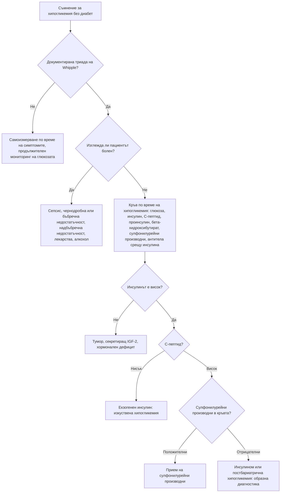

# Глава 36. Хипергликемия и хипогликемия

> **Част VIII. Ендокринна система и обмяна на веществата**

## Цели на главата

- Да се прилагат диагностичните критерии за захарен диабет и преддиабет.
- Да се разграничават типовете захарен диабет: тип 1, тип 2, LADA, MODY, вторичен (включително панкреатогенен) и лекарствен.
- Да се разпознават острите хипергликемични състояния: диабетна кетоацидоза и хиперосмоларно хипергликемично състояние.
- Да се подхожда систематично към хипогликемията при пациент без диабет.
- Да се тълкуват инсулинът, C-пептидът и бета-хидроксибутиратът по време на хипогликемия.

---

## А. ХИПЕРГЛИКЕМИЯ

## 1. Диагностични критерии за захарен диабет

Захарният диабет се диагностицира при **едно** от следните:

| Критерий | Стойност |
|---|---|
| Глюкоза на гладно (венозна плазма) | ≥ 7,0 mmol/l |
| Глюкоза на 2-рия час при орален глюкозотолерантен тест (75 g) | ≥ 11,1 mmol/l |
| HbA1c | ≥ 48 mmol/mol (6,5%) |
| Случайна глюкоза със **симптоми** (полиурия, полидипсия, загуба на тегло) | ≥ 11,1 mmol/l |

При липса на симптоми диагнозата трябва да се **потвърди** с второ изследване.

**Преддиабет:**

- нарушена гликемия на гладно — 6,1–6,9 mmol/l (по СЗО) или 5,6–6,9 mmol/l (по ADA);
- нарушен глюкозен толеранс — 7,8–11,0 mmol/l на 2-рия час;
- HbA1c 42–47 mmol/mol (6,0–6,4%) или 39–47 mmol/mol (5,7–6,4%) по ADA.

**HbA1c е ненадежден при:**

- **хемоглобинопатии** (включително таласемия);
- хемолиза, скорошно кървене или кръвопреливане, лечение на желязодефицит (фалшиво нисък);
- **желязодефицит** (фалшиво висок);
- бременност;
- ХБЗ в напреднал стадий, лечение с еритропоетин;
- **бързо развиващ се диабет** (тип 1), при който HbA1c още не е „догонил“ гликемията.

## 2. Типове захарен диабет

| Тип | Типичен пациент | Ключови белези | Изследвания |
|---|---|---|---|
| **Тип 1** | Деца и млади хора (но може на всяка възраст) | Остро начало, загуба на тегло, **кетоза**, слабо тяло | **Автоантитела** (GAD, IA-2, ZnT8, инсулинови), нисък C-пептид |
| **LADA** (латентен автоимунен диабет при възрастни) | Възрастни, често с нормално тегло | Първоначално се повлиява от перорални средства, но бързо прогресира към инсулинова зависимост; лична или фамилна анамнеза за автоимунни заболявания | Антитела срещу GAD |
| **Тип 2** | Възрастни, но все по-често и млади хора | Затлъстяване, метаболитен синдром, фамилна анамнеза, постепенно начало | Клинична диагноза |
| **MODY** (моногенен диабет) | Млади хора (обикновено под 25–35 години) | **Силна фамилна анамнеза в няколко поколения** (автозомно-доминантно унаследяване), липса на затлъстяване, липса на автоантитела, запазен C-пептид. GCK-MODY — лека, стабилна хипергликемия на гладно, не изисква лечение. HNF1A-MODY — отлично повлияване от сулфонилурейни производни | Генетично изследване |
| **Панкреатогенен (тип 3c)** | Хроничен панкреатит, резекция на панкреаса, муковисцидоза, хемохроматоза, **карцином на панкреаса** | Стеаторея, екзокринна недостатъчност | Фекална еластаза, образни изследвания |
| **Ендокринни причини** | — | Синдром на Cushing, акромегалия, феохромоцитом, хипертиреоидизъм, глюкагоном | Специфични изследвания |
| **Лекарствен** | — | **Глюкокортикоиди**, тиазиди (леко), бета-блокери, антипсихотици (оланзапин, клозапин), калциневринови инхибитори (такролимус), имунни чекпойнт инхибитори (остър автоимунен диабет), статини (леко) | Анамнеза |
| **Гестационен** | Бременни | Диагностициран за първи път през бременността (обикновено II–III триместър) | Орален глюкозотолерантен тест |

**Кога да се подозира диабет тип 1 или LADA при възрастен с „диабет тип 2“:**

- нормално тегло или слабо тяло;
- бърза загуба на тегло, кетонурия;
- бързо влошаване въпреки лечението;
- лична или фамилна анамнеза за автоимунни заболявания (хипотиреоидизъм, цьолиакия, витилиго, пернициозна анемия);
- възраст под 50 години.

**Кога да се подозира карцином на панкреаса:** новооткрит диабет със загуба на тегло след 50–60-годишна възраст (вж. глава 6).

## 3. Остри хипергликемични състояния

| Белег | Диабетна кетоацидоза | Хиперосмоларно хипергликемично състояние |
|---|---|---|
| Типичен пациент | Диабет тип 1, но и тип 2 | Възрастни хора с диабет тип 2 |
| Начало | Часове до дни | Дни до седмици |
| Глюкоза | Обикновено > 11 mmol/l (при SGLT2 инхибитори може да е нормална — **еугликемична кетоацидоза**) | Обикновено > 30 mmol/l |
| Кетони в кръвта | ≥ 3 mmol/l | Нормални или леко повишени |
| pH / бикарбонат | < 7,3 / < 15 mmol/l | Нормални |
| Осмолалитет | Различен | **> 320 mOsm/kg** |
| Клинична картина | Повръщане, **коремна болка**, **дишане на Kussmaul**, плодов мирис на дъха, дехидратация | Тежка дехидратация, **нарушено съзнание**, фокални неврологични симптоми, тромбози |
| Провокиращи фактори | Инфекция, пропуснат инсулин, нов диабет, SGLT2 инхибитори, алкохол, миокарден инфаркт | Инфекция, инсулт, миокарден инфаркт, лекарства (кортикостероиди, диуретици) |

---

## Б. ХИПОГЛИКЕМИЯ

## 4. Определение

**Триада на Whipple:**

1. симптоми на хипогликемия;
2. документирана ниска плазмена глюкоза;
3. облекчаване на симптомите след повишаване на глюкозата.

При пациенти с диабет:

- **ниво 1** — < 3,9 mmol/l;
- **ниво 2** — < 3,0 mmol/l;
- **ниво 3** — тежка хипогликемия, при която пациентът се нуждае от чужда помощ.

При хора **без диабет** хипогликемията се изследва само ако е документирана **триада на Whipple** (обикновено при глюкоза < 3,0 mmol/l).

**Симптоми:**

- **автономни** — тремор, сърцебиене, изпотяване, глад, тревожност;
- **невроглюкопенични** — объркване, нарушено поведение, двойно виждане, фокален дефицит, гърчове, кома.

Възрастните хора и пациентите с дълъг диабет често имат **нарушено разпознаване на хипогликемията**.

## 5. Причини за хипогликемия

| Група | Причини |
|---|---|
| **Лекарства** (най-честа причина) | **Инсулин**, **сулфонилурейни производни** (особено при ХБЗ и възрастни хора); хинин, пентамидин, флуорохинолони, бета-блокери (маскират симптомите) |
| **Алкохол** | Особено при гладуване (инхибира глюконеогенезата) |
| **Тежки заболявания** | **Сепсис**, **чернодробна недостатъчност**, **бъбречна недостатъчност**, сърдечна недостатъчност, недохранване, анорексия |
| **Хормонален дефицит** | **Надбъбречна недостатъчност** (особено при деца), дефицит на растежен хормон, хипопитуитаризъм |
| **Тумори** | **Инсулином** (хипогликемия на гладно или при усилие); тумори, които не произхождат от островните клетки и секретират IGF-2 (големи мезенхимни тумори, хепатоцелуларен карцином) |
| **Постпрандиална хипогликемия** | **След бариатрична операция** (особено стомашен байпас) — 1–3 часа след хранене; дъмпинг синдром; нарушен глюкозен толеранс в ранния стадий (рядко значима) |
| **Автоимунни** | Антитела срещу инсулина (синдром на Hirata), антитела срещу инсулиновия рецептор |
| **Изкуствена** | **Тайно прилагане на инсулин или сулфонилурейни производни** — медицински работници, роднини на диабетици |
| **Вродени** | Гликогенози, вродени дефекти на метаболизма (при деца) |

## 6. Изследвания по време на хипогликемия

Кръвта се взема **по време на спонтанна хипогликемия** или при **72-часов тест с гладуване** в болнични условия.

| Причина | Инсулин | C-пептид | Проинсулин | Бета-хидроксибутират | Сулфонилурейни производни в кръвта |
|---|---|---|---|---|---|
| **Инсулином** | ↑ | ↑ | ↑ | ↓ | Отрицателни |
| **Прием на сулфонилурейни производни** | ↑ | ↑ | ↑ | ↓ | **Положителни** |
| **Екзогенен инсулин** | **↑↑** | **↓** | ↓ | ↓ | Отрицателни |
| **Антитела срещу инсулина** | **Много ↑** | ↑ | ↑ | ↓ | Отрицателни |
| **Тумори, секретиращи IGF-2** | ↓ | ↓ | ↓ | ↓ | Отрицателни; високо съотношение IGF-2/IGF-1 |
| **Не-инсулинови причини** (гладуване, чернодробна недостатъчност, надбъбречна недостатъчност, алкохол) | ↓ | ↓ | ↓ | **↑** | Отрицателни |

**Ключов извод:** **висок инсулин с нисък C-пептид** означава екзогенен инсулин (изкуствена хипогликемия).

---

## 7. Безопасна диагностична стратегия

| Въпрос | Отговор |
|---|---|
| **Вероятна диагноза** | Диабет тип 2; хипогликемия от инсулин или сулфонилурейни производни |
| **Сериозни заболявания, които не бива да се пропускат** | **Диабетна кетоацидоза** (включително еугликемична); **хиперосмоларно състояние**; **тежка хипогликемия**; **карцином на панкреаса** при новооткрит диабет; **надбъбречна недостатъчност**; сепсис; инсулином |
| **Чести капани** | LADA, диагностициран като тип 2; MODY; ненадежден HbA1c при хемоглобинопатии и анемия; кортикостероиден диабет; SGLT2 инхибитори и кетоацидоза; хипогликемия от сулфонилурейни производни при ХБЗ; хипогликемия, приета за инсулт или гърч; изкуствена хипогликемия |
| **Маскиращи заболявания** | Захарен диабет (като причина за умора, загуба на тегло, инфекции, сърбеж), лекарства, заболявания на щитовидната жлеза |
| **Психосоциални аспекти** | Изкуствена хипогликемия, хранителни разстройства при диабет тип 1 (пропускане на инсулин с цел отслабване), депресия |

---

## 8. Диагностичен алгоритъм при хипогликемия при пациент без диабет

---

## 9. Клинични перли

- Кетоацидоза с нормална глюкоза е възможна при пациенти на SGLT2 инхибитори. Изследвайте кетоните при всеки такъв пациент с гадене, повръщане и неразположение.
- Слаб възрастен човек с „диабет тип 2“, който бързо губи тегло и не се повлиява от таблетките: изследвайте антитела срещу GAD (LADA).
- Диабет в няколко поколения при слаби млади хора без антитела: мислете за MODY.
- Хипогликемията може да имитира инсулт, гърч, психоза или алкохолно опиянение. Измерете глюкозата при всяко нарушено съзнание.
- Възрастен пациент на гликлазид или глибенкламид с влошена бъбречна функция: висок риск от продължителна хипогликемия.
- Висок инсулин и нисък C-пептид означават, че някой инжектира инсулин.
- HbA1c при таласемия минор може да бъде подвеждащ. Използвайте глюкозата.

---

## 10. Клиничен случай

**Случай.** Мъж на 44 години, с индекс на телесната маса 23 kg/m², има диагноза „диабет тип 2“ отпреди година. Лекуван е с метформин, после е добавен гликлазид. HbA1c се повишава от 7,2% до 9,8% за 6 месеца. Отслабнал е с 6 kg. Съобщава за жажда и често уриниране. Майка му има хипотиреоидизъм. Кетоните в капилярната кръв са 1,2 mmol/l.

**Въпроси.** 1) Какво не пасва на диабет тип 2? 2) Кое изследване ще изясни диагнозата?

**Обсъждане.** Нормалното тегло, бързото влошаване въпреки лечението, загубата на тегло, кетозата и фамилната анамнеза за автоимунно заболяване насочват към **латентен автоимунен диабет при възрастни (LADA)**. Антителата срещу GAD са силно положителни, а C-пептидът е нисък. Необходимо е **лечение с инсулин**. Сулфонилурейните производни ускоряват изчерпването на бета-клетките. SGLT2 инхибиторите са рискови поради опасността от кетоацидоза.

**Поука.** Етикетът „диабет тип 2“ при слаб пациент с бързо прогресиране трябва да се преразгледа.

<!-- навигация -->

---

[← Глава 35. Повишени възпалителни показатели и парапротеинемия](35-vazpalitelni-pokazateli-paraproteini.md) · [Съдържание](../README.md) · [Глава 37. Заболявания на щитовидната жлеза →](37-shtitovidna-zhleza.md)
