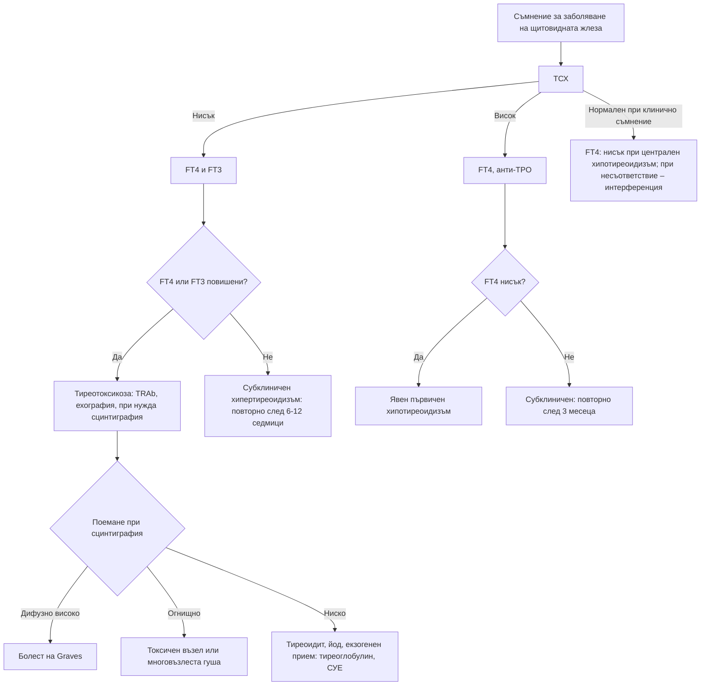

# Глава 37. Заболявания на щитовидната жлеза

> **Част VIII. Ендокринна система и обмяна на веществата**

## Цели на главата

- Да се тълкуват комбинациите от ТСХ, FT4 и FT3, включително нетипичните.
- Да се разпознават лабораторните артефакти, особено от биотин.
- Да се разграничават причините за тиреотоксикоза чрез антитела, сцинтиграфия и клинична картина.
- Да се разпознават тиреотоксичната криза и микседемната кома.
- Да се оценяват възлите в щитовидната жлеза по системата EU-TIRADS и да се определя кога е нужна тънкоиглена биопсия.

## Ключови моменти

- ТСХ е най-добрият първоначален тест, освен при подозрение за заболяване на хипофизата. Тогава се изследват ТСХ и FT4 едновременно *(SORT C [2])*.
- Функцията на щитовидната жлеза не се изследва по време на остро заболяване, освен ако то не се дължи на щитовидната жлеза *(SORT C [2])*.
- Биотинът дава фалшиво нисък ТСХ и фалшиво високи FT4 и FT3. Питайте за хранителни добавки при всяко несъответствие между резултатите и клиничната картина *(SORT B [1])*.
- При тиреотоксикоза TRAb потвърждават болестта на Graves. При отрицателни TRAb се обсъжда сцинтиграфия *(SORT C [2, 3])*.
- При субклиничен хипотиреоидизъм ТСХ се повтаря след 3 месеца. Левотироксин се обсъжда при ТСХ ≥ 10 mIU/l два пъти. При по-нисък ТСХ, симптоми и възраст под 65 години се обсъжда 6-месечен опит *(SORT C [2])*.
- Възлите се оценяват с ТСХ и ехография по EU-TIRADS. Биопсия се прави при възли над 10, 15 и 20 mm съответно при EU-TIRADS 5, 4 и 3 *(SORT C [8])*.

---

## 1. Тълкуване на функционалните изследвания

*Таблица 37.1. Тълкуване на функционалните изследвания.*

| ТСХ | FT4 | FT3 | Интерпретация | Основни причини |
|---|---|---|---|---|
| ↓ | ↑ | ↑ | **Първичен хипертиреоидизъм** | Болест на Graves, токсична многовъзлеста гуша, токсичен аденом, тиреоидити, екзогенен прием |
| ↓ | N | ↑ | **T3-тиреотоксикоза** | Ранна болест на Graves, токсичен възел |
| ↓ | N | N | **Субклиничен хипертиреоидизъм** | Ранна болест на Graves, възлеста гуша, предозиране на левотироксин, възстановяване след хипертиреоидизъм, I триместър на бременността, нетиреоидно заболяване, кортикостероиди, допамин |
| ↑ | ↓ | ↓/N | **Първичен хипотиреоидизъм** | Тиреоидит на Hashimoto, след радиойод или операция, лекарства, йоден дефицит, възстановителна фаза на тиреоидит |
| ↑ | N | N | **Субклиничен хипотиреоидизъм** | Ранен Hashimoto; възстановяване след нетиреоидно заболяване; интерференция (хетерофилни антитела); надбъбречна недостатъчност (лек ръст на ТСХ); лека степен при затлъстяване |
| N/↓ | ↓ | ↓ | Централен хипотиреоидизъм или нетиреоидно заболяване | Заболяване на хипофизата или хипоталамуса; тежко общо заболяване; глюкокортикоиди, допамин |
| N/↑ | ↑ | ↑ | **Неадекватно неподтиснат ТСХ** | Тиреотропином (ТСХ-секретиращ аденом), резистентност към тиреоидните хормони, лабораторна интерференция, амиодарон (в началото), прием на левотироксин непосредствено преди изследването при нередовно лечение |

**Лабораторна интерференция.** Високите дози биотин (добавки за коса и нокти, до 10 mg дневно и повече) пречат на имунохимичните методи, основани на стрептавидин и биотин. Те дават фалшиво нисък ТСХ и фалшиво високи FT4 и FT3 [1], т.е. картина, която имитира болест на Graves, понякога дори с фалшиво положителни антитела срещу ТСХ-рецептора. Биотинът трябва да се спре 2–7 дни преди изследването в зависимост от дозата. Затова всеки пациент със съмнение за заболяване на щитовидната жлеза се пита за хранителни добавки [2]. Хетерофилните антитела и макро-ТСХ също могат да дадат фалшиви резултати. При несъответствие между резултатите и клиничната картина се обсъжда с лабораторията.

Нетиреоидно заболяване (синдром на ниския T3). При тежко остро заболяване първо се понижава T3, а по-късно T4, при нормален или нисък ТСХ. Във възстановителната фаза ТСХ може временно да се повиши. Функцията на щитовидната жлеза не се изследва при остро болни, освен при конкретно подозрение [2].

---

## 2. Тиреотоксикоза

### 2.1. Клинична картина

- **Симптоми:** загуба на тегло при запазен или повишен апетит, топлоусещане, изпотяване, сърцебиене, тревожност, раздразнителност, безсъние, тремор, диария, мускулна слабост, олигоменорея.
- **Белези:** тахикардия, **предсърдно мъждене**, тремор, топла влажна кожа, ретракция на клепачите, хиперрефлексия, проксимална миопатия, гуша.
- **При възрастни хора** (апатичен хипертиреоидизъм): загуба на тегло, апатия, депресия, предсърдно мъждене, сърдечна недостатъчност, без изразена възбуда и тремор.
- **Специфични за болестта на Graves:** орбитопатия (проптоза, ретракция на клепачите, периорбитален оток, диплопия, конюнктивална инжекция), претибиален микседем, тиреоидна акропахия, дифузна гуша с шум.

### 2.2. Причини

*Таблица 37.2. Тиреотоксикоза: причини.*

| Причина | Особености | Сцинтиграфия | Други изследвания |
|---|---|---|---|
| **Болест на Graves** | Млади и средна възраст, жени, дифузна гуша, орбитопатия | Дифузно повишено поемане | Антитела срещу ТСХ-рецептора (TRAb) [2, 3] |
| **Токсична многовъзлеста гуша** | Възрастни хора, възлеста гуша, по-често в райони с йоден дефицит | Хетерогенно, „горещи“ огнища | – |
| **Токсичен аденом** | Единичен възел | Единично „горещо“ огнище с потискане на останалата тъкан | – |
| **Подостър (гранулематозен) тиреоидит на de Quervain** | След вирусна инфекция; болезнена, чувствителна жлеза, треска; фази: тиреотоксикоза → хипотиреоидизъм → възстановяване | **Ниско поемане** | **Висока СУЕ и CRP** |
| **Безболезнен и следродилен тиреоидит** | Безболезнен; следродилният до 12 месеца след раждането | Ниско поемане | Антитела срещу тиреоидната пероксидаза (TPO) |
| **Амиодарон-индуцирана тиреотоксикоза** | Тип 1: подлежаща възлеста гуша, йодно натоварване. Тип 2: деструктивен тиреоидит | Различна | Доплерова ехография [4] |
| **Йод-индуцирана** | След йодни контрастни вещества или йодсъдържащи добавки при възлеста гуша | Ниско поемане | Йод в урината |
| **Екзогенен прием** (изкуствена тиреотоксикоза, средства за отслабване) | Без гуша | **Ниско поемане** | **Нисък тиреоглобулин** |
| **hCG-медиирана** | Hyperemesis gravidarum, мехурна бременност, хориокарцином | – | hCG |
| **Други** | Инхибитори на имунните контролни точки (тиреоидит), интерферон, литий, струма овари, ТСХ-секретиращ аденом | – | – |

### 2.3. Тиреотоксична криза

Животозастрашаващо състояние. Проявява се с висока температура, тахикардия или предсърдно мъждене с висока камерна честота, сърдечна недостатъчност, възбуда, делир или кома, повръщане, диария, жълтеница. Провокира се от инфекция, операция, травма, йодни контрастни вещества и спиране на тиреостатиците. Тежестта се оценява със скалата на Burch-Wartofsky. Сбор ≥ 45 точки е силно подозрителен за тиреотоксична криза [5].

---

## 3. Хипотиреоидизъм

### 3.1. Клинична картина

Умора, студоусещане, наддаване на тегло (умерено), запек, суха кожа, косопад, дрезгав глас, депресия, забавено мислене, менорагия, мускулни крампи и миалгии, синдром на карпалния тунел, брадикардия, забавено отпускане на сухожилните рефлекси, подпухнало лице, периорбитален оток, неоставящ ямка оток. Лабораторно: хиперхолестеролемия, хипонатриемия, повишена креатинкиназа (КК), анемия (нормоцитна или макроцитна).

### 3.2. Причини

- **Хроничен автоимунен тиреоидит (Hashimoto)** – най-честата причина; антитела срещу TPO; често с други автоимунни заболявания.
- **Ятрогенен** – след радиойод, тиреоидектомия, лъчетерапия на шията.
- **Лекарства** – амиодарон, литий, инхибитори на имунните контролни точки, тирозинкиназни инхибитори, интерферон, тиреостатици.
- **Йоден дефицит** – исторически значим за някои райони на България (ендемична гуша); намалява след въвеждането на йодираната сол.
- **Преходен** – възстановителна фаза на тиреоидитите.
- **Централен** – заболявания на хипофизата и хипоталамуса. **ТСХ е нисък или нормален и не може да се използва за диагноза и проследяване.**
- **Вроден** – открива се при неонаталния скрининг.

### 3.3. Микседемна кома

Тежък хипотиреоидизъм с нарушено съзнание, хипотермия, брадикардия, хипотония, хиповентилация (хиперкапния), хипонатриемия и хипогликемия. Засяга главно възрастни жени през зимата. Провокира се от инфекция, седативи и студ. Преди лечението с тиреоидни хормони трябва да се изключи или да се лекува и съпътстващата надбъбречна недостатъчност [6].

---

## 4. Гуша

*Таблица 37.3. Гуша.*

| Вид | Причини |
|---|---|
| **Дифузна** | Болест на Graves, Hashimoto, йоден дефицит, физиологична (пубертет, бременност), струмогени (литий), инфилтративни заболявания |
| **Многовъзлеста** | Йоден дефицит (в миналото), възраст, генетично предразположение |
| **Единичен възел** | Колоиден възел, аденом, киста, карцином |
| **Бързо нарастваща** | Анапластичен карцином, лимфом (особено на фона на Hashimoto), кръвоизлив в киста (внезапна болка и подуване) |

Ретростернална гуша може да компримира трахеята (стридор, задух), хранопровода (дисфагия) и горната празна вена. Белег на Pemberton: зачервяване на лицето и разширени вени на шията при вдигане на двете ръце над главата.

---

## 5. Възли в щитовидната жлеза

### 5.1. Епидемиология

Възли се откриват при палпация при около 5% от жените и 1% от мъжете [7], а при ехография – при до 60% от възрастните [8]. Злокачествени са 1–5% от възлите в неподбрани популации [8] и 7–15% от възлите, насочени за оценка, в зависимост от възрастта, пола, облъчването и фамилната анамнеза [7]. Масовият ехографски скрининг води до свръхдиагностика на малки папиларни карциноми без клинично значение.

### 5.2. Оценка

1. **ТСХ.** При нисък ТСХ се прави **сцинтиграфия**. „Горещият“ (автономен) възел почти никога не е злокачествен и не изисква биопсия.
2. Ехография със стратификация на риска по EU-TIRADS [8, 9]:

*Таблица 37.4. Възли в щитовидната жлеза: оценка.*

| Категория | Ехографски белези | Показание за тънкоиглена аспирационна биопсия |
|---|---|---|
| EU-TIRADS 2 (доброкачествен) | Чиста киста, изцяло спонгиформен възел | Не (само при компресия) |
| EU-TIRADS 3 (нисък риск) | Овален, гладък, изоехогенен или хиперехогенен, без високорискови белези | При > 20 mm |
| EU-TIRADS 4 (междинен риск) | Умерено хипоехогенен, без високорискови белези | При > 15 mm |
| EU-TIRADS 5 (висок риск) | Поне един високорисков белег: по-висок, отколкото широк, неправилни контури, микрокалцификати, изразена хипоехогенност | При > 10 mm |

Възлите под прага за биопсия се проследяват с ехография: EU-TIRADS 5 – на 6–12 месеца, EU-TIRADS 4 – след 1 година, EU-TIRADS 3 с размер 10–20 mm – след 3–5 години [8].

3. Тънкоиглена аспирационна биопсия с цитологична оценка по системата Bethesda (категории I–VI) [10].

### 5.3. Червени флагове при възел

- Бързо нарастване.
- Твърд, фиксиран възел.
- **Дрезгав глас** (засягане на *n. laryngeus recurrens*).
- **Шийна лимфаденопатия.**
- Стридор, дисфагия.
- **Облъчване на шията** в детска възраст.
- Фамилна анамнеза за карцином на щитовидната жлеза или MEN2 (медуларен карцином – калцитонин).
- Възраст под 20 години, мъжки пол.

NICE препоръчва насочване по пътя за съмнение за рак при необяснима бучка в щитовидната жлеза [11].

### 5.4. Карциноми на щитовидната жлеза

*Таблица 37.5. Карциноми на щитовидната жлеза.*

| Вид | Особености |
|---|---|
| **Папиларен** | Най-честият; млади и средна възраст; метастазира в лимфните възли; отлична прогноза |
| **Фоликуларен** | Хематогенни метастази (кости, бял дроб) |
| **Медуларен** | От C-клетките; калцитонин и CEA; спорадичен или при MEN2 (мутация в RET) – задължителен генетичен тест и изключване на феохромоцитом |
| **Анапластичен** | Възрастни хора; много бързо нарастване, компресия; лоша прогноза |
| **Лимфом** | Бързо нарастваща гуша на фона на Hashimoto |

---

## 6. Щитовидната жлеза и бременността

- ТСХ е **по-нисък в I триместър** под влияние на hCG. Използват се референтни граници за съответния триместър [12].
- **Гестационна преходна тиреотоксикоза** (hCG-медиирана): свързана с hyperemesis gravidarum; без гуша, орбитопатия и TRAb; отзвучава до 20-ата седмица.
- **Болест на Graves при бременност:** TRAb, гуша, очни белези. TRAb преминават през плацентата и могат да причинят фетален и неонатален хипертиреоидизъм.
- **Следродилен тиреоидит:** в първата година след раждането. Тиреотоксичната фаза обикновено е 1–6 месеца след раждането, а хипотиреоидната – 3–12 месеца [12]; риск от трайен хипотиреоидизъм; често се бърка със следродилна депресия.

---

## 7. Безопасна диагностична стратегия

*Таблица 37.6. Безопасна диагностична стратегия.*

| Въпрос | Отговор |
|---|---|
| **Вероятна диагноза** | Хипотиреоидизъм (Hashimoto), болест на Graves, многовъзлеста гуша, субклинични нарушения |
| **Сериозни заболявания, които не бива да се пропускат** | Тиреотоксична криза; микседемна кома; карцином на щитовидната жлеза (анапластичен, медуларен), лимфом; агранулоцитоза при тиреостатици; компресия на трахеята; орбитопатия със заплаха за зрението (компресивна оптична невропатия) |
| **Чести капани** | Биотин; нетиреоидно заболяване; централен хипотиреоидизъм с „нормален“ ТСХ; амиодарон и литий; апатичен хипертиреоидизъм при възрастни хора; подостър тиреоидит, приет за фарингит или зъбобол; следродилен тиреоидит, приет за депресия; изкуствена тиреотоксикоза (средства за отслабване) |
| **Маскиращи заболявания** | Заболяванията на щитовидната жлеза са сред класическите маскиращи заболявания: умора, депресия, тревожност, аритмии, миопатия, промени в теглото |
| **Психосоциални аспекти** | Употреба на хормони с цел отслабване, тревожност |

---

## 8. Диагностичен алгоритъм

*Фигура 37.1. Диагностичен алгоритъм: заболявания на щитовидната жлеза. Схема на авторите въз основа на източниците, цитирани в главата.*

Текстово описание на фигура 37.1

1. Съмнение за заболяване на щитовидната жлеза. Следва: към т. 2.
2. ТСХ. Следва: Нисък – към т. 3; Висок – към т. 4; Нормален при клинично съмнение – към т. 5.
3. FT4 и FT3. Следва: към т. 6.
4. FT4, анти-TPO. Следва: към т. 7.
5. FT4: нисък при централен хипотиреоидизъм; при несъответствие – интерференция.
6. **Въпрос:** FT4 или FT3 повишени? Да – към т. 8; Не – към т. 9.
7. **Въпрос:** FT4 нисък? Да – към т. 10; Не – към т. 11.
8. Тиреотоксикоза: TRAb, ехография, при нужда сцинтиграфия. Следва: към т. 12.
9. Субклиничен хипертиреоидизъм: повторно след 6-12 седмици.
10. Явен първичен хипотиреоидизъм.
11. Субклиничен: повторно след 3 месеца.
12. **Въпрос:** Поемане при сцинтиграфия Дифузно високо – към т. 13; Огнищно – към т. 14; Ниско – към т. 15.
13. Болест на Graves.
14. Токсичен възел или многовъзлеста гуша.
15. Тиреоидит, йод, екзогенен прием: тиреоглобулин, СУЕ.

---

## 9. Червени флагове и насочване

### 9.1. Червени флагове

- Висока температура, тахикардия или предсърдно мъждене с висока честота, възбуда или объркване при тиреотоксикоза.
- Нарушено съзнание, хипотермия и брадикардия при хипотиреоидизъм.
- Треска, болки в гърлото или язви в устата при лечение с тиамазол или карбимазол.
- Стридор, задух или дисфагия при гуша.
- Бързо нарастваща гуша или възел, особено при възрастен човек или при тиреоидит на Hashimoto.
- Възел с дрезгав глас, шийна лимфаденопатия или облъчване на шията в миналото.
- Намалено зрение, избледняване на цветовете или двойно виждане при болест на Graves.

### 9.2. Кога и колко спешно да насочим

*Таблица 37.7. Кога и колко спешно да насочим.*

| Спешност | Клинична ситуация |
|---|---|
| **Незабавно (112 или спешно отделение)** | Подозрение за тиреотоксична криза [5] или микседемна кома [6]; стридор при гуша; треска с неутропения при лечение с тиреостатик |
| **В същия ден** | Треска или болки в гърлото при тиреостатик – спиране на лекарството и незабавна ПКК; орбитопатия с намалено зрение или нарушено цветно зрение – към офталмолог [13] |
| **Бързо (до 2 седмици)** | Необяснима бучка в щитовидната жлеза [11]; бързо нарастваща гуша; възел с червени флагове; тиреотоксикоза при бременна [12] |
| **Планово** | Нова тиреотоксикоза за уточняване и лечение [2, 3]; субклиничен хипертиреоидизъм с ТСХ < 0,1 mIU/l два пъти през 3 месеца и данни за заболяване на щитовидната жлеза [2]; възел за ехография и биопсия по EU-TIRADS [8] |
| **Проследяване в общата практика** | Първичен хипотиреоидизъм на лечение; субклиничен хипотиреоидизъм – повторен ТСХ след 3 месеца [2]; нетоксична многовъзлеста гуша без червени флагове |

---

## 10. Клинични перли

- Преди да поставите диагноза болест на Graves при пациент без симптоми, попитайте за биотин.
- При заболяване на хипофизата ТСХ е безполезен за диагнозата и проследяването. Използвайте FT4.
- Болезнена щитовидна жлеза, треска и висока СУЕ след вирусна инфекция: подостър тиреоидит. Тиреостатиците не помагат.
- Треска и болки в гърлото при пациент на тиамазол или карбимазол: незабавна ПКК (агранулоцитоза).
- Възрастен човек с предсърдно мъждене и загуба на тегло: изследвайте ТСХ.
- Бързо нарастваща гуша при възрастна жена с Hashimoto: лимфом.
- Възел с нисък ТСХ: първо сцинтиграфия. „Горещият“ възел не се биопсира.
- Жена с депресия и умора няколко месеца след раждането: изследвайте функцията на щитовидната жлеза.
- Ниският ТСХ с висок FT4 при изглеждащ добре пациент с нисък тиреоглобулин означава прием на тиреоидни хормони.

---

## 11. Клиничен случай

**Етап 1 – клинична картина.** Жена на 34 години е насочена от профилактичен преглед заради ТСХ 0,02 mIU/l (норма 0,4–4,0) и FT4 32 pmol/l (норма 12–22). Няма никакви симптоми: теглото ѝ е стабилно, пулсът е 72/min, няма тремор, гуша или очни белези.

> **Въпрос 1.** Какво не пасва на хипертиреоидизъм?

**Етап 2 – допълнителна анамнеза.** От 3 месеца приема хранителна добавка „за коса и нокти“ заради косопад. Добавката съдържа 10 mg биотин.

> **Въпрос 2.** Какво е обяснението и какво ще направите?

> **Въпрос 3.** Кои други изследвания могат да бъдат засегнати?

Обсъждане и отговори

**Отговор 1.** Лабораторната картина на „тежък хипертиреоидизъм“ е в пълно **несъответствие с клиничната картина**: няма тахикардия, тремор, загуба на тегло и гуша. Когато резултатите не съответстват на клиниката, първо се мисли за лабораторна грешка или интерференция.

**Отговор 2.** Високите дози биотин нарушават имунохимичните анализи, основани на стрептавидин и биотин. Те дават **фалшиво нисък ТСХ и фалшиво висок FT4** [1]. Добавката се спира и изследванията се повтарят. След една седмица ТСХ е 1,8 mIU/l, а FT4 е 15 pmol/l. Резултатите са нормални и не е нужно лечение.

**Отговор 3.** Биотинът може да промени и други имунохимични изследвания, например паратхормон, NT-proBNP, витамин D, PSA и феритин [1]. Посоката на грешката зависи от метода.

**Поука.** Питайте за хранителни добавки, преди да поставите диагноза по лабораторни резултати, които не съответстват на клиничната картина.

---

## Обобщение

- ТСХ е основният скринингов тест. При заболяване на хипофизата се използва FT4, а при остро заболяване изследванията са ненадеждни.
- Причините за тиреотоксикоза се разграничават с TRAb, сцинтиграфия, клиничната картина и тиреоглобулина.
- Тиреотоксичната криза, микседемната кома, агранулоцитозата от тиреостатици, компресията на трахеята и орбитопатията със заплаха за зрението са спешни състояния.
- Възлите се оценяват с ТСХ, ехография по EU-TIRADS и биопсия с цитология по Bethesda. Бързото нарастване и дрезгавият глас са червени флагове.

## Самопроверка

### Въпроси с един верен отговор

**1.** *(основно ниво)* Жена на 70 години е хоспитализирана с пневмония. ТСХ е 0,2 mIU/l, FT4 е нормален, FT3 е нисък. Няма анамнеза за заболяване на щитовидната жлеза. Кое е най-вероятното обяснение?

- **А.** Болест на Graves
- **Б.** Нетиреоидно заболяване
- **В.** Токсичен аденом
- **Г.** Централен хипотиреоидизъм от тумор на хипофизата
- **Д.** Тиреотоксична криза

Отговор и обосновка

**Верен отговор: Б.** При тежко остро заболяване първо се понижава T3, а ТСХ може да е нисък. Затова функцията на щитовидната жлеза не се изследва по време на остро заболяване без конкретно подозрение [2].

**2.** *(основно ниво)* Мъж на 45 години без оплаквания има ТСХ 7,2 mIU/l и нормален FT4. Кое е най-подходящото поведение?

- **А.** Левотироксин веднага
- **Б.** Повторни ТСХ и FT4 след 3 месеца и антитела срещу TPO
- **В.** Сцинтиграфия
- **Г.** Ехография и биопсия
- **Д.** Без проследяване

Отговор и обосновка

**Верен отговор: Б.** Субклиничният хипотиреоидизъм се потвърждава с повторно изследване след 3 месеца. Антителата срещу TPO помагат за оценка на риска. Левотироксин се обсъжда при ТСХ ≥ 10 mIU/l или при симптоми [2].

**3.** *(основно ниво)* Жена на 38 години има тиреотоксикоза, болезнена щитовидна жлеза, субфебрилитет и СУЕ 78 mm/h след вирусна инфекция. TRAb са отрицателни. Кое твърдение е вярно?

- **А.** Нужно е лечение с тиамазол
- **Б.** Сцинтиграфията ще покаже ниско поемане
- **В.** Нужна е спешна тиреоидектомия
- **Г.** Радиойодът е лечение на избор
- **Д.** Нужна е биопсия

Отговор и обосновка

**Верен отговор: Б.** Картината е на подостър тиреоидит на de Quervain. Тиреотоксикозата се дължи на освобождаване на готов хормон, затова поемането е ниско, а тиреостатиците не помагат [5].

**4.** *(напреднало ниво)* Жена на 52 години има възел 12 mm в щитовидната жлеза. Той е изразено хипоехогенен, по-висок, отколкото широк, с микрокалцификати. ТСХ е нормален. Кое е правилното поведение?

- **А.** Ехография след 3–5 години
- **Б.** Тънкоиглена аспирационна биопсия
- **В.** Сцинтиграфия
- **Г.** Левотироксин за потискане на възела
- **Д.** Без действие

Отговор и обосновка

**Верен отговор: Б.** Възелът е EU-TIRADS 5 и е над 10 mm, което е показание за биопсия [8]. Сцинтиграфия се прави само при нисък ТСХ.

**5.** *(напреднало ниво)* Мъж с макроаденом на хипофизата приема левотироксин. ТСХ е 0,05 mIU/l, а FT4 е 11 pmol/l (норма 12–22). Как ще тълкувате резултатите?

- **А.** Предозиране на левотироксин – намаляване на дозата
- **Б.** Недостатъчна доза при централен хипотиреоидизъм – дозата се коригира по FT4
- **В.** Болест на Graves
- **Г.** Лабораторна грешка – без промяна
- **Д.** Нетиреоидно заболяване

Отговор и обосновка

**Верен отговор: Б.** При централен хипотиреоидизъм ТСХ е нисък независимо от дозата и не може да се използва за проследяване. Ниският FT4 показва недостатъчна доза [2].

### Задача

Мъж на 68 години приема амиодарон от 2 години. Предсърдното мъждене се влошава и той губи тегло. ТСХ е < 0,01 mIU/l, а FT4 е 38 pmol/l. Как ще подходите?

Решение

Това е **тиреотоксикоза, предизвикана от амиодарон** [4]. Тип 1 се дължи на повишен синтез на хормони от йодното натоварване при подлежаща възлеста гуша или латентна болест на Graves. При доплерова ехография васкуларизацията е повишена и се лекува с тиреостатици. Тип 2 е деструктивен тиреоидит в нормална жлеза, с намалена васкуларизация, и се лекува с глюкокортикоиди. Съществуват и смесени форми. Поради йодното натоварване поемането при сцинтиграфия обикновено е ниско и при двата типа. Пациентът се насочва към ендокринолог. Решението за спиране на амиодарона се взема заедно с кардиолог.

### OSCE станция: Преглед на щитовидната жлеза

**Време:** 7 минути. **Ниво:** основно (студенти, специализанти).

**Задача за кандидата.** Жена на 46 години е забелязала подуване в предната част на шията. Прегледайте щитовидната жлеза и оценете функцията ѝ клинично.

**Информация за симулирания пациент (за изпитващия).** Има лека гуша с възел вдясно около 2 cm, без болезненост. Пулсът е 76/min, няма тремор и очни белези.

*Таблица 37.8. OSCE станция „Преглед на щитовидната жлеза“ – критерии за оценяване.*

| Критерий | Точки |
|---|---|
| Представя се, обяснява прегледа и получава съгласие | 1 |
| Оглед отпред: гуша, цикатрикси, движение при преглъщане и при изплезване на езика | 2 |
| Палпация отзад: размер, консистенция, възли, болезненост, движение при преглъщане | 2 |
| Палпира шийните лимфни възли | 1 |
| Търси ретростернално разширение (перкусия, белег на Pemberton) | 1 |
| Оценява функцията: пулс, тремор, кожа, рефлекси, очни белези | 2 |
| Обобщава находката и предлага ТСХ и ехография | 1 |
| **Общо** | **10** |

**Праг за успешно изпълнение:** 7 от 10 точки, включително палпацията и оценката на лимфните възли.

## Литература

1. Li D, Radulescu A, Shrestha RT, Root M, Karger AB, Killeen AA, et al. Association of Biotin Ingestion With Performance of Hormone and Nonhormone Assays in Healthy Adults. JAMA. 2017;318(12):1150-1160. doi:10.1001/jama.2017.13705. PMID: 28973622.
2. National Institute for Health and Care Excellence. Thyroid disease: assessment and management (NICE guideline NG145). London: NICE; 2019 [актуализирано 2023]. Достъпно на: https://www.nice.org.uk/guidance/ng145
3. Kahaly GJ, Bartalena L, Hegedüs L, Leenhardt L, Poppe K, Pearce SH. 2018 European Thyroid Association Guideline for the Management of Graves' Hyperthyroidism. Eur Thyroid J. 2018;7(4):167-186. doi:10.1159/000490384. PMID: 30283735.
4. Bartalena L, Bogazzi F, Chiovato L, Hubalewska-Dydejczyk A, Links TP, Vanderpump M. 2018 European Thyroid Association (ETA) Guidelines for the Management of Amiodarone-Associated Thyroid Dysfunction. Eur Thyroid J. 2018;7(2):55-66. doi:10.1159/000486957. PMID: 29594056.
5. Ross DS, Burch HB, Cooper DS, Greenlee MC, Laurberg P, Maia AL, et al. 2016 American Thyroid Association Guidelines for Diagnosis and Management of Hyperthyroidism and Other Causes of Thyrotoxicosis. Thyroid. 2016;26(10):1343-1421. doi:10.1089/thy.2016.0229. PMID: 27521067.
6. Jonklaas J, Bianco AC, Bauer AJ, Burman KD, Cappola AR, Celi FS, et al. Guidelines for the treatment of hypothyroidism: prepared by the american thyroid association task force on thyroid hormone replacement. Thyroid. 2014;24(12):1670-751. doi:10.1089/thy.2014.0028. PMID: 25266247.
7. Haugen BR, Alexander EK, Bible KC, Doherty GM, Mandel SJ, Nikiforov YE, et al. 2015 American Thyroid Association Management Guidelines for Adult Patients with Thyroid Nodules and Differentiated Thyroid Cancer: The American Thyroid Association Guidelines Task Force on Thyroid Nodules and Differentiated Thyroid Cancer. Thyroid. 2016;26(1):1-133. doi:10.1089/thy.2015.0020. PMID: 26462967.
8. Durante C, Hegedüs L, Czarniecka A, Paschke R, Russ G, Schmitt F, et al. 2023 European Thyroid Association Clinical Practice Guidelines for thyroid nodule management. Eur Thyroid J. 2023;12(5):e230067. doi:10.1530/ETJ-23-0067. PMID: 37358008.
9. Russ G, Bonnema SJ, Erdogan MF, Durante C, Ngu R, Leenhardt L. European Thyroid Association Guidelines for Ultrasound Malignancy Risk Stratification of Thyroid Nodules in Adults: The EU-TIRADS. Eur Thyroid J. 2017;6(5):225-237. doi:10.1159/000478927. PMID: 29167761.
10. Ali SZ, Baloch ZW, Cochand-Priollet B, Schmitt FC, Vielh P, VanderLaan PA. The 2023 Bethesda System for Reporting Thyroid Cytopathology. Thyroid. 2023;33(9):1039-1044. doi:10.1089/thy.2023.0141. PMID: 37427847.
11. National Institute for Health and Care Excellence. Suspected cancer: recognition and referral (NICE guideline NG12). London: NICE; 2015 [актуализирано 2026]. Достъпно на: https://www.nice.org.uk/guidance/ng12
12. Alexander EK, Pearce EN, Brent GA, Brown RS, Chen H, Dosiou C, et al. 2017 Guidelines of the American Thyroid Association for the Diagnosis and Management of Thyroid Disease During Pregnancy and the Postpartum. Thyroid. 2017;27(3):315-389. doi:10.1089/thy.2016.0457. PMID: 28056690.
13. Bartalena L, Kahaly GJ, Baldeschi L, Dayan CM, Eckstein A, Marcocci C, et al. The 2021 European Group on Graves' orbitopathy (EUGOGO) clinical practice guidelines for the medical management of Graves' orbitopathy. Eur J Endocrinol. 2021;185(4):G43-G67. doi:10.1530/EJE-21-0479. PMID: 34297684.

*Последна проверка на съдържанието: септември 2026 г. Следващ планиран преглед: септември 2027 г. (вж. „Политика за актуализация“ в README).*

<!-- навигация -->

---

[← Глава 36. Хипергликемия и хипогликемия](36-hiper-hipoglikemia.md) · [Съдържание](../README.md) · [Глава 38. Надбъбречни и хипофизни нарушения; полиурия и полидипсия →](38-nadbabrechni-hipofiza.md)
