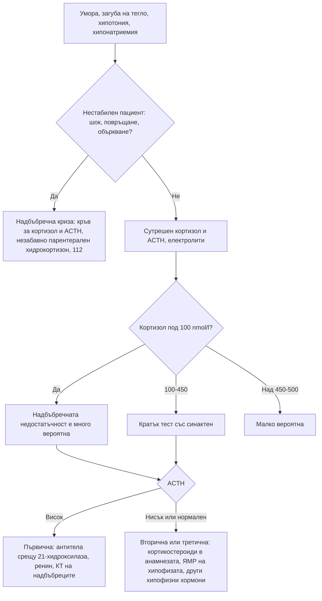

# Глава 38. Надбъбречни и хипофизни нарушения; полиурия и полидипсия

> **Част VIII. Ендокринна система и обмяна на веществата**

## Цели на главата

- Да се разпознават надбъбречната недостатъчност и надбъбречната криза.
- Да се прилагат скрининговите тестове за синдрома на Cushing и да се избягват фалшиво положителните резултати.
- Да се подозира феохромоцитом и да се разграничават пристъпите с адренергични симптоми.
- Да се оценява надбъбречният инциденталом.
- Да се тълкува хиперпролактинемията и да се разпознават хипопитуитаризмът, акромегалията и хипофизната апоплексия.
- Да се разграничават осмотичната полиурия, безвкусният диабет и първичната полидипсия.

---

## А. НАДБЪБРЕЧНИ ЖЛЕЗИ

## 1. Надбъбречна недостатъчност

### 1.1. Видове

| Вид | Механизъм | Основни причини |
|---|---|---|
| **Първична** (болест на Addison) | Разрушаване на надбъбречните жлези | **Автоимунна** (най-честата в развитите страни; често с други автоимунни заболявания — автоимунен полигландуларен синдром тип 2 с хипотиреоидизъм, диабет тип 1, витилиго, пернициозна анемия); **туберкулоза**; кръвоизлив в надбъбреците (антикоагуланти, сепсис — синдром на Waterhouse-Friderichsen, антифосфолипиден синдром); двустранни метастази (бял дроб, гърда, меланом); инфекции (HIV, CMV, гъбични); лекарства (кетоконазол, етомидат, митотан, осилодростат); адренолевкодистрофия (млади мъже); вродена надбъбречна хиперплазия |
| **Вторична** | Дефицит на ACTH | Тумори на хипофизата, операция, лъчетерапия, апоплексия, синдром на Sheehan, **хипофизит (включително от имунни чекпойнт инхибитори)**, продължително лечение с опиоиди |
| **Третична** | Потискане на хипоталамо-хипофизарно-надбъбречната ос | **Екзогенни глюкокортикоиди** (най-честата причина за надбъбречна недостатъчност изобщо) — перорални, инжекционни, вътреставни, инхалаторни във високи дози, мощни кожни; рязко спиране на лечението |

### 1.2. Клинична картина

- **Обща:** умора, слабост, загуба на тегло, анорексия, гадене, повръщане, коремна болка, ортостатична хипотония, световъртеж, миалгии, артралгии.
- **Само при първична недостатъчност:**
  - **хиперпигментация** — кожни гънки, дланни линии, белези, лигавица на бузите и венците, зърна;
  - **копнеж за сол**;
  - **хиперкалиемия** (дефицит на алдостерон).
- **Лабораторно:** **хипонатриемия** (и при първичната, и при вторичната), хиперкалиемия (само при първичната), хипогликемия, еозинофилия, лимфоцитоза, рядко хиперкалциемия, нормоцитна анемия.

### 1.3. Надбъбречна криза

**Спешно състояние:** шок, повръщане, силна коремна болка (може да имитира остър корем), объркване, треска, хипогликемия. Провокира се от инфекция, операция, травма и спиране на глюкокортикоидите. **Лечението (хидрокортизон парентерално) не бива да се забавя в очакване на изследванията.** Кръв за кортизол и ACTH се взема преди прилагането, ако това не води до забавяне.

### 1.4. Изследвания

- **Сутрешен серумен кортизол** (8–9 ч.):
  - **< 100 nmol/l** — надбъбречната недостатъчност е много вероятна;
  - > 400–500 nmol/l (в зависимост от метода) — надбъбречната недостатъчност е малко вероятна.
- **ACTH** — висок при първична, нисък или нормален при вторична недостатъчност.
- **Ренин** (висок при първична) и алдостерон.
- **Кратък тест със синактен** (250 µg).
- Антитела срещу 21-хидроксилазата; КТ на надбъбреците при отрицателни антитела.

**Лекарства, които повишават кортизол-свързващия глобулин** (орални естрогени), завишават общия кортизол и могат да маскират недостатъчността.

## 2. Синдром на Cushing

### 2.1. Причини

- **Екзогенни глюкокортикоиди** — най-честата причина. Трябва да се пита за всички форми, включително инжекции, кремове и инхалатори. Пример е комбинацията на инхалаторен кортикостероид с инхибитори на CYP3A4 (ритонавир, итраконазол).
- **ACTH-зависим ендогенен:**
  - **болест на Cushing** — аденом на хипофизата, около 70% от ендогенните случаи;
  - **ектопична секреция на ACTH** — дребноклетъчен карцином на белия дроб, карциноиди. Протича бързо, с хипокалиемия, хиперпигментация, миопатия и често без класическия кушингоиден вид.
- **ACTH-независим ендогенен:** аденом, карцином или двустранна хиперплазия на надбъбречните жлези.

### 2.2. Клинична картина

**Най-разграничаващи белези:** лесни кръвонасядания, **плетора на лицето**, **проксимална миопатия**, **широки (> 1 cm) пурпурни стрии**. При деца — наддаване на тегло със **забавяне на растежа**.

**Неспецифични белези:** затлъстяване (централно), лице с форма на луна, „бизонска гърбица“, хипертония, диабет, остеопороза, депресия, умора, акне, хирзутизъм, нарушения на менструалния цикъл, чести инфекции, бъбречни камъни.

### 2.3. Скринингови тестове

При клинично подозрение се използват **два** от следните тестове:

1. **Тест с 1 mg дексаметазон през нощта** — сутрешен кортизол > 50 nmol/l е патологичен;
2. **Нощен кортизол в слюнката** (две проби);
3. **Свободен кортизол в 24-часова урина** (две проби).

**Фалшиво положителни резултати:**

- **естрогени** (повишават кортизол-свързващия глобулин — предпочитат се слюнка или урина);
- **индуктори на CYP3A4** (карбамазепин, фенитоин, рифампицин — ускоряват метаболизма на дексаметазона);
- **псевдо-Кушинг**: алкохолизъм, тежка депресия, изразено затлъстяване, лошо контролиран диабет, бременност, остро заболяване.

След потвърждаване се изследват ACTH и се правят образни изследвания в специализиран център.

## 3. Феохромоцитом и параганглиом

- **Симптоми** (пристъпи): **главоболие, изпотяване, сърцебиене** (класическа триада), бледност, тремор, тревожност, хипертония (постоянна или пароксизмална), загуба на тегло, хипергликемия.
- **Провокиращи фактори:** анестезия, метоклопрамид, глюкокортикоиди, трициклични антидепресанти, МАО-инхибитори, симпатикомиметици, бета-блокери без предшестваща алфа-блокада, натиск върху корема.
- **Наследственост:** около 30–40% са наследствени (MEN2, болест на von Hippel-Lindau, неврофиброматоза тип 1, мутации в гените SDHx).
- **Изследване:** **свободни метанефрини в плазмата** (взети в легнало положение) или **фракционирани метанефрини в 24-часова урина**.
- **Фалшиво положителни резултати:** трициклични антидепресанти, SNRI, МАО-инхибитори, леводопа, симпатикомиметици, стрес, обструктивна сънна апнея, феноксибензамин.

**Диференциална диагноза на пристъпите с адренергични симптоми:**

- паническо разстройство;
- хипогликемия;
- тиреотоксикоза;
- карциноиден синдром (зачервяване, диария);
- менопауза;
- мигрена;
- синдром на постуралната ортостатична тахикардия;
- лекарства (кокаин, рязко спиране на клонидин);
- мастоцитоза;
- автономни епилептични пристъпи.

## 4. Надбъбречен инциденталом

Надбъбречна формация, открита случайно при образно изследване по друг повод. Оценката отговаря на два въпроса:

1. **Хормонално активна ли е формацията?**
   - **тест с 1 mg дексаметазон** при всички пациенти (лека автономна секреция на кортизол при > 50 nmol/l);
   - **съотношение алдостерон/ренин** при хипертония или хипокалиемия;
   - **метанефрини** — не са необходими, ако формацията е липидно богат аденом с плътност ≤ 10 HU при безконтрастна КТ.
2. **Злокачествена ли е?**
   - **≤ 10 HU при безконтрастна КТ** — доброкачествен аденом, не е необходимо проследяване;
   - по-висока плътност, **размер > 4 cm**, хетерогенност, нарастване — допълнителни изследвания и обсъждане в мултидисциплинарен екип;
   - **двустранни формации** — метастази, хиперплазия, вродена надбъбречна хиперплазия, кръвоизлив, туберкулоза.

---

## Б. ХИПОФИЗА

## 5. Хиперпролактинемия

**Клинична картина:**

- при жени — галакторея, олиго- или аменорея, безплодие;
- при мъже — намалено либидо, еректилна дисфункция, гинекомастия, безплодие;
- при двата пола — остеопороза;
- при **макроаденоми** — главоболие и **битемпорална хемианопсия**.

**Причини:**

| Група | Причини |
|---|---|
| **Физиологични** | **Бременност**, кърмене, стрес (включително от венепункцията), сън, физическо усилие, стимулация на зърната |
| **Лекарства** (много честа причина) | **Антипсихотици** (рисперидон, халоперидол, амисулприд — силно; арипипразол го понижава), **метоклопрамид**, **домперидон**, SSRI (леко), трициклични антидепресанти, опиоиди, верапамил, естрогени, метилдопа |
| **Патологични** | **Пролактином**; компресия на хипофизната дръжка от нефункциониращ аденом или друга формация („ефект на дръжката“ — обикновено умерено повишение); **хипотиреоидизъм** (повишен TRH); **ХБЗ**; цироза; синдром на поликистозните яйчници (леко); лезии на гръдната стена (херпес зостер, операции); гърчове |
| **Лабораторни** | **Макропролактин** (биологично неактивен комплекс — изследва се чрез утаяване с полиетиленгликол); „ефект на куката“ при гигантски пролактиноми (фалшиво ниски стойности — изследват се разредени проби) |

**Единици:** 1 ng/ml ≈ 21 mIU/l. Много високите стойности (над 5000 mIU/l или над около 250 ng/ml) обикновено означават пролактином.

## 6. Акромегалия

- **Клинична картина:** уголемяване на ръцете и краката (по-голям пръстен и номер обувки), загрубяване на чертите на лицето, прогнатия, макроглосия, раздалечаване на зъбите, изпотяване, главоболие, **синдром на карпалния тунел**, обструктивна сънна апнея, артропатия, хипертония, диабет, кардиомиопатия, полипи на дебелото черво.
- **Сравнението със стари снимки** е ценен диагностичен метод.
- **Изследвания:** **IGF-1**; потвърждаване с липса на супресия на растежния хормон при орален глюкозотолерантен тест; ЯМР на хипофизата.

## 7. Хипопитуитаризъм

- **Причини:** аденоми и други тумори (краниофарингиом), операция, лъчетерапия, **хипофизна апоплексия**, **синдром на Sheehan** (след масивен следродилен кръвоизлив — липса на лактация и аменорея), хипофизит (лимфоцитен — при бременност и след раждане; **имунни чекпойнт инхибитори**), черепно-мозъчна травма и субарахноидален кръвоизлив, инфилтративни заболявания (саркоидоза, хемохроматоза, хистиоцитоза), „празно“ турско седло.
- **Клинична картина:** умора, хипотония, **хипонатриемия без хиперкалиемия** (вторична надбъбречна недостатъчност), хипотиреоидизъм с нисък или нормален ТСХ, хипогонадизъм, дефицит на растежен хормон, **бледа кожа** (липса на ACTH).

**Хипофизна апоплексия.** Кръвоизлив или инфаркт в аденом. Проявява се с внезапно силно главоболие, повръщане, **зрителни нарушения**, **офталмоплегия** и остра надбъбречна недостатъчност. Може да имитира субарахноидален кръвоизлив. Спешно състояние.

## 8. Хипофизен инциденталом

Оценка на хормоналната секреция (пролактин, IGF-1, скрининг за синдрома на Cushing, функция на щитовидната жлеза, гонадотропини и полови хормони), **зрителни полета** при близост до хиазмата, проследяване с ЯМР.

---

## В. ПОЛИУРИЯ И ПОЛИДИПСИЯ

## 9. Определение

**Полиурията** е отделяне на над **3 литра урина за 24 часа** при възрастен (над 40–50 ml/kg). Тя трябва да се разграничи от **често уриниране** на малки количества и от **никтурията** (вж. глава 27).

## 10. Причини

| Механизъм | Осмолалитет на урината | Причини |
|---|---|---|
| **Осмотична диуреза** | > 300 mOsm/kg | **Хипергликемия** (най-честата причина), манитол, урея (високобелтъчно хранене, възстановяване след ОБУ) |
| **Първична полидипсия** | < 300 mOsm/kg | Психогенна (при психични заболявания); дипсогенна (хипоталамични лезии); прекомерен прием на течности „за здраве“ |
| **Централен безвкусен диабет** (дефицит на аргинин-вазопресин) | < 300 mOsm/kg | Идиопатичен и автоимунен, травма, неврохирургична операция, тумори (краниофарингиом, герминоми, метастази), инфилтративни заболявания (хистиоцитоза от клетки на Langerhans, саркоидоза), хипофизит |
| **Нефрогенен безвкусен диабет** (резистентност към аргинин-вазопресин) | < 300 mOsm/kg | **Литий** (най-честата придобита причина), **хиперкалциемия**, **хипокалиемия**, след освобождаване на обструкция, ХБЗ, сърповидноклетъчна болест, амилоидоза, синдром на Sjögren, вроден (X-свързан) |
| **Гестационен безвкусен диабет** | < 300 mOsm/kg | Плацентарна вазопресиназа |
| **Други** | Различен | Диуретици, солезагубваща нефропатия, възстановяване след остра тубулна некроза |

## 11. Изследвания

1. **Потвърждаване** на полиурията — обем на 24-часовата урина.
2. **Глюкоза, HbA1c, калций, калий, креатинин.**
3. **Серумен натрий и осмолалитет, осмолалитет на урината:**
   - **висок нормален или висок натрий** с разредена урина насочва към **безвкусен диабет**;
   - **нисък нормален натрий** с разредена урина насочва към **първична полидипсия**.
4. **Функционални тестове** (в специализирано звено): тест с водна депривация и десмопресин; **копептин**, стимулиран с хипертоничен физиологичен разтвор или аргинин (по-точен и по-безопасен).
5. **ЯМР на хипофизата** при централен безвкусен диабет (липса на „светлото петно“ на неврохипофизата, задебелена дръжка).

---

## 12. Безопасна диагностична стратегия

| Въпрос | Отговор |
|---|---|
| **Вероятна диагноза** | Надбъбречна недостатъчност след кортикостероидна терапия, лекарствена хиперпролактинемия, захарен диабет като причина за полиурия |
| **Сериозни заболявания, които не бива да се пропускат** | **Надбъбречна криза**; **хипофизна апоплексия**; **феохромоцитом** (криза при провокация); ектопичен ACTH-синдром при дребноклетъчен карцином; карцином на надбъбречната жлеза; компресия на хиазмата; хипернатриемия при безвкусен диабет с нарушена жажда |
| **Чести капани** | Скрит прием на кортикостероиди (инжекции, кремове, инхалатори); естрогени и фалшиво положителен тест с дексаметазон; макропролактин; хипотиреоидизъм като причина за хиперпролактинемия; литий като причина за полиурия; хипофизит от имунни чекпойнт инхибитори |
| **Маскиращи заболявания** | Лекарства, депресия (псевдо-Кушинг), захарен диабет |
| **Психосоциални аспекти** | Психогенна полидипсия, паническо разстройство, наподобяващо феохромоцитом |

---

## 13. Диагностичен алгоритъм при подозрение за надбъбречна недостатъчност

---

## 14. Клинични перли

- Хиперпигментация, хипонатриемия и хиперкалиемия: първична надбъбречна недостатъчност.
- При съмнение за надбъбречна криза не чакайте резултатите. Хидрокортизонът спасява живот.
- Всеки пациент, лекуван продължително с кортикостероиди, е застрашен от надбъбречна недостатъчност при рязко спиране или при стрес.
- Жена на орални контрацептиви с „положителен“ тест с дексаметазон може да няма синдром на Cushing.
- Бързо развиващ се синдром на Cushing с хипокалиемия и хиперпигментация при пушач: ектопичен ACTH (дребноклетъчен карцином).
- Метоклопрамидът и глюкокортикоидите могат да провокират феохромоцитомна криза.
- Преди да насочите за пролактином, изключете бременност, лекарства, хипотиреоидизъм, ХБЗ и макропролактин.
- Внезапно главоболие със зрителни нарушения и офталмоплегия: хипофизна апоплексия.
- Пациент на литий с полиурия: нефрогенен безвкусен диабет. Внимание за хипернатриемия при нарушен достъп до вода.

---

## 15. Клиничен случай

**Случай.** Жена на 42 години с хипотиреоидизъм (Hashimoto) и витилиго се оплаква от нарастваща умора от 6 месеца, загуба на 7 kg, гадене и световъртеж при изправяне. Съобщава, че „има нужда да яде солено“. При прегледа кожата е тъмна, особено по дланните линии и по белезите, има тъмни петна по венците. АН 96/60 mmHg в легнало и 78/50 mmHg в изправено положение. Изследвания: натрий 128 mmol/l, калий 5,6 mmol/l, глюкоза 3,8 mmol/l.

**Въпроси.** 1) Коя е диагнозата? 2) Какви изследвания и какво поведение са необходими?

**Обсъждане.** Хиперпигментацията (включително на лигавиците и белезите), копнежът за сол, ортостатичната хипотония, загубата на тегло, хипонатриемията, хиперкалиемията и склонността към хипогликемия при пациентка с други автоимунни заболявания насочват към **първична (автоимунна) надбъбречна недостатъчност — болест на Addison** в рамките на **автоимунен полигландуларен синдром тип 2**. Сутрешният кортизол е 45 nmol/l, ACTH е силно повишен, ренинът е висок, а антителата срещу 21-хидроксилазата са положителни. Пациентката е хемодинамично компрометирана и се насочва **спешно**. Необходимо е заместително лечение с хидрокортизон и флудрокортизон. Пациентката трябва да бъде обучена за „правилата за болничните дни“ и да носи карта за надбъбречна недостатъчност и спешен комплект за инжекция.

Важна подробност: при нелекувана надбъбречна недостатъчност започването на лечение с левотироксин (или увеличаването на дозата) може да провокира надбъбречна криза, защото тиреоидните хормони ускоряват метаболизма на кортизола.

**Поука.** При автоимунно заболяване и нова умора с хипонатриемия мислете за други автоимунни ендокринопатии.
