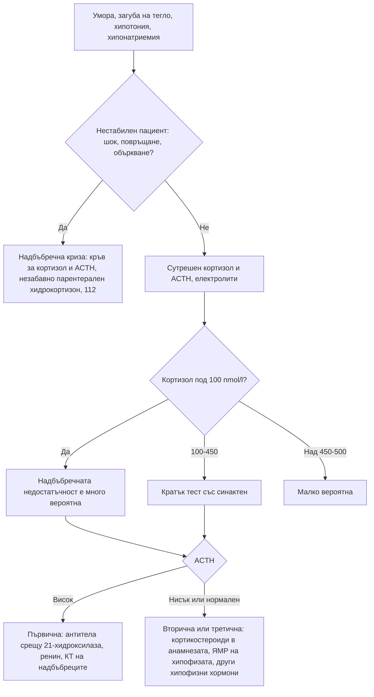

# Глава 38. Надбъбречни и хипофизни нарушения; полиурия и полидипсия

> **Част VIII. Ендокринна система и обмяна на веществата**

## Цели на главата

- Да се разпознават надбъбречната недостатъчност и надбъбречната криза.
- Да се прилагат скрининговите тестове за синдрома на Cushing и да се избягват фалшиво положителните резултати.
- Да се подозира феохромоцитом и да се разграничават пристъпите с адренергични симптоми.
- Да се оценява надбъбречният инциденталом.
- Да се тълкува хиперпролактинемията и да се разпознават хипопитуитаризмът, акромегалията и хипофизната апоплексия.
- Да се разграничават осмотичната полиурия, безвкусният диабет и първичната полидипсия.

## Ключови моменти

- Надбъбречната криза се лекува с хидрокортизон веднага, без да се чакат изследванията *(SORT C [3])*.
- Най-честата причина за надбъбречна недостатъчност са екзогенните глюкокортикоиди. Поне 1% от населението ги приема продължително *(SORT C [2])*.
- При подозрение за синдром на Cushing се започва с един високочувствителен тест, а при отклонен резултат се прави втори. Естрогените дават фалшиво положителен тест с дексаметазон *(SORT C [4])*.
- Феохромоцитомът се изследва със свободни метанефрини в плазмата или фракционирани метанефрини в урината *(SORT C [5])*.
- Хомогенната надбъбречна формация с плътност ≤ 10 HU при безконтрастна КТ е доброкачествена. Тестът с 1 mg дексаметазон се прави при всички пациенти с инциденталом *(SORT C [6])*.
- При полиурия с разредена урина копептинът след хипертоничен разтвор разграничава безвкусния диабет от първичната полидипсия по-точно от водната депривация *(SORT B [11])*.

### Първите 60 секунди

- Помислете за надбъбречна криза при хипотония, повръщане, коремна болка или объркване при пациент с надбъбречна недостатъчност или продължително лечение с глюкокортикоиди.
- Приложете веднага хидрокортизон 100 mg мускулно или венозно, без да чакате изследванията [3].
- Обадете се на 112. Ако това не води до забавяне, вземете кръв за кортизол и ACTH преди хидрокортизона.
- Измерете глюкозата и лекувайте хипогликемията.
- Ако условията позволяват, поставете венозен път и започнете физиологичен разтвор.

---

## А. Надбъбречни жлези

### 1. Надбъбречна недостатъчност

#### 1.1. Видове

*Таблица 38.1. Надбъбречна недостатъчност: видове.*

| Вид | Механизъм | Основни причини |
|---|---|---|
| **Първична** (болест на Addison) [1] | Разрушаване на надбъбречните жлези | Автоимунна (най-честата в развитите страни; често с други автоимунни заболявания – автоимунен полигландуларен синдром тип 2 с хипотиреоидизъм, диабет тип 1, витилиго, пернициозна анемия); туберкулоза; кръвоизлив в надбъбреците (антикоагуланти, сепсис – синдром на Waterhouse-Friderichsen, антифосфолипиден синдром); двустранни метастази (бял дроб, гърда, меланом); инфекции (HIV, CMV, гъбични); лекарства (кетоконазол, етомидат, митотан, осилодростат); адренолевкодистрофия (млади мъже); вродена надбъбречна хиперплазия |
| **Вторична** | Дефицит на ACTH | Тумори на хипофизата, операция, лъчетерапия, апоплексия, синдром на Sheehan, хипофизит (включително от имунни чекпойнт инхибитори), продължително лечение с опиоиди |
| **Третична** [2] | Потискане на хипоталамо-хипофизарно-надбъбречната ос | Екзогенни глюкокортикоиди (най-честата причина за надбъбречна недостатъчност изобщо) – перорални, инжекционни, вътреставни, инхалаторни във високи дози, мощни кожни; рязко спиране на лечението |

#### 1.2. Клинична картина

- **Обща:** умора, слабост, загуба на тегло, анорексия, гадене, повръщане, коремна болка, ортостатична хипотония, световъртеж, миалгии, артралгии.
- **Само при първична недостатъчност:**
  - **хиперпигментация** – кожни гънки, линии на дланите, белези, лигавица на бузите и венците, зърна;
  - **копнеж за сол**;
  - **хиперкалиемия** (дефицит на алдостерон).
- **Лабораторно:** **хипонатриемия** (и при първичната, и при вторичната), хиперкалиемия (само при първичната), хипогликемия, еозинофилия, лимфоцитоза, рядко хиперкалциемия, нормоцитна анемия.

#### 1.3. Надбъбречна криза

**Спешно състояние:** шок, повръщане, силна коремна болка (може да имитира остър корем), объркване, треска, хипогликемия. Провокира се от инфекция, операция, травма и спиране на глюкокортикоидите. **Лечението (хидрокортизон 100 mg парентерално) не бива да се забавя в очакване на изследванията** [3]. Кръв за кортизол и ACTH се взема преди прилагането, ако това не води до забавяне.

#### 1.4. Изследвания

- **Сутрешен серумен кортизол** (8–9 ч.):
  - **< 100 nmol/l** – надбъбречната недостатъчност е много вероятна;
  - > 400–500 nmol/l (в зависимост от метода) – надбъбречната недостатъчност е малко вероятна.
- **ACTH** – висок при първична, нисък или нормален при вторична недостатъчност.
- **Ренин** (висок при първична) и алдостерон.
- **Кратък тест със синактен** (250 µg) – стандартният потвърждаващ тест [1].
- Антитела срещу 21-хидроксилазата; КТ на надбъбреците при отрицателни антитела.

**Лекарства, които повишават кортизол-свързващия глобулин** (орални естрогени), завишават общия кортизол и могат да маскират недостатъчността.

**Глюкокортикоидна терапия.** Поне 1% от населението приема продължително глюкокортикоиди и е застрашено от надбъбречна недостатъчност. Рискът зависи от дозата, продължителността, мощността и начина на приложение [2].

### 2. Синдром на Cushing

#### 2.1. Причини

- **Екзогенни глюкокортикоиди** – най-честата причина. Трябва да се пита за всички форми, включително инжекции, кремове и инхалатори. Пример е комбинацията на инхалаторен кортикостероид с инхибитори на CYP3A4 (ритонавир, итраконазол).
- **ACTH-зависим ендогенен:**
  - **болест на Cushing** – аденом на хипофизата, около 70% от ендогенните случаи;
  - **ектопична секреция на ACTH** – дребноклетъчен карцином на белия дроб, карциноиди. Протича бързо, с хипокалиемия, хиперпигментация, миопатия и често без класическия кушингоиден вид.
- **ACTH-независим ендогенен:** аденом, карцином или двустранна хиперплазия на надбъбречните жлези.

#### 2.2. Клинична картина

**Най-разграничаващи белези:** лесни кръвонасядания, плетора на лицето, проксимална миопатия, широки (> 1 cm) пурпурни стрии. При деца – наддаване на тегло със забавяне на растежа.

**Неспецифични белези:** затлъстяване (централно), лице с форма на луна, „бизонска гърбица“, хипертония, диабет, остеопороза, депресия, умора, акне, хирзутизъм, нарушения на менструалния цикъл, чести инфекции, бъбречни камъни.

#### 2.3. Скринингови тестове

При клинично подозрение се започва с един от следните тестове, а при отклонен резултат се прави и втори [4]:

1. **Тест с 1 mg дексаметазон през нощта** – сутрешен кортизол > 50 nmol/l е патологичен;
2. **Нощен кортизол в слюнката** (две проби);
3. **Свободен кортизол в 24-часова урина** (две проби).

**Фалшиво положителни резултати:**

- **естрогени** (повишават кортизол-свързващия глобулин – предпочитат се слюнка или урина);
- **индуктори на CYP3A4** (карбамазепин, фенитоин, рифампицин – ускоряват метаболизма на дексаметазона);
- **псевдо-Кушинг**: алкохолизъм, тежка депресия, изразено затлъстяване, лошо контролиран диабет, бременност, остро заболяване.

След потвърждаване се изследват ACTH и се правят образни изследвания в специализиран център.

### 3. Феохромоцитом и параганглиом

- Симптоми (пристъпи): главоболие, изпотяване, сърцебиене (класическа триада), бледност, тремор, тревожност, хипертония (постоянна или пароксизмална), загуба на тегло, хипергликемия.
- **Провокиращи фактори:** анестезия, метоклопрамид, глюкокортикоиди, трициклични антидепресанти, МАО-инхибитори, симпатикомиметици, бета-блокери без предшестваща алфа-блокада, натиск върху корема.
- **Наследственост:** около една трета са наследствени [5] (MEN2, болест на von Hippel-Lindau, неврофиброматоза тип 1, мутации в гените SDHx).
- **Изследване:** свободни метанефрини в плазмата (взети в легнало положение) или фракционирани метанефрини в 24-часова урина [5].
- **Фалшиво положителни резултати:** трициклични антидепресанти, SNRI, МАО-инхибитори, леводопа, симпатикомиметици, стрес, обструктивна сънна апнея, феноксибензамин.

**Диференциална диагноза на пристъпите с адренергични симптоми:**

- паническо разстройство;
- хипогликемия;
- тиреотоксикоза;
- карциноиден синдром (зачервяване, диария);
- менопауза;
- мигрена;
- синдром на постуралната ортостатична тахикардия;
- лекарства (кокаин, рязко спиране на клонидин);
- мастоцитоза;
- автономни епилептични пристъпи.

### 4. Надбъбречен инциденталом

Надбъбречна формация, открита случайно при образно изследване по друг повод. Оценката отговаря на два въпроса [6]:

1. **Хормонално активна ли е формацията?**
   - **тест с 1 mg дексаметазон** при всички пациенти (лека автономна секреция на кортизол при > 50 nmol/l);
   - **съотношение алдостерон/ренин** при хипертония или хипокалиемия;
   - **метанефрини** – не са необходими, ако формацията е липидно богат аденом с плътност ≤ 10 HU при безконтрастна КТ.
2. **Злокачествена ли е?**
   - **хомогенна формация с ≤ 10 HU при безконтрастна КТ** – доброкачествена независимо от размера; не са необходими допълнителни образни изследвания;
   - всички останали формации се обсъждат в мултидисциплинарен екип; хирургично лечение обикновено е нужно при формация **> 4 cm**, която е хетерогенна или е с плътност > 20 HU [6];
   - **двустранни формации** – метастази, хиперплазия, вродена надбъбречна хиперплазия, кръвоизлив, туберкулоза.

---

## Б. Хипофиза

### 5. Хиперпролактинемия

**Клинична картина:**

- при жени – галакторея, олиго- или аменорея, безплодие;
- при мъже – намалено либидо, еректилна дисфункция, гинекомастия, безплодие;
- при двата пола – остеопороза;
- при макроаденоми – главоболие и битемпорална хемианопсия.

*Таблица 38.2. Причини за хиперпролактинемия.*

| Група | Причини |
|---|---|
| **Физиологични** | Бременност, кърмене, стрес (включително от венепункцията), сън, физическо усилие, стимулация на зърната |
| **Лекарства** (много честа причина) | Антипсихотици (рисперидон, халоперидол, амисулприд – силно; арипипразол го понижава), метоклопрамид, домперидон, SSRI (леко), трициклични антидепресанти, опиоиди, верапамил, естрогени, метилдопа |
| **Патологични** | Пролактином; компресия на хипофизната дръжка от нефункциониращ аденом или друга формация („ефект на дръжката“ – обикновено умерено повишение); хипотиреоидизъм (повишен TRH); ХБЗ; цироза; синдром на поликистозните яйчници (леко); лезии на гръдната стена (херпес зостер, операции); гърчове |
| **Лабораторни** | Макропролактин (биологично неактивен комплекс – изследва се чрез утаяване с полиетиленгликол); „ефект на куката“ при гигантски пролактиноми (фалшиво ниски стойности – изследват се разредени проби) |

**Единици:** 1 ng/ml ≈ 21 mIU/l. Много високите стойности (над 5000 mIU/l или над около 250 ng/ml) обикновено означават пролактином [7].

### 6. Акромегалия

- **Клинична картина:** уголемяване на ръцете и краката (по-голям пръстен и номер обувки), загрубяване на чертите на лицето, прогнатия, макроглосия, раздалечаване на зъбите, изпотяване, главоболие, **синдром на карпалния тунел**, обструктивна сънна апнея, артропатия, хипертония, диабет, кардиомиопатия, полипи на дебелото черво.
- **Сравнението със стари снимки** е ценен диагностичен метод.
- **Изследвания:** **IGF-1**; потвърждаване с липса на супресия на растежния хормон при орален глюкозотолерантен тест; ЯМР на хипофизата [8].

### 7. Хипопитуитаризъм

- **Причини:** аденоми и други тумори (краниофарингиом), операция, лъчетерапия, хипофизна апоплексия, синдром на Sheehan (след масивен следродилен кръвоизлив – липса на лактация и аменорея), хипофизит (лимфоцитен – при бременност и след раждане; имунни чекпойнт инхибитори), черепно-мозъчна травма и субарахноидален кръвоизлив, инфилтративни заболявания (саркоидоза, хемохроматоза, хистиоцитоза), „празно“ турско седло.
- **Клинична картина:** умора, хипотония, хипонатриемия без хиперкалиемия (вторична надбъбречна недостатъчност), хипотиреоидизъм с нисък или нормален ТСХ, хипогонадизъм, дефицит на растежен хормон, бледа кожа (липса на ACTH).

**Хипофизна апоплексия.** Кръвоизлив или инфаркт в аденом. Проявява се с внезапно силно главоболие, повръщане, зрителни нарушения, офталмоплегия и остра надбъбречна недостатъчност. Може да имитира субарахноидален кръвоизлив. Спешно състояние: веднага се започва хидрокортизон и се прави образно изследване, за предпочитане ЯМР [9].

### 8. Хипофизен инциденталом

Оценка на хормоналната секреция (пролактин, IGF-1, скрининг за синдрома на Cushing, функция на щитовидната жлеза, гонадотропини и полови хормони), **зрителни полета** при близост до хиазмата, проследяване с ЯМР.

---

## В. Полиурия и полидипсия

### 9. Определение

Полиурията е отделяне на над 3 литра урина за 24 часа при възрастен (над 40–50 ml/kg). Тя трябва да се разграничи от често уриниране на малки количества и от никтурията (вж. глава 27).

### 10. Причини

*Таблица 38.3. Полиурия и полидипсия: причини.*

| Механизъм | Осмолалитет на урината | Причини |
|---|---|---|
| **Осмотична диуреза** | > 300 mOsm/kg | Хипергликемия (най-честата причина), манитол, урея (високобелтъчно хранене, възстановяване след ОБУ) |
| **Първична полидипсия** | < 300 mOsm/kg | Психогенна (при психични заболявания); дипсогенна (хипоталамични лезии); прекомерен прием на течности „за здраве“ |
| **Централен безвкусен диабет** (дефицит на аргинин-вазопресин) [10] | < 300 mOsm/kg | Идиопатичен и автоимунен, травма, неврохирургична операция, тумори (краниофарингиом, герминоми, метастази), инфилтративни заболявания (хистиоцитоза от клетки на Langerhans, саркоидоза), хипофизит |
| **Нефрогенен безвкусен диабет** (резистентност към аргинин-вазопресин) | < 300 mOsm/kg | Литий (най-честата придобита причина), хиперкалциемия, хипокалиемия, след освобождаване на обструкция, ХБЗ, сърповидноклетъчна болест, амилоидоза, синдром на Sjögren, вроден (X-свързан) |
| **Гестационен безвкусен диабет** | < 300 mOsm/kg | Плацентарна вазопресиназа |
| **Други** | Различен | Диуретици, солезагубваща нефропатия, възстановяване след остра тубулна некроза |

### 11. Изследвания

1. **Потвърждаване** на полиурията – обем на 24-часовата урина.
2. **Глюкоза, HbA1c, калций, калий, креатинин.**
3. **Серумен натрий и осмолалитет, осмолалитет на урината:**
   - висок нормален или висок натрий с разредена урина насочва към безвкусен диабет;
   - нисък нормален натрий с разредена урина насочва към първична полидипсия.
4. Функционални тестове (в специализирано звено): тест с водна депривация и десмопресин или копептин, стимулиран с хипертоничен физиологичен разтвор или с аргинин. Копептинът след хипертоничен разтвор е по-точен от водната депривация (около 97% срещу 77%) [11] и от аргининовия тест (около 96% срещу 74%), но изисква внимателно проследяване на натрия [12].
5. **ЯМР на хипофизата** при централен безвкусен диабет (липса на „светлото петно“ на неврохипофизата, задебелена дръжка).

---

## 12. Безопасна диагностична стратегия

*Таблица 38.4. Безопасна диагностична стратегия.*

| Въпрос | Отговор |
|---|---|
| **Вероятна диагноза** | Надбъбречна недостатъчност след кортикостероидна терапия, лекарствена хиперпролактинемия, захарен диабет като причина за полиурия |
| **Сериозни заболявания, които не бива да се пропускат** | Надбъбречна криза; хипофизна апоплексия; феохромоцитом (криза при провокация); ектопичен ACTH-синдром при дребноклетъчен карцином; карцином на надбъбречната жлеза; компресия на хиазмата; хипернатриемия при безвкусен диабет с нарушена жажда |
| **Чести капани** | Скрит прием на кортикостероиди (инжекции, кремове, инхалатори); естрогени и фалшиво положителен тест с дексаметазон; макропролактин; хипотиреоидизъм като причина за хиперпролактинемия; литий като причина за полиурия; хипофизит от имунни чекпойнт инхибитори |
| **Маскиращи заболявания** | Лекарства, депресия (псевдо-Кушинг), захарен диабет |
| **Психосоциални аспекти** | Психогенна полидипсия, паническо разстройство, наподобяващо феохромоцитом |

---

## 13. Диагностичен алгоритъм при подозрение за надбъбречна недостатъчност

*Фигура 38.1. Диагностичен алгоритъм при подозрение за надбъбречна недостатъчност. Схема на авторите въз основа на източниците, цитирани в главата.*

Текстово описание на фигура 38.1

1. Умора, загуба на тегло, хипотония, хипонатриемия. Следва: към т. 2.
2. **Въпрос:** Нестабилен пациент: шок, повръщане, объркване? Да – към т. 3; Не – към т. 4.
3. Надбъбречна криза: кръв за кортизол и ACTH, незабавно парентерален хидрокортизон, 112.
4. Сутрешен кортизол и ACTH, електролити. Следва: към т. 5.
5. **Въпрос:** Кортизол под 100 nmol/l? Да – към т. 6; 100-450 – към т. 7; Над 450-500 – към т. 8.
6. Надбъбречната недостатъчност е много вероятна. Следва: към т. 9.
7. Кратък тест със синактен. Следва: към т. 9.
8. Малко вероятна.
9. **Въпрос:** ACTH Висок – към т. 10; Нисък или нормален – към т. 11.
10. Първична: антитела срещу 21-хидроксилаза, ренин, КТ на надбъбреците.
11. Вторична или третична: кортикостероиди в анамнезата, ЯМР на хипофизата, други хипофизни хормони.

---

## 14. Червени флагове и насочване

### 14.1. Червени флагове

- Хипотония, повръщане, силна коремна болка или объркване при надбъбречна недостатъчност или продължително лечение с глюкокортикоиди.
- Внезапно силно главоболие със зрителни нарушения или двойно виждане.
- Хипонатриемия с хиперкалиемия и хиперпигментация.
- Пристъпи на главоболие, изпотяване и сърцебиене с тежка хипертония, особено след метоклопрамид или глюкокортикоид.
- Бързо развиващ се синдром на Cushing с хипокалиемия при пушач.
- Надбъбречна формация > 4 cm, хетерогенна или с плътност > 20 HU.
- Полиурия с хипернатриемия или с нарушена жажда; нова полиурия след операция или травма на главата.
- Битемпорална хемианопсия.

### 14.2. Кога и колко спешно да насочим

*Таблица 38.5. Кога и колко спешно да насочим.*

| Спешност | Клинична ситуация |
|---|---|
| **Незабавно (112 или спешно отделение)** | Надбъбречна криза – хидрокортизон 100 mg преди транспорта [3]; подозрение за хипофизна апоплексия [9]; феохромоцитомна криза; тежка хипернатриемия при безвкусен диабет |
| **В същия ден** | Нова хипонатриемия с хиперкалиемия и хипотония (подозрение за болест на Addison) [1]; зрителни нарушения при хипофизна формация; бързо развиващ се синдром на Cushing с хипокалиемия |
| **Бързо (до 2 седмици)** | Надбъбречна формация с белези за злокачественост [6]; подозрение за феохромоцитом [5]; нисък сутрешен кортизол без криза; макроаденом на хипофизата |
| **Планово** | Подозрение за синдром на Cushing [4], акромегалия [8] или хиперпролактинемия без зрителни нарушения [7]; надбъбречен инциденталом за хормонална оценка [6]; полиурия с разредена урина за функционални тестове [11] |
| **Проследяване в общата практика** | Лекарствена хиперпролактинемия; обучение за „правилата за болничните дни“ при надбъбречна недостатъчност [1]; постепенно спиране на продължителна глюкокортикоидна терапия [2] |

---

## 15. Клинични перли

- Хиперпигментация, хипонатриемия и хиперкалиемия: първична надбъбречна недостатъчност.
- При съмнение за надбъбречна криза не чакайте резултатите. Хидрокортизонът спасява живот.
- Всеки пациент, лекуван продължително с кортикостероиди, е застрашен от надбъбречна недостатъчност при рязко спиране или при стрес.
- Жена на орални контрацептиви с „положителен“ тест с дексаметазон може да няма синдром на Cushing.
- Бързо развиващ се синдром на Cushing с хипокалиемия и хиперпигментация при пушач: ектопичен ACTH (дребноклетъчен карцином).
- Метоклопрамидът и глюкокортикоидите могат да провокират феохромоцитомна криза.
- Преди да насочите за пролактином, изключете бременност, лекарства, хипотиреоидизъм, ХБЗ и макропролактин.
- Внезапно главоболие със зрителни нарушения и офталмоплегия: хипофизна апоплексия.
- Пациент на литий с полиурия: нефрогенен безвкусен диабет. Внимание за хипернатриемия при нарушен достъп до вода.

---

## 16. Клиничен случай

**Етап 1 – представяне.** Жена на 42 години с хипотиреоидизъм (Hashimoto) и витилиго се оплаква от нарастваща умора от 6 месеца, загуба на 7 kg, гадене и световъртеж при изправяне. Съобщава, че „има нужда да яде солено“.

> **Въпрос 1.** Какво ще търсите при прегледа и в изследванията?

**Етап 2 – преглед и изследвания.** Кожата е тъмна, особено по линиите на дланите и по белезите, а по венците има тъмни петна. АН е 96/60 mmHg в легнало и 78/50 mmHg в изправено положение. Натрият е 128 mmol/l, калият 5,6 mmol/l, глюкозата 3,8 mmol/l.

> **Въпрос 2.** Коя е най-вероятната диагноза?

> **Въпрос 3.** Колко спешно е състоянието и какво не бива да се прави?

Обсъждане и отговори

**Отговор 1.** Търсят се хиперпигментация, ортостатична хипотония, хипонатриемия, хиперкалиемия и хипогликемия. Изследват се сутрешен кортизол и ACTH, ренин и алдостерон [1].

**Отговор 2.** Хиперпигментацията, копнежът за сол, ортостатичната хипотония, загубата на тегло, хипонатриемията, хиперкалиемията и склонността към хипогликемия при пациентка с други автоимунни заболявания насочват към първична (автоимунна) надбъбречна недостатъчност – болест на Addison в рамките на автоимунен полигландуларен синдром тип 2. Сутрешният кортизол е 45 nmol/l, ACTH е силно повишен, ренинът е висок, а антителата срещу 21-хидроксилазата са положителни [1].

**Отговор 3.** Пациентката е хемодинамично компрометирана и се насочва спешно. При влошаване се прилага хидрокортизон, без да се чакат резултатите [3]. Необходимо е заместително лечение с хидрокортизон и флудрокортизон, обучение за „правилата за болничните дни“, карта за надбъбречна недостатъчност и спешен комплект за инжекция. Дозата на левотироксина не се увеличава, преди да започне лечението с хидрокортизон. Тиреоидните хормони ускоряват метаболизма на кортизола и могат да провокират надбъбречна криза.

**Поука.** При автоимунно заболяване и нова умора с хипонатриемия помислете за други автоимунни ендокринопатии.

---

## Обобщение

- Надбъбречната недостатъчност е първична, вторична или третична. Най-честата причина е спирането на глюкокортикоиди, а кризата изисква незабавен хидрокортизон.
- Синдромът на Cushing, феохромоцитомът и надбъбречният инциденталом се изследват със стандартизирани тестове, като се избягват лекарствените и физиологичните фалшиво положителни резултати.
- Хиперпролактинемията най-често е физиологична или лекарствена. Хипофизната апоплексия е спешно състояние.
- Полиурията е осмотична или водна. Безвкусният диабет и първичната полидипсия се разграничават с копептин или с тест с водна депривация.

## Самопроверка

### Въпроси с един верен отговор

**1.** *(основно ниво)* Мъж на 58 години с ревматоидна полимиалгия приема преднизолон от 18 месеца. Спрял го е сам преди 5 дни. Сега повръща, АН е 80/50 mmHg и е объркан. Кое е правилното първо действие?

- **А.** Сутрешен кортизол и изчакване на резултата
- **Б.** Хидрокортизон 100 mg мускулно или венозно веднага и обаждане на 112
- **В.** Кратък тест със синактен
- **Г.** Метоклопрамид и наблюдение
- **Д.** Флудрокортизон през устата

Отговор и обосновка

**Верен отговор: Б.** Клиничната картина е на надбъбречна криза след рязко спиране на глюкокортикоид. Хидрокортизонът се прилага веднага, без да се чакат изследванията [3].

**2.** *(основно ниво)* Жена на 30 години приема комбиниран орален контрацептив. След тест с 1 mg дексаметазон кортизолът е 110 nmol/l. Няма специфични белези на синдрома на Cushing. Кое е най-подходящото следващо изследване?

- **А.** КТ на надбъбречните жлези
- **Б.** Нощен кортизол в слюнката или свободен кортизол в 24-часова урина
- **В.** ЯМР на хипофизата
- **Г.** Лечение с кетоконазол
- **Д.** Не са нужни изследвания – диагнозата е синдром на Cushing

Отговор и обосновка

**Верен отговор: Б.** Естрогените повишават кортизол-свързващия глобулин и дават фалшиво положителен тест с дексаметазон. Предпочитат се изследвания, които не зависят от него [4]. Образни изследвания се правят едва след биохимично потвърждаване.

**3.** *(основно ниво)* Жена на 28 години има галакторея и олигоменорея. Пролактинът е 1400 mIU/l. Лекува се с рисперидон. Кое е първото действие?

- **А.** ЯМР на хипофизата веднага
- **Б.** Каберголин
- **В.** Тест за бременност, ТСХ и креатинин и обсъждане на лекарството с психиатъра
- **Г.** Хирургично лечение
- **Д.** Изследване на IGF-1

Отговор и обосновка

**Верен отговор: В.** Преди да се търси пролактином, се изключват бременност, хипотиреоидизъм, ХБЗ и лекарствена причина [7]. Рисперидонът често повишава пролактина.

**4.** *(напреднало ниво)* Мъж на 64 години с хипертония има случайно открита хомогенна надбъбречна формация 28 mm с плътност 6 HU при безконтрастна КТ. Кое е правилното поведение?

- **А.** Адреналектомия
- **Б.** Контролна КТ след 6 месеца
- **В.** Тест с 1 mg дексаметазон и съотношение алдостерон/ренин, без допълнителни образни изследвания
- **Г.** ПЕТ-КТ
- **Д.** Биопсия на формацията

Отговор и обосновка

**Верен отговор: В.** Хомогенната формация с плътност ≤ 10 HU е доброкачествена и не изисква допълнителни образни изследвания. Тестът с дексаметазон се прави при всички пациенти, а съотношението алдостерон/ренин – при хипертония или хипокалиемия [6].

**5.** *(напреднало ниво)* Жена на 40 години пие по 6 литра вода дневно. Натрият е 136 mmol/l, а осмолалитетът на урината е 110 mOsm/kg. Копептинът след инфузия на хипертоничен разтвор (при натрий > 149 mmol/l) е 8,2 pmol/l. Коя е диагнозата?

- **А.** Централен безвкусен диабет
- **Б.** Нефрогенен безвкусен диабет
- **В.** Първична полидипсия
- **Г.** Осмотична диуреза
- **Д.** Синдром на неадекватна секреция на АДХ

Отговор и обосновка

**Верен отговор: В.** При хипертонична стимулация копептин над 4,9 pmol/l изключва дефицит на аргинин-вазопресин и насочва към първична полидипсия [11, 12]. Ниско нормалният натрий също подкрепя тази диагноза.

### Задача

Мъж на 35 години с болест на Addison приема хидрокортизон. Пита какво да прави, ако има грип с температура 38,5 °C, и какво – ако повръща и не може да приема таблетки.

Решение

При температура или заболяване, което налага легло, дозата на хидрокортизона се удвоява до оздравяването. Това е първото „правило за болничните дни“ [1]. При повръщане, диария или невъзможност да приема таблетки пациентът си поставя хидрокортизон 100 mg мускулно от спешния комплект и търси спешна помощ [3]. Пациентът трябва да носи карта или гривна за надбъбречна недостатъчност. Близките му трябва да знаят как да поставят инжекцията.

### OSCE станция: Правила за болничните дни при надбъбречна недостатъчност

**Време:** 7 минути. **Ниво:** основно (студенти, специализанти).

**Задача за кандидата.** Жена на 45 години наскоро е диагностицирана с болест на Addison и приема хидрокортизон и флудрокортизон. Обяснете ѝ какво да прави при заболяване.

**Информация за симулирания пациент (за изпитващия).** Работи като учителка и често боледува от вирусни инфекции. Живее сама.

*Таблица 38.6. OSCE станция „Правила за болничните дни при надбъбречна недостатъчност“ – критерии за оценяване.*

| Критерий | Точки |
|---|---|
| Проверява какво знае пациентката за заболяването | 1 |
| Обяснява правило 1: удвояване на дозата при температура или заболяване, налагащо легло | 2 |
| Обяснява правило 2: при повръщане или диария – хидрокортизон 100 mg мускулно и 112 | 2 |
| Проверява техниката на инжектиране със спешния комплект | 2 |
| Препоръчва карта или гривна за надбъбречна недостатъчност и информиране на близките | 1 |
| Обяснява, че трябва да съобщава за заболяването преди операции и процедури | 1 |
| Проверява разбирането с метода „обяснете ми обратно“ | 1 |
| **Общо** | **10** |

**Праг за успешно представяне:** 7 от 10 точки, включително двете правила.

## Литература

1. Bornstein SR, Allolio B, Arlt W, Barthel A, Don-Wauchope A, Hammer GD, et al. Diagnosis and Treatment of Primary Adrenal Insufficiency: An Endocrine Society Clinical Practice Guideline. J Clin Endocrinol Metab. 2016;101(2):364-89. doi:10.1210/jc.2015-1710. PMID: 26760044.
2. Beuschlein F, Else T, Bancos I, Hahner S, Hamidi O, van Hulsteijn L, et al. European Society of Endocrinology and Endocrine Society Joint Clinical Guideline: Diagnosis and therapy of glucocorticoid-induced adrenal insufficiency. Eur J Endocrinol. 2024;190(5):G25-G51. doi:10.1093/ejendo/lvae029. PMID: 38714321.
3. Rushworth RL, Torpy DJ, Falhammar H. Adrenal Crisis. N Engl J Med. 2019;381(9):852-861. doi:10.1056/NEJMra1807486. PMID: 31461595.
4. Nieman LK, Biller BM, Findling JW, Newell-Price J, Savage MO, Stewart PM, et al. The diagnosis of Cushing's syndrome: an Endocrine Society Clinical Practice Guideline. J Clin Endocrinol Metab. 2008;93(5):1526-40. doi:10.1210/jc.2008-0125. PMID: 18334580.
5. Lenders JW, Duh QY, Eisenhofer G, Gimenez-Roqueplo AP, Grebe SK, Murad MH, et al. Pheochromocytoma and paraganglioma: an endocrine society clinical practice guideline. J Clin Endocrinol Metab. 2014;99(6):1915-42. doi:10.1210/jc.2014-1498. PMID: 24893135.
6. Fassnacht M, Tsagarakis S, Terzolo M, Tabarin A, Sahdev A, Newell-Price J, et al. European Society of Endocrinology clinical practice guidelines on the management of adrenal incidentalomas, in collaboration with the European Network for the Study of Adrenal Tumors. Eur J Endocrinol. 2023;189(1):G1-G42. doi:10.1093/ejendo/lvad066. PMID: 37318239.
7. Melmed S, Casanueva FF, Hoffman AR, Kleinberg DL, Montori VM, Schlechte JA, et al. Diagnosis and treatment of hyperprolactinemia: an Endocrine Society clinical practice guideline. J Clin Endocrinol Metab. 2011;96(2):273-88. doi:10.1210/jc.2010-1692. PMID: 21296991.
8. Katznelson L, Laws ER Jr, Melmed S, Molitch ME, Murad MH, Utz A, et al. Acromegaly: an endocrine society clinical practice guideline. J Clin Endocrinol Metab. 2014;99(11):3933-51. doi:10.1210/jc.2014-2700. PMID: 25356808.
9. Rajasekaran S, Vanderpump M, Baldeweg S, Drake W, Reddy N, Lanyon M, et al. UK guidelines for the management of pituitary apoplexy. Clin Endocrinol (Oxf). 2011;74(1):9-20. doi:10.1111/j.1365-2265.2010.03913.x. PMID: 21044119.
10. Arima H, Cheetham T, Christ-Crain M, Cooper D, Gurnell M, Drummond JB, et al. Changing the name of diabetes insipidus: a position statement of The Working Group for Renaming Diabetes Insipidus. Eur J Endocrinol. 2022;187(5):P1-P3. doi:10.1530/EJE-22-0751. PMID: 36239119.
11. Fenske W, Refardt J, Chifu I, Schnyder I, Winzeler B, Drummond J, et al. A Copeptin-Based Approach in the Diagnosis of Diabetes Insipidus. N Engl J Med. 2018;379(5):428-439. doi:10.1056/NEJMoa1803760. PMID: 30067922.
12. Refardt J, Atila C, Chifu I, Ferrante E, Erlic Z, Drummond JB, et al. Arginine or Hypertonic Saline-Stimulated Copeptin to Diagnose AVP Deficiency. N Engl J Med. 2023;389(20):1877-1887. doi:10.1056/NEJMoa2306263. PMID: 37966286.

*Последна проверка на съдържанието: септември 2026 г. Следващ планиран преглед: септември 2027 г. (вж. „Политика за актуализация“ в README).*

<!-- навигация -->

---

[← Глава 37. Заболявания на щитовидната жлеза](37-shtitovidna-zhleza.md) · [Съдържание](../README.md) · [Глава 39. Хирзутизъм, гинекомастия и хипогонадизъм →](39-polovi-hormoni.md)
