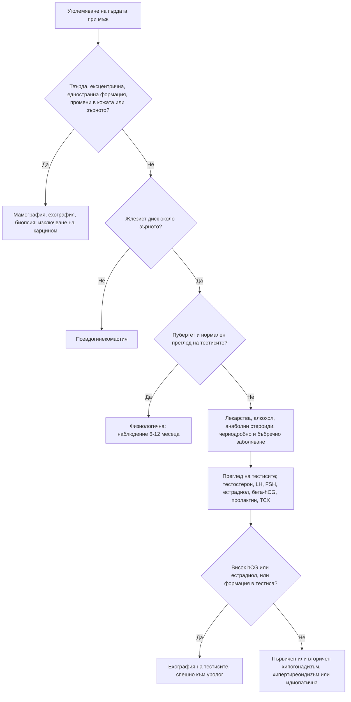

# Глава 39. Хирзутизъм, гинекомастия и хипогонадизъм

> **Част VIII. Ендокринна система и обмяна на веществата**

## Цели на главата

- Да се разграничават хирзутизмът, хипертрихозата и вирилизацията.
- Да се поставя диагнозата синдром на поликистозните яйчници след изключване на другите причини.
- Да се разпознават андроген-секретиращите тумори по техните червени флагове.
- Да се разграничават физиологичната, лекарствената и патологичната гинекомастия и да се изключва карцином на гърдата при мъжа.
- Да се поставя правилно диагнозата мъжки хипогонадизъм и да се разграничават първичният и вторичният.

---

## А. ХИРЗУТИЗЪМ

## 1. Определения

- **Хирзутизъм** — окосмяване с терминални (дебели, пигментирани) косми по мъжки тип при жена: горна устна, брадичка, гърди, корем, гръб. Оценява се с модифицираната скала на **Ferriman-Gallwey**. Праговата стойност е около ≥ 8 точки, но зависи от етническия произход (по-ниска при жени от Източна Азия).
- **Хипертрихоза** — генерализирано увеличаване на окосмяването (обикновено велусни косми), което **не зависи от андрогените**. Причини: лекарства (**миноксидил**, циклоспорин, фенитоин), анорексия нервоза, порфирия, хипотиреоидизъм, паранеопластична хипертрихоза.
- **Вирилизация** — хирзутизъм плюс признаци на изразен андрогенен излишък: **клиторомегалия**, **задълбочаване на гласа**, **плешивост по мъжки тип**, увеличена мускулна маса, атрофия на гърдите. **Вирилизацията винаги е червен флаг.**

## 2. Причини

| Причина | Относителна честота | Насочващи белези |
|---|---|---|
| **Синдром на поликистозните яйчници (СПКЯ)** | 70–80% | Начало около пубертета, бавно прогресиране, олигоменорея, акне, затлъстяване, инсулинова резистентност |
| **Идиопатичен хирзутизъм** | 5–15% | Редовен цикъл, нормални андрогени, нормални яйчници |
| **Некласическа вродена надбъбречна хиперплазия** (дефицит на 21-хидроксилаза) | 1–5% (по-често в някои етнически групи) | Клинично наподобява СПКЯ; **17-хидроксипрогестерон**, изследван сутрин във фоликуларната фаза, е повишен (потвърждава се с ACTH тест) |
| **Андроген-секретиращи тумори** | < 1% | **Бързо начало** (месеци), **вирилизация**, много висок тестостерон; тумори на яйчника (Sertoli-Leydig) или на надбъбречната жлеза (карцином — висок DHEAS) |
| **Хипертекоза на яйчниците** | Рядко | Жени в постменопауза, постепенно нарастващ андрогенен излишък |
| **Синдром на Cushing** | Рядко | Кушингоидни белези |
| **Други ендокринни причини** | Рядко | Акромегалия, хиперпролактинемия, хипотиреоидизъм |
| **Лекарства** | — | Анаболни стероиди, **тестостерон** (включително **трансдермален гел на партньора**), даназол, валпроат, прогестини с андрогенна активност |

## 3. Синдром на поликистозните яйчници

**Ротердамски критерии** (след изключване на другите причини). Необходими са **два от три** белега:

1. **олиго- или ановулация**;
2. **клиничен или биохимичен хиперандрогенизъм**;
3. **поликистозна морфология** на яйчниците при ехография (≥ 20 фоликула в един яйчник или обем ≥ 10 ml) или, според международните препоръки от 2023 г., повишен **антимюлеров хормон** при възрастни жени.

При юноши диагнозата изисква **и двата** белега — олигоовулация и хиперандрогенизъм. Ехографията не се използва през първите 8 години след менархето.

**Изключване на другите причини:** ТСХ, пролактин, 17-хидроксипрогестерон, тест за бременност, а при съответна клиника и скрининг за синдром на Cushing и изследване на яйчниците и надбъбреците.

**Свързани състояния:** инсулинова резистентност, затлъстяване, преддиабет и диабет тип 2, дислипидемия, **неалкохолна стеатоза**, **обструктивна сънна апнея**, **хиперплазия на ендометриума** (при продължителна ановулация), депресия и тревожност, безплодие.

## 4. Червени флагове при хирзутизъм

- **Бързо начало** (за месеци) и прогресиране.
- **Вирилизация.**
- **Много висок тестостерон** (обикновено > 5 nmol/l) или много висок DHEAS.
- Начало **след менопаузата**.
- Палпируема формация в корема или малкия таз.
- Кушингоидни белези.

## 5. Изследвания при хирзутизъм

- **Общ тестостерон** (сутрин, в ранната фоликуларна фаза), при нужда свободен тестостерон или SHBG.
- **DHEAS** (надбъбречен произход).
- **17-хидроксипрогестерон.**
- ТСХ, пролактин.
- При червени флагове: **трансвагинална ехография**, **КТ или ЯМР на надбъбреците**.
- Метаболитна оценка при СПКЯ: глюкоза или орален глюкозотолерантен тест, HbA1c, липиди.

---

## Б. ГИНЕКОМАСТИЯ

## 6. Определение и разграничаване

**Гинекомастията** е доброкачествена пролиферация на жлезистата тъкан на мъжката гърда. Причината е дисбаланс между естрогените и андрогените. При палпация се установява **гумено-еластичен или твърд диск, концентричен около зърното**.

| Белег | Гинекомастия | Псевдогинекомастия | Карцином на гърдата |
|---|---|---|---|
| Тъкан | Жлезиста, дисковидна под ареолата | Мастна, мека, без диск | Твърда, неравна формация |
| Позиция | Концентрична около зърното | Дифузна | **Ексцентрична**, извън зърното |
| Страна | Често двустранна (може асиметрична) | Двустранна | Обикновено **едностранна** |
| Болезненост | Често в ранната фаза | Не | Обикновено неболезнена |
| Други белези | — | Затлъстяване | **Прибиране на зърното, кървава секреция, промени в кожата, аксиларна лимфаденопатия**, фиксиране |

## 7. Причини

| Група | Причини |
|---|---|
| **Физиологични** | Новородени; **пубертет** (при около половината от момчетата; отзвучава за 1–2 години); напреднала възраст |
| **Лекарства** (около 20–25%) | **Спиронолактон**, антиандрогени (бикалутамид), инхибитори на 5-алфа-редуктазата (финастерид, дутастерид), агонисти на GnRH, естрогени, **анаболни стероиди** и тестостерон (ароматизация), дигоксин, циметидин, кетоконазол, метронидазол, антипсихотици (чрез пролактина), трициклични антидепресанти, някои антиретровирусни средства (ефавиренз), канабис, алкохол, хероин, етерични масла от лавандула и чаено дърво (при деца) |
| **Хипогонадизъм** | **Синдром на Klinefelter** (малки, твърди тестиси, висок ръст, безплодие), първичен и вторичен хипогонадизъм |
| **Системни заболявания** | **Чернодробна цироза**, алкохолизъм, **хипертиреоидизъм**, **ХБЗ** и диализа, възобновено хранене след недохранване |
| **Тумори** | **Тумори на тестиса** — от Leydig клетките (естрогени), герминативноклетъчни (**бета-hCG**); тумори на надбъбреците (естроген-секретиращи); **hCG-секретиращи тумори** (бял дроб, черен дроб, стомах) |
| **Други** | Хиперпролактинемия (чрез хипогонадизъм), андрогенна нечувствителност, идиопатична гинекомастия (около 25%) |

## 8. Изследвания при гинекомастия

1. **Анамнеза:** лекарства, анаболни стероиди, алкохол, продължителност, болка.
2. **Преглед на тестисите** — **задължителен** (формация, размер).
3. **Лабораторни изследвания** (при непубертетна, нелекарствена или бързо нарастваща гинекомастия): сутрешен общ тестостерон, LH, FSH, естрадиол, **бета-hCG**, пролактин, ТСХ, чернодробни показатели, креатинин.
4. **Ехография на тестисите** при повишен hCG или естрадиол и при находка при прегледа.
5. **Ехография и мамография на гърдата** при съмнение за карцином.

**Карцином на гърдата при мъжа.** Среща се рядко, но по-често при носители на мутации в **BRCA2**, при синдром на Klinefelter и след облъчване на гръдния кош.

---

## В. МЪЖКИ ХИПОГОНАДИЗЪМ

## 9. Клинична картина

- **Специфични симптоми:** намалено либидо, еректилна дисфункция, **липса на сутрешни ерекции**, намалено окосмяване по тялото, гинекомастия, малки тестиси, безплодие, горещи вълни, остеопороза и фрактури при нискоенергийна травма.
- **Неспецифични симптоми:** умора, намалена мускулна маса и сила, депресия, нарушена концентрация, анемия, наддаване на тегло.

## 10. Диагноза

1. **Сутрешен (7–11 ч.) общ тестостерон на гладно**, изследван **два пъти**. Тестостеронът се понижава при остро заболяване, след хранене и при недоспиване.
2. При нисък тестостерон (обикновено < 8–12 nmol/l) се изследват **LH и FSH**.
3. **SHBG** и изчисляване на свободния тестостерон при гранични стойности:
   - SHBG е **нисък** при затлъстяване, диабет тип 2 и хипотиреоидизъм;
   - SHBG е **висок** при напреднала възраст, хипертиреоидизъм, чернодробно заболяване, HIV и антиепилептични средства.

| Вид | LH и FSH | Причини |
|---|---|---|
| **Първичен** (тестикуларен) | **Високи** | **Синдром на Klinefelter**, орхит (паротитен), травма, торзия, химиотерапия, лъчетерапия, крипторхизъм, възраст |
| **Вторичен** (хипофизарно-хипоталамичен) | **Ниски или неадекватно нормални** | **Затлъстяване и метаболитен синдром**, **диабет тип 2**, **опиоиди**, глюкокортикоиди, **анаболни стероиди** (след спиране), **хиперпролактинемия**, тумори на хипофизата, **хемохроматоза**, синдром на Kallmann (**аносмия**), тежко системно заболяване, обструктивна сънна апнея, прекомерни физически натоварвания и ниско тегло |

**При вторичен хипогонадизъм** се изследват **пролактин** и **феритин** (хемохроматоза). При много нисък тестостерон (< 5 nmol/l), висок пролактин, други хипофизни дефицити или зрителни симптоми се прави **ЯМР на хипофизата**.

---

## 11. Безопасна диагностична стратегия

| Въпрос | Отговор |
|---|---|
| **Вероятна диагноза** | СПКЯ, идиопатичен хирзутизъм; пубертетна или лекарствена гинекомастия; вторичен хипогонадизъм при затлъстяване и диабет |
| **Сериозни заболявания, които не бива да се пропускат** | **Андроген-секретиращ тумор** на яйчника или надбъбрека; **тумор на тестиса**; **карцином на гърдата при мъжа**; **тумор на хипофизата**; синдром на Cushing; синдром на Klinefelter |
| **Чести капани** | Тестостеронов гел на партньора; некласическа вродена надбъбречна хиперплазия; спиронолактон и финастерид; анаболни стероиди; тестостерон, изследван следобед или по време на остро заболяване; хемохроматоза като причина за хипогонадизъм |
| **Маскиращи заболявания** | Лекарства, заболявания на щитовидната жлеза, чернодробна цироза, ХБЗ, захарен диабет |
| **Психосоциални аспекти** | Нарушен образ на тялото, депресия, злоупотреба с анаболни стероиди (особено при млади мъже, които тренират) |

---

## 12. Диагностичен алгоритъм при гинекомастия

---

## 13. Клинични перли

- Хирзутизъм с бързо начало и вирилизация: изключете тумор, продуциращ андрогени.
- Хирзутизъм при жена, чийто партньор използва тестостеронов гел: попитайте за това.
- СПКЯ е диагноза след изключване на другите причини. Изследвайте поне ТСХ, пролактин и 17-хидроксипрогестерон.
- При всеки мъж с гинекомастия прегледайте тестисите.
- Млад мъж с нова болезнена гинекомастия и повишен бета-hCG: тумор на тестиса, докато не се докаже противното.
- Спиронолактонът е една от най-честите лекарствени причини за гинекомастия.
- Тестостеронът се изследва сутрин, на гладно, два пъти, извън остро заболяване.
- Вторичен хипогонадизъм с висок феритин: хемохроматоза.
- Хипогонадизъм с аносмия: синдром на Kallmann.

---

## 14. Клиничен случай

**Случай.** Мъж на 26 години се оплаква от болезнено уголемяване на двете гърди от 2 месеца. Не приема лекарства и анаболни стероиди. Тренира във фитнес зала. При прегледа има двустранен болезнен жлезист диск около зърната с диаметър 3 cm. При задължителния преглед на тестисите в долния полюс на левия тестис се палпира твърд, неболезнен възел с диаметър около 1,5 cm. Изследвания: бета-hCG 45 IU/l (норма < 2), естрадиол повишен, LH потиснат.

**Въпроси.** 1) Какъв е механизмът на гинекомастията? 2) Какво е следващото изследване?

**Обсъждане.** hCG, секретиран от **герминативноклетъчен тумор на тестиса**, стимулира Leydig клетките и ароматизацията, повишава естрадиола и предизвиква гинекомастия. Ехографията на тестиса потвърждава хипоехогенна интратестикуларна формация. Пациентът е насочен спешно към уролог за ингвинална орхиектомия и стадиране. Изследват се туморните маркери AFP, бета-hCG и ЛДХ и се прави КТ.

**Поука.** При гинекомастия прегледът на тестисите може да спаси живот. Туморите на тестиса са най-честите солидни злокачествени тумори при млади мъже и имат отлична прогноза при ранна диагноза.

<!-- навигация -->

---

[← Глава 38. Надбъбречни и хипофизни нарушения; полиурия и полидипсия](38-nadbabrechni-hipofiza.md) · [Съдържание](../README.md) · [Глава 40. Главоболие и лицева болка →](40-glavobolie.md)
