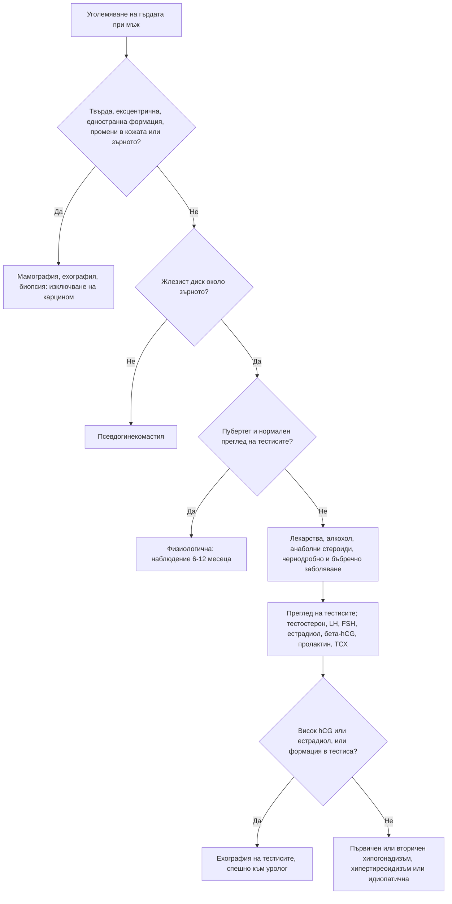

# Глава 39. Хирзутизъм, гинекомастия и хипогонадизъм

> **Част VIII. Ендокринна система и обмяна на веществата**

## Цели на главата

- Да се разграничават хирзутизмът, хипертрихозата и вирилизацията.
- Да се поставя диагнозата синдром на поликистозните яйчници след изключване на другите причини.
- Да се разпознават андроген-секретиращите тумори по техните червени флагове.
- Да се разграничават физиологичната, лекарствената и патологичната гинекомастия и да се изключва карцином на гърдата при мъжа.
- Да се поставя правилно диагнозата мъжки хипогонадизъм и да се разграничават първичният и вторичният.

## Ключови моменти

- Хирзутизмът се оценява с модифицираната скала на Ferriman-Gallwey. Прагът е 4–6 точки в зависимост от етническия произход *(SORT C [1])*.
- Най-честата причина за хирзутизъм е синдромът на поликистозните яйчници. Андроген-секретиращите тумори са под 1% *(SORT B [2])*.
- Бързото начало, вирилизацията и много високите стойности на тестостерона или DHEAS са червени флагове за тумор.
- СПКЯ се диагностицира по два от три критерия след изключване на другите причини. При възрастни антимюлеровият хормон може да замести ехографията *(SORT B [1])*.
- При всеки мъж с гинекомастия се преглеждат тестисите. Повишеният бета-hCG насочва към тумор на тестиса *(SORT C [4])*.
- Хипогонадизмът се диагностицира само при симптоми и две ниски сутрешни стойности на тестостерона на гладно *(SORT C [6])*.

---

## А. ХИРЗУТИЗЪМ

## 1. Определения

- **Хирзутизъм** — окосмяване с терминални (дебели, пигментирани) косми по мъжки тип при жена: горна устна, брадичка, гърди, корем, гръб. Оценява се с модифицираната скала на **Ferriman-Gallwey**. Международните препоръки от 2023 г. приемат за хирзутизъм сбор от 4–6 точки нагоре в зависимост от етническия произход. По-старият праг е ≥ 8 точки [1].
- **Хипертрихоза** — генерализирано увеличаване на окосмяването (обикновено велусни косми), което **не зависи от андрогените**. Причини: лекарства (**миноксидил**, циклоспорин, фенитоин), анорексия нервоза, порфирия, хипотиреоидизъм, паранеопластична хипертрихоза.
- **Вирилизация** — хирзутизъм плюс признаци на изразен андрогенен излишък: **клиторомегалия**, **задълбочаване на гласа**, **плешивост по мъжки тип**, увеличена мускулна маса, атрофия на гърдите. **Вирилизацията винаги е червен флаг.**

## 2. Причини

| Причина | Относителна честота [2] | Насочващи белези |
|---|---|---|
| **Синдром на поликистозните яйчници (СПКЯ)** | 70–80% | Начало около пубертета, бавно прогресиране, олигоменорея, акне, затлъстяване, инсулинова резистентност |
| **Идиопатичен хирзутизъм** | 5–15% | Редовен цикъл, нормални андрогени, нормални яйчници |
| **Некласическа вродена надбъбречна хиперплазия** (дефицит на 21-хидроксилаза) | 1–5% (по-често в някои етнически групи) | Клинично наподобява СПКЯ; **17-хидроксипрогестерон**, изследван сутрин във фоликуларната фаза, е повишен (потвърждава се с ACTH тест) |
| **Андроген-секретиращи тумори** | < 1% | **Бързо начало** (месеци), **вирилизация**, много висок тестостерон; тумори на яйчника (Sertoli-Leydig) или на надбъбречната жлеза (карцином — висок DHEAS) |
| **Хипертекоза на яйчниците** | Рядко | Жени в постменопауза, постепенно нарастващ андрогенен излишък |
| **Синдром на Cushing** | Рядко | Кушингоидни белези |
| **Други ендокринни причини** | Рядко | Акромегалия, хиперпролактинемия, хипотиреоидизъм |
| **Лекарства** | — | Анаболни стероиди, **тестостерон** (включително **трансдермален гел на партньора**), даназол, валпроат, прогестини с андрогенна активност |

## 3. Синдром на поликистозните яйчници

**Ротердамски критерии** (след изключване на другите причини). Необходими са **два от три** белега [1]:

1. **олиго- или ановулация**;
2. **клиничен или биохимичен хиперандрогенизъм**;
3. **поликистозна морфология** на яйчниците при ехография (≥ 20 фоликула в един яйчник или обем ≥ 10 ml) или, според международните препоръки от 2023 г., повишен **антимюлеров хормон** при възрастни жени.

При юноши диагнозата изисква **и двата** белега — олигоовулация и хиперандрогенизъм. Ехографията не се използва през първите 8 години след менархето.

**Изключване на другите причини:** ТСХ, пролактин, 17-хидроксипрогестерон, тест за бременност, а при съответна клиника и скрининг за синдром на Cushing и изследване на яйчниците и надбъбреците.

**Свързани състояния:** инсулинова резистентност, затлъстяване, преддиабет и диабет тип 2, дислипидемия, **метаболитно свързано стеатозно чернодробно заболяване (MASLD)**, **обструктивна сънна апнея**, **хиперплазия на ендометриума** (при продължителна ановулация), депресия и тревожност, безплодие.

## 4. Червени флагове при хирзутизъм

- **Бързо начало** (за месеци) и прогресиране.
- **Вирилизация.**
- **Много висок тестостерон** (обикновено > 5 nmol/l) или много висок DHEAS.
- Начало **след менопаузата**.
- Палпируема формация в корема или малкия таз.
- Кушингоидни белези.

## 5. Изследвания при хирзутизъм

- **Общ тестостерон** (сутрин, в ранната фоликуларна фаза), при нужда свободен тестостерон или SHBG. Андрогените се изследват при всяка жена с отклонен сбор за хирзутизъм, но не и при жена с редовен цикъл и само локално нежелано окосмяване [3]. Предпочитат се методи с масспектрометрия [1].
- **DHEAS** (надбъбречен произход).
- **17-хидроксипрогестерон.**
- ТСХ, пролактин.
- При червени флагове: **трансвагинална ехография**, **КТ или ЯМР на надбъбреците**.
- Метаболитна оценка при СПКЯ: глюкоза или орален глюкозотолерантен тест, HbA1c, липиди.

---

## Б. ГИНЕКОМАСТИЯ

## 6. Определение и разграничаване

**Гинекомастията** е доброкачествена пролиферация на жлезистата тъкан на мъжката гърда. Причината е дисбаланс между естрогените и андрогените. При палпация се установява **гумено-еластичен или твърд диск, концентричен около зърното**.

| Белег | Гинекомастия | Псевдогинекомастия | Карцином на гърдата |
|---|---|---|---|
| Тъкан | Жлезиста, дисковидна под ареолата | Мастна, мека, без диск | Твърда, неравна формация |
| Позиция | Концентрична около зърното | Дифузна | **Ексцентрична**, извън зърното |
| Страна | Често двустранна (може асиметрична) | Двустранна | Обикновено **едностранна** |
| Болезненост | Често в ранната фаза | Не | Обикновено неболезнена |
| Други белези | — | Затлъстяване | **Прибиране на зърното, кървава секреция, промени в кожата, аксиларна лимфаденопатия**, фиксиране |

## 7. Причини

| Група | Причини |
|---|---|
| **Физиологични** | Новородени; **пубертет** (при около половината от момчетата; отзвучава за 1–2 години); напреднала възраст [4] |
| **Лекарства** (около 20–25%) | **Спиронолактон**, антиандрогени (бикалутамид), инхибитори на 5-алфа-редуктазата (финастерид, дутастерид), агонисти на GnRH, естрогени, **анаболни стероиди** и тестостерон (ароматизация), дигоксин, циметидин, кетоконазол, метронидазол, антипсихотици (чрез пролактина), трициклични антидепресанти, някои антиретровирусни средства (ефавиренц), канабис, алкохол, хероин, етерични масла от лавандула и чаено дърво (при деца) |
| **Хипогонадизъм** | **Синдром на Klinefelter** (малки, твърди тестиси, висок ръст, безплодие), първичен и вторичен хипогонадизъм |
| **Системни заболявания** | **Чернодробна цироза**, алкохолизъм, **хипертиреоидизъм**, **ХБЗ** и диализа, възобновено хранене след недохранване |
| **Тумори** | **Тумори на тестиса** — от Leydig клетките (естрогени), герминативноклетъчни (**бета-hCG**); тумори на надбъбреците (естроген-секретиращи); **hCG-секретиращи тумори** (бял дроб, черен дроб, стомах) |
| **Други** | Хиперпролактинемия (чрез хипогонадизъм), андрогенна нечувствителност, идиопатична гинекомастия (около 25%) |

## 8. Изследвания при гинекомастия

1. **Анамнеза:** лекарства, анаболни стероиди, алкохол, продължителност, болка.
2. **Преглед на тестисите** — **задължителен** (формация, размер).
3. **Лабораторни изследвания** (при непубертетна, нелекарствена или бързо нарастваща гинекомастия): сутрешен общ тестостерон, LH, FSH, естрадиол, SHBG, **бета-hCG**, AFP, пролактин, ТСХ, чернодробни показатели, креатинин [4].
4. **Ехография на тестисите** — задължителна при повишен hCG или естрадиол и при находка при прегледа. Европейската академия по андрология я включва в оценката на всеки възрастен мъж с гинекомастия [4].
5. **Ехография и мамография на гърдата** при неясна клинична находка. При подозрителна формация директно се прави дебелоиглена биопсия [4].

**Карцином на гърдата при мъжа.** Среща се рядко, но по-често при носители на мутации в **BRCA2**, при синдром на Klinefelter и след облъчване на гръдния кош. Необяснимата формация в гърдата след 30-годишна възраст е показание за насочване по пътя за съмнение за рак [5].

---

## В. МЪЖКИ ХИПОГОНАДИЗЪМ

## 9. Клинична картина

- **Специфични симптоми:** намалено либидо, еректилна дисфункция, **липса на сутрешни ерекции**, намалено окосмяване по тялото, гинекомастия, малки тестиси, безплодие, горещи вълни, остеопороза и фрактури при нискоенергийна травма.
- **Неспецифични симптоми:** умора, намалена мускулна маса и сила, депресия, нарушена концентрация, анемия, наддаване на тегло.

## 10. Диагноза

1. **Сутрешен (7–11 ч.) общ тестостерон на гладно**, изследван **два пъти** [6]. Тестостеронът се понижава при остро заболяване, след хранене и при недоспиване.
2. При нисък тестостерон (обикновено < 8–12 nmol/l) се изследват **LH и FSH**.
3. **SHBG** и изчисляване на свободния тестостерон при гранични стойности:
   - SHBG е **нисък** при затлъстяване, диабет тип 2 и хипотиреоидизъм;
   - SHBG е **висок** при напреднала възраст, хипертиреоидизъм, чернодробно заболяване, HIV и антиепилептични средства.

| Вид | LH и FSH | Причини |
|---|---|---|
| **Първичен** (тестикуларен) | **Високи** | **Синдром на Klinefelter**, орхит (паротитен), травма, торзия, химиотерапия, лъчетерапия, крипторхизъм, възраст |
| **Вторичен** (хипофизарно-хипоталамичен) | **Ниски или неадекватно нормални** | **Затлъстяване и метаболитен синдром**, **диабет тип 2**, **опиоиди**, глюкокортикоиди, **анаболни стероиди** (след спиране), **хиперпролактинемия**, тумори на хипофизата, **хемохроматоза**, синдром на Kallmann (**аносмия**), тежко системно заболяване, обструктивна сънна апнея, прекомерни физически натоварвания и ниско тегло |

**При вторичен хипогонадизъм** се изследват **пролактин** и **феритин** (хемохроматоза). При много нисък тестостерон (< 5 nmol/l), висок пролактин, други хипофизни дефицити или зрителни симптоми се прави **ЯМР на хипофизата**.

---

## 11. Безопасна диагностична стратегия

| Въпрос | Отговор |
|---|---|
| **Вероятна диагноза** | СПКЯ, идиопатичен хирзутизъм; пубертетна или лекарствена гинекомастия; вторичен хипогонадизъм при затлъстяване и диабет |
| **Сериозни заболявания, които не бива да се пропускат** | **Андроген-секретиращ тумор** на яйчника или надбъбрека; **тумор на тестиса**; **карцином на гърдата при мъжа**; **тумор на хипофизата**; синдром на Cushing; синдром на Klinefelter |
| **Чести капани** | Тестостеронов гел на партньора; некласическа вродена надбъбречна хиперплазия; спиронолактон и финастерид; анаболни стероиди; тестостерон, изследван следобед или по време на остро заболяване; хемохроматоза като причина за хипогонадизъм |
| **Маскиращи заболявания** | Лекарства, заболявания на щитовидната жлеза, чернодробна цироза, ХБЗ, захарен диабет |
| **Психосоциални аспекти** | Нарушен образ на тялото, депресия, злоупотреба с анаболни стероиди (особено при млади мъже, които тренират) |

---

## 12. Диагностичен алгоритъм при гинекомастия

---

## 13. Кога и колко спешно да насочим

| Спешност | Клинична ситуация |
|---|---|
| **В същия ден** | Формация в тестиса със симптоми на разпространение (задух, хемоптиза, болки в гърба) |
| **Бързо (до 2 седмици)** | Формация или промяна във формата или консистенцията на тестиса [5]; необяснима формация в гърдата при мъж на 30 и повече години или едностранни промени в зърното след 50 години [5]; хирзутизъм с вирилизация, бързо начало или много висок тестостерон или DHEAS; повишен бета-hCG при гинекомастия |
| **Планово** | Подозрение за некласическа вродена надбъбречна хиперплазия; вторичен хипогонадизъм с тестостерон < 5 nmol/l, висок пролактин или други хипофизни дефицити (ЯМР на хипофизата) [6]; подозрение за синдром на Klinefelter; безплодие |
| **Проследяване в общата практика** | СПКЯ — метаболитна оценка и лечение [1]; идиопатичен хирзутизъм; пубертетна гинекомастия — наблюдение [4]; лекарствена гинекомастия след спиране на лекарството; вторичен хипогонадизъм при затлъстяване — отслабване и повторно изследване |

---

## 14. Клинични перли

- Хирзутизъм с бързо начало и вирилизация: изключете тумор, продуциращ андрогени.
- Хирзутизъм при жена, чийто партньор използва тестостеронов гел: попитайте за това.
- СПКЯ е диагноза след изключване на другите причини. Изследвайте поне ТСХ, пролактин и 17-хидроксипрогестерон.
- При всеки мъж с гинекомастия прегледайте тестисите.
- Млад мъж с нова болезнена гинекомастия и повишен бета-hCG: тумор на тестиса, докато не се докаже противното.
- Спиронолактонът е една от най-честите лекарствени причини за гинекомастия.
- Тестостеронът се изследва сутрин, на гладно, два пъти, извън остро заболяване.
- Вторичен хипогонадизъм с висок феритин: хемохроматоза.
- Хипогонадизъм с аносмия: синдром на Kallmann.

---

## 15. Клиничен случай

**Етап 1 — представяне.** Мъж на 26 години се оплаква от болезнено уголемяване на двете гърди от 2 месеца. Не приема лекарства и анаболни стероиди. Тренира във фитнес зала.

> **Въпрос 1.** Коя част от прегледа е задължителна?

**Етап 2 — преглед и изследвания.** Двустранно се палпира болезнен жлезист диск около зърната с диаметър 3 cm. В долния полюс на левия тестис се палпира твърд, неболезнен възел с диаметър около 1,5 cm. Бета-hCG е 45 IU/l (норма < 2), естрадиолът е повишен, а LH е потиснат.

> **Въпрос 2.** Какъв е механизмът на гинекомастията?

> **Въпрос 3.** Какви са следващите стъпки и колко спешно е насочването?

Обсъждане и отговори

**Отговор 1.** **Прегледът на тестисите.** При всеки мъж с гинекомастия се търсят формация и промяна в размера на тестисите [4].

**Отговор 2.** hCG, секретиран от **герминативноклетъчен тумор на тестиса**, стимулира клетките на Leydig и ароматизацията. Естрадиолът се повишава и предизвиква гинекомастия. Потиснатият LH отразява отрицателната обратна връзка.

**Отговор 3.** Прави се ехография на тестиса, която показва хипоехогенна интратестикуларна формация. Пациентът се насочва по пътя за съмнение за рак към уролог [5]. Изследват се туморните маркери AFP, бета-hCG и ЛДХ и се прави КТ за стадиране. Лечението започва с ингвинална орхиектомия.

**Поука.** При гинекомастия прегледът на тестисите може да спаси живот. Туморите на тестиса са най-честите солидни злокачествени тумори при млади мъже и имат отлична прогноза при ранна диагноза.

---

## Обобщение

- Хирзутизмът се разграничава от хипертрихозата и вирилизацията. Най-честата причина е СПКЯ, а бързото начало и вирилизацията насочват към тумор.
- СПКЯ е диагноза след изключване на другите причини: поне ТСХ, пролактин и 17-хидроксипрогестерон.
- Гинекомастията най-често е физиологична, лекарствена или идиопатична. Прегледът на тестисите и бета-hCG откриват тумор на тестиса, а ексцентричната твърда формация налага изключване на карцином.
- Мъжкият хипогонадизъм се потвърждава с два сутрешни тестостерона на гладно. LH и FSH разграничават първичния от вторичния.

## Самопроверка

### Въпроси с един верен отговор

**1.** *(основно ниво)* Жена на 24 години от пубертета има олигоменорея и сбор 12 по модифицираната скала на Ferriman-Gallwey. Тестостеронът е 2,4 nmol/l. Кои изследвания са задължителни, преди да се постави диагнозата СПКЯ?

- **А.** ЯМР на надбъбречните жлези
- **Б.** ТСХ, пролактин и 17-хидроксипрогестерон
- **В.** Лапароскопия
- **Г.** Кариотип
- **Д.** Никакви — диагнозата е ясна

Отговор и обосновка

**Верен отговор: Б.** СПКЯ е диагноза след изключване на заболяванията на щитовидната жлеза, хиперпролактинемията и некласическата вродена надбъбречна хиперплазия [1]. Образни изследвания на надбъбречните жлези се правят само при червени флагове.

**2.** *(основно ниво)* Жена на 52 години в менопауза за 5 месеца развива хирзутизъм, задълбочаване на гласа и плешивост по мъжки тип. Тестостеронът е 9 nmol/l. Кое е най-подходящото поведение?

- **А.** Комбиниран орален контрацептив
- **Б.** Спиронолактон
- **В.** Бързо насочване и образни изследвания на яйчниците и надбъбречните жлези
- **Г.** Лазерна епилация
- **Д.** Контрол след 6 месеца

Отговор и обосновка

**Верен отговор: В.** Бързото начало, вирилизацията, началото след менопаузата и много високият тестостерон са червени флагове за андроген-секретиращ тумор или хипертекоза на яйчниците [2].

**3.** *(основно ниво)* Момче на 14 години има болезнено дисковидно уплътнение под дясната ареола от 3 месеца. Тестисите са нормални, а развитието съответства на пубертета. Кое е правилното поведение?

- **А.** Мамография
- **Б.** Биопсия
- **В.** Успокояване и наблюдение
- **Г.** Тамоксифен
- **Д.** Хирургично лечение

Отговор и обосновка

**Верен отговор: В.** Пубертетната гинекомастия е честа и обикновено отзвучава спонтанно. Изследвания са нужни при нетипична находка или при промяна в тестисите [4].

**4.** *(напреднало ниво)* Мъж на 48 години със затлъстяване (ИТМ 36) и диабет тип 2 има намалено либидо. Два сутрешни тестостерона на гладно са 8,6 и 9,1 nmol/l. LH е ниско нормален, а пролактинът и феритинът са нормални. Кое е най-вероятното обяснение?

- **А.** Синдром на Klinefelter
- **Б.** Функционален вторичен хипогонадизъм при затлъстяване
- **В.** Пролактином
- **Г.** Първичен тестикуларен дефект
- **Д.** Хемохроматоза

Отговор и обосновка

**Верен отговор: Б.** Затлъстяването и диабетът тип 2 потискат оста хипоталамус–хипофиза–тестиси и понижават SHBG. При гранични стойности се изчислява свободният тестостерон [6]. При първичен дефект LH би бил висок.

**5.** *(напреднало ниво)* Мъж на 70 години има едностранна, твърда, неболезнена формация извън ареолата с прибиране на зърното. Кое е правилното поведение?

- **А.** Наблюдение 6 месеца
- **Б.** Спиране на спиронолактона и контрол
- **В.** Насочване по пътя за съмнение за рак и дебелоиглена биопсия
- **Г.** Изследване на тестостерона
- **Д.** Тамоксифен

Отговор и обосновка

**Верен отговор: В.** Ексцентричната твърда формация с промени в зърното е подозрителна за карцином на гърдата. Прави се директно дебелоиглена биопсия [4], а насочването е по пътя за съмнение за рак [5].

### Задача

Жена на 34 години с редовен цикъл има нов хирзутизъм и акне от 4 месеца. Тестостеронът е 4,2 nmol/l. Съпругът ѝ от половин година използва тестостеронов гел. Как ще подходите?

Решение

Най-вероятна е **вторична експозиция на тестостерон** чрез кожен контакт с партньора. Съпругът трябва да покрива мястото на приложение с дреха, да мие ръцете си след нанасянето и да избягва кожен контакт, докато гелът не изсъхне. Тестостеронът на жената се изследва отново след няколко седмици. Ако стойностите се нормализират, диагнозата е потвърдена. Ако тестостеронът остане висок или се появи вирилизация, се търсят тумор и други причини [2, 3]. Тестостероновият гел е опасен и за деца в дома.

### OSCE станция: Преглед на мъж с гинекомастия

**Време:** 8 минути. **Ниво:** основно (студенти, специализанти).

**Задача за кандидата.** Мъж на 55 години е забелязал уголемяване на лявата гърда. Снемете насочена анамнеза и направете преглед.

**Информация за симулирания пациент (за изпитващия).** Приема спиронолактон заради сърдечна недостатъчност. Пие алкохол ежедневно.

**Рубрика за оценяване**

| Критерий | Точки |
|---|---|
| Представя се, получава съгласие и предлага придружител | 1 |
| Пита за лекарства, алкохол, анаболни стероиди и продължителност на промяната | 2 |
| Палпира двете гърди: концентричен диск или ексцентрична твърда формация, промени в зърното и кожата | 2 |
| Палпира аксиларните лимфни възли | 1 |
| Преглежда тестисите | 2 |
| Търси белези на чернодробно заболяване, хипертиреоидизъм и хипогонадизъм | 1 |
| Обобщава находката и предлага план (спиронолактон, изследвания, насочване при подозрителна формация) | 1 |
| **Общо** | **10** |

**Праг за успешно представяне:** 7 от 10 точки, включително прегледа на тестисите и оценката на формацията.

## Литература

1. Teede HJ, Tay CT, Laven JJE, Dokras A, Moran LJ, Piltonen TT, et al. Recommendations From the 2023 International Evidence-based Guideline for the Assessment and Management of Polycystic Ovary Syndrome. J Clin Endocrinol Metab. 2023;108(10):2447-2469. doi:10.1210/clinem/dgad463. PMID: 37580314.
2. Azziz R, Sanchez LA, Knochenhauer ES, Moran C, Lazenby J, Stephens KC, et al. Androgen excess in women: experience with over 1000 consecutive patients. J Clin Endocrinol Metab. 2004;89(2):453-62. doi:10.1210/jc.2003-031122. PMID: 14764747.
3. Martin KA, Anderson RR, Chang RJ, Ehrmann DA, Lobo RA, Murad MH, et al. Evaluation and Treatment of Hirsutism in Premenopausal Women: An Endocrine Society Clinical Practice Guideline. J Clin Endocrinol Metab. 2018;103(4):1233-1257. doi:10.1210/jc.2018-00241. PMID: 29522147.
4. Kanakis GA, Nordkap L, Bang AK, Calogero AE, Bártfai G, Corona G, et al. EAA clinical practice guidelines-gynecomastia evaluation and management. Andrology. 2019;7(6):778-793. doi:10.1111/andr.12636. PMID: 31099174.
5. National Institute for Health and Care Excellence. Suspected cancer: recognition and referral (NICE guideline NG12). London: NICE; 2015 [актуализирано 2026]. Достъпно на: https://www.nice.org.uk/guidance/ng12
6. Bhasin S, Brito JP, Cunningham GR, Hayes FJ, Hodis HN, Matsumoto AM, et al. Testosterone Therapy in Men With Hypogonadism: An Endocrine Society Clinical Practice Guideline. J Clin Endocrinol Metab. 2018;103(5):1715-1744. doi:10.1210/jc.2018-00229. PMID: 29562364.

*Последна проверка на съдържанието: септември 2026 г. Следващ планиран преглед: септември 2027 г. (вж. „Политика за актуализация“ в README).*

<!-- навигация -->

---

[← Глава 38. Надбъбречни и хипофизни нарушения; полиурия и полидипсия](38-nadbabrechni-hipofiza.md) · [Съдържание](../README.md) · [Глава 40. Главоболие и лицева болка →](40-glavobolie.md)
