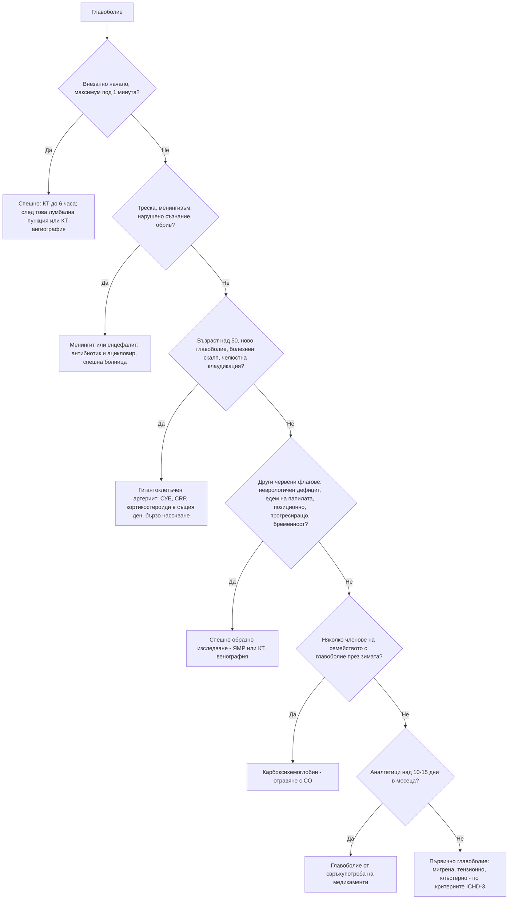

# Глава 40. Главоболие и лицева болка

> **Част IX. Нервна система**

## Цели на главата

- Да се разграничават първичните от вторичните главоболия по Международната класификация на главоболията (ICHD-3).
- Да се прилагат червените флагове (SNNOOP10) за идентифициране на вторичните главоболия.
- Да се разпознава главоболието тип „гръм от ясно небе“ и да се организира спешното му изследване (КТ, при нужда лумбална пункция).
- Да се диагностицират мигрената, тензионното и клъстерното главоболие, както и главоболието от свръхупотреба на медикаменти.
- Да се разпознават гигантоклетъчният артериит, идиопатичната интракраниална хипертензия, тромбозата на венозните синуси, отравянето с въглероден оксид и другите опасни причини.
- Да се разграничават основните причини за лицева болка.

---

## 1. Класификация (ICHD-3)

| Група | Основни форми |
|---|---|
| **Първични главоболия** | **Мигрена** (с аура и без аура), **главоболие от тензионен тип**, **тригеминални автономни цефалгии** (клъстерно главоболие, пароксизмална хемикрания, SUNCT/SUNA, hemicrania continua), други (първично пробождащо, кашлично, при усилие, при сексуална активност, хипнично, ново ежедневно персистиращо главоболие, първично главоболие тип „гръм от ясно небе“) |
| **Вторични главоболия** | Травма на главата и шията; **съдови** (субарахноидален кръвоизлив, интрацеребрален кръвоизлив, исхемичен инсулт, **дисекация на шийна артерия**, **тромбоза на венозните синуси**, **синдром на обратимата церебрална вазоконстрикция**, **гигантоклетъчен артериит**, хипофизна апоплексия, синдром на задната обратима енцефалопатия); несъдови вътречерепни (**идиопатична интракраниална хипертензия**, ниско вътречерепно налягане, **тумор**, малформация на Chiari); вещества и тяхното отнемане (**свръхупотреба на медикаменти**, **въглероден оксид**, алкохол, отнемане на кофеин, нитрати); **инфекции** (менингит, енцефалит, абсцес, системни инфекции); нарушения на хомеостазата (**тежка хипертония**, хипоксия, **хиперкапния** при сънна апнея, хипотиреоидизъм, гладуване); краниални структури (**глаукома**, синузит, зъби, темпоромандибуларна става, шиен отдел); психични разстройства |
| **Краниални невралгии и лицева болка** | **Тригеминална невралгия**, окципитална невралгия, **постхерпесна невралгия**, глософарингеална невралгия, персистираща идиопатична лицева болка |

---

## 2. Безопасна диагностична стратегия

| Въпрос | Отговор |
|---|---|
| **Вероятна диагноза** | Главоболие от тензионен тип, мигрена, главоболие от свръхупотреба на медикаменти, главоболие при системна вирусна инфекция |
| **Сериозни заболявания, които не бива да се пропускат** | **Субарахноидален кръвоизлив**, интрацеребрален кръвоизлив, **менингит и енцефалит**, **гигантоклетъчен артериит**, **тромбоза на венозните синуси**, **дисекация на шийна артерия**, **отравяне с въглероден оксид**, мозъчен тумор и абсцес, **остра закритоъгълна глаукома**, хипофизна апоплексия, **прееклампсия**, хипертонична енцефалопатия |
| **Чести капани** | **Главоболие от свръхупотреба на медикаменти**; **идиопатична интракраниална хипертензия**; **„синусово главоболие“, което всъщност е мигрена**; сигнално главоболие преди субарахноидален кръвоизлив; обструктивна сънна апнея; отравяне с въглероден оксид през зимата; дисекация след манипулация на шията или незначителна травма; ортостатично главоболие при ниско вътречерепно налягане |
| **Маскиращи заболявания** | Депресия, лекарства (нитрати, калциеви антагонисти, силденафил, ИПП), анемия, хипотиреоидизъм, шиен отдел на гръбначния стълб |
| **Психосоциални аспекти** | Стрес, тревожност, депресия, страх от мозъчен тумор, насилие |

---

## 3. Червени флагове (SNNOOP10)

| Буква | Червен флаг | Възможна причина |
|---|---|---|
| **S** | **Системни симптоми**, включително треска, загуба на тегло | Менингит, енцефалит, гигантоклетъчен артериит, метастази |
| **N** | **Анамнеза за злокачествено заболяване** | Мозъчни метастази |
| **N** | **Неврологичен дефицит** или нарушено съзнание | Инсулт, кръвоизлив, тумор, абсцес, енцефалит |
| **O** | **Внезапно начало** („гръм от ясно небе“) | **Субарахноидален кръвоизлив** и други съдови причини |
| **O** | **По-възрастни** — ново главоболие след 50 години | **Гигантоклетъчен артериит**, тумор |
| **P** | **Промяна в характера** на познатото главоболие или скорошно начало | Вторично главоболие |
| **P** | **Позиционно** главоболие | Ниско или високо вътречерепно налягане |
| **P** | **Провокирано от кихане, кашлица или усилие** | Повишено вътречерепно налягане, малформация на Chiari |
| **P** | **Едем на папилата** | Повишено вътречерепно налягане |
| **P** | **Прогресиращо** и нетипично главоболие | Тумор, хроничен субдурален хематом |
| **P** | **Бременност** и следродилен период | Прееклампсия, тромбоза на венозните синуси, синдром на обратимата церебрална вазоконстрикция, хипофизна апоплексия |
| **P** | **Болезнено око** с автономни прояви | Глаукома, клъстерно главоболие |
| **P** | **Посттравматично** начало | Субдурален или епидурален хематом |
| **P** | **Патология на имунната система** (HIV, имуносупресия) | Опортюнистични инфекции, лимфом |
| **P** | **Свръхупотреба на обезболяващи** или **ново лекарство** | Главоболие от свръхупотреба, лекарствено главоболие |

---

## 4. Главоболие тип „гръм от ясно небе“

**Определение:** много силно главоболие, което достига максималната си интензивност за **под една минута**. То е **спешно състояние**, дори ако е отшумяло.

**Причини:**

- **субарахноидален кръвоизлив** (10–25% от случаите);
- **синдром на обратимата церебрална вазоконстрикция** — повтарящи се главоболия тип „гръм“ за няколко дни; провокира се от следродилния период, серотонинергични лекарства, канабис, симпатикомиметици, усилие, сексуална активност;
- **дисекация на шийна артерия** — болка в шията, синдром на Horner, инсулт;
- **тромбоза на венозните синуси**;
- **хипофизна апоплексия**;
- интрацеребрален кръвоизлив, инсулт в малкия мозък;
- спонтанна интракраниална хипотензия;
- колоидна киста на третия вентрикул;
- хипертонична криза и синдром на задната обратима енцефалопатия;
- първично главоболие тип „гръм“ (диагноза след изключване).

**Изследване при подозрение за субарахноидален кръвоизлив:**

- **безконтрастна КТ на главата** — ако е направена **до 6 часа** от началото с модерен скенер и е разчетена от опитен рентгенолог, тя има почти 100% чувствителност;
- **след 6 часа** — **лумбална пункция** (≥ 12 часа след началото) за **ксантохромия** или КТ-ангиография;
- при нормална КТ и ликвор, но продължаващо съмнение — КТ или ЯМР ангиография за дисекация, синдром на обратимата церебрална вазоконстрикция и тромбоза на венозните синуси.

**Правило на Ottawa за субарахноидален кръвоизлив.** Прилага се при пациенти в съзнание над 15 години с ново силно нетравматично главоболие, достигнало максимума си за 1 час. Изследване е необходимо при **поне един** от следните белези:

- възраст ≥ 40 години;
- болка или скованост на шията;
- загуба на съзнание пред свидетел;
- начало при физическо усилие;
- начало тип „гръм“ (моментален максимум);
- ограничена флексия на шията при прегледа.

---

## 5. Първични главоболия

### 5.1. Мигрена

**Мигрена без аура (ICHD-3):**

- поне 5 пристъпа;
- продължителност 4–72 часа;
- поне 2 от следните: **едностранна**, **пулсираща**, **умерена до силна**, **засилва се при обичайна физическа активност**;
- поне 1 от следните: **гадене и/или повръщане**; **фотофобия и фонофобия**.

**Мигрена с аура:** напълно обратими **зрителни** (трептящи зигзагообразни линии, сцинтилиращ скотом), **сетивни** (разпространяващо се изтръпване) или **говорни** симптоми. Аурата се развива постепенно за **≥ 5 минути** и продължава 5–60 минути. Преобладават **позитивните** феномени.

**Мнемоника POUND** за мигрена:

- **P** — пулсиращо;
- **O** — продължителност 4–72 часа (*one day*);
- **U** — едностранно (*unilateral*);
- **N** — гадене (*nausea*);
- **D** — инвалидизиращо (*disabling*).

При 4 или 5 белега вероятността за мигрена е висока (LR+ ≈ 24).

**Разграничаване на аурата от ТИА.** Аурата се развива **постепенно**, **разпространява се** и включва **позитивни** симптоми (трептене, изтръпване). ТИА започва **внезапно** и протича с **негативни** симптоми (загуба на зрение, изтръпване, слабост). Първата „аура“ след 50-годишна възраст изисква изключване на ТИА.

### 5.2. Главоболие от тензионен тип

Двустранно, притискащо или стягащо („като обръч“), с лека до умерена интензивност. Не се засилва при физическа активност. Липсва гадене. Може да има фотофобия **или** фонофобия, но не и двете. Това е най-честото първично главоболие в населението.

### 5.3. Клъстерно главоболие

- **Строго едностранна**, много силна болка **около окото** или в слепоочието, с продължителност **15–180 минути**, до 8 пъти дневно.
- **Ипсилатерални автономни прояви:** сълзене, зачервяване на окото, течащ или запушен нос, птоза, миоза, оток на клепача, изпотяване на челото.
- **Двигателно неспокойствие.** Пациентът не може да лежи, за разлика от пациента с мигрена.
- **Денонощен ритъм** (често нощем, по едно и също време) и периоди на клъстери от седмици до месеци.
- По-често при мъже и пушачи. Алкохолът провокира пристъпите в активния период.
- **Диференциална диагноза:** пароксизмална хемикрания (по-кратки пристъпи, жени, **пълен ефект от индометацин**), SUNCT/SUNA, hemicrania continua, **синдром на Horner при дисекация на каротидната артерия**, глаукома.

### 5.4. Главоболие от свръхупотреба на медикаменти

- Главоболие **≥ 15 дни в месеца** при пациент с предшестващо главоболие.
- Редовна свръхупотреба **над 3 месеца**:
  - прости аналгетици ≥ 15 дни в месеца;
  - **триптани, опиоиди, комбинирани аналгетици** (включително с кофеин и кодеин) ≥ 10 дни в месеца.
- Много честа и недооценена причина за хронично ежедневно главоболие.

---

## 6. Опасни вторични главоболия

| Заболяване | Ключови белези | Изследване |
|---|---|---|
| **Субарахноидален кръвоизлив** | Внезапно, най-силното в живота главоболие; повръщане, вратна ригидност, загуба на съзнание; понякога **сигнално главоболие** дни преди това | КТ, лумбална пункция, КТ-ангиография |
| **Бактериален менингит** | Треска, главоболие, вратна ригидност, нарушено съзнание, **неизбледняващ обрив** (менингококи) | Хемокултури, лумбална пункция (КТ преди нея при показания); **антибиотик веднага** |
| **Херпесен енцефалит** | Треска, объркване, промени в поведението, афазия, гърчове | ЯМР (темпорални дялове), PCR в ликвора; **ацикловир веднага** (10 mg/kg i.v. на 8 часа при нормална бъбречна функция) |
| **Гигантоклетъчен артериит** | **Възраст над 50 години**, ново главоболие, **болезненост на скалпа**, **челюстна клаудикация**, **зрителни нарушения** (преходна слепота, диплопия), симптоми на ревматична полимиалгия, висока СУЕ и CRP, удебелена, болезнена артерия с отслабен пулс | **Кортикостероиди в същия ден** при съмнение; бързо насочване; **ехография** на темпоралните артерии (белег „ореол“) или **биопсия** до 1–2 седмици от началото на лечението |
| **Идиопатична интракраниална хипертензия** | **Млади жени с наднормено тегло**, ежедневно главоболие, **пулсиращ шум в ушите**, преходно замъгляване на зрението, диплопия (пареза на VI нерв), **едем на папилата**; лекарства (тетрациклини, изотретиноин, витамин A) | ЯМР и **ЯМР венография** (за изключване на тромбоза на синусите), лумбална пункция (налягане на отваряне > 25 cm H₂O), периметрия |
| **Тромбоза на венозните синуси** | Жени (контрацептиви, бременност, следродилен период), тромбофилия, дехидратация, инфекции на ухото; прогресиращо главоболие, **гърчове**, едем на папилата, фокален дефицит | **ЯМР или КТ венография** (D-димерът може да е нормален) |
| **Дисекация на шийна артерия** | Болка в шията или лицето, **синдром на Horner**, шум в ухото, исхемични симптоми; след травма, манипулация, спорт | КТ или ЯМР ангиография |
| **Мозъчен тумор** | Прогресиращо главоболие, по-силно сутрин и в легнало положение, засилващо се при кашлица; повръщане, гърчове, **промени в личността**, фокален дефицит, едем на папилата. Изолираното главоболие рядко е единствената проява на тумор | ЯМР |
| **Хроничен субдурален хематом** | Възрастни хора, антикоагуланти, алкохол, лека травма преди седмици; флуктуиращо объркване, главоболие, хемипареза | КТ |
| **Отравяне с въглероден оксид** | **Зимата**, **печки на дърва, въглища или газ**, засягане на **няколко членове на семейството** (и на домашните любимци), подобрение извън дома, замайване, гадене, объркване; **SpO₂ е фалшиво нормална** | **Карбоксихемоглобин** (CO-оксиметрия) |
| **Остра закритоъгълна глаукома** | Болка в окото и главоболие, замъглено зрение, **ореоли около светлините**, червено око, средно разширена зеница, гадене | Спешна офталмологична оценка, вътреочно налягане |
| **Хипертонична енцефалопатия, синдром на задната обратима енцефалопатия** | Много високо АН (> 180/120 mmHg), зрителни нарушения, объркване, гърчове | ЯМР |
| **Прееклампсия** | Бременна след 20-ата седмица или следродилен период; хипертония, протеинурия, зрителни нарушения, болка в епигастриума | АН, урина, тромбоцити, чернодробни ензими |
| **Ниско вътречерепно налягане** | **Ортостатично главоболие** (засилва се в изправено положение и намалява в легнало); след лумбална пункция или спонтанно (изтичане на ликвор) | ЯМР с контраст (пахименингеално усилване, „увисване“ на мозъка) |
| **Хипофизна апоплексия** | Внезапно главоболие, зрителни нарушения, офталмоплегия, надбъбречна криза | ЯМР |

**Хипертонията и главоболието.** Леката и умерената хипертония **не причиняват** главоболие. Главоболие се дължи на налягането само при много високи стойности (над 180/120 mmHg), при синдром на задната обратима енцефалопатия, при прееклампсия и при феохромоцитом.

**„Синусово главоболие“.** Острият бактериален синузит протича с лицева болка, гноен секрет от носа и запушване на носа, често след вирусна инфекция. **Повечето пациенти с „повтарящо се синусово главоболие“ всъщност имат мигрена** (с автономни симптоми от носа).

---

## 7. Лицева болка

| Заболяване | Ключови белези |
|---|---|
| **Тригеминална невралгия** | **Кратки (секунди) пристъпи на електрическа, пронизваща болка** в зоната на II или III клон на тригеминалния нерв; **провокиращи зони и фактори** (докосване, дъвчене, миене на зъбите, вятър); рефрактерен период. **Вторична причина** (множествена склероза, тумор) трябва да се търси при възраст под 40 години, двустранна болка или **сетивен дефицит** — ЯМР |
| **Постхерпесна невралгия** | Персистираща болка след херпес зостер, най-често в зоната на I клон на тригеминалния нерв |
| **Херпес зостер офталмикус** | Везикули по челото; **белег на Hutchinson** (везикули по върха на носа) означава висок риск от засягане на окото — спешно към офталмолог |
| **Глософарингеална невралгия** | Пристъпна болка в гърлото и ухото при гълтане |
| **Дентална болка** | Болка при топло и студено, при почукване на зъба |
| **Синузит** | Болка в лицето при навеждане, гноен секрет |
| **Дисфункция на темпоромандибуларната става** | Болка пред ухото, щракане, ограничено отваряне на устата, бруксизъм |
| **Гигантоклетъчен артериит** | Челюстна клаудикация, болка в слепоочието, възраст над 50 години |
| **Дисекация на каротидната артерия** | Болка в лицето и шията със синдром на Horner |
| **Клъстерно главоболие** | Вж. т. 5.3 |
| **Персистираща идиопатична лицева болка** | Постоянна, лошо локализирана болка без неврологичен дефицит; диагноза след изключване |

---

## 8. Анамнеза и физикален преглед

**Анамнеза:** възраст при началото; начало (внезапно или постепенно); локализация; характер; продължителност и честота; придружаващи симптоми (гадене, фото- и фонофобия, аура, автономни симптоми, треска, неврологични симптоми); провокиращи фактори (позиция, кашлица, усилие, сексуална активност); **прием на аналгетици** (дни в месеца); лекарства; рискови фактори; бременност; травма; **дневник на главоболието**.

**Физикален преглед:**

- АН, температура;
- **неврологичен преглед**: ниво на съзнание, **фундоскопия** (едем на папилата), зрителни полета, **зеници** (синдром на Horner, пареза на III нерв с разширена зеница — аневризма на задната комуникантна артерия), черепномозъчни нерви, пронаторен тест, координация, походка;
- менингеални белези;
- **темпорални артерии** при хора над 50 години;
- синуси, зъби, темпоромандибуларна става, шия;
- кожа (обрив).

---

## 9. Диагностичен алгоритъм

---

## 10. Клинични перли

- Главоболие тип „гръм от ясно небе“ изисква спешно изследване, дори ако е отминало. Сигналното главоболие може да предшества разкъсването на аневризмата с дни.
- Нормалната КТ след 6-ия час не изключва субарахноидален кръвоизлив.
- Ново главоболие след 50-годишна възраст: изследвайте СУЕ и CRP и прегледайте темпоралните артерии.
- Зрителните симптоми при гигантоклетъчен артериит са спешно състояние. Не чакайте биопсията.
- Жена с наднормено тегло, главоболие и пулсиращ шум в ушите: направете фундоскопия.
- Цялото семейство има главоболие през зимата: мислете за въглероден оксид.
- Пациент с ежедневно главоболие, който приема аналгетици почти всеки ден: главоболие от свръхупотреба.
- Разширена зеница с птоза и главоболие: аневризма на задната комуникантна артерия. Това е спешно състояние.
- Кратки електрически пристъпи на лицева болка при млад човек със сетивен дефицит: изключете множествена склероза.
- Първата мигренозна „аура“ след 50 години може да е ТИА.

---

## 11. Клиничен случай

**Случай.** Жена на 47 години идва в спешния кабинет с много силно главоболие, започнало внезапно „като удар“ преди 3 часа, по време на тренировка. Повърнала е два пъти. Преди 8 дни е имала подобно, но по-слабо внезапно главоболие, също при усилие, което е преминало за няколко часа след аналгетик. Тогава не е потърсила помощ. При прегледа е в съзнание, има лека вратна ригидност, АН 168/96 mmHg, неврологичният статус е без огнищна находка.

**Въпроси.** 1) Какво означава епизодът отпреди 8 дни? 2) Какво е изследването на избор?

**Обсъждане.** Внезапното начало с максимум в първите секунди, провокацията от усилие, повръщането и вратната ригидност отговарят на правилото на Ottawa. Главоболието е силно подозрително за **субарахноидален кръвоизлив**. Епизодът отпреди 8 дни е най-вероятно **сигнално главоболие** — малък „предупредителен“ кръвоизлив от аневризма. Безконтрастната КТ, направена до 6 часа от началото, показва кръв в базалните цистерни и в Силвиевата цепка вдясно. КТ-ангиографията установява аневризма на дясната средна церебрална артерия. Пациентката е насочена спешно към неврохирургия.

**Поука.** Всяко главоболие тип „гръм“ изисква спешно изследване, дори ако е отшумяло. Пропуснатото сигнално главоболие е сред най-тежките диагностични грешки в медицината.

<!-- навигация -->

---

[← Глава 39. Хирзутизъм, гинекомастия и хипогонадизъм](39-polovi-hormoni.md) · [Съдържание](../README.md) · [Глава 41. Световъртеж →](41-svetovartezh.md)
