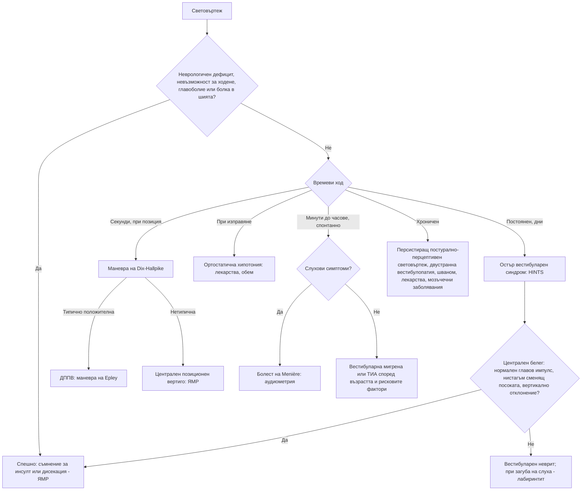

# Глава 41. Световъртеж

> **Част IX. Нервна система**

## Цели на главата

- Да се класифицира „световъртежът“ според **времевия ход и провокиращите фактори** (остър продължителен, епизодичен провокиран, епизодичен спонтанен, хроничен), а не само според описанието.
- Да се разграничават периферните от централните (включително инсулт) причини за остър вестибуларен синдром чрез изследването HINTS.
- Да се диагностицира доброкачественият пароксизмален позиционен вертиго (ДППВ) с маневрата на Dix-Hallpike.
- Да се познават вестибуларният неврит, болестта на Menière и вестибуларната мигрена.
- Да се разпознават пресинкопът и нарушенията на равновесието като отделни категории.

## Ключови моменти

- Световъртежът се класифицира по времевия ход и провокиращите фактори, а не само по описанието *(SORT C [1, 2])*.
- При остър вестибуларен синдром един централен белег при HINTS (нормален главов импулс, нистагъм, сменящ посоката, или вертикално отклонение) насочва към инсулт *(SORT B [3])*.
- Нормалният ранен ЯМР не изключва инсулт в задната циркулация, особено в първите 48 часа *(SORT B [3, 4])*.
- ДППВ се диагностицира с маневрата на Dix-Hallpike и се лекува с репозициониращи маневри, а не с лекарства *(SORT A [6])*.
- Вестибуларната мигрена е най-честата причина за спонтанни епизоди на световъртеж, дори без главоболие по време на пристъпа *(SORT C [8])*.
- Внезапната едностранна сензоневрална загуба на слуха е спешно състояние *(SORT C [10])*.

---

## 1. Какво означава „световъртеж“?

Пациентите използват думата за различни усещания:

| Усещане | Описание | Основни причини |
|---|---|---|
| **Вертиго** | Илюзия за движение: въртене, люлеене, накланяне | Вестибуларни нарушения (периферни или централни) |
| **Пресинкоп** | Прималяване, „ще падна в несвяст“, притъмняване | Ортостатична хипотония, аритмии, вазовагални реакции, анемия, хипогликемия (вж. глава 11) |
| **Нарушение на равновесието** | Нестабилност при стоене и ходене, без световъртеж в главата | Полиневропатия, болест на Parkinson, мозъчечни заболявания, нормотензивна хидроцефалия, миелопатия, зрителни нарушения, множествен сетивен дефицит при възрастни хора |
| **Неспецифичен световъртеж** | „Замаяност“, „мъгла в главата“ | Тревожност, депресия, лекарства, хипервентилация, персистиращ постурално-перцептивен световъртеж |

Описанието обаче е **ненадеждно**. Съвременният подход (Newman-Toker) се основава на **времевия ход** и **провокиращите фактори** [1].

---

## 2. Класификация по времеви ход и провокиращи фактори

| Синдром [2] | Характеристика | Причини |
|---|---|---|
| **Остър вестибуларен синдром** | **Постоянен** световъртеж с продължителност дни, гадене, повръщане, нистагъм, нестабилна походка | **Вестибуларен неврит** и лабиринтит; **инсулт в задната циркулация** (мозъчен ствол, малък мозък); множествена склероза |
| **Провокиран епизоден вестибуларен синдром** | Кратки епизоди, **провокирани** от движение на главата или промяна в положението | **ДППВ** (секунди, под 1 минута); **ортостатична хипотония** (при изправяне); рядко централен позиционен вертиго (тумор на задната черепна ямка) |
| **Спонтанен епизоден вестибуларен синдром** | Епизоди от минути до часове **без провокация** | **Вестибуларна мигрена**; **болест на Menière**; **ТИА във вертебробазиларния басейн**; паническа атака; аритмия; хипогликемия |
| **Хроничен вестибуларен синдром** | Месеци | **Персистиращ постурално-перцептивен световъртеж** (PPPD); двустранна вестибулопатия (**гентамицин**); мозъчечна дегенерация; тумори на задната черепна ямка, **вестибуларен шваном**; лекарства; тревожност; множествена склероза |

---

## 3. Безопасна диагностична стратегия

| Въпрос | Отговор |
|---|---|
| **Вероятна диагноза** | ДППВ, вестибуларен неврит, вестибуларна мигрена, ортостатична хипотония (лекарства), тревожност |
| **Сериозни заболявания, които не бива да се пропускат** | **Инсулт или ТИА в задната циркулация** (особено в малкия мозък); **кръвоизлив в малкия мозък**; **дисекация на вертебралната артерия**; аритмия; тумор на задната черепна ямка; множествена склероза; **отравяне с въглероден оксид**; хипогликемия |
| **Чести капани** | Инсулт в малкия мозък с изолиран вертиго, диагностициран като „вестибуларен неврит“; вестибуларна мигрена, пропусната поради липса на главоболие по време на пристъпите; лекарства (антихипертензивни, антиепилептични, седативни, аминогликозиди); ДППВ след травма на главата; вестибуларен шваном с едностранна загуба на слуха |
| **Маскиращи заболявания** | Лекарства, анемия, захарен диабет (невропатия, хипогликемия), депресия и тревожност, шийна спондилоза |
| **Психосоциални аспекти** | Тревожност, паническо разстройство, персистиращ постурално-перцептивен световъртеж, страх от падане |

---

## 4. Анамнеза

- **Времеви ход:** продължителност на отделния епизод (секунди, минути, часове, дни), постоянен или епизоден.
- **Провокиращи фактори:** обръщане в леглото, поглеждане нагоре, изправяне, силни звуци, натиск (кашлица, напъване), без провокация.
- **Придружаващи симптоми:**
  - **слухови** — загуба на слуха, шум в ухото, усещане за запушване на ухото (болест на Menière, лабиринтит, вестибуларен шваном, инсулт в басейна на предната долна мозъчечна артерия);
  - **неврологични** — **двойно виждане, дизартрия, дисфагия, изтръпване, слабост, атаксия**, синдром на Horner („петте Д“ на задната циркулация: *dizziness, diplopia, dysarthria, dysphagia, dystaxia*);
  - **главоболие и болка в шията** (дисекация на вертебралната артерия, мигрена);
  - сърцебиене, прималяване (сърдечна причина).
- **Анамнеза за мигрена**, скорошна вирусна инфекция, травма на главата.
- **Лекарства:** антихипертензивни средства, диуретици, антиепилептични (фенитоин, карбамазепин), седативни, аминогликозиди, литий, алкохол.
- **Съдови рискови фактори.**

---

## 5. Физикален преглед

### 5.1. Общ и неврологичен преглед

- АН в легнало и изправено положение, пулс.
- **Походка**: може ли пациентът да ходи без помощ? **Невъзможността да стои или да ходи без чужда помощ** насочва към централна причина.
- Черепномозъчни нерви, диплопия, дизартрия, координация (пръст-нос, колянно-петен тест), тест на Romberg, сетивност.
- Отоскопия, ориентировъчна оценка на слуха (тест с шепот, тестове на Weber и Rinne).

### 5.2. Нистагъм

| Белег | Периферен | Централен |
|---|---|---|
| Посока | **Хоризонтален** (с торзионен компонент), **еднопосочен** — бързата фаза е към здравата страна | **Сменя посоката** при поглед настрани, **чисто вертикален** или **чисто торзионен** |
| Фиксация на погледа | **Потиска** нистагъма | Не го потиска |
| Интензивност | Засилва се при поглед по посока на бързата фаза | Различна |

### 5.3. Изследване HINTS

Прилага се **само при остър вестибуларен синдром**: постоянен световъртеж с продължителност часове до дни и **наличен спонтанен нистагъм**.

| Компонент | Периферна причина (вестибуларен неврит) | **Централна причина (инсулт)** |
|---|---|---|
| **H**ead **I**mpulse — тест на главовия импулс | **Патологичен** — коригираща сакада при бързо завъртане на главата към засегнатата страна | **Нормален** (тревожен белег) |
| **N**ystagmus — нистагъм | Еднопосочен хоризонтален | **Сменя посоката** при поглед настрани |
| **T**est of **S**kew — тест за вертикално отклонение при покриване на окото | Липсва | **Вертикално отклонение** при покриване и откриване на окото |

**Един-единствен централен белег** (нормален главов импулс, нистагъм, сменящ посоката, или вертикално отклонение) насочва към **инсулт**. **„HINTS plus“** добавя новата загуба на слуха, която насочва към инсулт в басейна на предната долна мозъчечна артерия.

Изпълнено от обучен изследващ при пациенти с висок риск, изследването HINTS има чувствителност 100% и специфичност 96% за инсулт и е по-чувствително от ранния ЯМР [3]. Дифузионно-претегленият ЯМР може да бъде фалшиво отрицателен в първите 48 часа, особено при малки инсулти [3, 4]. При по-малко опитни изследващи точността на HINTS е по-ниска [5].

### 5.4. Маневра на Dix-Hallpike

Прилага се при **провокиран епизоден** вертиго [6]. Пациентът седи с глава, завъртяна на 45° към изследваната страна. Бързо се сваля в легнало положение с глава, отпусната 20–30° под нивото на кушетката.

**Положителен тест за ДППВ на задния полукръгъл канал:**

- **латентен период** от няколко секунди;
- **торзионен нистагъм с вертикален компонент нагоре**, насочен към долното ухо;
- продължителност **под 1 минута**;
- **изтощаване** при повторение;
- обратна посока при изправяне.

За ДППВ на хоризонталния канал се използва **тестът със завъртане в легнало положение** (supine roll test).

**Нетипични белези** (без латентен период, без изтощаване, чисто вертикален нистагъм надолу, неврологични симптоми) насочват към **централен позиционен вертиго**.

---

## 6. Основни заболявания

| Заболяване | Време | Провокация | Слух | Ключови белези |
|---|---|---|---|---|
| **ДППВ** | Секунди (< 1 min) | Обръщане в леглото, поглед нагоре, навеждане | Нормален | Положителна маневра на Dix-Hallpike; лечение с репозициониращи маневри (на Epley). Често след травма на главата или продължително лежане |
| **Вестибуларен неврит** | Постоянен, дни | Засилва се при движение | **Нормален** | Често след вирусна инфекция; периферен нистагъм; патологичен главов импулс |
| **Лабиринтит** | Постоянен, дни | Засилва се при движение | **Намален** | Като неврита, но със загуба на слуха; при бактериален отит — спешно |
| **Болест на Menière** [7] | 20 min до 12 h | Спонтанно | **Флуктуираща нискочестотна сензоневрална загуба** | Шум в ухото, пълнота в ухото, прогресираща загуба на слуха |
| **Вестибуларна мигрена** [8] | 5 min до 72 h | Спонтанно, типичните провокатори на мигрената | Обикновено нормален | Анамнеза за мигрена; мигренозни белези в поне половината от епизодите; **най-честата причина за спонтанен епизоден световъртеж** |
| **Инсулт или ТИА в задната циркулация** | Минути (ТИА) или постоянен | Спонтанно | Понякога загуба на слуха | Съдови рискови фактори, централни белези при HINTS, неврологичен дефицит, тежка атаксия |
| **Вестибуларен шваном** (акустичен неврином) | Хроничен | — | **Прогресираща едностранна сензоневрална загуба** | Шум в едното ухо; нарушение на равновесието, а не изразен вертиго. ЯМР на вътрешните слухови проходи |
| **Синдром на Ramsay Hunt** | Остро | — | Намален | **Периферна пареза на лицевия нерв**, везикули в ухото, силна болка |
| **Дехисценция на горния полукръгъл канал** | Епизоди | **Силни звуци** (феномен на Tullio), натиск | Кондуктивна хиперакузия, чуване на собствените движения на очите | КТ на темпоралната кост |
| **Двустранна вестибулопатия** | Хронична | Движение | Различен | **Осцилопсия** (подскачане на образа при ходене), нестабилност на тъмно; **аминогликозиди** |
| **Персистиращ постурално-перцептивен световъртеж** [9] | Хроничен (> 3 месеца) | Изправено положение, движение, сложни зрителни стимули (магазини) | Нормален | Често след остро вестибуларно събитие; свързан с тревожност |

---

## 7. Червени флагове

- **Невъзможност за стоене или ходене** без помощ.
- Нови неврологични симптоми и белези: **диплопия, дизартрия, дисфагия**, слабост, изтръпване, атаксия на крайниците, синдром на Horner.
- **Централни белези при HINTS**.
- **Ново главоболие**, особено в тила, или **болка в шията** (дисекация).
- **Внезапна загуба на слуха** (инсулт в басейна на предната долна мозъчечна артерия; внезапната сензоневрална загуба на слуха сама по себе си е спешно състояние) [10].
- Възрастен пациент със **съдови рискови фактори** и остър постоянен световъртеж.
- Сърцебиене, болка в гърдите или синкоп.
- Антикоагулантна терапия (кръвоизлив в малкия мозък).

---

## 8. Изследвания

- **Клиничният преглед е основният инструмент.**
- При остър вестибуларен синдром с централни белези или със съмнение за инсулт: **спешна ЯМР с дифузионно-претеглени образи** (КТ има ниска чувствителност за исхемия в задната черепна ямка), КТ или ЯМР ангиография.
- Аудиометрия при слухови симптоми.
- ЯМР на вътрешните слухови проходи при едностранна сензоневрална загуба на слуха или шум в едното ухо.
- ЕКГ, ПКК, глюкоза при пресинкоп.
- Карбоксихемоглобин при съответна експозиция.

---

## 9. Диагностичен алгоритъм

---

## 10. Кога и колко спешно да насочим

| Спешност | Клинична ситуация |
|---|---|
| **Незабавно (112 или спешно отделение)** | Остър постоянен световъртеж с централни белези при HINTS, невъзможност за стоене или ходене или нов неврологичен дефицит [3]; световъртеж с внезапно главоболие или болка в шията; световъртеж със синкоп, болка в гърдите или сърцебиене; световъртеж с главоболие или повръщане при антикоагулантна терапия |
| **В същия ден** | Преходни епизоди на световъртеж с други симптоми от задната циркулация (подозрение за ТИА) — оценка до 24 часа [11]; внезапна сензоневрална загуба на слуха [10]; лабиринтит при остър бактериален отит; синдром на Ramsay Hunt |
| **Бързо (до 2 седмици)** | Нетипичен позиционен нистагъм — подозрение за централен позиционен вертиго (ЯМР) |
| **Планово** | Едностранна загуба на слуха или шум в едното ухо — аудиометрия и ЯМР на вътрешните слухови проходи; подозрение за болест на Menière [7]; ДППВ, неповлиян от маневрите [6]; хроничен световъртеж с неясна причина; персистиращ постурално-перцептивен световъртеж — вестибуларна рехабилитация [9] |
| **Проследяване в общата практика** | Типичен ДППВ — маневра на Epley и повторна оценка [6]; вестибуларна мигрена [8]; ортостатична хипотония от лекарства — преглед на лечението; вестибуларен неврит с периферна картина при HINTS — кратко симптоматично лечение и ранно раздвижване |

---

## 11. Клинични перли

- Питайте не само „какво усещате“, а и „колко продължава“ и „какво го провокира“.
- Възрастен човек с остър постоянен световъртеж, който не може да ходи, има инсулт в малкия мозък, докато не се докаже противното.
- Нормалният тест на главовия импулс при остър вестибуларен синдром е тревожен белег, а не успокояващ.
- Нормалната КТ не изключва инсулт в задната черепна ямка. Нормалният ранен ЯМР също не го изключва.
- Световъртеж за секунди при обръщане в леглото: ДППВ. Маневрата на Epley е по-ефективна от всяко лекарство.
- Вестибуларните супресанти (антихистамини, бензодиазепини) не бива да се използват продължително. Те забавят централната компенсация и не се препоръчват рутинно при ДППВ [6].
- Световъртеж с главоболие и болка в шията след манипулация или травма: дисекация на вертебралната артерия.
- Повтарящи се епизоди на световъртеж при човек с мигрена: вестибуларна мигрена, дори без главоболие по време на пристъпа.

---

## 12. Клиничен случай

**Етап 1 — представяне.** Мъж на 67 години с диабет, хипертония и тютюнопушене се събужда с тежък постоянен световъртеж, гадене и повръщане. Не може да стои прав без помощ. Няма главоболие и загуба на слуха. Съпругата му смята, че „има вирус в ухото“.

> **Въпрос 1.** Какъв е вестибуларният синдром и кой е ключовият въпрос?

**Етап 2 — преглед.** Говорът е нормален и няма пареза. Нистагъмът е хоризонтален: наляво при поглед наляво и надясно при поглед надясно. Тестът на главовия импулс е нормален в двете посоки. Тестът за вертикално отклонение показва малко вертикално отклонение.

> **Въпрос 2.** Периферна или централна е причината?

> **Въпрос 3.** Какво е поведението?

Обсъждане и отговори

**Отговор 1.** Това е **остър вестибуларен синдром**. Ключовият въпрос е дали причината е периферна (вестибуларен неврит) или централна (инсулт). Невъзможността за самостоятелно стоене е червен флаг.

**Отговор 2.** Изследването HINTS показва **три централни белега**: нормален главов импулс, нистагъм, който сменя посоката, и вертикално отклонение. Заедно със съдовите рискови фактори те насочват към **инсулт в малкия мозък или мозъчния ствол**, въпреки липсата на „класически“ неврологичен дефицит [3].

**Отговор 3.** Пациентът се насочва спешно към болница с инсултно отделение. ЯМР с дифузионно-претеглени образи потвърждава инфаркт в територията на задната долна мозъчечна артерия. Ранният ЯМР може да е фалшиво отрицателен, затова клиничните централни белези са достатъчни за насочване [4]. Инфарктите в малкия мозък могат да доведат до оток и компресия на мозъчния ствол и изискват наблюдение в специализирано звено.

**Поука.** Изолираният световъртеж може да бъде единственият симптом на инсулт. Изследването HINTS е прост и ценен инструмент в ръцете на обучен лекар.

---

## Обобщение

- Световъртежът се оценява по времевия ход и провокиращите фактори: остър постоянен, провокиран епизоден, спонтанен епизоден и хроничен.
- При остър вестибуларен синдром изследването HINTS разграничава вестибуларния неврит от инсулта. Нормалният ранен ЯМР не изключва инсулт.
- ДППВ се диагностицира с маневрата на Dix-Hallpike и се лекува с маневрата на Epley. Вестибуларната мигрена и болестта на Menière са основните причини за спонтанни епизоди.
- Невъзможността за ходене, неврологичните симптоми, внезапната загуба на слуха и главоболието с болка в шията са червени флагове.

## Самопроверка

### Въпроси с един верен отговор

**1.** *(основно ниво)* Жена на 58 години от 2 седмици има световъртеж за 20–30 секунди при обръщане в леглото и при поглед нагоре. Слухът и неврологичният преглед са нормални. Кое е най-подходящото следващо действие?

- **А.** ЯМР на главата
- **Б.** Маневра на Dix-Hallpike и при положителен тест — маневра на Epley
- **В.** Продължително лечение с бетахистин
- **Г.** Аудиометрия
- **Д.** КТ на главата

Отговор и обосновка

**Верен отговор: Б.** Картината е типична за ДППВ. Диагнозата се поставя с маневрата на Dix-Hallpike, а лечението е с репозициониращи маневри [6]. Образни изследвания не са нужни при типична находка.

**2.** *(основно ниво)* Мъж на 40 години от вчера има постоянен силен световъртеж, гадене и повръщане след прекарана настинка. Слухът е нормален. Нистагъмът е хоризонтален, еднопосочен наляво и се потиска при фиксация на погледа. Тестът на главовия импулс надясно показва коригираща сакада. Няма вертикално отклонение и може да ходи с опора. Коя е най-вероятната диагноза?

- **А.** Инсулт в малкия мозък
- **Б.** Вестибуларен неврит вдясно
- **В.** ДППВ
- **Г.** Болест на Menière
- **Д.** Вестибуларна мигрена

Отговор и обосновка

**Верен отговор: Б.** Патологичният главов импулс, еднопосочният нистагъм и липсата на вертикално отклонение са периферни белези при HINTS [3]. Нормалният слух отличава неврита от лабиринтита.

**3.** *(основно ниво)* Кое твърдение за теста на главовия импулс при остър вестибуларен синдром е вярно?

- **А.** Нормалният тест изключва инсулт
- **Б.** Нормалният тест насочва към централна причина
- **В.** Патологичният тест потвърждава инсулт
- **Г.** Тестът се прави само при ДППВ
- **Д.** Тестът е информативен само при наличие на главоболие

Отговор и обосновка

**Верен отговор: Б.** При остър вестибуларен синдром нормалният главов импулс е тревожен белег. Той насочва към централна причина [3].

**4.** *(напреднало ниво)* Жена на 45 години има повтарящи се пристъпи на световъртеж, които траят 2–4 часа. По време на пристъпите има шум и чувство за пълнота в лявото ухо. Аудиометрията показва нискочестотна сензоневрална загуба на слуха вляво. Коя е диагнозата?

- **А.** Вестибуларна мигрена
- **Б.** Болест на Menière
- **В.** ДППВ
- **Г.** Вестибуларен неврит
- **Д.** Персистиращ постурално-перцептивен световъртеж

Отговор и обосновка

**Верен отговор: Б.** Епизодите от 20 минути до 12 часа със слухови симптоми и документирана нискочестотна сензоневрална загуба на слуха в същото ухо отговарят на критериите за болест на Menière [7].

**5.** *(напреднало ниво)* Мъж на 70 години с предсърдно мъждене приема апиксабан. Внезапно получава световъртеж, повръщане и тилно главоболие и не може да ходи. Нистагъмът сменя посоката. КТ на главата след 2 часа не показва кръвоизлив. Кое е правилното поведение?

- **А.** Изписване с диагноза вестибуларен неврит
- **Б.** Нормалната КТ изключва инсулт — симптоматично лечение
- **В.** Спешен ЯМР с дифузионно-претеглени образи и наблюдение в инсултно звено
- **Г.** Маневра на Epley
- **Д.** Бетахистин и контрол след седмица

Отговор и обосновка

**Верен отговор: В.** Нистагъмът, сменящ посоката, невъзможността за ходене и главоболието са централни белези. КТ има ниска чувствителност за исхемия в задната черепна ямка, а ранният ЯМР също може да е фалшиво отрицателен [3, 4].

### Задача

Жена на 35 години с мигрена от юношеството има от година епизоди на световъртеж от 1 до 6 часа. Понякога те протичат без главоболие, но с фотофобия. Между епизодите прегледът е нормален, а слухът не е засегнат. Как ще подходите?

Решение

Най-вероятната диагноза е **вестибуларна мигрена**. Критериите изискват поне 5 епизода с продължителност от 5 минути до 72 часа, анамнеза за мигрена и мигренозни белези в поне половината от епизодите [8]. Главоболието не е задължително по време на всеки пристъп. При нормален неврологичен преглед и слух не са нужни образни изследвания. Препоръчват се дневник на пристъпите, избягване на провокиращите фактори и при чести пристъпи — профилактика като при мигрена. Нетипичните белези (загуба на слуха, неврологични симптоми) налагат преоценка.

### OSCE станция: Маневра на Dix-Hallpike

**Време:** 6 минути. **Ниво:** основно (студенти, специализанти).

**Задача за кандидата.** Жена на 62 години има кратки епизоди на световъртеж при лягане и обръщане в леглото. Направете маневрата на Dix-Hallpike и обяснете резултата.

**Информация за симулирания пациент (за изпитващия).** Няма проблеми с шията. При изследване вдясно се появява торзионен нистагъм нагоре към долното ухо след латентен период от 3 секунди, който трае 20 секунди.

**Рубрика за оценяване**

| Критерий | Точки |
|---|---|
| Обяснява процедурата, получава съгласие и пита за проблеми с шията и гърба | 1 |
| Позиционира пациентката седнала, с глава, завъртяна на 45° към изследваната страна | 2 |
| Бързо я сваля в легнало положение с глава 20–30° под нивото на кушетката и наблюдава очите поне 30 секунди | 2 |
| Описва типичния нистагъм: латентен период, торзионен нагоре към долното ухо, под 1 минута, изтощаване | 2 |
| Посочва нетипичните белези, които насочват към централна причина | 1 |
| Обяснява резултата и предлага маневра на Epley | 1 |
| Осигурява безопасност: придържа главата и предупреждава за гадене | 1 |
| **Общо** | **10** |

**Праг за успешно представяне:** 7 от 10 точки, включително позиционирането и описанието на нистагъма.

## Литература

1. Newman-Toker DE, Edlow JA. TiTrATE: A Novel, Evidence-Based Approach to Diagnosing Acute Dizziness and Vertigo. Neurol Clin. 2015;33(3):577-99, viii. doi:10.1016/j.ncl.2015.04.011. PMID: 26231273.
2. Bisdorff AR, Staab JP, Newman-Toker DE. Overview of the International Classification of Vestibular Disorders. Neurol Clin. 2015;33(3):541-50, vii. doi:10.1016/j.ncl.2015.04.010. PMID: 26231270.
3. Kattah JC, Talkad AV, Wang DZ, Hsieh YH, Newman-Toker DE. HINTS to diagnose stroke in the acute vestibular syndrome: three-step bedside oculomotor examination more sensitive than early MRI diffusion-weighted imaging. Stroke. 2009;40(11):3504-10. doi:10.1161/STROKEAHA.109.551234. PMID: 19762709.
4. Saber Tehrani AS, Kattah JC, Mantokoudis G, Pula JH, Nair D, Blitz A, et al. Small strokes causing severe vertigo: frequency of false-negative MRIs and nonlacunar mechanisms. Neurology. 2014;83(2):169-73. doi:10.1212/WNL.0000000000000573. PMID: 24920847.
5. Ohle R, Montpellier RA, Marchadier V, Wharton A, McIsaac S, Anderson M, et al. Can Emergency Physicians Accurately Rule Out a Central Cause of Vertigo Using the HINTS Examination? A Systematic Review and Meta-analysis. Acad Emerg Med. 2020;27(9):887-896. doi:10.1111/acem.13960. PMID: 32167642.
6. Bhattacharyya N, Gubbels SP, Schwartz SR, Edlow JA, El-Kashlan H, Fife T, et al. Clinical Practice Guideline: Benign Paroxysmal Positional Vertigo (Update). Otolaryngol Head Neck Surg. 2017;156(3_suppl):S1-S47. doi:10.1177/0194599816689667. PMID: 28248609.
7. Lopez-Escamez JA, Carey J, Chung WH, Goebel JA, Magnusson M, Mandalà M, et al. Diagnostic criteria for Menière's disease. J Vestib Res. 2015;25(1):1-7. doi:10.3233/VES-150549. PMID: 25882471.
8. Lempert T, Olesen J, Furman J, Waterston J, Seemungal B, Carey J, et al. Vestibular migraine: Diagnostic criteria1. J Vestib Res. 2022;32(1):1-6. doi:10.3233/VES-201644. PMID: 34719447.
9. Staab JP, Eckhardt-Henn A, Horii A, Jacob R, Strupp M, Brandt T, et al. Diagnostic criteria for persistent postural-perceptual dizziness (PPPD): Consensus document of the committee for the Classification of Vestibular Disorders of the Bárány Society. J Vestib Res. 2017;27(4):191-208. doi:10.3233/VES-170622. PMID: 29036855.
10. Chandrasekhar SS, Tsai Do BS, Schwartz SR, Bontempo LJ, Faucett EA, Finestone SA, et al. Clinical Practice Guideline: Sudden Hearing Loss (Update). Otolaryngol Head Neck Surg. 2019;161(1_suppl):S1-S45. doi:10.1177/0194599819859885. PMID: 31369359.
11. National Institute for Health and Care Excellence. Stroke and transient ischaemic attack in over 16s: diagnosis and initial management (NICE guideline NG128). London: NICE; 2019 [актуализирано 2022]. Достъпно на: https://www.nice.org.uk/guidance/ng128

*Последна проверка на съдържанието: септември 2026 г. Следващ планиран преглед: септември 2027 г. (вж. „Политика за актуализация“ в README).*

<!-- навигация -->

---

[← Глава 40. Главоболие и лицева болка](40-glavobolie.md) · [Съдържание](../README.md) · [Глава 42. Епилептични пристъпи и неепилептични пароксизмални състояния →](42-pristapi.md)
