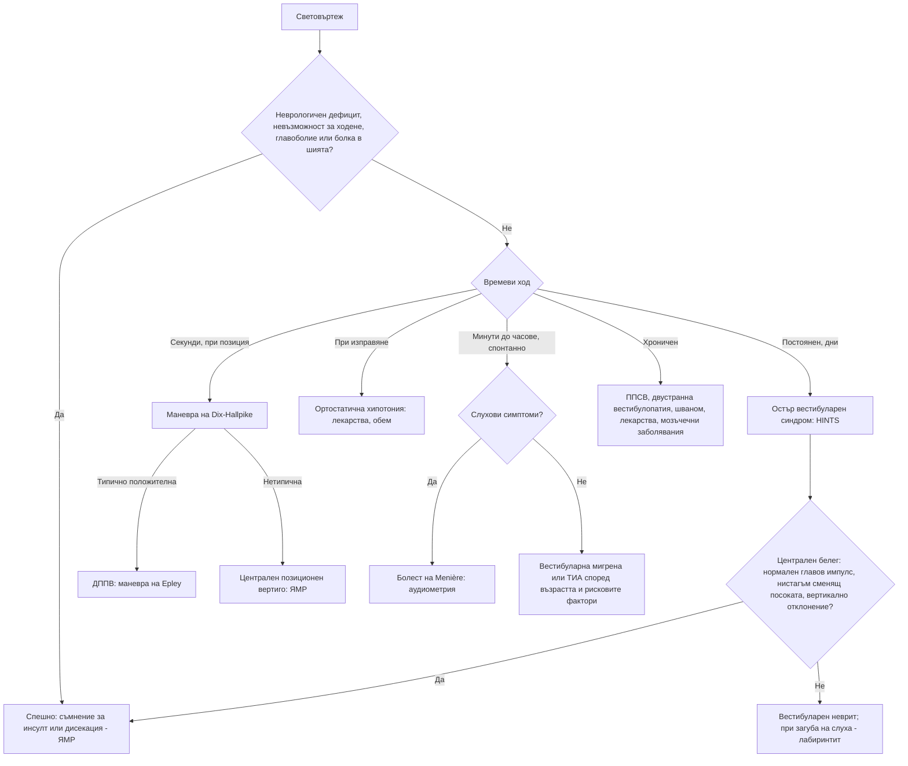

# Глава 41. Световъртеж

> **Част IX. Нервна система**

## Цели на главата

- Да се подхожда към „световъртежа“ според **времевия ход и провокиращите фактори**, а не само според описанието.
- Да се разграничават периферните от централните (включително инсулт) причини за остър вестибуларен синдром чрез изследването HINTS.
- Да се диагностицира доброкачественият пароксизмален позиционен вертиго (ДППВ) с маневрата на Dix-Hallpike.
- Да се познават вестибуларният неврит, болестта на Menière и вестибуларната мигрена.
- Да се разпознават пресинкопът и нарушенията на равновесието като отделни категории.

---

## 1. Какво означава „световъртеж“?

Пациентите използват думата за различни усещания:

| Усещане | Описание | Основни причини |
|---|---|---|
| **Вертиго** | Илюзия за движение: въртене, люлеене, накланяне | Вестибуларни нарушения (периферни или централни) |
| **Пресинкоп** | Прималяване, „ще падна в несвяст“, притъмняване | Ортостатична хипотония, аритмии, вазовагални реакции, анемия, хипогликемия (вж. глава 11) |
| **Нарушение на равновесието** | Нестабилност при стоене и ходене, без световъртеж в главата | Полиневропатия, болест на Parkinson, мозъчечни заболявания, нормотензивна хидроцефалия, миелопатия, зрителни нарушения, множествен сетивен дефицит при възрастни хора |
| **Неспецифичен световъртеж** | „Замаяност“, „мъгла в главата“ | Тревожност, депресия, лекарства, хипервентилация, персистиращ постурално-перцептивен световъртеж |

Описанието обаче е **ненадеждно**. Съвременният подход (Newman-Toker) се основава на **времевия ход** и **провокиращите фактори**.

---

## 2. Класификация по времеви ход и провокиращи фактори

| Синдром | Характеристика | Причини |
|---|---|---|
| **Остър вестибуларен синдром** | **Постоянен** световъртеж с продължителност дни, гадене, повръщане, нистагъм, нестабилна походка | **Вестибуларен неврит** и лабиринтит; **инсулт в задната циркулация** (мозъчен ствол, малък мозък); множествена склероза |
| **Провокиран епизоден вестибуларен синдром** | Кратки епизоди, **провокирани** от движение на главата или промяна в положението | **ДППВ** (секунди, под 1 минута); **ортостатична хипотония** (при изправяне); рядко централен позиционен вертиго (тумор на задната черепна ямка) |
| **Спонтанен епизоден вестибуларен синдром** | Епизоди от минути до часове **без провокация** | **Вестибуларна мигрена**; **болест на Menière**; **ТИА във вертебробазиларния басейн**; паническа атака; аритмия; хипогликемия |
| **Хроничен вестибуларен синдром** | Месеци | **Персистиращ постурално-перцептивен световъртеж**; двустранна вестибулопатия (**гентамицин**); мозъчечна дегенерация; тумори на задната черепна ямка, **вестибуларен шваном**; лекарства; тревожност; множествена склероза |

---

## 3. Безопасна диагностична стратегия

| Въпрос | Отговор |
|---|---|
| **Вероятна диагноза** | ДППВ, вестибуларен неврит, вестибуларна мигрена, ортостатична хипотония (лекарства), тревожност |
| **Сериозни заболявания, които не бива да се пропускат** | **Инсулт или ТИА в задната циркулация** (особено в малкия мозък); **кръвоизлив в малкия мозък**; **дисекация на вертебралната артерия**; аритмия; тумор на задната черепна ямка; множествена склероза; **отравяне с въглероден оксид**; хипогликемия |
| **Чести капани** | Инсулт в малкия мозък с изолиран вертиго, диагностициран като „вестибуларен неврит“; вестибуларна мигрена, пропусната поради липса на главоболие по време на пристъпите; лекарства (антихипертензивни, антиепилептични, седативни, аминогликозиди); ДППВ след травма на главата; вестибуларен шваном с едностранна загуба на слуха |
| **Маскиращи заболявания** | Лекарства, анемия, захарен диабет (невропатия, хипогликемия), депресия и тревожност, шийна спондилоза |
| **Психосоциални аспекти** | Тревожност, паническо разстройство, персистиращ постурално-перцептивен световъртеж, страх от падане |

---

## 4. Анамнеза

- **Времеви ход:** продължителност на отделния епизод (секунди, минути, часове, дни), постоянен или епизоден.
- **Провокиращи фактори:** обръщане в леглото, поглеждане нагоре, изправяне, силни звуци, натиск (кашлица, напъване), без провокация.
- **Придружаващи симптоми:**
  - **слухови** — загуба на слуха, шум в ухото, усещане за запушване на ухото (болест на Menière, лабиринтит, вестибуларен шваном, инсулт в басейна на предната долна мозъчечна артерия);
  - **неврологични** — **двойно виждане, дизартрия, дисфагия, изтръпване, слабост, атаксия**, синдром на Horner („петте Д“ на задната циркулация: *dizziness, diplopia, dysarthria, dysphagia, dystaxia*);
  - **главоболие и болка в шията** (дисекация на вертебралната артерия, мигрена);
  - сърцебиене, прималяване (сърдечна причина).
- **Анамнеза за мигрена**, скорошна вирусна инфекция, травма на главата.
- **Лекарства:** антихипертензивни средства, диуретици, антиепилептични (фенитоин, карбамазепин), седативни, аминогликозиди, литий, алкохол.
- **Съдови рискови фактори.**

---

## 5. Физикален преглед

### 5.1. Общ и неврологичен преглед

- АН в легнало и изправено положение, пулс.
- **Походка**: може ли пациентът да ходи без помощ? **Невъзможността да стои или да ходи без чужда помощ** насочва към централна причина.
- Черепномозъчни нерви, диплопия, дизартрия, координация (пръст-нос, колянно-петен тест), тест на Romberg, сетивност.
- Отоскопия, ориентировъчна оценка на слуха (тест с шепот, тестове на Weber и Rinne).

### 5.2. Нистагъм

| Белег | Периферен | Централен |
|---|---|---|
| Посока | **Хоризонтален** (с торзионен компонент), **еднопосочен** — бързата фаза е към здравата страна | **Сменя посоката** при поглед настрани, **чисто вертикален** или **чисто торзионен** |
| Фиксация на погледа | **Потиска** нистагъма | Не го потиска |
| Интензивност | Засилва се при поглед по посока на бързата фаза | Различна |

### 5.3. Изследване HINTS

Прилага се **само при остър вестибуларен синдром**: постоянен световъртеж с продължителност часове до дни и **наличен спонтанен нистагъм**.

| Компонент | Периферна причина (вестибуларен неврит) | **Централна причина (инсулт)** |
|---|---|---|
| **H**ead **I**mpulse — тест на главовия импулс | **Патологичен** — коригираща сакада при бързо завъртане на главата към засегнатата страна | **Нормален** (тревожен белег) |
| **N**ystagmus — нистагъм | Еднопосочен хоризонтален | **Сменя посоката** при поглед настрани |
| **T**est of **S**kew — тест за вертикално отклонение при покриване на окото | Липсва | **Вертикално отклонение** при покриване и откриване на окото |

**Един-единствен централен белег** (нормален главов импулс, нистагъм, сменящ посоката, или вертикално отклонение) насочва към **инсулт**. **„HINTS plus“** добавя новата загуба на слуха, която насочва към инсулт в басейна на предната долна мозъчечна артерия.

Изпълнено от обучен изследващ, изследването HINTS е по-чувствително за инсулт от ранния ЯМР. Дифузионно-претегленият ЯМР може да бъде фалшиво отрицателен в първите 24–48 часа.

### 5.4. Маневра на Dix-Hallpike

Прилага се при **провокиран епизоден** вертиго. Пациентът седи с глава, завъртяна на 45° към изследваната страна. Бързо се сваля в легнало положение с глава, отпусната 20–30° под нивото на кушетката.

**Положителен тест за ДППВ на задния полукръгъл канал:**

- **латентен период** от няколко секунди;
- **торзионен нистагъм с вертикален компонент нагоре**, насочен към долното ухо;
- продължителност **под 1 минута**;
- **изтощаване** при повторение;
- обратна посока при изправяне.

За ДППВ на хоризонталния канал се използва **тестът със завъртане в легнало положение** (supine roll test).

**Нетипични белези** (без латентен период, без изтощаване, чисто вертикален нистагъм надолу, неврологични симптоми) насочват към **централен позиционен вертиго**.

---

## 6. Основни заболявания

| Заболяване | Време | Провокация | Слух | Ключови белези |
|---|---|---|---|---|
| **ДППВ** | Секунди (< 1 min) | Обръщане в леглото, поглед нагоре, навеждане | Нормален | Положителна маневра на Dix-Hallpike; лечение с репозициониращи маневри (на Epley). Често след травма на главата или продължително лежане |
| **Вестибуларен неврит** | Постоянен, дни | Засилва се при движение | **Нормален** | Често след вирусна инфекция; периферен нистагъм; патологичен главов импулс |
| **Лабиринтит** | Постоянен, дни | Засилва се при движение | **Намален** | Като неврита, но със загуба на слуха; при бактериален отит — спешно |
| **Болест на Menière** | 20 min до 12 h | Спонтанно | **Флуктуираща нискочестотна сензоневрална загуба** | Шум в ухото, пълнота в ухото, прогресираща загуба на слуха |
| **Вестибуларна мигрена** | 5 min до 72 h | Спонтанно, типичните провокатори на мигрената | Обикновено нормален | Анамнеза за мигрена; мигренозни белези в поне половината от епизодите; **най-честата причина за спонтанен епизоден световъртеж** |
| **Инсулт или ТИА в задната циркулация** | Минути (ТИА) или постоянен | Спонтанно | Понякога загуба на слуха | Съдови рискови фактори, централни белези при HINTS, неврологичен дефицит, тежка атаксия |
| **Вестибуларен шваном** (акустичен неврином) | Хроничен | — | **Прогресираща едностранна сензоневрална загуба** | Шум в едното ухо; нарушение на равновесието, а не изразен вертиго. ЯМР на вътрешните слухови проходи |
| **Синдром на Ramsay Hunt** | Остро | — | Намален | **Периферна пареза на лицевия нерв**, везикули в ухото, силна болка |
| **Дехисценция на горния полукръгъл канал** | Епизоди | **Силни звуци** (феномен на Tullio), натиск | Кондуктивна хиперакузия, чуване на собствените движения на очите | КТ на темпоралната кост |
| **Двустранна вестибулопатия** | Хронична | Движение | Различен | **Осцилопсия** (подскачане на образа при ходене), нестабилност на тъмно; **аминогликозиди** |
| **Персистиращ постурално-перцептивен световъртеж** | Хроничен (> 3 месеца) | Изправено положение, движение, сложни зрителни стимули (магазини) | Нормален | Често след остро вестибуларно събитие; свързан с тревожност |

---

## 7. Червени флагове

- **Невъзможност за стоене или ходене** без помощ.
- Нови неврологични симптоми и белези: **диплопия, дизартрия, дисфагия**, слабост, изтръпване, атаксия на крайниците, синдром на Horner.
- **Централни белези при HINTS**.
- **Ново главоболие**, особено в тила, или **болка в шията** (дисекация).
- **Внезапна загуба на слуха** (инсулт в басейна на предната долна мозъчечна артерия; внезапната сензоневрална загуба на слуха сама по себе си е спешно състояние).
- Възрастен пациент със **съдови рискови фактори** и остър постоянен световъртеж.
- Сърцебиене, болка в гърдите или синкоп.
- Антикоагулантна терапия (кръвоизлив в малкия мозък).

---

## 8. Изследвания

- **Клиничният преглед е основният инструмент.**
- При остър вестибуларен синдром с централни белези или със съмнение за инсулт: **спешна ЯМР с дифузионно-претеглени образи** (КТ има ниска чувствителност за исхемия в задната черепна ямка), КТ или МР ангиография.
- Аудиометрия при слухови симптоми.
- ЯМР на вътрешните слухови проходи при едностранна сензоневрална загуба на слуха или шум в едното ухо.
- ЕКГ, ПКК, глюкоза при пресинкоп.
- Карбоксихемоглобин при съответна експозиция.

---

## 9. Диагностичен алгоритъм

---

## 10. Клинични перли

- Питайте не само „какво усещате“, а и „колко продължава“ и „какво го провокира“.
- Възрастен човек с остър постоянен световъртеж, който не може да ходи, има инсулт в малкия мозък, докато не се докаже противното.
- Нормалният тест на главовия импулс при остър вестибуларен синдром е тревожен белег, а не успокояващ.
- Нормалната КТ не изключва инсулт в задната черепна ямка. Нормалният ранен ЯМР също не го изключва.
- Световъртеж за секунди при обръщане в леглото: ДППВ. Маневрата на Epley е по-ефективна от всяко лекарство.
- Вестибуларните супресанти (бетахистин, антихистамини, бензодиазепини) не бива да се използват продължително. Те забавят централната компенсация.
- Световъртеж с главоболие и болка в шията след манипулация или травма: дисекация на вертебралната артерия.
- Повтарящи се епизоди на световъртеж при човек с мигрена: вестибуларна мигрена, дори без главоболие по време на пристъпа.

---

## 11. Клиничен случай

**Случай.** Мъж на 67 години с диабет, хипертония и тютюнопушене се събужда с тежък постоянен световъртеж, гадене и повръщане. Не може да стои прав без помощ. Няма главоболие и загуба на слуха. Съпругата му смята, че „има вирус в ухото“. При прегледа: говорът е нормален, няма пареза, има хоризонтален нистагъм наляво при поглед наляво и надясно при поглед надясно. Тестът на главовия импулс е нормален в двете посоки. Тестът за вертикално отклонение показва малко вертикално отклонение.

**Въпроси.** 1) Периферна или централна е причината? 2) Какво е поведението?

**Обсъждане.** Изследването HINTS показва **три централни белега**: нормален главов импулс, нистагъм, който сменя посоката, и вертикално отклонение. Заедно с невъзможността за самостоятелно стоене и съдовите рискови фактори те насочват към **инсулт в малкия мозък**, въпреки липсата на „класически“ неврологичен дефицит. Пациентът се насочва спешно към болница с инсултно отделение. ЯМР с дифузионно-претеглени образи потвърждава инфаркт в територията на задната долна мозъчечна артерия. Инфарктите в малкия мозък могат да доведат до оток и компресия на мозъчния ствол. Необходимо е наблюдение в специализирано звено.

**Поука.** Изолираният световъртеж може да бъде единственият симптом на инсулт. Изследването HINTS е прост и ценен инструмент в ръцете на обучен лекар.

<!-- навигация -->

---

[← Глава 40. Главоболие и лицева болка](40-glavobolie.md) · [Съдържание](../README.md) · [Глава 42. Епилептични пристъпи и неепилептични пароксизмални състояния →](42-pristapi.md)
