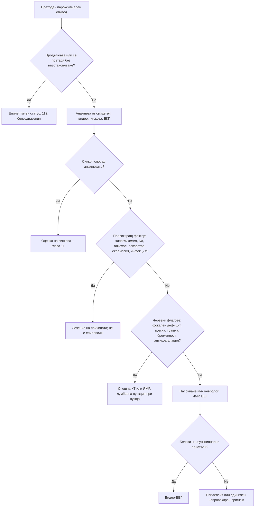

# Глава 42. Епилептични пристъпи и неепилептични пароксизмални състояния

> **Част IX. Нервна система**

## Цели на главата

- Да се разграничават провокираните (остро симптоматичните) от непровокираните пристъпи.
- Да се класифицират пристъпите по ILAE (актуализация от 2025 г.).
- Да се разпознават състоянията, които имитират епилепсия: синкоп, функционални пристъпи, преходна глобална амнезия, парасомнии, катаплексия.
- Да се извършва правилна първоначална оценка на първия пристъп.
- Да се разпознават епилептичният статус и неконвулсивният епилептичен статус.

## Ключови моменти

- Провокираният пристъп не означава епилепсия. Първо се търсят хипогликемия, електролитни нарушения, алкохол и лекарства *(SORT C [2])*.
- Епилепсия се диагностицира след два непровокирани пристъпа или след един при висок риск от рецидив *(SORT C [1])*.
- Всеки пациент с първи пристъп има нужда от ЕКГ и капилярна глюкоза. Конвулсивният синкоп е чест имитатор *(SORT B [4, 7])*.
- Страничното ухапване на езика е много специфично за епилептичен пристъп, а затворените очи – за функционален пристъп *(SORT B [5, 6])*.
- Нормалната ЕЕГ не изключва епилепсия. След първи пристъп пациентът се насочва към специалист до 2 седмици *(SORT C [7])*.
- Пристъп над 5 минути е епилептичен статус. Лечението извън болница започва с бензодиазепин *(SORT C [7, 9])*.

### Първите 60 секунди

- Засечете времето. Предпазете главата, отстранете опасните предмети и не поставяйте нищо в устата.
- Когато гърчовете спрат, поставете пациента в странично положение и проверете дишането.
- Измерете капилярната глюкоза и лекувайте хипогликемията.
- При пристъп ≥ 5 минути или при повтарящи се пристъпи без възстановяване приложете букален мидазолам или ректален диазепам и се обадете на 112 [7, 9].
- При бременна след 20-ата седмица или при родилка помислете за еклампсия.

---

## 1. Определения

- **Епилептичен пристъп** – преходна поява на признаци и/или симптоми, дължащи се на патологична, прекомерна и синхронна невронна активност в мозъка.
- **Епилепсия** (практическа дефиниция на ILAE, 2014) – поне едно от следните [1]:
  1. **два непровокирани пристъпа** с интервал > 24 часа;
  2. **един непровокиран пристъп** с вероятност за нови пристъпи ≥ 60% през следващите 10 години (например при структурна лезия или епилептиформена ЕЕГ);
  3. диагностициран **епилептичен синдром**.
- **Провокиран (остро симптоматичен) пристъп** – пристъп, свързан по време с остро системно или мозъчно увреждане [2]. **Той не означава епилепсия.**

---

## 2. Причини за провокирани пристъпи

*Таблица 42.1. Причини за провокирани пристъпи.*

| Група | Причини |
|---|---|
| **Метаболитни** | Хипогликемия, хипергликемия (хиперосмоларно състояние), хипонатриемия, хипокалциемия, хипомагнезиемия, уремия, чернодробна енцефалопатия |
| **Алкохол и лекарства** | Отнемане на алкохол (гърчовете са обикновено 24–48 часа след последния прием; вж. таблицата в глава 76), отнемане на бензодиазепини и барбитурати, лекарства, понижаващи гърчовия праг: трамадол, бупропион, теофилин, карбапенеми, цефепим (особено при бъбречна недостатъчност), флуорохинолони, лидокаин, изониазид (дефицит на пиридоксин), клозапин, литий, трициклични антидепресанти (при предозиране); кокаин, амфетамини, синтетични канабиноиди |
| **Мозъчни – остри** | Мозъчен инсулт, травма на главата, менингит и енцефалит (особено херпесен), мозъчен абсцес, субарахноидален кръвоизлив, тромбоза на венозните синуси, синдром на задната обратима енцефалопатия |
| **Акушерски** | Еклампсия (включително до няколко седмици след раждането) |
| **Други** | Хипертонична енцефалопатия, хипоксия, лишаване от сън (понижава прага), треска (фебрилни гърчове при деца на 6 месеца до 5 години) |

---

## 3. Класификация на пристъпите (ILAE 2025)

Актуализираната класификация запазва четири основни класа: фокални, генерализирани, с неизвестно начало и некласифицирани [3].

*Таблица 42.2. Класификация на пристъпите (ILAE 2025).*

| Тип | Подтипове | Клинична картина |
|---|---|---|
| **Фокални** | Със запазено съзнание (бивши „прости парциални“) или с нарушено съзнание (бивши „комплексни парциални“); с или без видими прояви; фокален към двустранен тонично-клоничен | Аура (епигастрално усещане, дежа вю, страх, миризма); автоматизми (облизване, мляскане, опипване); клонични потрепвания на един крайник; фокалният пристъп може да премине в двустранен тонично-клоничен |
| **Генерализирани** | Абсанси, генерализирани тонично-клонични и други генерализирани пристъпи (миоклонични, атонични, тонични, негативен миоклонус) | Генерализиран тонично-клоничен пристъп: загуба на съзнание, тонична фаза, клонична фаза, постиктално объркване. Абсанс: кратко „изключване“ за секунди, типично при деца |
| **С неизвестно начало** | Със запазено или нарушено съзнание | Когато началото не е наблюдавано |
| **Некласифицирани** | – | Когато информацията не е достатъчна за класифициране |

Фокалното начало насочва към структурна причина: тумор, инсулт, травма, склероза на хипокампа, кортикална дисплазия. Необходим е ЯМР.

---

## 4. Епилепсия според възрастта

- **Деца и юноши:** генетични генерализирани епилепсии (детска абсанс епилепсия, **ювенилна миоклонична епилепсия**), доброкачествени фокални епилепсии, фебрилни гърчове.
- **Млади възрастни:** ювенилна миоклонична епилепсия, епилепсия на темпоралния дял (склероза на хипокампа), травма, артериовенозни малформации, кортикални дисплазии, алкохол.
- **След 50–60 години:** мозъчно-съдова болест (най-честата причина), тумори, невродегенеративни заболявания. Пристъпите често протичат като неразпознати епизоди на объркване.

---

## 5. Безопасна диагностична стратегия

*Таблица 42.3. Безопасна диагностична стратегия.*

| Въпрос | Отговор |
|---|---|
| **Вероятна диагноза** | Синкоп (особено конвулсивен), провокиран пристъп (алкохол, лекарства, метаболитни нарушения), епилепсия |
| **Сериозни заболявания, които не бива да се пропускат** | Епилептичен статус (включително неконвулсивен); хипогликемия; менингит и енцефалит; мозъчен тумор; инсулт; субарахноидален кръвоизлив; еклампсия; сърдечна аритмия (синдром на удължения QT, синдром на Brugada, AV блок), която предизвиква конвулсивен синкоп |
| **Чести капани** | Конвулсивен синкоп, диагностициран като епилепсия; функционални (дисоциативни) пристъпи; лекарства, понижаващи гърчовия праг (трамадол, бупропион); хипонатриемия; отнемане на алкохол или бензодиазепини; преходна глобална амнезия; нарушение на поведението по време на REM съня; неконвулсивен статус при възрастни хора с „объркване“ |
| **Маскиращи заболявания** | Лекарства, захарен диабет (хипогликемия), алкохол, електролитни нарушения |
| **Психосоциални аспекти** | Функционални пристъпи (анамнеза за травма, насилие), стигма, страх от загуба на шофьорската книжка |

---

## 6. Имитатори на епилептичните пристъпи

*Таблица 42.4. Имитатори на епилептичните пристъпи.*

| Състояние | Ключови белези |
|---|---|
| **Синкоп** (вж. глава 11) | Провокиращ фактор, продром, бледност, кратки потрепвания (< 15 s), бързо възстановяване. Конвулсивният синкоп е чест (потрепвания има при около 90% от предизвиканите синкопи) и лесно се бърка с епилепсия [4] |
| **Функционални (дисоциативни, психогенни неепилептични) пристъпи** | Затворени очи по време на пристъпа (и съпротива при отварянето им), вълнообразни и асинхронни движения, въртене на таза, въртене на главата наляво-надясно, продължителност често > 2–5 минути, плач след пристъпа, спомен за пристъпа, липса на травми въпреки многото пристъпи; често съчетание с епилепсия (10–20%). Диагнозата се поставя позитивно, най-добре с видео-ЕЕГ [5] |
| **Преходна глобална амнезия** | Възраст 50–70 години; внезапна антероградна амнезия за часове; пациентът повтаря едни и същи въпроси; запазени самосъзнание и идентичност; отзвучава за < 24 часа; често след емоционален или физически стрес, студена вода, полов акт; рецидиви са редки |
| **ТИА** | Негативни симптоми (слабост, изтръпване, загуба на зрение), внезапно начало; рядко „треперене на крайника“ при тежка каротидна стеноза |
| **Мигрена с аура** | Постепенно разпространяващи се позитивни симптоми (5–60 min), последвани от главоболие |
| **Парасомнии от не-REM съня** | Нощни страхове, сънобродене; деца; първата третина на нощта |
| **Нарушение на поведението по време на REM съня** | Възрастни мъже; „изиграване“ на сънищата (удари, ритници); предвестник на синуклеинопатии (болест на Parkinson, деменция с телца на Lewy, множествена системна атрофия) |
| **Нарколепсия с катаплексия** | Внезапна загуба на мускулния тонус, провокирана от емоции (смях), при запазено съзнание; дневна сънливост, сънни парализи, халюцинации при заспиване |
| **Паническа атака** | Страх, хипервентилация, изтръпване, запазено съзнание |
| **Хипогликемия** | Изпотяване, тремор, объркване, лечение с инсулин или сулфонилурейни производни |
| **Двигателни нарушения** | Тикове, хемифациален спазъм, пароксизмални дискинезии, миоклонус |
| **Интоксикации и отнемане** | Алкохол, наркотични вещества |

### 6.1. Белези на епилептичния пристъп

**Силно насочващи:**

- **странично ухапване на езика** (специфичност близо 100%, но чувствителност само около 20%) [6];
- **продължително постиктално объркване**;
- обръщане на главата и очите на една страна;
- необичайна поза;
- цианоза;
- пристъп по време на сън;
- стереотипна аура (дежа вю, епигастрално усещане, миризма).

**Неразграничаващи:** изпускане на урина, кратки потрепвания, нараняване.

---

## 7. Оценка на първия пристъп

1. Анамнеза от свидетел (най-важната част). Видеозапис с мобилен телефон е изключително ценен [7].
2. **Изключване на провокиращи фактори:**
   - **капилярна глюкоза** веднага;
   - електролити (Na, Ca, Mg), креатинин, чернодробни показатели, ПКК;
   - алкохол и токсикологичен скрининг при показания;
   - **тест за бременност** (еклампсия, избор на лекарство);
   - **ЕКГ** – задължителна за изключване на сърдечни имитатори (удължен QT, синдром на Brugada, AV блок) [7].
3. **Невроизобразяване:**
   - **ЯМР на главата** – изследване на избор;
   - **спешна КТ** при травма на главата, фокален дефицит, персистиращо нарушение на съзнанието, антикоагулация, треска, злокачествено заболяване, HIV или имуносупресия.
4. **ЕЕГ** – възможно най-скоро, по възможност до 72 часа след пристъпа. Първо се прави рутинна ЕЕГ, а при нормален резултат се обсъжда ЕЕГ с лишаване от сън. **Нормалната ЕЕГ не изключва епилепсия** [7].
5. **Лумбална пункция** при съмнение за менингит или енцефалит.
6. Пролактин в първите 20 минути след пристъпа (при повишение подкрепя епилептичен пристъп спрямо функционален) [8]; креатинкиназа (КК) след 24–48 часа.
7. **Насочване** към невролог за оценка на първия пристъп – в рамките на 2 седмици [7].

**Шофиране.** Пациентът трябва да бъде **информиран за ограниченията при шофиране** според действащите национални и европейски разпоредби. Документирайте, че това е направено.

---

## 8. Епилептичен статус

- **Определение:** генерализиран конвулсивен пристъп, продължаващ ≥ 5 минути, или повтарящи се пристъпи без възстановяване на съзнанието между тях. Спешно състояние [9]. Първото лечение извън болница е бензодиазепин – букален мидазолам или ректален диазепам [7].
- **Неконвулсивен епилептичен статус:** необяснимо объркване или нарушено съзнание с минимални или никакви двигателни прояви (фини потрепвания на клепачите или ъгъла на устата). Особено при възрастни хора, след пристъп и при тежко болни. Диагнозата се поставя с ЕЕГ.

---

## 9. Червени флагове

- Пристъп над 5 минути или повтарящи се пристъпи без възстановяване.
- **Фокален неврологичен дефицит** след пристъпа (изключение е кратката парализа на Todd).
- Треска, менингизъм, обрив.
- Травма на главата, антикоагулантна терапия.
- **Бременност или следродилен период** (еклампсия).
- Продължително нарушено съзнание.
- Имуносупресия, анамнеза за злокачествено заболяване.
- **Първи пристъп след 50-годишна възраст** (инсулт, тумор).
- **Пристъп при усилие** или с предшестващо сърцебиене (сърдечна причина).

---

## 10. Диагностичен алгоритъм

*Фигура 42.1. Диагностичен алгоритъм: епилептични пристъпи и неепилептични пароксизмални състояния. Схема на авторите въз основа на източниците, цитирани в главата.*

Текстово описание на фигура 42.1

1. Преходен пароксизмален епизод. Следва: към т. 2.
2. **Въпрос:** Продължава или се повтаря без възстановяване? Да – към т. 3; Не – към т. 4.
3. Епилептичен статус: 112, бензодиазепин.
4. Анамнеза от свидетел, видео, глюкоза, ЕКГ. Следва: към т. 5.
5. **Въпрос:** Синкоп според анамнезата? Да – към т. 6; Не – към т. 7.
6. Оценка на синкопа – глава 11.
7. **Въпрос:** Провокиращ фактор: хипогликемия, Na, алкохол, лекарства, еклампсия, инфекция? Да – към т. 8; Не – към т. 9.
8. Лечение на причината; не е епилепсия.
9. **Въпрос:** Червени флагове: фокален дефицит, треска, травма, бременност, антикоагулация? Да – към т. 10; Не – към т. 11.
10. Спешна КТ или ЯМР, лумбална пункция при нужда.
11. Насочване към невролог: ЯМР, ЕЕГ. Следва: към т. 12.
12. **Въпрос:** Белези на функционални пристъпи? Да – към т. 13; Не – към т. 14.
13. Видео-ЕЕГ.
14. Епилепсия или единичен непровокиран пристъп.

---

## 11. Кога и колко спешно да насочим

*Таблица 42.5. Кога и колко спешно да насочим.*

| Спешност | Клинична ситуация |
|---|---|
| **Незабавно (112 или спешно отделение)** | Епилептичен статус или повтарящи се пристъпи [7, 9]; пристъп с треска, менингизъм или обрив [10]; пристъп с травма на главата, при антикоагулантна терапия или с нов фокален дефицит; бременна или родилка с пристъп; продължително нарушено съзнание след пристъпа; пристъп при усилие или със сърцебиене и отклонения в ЕКГ |
| **В същия ден** | Първи пристъп при имуносупресия или злокачествено заболяване (спешно образно изследване); подозрение за неконвулсивен статус при необяснимо объркване |
| **Бързо (до 2 седмици)** | Първи подозиран пристъп с пълно възстановяване – оценка от специалист [7]; нов пристъп след период на ремисия [7] |
| **Планово** | Подозрение за функционални пристъпи – видео-ЕЕГ [5]; подозрение за нарушение на поведението по време на REM съня или за нарколепсия |
| **Проследяване в общата практика** | Провокиран пристъп с отстранена причина; информиране за ограниченията при шофиране; преглед на лекарствата, понижаващи гърчовия праг |

---

## 12. Клинични перли

- Всеки пациент с преходна загуба на съзнание и „гърч“ трябва да има ЕКГ. Аритмията може да предизвика конвулсивен синкоп.
- Първо измерете глюкозата.
- Затворените очи по време на пристъпа насочват към функционални пристъпи. Отворените очи са типични за епилептичния пристъп и синкопа.
- Трамадолът, особено в комбинация със SSRI, може да провокира пристъпи.
- Пристъп при жена в третия триместър или в следродилния период: еклампсия, дори при нормално налягане в началото.
- Необяснимо объркване при възрастен човек след пристъп или при тежко заболяване: помислете за неконвулсивен статус и направете ЕЕГ.
- Сутрешни миоклонии (изпускане на предмети) при юноша: ювенилна миоклонична епилепсия.
- Внезапна загуба на паметта с повтарящи се въпроси при възрастен човек, който иначе е адекватен: преходна глобална амнезия.
- Възрастен мъж, който „се бие“ насън: нарушение на поведението по време на REM съня, възможен предвестник на болест на Parkinson.

---

## 13. Клиничен случай

**Етап 1 – представяне.** Студент на 18 години получава генерализиран тонично-клоничен пристъп сутринта след изпитна сесия, през която е спал много малко и е празнувал с алкохол. Неврологичният статус е нормален. Глюкозата, електролитите и ЕКГ са нормални.

> **Въпрос 1.** Кои допълнителни въпроси могат да променят диагнозата?

**Етап 2 – допълнителна анамнеза.** При разпитване съобщава, че от година сутрин често „изпуска чашата с кафе“ и има кратки потрепвания на ръцете, без да губи съзнание.

> **Въпрос 2.** Кой епилептичен синдром е най-вероятен?

> **Въпрос 3.** Кои особености са важни за лечението и начина на живот?

Обсъждане и отговори

**Отговор 1.** Въпросите за предишни епизоди – сутрешни потрепвания, „изключвания“, аури. Внимателната анамнеза често открива неразпознати миоклонии или абсанси. Задължителна е и анамнеза от свидетел, по възможност с видеозапис [7].

**Отговор 2.** Сутрешните миоклонии без загуба на съзнание, започнали в юношеска възраст, и генерализираният тонично-клоничен пристъп, провокиран от лишаване от сън и алкохол, са типична картина на ювенилна миоклонична епилепсия. ЕЕГ показва генерализирани полиспайк-вълнови комплекси, често с фотосензитивност. ЯМР е нормален.

**Отговор 3.** Лечението е дългогодишно, често пожизнено. Трябва да се избягват лишаването от сън и алкохолът. Някои антиепилептични средства (карбамазепин, фенитоин) могат да влошат миоклониите и абсансите. Валпроатът е ефективен, но е противопоказан при момичета и жени в детеродна възраст поради висок тератогенен риск, освен при строго определени условия. Пациентът се информира за ограниченията при шофиране.

**Поука.** Внимателната анамнеза често открива предшестващи, неразпознати миоклонии или абсанси.

---

## Обобщение

- Епилептичният пристъп се разграничава от синкопа, функционалните пристъпи и другите имитатори главно чрез анамнезата от свидетел и видеозаписа.
- Провокираните пристъпи се лекуват чрез отстраняване на причината. Епилепсията изисква непровокирани пристъпи или висок риск от рецидив.
- Първоначалната оценка включва глюкоза, електролити, ЕКГ и насочване към специалист до 2 седмици. ЯМР и ЕЕГ се правят според клиничната картина, а нормалната ЕЕГ не изключва епилепсия.
- Епилептичният статус (≥ 5 минути) е спешно състояние. Неконвулсивният статус се подозира при необяснимо объркване.

## Самопроверка

### Въпроси с един верен отговор

**1.** *(основно ниво)* Мъж на 35 години е получил първи генерализиран тонично-клоничен пристъп и се е възстановил напълно. Кои изследвания са задължителни веднага?

- **А.** ЯМР на главата
- **Б.** Капилярна глюкоза и ЕКГ
- **В.** ЕЕГ
- **Г.** Лумбална пункция
- **Д.** Започване на антиепилептично лечение

Отговор и обосновка

**Верен отговор: Б.** Хипогликемията е честа провокираща причина, а ЕКГ открива сърдечни имитатори като удължен QT и синдром на Brugada [7]. ЯМР и ЕЕГ се планират след оценка от специалист.

**2.** *(основно ниво)* Пациент в чакалнята има генерализиран тонично-клоничен пристъп, който продължава вече 6 минути. Кое е правилното поведение?

- **А.** Изчакване, докато пристъпът спре сам
- **Б.** Букален мидазолам или ректален диазепам и обаждане на 112
- **В.** Поставяне на предмет между зъбите
- **Г.** Фенитоин през устата
- **Д.** Задържане на крайниците

Отговор и обосновка

**Верен отговор: Б.** Пристъп ≥ 5 минути е епилептичен статус. Първото лечение извън болница е бензодиазепин [7, 9]. Нищо не се поставя в устата.

**3.** *(основно ниво)* Жена на 25 години пада при кръводаряване. Има кратки потрепвания на крайниците за 10 секунди, бледа и изпотена е и се възстановява за секунди без объркване. Коя е най-вероятната диагноза?

- **А.** Генерализиран тонично-клоничен пристъп
- **Б.** Конвулсивен синкоп
- **В.** Функционален пристъп
- **Г.** Абсанс
- **Д.** Хипогликемия

Отговор и обосновка

**Верен отговор: Б.** Провокиращият фактор, бледността, кратките потрепвания и бързото възстановяване без объркване са типични за синкоп. Потрепвания има при около 90% от синкопите [4].

**4.** *(напреднало ниво)* Жена на 30 години има пристъпи с продължителност 10 минути. По време на пристъпите очите ѝ са затворени и тя се съпротивлява при отварянето им, движенията са асинхронни, главата се върти наляво-надясно, а след пристъпа плаче. Кое изследване е най-подходящо за потвърждаване на диагнозата?

- **А.** КТ на главата
- **Б.** Видео-ЕЕГ
- **В.** Пролактин след седмица
- **Г.** Лумбална пункция
- **Д.** Ехокардиография

Отговор и обосновка

**Верен отговор: Б.** Белезите са типични за функционални пристъпи [5]. Диагнозата се поставя позитивно и се потвърждава най-добре с видео-ЕЕГ.

**5.** *(напреднало ниво)* Мъж на 68 години е объркан от 2 дни след генерализиран пристъп. Глюкозата, електролитите и КТ на главата са нормални, няма треска. Кое изследване е най-важно сега?

- **А.** ЯМР на шийния отдел
- **Б.** ЕЕГ
- **В.** Тест с водна депривация
- **Г.** Холтер-ЕКГ
- **Д.** Изследване на витамин B12

Отговор и обосновка

**Верен отговор: Б.** Продължителното объркване след пристъп при възрастен човек налага изключване на неконвулсивен епилептичен статус. Той се диагностицира с ЕЕГ [9].

### Задача

Мъж на 55 години приема трамадол за болки в кръста и сертралин за депресия. Получава първи генерализиран тонично-клоничен пристъп и се възстановява напълно. Глюкозата, електролитите и ЕКГ са нормални. Как ще подходите?

Решение

Най-вероятно пристъпът е **провокиран** от трамадола, който понижава гърчовия праг. Комбинацията със сертралин увеличава риска и може да предизвика серотонинов синдром. Трамадолът се спира и се избира друго обезболяване. Въпреки вероятната провокация пациентът се насочва за оценка от специалист до 2 седмици [7]. Той се информира за ограниченията при шофиране, а разговорът се документира.

### OSCE станция: Анамнеза от свидетел на пристъп

**Време:** 7 минути. **Ниво:** основно (студенти, специализанти).

**Задача за кандидата.** Съпругата на мъж на 45 години е видяла как той пада и „трепери“ в кухнята. Снемете анамнеза от нея.

**Информация за симулирания пациент (за изпитващия).** Съпругата е разтревожена. Съпругът ѝ е стоял прав дълго време, пребледнял е и е паднал, а потрепванията са продължили няколко секунди. Възстановил се е бързо.

*Таблица 42.6. OSCE станция: Анамнеза от свидетел на пристъп – рубрика за оценяване.*

| Критерий | Точки |
|---|---|
| Пита какво е правил пациентът непосредствено преди епизода (стоене, болка, усилие, сън) | 1 |
| Пита за предупредителни симптоми (прималяване, изпотяване, аура) | 1 |
| Пита за вида и продължителността на движенията, цвета на кожата и дали очите са били отворени | 2 |
| Пита за ухапване на езика, изпускане на урина и травми | 1 |
| Пита колко време след епизода пациентът е бил объркан | 2 |
| Пита за предишни епизоди, лекарства, алкохол и внезапна смърт в семейството | 2 |
| Моли за видеозапис при следващ епизод | 1 |
| **Общо** | **10** |

**Праг за успешно представяне:** 7 от 10 точки, включително въпроса за объркването след епизода.

## Литература

1. Fisher RS, Acevedo C, Arzimanoglou A, Bogacz A, Cross JH, Elger CE, et al. ILAE official report: a practical clinical definition of epilepsy. Epilepsia. 2014;55(4):475-82. doi:10.1111/epi.12550. PMID: 24730690.
2. Beghi E, Carpio A, Forsgren L, Hesdorffer DC, Malmgren K, Sander JW, et al. Recommendation for a definition of acute symptomatic seizure. Epilepsia. 2010;51(4):671-5. doi:10.1111/j.1528-1167.2009.02285.x. PMID: 19732133.
3. Beniczky S, Trinka E, Wirrell E, Abdulla F, Al Baradie R, Alonso Vanegas M, et al. Updated classification of epileptic seizures: Position paper of the International League Against Epilepsy. Epilepsia. 2025;66(6):1804-1823. doi:10.1111/epi.18338. PMID: 40264351.
4. Lempert T, Bauer M, Schmidt D. Syncope: a videometric analysis of 56 episodes of transient cerebral hypoxia. Ann Neurol. 1994;36(2):233-7. doi:10.1002/ana.410360217. PMID: 8053660.
5. Avbersek A, Sisodiya S. Does the primary literature provide support for clinical signs used to distinguish psychogenic nonepileptic seizures from epileptic seizures? J Neurol Neurosurg Psychiatry. 2010;81(7):719-25. doi:10.1136/jnnp.2009.197996. PMID: 20581136.
6. Brigo F, Storti M, Lochner P, Tezzon F, Fiaschi A, Bongiovanni LG, et al. Tongue biting in epileptic seizures and psychogenic events: an evidence-based perspective. Epilepsy Behav. 2012;25(2):251-5. doi:10.1016/j.yebeh.2012.06.020. PMID: 23041172.
7. National Institute for Health and Care Excellence. Epilepsies in children, young people and adults (NICE guideline NG217). London: NICE; 2022 [актуализирано 2026]. Достъпно на: https://www.nice.org.uk/guidance/ng217
8. Chen DK, So YT, Fisher RS; Therapeutics and Technology Assessment Subcommittee of the American Academy of Neurology. Use of serum prolactin in diagnosing epileptic seizures: report of the Therapeutics and Technology Assessment Subcommittee of the American Academy of Neurology. Neurology. 2005;65(5):668-75. doi:10.1212/01.wnl.0000178391.96957.d0. PMID: 16157897.
9. Trinka E, Cock H, Hesdorffer D, Rossetti AO, Scheffer IE, Shinnar S, et al. A definition and classification of status epilepticus--Report of the ILAE Task Force on Classification of Status Epilepticus. Epilepsia. 2015;56(10):1515-23. doi:10.1111/epi.13121. PMID: 26336950.
10. National Institute for Health and Care Excellence. Meningitis (bacterial) and meningococcal disease: recognition, diagnosis and management (NICE guideline NG240). London: NICE; 2024. Достъпно на: https://www.nice.org.uk/guidance/ng240

*Последна проверка на съдържанието: септември 2026 г. Следващ планиран преглед: септември 2027 г. (вж. „Политика за актуализация“ в README).*

<!-- навигация -->

---

[← Глава 41. Световъртеж](41-svetovartezh.md) · [Съдържание](../README.md) · [Глава 43. Нарушено съзнание, кома и делир →](43-saznanie-delir.md)
