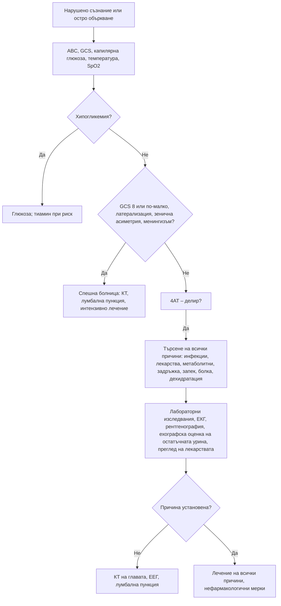

# Глава 43. Нарушено съзнание, кома и делир

> **Част IX. Нервна система**

## Цели на главата

- Да се оценява нивото на съзнание по скалата на Glasgow (GCS) и по скалата ACVPU.
- Да се разграничават структурните от метаболитно-токсичните причини за кома.
- Да се разпознава делирът, включително хипоактивната форма, и да се използва скалата 4AT.
- Да се търсят систематично (и често множествени) причините за делир.
- Да се разграничават делирът, деменцията, депресията и психозата.

## Ключови моменти

- При всяко нарушено съзнание първо се измерва капилярната глюкоза.
- GCS ≤ 8 обикновено означава, че пациентът не може да пази дихателните си пътища [1].
- Делирът се открива с 4AT. Сбор ≥ 4 насочва към делир, а чувствителността и специфичността на скалата са около 88% *(SORT B [5])*.
- Хипоактивният делир е най-често пропусканата форма. Тих, сънлив възрастен пациент може да е в делир *(SORT C [3, 4])*.
- Делирът почти винаги е многофакторен. Безсимптомната бактериурия не бива да се приема за негова причина *(SORT B [8])*.
- При риск от енцефалопатия на Wernicke тиаминът се прилага преди глюкозата или заедно с нея, без да се отлага лечението на хипогликемията *(SORT C [6, 7])*.

### Първите 60 секунди

- Проверете дишането, пулса и SpO₂. Ако пациентът не може да пази дихателните си пътища, поставете го в странично положение.
- Измерете капилярната глюкоза веднага. При хипогликемия дайте глюкоза, а при риск от енцефалопатия на Wernicke – и тиамин [6, 7].
- Оценете GCS или ACVPU, зениците и латерализиращите белези. Обадете се на 112.
- При точковидни зеници и потиснато дишане помислете за опиоиди и приложете налоксон.
- При треска с непобледняващ обрив приложете парентерален антибиотик, ако това не забавя транспорта [9].
- Търсете следи от травма и инжекции, опаковки от лекарства и мирис на дъха. Попитайте свидетелите.

---

## А. Нарушено съзнание и кома

### 1. Основни понятия

Съзнанието има два компонента:

- **будност** – осигурява се от активиращата ретикуларна система в мозъчния ствол;
- **съдържание на съзнанието** – осъзнаване на себе си и средата; осигурява се от мозъчната кора.

**Кома** настъпва при увреждане на мозъчния ствол или при дифузно двустранно засягане на полукълбата.

#### 1.1. Скала на Glasgow

*Таблица 43.1. Скала на Glasgow за кома.*

| Компонент | Отговор | Точки |
|---|---|---|
| **Отваряне на очите (E)** | Спонтанно / на глас / на болка / няма | 4 / 3 / 2 / 1 |
| **Говорен отговор (V)** | Ориентиран / объркан / неподходящи думи / нечленоразделни звуци / няма | 5 / 4 / 3 / 2 / 1 |
| **Двигателен отговор (M)** | Изпълнява команди / локализира болката / отдръпване / флексия (декортикация) / екстензия (децеребрация) / няма | 6 / 5 / 4 / 3 / 2 / 1 |

Скалата е предложена от Teasdale и Jennett [1]. **GCS ≤ 8** обикновено означава, че пациентът не може да пази дихателните си пътища.

**ACVPU** е бърза оценка:

- **A** – буден (*alert*);
- **C** – **ново объркване** (*confusion*);
- **V** – реагира на глас;
- **P** – реагира на болка;
- **U** – не реагира.

### 2. Причини за кома

*Таблица 43.2. Причини за кома.*

| Група | Причини |
|---|---|
| **Структурни – супратенториални** (с херниация) | Интрацеребрален кръвоизлив, голям исхемичен инсулт, субдурален и епидурален хематом, тумор, абсцес |
| **Структурни – инфратенториални** | Инсулт или кръвоизлив в мозъчния ствол, кръвоизлив или инфаркт в малкия мозък с компресия, базиларна тромбоза |
| **Метаболитни и ендокринни** | Хипогликемия (най-важната обратима причина), хипергликемия (кетоацидоза, хиперосмоларно състояние), хипо- и хипернатриемия, хиперкалциемия, уремия, чернодробна енцефалопатия, хиперкапния, хипоксия, хипо- и хипертермия, микседемна кома, надбъбречна криза, енцефалопатия на Wernicke |
| **Токсични** | Опиоиди, бензодиазепини, алкохол, трициклични антидепресанти, антипсихотици, въглероден оксид, токсични алкохоли, салицилати, литий, гъби |
| **Инфекциозни** | Менингит, енцефалит, мозъчен абсцес, сепсис, малария (церебрална – при пътували) |
| **Епилептични** | Постиктално състояние, неконвулсивен епилептичен статус |
| **Съдови** | Субарахноидален кръвоизлив, тромбоза на венозните синуси, хипертонична енцефалопатия, синдром на задната обратима енцефалопатия |
| **Психогенна липса на реакция** | Диагноза след изключване: съпротива при отваряне на очите, очи, които се отклоняват към пода при завъртане на главата, ръка, която „избягва“ лицето при пускане |

**Мнемоника AEIOU TIPS:**

- **A** – алкохол, ацидоза;
- **E** – епилепсия, електролити, енцефалопатия, ендокринни нарушения;
- **I** – инсулин (хипо- и хипергликемия);
- **O** – опиоиди, кислород (хипоксия);
- **U** – уремия;
- **T** – травма, температура;
- **I** – инфекция;
- **P** – отравяне (*poisoning*), психиатрични причини;
- **S** – инсулт, шок, субарахноидален кръвоизлив, обемен процес (*stroke, shock, SAH, space-occupying lesion*).

### 3. Физикален преглед при кома

*Таблица 43.3. Физикален преглед при кома.*

| Находка | Значение |
|---|---|
| **Капилярна глюкоза** | Първото изследване при всеки пациент с нарушено съзнание |
| **Точковидни зеници** | Опиоиди, кръвоизлив в моста |
| **Едностранно разширена, нереагираща зеница** | Компресия на III черепномозъчен нерв (транстенториална херниация), аневризма на задната комуникантна артерия – спешно |
| **Двустранно разширени зеници** | Антихолинергични средства, симпатикомиметици, тежка аноксия |
| **Отклонение на очите** | Към страната на лезията в полукълбото; в обратна посока при лезия на моста или при епилептичен пристъп |
| **Дишане на Kussmaul** | Метаболитна ацидоза (кетоацидоза, уремия, токсични алкохоли) |
| **Дишане на Cheyne-Stokes** | Двустранно засягане на полукълбата, сърдечна недостатъчност |
| **Потискане на дишането** | Опиоиди, седативи, лезия на мозъчния ствол |
| **Менингизъм** | Менингит, субарахноидален кръвоизлив (може да липсва при дълбока кома) |
| **Латерализиращи белези** | Структурна лезия |
| **Кожа** | Следи от инжекции, петехии и пурпура (менингококцемия), жълтеница, хиперпигментация, травми (белег на Battle – кръвонасядане зад ухото; „очи на миеща мечка“ – фрактура на основата на черепа) |
| **Мирис на дъха** | Алкохол, ацетон (кетоацидоза), уремичен мирис, чернодробен мирис |
| **Температура** | Хипотермия (микседем, алкохол, сепсис, престой на студено), хипертермия (инфекция, топлинен удар, токсидроми) |
| **Астериксис** | Метаболитна енцефалопатия (чернодробна, уремична, хиперкапния) |

---

## Б. Делир

### 4. Определение (DSM-5-TR)

**Делирът** е остро мозъчно увреждане (остра мозъчна дисфункция) със следните белези [2]:

1. **нарушено внимание** и осъзнаване на средата;
2. остро начало (часове до дни) и флуктуиращ ход през деня;
3. допълнително когнитивно нарушение: паметта, ориентацията, езикът, зрително-пространствените способности, възприятията;
4. нарушенията не се обясняват по-добре с предшестващо неврокогнитивно разстройство;
5. има данни за **физиологична причина**: заболяване, интоксикация, отнемане на вещество, лекарство.

#### 4.1. Подтипове

- **Хиперактивен** – възбуда, неспокойство, халюцинации, агресия. Лесно се разпознава.
- **Хипоактивен** – сънливост, апатия, намалена подвижност, забавеност. **Най-честият при възрастни хора и най-често пропусканият.** Лесно се бърка с депресия или „умора“ [3, 4].
- **Смесен.**

#### 4.2. Рискови фактори

NICE посочва като основни рискови фактори възрастта над 65 години, когнитивните нарушения, фрактурата на бедрото и тежкото заболяване [4].

- Възраст над 65 години.
- **Деменция** и когнитивни нарушения.
- Тежко заболяване, фрактура на бедрото, операция.
- Полипрагмазия.
- Нарушено зрение и слух.
- Злоупотреба с алкохол.
- Недохранване, дехидратация.

#### 4.3. Скрининг: скала 4AT

*Таблица 43.4. Скала 4AT за скрининг на делир.*

| Елемент | Оценка | Точки |
|---|---|---|
| **1. Будност** | Нормална (или кратка сънливост, която отминава при събуждане) | 0 |
| | Изразено нарушена | 4 |
| **2. AMT4** (възраст, дата на раждане, място, година) | Без грешки | 0 |
| | 1 грешка | 1 |
| | ≥ 2 грешки или невъзможност за оценка | 2 |
| **3. Внимание** (месеците от декември назад) | ≥ 7 месеца правилно | 0 |
| | Започва, но < 7 месеца или отказва | 1 |
| | Не може да изпълни (неразположен, сънлив, невнимателен) | 2 |
| **4. Остра промяна или флуктуиращ ход** | Не | 0 |
| | Да | 4 |

**≥ 4 точки** – възможен делир (± когнитивен дефицит); 1–3 точки – възможен когнитивен дефицит; 0 точки – делирът и тежкият когнитивен дефицит са малко вероятни. Чувствителността и специфичността на 4AT са около 88% [5]. NICE препоръчва 4AT при подозрение за делир извън интензивното отделение [4].

### 5. Причини за делир

Делирът почти винаги е многофакторен. Причините трябва да се търсят всички, а не да се спира след първата.

*Таблица 43.5. Причини за делир.*

| Група | Причини |
|---|---|
| **Инфекции** | Пневмония, инфекция на пикочните пътища, целулит, сепсис, менингит (рядко), COVID-19 |
| **Лекарства** | Антихолинергични (оксибутинин, толтеродин, антихистамини от първо поколение, трициклични антидепресанти, някои антипсихотици), бензодиазепини и Z-хипнотици, опиоиди, кортикостероиди, антипаркинсонови средства, дигоксин (токсичност), литий, габапентиноиди; отнемане на алкохол (делириум тременс – обикновено 48–72 часа след последния прием; сроковете са в таблицата в глава 76), бензодиазепини, никотин |
| **Метаболитни** | Хипо- и хипернатриемия, хиперкалциемия, хипо- и хипергликемия, уремия, чернодробна енцефалопатия, хипоксия, хиперкапния, заболявания на щитовидната жлеза, дефицит на тиамин (енцефалопатия на Wernicke) |
| **„Механични“** | Задръжка на урина, запек и фекалом, болка (фрактура, особено на бедрото; зъбна болка) |
| **Дехидратация** | Недостатъчен прием на течности, диуретици |
| **Мозъчни** | Мозъчен инсулт, хроничен субдурален хематом (падания, антикоагуланти), неконвулсивен статус, мозъчни метастази |
| **Сърдечно-белодробни** | Миокарден инфаркт, сърдечна недостатъчност, белодробна тромбемболия, аритмии |
| **Околна среда** | Хоспитализация, смяна на обстановката, лишаване от сън, сензорна депривация (без очила и слухов апарат), физическо ограничаване, уретрален катетър |

**Мнемоника PINCH ME:** болка (*Pain*), инфекция (*Infection*), хранене (*Nutrition*), запек (*Constipation*), хидратация (*Hydration*), лекарства (*Medication*), околна среда (*Environment*).

**Специални ситуации:**

- **Енцефалопатия на Wernicke.** Класическата триада (объркване, офталмоплегия или нистагъм, атаксия) е налице само в малка част от случаите. Засегнати са алкохолици, недохранени, пациенти с продължително повръщане (включително hyperemesis gravidarum) и след бариатрична операция. **Тиаминът се прилага възможно най-рано – преди глюкозата или заедно с нея** [6]. Лечението на хипогликемията обаче не се отлага заради тиамина [7].
- **Чернодробна енцефалопатия.** Проявява се с астериксис и сънливост. Провокира се от кървене от храносмилателния тракт, инфекция (спонтанен бактериален перитонит), запек, седативи, хипокалиемия и дехидратация.
- **Делириум тременс.** Възбуда, халюцинации (често зрителни, с насекоми), тремор, изпотяване, тахикардия, хипертермия, гърчове. Смъртността е висока без лечение.

### 6. Делир, деменция, депресия и психоза

*Таблица 43.6. Делир, деменция, депресия и психоза.*

| Белег | **Делир** | **Деменция** | **Депресия** | **Първична психоза** |
|---|---|---|---|---|
| Начало | Остро (часове–дни) | Постепенно (месеци–години) | Седмици–месеци | Различно |
| Ход | Флуктуиращ, по-лошо вечер | Бавно прогресиращ | Стабилен, по-лошо сутрин | Различен |
| Внимание | **Силно нарушено** | Запазено в началото | Намалено (слаба мотивация) | Обикновено запазено |
| Ниво на съзнание | Нарушено (повишено или понижено) | Нормално | Нормално | Нормално |
| Ориентация | Нарушена | Нарушена в по-късните стадии | Запазена | Запазена |
| Халюцинации | Зрителни, чести | Редки (освен при деменция с телца на Lewy) | Редки | **Слухови** |
| Обратимост | Обикновено обратим | Необратима (с изключения) | Обратима | Различна |
| Отговори на тестовете | Невнимателни, разпилени | Опит за прикриване, конфабулации | „Не знам“, малко усилие | Обикновено адекватни |

**Делирът и деменцията често съжителстват.** Деменцията е най-силният рисков фактор за делир. Делирът ускорява когнитивния упадък.

---

## 7. Безопасна диагностична стратегия

*Таблица 43.7. Безопасна диагностична стратегия.*

| Въпрос | Отговор |
|---|---|
| **Вероятна диагноза** | Делир при инфекция, лекарства, дехидратация, метаболитни нарушения; интоксикации; постиктално състояние |
| **Сериозни заболявания, които не бива да се пропускат** | Хипогликемия; менингит и енцефалит; мозъчен кръвоизлив и субдурален хематом; сепсис; хипоксия и хиперкапния; енцефалопатия на Wernicke; делириум тременс; неконвулсивен статус; отравяне с въглероден оксид; миокарден инфаркт и белодробна тромбемболия |
| **Чести капани** | Хипоактивен делир, приет за депресия или „старост“; закотвяне към „уроинфекция“ въз основа на безсимптомна бактериурия [8]; задръжка на урина и фекалом; антихолинергични лекарства; хроничен субдурален хематом; хипонатриемия; болка при пациент, който не може да я опише |
| **Маскиращи заболявания** | Лекарства, захарен диабет, инфекция на пикочните пътища, заболявания на щитовидната жлеза, анемия |
| **Психосоциални аспекти** | Злоупотреба с алкохол, самоотравяне, насилие над възрастни хора, пренебрегване |

---

## 8. Изследвания при делир

- **Капилярна глюкоза.**
- ПКК, CRP, натрий, калий, калций, креатинин, урея, чернодробни показатели, ТСХ, глюкоза.
- Кислородна сатурация, при нужда кръвно-газов анализ (хиперкапния).
- **Урина** – само при уринарни симптоми или сепсис без друго огнище. Положителната уринна лента при възрастен човек често е безсимптомна бактериурия [8].
- Рентгенография на гръден кош, ЕКГ, тропонин при показания.
- **Скенер на пикочния мехур** или катетеризация (задръжка), ректално туше (фекалом).
- Нива на лекарства (дигоксин, литий).
- **КТ на главата** при падане, антикоагулантна терапия, фокален дефицит или при липса на друга причина.
- Лумбална пункция при треска и менингизъм или при съмнение за енцефалит.
- ЕЕГ при съмнение за неконвулсивен статус.
- Карбоксихемоглобин при съответна експозиция.

---

## 9. Диагностичен алгоритъм

*Фигура 43.1. Диагностичен алгоритъм: нарушено съзнание, кома и делир. Схема на авторите въз основа на източниците, цитирани в главата.*

Текстово описание на фигура 43.1

1. Нарушено съзнание или остро объркване. Следва: към т. 2.
2. ABC, GCS, капилярна глюкоза, температура, SpO2. Следва: към т. 3.
3. **Въпрос:** Хипогликемия? Да – към т. 4; Не – към т. 5.
4. Глюкоза; тиамин при риск.
5. **Въпрос:** GCS 8 или по-малко, латерализация, зенична асиметрия, менингизъм? Да – към т. 6; Не – към т. 7.
6. Спешна болница: КТ, лумбална пункция, интензивно лечение.
7. 4AT – делир?. Следва: Да – към т. 8.
8. Търсене на всички причини: инфекции, лекарства, метаболитни, задръжка, запек, болка, дехидратация. Следва: към т. 9.
9. Лабораторни изследвания, ЕКГ, рентгенография, ехографска оценка на остатъчната урина, преглед на лекарствата. Следва: към т. 10.
10. **Въпрос:** Причина установена? Не – към т. 11; Да – към т. 12.
11. КТ на главата, ЕЕГ, лумбална пункция.
12. Лечение на всички причини, нефармакологични мерки.

---

## 10. Червени флагове и насочване

### 10.1. Червени флагове

- GCS ≤ 8 или бързо влошаване на съзнанието.
- Едностранно разширена, нереагираща зеница или латерализиращи белези.
- Треска с менингизъм, обрив или гърчове.
- Нарушено съзнание след травма на главата или при антикоагулантна терапия.
- Хипотермия или хипертермия.
- Потиснато дишане, хипоксия или хиперкапния.
- Делир с ново главоболие или фокален неврологичен дефицит.
- Офталмоплегия, нистагъм или атаксия при злоупотреба с алкохол или недохранване.

### 10.2. Кога и колко спешно да насочим

*Таблица 43.8. Кога и колко спешно да насочим.*

| Спешност | Клинична ситуация |
|---|---|
| **Незабавно (112 или спешно отделение)** | Кома или остро нарушено съзнание без бързо обратима причина; делир с треска и менингизъм [9], хипоксия, сепсис или нов неврологичен дефицит; делириум тременс; подозрение за енцефалопатия на Wernicke; отравяне |
| **В същия ден** | Нов делир при възрастен човек, когато причината не може да се установи и лекува безопасно у дома; делир след падане при антикоагулантна или антиагрегантна терапия – КТ на главата до 8 часа [10] |
| **Бързо (до 2 седмици)** | Персистиращи когнитивни нарушения след отзвучаване на делира – оценка за деменция |
| **Проследяване в общата практика** | Лек делир с ясна обратима причина, когато у дома е възможно наблюдение и грижа; преглед на антихолинергичните и седативните лекарства [11] |

---

## 11. Клинични перли

- При всяко нарушено съзнание първо се измерва глюкозата.
- Хипоактивният делир е най-често пропусканата форма. Тихият, сънлив възрастен пациент може да е в делир.
- Положителната уринна лента при объркан възрастен човек не доказва, че инфекцията на пикочните пътища е причината.
- Проверете за задръжка на урина и фекалом при всеки възрастен пациент с делир.
- Един антихолинергичен препарат, например оксибутинин, може да предизвика делир при човек с деменция.
- Флуктуиращо объркване след падане, особено при антикоагулантна терапия: хроничен субдурален хематом.
- Тиаминът е евтин и безопасен. Прилагайте го при всеки застрашен пациент преди глюкозата или заедно с нея, но не отлагайте лечението на хипогликемията [6, 7].
- Делирът е медицинско спешно състояние със значима смъртност. Той не е „нормална част от старостта“.

---

## 12. Клиничен случай

**Етап 1 – представяне.** Жена на 83 години с лека деменция живее в дом за възрастни хора. От два дни е необичайно сънлива, почти не се храни и „не е на себе си“. Персоналът съобщава, че урината ѝ „мирише силно“, а уринната лента е положителна за левкоцити и нитрити. Няма треска.

> **Въпрос 1.** Какво състояние подозирате и как ще го потвърдите?

**Етап 2 – лекарства и преглед.** Преди 10 дни е започнала оксибутинин за инконтиненция, а преди седмица – кодеин за болки в коляното. Скалата 4AT дава 7 точки. Пикочният мехур е палпируем и болезнен, а при ректалното туше се установява фекалом. Натрият е 129 mmol/l.

> **Въпрос 2.** Кои са вероятните причини?

> **Въпрос 3.** Какво е поведението?

Обсъждане и отговори

**Отговор 1.** Сънливостта и намалената активност с остро начало отговарят на **хипоактивен делир**. Той се потвърждава с 4AT [4, 5].

**Отговор 2.** Причините са няколко: антихолинергичното действие на оксибутинина, опиоидът (запек, задръжка на урина и пряк ефект върху ЦНС), задръжката на урина (900 ml), фекаломът, дехидратацията и хипонатриемията. Уринната лента не доказва инфекция, защото безсимптомната бактериурия е честа при възрастни жени [8].

**Отговор 3.** Катетеризация, лечение на запека, спиране на оксибутинина и кодеина, хидратация и немедикаментозни мерки: ориентиране, очила и слухов апарат, познати хора, сън през нощта. Антибиотик не се започва само заради уринната лента [8]. Състоянието се подобрява за 3 дни.

**Поука.** Делирът обикновено има няколко причини. Закотвянето към „уроинфекция“ би оставило истинските причини неразпознати.

---

## Обобщение

- Нарушеното съзнание се оценява с GCS или ACVPU. Първото изследване винаги е капилярната глюкоза.
- Причините за кома са структурни или метаболитно-токсични. Зениците, дишането, латерализиращите белези и менингизмът ги разграничават.
- Делирът е остро и флуктуиращо нарушение на вниманието. Хипоактивната форма е най-често пропускана, а 4AT е бърз скринингов инструмент.
- Делирът почти винаги има няколко причини: инфекции, лекарства, метаболитни нарушения, задръжка на урина, запек, болка и дехидратация. Всички се търсят и лекуват.

## Самопроверка

### Въпроси с един верен отговор

**1.** *(основно ниво)* Мъж на около 60 години е намерен в безсъзнание на улицата. Дишането и пулсът са запазени. Кое е първото изследване?

- **А.** КТ на главата
- **Б.** Капилярна глюкоза
- **В.** Кръвно-газов анализ
- **Г.** Токсикологичен скрининг
- **Д.** ЕКГ

Отговор и обосновка

**Верен отговор: Б.** Хипогликемията е най-важната бързо обратима причина за нарушено съзнание. Тя се изключва с капилярна глюкоза, преди всичко друго.

**2.** *(основно ниво)* Пациент отваря очи само при болков стимул, издава нечленоразделни звуци и отдръпва крайника при болка. Какъв е сборът по скалата на Glasgow?

- **А.** 6
- **Б.** 7
- **В.** 8
- **Г.** 9
- **Д.** 10

Отговор и обосновка

**Верен отговор: В.** Отваряне на очите при болка – 2 точки, нечленоразделни звуци – 2 точки, отдръпване – 4 точки. Сборът е 8 [1].

**3.** *(основно ниво)* Жена на 84 години с деменция от 2 дни е по-сънлива, апатична и не се храни. Уринната лента показва левкоцити и нитрити, но няма треска и уринарни симптоми. Кое е най-правилното поведение?

- **А.** Антибиотик за уроинфекция и наблюдение
- **Б.** Оценка с 4AT и систематично търсене на всички причини
- **В.** Антидепресант
- **Г.** Халоперидол
- **Д.** Планово насочване за оценка на деменцията

Отговор и обосновка

**Верен отговор: Б.** Картината е на хипоактивен делир [4]. Положителната уринна лента често е безсимптомна бактериурия [8]. Търсят се лекарства, задръжка на урина, запек, дехидратация и електролитни нарушения.

**4.** *(напреднало ниво)* Мъж на 50 години със злоупотреба с алкохол е объркан, има нистагъм и атаксия. Капилярната глюкоза е 2,8 mmol/l. Кое е правилното поведение?

- **А.** Глюкоза веднага и тиамин възможно най-рано – преди глюкозата или заедно с нея
- **Б.** Отлагане на глюкозата, докато се осигури тиамин
- **В.** Само тиамин през устата
- **Г.** Бензодиазепин и наблюдение
- **Д.** КТ на главата преди каквото и да е лечение

Отговор и обосновка

**Верен отговор: А.** Картината е подозрителна за енцефалопатия на Wernicke. Тиаминът се прилага парентерално възможно най-рано [6], но лечението на хипогликемията не се отлага [7].

**5.** *(напреднало ниво)* Жена на 25 години е в безсъзнание. Зениците са точковидни, дихателната честота е 6/min, а по ръцете има следи от инжекции. Кое е най-подходящото незабавно действие след осигуряване на дихателните пътища?

- **А.** Флумазенил
- **Б.** Налоксон
- **В.** Глюкагон
- **Г.** Атропин
- **Д.** Активен въглен

Отговор и обосновка

**Верен отговор: Б.** Точковидните зеници, потиснатото дишане и следите от инжекции насочват към опиоидна интоксикация. Налоксонът е антидотът.

### Задача

Дъщерята на жена на 79 години съобщава, че от 3 дни майка ѝ е объркана вечер и „вижда хора в стаята“, а сутрин е по-добре. Преди месец е била самостоятелна. Делир или деменция е това и какво ще направите?

Решение

Острото начало, флуктуиращият ход, влошаването вечер и зрителните халюцинации насочват към **делир**, а не към деменция [2]. Деменцията започва постепенно, а вниманието е запазено в ранните стадии. Прави се 4AT [5] и се търсят систематично всички причини: инфекция, лекарства (антихолинергични, седативни, опиоиди), задръжка на урина, запек, болка, дехидратация, електролитни нарушения и падане. Ако причината не може да се установи и лекува безопасно у дома, пациентката се насочва в същия ден. Оценка за деменция се прави едва след отзвучаване на делира.

### OSCE станция: Скрининг за делир с 4AT

**Време:** 5 минути. **Ниво:** основно (студенти, специализанти).

**Задача за кандидата.** Мъж на 81 години е доведен от съпругата си, защото от вчера е „объркан“. Приложете скалата 4AT и обяснете резултата.

**Информация за симулирания пациент (за изпитващия).** Сънлив е, но се събужда. Не може да каже годината и мястото. Започва да изброява месеците назад, но спира на октомври. Съпругата потвърждава, че промяната е от вчера.

*Таблица 43.9. OSCE станция „Скрининг за делир с 4AT“ – критерии за оценяване.*

| Критерий | Точки |
|---|---|
| Оценява будността (изразено нарушена ли е) | 1 |
| Задава четирите въпроса от AMT4: възраст, дата на раждане, място, година | 2 |
| Проверява вниманието с месеците от декември назад | 2 |
| Пита придружителя за остра промяна или флуктуиращ ход | 2 |
| Пресмята правилно сбора и го тълкува като възможен делир | 2 |
| Обяснява на съпругата, че ще се търсят причините | 1 |
| **Общо** | **10** |

**Праг за успешно изпълнение:** 7 от 10 точки, включително правилния сбор и тълкуване.

## Литература

1. Teasdale G, Jennett B. Assessment of coma and impaired consciousness. A practical scale. Lancet. 1974;2(7872):81-4. doi:10.1016/s0140-6736(74)91639-0. PMID: 4136544.
2. American Psychiatric Association. Diagnostic and Statistical Manual of Mental Disorders, Fifth Edition, Text Revision (DSM-5-TR). Washington, DC: American Psychiatric Association Publishing; 2022.
3. Inouye SK, Westendorp RG, Saczynski JS. Delirium in elderly people. Lancet. 2014;383(9920):911-22. doi:10.1016/S0140-6736(13)60688-1. PMID: 23992774.
4. National Institute for Health and Care Excellence. Delirium: prevention, diagnosis and management in hospital and long-term care (Clinical guideline CG103). London: NICE; 2010 [актуализирано 2023]. Достъпно на: https://www.nice.org.uk/guidance/cg103
5. Tieges Z, Maclullich AMJ, Anand A, Brookes C, Cassarino M, O'connor M, et al. Diagnostic accuracy of the 4AT for delirium detection in older adults: systematic review and meta-analysis. Age Ageing. 2021;50(3):733-743. doi:10.1093/ageing/afaa224. PMID: 33951145.
6. Galvin R, Bråthen G, Ivashynka A, Hillbom M, Tanasescu R, Leone MA; EFNS. EFNS guidelines for diagnosis, therapy and prevention of Wernicke encephalopathy. Eur J Neurol. 2010;17(12):1408-18. doi:10.1111/j.1468-1331.2010.03153.x. PMID: 20642790.
7. Schabelman E, Kuo D. Glucose before thiamine for Wernicke encephalopathy: a literature review. J Emerg Med. 2012;42(4):488-94. doi:10.1016/j.jemermed.2011.05.076. PMID: 22104258.
8. Nicolle LE, Gupta K, Bradley SF, Colgan R, DeMuri GP, Drekonja D, et al. Clinical Practice Guideline for the Management of Asymptomatic Bacteriuria: 2019 Update by the Infectious Diseases Society of America. Clin Infect Dis. 2019;68(10):e83-e110. doi:10.1093/cid/ciy1121. PMID: 30895288.
9. National Institute for Health and Care Excellence. Meningitis (bacterial) and meningococcal disease: recognition, diagnosis and management (NICE guideline NG240). London: NICE; 2024. Достъпно на: https://www.nice.org.uk/guidance/ng240
10. National Institute for Health and Care Excellence. Head injury: assessment and early management (NICE guideline NG232). London: NICE; 2023. Достъпно на: https://www.nice.org.uk/guidance/ng232
11. 2023 American Geriatrics Society Beers Criteria Update Expert Panel. American Geriatrics Society 2023 updated AGS Beers Criteria for potentially inappropriate medication use in older adults. J Am Geriatr Soc. 2023;71(7):2052-2081. doi:10.1111/jgs.18372. PMID: 37139824.

*Последна проверка на съдържанието: септември 2026 г. Следващ планиран преглед: септември 2027 г. (вж. „Политика за актуализация“ в README).*

<!-- навигация -->

---

[← Глава 42. Епилептични пристъпи и неепилептични пароксизмални състояния](42-pristapi.md) · [Съдържание](../README.md) · [Глава 44. Когнитивни нарушения и деменция →](44-dementsia.md)
