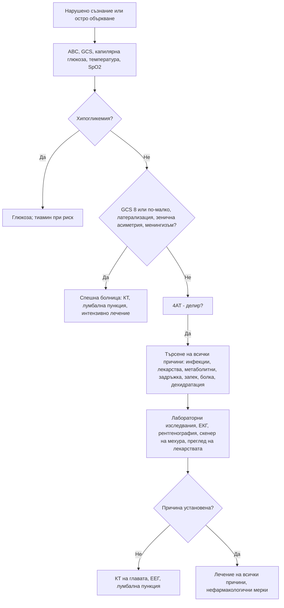

# Глава 43. Нарушено съзнание, кома и делир

> **Част IX. Нервна система**

## Цели на главата

- Да се оценява нивото на съзнание по скалата на Glasgow (GCS) и по скалата ACVPU.
- Да се разграничават структурните от метаболитно-токсичните причини за кома.
- Да се разпознава делирът, включително хипоактивната форма, и да се използва скалата 4AT.
- Да се търсят систематично (и често множествени) причините за делир.
- Да се разграничават делирът, деменцията, депресията и психозата.

---

## А. НАРУШЕНО СЪЗНАНИЕ И КОМА

## 1. Основни понятия

Съзнанието има два компонента:

- **будност** — осигурява се от активиращата ретикуларна система в мозъчния ствол;
- **съдържание на съзнанието** — осъзнаване на себе си и средата; осигурява се от мозъчната кора.

**Кома** настъпва при увреждане на мозъчния ствол или при дифузно двустранно засягане на полукълбата.

### 1.1. Скала на Glasgow

| Компонент | Отговор | Точки |
|---|---|---|
| **Отваряне на очите (E)** | Спонтанно / на глас / на болка / няма | 4 / 3 / 2 / 1 |
| **Говорен отговор (V)** | Ориентиран / объркан / неподходящи думи / нечленоразделни звуци / няма | 5 / 4 / 3 / 2 / 1 |
| **Двигателен отговор (M)** | Изпълнява команди / локализира болката / отдръпване / флексия (декортикация) / екстензия (децеребрация) / няма | 6 / 5 / 4 / 3 / 2 / 1 |

**GCS ≤ 8** обикновено означава, че пациентът не може да пази дихателните си пътища.

**ACVPU** е бърза оценка:

- **A** — буден (*alert*);
- **C** — **ново объркване** (*confusion*);
- **V** — реагира на глас;
- **P** — реагира на болка;
- **U** — не реагира.

## 2. Причини за кома

| Група | Причини |
|---|---|
| **Структурни — супратенториални** (с херниация) | Интрацеребрален кръвоизлив, голям исхемичен инсулт, субдурален и епидурален хематом, тумор, абсцес |
| **Структурни — инфратенториални** | Инсулт или кръвоизлив в мозъчния ствол, кръвоизлив или инфаркт в малкия мозък с компресия, базиларна тромбоза |
| **Метаболитни и ендокринни** | **Хипогликемия** (най-важната обратима причина), хипергликемия (кетоацидоза, хиперосмоларно състояние), **хипо- и хипернатриемия**, хиперкалциемия, **уремия**, **чернодробна енцефалопатия**, **хиперкапния**, хипоксия, **хипо- и хипертермия**, микседемна кома, надбъбречна криза, **енцефалопатия на Wernicke** |
| **Токсични** | **Опиоиди**, бензодиазепини, **алкохол**, трициклични антидепресанти, антипсихотици, **въглероден оксид**, токсични алкохоли, салицилати, литий, **гъби** |
| **Инфекциозни** | **Менингит, енцефалит**, мозъчен абсцес, **сепсис**, малария (церебрална — при пътували) |
| **Епилептични** | **Постиктално състояние**, **неконвулсивен епилептичен статус** |
| **Съдови** | **Субарахноидален кръвоизлив**, тромбоза на венозните синуси, хипертонична енцефалопатия, синдром на задната обратима енцефалопатия |
| **Психогенна липса на реакция** | Диагноза след изключване: съпротива при отваряне на очите, очи, които се отклоняват към пода при завъртане на главата, ръка, която „избягва“ лицето при пускане |

**Мнемоника AEIOU TIPS:**

- **A** — алкохол, ацидоза;
- **E** — епилепсия, електролити, енцефалопатия, ендокринни нарушения;
- **I** — инсулин (хипо- и хипергликемия);
- **O** — опиоиди, кислород (хипоксия);
- **U** — уремия;
- **T** — травма, температура;
- **I** — инфекция;
- **P** — отравяне (*poisoning*), психиатрични причини;
- **S** — инсулт, шок, субарахноидален кръвоизлив, обемен процес (*stroke, shock, SAH, space-occupying lesion*).

## 3. Физикален преглед при кома

| Находка | Значение |
|---|---|
| **Капилярна глюкоза** | Първото изследване при всеки пациент с нарушено съзнание |
| **Точковидни зеници** | Опиоиди, кръвоизлив в моста |
| **Едностранно разширена, нереагираща зеница** | **Компресия на III черепномозъчен нерв** (транстенториална херниация), аневризма на задната комуникантна артерия — спешно |
| **Двустранно разширени зеници** | Антихолинергични средства, симпатикомиметици, тежка аноксия |
| **Отклонение на очите** | Към страната на лезията в полукълбото; в обратна посока при лезия на моста или при епилептичен пристъп |
| **Дишане на Kussmaul** | Метаболитна ацидоза (кетоацидоза, уремия, токсични алкохоли) |
| **Дишане на Cheyne-Stokes** | Двустранно засягане на полукълбата, сърдечна недостатъчност |
| **Потискане на дишането** | Опиоиди, седативи, лезия на мозъчния ствол |
| **Менингизъм** | Менингит, субарахноидален кръвоизлив (може да липсва при дълбока кома) |
| **Латерализиращи белези** | Структурна лезия |
| **Кожа** | Следи от инжекции, **петехии и пурпура** (менингококцемия), жълтеница, хиперпигментация, травми (**белег на Battle** — кръвонасядане зад ухото; **„очи на миеща мечка“** — фрактура на основата на черепа) |
| **Мирис на дъха** | Алкохол, ацетон (кетоацидоза), уремичен мирис, чернодробен мирис |
| **Температура** | Хипотермия (микседем, алкохол, сепсис, престой на студено), хипертермия (инфекция, топлинен удар, токсидроми) |
| **Астериксис** | Метаболитна енцефалопатия (чернодробна, уремична, хиперкапния) |

---

## Б. ДЕЛИР

## 4. Определение (DSM-5)

**Делирът** е остро мозъчно увреждане (остра мозъчна дисфункция) със следните белези:

1. **нарушено внимание** и осъзнаване на средата;
2. **остро начало** (часове до дни) и **флуктуиращ ход** през деня;
3. допълнително когнитивно нарушение: паметта, ориентацията, езикът, зрително-пространствените способности, възприятията;
4. нарушенията не се обясняват по-добре с предшестващо неврокогнитивно разстройство;
5. има данни за **физиологична причина**: заболяване, интоксикация, отнемане на вещество, лекарство.

### 4.1. Подтипове

- **Хиперактивен** — възбуда, неспокойство, халюцинации, агресия. Лесно се разпознава.
- **Хипоактивен** — сънливост, апатия, намалена подвижност, забавеност. **Най-честият при възрастни хора и най-често пропусканият.** Лесно се бърка с депресия или „умора“.
- **Смесен.**

### 4.2. Рискови фактори

- Възраст над 65 години.
- **Деменция** и когнитивни нарушения.
- Тежко заболяване, фрактура на бедрото, операция.
- Полипрагмазия.
- Нарушено зрение и слух.
- Злоупотреба с алкохол.
- Недохранване, дехидратация.

### 4.3. Скрининг: скала 4AT

| Елемент | Оценка | Точки |
|---|---|---|
| **1. Будност** | Нормална (или кратка сънливост, която отминава при събуждане) | 0 |
| | Изразено нарушена | 4 |
| **2. AMT4** (възраст, дата на раждане, място, година) | Без грешки | 0 |
| | 1 грешка | 1 |
| | ≥ 2 грешки или невъзможност за оценка | 2 |
| **3. Внимание** (месеците от декември назад) | ≥ 7 месеца правилно | 0 |
| | Започва, но < 7 месеца или отказва | 1 |
| | Не може да изпълни (неразположен, сънлив, невнимателен) | 2 |
| **4. Остра промяна или флуктуиращ ход** | Не | 0 |
| | Да | 4 |

**≥ 4 точки** — вероятен делир (± когнитивен дефицит); **1–3 точки** — възможен когнитивен дефицит; **0 точки** — делирът и тежкият когнитивен дефицит са малко вероятни.

## 5. Причини за делир

Делирът почти винаги е **многофакторен**. Причините трябва да се търсят **всички**, а не да се спира след първата.

| Група | Причини |
|---|---|
| **Инфекции** | Пневмония, **инфекция на пикочните пътища**, целулит, сепсис, менингит (рядко), COVID-19 |
| **Лекарства** | **Антихолинергични** (оксибутинин, толтеродин, антихистамини от първо поколение, трициклични антидепресанти, някои антипсихотици), **бензодиазепини** и Z-хипнотици, **опиоиди**, кортикостероиди, антипаркинсонови средства, дигоксин (токсичност), литий, габапентиноиди; **отнемане** на алкохол (**делириум тременс** — 48–72 часа след последния прием), бензодиазепини, никотин |
| **Метаболитни** | Хипо- и хипернатриемия, хиперкалциемия, хипо- и хипергликемия, уремия, чернодробна енцефалопатия, хипоксия, хиперкапния, заболявания на щитовидната жлеза, дефицит на тиамин (**енцефалопатия на Wernicke**) |
| **„Механични“** | **Задръжка на урина**, **запек и фекалом**, **болка** (фрактура, особено на бедрото; зъбна болка) |
| **Дехидратация** | Недостатъчен прием на течности, диуретици |
| **Мозъчни** | Мозъчен инсулт, **хроничен субдурален хематом** (падания, антикоагуланти), неконвулсивен статус, мозъчни метастази |
| **Сърдечно-белодробни** | Миокарден инфаркт, сърдечна недостатъчност, белодробна тромбемболия, аритмии |
| **Околна среда** | Хоспитализация, смяна на обстановката, лишаване от сън, сензорна депривация (без очила и слухов апарат), физическо ограничаване, уретрален катетър |

**Мнемоника PINCH ME:** болка (*Pain*), инфекция (*Infection*), хранене (*Nutrition*), запек (*Constipation*), хидратация (*Hydration*), лекарства (*Medication*), околна среда (*Environment*).

**Специални ситуации:**

- **Енцефалопатия на Wernicke.** Класическата триада (объркване, офталмоплегия или нистагъм, атаксия) е налице само в малка част от случаите. Засегнати са алкохолици, недохранени, пациенти с продължително повръщане (включително hyperemesis gravidarum) и след бариатрична операция. **Тиамин се прилага преди глюкозата.**
- **Чернодробна енцефалопатия.** Проявява се с астериксис и сънливост. Провокира се от кървене от храносмилателния тракт, инфекция (спонтанен бактериален перитонит), запек, седативи, хипокалиемия и дехидратация.
- **Делириум тременс.** Възбуда, халюцинации (често зрителни, с насекоми), тремор, изпотяване, тахикардия, хипертермия, гърчове. Смъртността е висока без лечение.

## 6. Делир, деменция, депресия и психоза

| Белег | **Делир** | **Деменция** | **Депресия** | **Първична психоза** |
|---|---|---|---|---|
| Начало | **Остро** (часове–дни) | Постепенно (месеци–години) | Седмици–месеци | Различно |
| Ход | **Флуктуиращ**, по-лошо вечер | Бавно прогресиращ | Стабилен, по-лошо сутрин | Различен |
| Внимание | **Силно нарушено** | Запазено в началото | Намалено (слаба мотивация) | Обикновено запазено |
| Ниво на съзнание | **Нарушено** (повишено или понижено) | Нормално | Нормално | Нормално |
| Ориентация | Нарушена | Нарушена в по-късните стадии | Запазена | Запазена |
| Халюцинации | **Зрителни**, чести | Редки (освен при деменция с телца на Lewy) | Редки | **Слухови** |
| Обратимост | Обикновено обратим | Необратима (с изключения) | Обратима | Различна |
| Отговори на тестовете | Невнимателни, разпилени | Опит за прикриване, конфабулации | „Не знам“, малко усилие | Обикновено адекватни |

**Делирът и деменцията често съжителстват.** Деменцията е най-силният рисков фактор за делир. Делирът ускорява когнитивния упадък.

---

## 7. Безопасна диагностична стратегия

| Въпрос | Отговор |
|---|---|
| **Вероятна диагноза** | Делир при инфекция, лекарства, дехидратация, метаболитни нарушения; интоксикации; постиктално състояние |
| **Сериозни заболявания, които не бива да се пропускат** | **Хипогликемия**; **менингит и енцефалит**; **мозъчен кръвоизлив** и субдурален хематом; **сепсис**; хипоксия и хиперкапния; **енцефалопатия на Wernicke**; делириум тременс; **неконвулсивен статус**; **отравяне с въглероден оксид**; миокарден инфаркт и белодробна тромбемболия |
| **Чести капани** | **Хипоактивен делир**, приет за депресия или „старост“; закотвяне към „уроинфекция“ въз основа на безсимптомна бактериурия; задръжка на урина и фекалом; антихолинергични лекарства; хроничен субдурален хематом; хипонатриемия; болка при пациент, който не може да я опише |
| **Маскиращи заболявания** | Лекарства, захарен диабет, инфекция на пикочните пътища, заболявания на щитовидната жлеза, анемия |
| **Психосоциални аспекти** | Злоупотреба с алкохол, самоотравяне, насилие над възрастни хора, пренебрегване |

---

## 8. Изследвания при делир

- **Капилярна глюкоза.**
- ПКК, CRP, **натрий**, калий, **калций**, креатинин, урея, чернодробни показатели, ТСХ, глюкоза.
- Кислородна сатурация, при нужда кръвно-газов анализ (хиперкапния).
- **Урина** — само при уринарни симптоми или сепсис без друго огнище. Положителната уринна лента при възрастен човек често е безсимптомна бактериурия.
- Рентгенография на гръден кош, ЕКГ, тропонин при показания.
- **Скенер на пикочния мехур** или катетеризация (задръжка), ректално туше (фекалом).
- Нива на лекарства (дигоксин, литий).
- **КТ на главата** при падане, антикоагулантна терапия, фокален дефицит или при липса на друга причина.
- Лумбална пункция при треска и менингизъм или при съмнение за енцефалит.
- ЕЕГ при съмнение за неконвулсивен статус.
- Карбоксихемоглобин при съответна експозиция.

---

## 9. Диагностичен алгоритъм

---

## 10. Клинични перли

- При всяко нарушено съзнание първо се измерва глюкозата.
- Хипоактивният делир е най-често пропусканата форма. Тихият, сънлив възрастен пациент може да е в делир.
- Положителната уринна лента при объркан възрастен човек не доказва, че инфекцията на пикочните пътища е причината.
- Проверете за задръжка на урина и фекалом при всеки възрастен пациент с делир.
- Един антихолинергичен препарат, например оксибутинин, може да предизвика делир при човек с деменция.
- Флуктуиращо объркване след падане, особено при антикоагулантна терапия: хроничен субдурален хематом.
- Тиаминът е евтин и безопасен. Прилагайте го при всеки застрашен пациент преди глюкоза.
- Делирът е медицинско спешно състояние със значима смъртност. Той не е „нормална част от старостта“.

---

## 11. Клиничен случай

**Случай.** Жена на 83 години с лека деменция живее в дом за възрастни хора. От два дни е необичайно сънлива, почти не се храни, „не е на себе си“. Персоналът съобщава, че урината ѝ „мирише силно“. Уринната лента е положителна за левкоцити и нитрити. Преди 10 дни е започнала оксибутинин за инконтиненция, а преди седмица — кодеин за болки в коляното. Няма треска.

**Въпроси.** 1) Какъв тип делир е налице? 2) Кои са вероятните причини?

**Обсъждане.** Сънливостта и намалената активност с остро начало отговарят на **хипоактивен делир**. Скалата 4AT потвърждава това: 7 точки. Уринната лента **не доказва** инфекция, защото безсимптомната бактериурия е честа при възрастни жени. При прегледа се установява **палпируем, болезнен пикочен мехур** (задръжка от 900 ml) и **фекалом** при ректалното туше. Причините са няколко: **антихолинергичното действие** на оксибутинина, **опиоидът** (запек, задръжка на урина и директен ефект върху ЦНС) и дехидратацията. Натрият е 129 mmol/l. Лечението включва катетеризация, лечение на запека, спиране на оксибутинина и кодеина, хидратация и немедикаментозни мерки. Състоянието се подобрява за 3 дни.

**Поука.** Делирът обикновено има няколко причини. Закотвянето към „уроинфекция“ би оставило истинските причини неразпознати.
