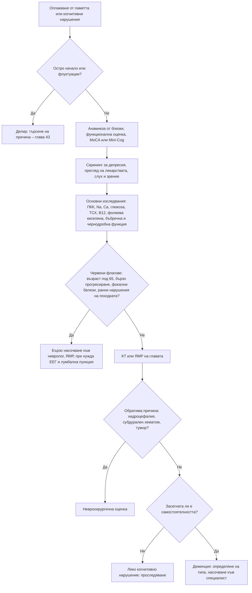

# Глава 44. Когнитивни нарушения и деменция

> **Част IX. Нервна система**

## Цели на главата

- Да се разграничават нормалното стареене, лекото когнитивно нарушение и деменцията.
- Да се откриват обратимите и лечимите причини за когнитивни нарушения.
- Да се разграничават основните типове деменция по клинични белези.
- Да се прилагат скрининговите тестове и основният набор от изследвания.
- Да се разпознават бързо прогресиращата деменция и деменцията в млада възраст като червени флагове.

## Ключови моменти

- Преди диагнозата невродегенеративна деменция се изключват делир, депресия, лекарства, хипотиреоидизъм, дефицит на B12, нормотензивна хидроцефалия и субдурален хематом *(SORT C [7])*.
- Анамнезата от близък човек и функционалната оценка са толкова важни, колкото когнитивният тест. Нормалният резултат от скрининга не изключва деменция *(SORT C [7])*.
- MoCA е по-чувствителен от MMSE за леко когнитивно нарушение и за нарушени изпълнителни функции *(SORT B [5])*.
- Флуктуациите, зрителните халюцинации, нарушението на поведението в REM съня и паркинсонизмът насочват към деменция с телца на Lewy. Антипсихотиците са опасни *(SORT B [3])*.
- Бързо прогресиращата деменция налага насочване към невролог за изключване на болест на Creutzfeldt-Jakob и автоимунен енцефалит *(SORT C [7])*.
- Загубата на слуха е сред най-значимите модифицируеми рискови фактори за деменция *(SORT B [2])*.

---

## 1. Определения

*Таблица 44.1. Определения на когнитивните нарушения.*

| Състояние | Същност |
|---|---|
| **Нормално стареене** | Леко забавяне на обработката на информацията и извличането на спомени („на върха на езика“), без засягане на ежедневните дейности |
| **Леко когнитивно нарушение** | Обективно когнитивно нарушение, по-изразено от очакваното за възрастта, без съществено засягане на самостоятелността в ежедневието |
| **Деменция** (голямо неврокогнитивно разстройство) | Придобит упадък в една или повече когнитивни области (памет, език, изпълнителни функции, внимание, зрително-пространствени способности, социално познание), който нарушава самостоятелността в ежедневните дейности и не се дължи на делир или друго психично заболяване |

---

## 2. Обратими и лечими причини

Преди да се постави диагнозата невродегенеративна деменция, трябва да се изключат:

*Таблица 44.2. Обратими и лечими причини.*

| Причина | Насочващи белези |
|---|---|
| **Депресия** („псевдодеменция“) | Потиснато настроение, отговори „не знам“, оплакване от паметта (по-изразено от обективния дефицит), бързо начало |
| **Делир** | Остро начало, флуктуации, нарушено внимание |
| **Лекарства** | Антихолинергично натоварване, бензодиазепини, опиоиди, антиепилептични средства |
| **Алкохол** | Синдром на Korsakoff (антероградна амнезия, конфабулации), алкохол-свързана деменция |
| **Хипотиреоидизъм** | Забавеност, умора, студоусещане |
| **Дефицит на витамин B12** | Невропатия, атаксия, макроцитоза |
| **Нормотензивна хидроцефалия** | Триада: нарушение на походката („магнитна“ походка с къси стъпки, краката сякаш са залепени за пода) → уринарна инконтиненция → когнитивни нарушения. КТ или ЯМР: вентрикуломегалия, непропорционална на атрофията. Подобрение след евакуационна лумбална пункция [1] |
| **Хроничен субдурален хематом** | Падания, антикоагуланти, алкохол, флуктуиращо объркване, главоболие, хемипареза |
| **Мозъчен тумор** | Особено фронтален – промени в личността, апатия |
| **Инфекции** | Невросифилис, HIV-свързано неврокогнитивно нарушение, болест на Creutzfeldt-Jakob (бързо прогресираща) |
| **Автоимунен енцефалит** | Бързо развиващо се нарушение на паметта, гърчове, психични симптоми, хипонатриемия (LGI1) |
| **Метаболитни** | Хиперкалциемия, хипонатриемия, чернодробна и уремична енцефалопатия |
| **Обструктивна сънна апнея** | Дневна сънливост, хъркане, нарушено внимание |
| **Сензорни дефицити** | Загуба на слуха – водещ модифицируем рисков фактор [2]; нарушено зрение |

---

## 3. Типове деменция

*Таблица 44.3. Типове деменция.*

| Тип | Приблизителен дял | Клинични белези | Образни и други находки |
|---|---|---|---|
| **Болест на Alzheimer** | 60% | Постепенно начало; нарушена епизодична памет в началото (повтаря въпросите, губи предмети); затруднения при намиране на думите; зрително-пространствени нарушения; по-късно апраксия; социалните умения дълго се запазват | Атрофия на хипокампа и медиалния темпорален дял; биомаркери (амилоид, тау) в ликвора, при ПЕТ или в кръвта |
| **Съдова деменция** | 15–20% | Стъпаловидно или постепенно влошаване, нарушени изпълнителни функции, забавеност, нарушения на походката, фокални неврологични белези, съдови рискови фактори, прекарани инсулти | Инфаркти, изразени промени в бялото мозъчно вещество |
| **Деменция с телца на Lewy** | 10–15% | Флуктуации на когнитивните функции и будността; повтарящи се ясни зрителни халюцинации (хора, животни); нарушение на поведението по време на REM съня; паркинсонизъм (появява се едновременно с деменцията или до 1 година след нея); падания, синкопи. Изразена свръхчувствителност към антипсихотици (опасни реакции) | DaT сцинтиграфия (намалено поемане в стриатума), миокардна MIBG сцинтиграфия [3] |
| **Деменция при болест на Parkinson** | – | Паркинсонизъм, предшестващ деменцията с над 1 година | – |
| **Фронтотемпорална деменция** | 5–10% (по-честа преди 65 години) | Поведенчески вариант: дезинхибиция, апатия, загуба на емпатия, компулсивни действия, промени в храненето (хиперорална активност, предпочитание към сладко), запазена памет в началото. Първични прогресиращи афазии. Фамилна анамнеза; връзка с болестта на моторния неврон | Атрофия на фронталните и/или темпоралните дялове [4] |
| **Смесена** | Честа при възрастни хора | Съчетание на белези на болест на Alzheimer и съдова деменция | – |
| **Други** | Редки | Прогресивна супрануклеарна парализа (вертикална парализа на погледа, падания назад в началото), кортикобазален синдром, болест на Huntington (хорея, фамилна анамнеза), болест на Creutzfeldt-Jakob (бързо прогресираща за седмици–месеци, миоклонус, атаксия; ЕЕГ с периодични комплекси, ЯМР с корова дифузионна рестрикция, RT-QuIC в ликвора) | – |

---

## 4. Безопасна диагностична стратегия

*Таблица 44.4. Безопасна диагностична стратегия.*

| Въпрос | Отговор |
|---|---|
| **Вероятна диагноза** | Болест на Alzheimer, съдова деменция, смесена деменция, леко когнитивно нарушение |
| **Сериозни заболявания, които не бива да се пропускат** | Делир; хроничен субдурален хематом; мозъчен тумор; бързо прогресиращи деменции (болест на Creutzfeldt-Jakob, автоимунен енцефалит); нормотензивна хидроцефалия (лечима); неконвулсивен статус; депресия със суициден риск |
| **Чести капани** | Депресия; лекарства (антихолинергични, бензодиазепини); загуба на слуха; дефицит на B12; хипотиреоидизъм; алкохол; обструктивна сънна апнея; деменция с телца на Lewy, лекувана с антипсихотици |
| **Маскиращи заболявания** | Депресия, хипотиреоидизъм, лекарства, анемия, хронично бъбречно заболяване |
| **Психосоциални аспекти** | Самота, социална изолация, пренебрегване, финансова експлоатация, насилие над възрастни хора, изтощение на грижещите се |

---

## 5. Оценка

### 5.1. Анамнеза

- **От пациента И от близките.** Близките често забелязват промените по-рано. Пациентите с болест на Alzheimer често нямат критичност към дефицита си.
- Какво е първото забелязано нарушение? Как е протичането (постепенно, стъпаловидно, бързо, флуктуиращо)?
- **Инструментални ежедневни дейности** (първи се нарушават): управление на финансите, лекарствата, пазаруване, готвене, транспорт, телефон.
- Поведенчески промени, халюцинации, сън (нарушение на поведението по време на REM съня), настроение.
- Падания, нарушения на походката, инконтиненция.
- Лекарства, алкохол, съдови рискови фактори, травми на главата, фамилна анамнеза.
- **Безопасност:** шофиране, готвене (газ), изгубване, финансова уязвимост, оръжие.

### 5.2. Скринингови тестове

*Таблица 44.5. Скринингови тестове за когнитивно нарушение.*

| Тест | Особености | Прагова стойност |
|---|---|---|
| **MMSE** (кратка оценка на психичния статус) | Широко използван; зависи от образованието; малко чувствителен при леко нарушение и нарушени изпълнителни функции | ≤ 24 от 30 точки |
| **MoCA** (Монреалска когнитивна оценка) | По-чувствителен за леко когнитивно нарушение и изпълнителни функции | < 26 от 30 точки (+1 точка при ≤ 12 години образование) [5] |
| **Mini-Cog** | Запомняне на 3 думи + рисуване на часовник; бърз (3 минути) | ≤ 2 от 5 точки [6] |
| **Рисуване на часовник** | Изпълнителни и зрително-пространствени функции | – |

Нормалният резултат от скрининговия тест не изключва деменция. Анамнезата от близък човек може да се допълни със структуриран въпросник [7].

### 5.3. Физикален преглед

Неврологичен преглед (фокални белези, паркинсонизъм, походка, рефлекси, движения на очите), слух и зрение, АН (включително ортостатично), признаци на хипотиреоидизъм, алкохолна болест или невропатия, скрининг за депресия (гериатрична скала за депресия).

### 5.4. Изследвания

- **Основни:** ПКК, натрий, калций, глюкоза, HbA1c, креатинин, чернодробни показатели, ТСХ, витамин B12 и фолиева киселина [7].
- **При показания:** серология за сифилис и HIV.
- **Невроизобразяване:** КТ или (за предпочитане) ЯМР на главата – структурни лезии (тумор, субдурален хематом, нормотензивна хидроцефалия), съдови промени, модел на атрофията.
- **Специализирани:** ПЕТ с флуородезоксиглюкоза (ФДГ-ПЕТ), амилоидна ПЕТ, биомаркери в ликвора (амилоид-β42, фосфорилиран тау), **кръвни биомаркери** (например фосфорилиран тау-217) – само в специализирани звена, с тестове с доказана точност и като част от цялостната оценка [8], DaT сцинтиграфия, ЕЕГ (болест на Creutzfeldt-Jakob, неконвулсивен статус).
- **ЕКГ** преди започване на холинестеразни инхибитори (брадикардия, проводни нарушения).

---

## 6. Червени флагове

- **Възраст под 65 години** (деменция в млада възраст).
- **Бързо прогресиране** за седмици или месеци.
- Фокални неврологични белези, ранни гърчове.
- **Ранно нарушение на походката** (нормотензивна хидроцефалия, съдова деменция).
- **Флуктуации на съзнанието** (делир, деменция с телца на Lewy, субдурален хематом, неконвулсивен статус).
- Главоболие, повръщане, едем на папилата.
- **Миоклонус** (болест на Creutzfeldt-Jakob).
- Системни симптоми, анамнеза за злокачествено заболяване, имуносупресия.
- Фамилна анамнеза за ранна деменция.

---

## 7. Деменция или депресия?

*Таблица 44.6. Деменция или депресия?*

| Белег | Деменция | Депресия („псевдодеменция“) |
|---|---|---|
| Начало | Неуловимо, постепенно | По-бързо, често след житейско събитие |
| Оплакване от паметта | Пациентът го омаловажава; тревожат се близките | Пациентът се оплаква активно, подчертава дефицита |
| Отговори | Опит за отговор, грешки, конфабулации | „Не знам“, отказ от усилие |
| Настроение | Може да е нормално, а при депресия като съпътстващо заболяване е потиснато | Потиснато, анхедония, безнадеждност |
| Ход | Постепенно прогресиране | Колебания, подобрение при лечение на депресията |

Двете състояния често съжителстват. Депресията може да бъде ранен симптом на деменция.

---

## 8. Диагностичен алгоритъм

*Фигура 44.1. Диагностичен алгоритъм: когнитивни нарушения и деменция. Схема на авторите въз основа на източниците, цитирани в главата.*

Текстово описание на фигура 44.1

1. Оплакване от паметта или когнитивни нарушения. Следва: към т. 2.
2. **Въпрос:** Остро начало или флуктуации? Да – към т. 3; Не – към т. 4.
3. Делир: търсене на причина – глава 43.
4. Анамнеза от близки, функционална оценка, MoCA или Mini-Cog. Следва: към т. 5.
5. Скрининг за депресия, преглед на лекарствата, слух и зрение. Следва: към т. 6.
6. Основни изследвания: ПКК, Na, Ca, глюкоза, ТСХ, B12, фолиева киселина, бъбречна и чернодробна функция. Следва: към т. 7.
7. **Въпрос:** Червени флагове: възраст под 65, бързо прогресиране, фокални белези, ранни нарушения на походката? Да – към т. 8; Не – към т. 9.
8. Бързо насочване към невролог, ЯМР, при нужда ЕЕГ и лумбална пункция.
9. КТ или ЯМР на главата. Следва: към т. 10.
10. **Въпрос:** Обратима причина: хидроцефалия, субдурален хематом, тумор? Да – към т. 11; Не – към т. 12.
11. Неврохирургична оценка.
12. **Въпрос:** Засегната ли е самостоятелността? Не – към т. 13; Да – към т. 14.
13. Леко когнитивно нарушение: проследяване.
14. Деменция: определяне на типа, насочване към специалист.

---

## 9. Кога и колко спешно да насочим

*Таблица 44.7. Кога и колко спешно да насочим.*

| Спешност | Клинична ситуация |
|---|---|
| **Незабавно (112 или спешно отделение)** | Остро объркване с нарушено внимание и червени флагове (делир – вж. глава 43); когнитивни нарушения с треска, менингизъм или гърчове |
| **В същия ден** | Подозрение за хроничен субдурален хематом (падания, антикоагуланти, флуктуиращо объркване, главоболие); влошаване за дни |
| **Бързо (до 2 седмици)** | Бързо прогресираща деменция (седмици–месеци) – неврологично звено с възможност за изследване на ликвора [7]; нарушение на походката с инконтиненция (нормотензивна хидроцефалия) [1]; фокални белези или ранни гърчове |
| **Планово** | Подозрение за деменция след изследване на обратимите причини – специализирано звено за оценка на паметта [7]; деменция под 65 години; леко когнитивно нарушение с неясна причина |
| **Проследяване в общата практика** | Леко когнитивно нарушение – повторна оценка; корекция на слуха и зрението; преглед на антихолинергичните лекарства; безопасност (шофиране, газ, финанси) и подкрепа за грижещите се |

---

## 10. Клинични перли

- Когато пациентът сам се оплаква от паметта си, а близките не забелязват проблем, често става дума за тревожност или депресия. Когато близките се тревожат, а пациентът отрича, това е по-типично за деменция.
- Нарушение на походката, инконтиненция и когнитивни нарушения: нормотензивна хидроцефалия. Това е една от малкото лечими деменции.
- Флуктуиращи когнитивни функции, зрителни халюцинации и паркинсонизъм: деменция с телца на Lewy. Избягвайте антипсихотиците.
- Промяна в личността и поведението при човек на 55 години със запазена памет: фронтотемпорална деменция, а не „криза на средната възраст“.
- Деменция, прогресираща за седмици, с миоклонус: болест на Creutzfeldt-Jakob.
- Прегледайте антихолинергичното натоварване. Отстраняването на лекарства може да подобри когнитивните функции.
- Проверете слуха. Корекцията на загубата на слуха е една от най-силните мерки за намаляване на риска от деменция.
- Питайте за шофирането, оръжията, газта и финансите. Безопасността е част от диагнозата.

---

## 11. Клиничен случай

**Етап 1 – клинична картина.** Мъж на 76 години е доведен от дъщеря си. От година походката му е „странна“: ходи с къси, влачещи се стъпки, „сякаш краката му са залепени за пода“. Два пъти е падал. От 6 месеца има внезапни позиви за уриниране и изпуска урина. През последните месеци е по-бавен, по-апатичен и забравя уговорките.

> **Въпрос 1.** Коя триада разпознавате и какво е важно в последователността на симптомите?

**Етап 2 – преглед и изследвания.** MoCA е 21 от 30 точки, с изразени нарушения в изпълнителните функции. Тремор няма, рефлексите са нормални. Основните изследвания са нормални. КТ на главата показва разширени вентрикули с индекс на Evans > 0,3, непропорционално на кортикалната атрофия, и тесни бразди по конвекситета.

> **Въпрос 2.** Как се потвърждава диагнозата?

> **Въпрос 3.** Какъв ефект може да се очаква от лечението?

Обсъждане и отговори

**Отговор 1.** Нарушение на походката, уринарна инконтиненция и когнитивни нарушения от субкортикален тип – триадата на нормотензивната хидроцефалия. Нарушението на походката предшества останалите симптоми, което е типично [1].

**Отговор 2.** Чрез **евакуационна лумбална пункция** (изваждане на 30–50 ml ликвор) с оценка на ходенето преди и след нея [1]. При пациента скоростта на ходене и дължината на крачката се подобряват значително. Той се насочва към неврохирург за вентрикуло-перитонеален шънт.

**Отговор 3.** Най-голям ефект се очаква по отношение на походката. Инконтиненцията и когнитивните нарушения се подобряват по-малко и по-непредсказуемо.

**Поука.** Преди да приемете, че деменцията е необратима, потърсете лечимите причини.

---

## Обобщение

- Деменцията нарушава самостоятелността в ежедневието, а лекото когнитивно нарушение – не. Анамнезата от близки е ключова.
- Обратимите причини – делир, депресия, лекарства, метаболитни нарушения, нормотензивна хидроцефалия и субдурален хематом – се търсят преди диагнозата невродегенеративна деменция.
- Типът деменция се определя по клиничната картина: памет при болестта на Alzheimer, стъпаловиден ход при съдовата, флуктуации и халюцинации при деменцията с телца на Lewy, поведение при фронтотемпоралната.
- Младата възраст, бързото прогресиране, фокалните белези и ранните нарушения на походката са червени флагове.

## Самопроверка

### Въпроси с един верен отговор

**1.** *(основно ниво)* Жена на 78 години има флуктуации в когнитивните функции, повтарящи се ясни зрителни халюцинации на деца в стаята, чести падания и лек паркинсонизъм. Коя е най-вероятната диагноза и какво трябва да се избягва?

- **А.** Болест на Alzheimer – холинестеразни инхибитори
- **Б.** Деменция с телца на Lewy – антипсихотици
- **В.** Фронтотемпорална деменция – антидепресанти
- **Г.** Съдова деменция – антиагреганти
- **Д.** Делир – хидратация

Отговор и обосновка

**Верен отговор: Б.** Флуктуациите, зрителните халюцинации и паркинсонизмът са основни белези на деменцията с телца на Lewy [3]. Антипсихотиците могат да предизвикат тежки реакции.

**2.** *(основно ниво)* Мъж на 58 години от година е с променено поведение: неуместни шеги, апатия, липса на емпатия и прекомерна консумация на сладко. Паметта е относително запазена. Коя е най-вероятната диагноза?

- **А.** Болест на Alzheimer
- **Б.** Поведенчески вариант на фронтотемпорална деменция
- **В.** Деменция с телца на Lewy
- **Г.** Нормотензивна хидроцефалия
- **Д.** Депресия

Отговор и обосновка

**Верен отговор: Б.** Дезинхибицията, апатията, загубата на емпатия и промените в храненето при запазена памет са типични за поведенческия вариант на фронтотемпоралната деменция [4].

**3.** *(основно ниво)* Кой набор от изследвания е подходящ при първоначалната оценка на пациент с подозрение за деменция?

- **А.** Само амилоидна ПЕТ
- **Б.** ПКК, натрий, калций, глюкоза, креатинин, чернодробни показатели, ТСХ, витамин B12 и фолиева киселина
- **В.** Само ЕЕГ
- **Г.** Генетично изследване за APOE
- **Д.** Лумбална пункция при всички

Отговор и обосновка

**Верен отговор: Б.** Основните изследвания търсят обратими причини за когнитивни нарушения [7]. Специализираните изследвания се правят в специализирани звена, ако ще променят поведението.

**4.** *(напреднало ниво)* Мъж на 67 години от 6 седмици има бързо влошаваща се памет, атаксия и миоклонични потрепвания. Кое е правилното поведение?

- **А.** Холинестеразен инхибитор и контрол след 6 месеца
- **Б.** Бързо насочване към неврологично звено с ЯМР, ЕЕГ и изследване на ликвора
- **В.** Антидепресант
- **Г.** Планово насочване към звено за оценка на паметта
- **Д.** Само MoCA след 3 месеца

Отговор и обосновка

**Верен отговор: Б.** Бързо прогресиращата деменция с миоклонус е подозрителна за болест на Creutzfeldt-Jakob. Нужно е неврологично звено с възможност за изследване на ликвора (RT-QuIC) [7]. Трябва да се изключи и автоимунен енцефалит.

**5.** *(напреднало ниво)* Жена на 62 години сама се оплаква, че „забравя всичко“. Съпругът ѝ не забелязва проблем. Тя е самостоятелна, MoCA е 28 от 30 точки, а скалата за депресия е положителна. Кое е най-вероятното обяснение?

- **А.** Ранна болест на Alzheimer
- **Б.** Субективни оплаквания от паметта при депресия и тревожност
- **В.** Фронтотемпорална деменция
- **Г.** Болест на Creutzfeldt-Jakob
- **Д.** Нормотензивна хидроцефалия

Отговор и обосновка

**Верен отговор: Б.** Активното оплакване от паметта при липса на загриженост у близките, нормалният тест и положителният скрининг за депресия насочват към депресия и тревожност. Депресията се лекува, а когнитивните функции се оценяват отново.

### Задача

Мъж на 72 години забравя имена и се бави при намиране на думите. MoCA е 23 от 30 точки (с 16 години образование), но той продължава да управлява сам финансите си, да шофира и да пазарува. Основните изследвания са нормални. Как ще тълкувате състоянието и какво ще направите?

Решение

Налице е обективно когнитивно нарушение без засягане на самостоятелността – **леко когнитивно нарушение**, а не деменция. Лекуват се рисковите фактори: слух, зрение, хипертония, физическа активност, социални контакти [2]. Преглеждат се лекарствата с антихолинергично действие и се търси депресия. Повторна оценка се прави след 6–12 месеца. При прогресия, засягане на ежедневните дейности или несигурност пациентът се насочва към специализирано звено за оценка на паметта [7].

### OSCE станция: Анамнеза от близък при подозрение за деменция

**Време:** 8 минути. **Ниво:** основно (студенти, специализанти).

**Задача за кандидата.** Дъщерята на жена на 80 години съобщава, че майка ѝ „започна да забравя“. Снемете анамнеза от дъщерята.

**Информация за симулирания пациент (за изпитващия).** Майката живее сама, два пъти е оставила котлона включен и е платила два пъти една и съща сметка. Паметта се влошава постепенно от година.

*Таблица 44.8. OSCE станция „Анамнеза от близък при подозрение за деменция“ – критерии за оценяване.*

| Критерий | Точки |
|---|---|
| Пита кое е първото забелязано нарушение и как е протичало (постепенно, стъпаловидно, бързо, флуктуиращо) | 2 |
| Пита за инструменталните ежедневни дейности: финанси, лекарства, пазаруване, готвене, телефон | 2 |
| Пита за поведение, халюцинации, сън и настроение | 1 |
| Пита за падания, походка и инконтиненция | 1 |
| Пита за лекарства, алкохол, съдови рискови фактори и фамилна анамнеза | 1 |
| Оценява безопасността: газ, котлон, шофиране, изгубване, финансова уязвимост | 2 |
| Обяснява следващите стъпки и проверява разбирането | 1 |
| **Общо** | **10** |

**Праг за успешно изпълнение:** 7 от 10 точки, включително оценката на безопасността.

## Литература

1. Nakajima M, Yamada S, Miyajima M, Ishii K, Kuriyama N, Kazui H, et al. Guidelines for Management of Idiopathic Normal Pressure Hydrocephalus (Third Edition): Endorsed by the Japanese Society of Normal Pressure Hydrocephalus. Neurol Med Chir (Tokyo). 2021;61(2):63-97. doi:10.2176/nmc.st.2020-0292. PMID: 33455998.
2. Livingston G, Huntley J, Liu KY, Costafreda SG, Selbæk G, Alladi S, et al. Dementia prevention, intervention, and care: 2024 report of the Lancet standing Commission. Lancet. 2024;404(10452):572-628. doi:10.1016/S0140-6736(24)01296-0. PMID: 39096926.
3. McKeith IG, Boeve BF, Dickson DW, Halliday G, Taylor JP, Weintraub D, et al. Diagnosis and management of dementia with Lewy bodies: Fourth consensus report of the DLB Consortium. Neurology. 2017;89(1):88-100. doi:10.1212/WNL.0000000000004058. PMID: 28592453.
4. Rascovsky K, Hodges JR, Knopman D, Mendez MF, Kramer JH, Neuhaus J, et al. Sensitivity of revised diagnostic criteria for the behavioural variant of frontotemporal dementia. Brain. 2011;134(Pt 9):2456-77. doi:10.1093/brain/awr179. PMID: 21810890.
5. Nasreddine ZS, Phillips NA, Bédirian V, Charbonneau S, Whitehead V, Collin I, et al. The Montreal Cognitive Assessment, MoCA: a brief screening tool for mild cognitive impairment. J Am Geriatr Soc. 2005;53(4):695-9. doi:10.1111/j.1532-5415.2005.53221.x. PMID: 15817019.
6. Borson S, Scanlan J, Brush M, Vitaliano P, Dokmak A. The mini-cog: a cognitive 'vital signs' measure for dementia screening in multi-lingual elderly. Int J Geriatr Psychiatry. 2000;15(11):1021-7. doi:10.1002/1099-1166(200011)15:11<1021::aid-gps234>3.0.co;2-6. PMID: 11113982.
7. National Institute for Health and Care Excellence. Dementia: assessment, management and support for people living with dementia and their carers (NICE guideline NG97). London: NICE; 2018. Достъпно на: https://www.nice.org.uk/guidance/ng97
8. Palmqvist S, Whitson HE, Allen LA, Suarez-Calvet M, Galasko D, Karikari TK, et al. Alzheimer's Association Clinical Practice Guideline on the use of blood-based biomarkers in the diagnostic workup of suspected Alzheimer's disease within specialized care settings. Alzheimers Dement. 2025;21(7):e70535. doi:10.1002/alz.70535. PMID: 40729527.

*Последна проверка на съдържанието: септември 2026 г. Следващ планиран преглед: септември 2027 г. (вж. „Политика за актуализация“ в README).*

<!-- навигация -->

---

[← Глава 43. Нарушено съзнание, кома и делир](43-saznanie-delir.md) · [Съдържание](../README.md) · [Глава 45. Остър фокален неврологичен дефицит: инсулт и имитатори →](45-insult.md)
