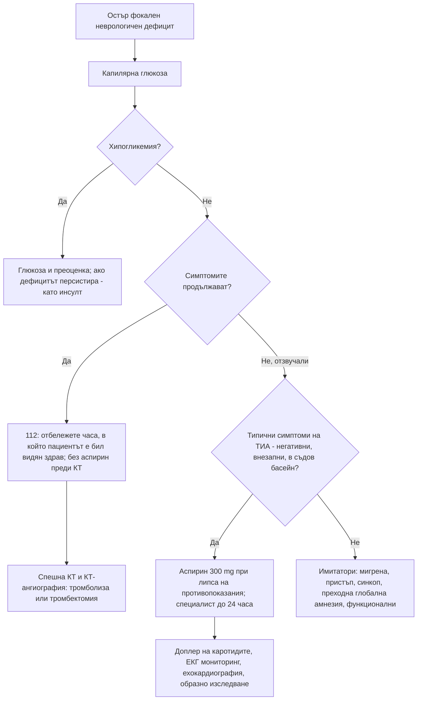

# Глава 45. Остър фокален неврологичен дефицит: инсулт и имитатори

> **Част IX. Нервна система**

## Цели на главата

- Да се разпознава бързо мозъчният инсулт (BE-FAST, скала ROSIER) и да се действа незабавно.
- Да се локализира лезията по съдовите синдроми.
- Да се разграничава ТИА от преходните неисхемични състояния.
- Да се разпознават имитаторите на инсулта и „хамелеоните“ — инсултите с нетипична картина.
- Да се разграничава периферната от централната пареза на лицевия нерв.
- Да се изброяват причините за инсулт в млада възраст (дисекация, кардиоемболия, тромбофилия, вещества) и изследванията за тях.

---

## 1. Разпознаване на инсулта

### 1.1. BE-FAST

| Буква | Белег |
|---|---|
| **B** (*balance*) | Внезапна загуба на равновесие, атаксия |
| **E** (*eyes*) | Внезапна загуба на зрение, двойно виждане |
| **F** (*face*) | Изкривяване на лицето |
| **A** (*arm*) | Слабост в ръката (или крака) |
| **S** (*speech*) | Нарушен говор |
| **T** (*time*) | Време — **незабавно обаждане на 112** и отбелязване на часа, в който пациентът е бил видян здрав за последно |

### 1.2. Скала ROSIER (за спешни условия)

| Белег | Точки |
|---|---|
| Загуба на съзнание или синкоп | −1 |
| Гърч | −1 |
| Асиметрична слабост на лицето | +1 |
| Асиметрична слабост на ръката | +1 |
| Асиметрична слабост на крака | +1 |
| Нарушение на говора | +1 |
| Дефект в зрителното поле | +1 |

**Сбор > 0** — инсултът е вероятен. Преди оценката трябва да се **изключи хипогликемия**.

**„Времето е мозък.“** Реперфузионното лечение (интравенозна тромболиза и механична тромбектомия) е ефективно само в определени времеви прозорци. Тромболизата се прилага до 4,5 часа, а при подбор чрез образни изследвания и по-късно. Тромбектомията при оклузия на голям съд се прилага до 24 часа при подбрани пациенти. **Всяко забавяне намалява шанса за добро възстановяване.**

---

## 2. Видове инсулт

| Вид | Дял | Основни механизми |
|---|---|---|
| **Исхемичен** | ≈ 85% | Атеросклероза на големите артерии (каротиди); **кардиоемболия** (**предсърдно мъждене**, тромб в лявата камера, ендокардит, клапни протези); **заболяване на малките съдове** (лакунарни инфаркти — хипертония, диабет); други уточнени причини (**дисекация**, васкулити, тромбофилии, отворен овален прозорец); криптогенен |
| **Интрацеребрален кръвоизлив** | ≈ 10–15% | **Хипертония** (базални ганглии, таламус, мост, малък мозък); **церебрална амилоидна ангиопатия** (лобарни кръвоизливи при възрастни хора); **антикоагуланти**; артериовенозни малформации; тумори; кокаин |
| **Субарахноидален кръвоизлив** | ≈ 5% | Разкъсване на аневризма (вж. глава 40) |

**Кръвоизливът не може да се разграничи клинично от исхемичния инсулт.** Задължителна е спешна КТ. Главоболието, повръщането и нарушеното съзнание са по-чести при кръвоизлив, но не са надеждни.

---

## 3. Съдови синдроми

| Съдов басейн | Клинична картина |
|---|---|
| **Средна церебрална артерия** | Контралатерална слабост и сетивен дефицит, **по-изразени в лицето и ръката**; **афазия** (при доминантното полукълбо); **неглект** (при недоминантното полукълбо); отклонение на погледа към страната на лезията; хомонимна хемианопсия |
| **Предна церебрална артерия** | Контралатерална слабост, **по-изразена в крака**; абулия; инконтиненция |
| **Задна церебрална артерия** | **Контралатерална хомонимна хемианопсия**; алексия без аграфия; нарушения на паметта (двустранно засягане) |
| **Вертебробазиларен басейн** | Световъртеж, **двойно виждане**, **дизартрия**, **дисфагия**, **атаксия**, кръстосан дефицит (черепномозъчни нерви на едната страна и крайници на другата), двустранни симптоми, нарушено съзнание; при базиларна тромбоза — кома или синдром „заключен в себе си“ |
| **Латерален медуларен синдром (Wallenberg)** | Ипсилатерално: нарушена сетивност на лицето, синдром на Horner, атаксия, дисфагия, дрезгав глас. Контралатерално: нарушена болкова и температурна сетивност на тялото. Световъртеж, хълцане |
| **Малък мозък** | Световъртеж, повръщане, **невъзможност за ходене**, атаксия; риск от оток и компресия на мозъчния ствол |
| **Лакунарни синдроми** | Чисто моторна хемипареза; чисто сетивен инсулт; атактична хемипареза; синдром „дизартрия и тромава ръка“. **Без** кортикални белези (афазия, неглект, хемианопсия) |

---

## 4. Транзиторна исхемична атака (ТИА)

- **Определение:** преходна неврологична дисфункция, причинена от огнищна исхемия на мозъка, гръбначния мозък или ретината, **без** остър инфаркт при образното изследване. Симптомите обикновено отзвучават за **под един час**.
- **Рискът от инсулт** е висок, особено в **първите 48 часа**.
- **Поведение:** при съмнение за ТИА британските препоръки (NICE) предвиждат незабавно аспирин 300 mg (при липса на противопоказания и ако пациентът не е на антикоагуланти) и **оценка от специалист до 24 часа**. Точковият сбор ABCD2 **вече не се препоръчва** за определяне на спешността.
- **Преходна монокуларна слепота** (*amaurosis fugax*) — „завеса, която се спуска“ пред едното око за минути. Насочва към **стеноза на вътрешната каротидна артерия**. При възрастни хора трябва да се изключи **гигантоклетъчен артериит**.
- **„Кресчендо“ ТИА** — многократни атаки за кратко време. Спешно състояние.

**Симптоми, които сами по себе си обикновено НЕ са ТИА:**

- изолиран световъртеж или замайване;
- синкоп, загуба на съзнание;
- изолирано объркване или загуба на паметта (преходна глобална амнезия);
- падания без слабост;
- инконтиненция;
- **позитивни симптоми**, които се разпространяват постепенно (изтръпване, трептящи светлини) — мигренозна аура;
- „маршируващи“ сетивни симптоми — епилептичен пристъп.

---

## 5. Имитатори на инсулта

Около една четвърт от случаите, подозирани за инсулт, се оказват други заболявания:

| Имитатор | Насочващи белези |
|---|---|
| **Хипогликемия** | Лечение с инсулин или сулфонилурейни производни, изпотяване; **дефицитът изчезва след глюкоза** |
| **Епилептичен пристъп с постиктална парализа на Todd** | Пристъп пред свидетел, анамнеза за епилепсия, постепенно подобрение за часове |
| **Мигрена с аура** (включително хемиплегична) | Позитивни, разпространяващи се симптоми, последвани от главоболие; подобни епизоди в миналото |
| **Функционално неврологично разстройство** | Непоследователност, положителен белег на Hoover, непостоянни находки |
| **Инфекция или метаболитни нарушения, „съживяващи“ стар дефицит** | Анамнеза за инсулт в същата територия, треска, хипонатриемия |
| **Мозъчен тумор, субдурален хематом** | Постепенно начало, главоболие, падания, антикоагуланти |
| **Пареза на Bell** | Засегнато е **и челото** (периферна пареза) |
| **Периферни невропатии** | Пареза на *n. radialis* („събота вечер“) — „увиснала“ китка; пареза на *n. peroneus* — „увиснало“ стъпало |
| **Енцефалопатии** | Wernicke, чернодробна, уремична, хипертонична енцефалопатия, синдром на задната обратима енцефалопатия |
| **Множествена склероза** | Млади хора, развитие за дни, предишни епизоди |
| **Вестибуларен неврит, преходна глобална амнезия, синкоп** | Вж. съответните глави |

### 5.1. „Хамелеони“ — инсулт с нетипична картина

- **Изолиран световъртеж** (инсулт в малкия мозък).
- **Остро объркване** (засягане на недоминантния париетален дял или таламуса).
- **Изолирана афазия**, сбъркана с объркване.
- Остра загуба на зрението в едното око или хомонимна хемианопсия, неосъзната от пациента.
- Атаксия на един крайник.
- **Болка в гърдите с неврологичен дефицит** — **дисекация на аортата**, обхващаща каротидните артерии. **Тромболизата е противопоказана.**

---

## 6. Пареза на лицевия нерв: централна или периферна?

| Белег | Централна (инсулт, тумор) | Периферна (пареза на Bell) |
|---|---|---|
| Засегната област | Долната половина на лицето; **челото е пощадено** (двустранна кортикална инервация) | **Цялата половина на лицето, включително челото** |
| Затваряне на окото | Запазено | Нарушено (белег на Bell — окото се завърта нагоре) |
| Други симптоми | Слабост в ръката, дизартрия, афазия | Болка зад ухото, хиперакузия, нарушен вкус, сълзене |

**Червени флагове при периферна пареза на лицевия нерв:**

- **двустранна** пареза (лаймска болест, синдром на Guillain-Barré, саркоидоза, HIV, левкемия);
- **рецидивираща** или **бавно прогресираща** (над 3 седмици) — тумор;
- засягане на **други черепномозъчни нерви**;
- **везикули в ухото** или по небцето (**синдром на Ramsay Hunt**);
- **формация в паротидната жлеза**;
- **гноен отит или холестеатом**;
- **липса на подобрение** след 3–4 месеца;
- **ухапване от кърлеж** или мигриращ еритем (лаймска болест).

---

## 7. Инсулт в млада възраст (под 50 години)

- **Дисекация на каротидна или вертебрална артерия** — болка в шията, синдром на Horner; след травма, манипулация на шията или спорт.
- **Отворен овален прозорец** с парадоксална емболия.
- **Антифосфолипиден синдром**, други тромбофилии, бременност и следродилен период.
- **Кокаин, амфетамини.**
- Васкулити, синдром на обратимата церебрална вазоконстрикция.
- **Тромбоза на венозните синуси.**
- Сърдечни източници: ендокардит, кардиомиопатии, миксом.
- Болест на Fabry, CADASIL (мигрена, промени в настроението, изразени промени в бялото вещество, фамилна анамнеза), болест на Moyamoya.
- **Комбинацията от тютюнопушене, орални контрацептиви и мигрена с аура.**

---

## 8. Безопасна диагностична стратегия

| Въпрос | Отговор |
|---|---|
| **Вероятна диагноза** | Исхемичен инсулт, ТИА, интрацеребрален кръвоизлив |
| **Сериозни заболявания, които не бива да се пропускат** | **Инсулт с оклузия на голям съд** (подходящ за тромбектомия); **интрацеребрален кръвоизлив**; **субарахноидален кръвоизлив**; **дисекация на аортата** с неврологичен дефицит; **базиларна тромбоза**; **инфаркт в малкия мозък** с оток; тромбоза на венозните синуси; **гигантоклетъчен артериит** с преходна слепота; ендокардит (септична емболия — тромболизата е противопоказана) |
| **Чести капани** | **Хипогликемия**; парализа на Todd; мигрена с аура; хроничен субдурален хематом; изолиран световъртеж или объркване като проява на инсулт; ТИА, оценена като „нищо сериозно“, защото симптомите са отзвучали; пареза на Bell, сбъркана с инсулт (и обратното) |
| **Маскиращи заболявания** | Захарен диабет (хипогликемия), лекарства, инфекции („съживяване“ на стар дефицит), хипонатриемия |
| **Психосоциални аспекти** | Функционално неврологично разстройство, злоупотреба с вещества (кокаин) |

---

## 9. Изследвания

- **Капилярна глюкоза** — веднага.
- **Безконтрастна КТ** — изключване на кръвоизлив.
- **КТ-ангиография** — оклузия на голям съд; каротидните и вертебралните артерии.
- КТ перфузия или ЯМР — при неизвестно време на начало и късно пристигане.
- **ЕКГ** (предсърдно мъждене), ПКК, коагулация, електролити, креатинин, липиди, HbA1c.
- **Доплерова ехография на каротидите** — при инсулт и ТИА в каротидния басейн (при значима симптомна стеноза каротидната ендартеректомия е показана до 2 седмици).
- **Ехокардиография** (трансторакална, при нужда трансезофагеална).
- **Продължителен ЕКГ мониторинг** за пароксизмално предсърдно мъждене.
- При млади пациенти: изследвания за тромбофилия, антифосфолипидни антитела, васкулити, токсикологичен скрининг, изследване за отворен овален прозорец.

---

## 10. Диагностичен алгоритъм

---

## 11. Особености в общата практика

- При подозрение за остър инсулт **не губете време** с изследвания в кабинета. Обадете се на 112. Отбележете **часа, в който пациентът е бил видян здрав за последно**, лекарствата (особено антикоагулантите) и телефона на близките.
- **Не давайте аспирин** при остър инсулт преди КТ. Причината може да е кръвоизлив.
- При ТИА насочете спешно за оценка до 24 часа. Отзвучаването на симптомите не означава, че пациентът е в безопасност.
- Информирайте пациента за ограниченията при шофиране след ТИА и инсулт според действащите разпоредби.

---

## 12. Клинични перли

- Първо глюкоза, после всичко останало. Хипогликемията може да предизвика хемипареза и афазия.
- Челото е пощадено при централна пареза на лицевия нерв и засегнато при периферна.
- Преходната слепота на едното око при човек над 50 години изисква изключване както на каротидна стеноза, така и на гигантоклетъчен артериит.
- Внезапен неврологичен дефицит с болка в гърдите или гърба: мислете за дисекация на аортата преди тромболизата.
- Млад човек с инсулт и болка в шията: дисекация.
- Треска, нов сърдечен шум и инсулт: септична емболия при ендокардит.
- Възрастен пациент на антикоагуланти с главоболие и нов дефицит: кръвоизлив, докато не се докаже противното.
- Двустранна пареза на лицевия нерв в ендемичен район: лаймска болест.

---

## 13. Клиничен случай

**Случай.** Съпругата на мъж на 58 години с диабет тип 2, лекуван с инсулин, го намира в 7 ч. сутринта объркан, неспособен да говори и с отслабена дясна ръка. Вечерта е бил добре, но е пропуснал вечерята. Екипът на спешната помощ измерва капилярна глюкоза 1,9 mmol/l.

**Въпроси.** 1) Какво е следващото действие? 2) Кога трябва да се мисли и за инсулт?

**Обсъждане.** **Хипогликемията** може да имитира инсулт — хемипареза, афазия, объркване. Прилага се глюкоза интравенозно. След 10 минути говорът и силата в ръката се възстановяват напълно. **Ако дефицитът персистира** след нормализиране на глюкозата, пациентът трябва да се оцени незабавно за инсулт, защото двете състояния могат да съществуват едновременно. Причината за хипогликемията (пропуснатата вечеря при непроменена доза инсулин) се обсъжда с пациента, а лечението се коригира.

**Поука.** Всеки пациент с остър неврологичен дефицит трябва да има измерена глюкоза, преди да се постави диагноза инсулт.

<!-- навигация -->

---

[← Глава 44. Когнитивни нарушения и деменция](44-dementsia.md) · [Съдържание](../README.md) · [Глава 46. Мускулна слабост →](46-muskulna-slabost.md)
