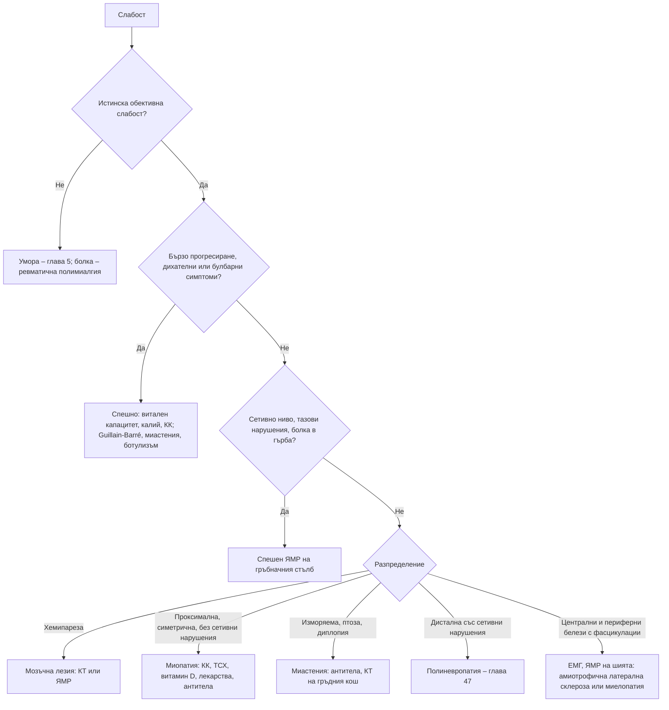

# Глава 46. Мускулна слабост

> **Част IX. Нервна система**

## Цели на главата

- Да се разграничава истинската мускулна слабост от умората и от болката.
- Да се локализира лезията по разпределението на слабостта, рефлексите и сетивните нарушения.
- Да се разпознават спешните състояния: синдром на Guillain-Barré, миастенна криза, ботулизъм, компресия на гръбначния мозък, рабдомиолиза.
- Да се познават причините за миопатия, включително лекарствените и ендокринните.
- Да се разпознава функционалната слабост по позитивни белези.

## Ключови моменти

- Първо се разграничава истинската слабост от умората и болката. Разпределението на слабостта, рефлексите и сетивността локализират лезията.
- Острата възходяща слабост с арефлексия е синдром на Guillain-Barré до доказване на противното. Дишането се следи с витален капацитет, защото SpO₂ спада късно *(SORT C [1])*.
- Низходящата парализа с разширени зеници и запазено съзнание насочва към ботулизъм *(SORT C [3])*.
- Болка в гърба със слабост в краката, сетивно ниво или задръжка на урина при злокачествено заболяване изисква ЯМР на целия гръбначен стълб до 24 часа *(SORT C [4])*.
- Слабост, която продължава след спиране на статина, с много висока КК насочва към имуномедиирана некротизираща миопатия *(SORT B [6])*.
- Функционалната слабост се диагностицира по позитивни белези, например белега на Hoover *(SORT C [8])*.

---

## 1. Истинска слабост или умора?

- **Истинската слабост** е обективно намалена мускулна сила. Пациентът не може да изпълни конкретни движения: да стане от стол, да се изкачи по стълби, да вдигне ръце над главата, да държи чаша, да ходи на пети или на пръсти.
- **Умората и астенията** са липса на енергия при запазена сила (вж. глава 5).
- **Болката** може да ограничи движението и да „имитира“ слабост. Например ревматичната полимиалгия протича с болка и скованост, а не с истинска слабост.

---

## 2. Локализация на лезията

*Таблица 46.1. Локализация на лезията.*

| Ниво | Разпределение на слабостта | Тонус и рефлекси | Сетивност | Други белези |
|---|---|---|---|---|
| **Главен мозък** | Хемипареза (лице, ръка, крак от едната страна) | Спастичност, хиперрефлексия, симптом на Babinski (след острата фаза) | Често засегната | Кортикални белези (афазия, неглект) |
| **Гръбначен мозък** | Пара- или тетрапареза | Спастичност, хиперрефлексия под нивото (в острата фаза – вяла) | **Сетивно ниво** | **Нарушения на тазовите резервоари** |
| **Предни рога (мотоневрони)** | Асиметрична, дистална или булбарна | Съчетание на централни и периферни белези (амиотрофична латерална склероза) | **Запазена** | Фасцикулации, атрофия |
| **Нервни коренчета** | В миотома | Намален рефлекс в сегмента | В дерматома | Радикулерна болка |
| **Периферни нерви** | Дистална (полиневропатия) или в зоната на един нерв | **Намалени или липсващи рефлекси** | Засегната | Атрофия |
| **Нервно-мускулен синапс** | Изморяема, очна (птоза, диплопия), булбарна, проксимална | Нормални (при миастения) | **Запазена** | Засилване при повторение и вечер |
| **Мускули** | **Проксимална, симетрична** | Нормални (намалени в късен стадий) | **Запазена** | Болезненост, повишена креатинкиназа (КК) (при някои) |

---

## 3. Безопасна диагностична стратегия

*Таблица 46.2. Безопасна диагностична стратегия.*

| Въпрос | Отговор |
|---|---|
| **Вероятна диагноза** | Лекарствена миопатия (статини, кортикостероиди), хипокалиемия, хипотиреоидизъм, неврологични последици от инсулт, полиневропатия, детренираност |
| **Сериозни заболявания, които не бива да се пропускат** | Синдром на Guillain-Barré; миастенна криза; ботулизъм; компресия на гръбначния мозък (метастази, епидурален абсцес, хематом); трансверзален миелит; инсулт в мозъчния ствол; тежка хипо- или хиперкалиемия; рабдомиолиза; амиотрофична латерална склероза; възпалителни миопатии (с асоциирано злокачествено заболяване); миокардит и миозит от инхибитори на имунните контролни точки |
| **Чести капани** | Статин-свързана имуномедиирана некротизираща миопатия (персистира след спиране на статина); кортикостероидна миопатия (нормална КК); остеомалация (дефицит на витамин D); хипотиреоидна миопатия; тиреотоксична периодична парализа; функционална слабост; нервно-мускулна слабост, приета за „задух от сърдечен произход“; лекарства, влошаващи миастенията |
| **Маскиращи заболявания** | Лекарства, заболявания на щитовидната жлеза, захарен диабет, злокачествени заболявания (паранеопластични синдроми), депресия |
| **Психосоциални аспекти** | Функционално неврологично разстройство, депресия, детренираност |

---

## 4. Остра генерализирана слабост: спешни състояния

*Таблица 46.3. Остра генерализирана слабост: спешни състояния.*

| Състояние | Ключови белези | Изследвания |
|---|---|---|
| **Синдром на Guillain-Barré** | Възходяща слабост за дни, арефлексия, парестезии в дланите и стъпалата, болка в гърба, 1–4 седмици след инфекция (особено *Campylobacter* – диария), вегетативна нестабилност; риск от дихателна недостатъчност | Форсиран витален капацитет (при < 20 ml/kg – интензивно отделение); лумбална пункция (белтъчно-клетъчна дисоциация, може да е нормална през първата седмица); електромиография [1] |
| **Миастенна криза** | Известна миастения или нова: влошаване на булбарните симптоми (дисфагия, дизартрия), слабост на шията, задух; провокира се от инфекции и лекарства | Форсиран витален капацитет, газов анализ; антитела срещу ацетилхолиновия рецептор [2] |
| **Ботулизъм** | Низходяща парализа: двойно виждане, птоза, разширени зеници, дисфагия, дизартрия, после крайниците и дишането; сухота в устата, запек; запазено съзнание и сетивност; домашни консерви (особено зеленчукови и месни), рани при инжекционна употреба на наркотици | Клинична диагноза, токсин в серума и изпражненията; спешно уведомяване на здравните власти, антитоксин [3] |
| **Компресия на гръбначния мозък** | Болка в гърба, слабост в краката, сетивно ниво, задръжка на урина, запек; анамнеза за злокачествено заболяване (метастази), треска (епидурален абсцес), антикоагуланти (хематом) | Спешен ЯМР на целия гръбначен стълб (до 24 часа при неврологична симптоматика) [4] |
| **Трансверзален миелит** | Двустранна слабост, сетивно ниво, тазови нарушения за часове до дни, често след инфекция | ЯМР, лумбална пункция |
| **Хипокалиемия и хиперкалиемия** | Вяла слабост; тиреотоксична периодична парализа (млади мъже, особено от азиатски произход, след въглехидратна храна и почивка след усилие); фамилни периодични парализи | Калий, ЕКГ, ТСХ |
| **Рабдомиолиза** | Болки в мускулите, слабост, тъмна урина, КК > 5 пъти над горната граница (обикновено хиляди); причини – травма, продължително лежане, усилие, лекарства (статини с фибрати или с инхибитори на CYP3A4), алкохол, кокаин, хипокалиемия, инфекции, топлинен удар | КК, креатинин, калий, урина (кръв на лентата без еритроцити) [5] |
| **Инсулт в мозъчния ствол** | Кръстосан дефицит, засягане на черепномозъчните нерви | ЯМР |
| **Отравяне с органофосфати** | Холинергичен синдром, после слабост („междинен синдром“) | Холинестераза |
| **Западнонилска треска** (невроинвазивна форма) | Треска, енцефалит, вяла асиметрична парализа (подобна на полиомиелит); ендемична в България, лятото | Серология, ЯМР |
| **Други** | Хипофосфатемия, хипермагнезиемия, остра интермитентна порфирия (моторна невропатия), полиневропатия и миопатия при критично болни | – |

---

## 5. Миопатии

*Таблица 46.4. Причини за миопатия.*

| Група | Заболявания и белези |
|---|---|
| **Възпалителни** | Дерматомиозит – хелиотропен (виолетов) обрив по клепачите, папули на Gottron по кокалчетата, обрив по „шала“ и деколтето; при възрастни – свързан със злокачествени заболявания (яйчник, бял дроб, стомашно-чревен тракт) – необходим е скрининг. Антисинтетазен синдром – интерстициална белодробна болест, „ръце на механик“, артрит, анти-Jo-1. Миозит с включвания – след 50 години, бавно, асиметрично; засяга квадрицепса и флексорите на пръстите |
| **Имуномедиирана некротизираща миопатия** | Свързана със статини (антитела срещу HMG-CoA редуктазата) – персистира и прогресира след спиране на статина; много висока КК; анти-SRP [6] |
| **Лекарствени и токсични** | Статини (миалгия, миопатия, рабдомиолиза; по-висок риск при фибрати, инхибитори на CYP3A4, хипотиреоидизъм, ХБЗ) [7]; кортикостероиди (проксимална слабост при нормална КК); колхицин (особено при бъбречна недостатъчност); алкохол; хидроксихлорохин; зидовудин; инхибитори на имунните контролни точки (миозит, често съчетан с миокардит и миастенен синдром) |
| **Ендокринни** | Хипотиреоидизъм (повишена КК, крампи, забавени рефлекси); хипертиреоидизъм; синдром на Cushing; остеомалация (дефицит на витамин D – проксимална слабост, болки в костите, „патешка“ походка, повишена алкална фосфатаза); хиперпаратиреоидизъм |
| **Електролитни** | Хипокалиемия, хипокалциемия, хипофосфатемия, хипомагнезиемия |
| **Инфекциозни** | Вирусен миозит (грип – болки в прасците при деца), HIV, трихинелоза (миалгии, периорбитален оток, еозинофилия – консумация на свинско месо и месо от дива свиня) |
| **Наследствени** | Мускулни дистрофии (Duchenne, Becker, фацио-скапуло-хумерална, поясно-крайникова); миотонична дистрофия (миотония при стискане на ръка, птоза, фронтално оплешивяване, катаракта, сърдечни проводни нарушения); метаболитни миопатии (болест на McArdle – непоносимост към усилие, „втори дъх“); митохондриални миопатии |

Ревматичната полимиалгия протича с болка и скованост на раменния и тазовия пояс, без истинска слабост, при нормална КК и висока СУЕ (вж. глава 54). Миозитът протича с истинска слабост и повишена КК.

---

## 6. Миастения гравис

- **Изморяема слабост**, която се засилва при повторение и вечер.
- **Очни симптоми:** птоза (често асиметрична), двойно виждане. При около половината от пациентите заболяването започва с очни симптоми.
- **Булбарни симптоми:** дизартрия (назален говор), дисфагия, изморяване при дъвчене.
- Слабост на шията и проксималната мускулатура.
- **Рефлексите, сетивността и зениците са нормални.**
- **Изследвания:** антитела срещу ацетилхолиновия рецептор (при около 85% от генерализираните форми), срещу MuSK, срещу LRP4; повтаряща се нервна стимулация, едновлакнеста електромиография; КТ на гръдния кош (тимом); функция на щитовидната жлеза. Тест с лед при птоза – подобрение след 2 минути охлаждане на клепача.
- **Лекарства, които влошават миастенията:** аминогликозиди, флуорохинолони, макролиди, бета-блокери, магнезий (интравенозно), хинин, инхибитори на имунните контролни точки, ботулинов токсин, някои анестетици.

**Синдром на Lambert-Eaton:** проксимална слабост на краката, намалени рефлекси, които се подобряват след кратко усилие, вегетативни симптоми (сухота в устата, еректилна дисфункция); свързан е с дребноклетъчен карцином на белия дроб; антитела срещу потенциал-зависимите калциеви канали.

---

## 7. Амиотрофична латерална склероза (болест на моторния неврон)

- Прогресираща слабост с комбинация от централни белези (спастичност, хиперрефлексия) и периферни белези (атрофия, фасцикулации).
- Засягане на езика (атрофия, фасцикулации), булбарни симптоми.
- **Сетивността и тазовите резервоари са запазени.**
- Възможна е съпътстваща фронтотемпорална деменция.
- **Диференциална диагноза:** шийна спондилотична миелопатия с радикулопатия (много важна – лечима), мултифокална моторна невропатия (лечима), миозит с включвания, миастения (при булбарна форма).

---

## 8. Функционална слабост

**Позитивни белези**:

- **белег на Hoover** – слабата екстензия на бедрото се възстановява при флексия на противоположното бедро срещу съпротива;
- слабост „на отказване“ (*give-way*);
- непостоянна слабост, която зависи от вниманието;
- отклонение на ръката надолу без пронация;
- несъответствие между прегледа и функционалните възможности.

Функционалната слабост е реално, често инвалидизиращо състояние. Тя не е симулация. Диагнозата се поставя по позитивни белези, а не само чрез изключване [8].

---

## 9. Червени флагове

- **Бързо прогресиране** (часове–дни).
- **Дихателни симптоми**: задух, **ортопнея** (слабост на диафрагмата), слаба кашлица, парадоксално дишане, нисък форсиран витален капацитет.
- **Булбарни симптоми**: дисфагия, дизартрия, задавяне (риск от аспирация).
- Сетивно ниво, нарушения на тазовите резервоари, болка в гърба.
- Вегетативна нестабилност (аритмии, лабилно АН).
- Много висока КК, тъмна урина (рабдомиолиза, остро бъбречно увреждане).
- Тежка хипо- или хиперкалиемия.
- Треска със слабост.
- Анамнеза за злокачествено заболяване.
- Разширени зеници с низходяща парализа (ботулизъм).

---

## 10. Изследвания

- **КК**, електролити (K, Ca, Mg, P), глюкоза, креатинин, чернодробни ензими, ТСХ, СУЕ и CRP, витамин D, алкална фосфатаза.
- Урина (миоглобинурия).
- **Форсиран витален капацитет** (при остра генерализирана слабост).
- Антитела: срещу ацетилхолиновия рецептор и MuSK, миозит-специфични, срещу HMG-CoA редуктазата.
- **Електромиография и неврография.**
- **ЯМР** (главен мозък, гръбначен мозък, мускули).
- Мускулна биопсия.
- Лумбална пункция (синдром на Guillain-Barré, възпалителни заболявания).
- Скрининг за злокачествено заболяване при дерматомиозит и паранеопластични синдроми.
- Генетични изследвания при наследствени заболявания.

---

## 11. Диагностичен алгоритъм

*Фигура 46.1. Диагностичен алгоритъм при мускулна слабост. Схема на авторите въз основа на източниците, цитирани в главата.*

Текстово описание на фигура 46.1

1. Слабост. Следва: към т. 2.
2. **Въпрос:** Истинска обективна слабост? Не – към т. 3; Да – към т. 4.
3. Умора – глава 5; болка – ревматична полимиалгия.
4. **Въпрос:** Бързо прогресиране, дихателни или булбарни симптоми? Да – към т. 5; Не – към т. 6.
5. Спешно: витален капацитет, калий, КК; Guillain-Barré, миастения, ботулизъм.
6. **Въпрос:** Сетивно ниво, тазови нарушения, болка в гърба? Да – към т. 7; Не – към т. 8.
7. Спешен ЯМР на гръбначния стълб.
8. **Въпрос:** Разпределение Хемипареза – към т. 9; Проксимална, симетрична, без сетивни нарушения – към т. 10; Изморяема, птоза, диплопия – към т. 11; Дистална със сетивни нарушения – към т. 12; Централни и периферни белези с фасцикулации – към т. 13.
9. Мозъчна лезия: КТ или ЯМР.
10. Миопатия: КК, ТСХ, витамин D, лекарства, антитела.
11. Миастения: антитела, КТ на гръдния кош.
12. Полиневропатия – глава 47.
13. ЕМГ, ЯМР на шията: амиотрофична латерална склероза или миелопатия.

---

## 12. Кога и колко спешно да насочим

*Таблица 46.5. Кога и колко спешно да насочим.*

| Спешност | Клинична ситуация |
|---|---|
| **Незабавно (112 или спешно отделение)** | Бързо прогресираща слабост за часове–дни, особено с арефлексия [1]; дихателни или булбарни симптоми [1, 2]; низходяща парализа с разширени зеници – и уведомяване на здравните власти [3]; слабост с болка в гърба, сетивно ниво или задръжка на урина [4]; тежка хипо- или хиперкалиемия; тъмна урина и много висока КК [5] |
| **В същия ден** | Нова генерализирана миастения без дихателни симптоми; миозит при лечение с инхибитори на имунните контролни точки (риск от миокардит); слабост с треска |
| **Бързо (до 2 седмици)** | Подозрение за възпалителна или имуномедиирана некротизираща миопатия [6]; подозрение за амиотрофична латерална склероза; очна миастения |
| **Планово** | Хронична проксимална слабост с леко повишена КК; подозрение за наследствена миопатия |
| **Проследяване в общата практика** | Мускулни симптоми при статини с нормална КК – пауза и повторна оценка [7]; кортикостероидна миопатия; остеомалация – витамин D; функционална слабост – обяснение и физиотерапия [8] |

---

## 13. Клинични перли

- При остра възходяща слабост с липсващи рефлекси помислете за синдрома на Guillain-Barré и измерете виталния капацитет. SpO₂ се понижава късно.
- Ортопнея при пациент с нервно-мускулно заболяване означава слабост на диафрагмата.
- Низходяща парализа с разширени зеници след консумация на домашни консерви: ботулизъм. Уведомете здравните власти.
- Слабост, която продължава да се влошава след спиране на статина: имуномедиирана некротизираща миопатия.
- Проксимална слабост при нормална КК у пациент, лекуван с кортикостероиди: стероидна миопатия.
- Дерматомиозит при възрастен: търсете злокачествено заболяване.
- Птоза, която се засилва вечер: миастения. Внимавайте с аминогликозидите, флуорохинолоните и макролидите.
- Болки в кръста, слабост в краката и задръжка на урина при пациент с рак: метастатична компресия на гръбначния мозък. Изисква спешен ЯМР.
- Рефлексите, които се засилват след кратко усилие, насочват към синдрома на Lambert-Eaton и дребноклетъчен карцином.

---

## 14. Клиничен случай

**Етап 1 – клинична картина.** Мъж на 38 години от 4 дни има изтръпване в стъпалата и дланите и нарастваща слабост в краката. Днес не може да се изкачи по стълбите. Преди 2 седмици е имал диария за няколко дни.

> **Въпрос 1.** Какво ще търсите при прегледа?

**Етап 2 – преглед.** Силата е 3/5 в краката и 4/5 в ръцете. **Ахилесовите и коленните рефлекси липсват.** Сетивността е леко нарушена дистално. Няма сетивно ниво, а тазовите резервоари са запазени. Пулсът е 118/min, АН е 164/98 mmHg.

> **Въпрос 2.** Коя е най-вероятната диагноза?

> **Въпрос 3.** Кои са непосредствените рискове и какво е поведението?

Обсъждане и отговори

**Отговор 1.** Разпределението на слабостта, рефлексите, сетивното ниво, тазовите резервоари, черепномозъчните нерви (лицева слабост, дисфагия), дишането (броене на един дъх, витален капацитет) и вегетативните белези (пулс, АН).

**Отговор 2.** Острата възходяща слабост с арефлексия и сетивни симптоми, 2 седмици след диария (вероятно *Campylobacter jejuni*), е типична картина на синдром на Guillain-Barré [1]. Тахикардията и хипертонията говорят за вегетативно засягане.

**Отговор 3.** Непосредствените рискове са дихателната недостатъчност, аритмиите и аспирацията. Пациентът се насочва незабавно в болница. Там се следят форсираният витален капацитет и ЕКГ, правят се лумбална пункция (белтъчно-клетъчна дисоциация) и неврография и се започва лечение с интравенозен имуноглобулин или плазмафереза [1].

**Поука.** Бързо прогресиращата слабост с изчезнали рефлекси е неврологично спешно състояние. Дихателната недостатъчност може да настъпи внезапно.

---

## Обобщение

- Истинската слабост се разграничава от умората и болката. Разпределението, тонусът, рефлексите и сетивността локализират лезията от мозъка до мускула.
- Спешни състояния са синдромът на Guillain-Barré, миастенната криза, ботулизмът, компресията на гръбначния мозък, тежките нарушения на калия и рабдомиолизата.
- Миопатиите са възпалителни, лекарствени, ендокринни, електролитни, инфекциозни и наследствени. КК, лекарствата, ТСХ и витамин D са първите стъпки.
- Функционалната слабост се разпознава по позитивни белези и е реално състояние, а не симулация.

## Самопроверка

### Въпроси с един верен отговор

**1.** *(основно ниво)* Мъж на 45 години от 3 дни има възходяща слабост в краката и изтръпване на дланите. Рефлексите в краката липсват. Кое изследване е най-важно за оценка на непосредствения риск?

- **А.** КК
- **Б.** Форсиран витален капацитет
- **В.** ЯМР на главата
- **Г.** ТСХ
- **Д.** Мускулна биопсия

Отговор и обосновка

**Верен отговор: Б.** Картината е на синдром на Guillain-Barré. Основният риск е дихателната недостатъчност. SpO₂ се понижава късно, затова се следи виталният капацитет [1].

**2.** *(основно ниво)* Семейство от трима души консумира домашни консерви от зеленчуци. След ден всички имат двойно виждане, птоза, разширени зеници и затруднено гълтане при запазено съзнание. Коя е най-вероятната диагноза?

- **А.** Миастения гравис
- **Б.** Ботулизъм
- **В.** Синдром на Guillain-Barré
- **Г.** Отравяне с органофосфати
- **Д.** Инсулт в мозъчния ствол

Отговор и обосновка

**Верен отговор: Б.** Низходящата парализа с разширени зеници след консумация на домашни консерви е типична за ботулизъм [3]. Нужни са спешна хоспитализация, антитоксин и уведомяване на здравните власти.

**3.** *(основно ниво)* Жена на 55 години приема преднизолон 30 mg дневно от 3 месеца. Трудно става от стол, но няма болки. КК е нормална. Коя е най-вероятната причина?

- **А.** Полимиозит
- **Б.** Кортикостероидна миопатия
- **В.** Рабдомиолиза
- **Г.** Миастения гравис
- **Д.** Амиотрофична латерална склероза

Отговор и обосновка

**Верен отговор: Б.** Проксималната слабост при нормална КК у пациент, лекуван с кортикостероиди, е типична за стероидна миопатия.

**4.** *(напреднало ниво)* Мъж на 68 години приема аторвастатин от 2 години. От 3 месеца има прогресираща проксимална слабост. Статинът е спрян преди 2 месеца, но слабостта се засилва, а КК е 8000 U/l. Кое изследване е най-полезно?

- **А.** ТСХ
- **Б.** Антитела срещу HMG-CoA редуктазата
- **В.** Витамин D
- **Г.** Антитела срещу ацетилхолиновия рецептор
- **Д.** Серумен калций

Отговор и обосновка

**Верен отговор: Б.** Слабостта, която прогресира след спиране на статина, с много висока КК насочва към имуномедиирана некротизираща миопатия, свързана с антитела срещу HMG-CoA редуктазата [6].

**5.** *(напреднало ниво)* Жена на 62 години с рак на гърдата има болки в гърба от 3 седмици, а от вчера – слабост в краката и затруднено уриниране. Кое е правилното поведение?

- **А.** НСПВС и контрол след седмица
- **Б.** Незабавно насочване за ЯМР на целия гръбначен стълб (до 24 часа)
- **В.** Рентгенография на лумбалния отдел
- **Г.** Физиотерапия
- **Д.** Изследване на туморни маркери

Отговор и обосновка

**Верен отговор: Б.** Болката в гърба с нова слабост и нарушено уриниране при злокачествено заболяване е метастатична компресия на гръбначния мозък до доказване на противното [4].

### Задача

Мъж на 60 години приема симвастатин от година и се оплаква от болки в мускулите на бедрата. Силата е запазена, КК е в норма, ТСХ е нормален. Как ще подходите?

Решение

Това са **мускулни симптоми, свързани със статин**, без миопатия [7]. Проверяват се взаимодействия (инхибитори на CYP3A4, фибрати), хипотиреоидизъм, дефицит на витамин D и бъбречна функция. Статинът се спира временно за 2–4 седмици. При изчезване на симптомите се опитва отново с друг статин или с по-ниска доза. При обективна слабост, КК над 10 пъти горната граница или слабост, която продължава след спирането, се търсят миопатия и имуномедиирана некротизираща миопатия [6].

### OSCE станция: Неврологичен преглед при остра слабост в краката

**Време:** 8 минути. **Ниво:** основно (студенти, специализанти).

**Задача за кандидата.** Жена на 50 години съобщава за слабост в двата крака от 2 дни. Направете насочен неврологичен преглед и определете спешността.

**Информация за симулирания пациент (за изпитващия).** Слабост 4/5 в краката, липсващи коленни рефлекси, дистално изтръпване, без сетивно ниво. Може да брои до 20 на един дъх.

*Таблица 46.6. OSCE станция „Неврологичен преглед при остра слабост в краката“ – критерии за оценяване.*

| Критерий | Точки |
|---|---|
| Оценява силата по групи мускули в ръцете и краката | 2 |
| Изследва рефлексите и плантарния отговор | 2 |
| Търси сетивно ниво | 1 |
| Пита за тазовите резервоари и болка в гърба | 1 |
| Оценява дишането (броене на един дъх, витален капацитет) и булбарните функции | 2 |
| Определя спешността и насочва незабавно | 1 |
| Обяснява на пациентката причината за насочването | 1 |
| **Общо** | **10** |

**Праг за успешно изпълнение:** 7 от 10 точки, включително рефлексите и оценката на дишането.

## Литература

1. van Doorn PA, Van den Bergh PYK, Hadden RDM, Avau B, Vankrunkelsven P, Attarian S, et al. European Academy of Neurology/Peripheral Nerve Society Guideline on diagnosis and treatment of Guillain-Barré syndrome. Eur J Neurol. 2023;30(12):3646-3674. doi:10.1111/ene.16073. PMID: 37814552.
2. Narayanaswami P, Sanders DB, Wolfe G, Benatar M, Cea G, Evoli A, et al. International Consensus Guidance for Management of Myasthenia Gravis: 2020 Update. Neurology. 2021;96(3):114-122. doi:10.1212/WNL.0000000000011124. PMID: 33144515.
3. Rao AK, Sobel J, Chatham-Stephens K, Luquez C. Clinical Guidelines for Diagnosis and Treatment of Botulism, 2021. MMWR Recomm Rep. 2021;70(2):1-30. doi:10.15585/mmwr.rr7002a1. PMID: 33956777.
4. National Institute for Health and Care Excellence. Spinal metastases and metastatic spinal cord compression (NICE guideline NG234). London: NICE; 2023. Достъпно на: https://www.nice.org.uk/guidance/ng234
5. Bosch X, Poch E, Grau JM. Rhabdomyolysis and acute kidney injury. N Engl J Med. 2009;361(1):62-72. doi:10.1056/NEJMra0801327. PMID: 19571284.
6. Mammen AL. Statin-Associated Autoimmune Myopathy. N Engl J Med. 2016;374(7):664-9. doi:10.1056/NEJMra1515161. PMID: 26886523.
7. Stroes ES, Thompson PD, Corsini A, Vladutiu GD, Raal FJ, Ray KK, et al. Statin-associated muscle symptoms: impact on statin therapy-European Atherosclerosis Society Consensus Panel Statement on Assessment, Aetiology and Management. Eur Heart J. 2015;36(17):1012-22. doi:10.1093/eurheartj/ehv043. PMID: 25694464.
8. Hallett M, Aybek S, Dworetzky BA, McWhirter L, Staab JP, Stone J. Functional neurological disorder: new subtypes and shared mechanisms. Lancet Neurol. 2022;21(6):537-550. doi:10.1016/S1474-4422(21)00422-1. PMID: 35430029.

*Последна проверка на съдържанието: септември 2026 г. Следващ планиран преглед: септември 2027 г. (вж. „Политика за актуализация“ в README).*

<!-- навигация -->

---

[← Глава 45. Остър фокален неврологичен дефицит: инсулт и имитатори](45-insult.md) · [Съдържание](../README.md) · [Глава 47. Изтръпване, парестезии и периферни невропатии →](47-parestezii-nevropatii.md)
