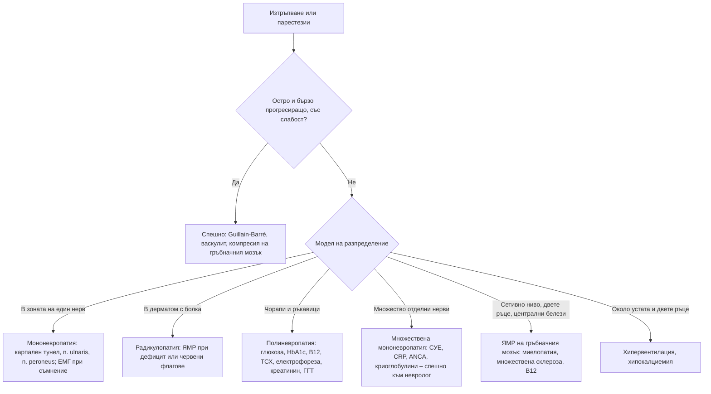

# Глава 47. Изтръпване, парестезии и периферни невропатии

> **Част IX. Нервна система**

## Цели на главата

- Да се определя моделът на сетивните нарушения: мононевропатия, множествена мононевропатия, радикулопатия, плексопатия, полиневропатия, централна лезия.
- Да се разпознават най-честите компресионни невропатии и радикулопатии.
- Да се прилага рационален скрининг за причините за полиневропатия.
- Да се разпознават централните причини: множествена склероза, шийна миелопатия, подостра комбинирана дегенерация.
- Да се помнят неневрологичните причини за изтръпване.

## Ключови моменти

- Моделът на сетивните нарушения (един нерв, дерматом, „чорапи и ръкавици“, сетивно ниво, хемисетивен) определя нивото на лезията.
- При полиневропатия най-голям добив имат глюкозата, витамин B12 с метаболитите му и имунофиксацията на серумните белтъци *(SORT C [3])*.
- Асиметричната, болезнена, стъпаловидно развиваща се невропатия е васкулит до доказване на противното и изисква спешна оценка.
- Двустранно изтръпване и тромавост на ръцете с нарушена походка и хиперрефлексия е шийна миелопатия, а не двустранен синдром на карпалния тунел *(SORT C [6])*.
- Нормалният серумен B12 не изключва функционален дефицит при употреба на азотен оксид. Изследват се метилмалонова киселина и хомоцистеин *(SORT C [7])*.
- Двустранният синдром на карпалния тунел при възрастен човек може да е ранен белег на транстиретинова амилоидоза *(SORT C [1])*.

---

## 1. Модели на сетивните нарушения

*Таблица 47.1. Модели на сетивните нарушения.*

| Модел | Разпределение | Основни причини |
|---|---|---|
| **Мононевропатия** | В зоната на един нерв | Компресия: синдром на карпалния тунел, *n. ulnaris* в лакътя, *n. radialis*, *n. peroneus* при главичката на фибулата, *n. cutaneus femoris lateralis* |
| **Множествена мононевропатия** | Няколко отделни нерва, асиметрично, често болезнено, стъпаловидно | Васкулити (полиартериит нодоза, ANCA-свързани, ревматоиден, лупус, криоглобулинемия при хепатит C), диабет, саркоидоза, HIV, лепра, лимфом, наследствена невропатия със склонност към парализи при натиск |
| **Радикулопатия** | В дерматома, с радикулерна болка | Дискова херния, спондилоза, херпес зостер, тумори, диабет |
| **Плексопатия** | Няколко нерва и коренчета в един крайник | Неврит на брахиалния плексус (синдром на Parsonage-Turner – силна болка в рамото, последвана от слабост), лъчева плексопатия, тумор на Pancoast (долните коренчета на брахиалния плексус и синдром на Horner), диабетна амиотрофия (болка в бедрото, загуба на тегло, проксимална слабост в крака) |
| **Полиневропатия** | Симетрична, зависима от дължината на нервите („чорапи и ръкавици“) – първо стъпалата, по-късно дланите | Вж. т. 3 |
| **Невропатия на тънките влакна** | Парене, болка, алодиния в стъпалата; нормални рефлекси и нормална неврография | Диабет и преддиабет, алкохол, амилоидоза, болест на Fabry, саркоидоза, синдром на Sjögren, идиопатична; диагноза чрез кожна биопсия |
| **Гръбначен мозък** | Сетивно ниво, двустранно засягане, тазови нарушения, централни белези | Компресия (шийна спондилотична миелопатия, метастази, абсцес), множествена склероза, трансверзален миелит, дефицит на B12 (подостра комбинирана дегенерация), сирингомиелия (дисоциирана загуба на болковата и температурната сетивност във форма на „пелерина“), синдром на Brown-Séquard |
| **Главен мозък** | Хемисетивни нарушения (лице, ръка, крак от едната страна) | Инсулт (особено таламусен), тумор, множествена склероза |

### 1.1. Неневрологични причини за изтръпване

- **Хипервентилация** – изтръпване около устата и в двете длани, карпопедален спазъм.
- **Хипокалциемия** – изтръпване около устата, тетания.
- Паническа атака.
- **Феномен на Raynaud**, периферна артериална болест.
- **Мигренозна аура** – сетивни симптоми, които се разпространяват постепенно.
- **Фокален епилептичен пристъп** – „маршируващи“ сетивни симптоми за секунди.

---

## 2. Често срещани мононевропатии и радикулопатии

### 2.1. Мононевропатии

*Таблица 47.2. Чести мононевропатии.*

| Нерв | Сетивни нарушения | Двигателни нарушения | Особености |
|---|---|---|---|
| ***N. medianus* (синдром на карпалния тунел)** | Палец, показалец, среден пръст и радиалната половина на безименния пръст; нощни парестезии, пациентът „изтръсква“ ръката | Слабост и атрофия на тенара | Белези на Tinel и Phalen. Свързан е с бременност, хипотиреоидизъм, диабет, ревматоиден артрит, акромегалия, затлъстяване, диализа, амилоидоза (двустранен синдром на карпалния тунел при възрастни хора може да е ранен белег на транстиретинова амилоидоза) [1] |
| ***N. ulnaris* (в лакътя)** | Малкият пръст и улнарната половина на безименния пръст | Слабост на междукостните мускули, белег на Froment, „щипковидна“ ръка | Опиране на лакътя, травми |
| ***N. radialis*** | Гърбът на ръката между палеца и показалеца | „Увиснала“ китка | „Парализа от събота вечер“ (сън с ръка върху облегалка), фрактура на раменната кост |
| ***N. peroneus communis*** | Гърбът на стъпалото, латералната страна на подбедрицата | „Увиснало“ стъпало (слаба дорзална флексия и еверсия), „петльова“ походка | Кръстосване на краката, загуба на тегло, гипсова имобилизация, продължително клякане. Разграничава се от радикулопатия L5 по запазената инверсия на стъпалото |
| ***N. cutaneus femoris lateralis*** (мералгия парестетика) | Парене и изтръпване по латералната страна на бедрото | Няма | Затлъстяване, тесни колани и дрехи, бременност, диабет |

### 2.2. Радикулопатии

*Таблица 47.3. Чести радикулопатии.*

| Коренче | Сетивна зона | Слабост | Рефлекс |
|---|---|---|---|
| **C5** | Латералната страна на рамото | Абдукция на рамото, флексия на лакътя | Бицепсов |
| **C6** | Палецът, латералната страна на предмишницата | Флексия на лакътя, екстензия на китката | Брахиорадиален |
| **C7** | **Среден пръст** | Екстензия на лакътя (трицепс) | Трицепсов |
| **C8** | Малкият пръст, медиалната страна на предмишницата | Флексия на пръстите | – |
| **L4** | Медиалната страна на подбедрицата | Екстензия на коляното, дорзална флексия на стъпалото | **Коленен** |
| **L5** | Гърбът на стъпалото, палецът | Дорзална флексия на палеца и стъпалото, инверсия и абдукция на бедрото | – |
| **S1** | **Латералната страна и ходилото на стъпалото** | Плантарна флексия (ходене на пръсти) | **Ахилесов** |

---

## 3. Полиневропатия

### 3.1. Причини

*Таблица 47.4. Полиневропатия: причини.*

| Група | Причини |
|---|---|
| **Метаболитни и ендокринни** | Захарен диабет (най-честата) и преддиабет; хипотиреоидизъм; уремия; акромегалия |
| **Токсични** | Алкохол; химиотерапия (платинови препарати, таксани, винка-алкалоиди, бортезомиб); лекарства (метронидазол, нитрофурантоин, изониазид – чрез пиридоксинов дефицит, линезолид, амиодарон, колхицин, фенитоин, дапсон); тежки метали (олово, арсен, талий); азотен оксид („райски газ“ – инактивира витамин B12) |
| **Хранителни** | Дефицит на B12, B1 (тиамин), B6 – но и токсичност от прекомерен прием на B6 (добавки), дефицит на мед (след бариатрична операция, прекомерен прием на цинк), фолиева киселина, витамин E |
| **Възпалителни и имунни** | Синдром на Guillain-Barré (остър), хронична възпалителна демиелинизираща полиневропатия (прогресира над 8 седмици, проксимална и дистална слабост, арефлексия) [2], васкулити, системен лупус еритематодес, синдром на Sjögren, саркоидоза, цьолиакия |
| **Парапротеинемични и злокачествени** | MGUS (особено IgM с антитела срещу MAG), миелом, POEMS, AL амилоидоза (болезнена невропатия на тънките влакна и вегетативна невропатия), паранеопластична сензорна невронопатия (антитела срещу Hu, дребноклетъчен карцином) |
| **Инфекциозни** | HIV, хепатит C (криоглобулинемия), лаймска болест, лепра, дифтерия |
| **Наследствени** | Болест на Charcot-Marie-Tooth (висок свод на стъпалото, „чукообразни“ пръсти, фамилна анамнеза, бавно прогресиране), транстиретинова амилоидоза, болест на Fabry, порфирия |
| **Идиопатични** | Около 20–25% от случаите, особено при възрастни хора |

**Мнемоника:** диабет, алкохол, хранителни дефицити, Guillain-Barré, токсини, наследствени, ендокринни, бъбречни, амилоидоза, порфирия, инфекции, системни заболявания, тумори.

### 3.2. Белези, насочващи към определени причини

- **Предимно двигателна:** синдром на Guillain-Barré, хронична възпалителна демиелинизираща полиневропатия, болест на Charcot-Marie-Tooth, олово, порфирия.
- **Асиметрична, болезнена, бързо развиваща се:** **васкулит** – спешно.
- **Изразени вегетативни симптоми** (ортостатична хипотония, диария, импотентност): диабет, амилоидоза, синдром на Guillain-Barré, паранеопластична.
- **Изразена атаксия със запазена сила** (сензорна невронопатия): паранеопластична, синдром на Sjögren, цисплатин, токсичност на B6.
- **Мийс линии по ноктите, косопад, коремна болка:** арсен, талий.

### 3.3. Скрининг изследвания

**Първа линия.** Най-голям добив имат глюкозата (при нужда глюкозотолерантен тест), витамин B12 с метаболитите му и имунофиксацията на серумните белтъци [3, 4]:

- **глюкоза на гладно и HbA1c** (при нормални стойности – орален глюкозотолерантен тест);
- **витамин B12** (при гранични стойности – метилмалонова киселина и хомоцистеин);
- **ТСХ**;
- креатинин, чернодробни показатели, ГГТ;
- ПКК, СУЕ, CRP;
- **електрофореза на серумните белтъци, имунофиксация и свободни леки вериги** (особено след 50-годишна възраст).

**Втора линия (според клиничните данни):** HIV, хепатити B и C, ANA, ANCA, анти-Ro/La, криоглобулини, серология за лаймска болест и цьолиакия, фолиева киселина, мед, витамин B6, тежки метали, антитела срещу Hu, генетични изследвания.

**Неврография и електромиография:** разграничават аксоналната от демиелинизиращата невропатия и мононевропатията от полиневропатията.

---

## 4. Централни причини, които не бива да се пропускат

*Таблица 47.5. Централни причини, които не бива да се пропускат.*

| Заболяване | Насочващи белези |
|---|---|
| **Множествена склероза** [5] | Млади хора (20–40 години), жени; епизоди, продължаващи дни до седмици, с частично или пълно възстановяване; оптичен неврит (болка при движение на окото, намалено зрение) в анамнезата; белег на Lhermitte (електрически удар по гръбначния стълб при навеждане на главата напред); сетивни симптоми, които се разпространяват към талията; централни белези; засилване при затопляне (феномен на Uhthoff) |
| **Шийна спондилотична миелопатия** | Възрастни хора; изтръпване и тромавост на двете ръце, затруднение с копчетата, нарушена походка, хиперрефлексия, белег на Hoffmann, Бабински, нарушения на уринирането. Лечима – често се пропуска и се диагностицира като „полиневропатия“ или „синдром на карпалния тунел“ [6] |
| **Подостра комбинирана дегенерация** (дефицит на B12) | Изтръпване, сетивна атаксия (нарушено вибрационно и ставно-мускулно усещане, положителен тест на Romberg), спастичност, липсващи ахилесови рефлекси при екстензорен плантарен рефлекс; вегани, пернициозна анемия, метформин, ИПП, употреба на азотен оксид [7] |
| **Метастатична компресия, епидурален абсцес** | Болка в гърба, сетивно ниво, слабост, тазови нарушения |
| **Инсулт** | Внезапни хемисетивни нарушения |

---

## 5. Безопасна диагностична стратегия

*Таблица 47.6. Безопасна диагностична стратегия.*

| Въпрос | Отговор |
|---|---|
| **Вероятна диагноза** | Диабетна полиневропатия, синдром на карпалния тунел, радикулопатия, алкохолна невропатия |
| **Сериозни заболявания, които не бива да се пропускат** | Синдром на Guillain-Barré; васкулитна невропатия; компресия на гръбначния мозък и синдром на конската опашка; шийна миелопатия; множествена склероза; дефицит на B12 с неврологично засягане; паранеопластични синдроми; амилоидоза; инсулт и ТИА |
| **Чести капани** | Преддиабет; дефицит на B12 при метформин и ИПП; азотен оксид при млади хора; токсичност на B6 от добавки; хипотиреоидизъм; парапротеинемия; двустранен синдром на карпалния тунел като предвестник на амилоидоза; хипервентилация; шийна миелопатия, диагностицирана като „полиневропатия“ |
| **Маскиращи заболявания** | Захарен диабет, лекарства, алкохол, хипотиреоидизъм, злокачествени заболявания |
| **Психосоциални аспекти** | Тревожност и хипервентилация, злоупотреба с алкохол и вещества |

---

## 6. Червени флагове

- **Бързо прогресиране** (дни–седмици).
- **Асиметрични, болезнени**, множествени мононевропатии (васкулит).
- Предимно двигателни нарушения, проксимална слабост.
- Изразени **вегетативни** симптоми.
- Сетивно ниво, тазови нарушения, седловидна анестезия.
- Двустранно изтръпване на ръцете с нарушена походка и хиперрефлексия (шийна миелопатия).
- Загуба на тегло, анамнеза за злокачествено заболяване, тютюнопушене.
- Млад пациент с преходни неврологични епизоди (множествена склероза).

---

## 7. Диагностичен алгоритъм

*Фигура 47.1. Диагностичен алгоритъм: изтръпване, парестезии и периферни невропатии. Схема на авторите въз основа на източниците, цитирани в главата.*

Текстово описание на фигура 47.1

1. Изтръпване или парестезии. Следва: към т. 2.
2. **Въпрос:** Остро и бързо прогресиращо, със слабост? Да – към т. 3; Не – към т. 4.
3. Спешно: Guillain-Barré, васкулит, компресия на гръбначния мозък.
4. **Въпрос:** Модел на разпределение В зоната на един нерв – към т. 5; В дерматом с болка – към т. 6; Чорапи и ръкавици – към т. 7; Множество отделни нерви – към т. 8; Сетивно ниво, двете ръце, централни белези – към т. 9; Около устата и двете ръце – към т. 10.
5. Мононевропатия: карпален тунел, n. ulnaris, n. peroneus; ЕМГ при съмнение.
6. Радикулопатия: ЯМР при дефицит или червени флагове.
7. Полиневропатия: глюкоза, HbA1c, B12, ТСХ, електрофореза, креатинин, ГГТ.
8. Множествена мононевропатия: СУЕ, CRP, ANCA, криоглобулини – спешно към невролог.
9. ЯМР на гръбначния мозък: миелопатия, множествена склероза, B12.
10. Хипервентилация, хипокалциемия.

---

## 8. Кога и колко спешно да насочим

*Таблица 47.7. Кога и колко спешно да насочим.*

| Спешност | Клинична ситуация |
|---|---|
| **Незабавно (112 или спешно отделение)** | Бързо прогресираща слабост с арефлексия (синдром на Guillain-Barré – вж. глава 46); сетивно ниво, задръжка на урина или седловидна анестезия (компресия на гръбначния мозък или синдром на конската опашка); внезапни хемисетивни нарушения (инсулт или ТИА) |
| **В същия ден** | Асиметрична болезнена множествена мононевропатия (подозрение за васкулит); миелопатия от дефицит на B12 или азотен оксид – парентерален B12 без отлагане [7] |
| **Бързо (до 2 седмици)** | Прогресираща шийна миелопатия [6]; подозрение за множествена склероза [5]; хронична възпалителна демиелинизираща полиневропатия [2]; невропатия със загуба на тегло или парапротеин |
| **Планово** | Синдром на карпалния тунел с атрофия на тенара или без ефект от консервативното лечение; полиневропатия с неясна причина след изследванията от първа линия [3]; подозрение за наследствена невропатия |
| **Проследяване в общата практика** | Диабетна полиневропатия – годишен преглед на стъпалата; лек синдром на карпалния тунел – шина и повторна оценка; пареза на *n. peroneus* от компресия – отстраняване на причината и повторна оценка |

---

## 9. Клинични перли

- Двустранни изтръпнали и тромави ръце с нарушена походка при възрастен човек са шийна миелопатия, а не двустранен синдром на карпалния тунел.
- При всяка полиневропатия изследвайте B12, глюкозата (HbA1c или глюкозотолерантен тест), ТСХ и електрофореза.
- Млад човек с изтръпване и атаксия, който употребява „райски газ“: функционален дефицит на B12. Серумният B12 може да е нормален, а метилмалоновата киселина и хомоцистеинът са повишени.
- Прекомерният прием на витамин B6 (включително от комбинирани добавки) може да причини сензорна невропатия.
- Асиметрична болезнена невропатия със стъпаловидно развитие: васкулит до доказване на противното.
- Двустранен синдром на карпалния тунел при възрастен мъж, особено със сърдечна недостатъчност: помислете за транстиретинова амилоидоза.
- „Увиснало“ стъпало след загуба на тегло или кръстосване на краката: пареза на *n. peroneus*. Инверсията на стъпалото е запазена, което я разграничава от радикулопатия L5.
- Белегът на Lhermitte при млад човек насочва към множествена склероза.

---

## 10. Клиничен случай

**Етап 1 – представяне.** Мъж на 23 години от 3 седмици има изтръпване в стъпалата и дланите, което се изкачва нагоре, и несигурна походка, особено на тъмно. Не приема лекарства.

> **Въпрос 1.** Какъв въпрос е задължителен при млад човек с такава картина?

**Етап 2 – анамнеза, преглед и изследвания.** При директен въпрос признава, че през последните месеци почти всяка вечер вдишва азотен оксид („райски газ“) от балони. Вибрационното и ставно-мускулното усещане в краката са нарушени, тестът на Romberg е положителен. Коленните рефлекси са живи, ахилесовите липсват, а плантарните рефлекси са екстензорни. Витамин B12 е 210 pmol/l (в долната граница на нормата). Хомоцистеинът и метилмалоновата киселина са силно повишени.

> **Въпрос 2.** Каква е диагнозата?

> **Въпрос 3.** Защо серумният B12 не е нисък и какво е лечението?

Обсъждане и отговори

**Отговор 1.** Въпросът за рекреационни вещества, особено азотен оксид, както и за храненето (веганство) и лекарствата (метформин, ИПП).

**Отговор 2.** Съчетанието от засягане на задните стълбове (сетивна атаксия), страничните стълбове (екстензорни плантарни рефлекси) и периферните нерви (липсващи ахилесови рефлекси) е типично за **подостра комбинирана дегенерация** [7].

**Отговор 3.** Азотният оксид окислява кобалта във витамин B12 и го инактивира. Така настъпва функционален дефицит при нормален или граничен серумен B12. Диагнозата се потвърждава с повишени метилмалонова киселина и хомоцистеин. ЯМР на шийния отдел показва характерен сигнал в задните стълбове (белег на „обърнато V“). Лечението включва спиране на азотния оксид и парентерален витамин B12 без отлагане.

**Поука.** Питайте младите хора с необяснима невропатия или миелопатия за рекреационна употреба на азотен оксид. Нормалният B12 не изключва функционален дефицит.

---

## Обобщение

- Моделът на разпределение разграничава мононевропатията, множествената мононевропатия, радикулопатията, плексопатията, полиневропатията и централните лезии.
- Най-честите причини за полиневропатия са диабетът, алкохолът, дефицитът на B12, хипотиреоидизмът и лекарствата. Изследванията от първа линия включват глюкоза, B12, ТСХ и имунофиксация.
- Бързото прогресиране, асиметрията с болка, предимно двигателното засягане и централните белези са червени флагове.
- Шийната миелопатия, множествената склероза и подострата комбинирана дегенерация са централни причини, които не бива да се пропускат.

## Самопроверка

### Въпроси с един верен отговор

**1.** *(основно ниво)* Жена на 45 години се събужда нощем с изтръпване на палеца, показалеца и средния пръст на дясната ръка и „изтръсква“ ръката. Тестът на Phalen е положителен. Коя е най-вероятната диагноза?

- **А.** Радикулопатия C8
- **Б.** Синдром на карпалния тунел
- **В.** Пареза на *n. ulnaris*
- **Г.** Полиневропатия
- **Д.** Шийна миелопатия

Отговор и обосновка

**Верен отговор: Б.** Нощните парестезии в зоната на *n. medianus* и положителният тест на Phalen са типични за синдром на карпалния тунел.

**2.** *(основно ниво)* Мъж на 60 години с полиневропатия „чорапи и ръкавици“ от година е с нормална глюкоза на гладно. Кои изследвания от първа линия са с най-голям добив?

- **А.** ЯМР на главата и ЕЕГ
- **Б.** Глюкозотолерантен тест или HbA1c, витамин B12 с метаболитите му и имунофиксация на серумните белтъци
- **В.** Само ANA
- **Г.** Генетично изследване
- **Д.** Лумбална пункция

Отговор и обосновка

**Верен отговор: Б.** Тези изследвания откриват преддиабет, функционален дефицит на B12 и парапротеинемия [3].

**3.** *(основно ниво)* Мъж на 50 години има „увиснало“ стъпало вдясно след загуба на 15 kg за 3 месеца и често кръстосва краката. Инверсията на стъпалото е запазена. Коя е най-вероятната диагноза?

- **А.** Радикулопатия L5
- **Б.** Пареза на *n. peroneus communis*
- **В.** Амиотрофична латерална склероза
- **Г.** Инсулт
- **Д.** Синдром на Guillain-Barré

Отговор и обосновка

**Верен отговор: Б.** Компресията на *n. peroneus* при главичката на фибулата е честа след загуба на тегло и кръстосване на краката. Запазената инверсия я разграничава от радикулопатия L5.

**4.** *(напреднало ниво)* Мъж на 70 години от година има изтръпване и тромавост на двете ръце, трудно закопчава копчета и ходи несигурно. Рефлексите в ръцете и краката са живи, а белегът на Hoffmann е положителен. Кое изследване е най-подходящо?

- **А.** Неврография за синдром на карпалния тунел
- **Б.** ЯМР на шийния отдел на гръбначния стълб
- **В.** Витамин D
- **Г.** ЕЕГ
- **Д.** Мускулна биопсия

Отговор и обосновка

**Верен отговор: Б.** Двустранното засягане на ръцете с нарушена походка и централни белези насочва към шийна спондилотична миелопатия – лечимо и често пропускано заболяване [6].

**5.** *(напреднало ниво)* Жена на 58 години с ревматоиден артрит има за 3 седмици последователно „увиснала“ китка вляво, изтръпване в зоната на *n. ulnaris* вдясно и болезнено „увиснало“ стъпало. СУЕ е 90 mm/h. Кое е най-вероятното обяснение?

- **А.** Диабетна полиневропатия
- **Б.** Васкулитна множествена мононевропатия
- **В.** Синдром на карпалния тунел
- **Г.** Функционално неврологично разстройство
- **Д.** Дефицит на витамин B12

Отговор и обосновка

**Верен отговор: Б.** Асиметричното, болезнено и стъпаловидно засягане на отделни нерви е множествена мононевропатия. При ревматоиден артрит и висока СУЕ най-вероятна причина е васкулит. Необходима е спешна оценка.

### Задача

Мъж на 68 години с диабет тип 2 приема метформин от 10 години и омепразол от 5 години. Има изтръпване на стъпалата и несигурна походка на тъмно. HbA1c е 52 mmol/mol, а B12 е 160 pmol/l. Как ще тълкувате находките?

Решение

Диабетната полиневропатия е вероятна, но метформинът и инхибиторът на протонната помпа повишават риска от дефицит на B12. Несигурната походка на тъмно (сетивна атаксия) подсказва засягане на задните стълбове. При граничен B12 се изследват метилмалонова киселина и хомоцистеин [3]. При потвърден дефицит се започва заместване с B12, парентерално при неврологични симптоми. Търсят се белези на миелопатия: хиперрефлексия и екстензорни плантарни рефлекси. Преразглежда се нуждата от ИПП.

### OSCE станция: Изследване на сетивността и рефлексите при изтръпване на стъпалата

**Време:** 7 минути. **Ниво:** основно (студенти, специализанти).

**Задача за кандидата.** Мъж на 64 години с диабет има изтръпване на стъпалата. Направете насочен неврологичен преглед на краката.

**Информация за симулирания пациент (за изпитващия).** Нарушено вибрационно усещане до глезените, намалено усещане за допир с монофиламент по ходилата, липсващи ахилесови рефлекси.

*Таблица 47.8. OSCE станция „Изследване на сетивността и рефлексите при изтръпване на стъпалата“ – критерии за оценяване.*

| Критерий | Точки |
|---|---|
| Изследва вибрационното усещане с камертон 128 Hz, започвайки дистално | 2 |
| Изследва допира с 10-грамов монофиламент | 2 |
| Изследва ставно-мускулното усещане и теста на Romberg | 1 |
| Изследва ахилесовите и коленните рефлекси и плантарния отговор | 2 |
| Оглежда стъпалата за рани, деформации и кожни промени | 1 |
| Определя модела („чорапи“) и предлага изследванията от първа линия | 1 |
| Обяснява резултата на пациента | 1 |
| **Общо** | **10** |

**Праг за успешно представяне:** 7 от 10 точки, включително вибрационното усещане, монофиламента и рефлексите.

## Литература

1. Donnelly JP, Hanna M, Sperry BW, Seitz WH Jr. Carpal Tunnel Syndrome: A Potential Early, Red-Flag Sign of Amyloidosis. J Hand Surg Am. 2025;50(11):1370-1378. doi:10.1016/j.jhsa.2025.07.017. PMID: 41193074.
2. Van den Bergh PYK, van Doorn PA, Hadden RDM, Avau B, Vankrunkelsven P, Allen JA, et al. European Academy of Neurology/Peripheral Nerve Society guideline on diagnosis and treatment of chronic inflammatory demyelinating polyradiculoneuropathy: Report of a joint Task Force-Second revision. Eur J Neurol. 2021;28(11):3556-3583. doi:10.1111/ene.14959. PMID: 34327760.
3. England JD, Gronseth GS, Franklin G, Carter GT, Kinsella LJ, Cohen JA, et al. Practice Parameter: evaluation of distal symmetric polyneuropathy: role of laboratory and genetic testing (an evidence-based review). Report of the American Academy of Neurology, American Association of Neuromuscular and Electrodiagnostic Medicine, and American Academy of Physical Medicine and Rehabilitation. Neurology. 2009;72(2):185-92. doi:10.1212/01.wnl.0000336370.51010.a1. PMID: 19056666.
4. Callaghan BC, Price RS, Feldman EL. Distal Symmetric Polyneuropathy: A Review. JAMA. 2015;314(20):2172-81. doi:10.1001/jama.2015.13611. PMID: 26599185.
5. Montalban X, Lebrun-Frénay C, Oh J, Arrambide G, Moccia M, Amato MP, et al. Diagnosis of multiple sclerosis: 2024 revisions of the McDonald criteria. Lancet Neurol. 2025;24(10):850-865. doi:10.1016/S1474-4422(25)00270-4. PMID: 40975101.
6. Davies BM, Mowforth OD, Smith EK, Kotter MR. Degenerative cervical myelopathy. BMJ. 2018;360:k186. doi:10.1136/bmj.k186. PMID: 29472200.
7. Garakani A, Jaffe RJ, Savla D, Welch AK, Protin CA, Bryson EO, et al. Neurologic, psychiatric, and other medical manifestations of nitrous oxide abuse: A systematic review of the case literature. Am J Addict. 2016;25(5):358-69. doi:10.1111/ajad.12372. PMID: 27037733.

*Последна проверка на съдържанието: септември 2026 г. Следващ планиран преглед: септември 2027 г. (вж. „Политика за актуализация“ в README).*

<!-- навигация -->

---

[← Глава 46. Мускулна слабост](46-muskulna-slabost.md) · [Съдържание](../README.md) · [Глава 48. Тремор и двигателни нарушения →](48-tremor.md)
