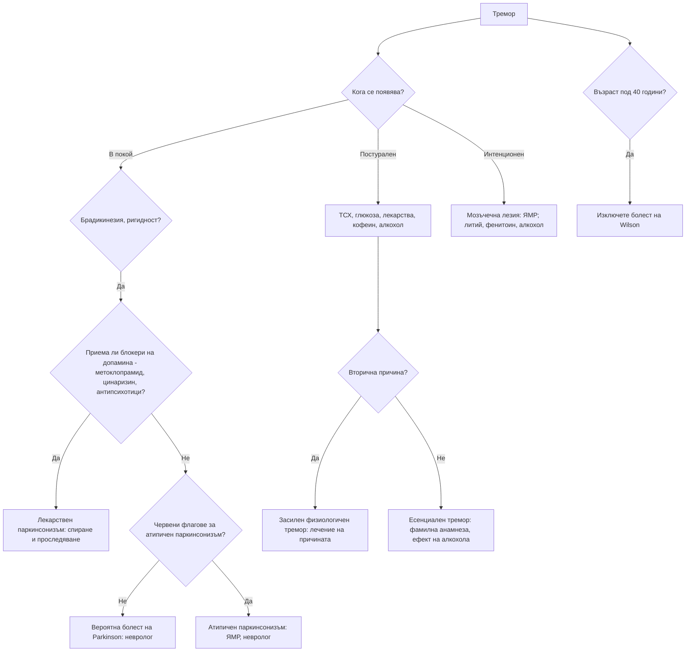

# Глава 48. Тремор и двигателни нарушения

> **Част IX. Нервна система**

## Цели на главата

- Да се класифицира треморът по условията, при които се появява: в покой, постурален, кинетичен, интенционен.
- Да се разграничават есенциалният тремор, треморът при болест на Parkinson и засиленият физиологичен тремор.
- Да се разпознават лекарственият паркинсонизъм и атипичните паркинсонови синдроми.
- Да се познават основните хиперкинетични нарушения: хорея, дистония, миоклонус, тикове.
- Да се разпознава синдромът на неспокойните крака.

---

## 1. Класификация на тремора

| Тип | Кога се появява | Честота | Основни причини |
|---|---|---|---|
| **Тремор в покой** | Когато крайникът е отпуснат и подкрепен; намалява при движение | 4–6 Hz | **Болест на Parkinson** („броене на пари“), лекарствен паркинсонизъм, болест на Wilson |
| **Постурален тремор** | При задържане на поза (изпънати ръце) | 4–12 Hz | **Есенциален тремор**, **засилен физиологичен тремор**, лекарства, тиреотоксикоза, отнемане на алкохол, дистоничен тремор |
| **Кинетичен тремор** | По време на движение | Различна | Есенциален тремор, мозъчечни заболявания |
| **Интенционен тремор** | Засилва се при приближаване към целта (тест пръст-нос) | < 5 Hz | **Мозъчечни заболявания**: множествена склероза, инсулт, алкохол, лекарства (литий, фенитоин), тумори |
| **Ортостатичен тремор** | В **краката** при стоене; изчезва при ходене и сядане | 13–18 Hz | Възрастни хора; усещане за нестабилност при стоене |
| **Задачно-специфичен тремор** | Само при определена дейност (писане) | — | Дистония |
| **Функционален тремор** | Променлив, **намалява при отвличане на вниманието**, **приема ритъма** на движенията на другата ръка | Променлива | Функционално неврологично разстройство |
| **Астериксис** („пляскащ тремор“) | Кратки загуби на тонуса при изпънати ръце със свити назад китки | — | **Метаболитна енцефалопатия**: чернодробна, уремична, хиперкапния |

---

## 2. Есенциален тремор или болест на Parkinson?

| Белег | Есенциален тремор | Болест на Parkinson |
|---|---|---|
| Тип | **Постурален и кинетичен** | **В покой** (може да има и постурален компонент, който се появява след латентен период) |
| Симетрия | **Двустранен**, относително симетричен | **Асиметричен** в началото |
| Засягане | **Ръце, глава** (кимане „да-да“ или клатене „не-не“), **глас** | Ръка, крак, брадичка; **главата обикновено не е засегната** |
| Фамилна анамнеза | Честа (автозомно-доминантна) | По-рядка |
| **Ефект на алкохола** | **Подобрение** | Не |
| Почерк | Голям, треперещ | **Микрография** (дребен, намаляващ почерк) |
| Други белези | Няма (или лека атаксия при походката в тандем) | **Брадикинезия**, **ригидност** („зъбчато колело“), хипомимия, наведена стойка, ситна походка без размах на ръцете |
| Продромални симптоми | Няма | **Хипосмия**, **запек**, **нарушение на поведението по време на REM съня**, депресия |

### 2.1. Засилен физиологичен тремор

Фин, бърз постурален тремор на двете ръце. Причини:

- тревожност, умора, кофеин;
- **тиреотоксикоза**;
- **хипогликемия**;
- феохромоцитом;
- **отнемане на алкохол** и бензодиазепини;
- **лекарства**: бета-агонисти (салбутамол), **литий** (също и като признак на токсичност), **валпроат**, SSRI, амиодарон, теофилин, кортикостероиди, такролимус, левотироксин (предозиране), метоклопрамид, кофеин.

---

## 3. Паркинсонизъм

**Паркинсонизъм** = **брадикинезия** (задължителна) + тремор в покой и/или ригидност.

### 3.1. Причини

| Причина | Особености |
|---|---|
| **Болест на Parkinson** | Асиметрично начало, тремор в покой, **добър и траен отговор на леводопа**, продромални симптоми |
| **Лекарствен паркинсонизъм** | **Симетричен**, тремор по-рядко, развива се за седмици–месеци след началото на лечението. Причинители: **антипсихотици** (типични, рисперидон), **метоклопрамид**, прохлорперазин, **цинаризин и флунаризин** (често предписвани при „световъртеж“ и „мозъчно кръвообращение“), валпроат, литий, амиодарон, резерпин, тетрабеназин. **Може да персистира месеци след спирането** |
| **Съдов паркинсонизъм** | „**Паркинсонизъм на долната половина на тялото**“ — предимно нарушение на походката, симетричен, без тремор; слаб отговор на леводопа; мозъчно-съдова болест |
| **Множествена системна атрофия** | **Ранна вегетативна недостатъчност** (ортостатична хипотония, уринарна инконтиненция, еректилна дисфункция), мозъчечни белези, стридор; слаб отговор на леводопа |
| **Прогресивна супрануклеарна парализа** | **Ранни падания назад**, **вертикална парализа на погледа** (особено надолу), аксиална ригидност, изправена стойка, „учудено“ изражение на лицето |
| **Кортикобазален синдром** | Асиметрична апраксия, феномен на „чуждата ръка“, кортикален сетивен дефицит, миоклонус |
| **Деменция с телца на Lewy** | Ранна деменция, флуктуации, зрителни халюцинации |
| **Нормотензивна хидроцефалия** | Нарушение на походката, инконтиненция, деменция |
| **Болест на Wilson** | **Възраст под 40 години**; тремор („махане с крила“), дистония, дизартрия, психични симптоми, чернодробно заболяване, пръстени на Kayser-Fleischer |
| **Токсични** | **Манган** (включително при интравенозна употреба на „ефедрон“ — меткатинон, приготвен с перманганат), **въглероден оксид**, MPTP |
| **Структурни** | Тумор, хроничен субдурален хематом |

### 3.2. Червени флагове за атипичен или вторичен паркинсонизъм

- **Ранни падания** (в първите 3 години).
- **Бързо прогресиране.**
- **Слаб или никакъв отговор на леводопа.**
- **Ранна вегетативна недостатъчност.**
- Ранна деменция и халюцинации.
- **Вертикална парализа на погледа.**
- Мозъчечни или пирамидни белези.
- **Симетрично начало**, липса на тремор.
- **Начало преди 40 години** (болест на Wilson, генетични форми).
- **Прием на лекарства**, блокиращи допамина.

---

## 4. Хиперкинетични нарушения

| Нарушение | Същност | Основни причини |
|---|---|---|
| **Хорея** | Неволеви, неправилни, „танцуващи“, преливащи се движения | **Болест на Huntington** (автозомно-доминантна, психични и когнитивни нарушения); **хорея на Sydenham** (след стрептококова инфекция при деца); лекарства (**дискинезии от леводопа**, орални контрацептиви, антиепилептични средства, стимуланти); **хипертиреоидизъм**; **системен лупус еритематодес и антифосфолипиден синдром**; **хорея на бременността**; полицитемия вера; **некетотична хипергликемия** (хемихорея при възрастни хора); инсулт (**хемибализъм** при лезия на субталамичното ядро); болест на Wilson |
| **Дистония** | Продължителни мускулни контракции, водещи до усукващи движения и патологични пози | **Фокална** (спастичен тортиколис, блефароспазъм, „писарски спазъм“); генерализирана (генетична); **остра дистонична реакция** (метоклопрамид, антипсихотици — окулогирна криза, тортиколис, тризмус при млади хора); **тардивна дискинезия** (продължително лечение с антипсихотици или метоклопрамид — орофациални движения) |
| **Миоклонус** | Внезапни, кратки, „шокови“ потрепвания | Физиологичен (при заспиване); **метаболитен** (уремия, чернодробна недостатъчност, хиперкапния); **лекарствен** (опиоиди, **габапентин и прегабалин при бъбречна недостатъчност**, SSRI — серотонинов синдром, литий, цефалоспорини); след хипоксия; **болест на Creutzfeldt-Jakob**; епилепсия (ювенилна миоклонична епилепсия); невродегенеративни заболявания |
| **Тикове** | Бързи, повтарящи се движения или звуци, предшествани от **неприятен позив**, **временно потискани** | **Синдром на Tourette** (начало преди 18 години, моторни и вокални тикове над 1 година), преходни тикове, вторични |
| **Хемифациален спазъм** | Едностранни неволеви контракции на лицевата мускулатура | Съдова компресия на лицевия нерв; рядко тумор |
| **Синдром на неспокойните крака** | **Неудържимо желание** за движение на краката с неприятни усещания, **в покой, вечер и нощем**, **облекчава се при движение** | Идиопатичен; **желязодефицит** (феритин < 75 µg/l), ХБЗ, бременност, невропатия, **лекарства** (антихистамини, миртазапин и други антидепресанти, антипсихотици, метоклопрамид) |

---

## 5. Безопасна диагностична стратегия

| Въпрос | Отговор |
|---|---|
| **Вероятна диагноза** | Есенциален тремор, засилен физиологичен тремор, болест на Parkinson, лекарствен паркинсонизъм |
| **Сериозни заболявания, които не бива да се пропускат** | **Болест на Wilson** (при млади хора); **тиреотоксикоза**; **отнемане на алкохол** (делириум тременс); **литиева токсичност**; **серотонинов синдром** и **невролептичен малигнен синдром**; мозъчечни тумори и инсулт; болест на Creutzfeldt-Jakob; метаболитна енцефалопатия (астериксис) |
| **Чести капани** | **Лекарствен паркинсонизъм** (метоклопрамид, цинаризин, флунаризин, антипсихотици); валпроатов тремор; тремор от салбутамол; ортостатичен тремор, приет за „нестабилност“; функционален тремор; синдром на неспокойните крака при желязодефицит |
| **Маскиращи заболявания** | Лекарства, заболявания на щитовидната жлеза, алкохол, депресия (при болест на Parkinson), чернодробни заболявания |
| **Психосоциални аспекти** | Тревожност, социално затваряне поради тремора, злоупотреба с алкохол като „самолечение“ на есенциалния тремор |

---

## 6. Изследвания

- **Клиничната диагноза е основна.**
- ТСХ, глюкоза, електролити, калций, чернодробни и бъбречни показатели.
- **Нива на лекарства** (литий, валпроат).
- При възраст **под 40 години с паркинсонизъм, дистония или тремор**: **церулоплазмин**, мед в 24-часова урина, преглед с процепна лампа (**пръстени на Kayser-Fleischer**).
- Феритин (синдром на неспокойните крака).
- ЯМР при атипична картина, мозъчечни или пирамидни белези.
- **DaT сцинтиграфия** при съмнение за болест на Parkinson спрямо есенциален, лекарствен или функционален тремор. При болестта на Parkinson поемането е намалено, а при есенциалния, лекарствения, съдовия и функционалния тремор е нормално.

---

## 7. Диагностичен алгоритъм при тремор

---

## 8. Клинични перли

- Треморът, който изчезва при движение, е паркинсонов. Треморът, който се появява при движение, е есенциален или мозъчечен.
- Треморът на главата насочва към есенциален или дистоничен тремор, а не към болест на Parkinson.
- Преди да поставите диагноза болест на Parkinson, прегледайте лекарствата. Метоклопрамидът, цинаризинът и флунаризинът са чести и пренебрегвани причини за паркинсонизъм.
- Паркинсонизъм, дистония или тремор преди 40 години: изключете болестта на Wilson. Тя е лечима.
- Ранните падания назад и затрудненият поглед надолу означават прогресивна супрануклеарна парализа, а не болест на Parkinson.
- Ранна ортостатична хипотония и уринарна инконтиненция при паркинсонизъм: множествена системна атрофия.
- Астериксисът е белег на метаболитна енцефалопатия, а не на неврологично заболяване.
- Остър тортиколис или окулогирна криза при млад човек след метоклопрамид: остра дистонична реакция. Лекува се с антихолинергично средство.
- Синдромът на неспокойните крака често се подобрява след корекция на желязодефицита.
- Миоклонус при пациент с бъбречна недостатъчност на габапентин или прегабалин: лекарствена токсичност.

---

## 9. Клиничен случай

**Случай.** Жена на 74 години е насочена за „болест на Parkinson“. От 8 месеца ходи бавно, с къси стъпки, лицето ѝ е безизразно, трудно става от стол. Лекува се от година за „световъртеж и лошо кръвообращение на мозъка“ с цинаризин, а от 6 месеца приема метоклопрамид за гадене. При прегледа: симетрична брадикинезия и ригидност в четирите крайника, лек симетричен постурален тремор, без тремор в покой.

**Въпроси.** 1) Кое е по-вероятно — болест на Parkinson или лекарствен паркинсонизъм? 2) Какво е поведението?

**Обсъждане.** **Симетричната** картина, **липсата на тремор в покой** и едновременният прием на **два блокера на допаминовите рецептори** (цинаризин и метоклопрамид) насочват силно към **лекарствен паркинсонизъм**. И двете лекарства се спират. Световъртежът и гаденето се преоценяват за конкретна причина (вж. глави 41 и 22). Възстановяването може да отнеме **седмици до месеци**. Ако симптомите персистират над 6 месеца след спирането, трябва да се мисли за подлежаща болест на Parkinson, „отключена“ от лекарствата. В такъв случай помага DaT сцинтиграфията. След 4 месеца пациентката ходи значително по-добре. След 7 месеца симптомите са почти изчезнали.

**Поука.** Всеки нов паркинсонизъм изисква преглед на лекарствата. Лекарствата срещу „световъртеж“ и гадене са сред най-честите причинители.

<!-- навигация -->

---

[← Глава 47. Изтръпване, парестезии и периферни невропатии](47-parestezii-nevropatii.md) · [Съдържание](../README.md) · [Глава 49. Болка в гърба →](49-bolka-v-garba.md)
