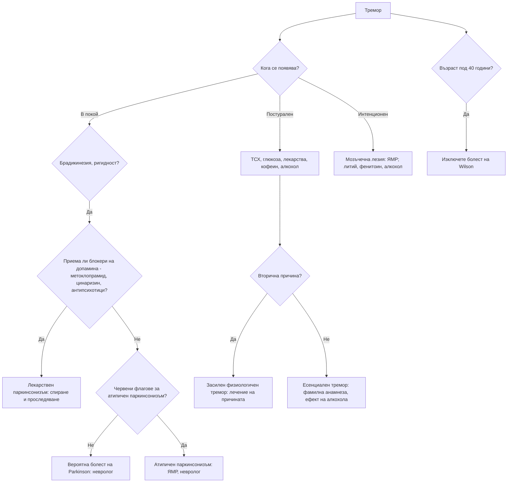

# Глава 48. Тремор и двигателни нарушения

> **Част IX. Нервна система**

## Цели на главата

- Да се класифицира треморът по условията, при които се появява: в покой, постурален, кинетичен, интенционен.
- Да се разграничават есенциалният тремор, треморът при болест на Parkinson и засиленият физиологичен тремор.
- Да се разпознават лекарственият паркинсонизъм и атипичните паркинсонови синдроми.
- Да се познават основните хиперкинетични нарушения: хорея, дистония, миоклонус, тикове.
- Да се разпознава синдромът на неспокойните крака.

## Ключови моменти

- Треморът се класифицира по условията на поява: в покой, постурален, кинетичен и интенционен *(SORT C [1])*.
- Паркинсонизмът изисква брадикинезия плюс тремор в покой или ригидност *(SORT C [2])*.
- Преди диагнозата болест на Parkinson се преглеждат лекарствата. Метоклопрамидът, цинаризинът, флунаризинът и антипсихотиците са чести причини за паркинсонизъм.
- При подозрение за болест на Parkinson пациентът се насочва бързо към специалист, без да се започва лечение *(SORT C [6])*.
- Паркинсонизъм, дистония или тремор преди 40 години изискват изключване на болестта на Wilson *(SORT C [3])*.
- При синдром на неспокойните крака се изследват феритин и трансферинова сатурация. Желязо се препоръчва при феритин ≤ 75 µg/l *(SORT C [5])*.

---

## 1. Класификация на тремора

*Таблица 48.1. Класификация на тремора.*

| Тип [1] | Кога се появява | Честота | Основни причини |
|---|---|---|---|
| **Тремор в покой** | Когато крайникът е отпуснат и подкрепен; намалява при движение | 4–6 Hz | **Болест на Parkinson** („броене на пари“), лекарствен паркинсонизъм, болест на Wilson |
| **Постурален тремор** | При задържане на поза (изпънати ръце) | 4–12 Hz | **Есенциален тремор**, **засилен физиологичен тремор**, лекарства, тиреотоксикоза, отнемане на алкохол, дистоничен тремор |
| **Кинетичен тремор** | По време на движение | Различна | Есенциален тремор, мозъчечни заболявания |
| **Интенционен тремор** | Засилва се при приближаване към целта (тест пръст-нос) | < 5 Hz | **Мозъчечни заболявания**: множествена склероза, инсулт, алкохол, лекарства (литий, фенитоин), тумори |
| **Ортостатичен тремор** | В **краката** при стоене; изчезва при ходене и сядане | 13–18 Hz | Възрастни хора; усещане за нестабилност при стоене |
| **Задачно-специфичен тремор** | Само при определена дейност (писане) | — | Дистония |
| **Функционален тремор** | Променлив, **намалява при отвличане на вниманието**, **приема ритъма** на движенията на другата ръка | Променлива | Функционално неврологично разстройство |
| **Астериксис** („пляскащ тремор“) | Кратки загуби на тонуса при изпънати ръце със свити назад китки | — | **Метаболитна енцефалопатия**: чернодробна, уремична, хиперкапния |

---

## 2. Есенциален тремор или болест на Parkinson?

*Таблица 48.2. Есенциален тремор или болест на Parkinson?*

| Белег | Есенциален тремор | Болест на Parkinson |
|---|---|---|
| Тип | **Постурален и кинетичен** | **В покой** (може да има и постурален компонент, който се появява след латентен период) |
| Симетрия | **Двустранен**, относително симетричен | **Асиметричен** в началото |
| Засягане | **Ръце, глава** (кимане „да-да“ или клатене „не-не“), **глас** | Ръка, крак, брадичка; **главата обикновено не е засегната** |
| Фамилна анамнеза | Честа (автозомно-доминантна) | По-рядка |
| **Ефект на алкохола** | **Подобрение** | Не |
| Почерк | Голям, треперещ | **Микрография** (дребен, намаляващ почерк) |
| Други белези | Няма (или лека атаксия при походката в тандем) | **Брадикинезия**, **ригидност** („зъбчато колело“), хипомимия, наведена стойка, ситна походка без размах на ръцете |
| Продромални симптоми | Няма | **Хипосмия**, **запек**, **нарушение на поведението по време на REM съня**, депресия |

### 2.1. Засилен физиологичен тремор

Фин, бърз постурален тремор на двете ръце. Причини:

- тревожност, умора, кофеин;
- **тиреотоксикоза**;
- **хипогликемия**;
- феохромоцитом;
- **отнемане на алкохол** и бензодиазепини;
- **лекарства**: бета-агонисти (салбутамол), **литий** (също и като признак на токсичност), **валпроат**, SSRI, амиодарон, теофилин, кортикостероиди, такролимус, левотироксин (предозиране), метоклопрамид, кофеин.

---

## 3. Паркинсонизъм

**Паркинсонизъм** = **брадикинезия** (задължителна) + тремор в покой и/или ригидност [2].

### 3.1. Причини

*Таблица 48.3. Паркинсонизъм: причини.*

| Причина | Особености |
|---|---|
| **Болест на Parkinson** | Асиметрично начало, тремор в покой, **добър и траен отговор на леводопа**, продромални симптоми |
| **Лекарствен паркинсонизъм** | **Симетричен**, тремор по-рядко, развива се за седмици–месеци след началото на лечението. Причинители: **антипсихотици** (типични, рисперидон), **метоклопрамид**, прохлорперазин, **цинаризин и флунаризин** (често предписвани при „световъртеж“ и „мозъчно кръвообращение“), валпроат, литий, амиодарон, резерпин, тетрабеназин. **Може да персистира месеци след спирането** |
| **Съдов паркинсонизъм** | „**Паркинсонизъм на долната половина на тялото**“ — предимно нарушение на походката, симетричен, без тремор; слаб отговор на леводопа; мозъчно-съдова болест |
| **Множествена системна атрофия** | **Ранна вегетативна недостатъчност** (ортостатична хипотония, уринарна инконтиненция, еректилна дисфункция), мозъчечни белези, стридор; слаб отговор на леводопа |
| **Прогресивна супрануклеарна парализа** | **Ранни падания назад**, **вертикална парализа на погледа** (особено надолу), аксиална ригидност, изправена стойка, „учудено“ изражение на лицето |
| **Кортикобазален синдром** | Асиметрична апраксия, феномен на „чуждата ръка“, кортикален сетивен дефицит, миоклонус |
| **Деменция с телца на Lewy** | Ранна деменция, флуктуации, зрителни халюцинации |
| **Нормотензивна хидроцефалия** | Нарушение на походката, инконтиненция, деменция |
| **Болест на Wilson** [3] | **Възраст под 40 години**; тремор („махане с крила“), дистония, дизартрия, психични симптоми, чернодробно заболяване, пръстени на Kayser-Fleischer |
| **Токсични** | **Манган** (включително при интравенозна употреба на „ефедрон“ — меткатинон, приготвен с перманганат), **въглероден оксид**, MPTP |
| **Структурни** | Тумор, хроничен субдурален хематом |

### 3.2. Червени флагове за атипичен или вторичен паркинсонизъм

- **Ранни падания** (в първите 3 години).
- **Бързо прогресиране.**
- **Слаб или никакъв отговор на леводопа.**
- **Ранна вегетативна недостатъчност.**
- Ранна деменция и халюцинации.
- **Вертикална парализа на погледа.**
- Мозъчечни или пирамидни белези.
- **Симетрично начало**, липса на тремор.
- **Начало преди 40 години** (болест на Wilson, генетични форми).
- **Прием на лекарства**, блокиращи допамина.

---

## 4. Хиперкинетични нарушения

*Таблица 48.4. Хиперкинетични нарушения.*

| Нарушение | Същност | Основни причини |
|---|---|---|
| **Хорея** | Неволеви, неправилни, „танцуващи“, преливащи се движения | **Болест на Huntington** (автозомно-доминантна, психични и когнитивни нарушения); **хорея на Sydenham** (след стрептококова инфекция при деца); лекарства (**дискинезии от леводопа**, орални контрацептиви, антиепилептични средства, стимуланти); **хипертиреоидизъм**; **системен лупус еритематодес и антифосфолипиден синдром**; **хорея на бременността**; полицитемия вера; **некетотична хипергликемия** (хемихорея при възрастни хора); инсулт (**хемибализъм** при лезия на субталамичното ядро); болест на Wilson |
| **Дистония** | Продължителни мускулни контракции, водещи до усукващи движения и патологични пози | **Фокална** (спастичен тортиколис, блефароспазъм, „писарски спазъм“); генерализирана (генетична); **остра дистонична реакция** (метоклопрамид, антипсихотици — окулогирна криза, тортиколис, тризмус при млади хора); **тардивна дискинезия** (продължително лечение с антипсихотици или метоклопрамид — орофациални движения) |
| **Миоклонус** | Внезапни, кратки, „шокови“ потрепвания | Физиологичен (при заспиване); **метаболитен** (уремия, чернодробна недостатъчност, хиперкапния); **лекарствен** (опиоиди, **габапентин и прегабалин при бъбречна недостатъчност**, SSRI — серотонинов синдром, литий, цефалоспорини); след хипоксия; **болест на Creutzfeldt-Jakob**; епилепсия (ювенилна миоклонична епилепсия); невродегенеративни заболявания |
| **Тикове** | Бързи, повтарящи се движения или звуци, предшествани от **неприятен позив**, **временно потискани** | **Синдром на Tourette** (начало преди 18 години, моторни и вокални тикове над 1 година), преходни тикове, вторични |
| **Хемифациален спазъм** | Едностранни неволеви контракции на лицевата мускулатура | Съдова компресия на лицевия нерв; рядко тумор |
| **Синдром на неспокойните крака** [4] | **Неудържимо желание** за движение на краката с неприятни усещания, **в покой, вечер и нощем**, **облекчава се при движение** | Идиопатичен; **желязодефицит** (желязо се препоръчва при феритин ≤ 75 µg/l или трансферинова сатурация < 20%) [5], ХБЗ, бременност, невропатия, **лекарства** (антихистамини, миртазапин и други антидепресанти, антипсихотици, метоклопрамид) |

---

## 5. Безопасна диагностична стратегия

*Таблица 48.5. Безопасна диагностична стратегия.*

| Въпрос | Отговор |
|---|---|
| **Вероятна диагноза** | Есенциален тремор, засилен физиологичен тремор, болест на Parkinson, лекарствен паркинсонизъм |
| **Сериозни заболявания, които не бива да се пропускат** | **Болест на Wilson** (при млади хора); **тиреотоксикоза**; **отнемане на алкохол** (делириум тременс); **литиева токсичност**; **серотонинов синдром** и **невролептичен малигнен синдром**; мозъчечни тумори и инсулт; болест на Creutzfeldt-Jakob; метаболитна енцефалопатия (астериксис) |
| **Чести капани** | **Лекарствен паркинсонизъм** (метоклопрамид, цинаризин, флунаризин, антипсихотици); валпроатов тремор; тремор от салбутамол; ортостатичен тремор, приет за „нестабилност“; функционален тремор; синдром на неспокойните крака при желязодефицит |
| **Маскиращи заболявания** | Лекарства, заболявания на щитовидната жлеза, алкохол, депресия (при болест на Parkinson), чернодробни заболявания |
| **Психосоциални аспекти** | Тревожност, социално затваряне поради тремора, злоупотреба с алкохол като „самолечение“ на есенциалния тремор |

---

## 6. Изследвания

- **Клиничната диагноза е основна.**
- ТСХ, глюкоза, електролити, калций, чернодробни и бъбречни показатели.
- **Нива на лекарства** (литий, валпроат).
- При възраст **под 40 години с паркинсонизъм, дистония или тремор**: **церулоплазмин**, мед в 24-часова урина, преглед с процепна лампа (**пръстени на Kayser-Fleischer**).
- Феритин (синдром на неспокойните крака).
- ЯМР при атипична картина, мозъчечни или пирамидни белези.
- **DaT сцинтиграфия** при съмнение за болест на Parkinson спрямо есенциален, лекарствен или функционален тремор. При болестта на Parkinson поемането е намалено, а при есенциалния, лекарствения, съдовия и функционалния тремор е нормално [6].

---

## 7. Диагностичен алгоритъм при тремор

*Фигура 48.1. Диагностичен алгоритъм при тремор. Схема на авторите въз основа на източниците, цитирани в главата.*

Текстово описание на фигура 48.1

1. Тремор. Следва: към т. 2; към т. 3.
2. **Въпрос:** Кога се появява? В покой — към т. 4; Постурален — към т. 5; Интенционен — към т. 6.
3. **Въпрос:** Възраст под 40 години? Да — към т. 7.
4. **Въпрос:** Брадикинезия, ригидност? Да — към т. 8.
5. ТСХ, глюкоза, лекарства, кофеин, алкохол. Следва: към т. 9.
6. Мозъчечна лезия: ЯМР; литий, фенитоин, алкохол.
7. Изключете болест на Wilson.
8. **Въпрос:** Приема ли блокери на допамина — метоклопрамид, цинаризин, антипсихотици? Да — към т. 10; Не — към т. 11.
9. **Въпрос:** Вторична причина? Да — към т. 12; Не — към т. 13.
10. Лекарствен паркинсонизъм: спиране и проследяване.
11. **Въпрос:** Червени флагове за атипичен паркинсонизъм? Не — към т. 14; Да — към т. 15.
12. Засилен физиологичен тремор: лечение на причината.
13. Есенциален тремор: фамилна анамнеза, ефект на алкохола.
14. Вероятна болест на Parkinson: невролог.
15. Атипичен паркинсонизъм: ЯМР, невролог.

---

## 8. Червени флагове и насочване

### 8.1. Червени флагове

- Паркинсонизъм с ранни падания, вертикална парализа на погледа или ранна вегетативна недостатъчност.
- Бързо прогресиране на двигателните нарушения.
- Тремор, дистония или паркинсонизъм преди 40 години.
- Остра дистонична реакция, особено със стридор.
- Тремор с треска, ригидност и нарушено съзнание след антипсихотик или серотонинергично лекарство.
- Нов интенционен тремор с атаксия.
- Внезапна хемихорея или хемибализъм.
- Тремор с белези на тиреотоксикоза, литиева токсичност или отнемане на алкохол.

### 8.2. Кога и колко спешно да насочим

*Таблица 48.6. Кога и колко спешно да насочим.*

| Спешност | Клинична ситуация |
|---|---|
| **Незабавно (112 или спешно отделение)** | Подозрение за невролептичен малигнен или серотонинов синдром; литиева токсичност; делириум тременс; остра дистонична реакция със стридор; внезапна хемихорея, хемибализъм или мозъчечна атаксия |
| **В същия ден** | Тремор или паркинсонизъм с белези на болест на Wilson (чернодробно заболяване, психични симптоми) [3] |
| **Бързо (до 2 седмици)** | Подозрение за болест на Parkinson — към специалист, без да се започва лечение [6]; атипичен паркинсонизъм; тремор или паркинсонизъм под 40 години [3] |
| **Планово** | Есенциален тремор, който нарушава ежедневните дейности; синдром на неспокойните крака без ефект от корекцията на желязото; тикове или дистония |
| **Проследяване в общата практика** | Засилен физиологичен тремор — лечение на причината; лекарствен паркинсонизъм — спиране на лекарството и повторна оценка след 3–6 месеца; синдром на неспокойните крака с желязодефицит [5] |

---

## 9. Клинични перли

- Треморът, който изчезва при движение, е паркинсонов. Треморът, който се появява при движение, е есенциален или мозъчечен.
- Треморът на главата насочва към есенциален или дистоничен тремор, а не към болест на Parkinson.
- Преди да поставите диагноза болест на Parkinson, прегледайте лекарствата. Метоклопрамидът, цинаризинът и флунаризинът са чести и пренебрегвани причини за паркинсонизъм.
- Паркинсонизъм, дистония или тремор преди 40 години: изключете болестта на Wilson. Тя е лечима.
- Ранните падания назад и затрудненият поглед надолу означават прогресивна супрануклеарна парализа, а не болест на Parkinson.
- Ранна ортостатична хипотония и уринарна инконтиненция при паркинсонизъм: множествена системна атрофия.
- Астериксисът е белег на метаболитна енцефалопатия, а не на неврологично заболяване.
- Остър тортиколис или окулогирна криза при млад човек след метоклопрамид: остра дистонична реакция. Лекува се с антихолинергично средство.
- Синдромът на неспокойните крака често се подобрява след корекция на желязодефицита.
- Миоклонус при пациент с бъбречна недостатъчност на габапентин или прегабалин: лекарствена токсичност.

---

## 10. Клиничен случай

**Етап 1 — представяне.** Жена на 74 години е насочена за „болест на Parkinson“. От 8 месеца ходи бавно, с къси стъпки, лицето ѝ е безизразно и трудно става от стол.

> **Въпрос 1.** Какво трябва да проверите, преди да приемете диагнозата?

**Етап 2 — лекарства и преглед.** От година приема цинаризин за „световъртеж и лошо кръвообращение на мозъка“, а от 6 месеца — метоклопрамид за гадене. При прегледа има симетрична брадикинезия и ригидност в четирите крайника и лек симетричен постурален тремор, без тремор в покой.

> **Въпрос 2.** Кое е по-вероятно — болест на Parkinson или лекарствен паркинсонизъм?

> **Въпрос 3.** Какво е поведението и какво ще направите, ако симптомите не отзвучат?

Обсъждане и отговори

**Отговор 1.** **Лекарствата.** Всеки нов паркинсонизъм изисква преглед на лекарствата, особено на блокерите на допаминовите рецептори.

**Отговор 2.** **Симетричната** картина, **липсата на тремор в покой** и едновременният прием на **два блокера на допаминовите рецептори** (цинаризин и метоклопрамид) насочват силно към **лекарствен паркинсонизъм**.

**Отговор 3.** И двете лекарства се спират. Световъртежът и гаденето се преоценяват за конкретна причина (вж. глави 41 и 22). Възстановяването може да отнеме **седмици до месеци**. Ако симптомите персистират над 6 месеца след спирането, трябва да се мисли за подлежаща болест на Parkinson, „отключена“ от лекарствата. Тогава помага DaT сцинтиграфията [6]. След 4 месеца пациентката ходи значително по-добре, а след 7 месеца симптомите са почти изчезнали.

**Поука.** Всеки нов паркинсонизъм изисква преглед на лекарствата. Лекарствата срещу „световъртеж“ и гадене са сред най-честите причинители.

---

## Обобщение

- Треморът се оценява по условията на поява. Есенциалният тремор е постурален и кинетичен, паркинсоновият е в покой, а мозъчечният е интенционен.
- Паркинсонизмът е брадикинезия с тремор в покой или ригидност. Лекарственият, съдовият и атипичният паркинсонизъм се разграничават от болестта на Parkinson.
- Хиперкинетичните нарушения (хорея, дистония, миоклонус, тикове) често имат лекарствени, метаболитни или наследствени причини.
- Болестта на Wilson при млади хора, острата дистонична реакция и невролептичният малигнен синдром не бива да се пропускат.

## Самопроверка

### Въпроси с един верен отговор

**1.** *(основно ниво)* Мъж на 65 години има тремор в покой на дясната ръка, който изчезва при движение, дребен почерк и намален размах на дясната ръка при ходене. Кое е правилното поведение?

- **А.** Пропранолол и контрол след 6 месеца
- **Б.** Бързо насочване към специалист без започване на лечение
- **В.** Започване на леводопа в общата практика
- **Г.** Само ЯМР на главата
- **Д.** Успокояване — възрастов тремор

Отговор и обосновка

**Верен отговор: Б.** Асиметричният тремор в покой и брадикинезията насочват към болест на Parkinson. NICE препоръчва бързо насочване към специалист без започване на лечение [6].

**2.** *(основно ниво)* Жена на 50 години има двустранен тремор на ръцете при държане на чаша и писане и клатене на главата „не-не“. Треморът намалява след чаша вино. Майка ѝ има същото. Коя е най-вероятната диагноза?

- **А.** Болест на Parkinson
- **Б.** Есенциален тремор
- **В.** Мозъчечен тремор
- **Г.** Тиреотоксикоза
- **Д.** Функционален тремор

Отговор и обосновка

**Верен отговор: Б.** Двустранният постурален и кинетичен тремор с засягане на главата, ефект от алкохола и фамилна анамнеза е типичен за есенциален тремор.

**3.** *(основно ниво)* Мъж на 19 години получава принудително отклонение на очите нагоре и извиване на шията 12 часа след метоклопрамид. Съзнанието е ясно. Коя е диагнозата?

- **А.** Епилептичен пристъп
- **Б.** Остра дистонична реакция
- **В.** Невролептичен малигнен синдром
- **Г.** Тардивна дискинезия
- **Д.** Функционално разстройство

Отговор и обосновка

**Верен отговор: Б.** Окулогирната криза и тортиколисът след метоклопрамид при млад човек са остра дистонична реакция. Лекува се с антихолинергично средство.

**4.** *(напреднало ниво)* Мъж на 34 години има тремор на ръцете, дизартрия и депресия от година. Трансаминазите са повишени. Кое изследване е най-подходящо?

- **А.** DaT сцинтиграфия
- **Б.** Церулоплазмин, мед в 24-часова урина и преглед с процепна лампа
- **В.** Само ТСХ
- **Г.** Генетично изследване за болест на Huntington
- **Д.** ЕЕГ

Отговор и обосновка

**Верен отговор: Б.** Неврологичните и психичните симптоми с чернодробно засягане под 40 години насочват към болест на Wilson — лечимо заболяване [3].

**5.** *(напреднало ниво)* Жена на 70 години с паркинсонизъм от 2 години пада назад още от началото на заболяването и трудно гледа надолу. Отговорът на леводопа е слаб. Коя е най-вероятната диагноза?

- **А.** Болест на Parkinson
- **Б.** Прогресивна супрануклеарна парализа
- **В.** Есенциален тремор
- **Г.** Лекарствен паркинсонизъм
- **Д.** Болест на Wilson

Отговор и обосновка

**Верен отговор: Б.** Ранните падания назад, вертикалната парализа на погледа (особено надолу) и слабият отговор на леводопа са типични за прогресивна супрануклеарна парализа.

### Задача

Жена на 45 години от година не може да заспи заради неприятни усещания и нужда да движи краката вечер. При разходка усещанията изчезват. Има обилна менструация. Приема миртазапин за безсъние. Как ще подходите?

Решение

Картината отговаря на **синдром на неспокойните крака** [4]. Изследват се феритин и трансферинова сатурация, по възможност сутрин. При феритин ≤ 75 µg/l или сатурация < 20% се дава желязо [5]. Обилната менструация е вероятната причина за желязодефицита и изисква оценка. Миртазапинът може да влошава симптомите, затова се обсъжда смяната му. Проверяват се и бъбречната функция и наличието на невропатия.

### OSCE станция: Преглед при тремор

**Време:** 7 минути. **Ниво:** основно (студенти, специализанти).

**Задача за кандидата.** Мъж на 68 години се оплаква от треперене на дясната ръка. Направете насочен преглед и определете вида на тремора.

**Информация за симулирания пациент (за изпитващия).** Треперене на дясната ръка в покой, което намалява при протягане на ръцете. Движенията с пръстите вдясно са забавени и намаляват по амплитуда. Има ригидност тип „зъбчато колело“ в дясната китка.

*Таблица 48.7. OSCE станция: Преглед при тремор — рубрика за оценяване.*

| Критерий | Точки |
|---|---|
| Наблюдава ръцете в покой (в скута), при изпънати ръце и при тест пръст-нос | 2 |
| Изследва брадикинезията с потупване с пръсти и отваряне и затваряне на ръката | 2 |
| Изследва ригидността в китките и лактите, с активиране на другата ръка | 1 |
| Оценява походката (размах на ръцете, крачка, обръщане) | 1 |
| Проверява почерка или рисуване на спирала | 1 |
| Пита за лекарства, блокиращи допамина | 2 |
| Обобщава находката като вероятен паркинсонизъм и предлага насочване | 1 |
| **Общо** | **10** |

**Праг за успешно представяне:** 7 от 10 точки, включително оценката на брадикинезията и въпроса за лекарствата.

## Литература

1. Bhatia KP, Bain P, Bajaj N, Elble RJ, Hallett M, Louis ED, et al. Consensus Statement on the classification of tremors. from the task force on tremor of the International Parkinson and Movement Disorder Society. Mov Disord. 2018;33(1):75-87. doi:10.1002/mds.27121. PMID: 29193359.
2. Postuma RB, Berg D, Stern M, Poewe W, Olanow CW, Oertel W, et al. MDS clinical diagnostic criteria for Parkinson's disease. Mov Disord. 2015;30(12):1591-601. doi:10.1002/mds.26424. PMID: 26474316.
3. European Association for the Study of the Liver. EASL-ERN Clinical Practice Guidelines on Wilson's disease. J Hepatol. 2025;82(4):690-728. doi:10.1016/j.jhep.2024.11.007. PMID: 40089450.
4. Allen RP, Picchietti DL, Garcia-Borreguero D, Ondo WG, Walters AS, Winkelman JW, et al. Restless legs syndrome/Willis-Ekbom disease diagnostic criteria: updated International Restless Legs Syndrome Study Group (IRLSSG) consensus criteria--history, rationale, description, and significance. Sleep Med. 2014;15(8):860-73. doi:10.1016/j.sleep.2014.03.025. PMID: 25023924.
5. Winkelman JW, Berkowski JA, DelRosso LM, Koo BB, Scharf MT, Sharon D, et al. Treatment of restless legs syndrome and periodic limb movement disorder: an American Academy of Sleep Medicine clinical practice guideline. J Clin Sleep Med. 2025;21(1):137-152. doi:10.5664/jcsm.11390. PMID: 39324694.
6. National Institute for Health and Care Excellence. Parkinson’s disease in adults (NICE guideline NG71). London: NICE; 2017. Достъпно на: https://www.nice.org.uk/guidance/ng71

*Последна проверка на съдържанието: септември 2026 г. Следващ планиран преглед: септември 2027 г. (вж. „Политика за актуализация“ в README).*

<!-- навигация -->

---

[← Глава 47. Изтръпване, парестезии и периферни невропатии](47-parestezii-nevropatii.md) · [Съдържание](../README.md) · [Глава 49. Болка в гърба →](49-bolka-v-garba.md)
