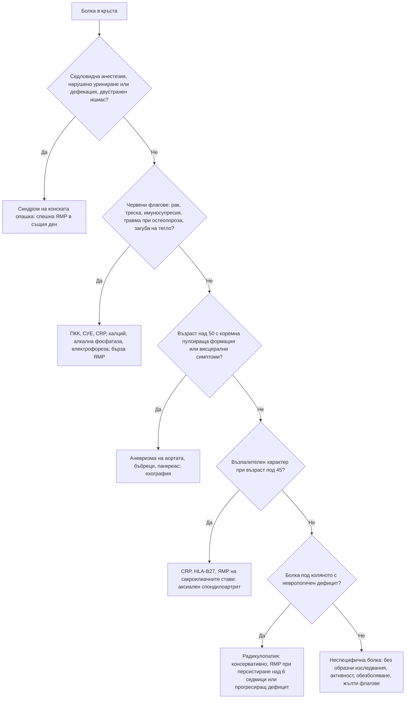

# Глава 49. Болка в гърба

> **Част X. Опорно-двигателен апарат**

## Цели на главата

- Да се класифицира болката в кръста като неспецифична, радикулерна или дължаща се на специфична сериозна патология.
- Да се прилагат червените флагове разумно, като се отчита, че поотделно те имат ниска предсказваща стойност.
- Да се разпознават синдромът на конската опашка, метастатичната компресия и спондилодисцитът като спешни състояния.
- Да се разпознава възпалителната болка в гърба и аксиалният спондилоартрит.
- Да се оценяват психосоциалните („жълтите“) флагове за хронифициране.
- Да се определят показанията за образно изследване при болка в гърба и да се обяснява на пациента защо то не е нужно при неспецифична болка.

## Ключови моменти

- Около 90% от болката в кръста е неспецифична, а сериозна специфична причина има при 1–2% *(SORT B [1])*.
- Поотделно червените флагове имат ниска предсказваща стойност. Най-силният белег за метастази е анамнезата за злокачествено заболяване *(SORT B [3])*.
- Седловидна анестезия, нарушено уриниране или дефекация и двустранен ишиас налагат ЯМР в същия ден *(SORT C [4])*.
- При неспецифична болка без червени флагове образни изследвания не се правят рутинно *(SORT A [5])*.
- Възпалителната болка в гърба насочва към аксиален спондилоартрит. Ранната рентгенография често е нормална, а изследване на избор е ЯМР на сакроилиачните стави *(SORT B [6, 7])*.
- Жълтите флагове и въпросникът STarT Back откриват риска от хронифициране *(SORT B [5])*.

---

## 1. Класификация

*Таблица 49.1. Класификация.*

| Група | Дял [1] | Същност |
|---|---|---|
| **Неспецифична (механична) болка в кръста** | ≈ 90% | Без установима специфична причина; обикновено се подобрява за 2–6 седмици |
| **Радикулерна болка (ишиас)** | ≈ 5–10% | Болка по хода на нервно коренче, обикновено поради дискова херния или стеноза |
| **Специфична сериозна патология** | ≈ 1–2% | Фрактура, злокачествено заболяване, инфекция, синдром на конската опашка, аксиален спондилоартрит, висцерална болка |

---

## 2. Етиологична класификация

*Таблица 49.2. Етиологична класификация.*

| Група | Причини |
|---|---|
| **Механични** | Неспецифична болка (мускулно-лигаментарна, фасетни стави, дискогенна), дискова херния, спинална стеноза, спондилолистеза, остеопорозна компресионна фрактура, травма |
| **Възпалителни** | Аксиален спондилоартрит (анкилозиращ спондилит, болест на Бехтерев), псориатичен артрит, ентеропатичен спондилоартрит, реактивен артрит |
| **Инфекциозни** | Спондилодисцит, епидурален абсцес (интравенозна употреба на наркотици, диабет, имуносупресия, скорошна процедура на гръбначния стълб, бактериемия), туберкулозен спондилит (болест на Pott), бруцелозен спондилит и сакроилеит (в България бруцелозата е рядка, но протича с огнища, свързани с домашни кози и непастьоризирано мляко) [2] |
| **Злокачествени** | Метастази (гърда, простата, бял дроб, бъбрек, щитовидна жлеза), мултиплен миелом, лимфом, първични тумори |
| **Метаболитни** | Остеопороза, остеомалация, болест на Paget, хиперпаратиреоидизъм |
| **Отразена висцерална болка** | Аневризма на коремната аорта, дисекация на аортата, пиелонефрит, бъбречна колика, панкреатит, задна пептична язва, холецистит, тазови заболявания (ендометриоза, възпалителна болест на малкия таз), простатит, ретроперитонеални процеси (лимфом, саркоми), херпес зостер |
| **Други** | Фибромиалгия, психогенни фактори |

---

## 3. Безопасна диагностична стратегия

*Таблица 49.3. Безопасна диагностична стратегия.*

| Въпрос | Отговор |
|---|---|
| **Вероятна диагноза** | Неспецифична болка в кръста, дискова херния с радикулопатия, спинална стеноза (при възрастни хора), остеоартроза на фасетните стави |
| **Сериозни заболявания, които не бива да се пропускат** | Синдром на конската опашка; метастатична компресия на гръбначния мозък; спондилодисцит и епидурален абсцес; миелом; фрактура; аневризма на коремната аорта и дисекация на аортата; ретроперитонеални тумори |
| **Чести капани** | Аксиален спондилоартрит (средно забавяне на диагнозата с години); бруцелоза; остеопорозна фрактура при минимална травма; бъбречно заболяване; херпес зостер преди обрива; ендометриоза; периферна артериална болест („ишиас“ с липсващи пулсации – вж. глава 14) |
| **Маскиращи заболявания** | Депресия, гръбначна дисфункция, инфекция на пикочните пътища, злокачествени заболявания |
| **Психосоциални аспекти** | Страх от движение, катастрофизиране, депресия, неудовлетвореност от работата, спорове за обезщетения |

---

## 4. Червени флагове

Всеки червен флаг поотделно има ниска положителна предсказваща стойност. Много хора с неспецифична болка имат някой от тях. Значение имат съчетанието и клиничният контекст. Най-силният предиктор за злокачествено заболяване е анамнезата за злокачествено заболяване [3, 4].

*Таблица 49.4. Червени флагове.*

| Подозирано състояние | Червени флагове |
|---|---|
| **Синдром на конската опашка** | Седловидна анестезия (изтръпване в перинеума, седалищната и гениталната област); нарушено уриниране (задръжка, променено усещане, затруднено начало, инконтиненция); фекална инконтиненция или загуба на усещането при дефекация; двустранен ишиас; сексуална дисфункция; прогресираща слабост в краката |
| **Злокачествено заболяване** | Анамнеза за рак; необяснима загуба на тегло; възраст над 50 години; болка, която не се подобрява след 4–6 седмици; постоянна нощна болка или болка в покой; гръдна болка; болка, която се засилва в легнало положение |
| **Инфекция** | Треска, тръпки; интравенозна употреба на наркотици; имуносупресия (кортикостероиди, биологични средства, HIV); диабет; скорошна инфекция (урогенитална, кожна) или бактериемия; скорошна процедура на гръбначния стълб; консумация на непастьоризирани млечни продукти и контакт с животни (бруцелоза) |
| **Фрактура** | Значима травма; лека травма при възрастни хора или при остеопороза; продължителна кортикостероидна терапия; възраст над 70 години; внезапна силна болка |
| **Висцерална или съдова причина** | Възрастен мъж пушач (аневризма на аортата); пулсираща формация в корема; болка, която не се променя при движение; коремни, уринарни или гинекологични симптоми |
| **Общи** | Прогресиращ неврологичен дефицит; структурна деформация; общо неразположение |

### 4.1. „Жълти флагове“ (психосоциални предиктори на хронифициране)

- Убеждение, че болката е вредна и че движението я влошава.
- Поведение на избягване от страх, пасивност, очакване на пасивно лечение.
- Потиснато настроение, тревожност, социална изолация.
- Неудовлетвореност от работата, спорове за обезщетения, продължителен отпуск по болест.

Рискът от хронифициране в общата практика може да се оцени с въпросника **STarT Back** [5].

---

## 5. Анамнеза и физикален преглед

**Анамнеза:**

- начало (внезапно, след усилие, постепенно), продължителност;
- локализация, ирадиация (**под коляното** – радикулерна);
- **механичен или възпалителен характер** (вж. т. 6);
- неврологични и **тазови симптоми**;
- общи симптоми;
- анамнеза за злокачествено заболяване, остеопороза, кортикостероиди, имуносупресия;
- психосоциален контекст.

**Физикален преглед:**

- оглед (стойка, деформация), палпация и перкусия (локална болезненост на прешлените – фрактура, инфекция, тумор);
- обем на движение;
- **симптом на Lasègue** (повдигане на изпънатия крак) и кръстосан симптом на Lasègue;
- **неврологичен преглед:** сила (дорзална флексия на палеца – L5, ходене на пръсти – S1, ходене на пети – L5), рефлекси (коленен – L4, ахилесов – S1), сетивност по дерматоми;
- **при подозрение за синдром на конската опашка:** сетивност в перинеума и ректално туше (тонус на сфинктера), измерване на остатъчната урина;
- корем (аневризма, формации), пулсации на краката (съдова клаудикация), сакроилиачните стави, кожата (херпес зостер, псориазис).

---

## 6. Механична или възпалителна болка в гърба

*Таблица 49.5. Механична или възпалителна болка в гърба.*

| Белег | Механична | Възпалителна (аксиален спондилоартрит) [6] |
|---|---|---|
| Възраст при началото | Всяка | **Под 40–45 години** |
| Начало | Често остро, след натоварване | **Постепенно** |
| Продължителност | Често кратка | **Над 3 месеца** |
| Сутрешна скованост | Кратка (под 30 минути) | **Продължителна (над 30–60 минути)** |
| Физическа активност | Влошава | **Подобрява** |
| Почивка | Облекчава | Не облекчава или влошава |
| Нощна болка | Рядко | **Събужда пациента през втората половина на нощта** |
| Болка в седалището | Рядко | Редуваща се лява и дясна |
| Отговор на НСПВС | Умерен | Изразен (за 24–48 часа) |

**Други белези на спондилоартрит:**

- **преден увеит** (остро болезнено червено око);
- **псориазис**;
- **възпалителни болести на червата**;
- **ентезит** (ахилесово сухожилие, плантарна фасция);
- **дактилит** („наденицовидни“ пръсти);
- периферен артрит;
- **фамилна анамнеза**;
- **HLA-B27**;
- повишен CRP (не при всички).

**Критерии на ASAS за аксиален спондилоартрит** (болка в гърба ≥ 3 месеца, начало преди 45 години) [7]:

- сакроилеит при образно изследване (ЯМР или рентгенография) + ≥ 1 белег на спондилоартрит, или
- **HLA-B27** + ≥ 2 други белега на спондилоартрит.

**Рентгенографията често е нормална в ранния стадий.** Изследване на избор е **ЯМР на сакроилиачните стави**. Забавянето на диагнозата средно е с години.

---

## 7. Специфични състояния

*Таблица 49.6. Специфични състояния.*

| Заболяване | Ключови белези | Изследване |
|---|---|---|
| **Дискова херния с радикулопатия** | Болка под коляното, по-силна от тази в кръста; положителен симптом на Lasègue; дефицит в съответното коренче (L5, S1) | ЯМР при персистиране над 6 седмици, тежък или прогресиращ дефицит или при планиране на операция |
| **Синдром на конската опашка** | Вж. червените флагове | **Спешна ЯМР в същия ден** |
| **Спинална стеноза** | Възрастни хора, неврогенна клаудикация, облекчаване при флексия (вж. глава 14) | ЯМР при планиране на лечение |
| **Остеопорозна компресионна фрактура** | Възрастни жени, кортикостероиди; внезапна болка след минимална травма (кашлица, повдигане); загуба на ръст, кифоза | Рентгенография; при нетипична локализация (над Th7), млада възраст или литични лезии – изключване на миелом и метастази |
| **Метастази, миелом** | Анамнеза за рак, нощна болка, загуба на тегло, възраст над 50 години | ПКК, СУЕ, CRP, калций, алкална фосфатаза, електрофореза и свободни леки вериги, ПСА; ЯМР |
| **Спондилодисцит, епидурален абсцес** | Персистираща болка, болезненост при перкусия, треска (често липсва), рискови фактори; повишени CRP и СУЕ | ЯМР, хемокултури, биопсия; серология за бруцелоза; изследвания за туберкулоза |
| **Аксиален спондилоартрит** | Възпалителна болка, млади хора | CRP, HLA-B27, ЯМР на сакроилиачните стави |
| **Аневризма на коремната аорта** | Възрастен мъж пушач, пулсираща формация, внезапна силна болка с хипотония при руптура | Ехография, КТ |
| **Пиелонефрит** | Треска, болезненост в костовертебралния ъгъл, уринарни симптоми | Урина, урокултура |

### 7.1. Болка в гръдния отдел

Болката в гръдния отдел по-често има сериозна причина, отколкото болката в кръста. Трябва да се мисли за:

- метастази, миелом, остеопорозна фрактура;
- дисекация на аортата, миокарден инфаркт, белодробна тромбемболия, пневмония;
- пептична язва, панкреатит, холецистит;
- **херпес зостер**;
- дискова херния в гръдния отдел;
- болест на Scheuermann при юноши.

---

## 8. Изследвания

- **При неспецифична болка в кръста без червени флагове образни изследвания не се правят рутинно** [5]. Те не подобряват резултата и водят до свръхдиагностика. Дисковите протрузии и дегенеративните промени са много чести и при хора без болка.
- **При червени флагове:**
  - ПКК, СУЕ, CRP, калций, алкална фосфатаза;
  - електрофореза и свободни леки вериги (при възраст над 50 години);
  - ПСА (при мъже, след информиране);
  - изследване на урината;
  - **ЯМР** – спешно при синдром на конската опашка, компресия на гръбначния мозък, инфекция, злокачествено заболяване;
  - рентгенография или КТ при подозрение за фрактура.
- **При възпалителна болка:** CRP, HLA-B27, ЯМР на сакроилиачните стави.

---

## 9. Диагностичен алгоритъм

*Фигура 49.1. Диагностичен алгоритъм: болка в гърба. Схема на авторите въз основа на източниците, цитирани в главата.*

Текстово описание на фигура 49.1

1. Болка в кръста. Следва: към т. 2.
2. **Въпрос:** Седловидна анестезия, нарушено уриниране или дефекация, двустранен ишиас? Да – към т. 3; Не – към т. 4.
3. Синдром на конската опашка: спешна ЯМР в същия ден.
4. **Въпрос:** Червени флагове: рак, треска, имуносупресия, травма при остеопороза, загуба на тегло? Да – към т. 5; Не – към т. 6.
5. ПКК, СУЕ, CRP, калций, алкална фосфатаза, електрофореза; бърза ЯМР.
6. **Въпрос:** Възраст над 50 с коремна пулсираща формация или висцерални симптоми? Да – към т. 7; Не – към т. 8.
7. Аневризма на аортата, бъбреци, панкреас: ехография.
8. **Въпрос:** Възпалителен характер при възраст под 45? Да – към т. 9; Не – към т. 10.
9. CRP, HLA-B27, ЯМР на сакроилиачните стави: аксиален спондилоартрит.
10. **Въпрос:** Болка под коляното с неврологичен дефицит? Да – към т. 11; Не – към т. 12.
11. Радикулопатия: консервативно; ЯМР при персистиране над 6 седмици или прогресиращ дефицит.
12. Неспецифична болка: без образни изследвания, активност, обезболяване, жълти флагове.

---

## 10. Особености в общата практика

- Обяснете на пациента, че неспецифичната болка в кръста е честа, обикновено не е опасна и се подобрява. Препоръчайте физическа активност вместо легло.
- Дайте на всеки пациент с ишиас **писмени указания** за симптомите на синдрома на конската опашка и какво да прави, ако се появят.
- Не назначавайте рентгенография „за успокоение“. Находките, като дегенеративни промени и протрузии, могат да увеличат тревожността и да хронифицират болката.
- Преоценете пациента, ако няма подобрение за 4–6 седмици.

---

## 11. Кога и колко спешно да насочим

*Таблица 49.7. Кога и колко спешно да насочим.*

| Спешност | Клинична ситуация |
|---|---|
| **Незабавно (112 или спешно отделение)** | Подозрение за синдром на конската опашка – ЯМР в същия ден [4]; подозрение за компресия на гръбначния мозък с неврологичен дефицит – ЯМР до 24 часа [8]; болка в гърба с хипотония или пулсираща формация в корема; внезапна разкъсваща болка в гърба или гърдите; болка в гърба с треска и неврологичен дефицит |
| **В същия ден** | Болка в гърба с треска и рискови фактори за инфекция (интравенозна употреба на наркотици, диабет, диализа, имуносупресия) |
| **Бързо (до 2 седмици)** | Подозрение за метастази или миелом без неврологичен дефицит – ЯМР до 1 седмица [8]; остеопорозна фрактура с нетипична локализация; прогресиращ радикулерен дефицит |
| **Планово** | Радикулопатия, която персистира над 6 седмици въпреки консервативното лечение; подозрение за аксиален спондилоартрит – ревматолог [7]; спинална стеноза, която ограничава ходенето |
| **Проследяване в общата практика** | Неспецифична болка в кръста – информация, активност, обезболяване и преоценка след 4–6 седмици [5]; писмени указания за симптомите на синдрома на конската опашка при всеки пациент с ишиас |

---

## 12. Клинични перли

- Синдромът на конската опашка започва незабележимо: с променено усещане при уриниране и слабо изтръпване. Задръжката на урина е късен белег.
- Анамнезата за злокачествено заболяване е най-силният червен флаг за метастази. Новата болка в гърба при пациент с карцином на гърдата или простатата изисква ЯМР.
- Болка в гърба при интравенозен употребител на наркотици, диабетик или пациент на хемодиализа: помислете за спондилодисцит и епидурален абсцес, дори без треска.
- Млад човек с болка в гърба, която се подобрява при движение и събужда сутрин: аксиален спондилоартрит. Попитайте за увеит, псориазис и възпалителни болести на червата.
- Бруцелозата в България е рядка, но протича с огнища. При болка в гърба с треска питайте за контакт с животни и за непастьоризирани млечни продукти [2].
- Внезапна болка в гърба при възрастна жена след кашляне: остеопорозна фрактура. При нетипична находка помислете за миелом.
- Възрастен мъж пушач с болка в гърба: изключете аневризма на коремната аорта.

---

## 13. Клиничен случай

**Етап 1 – представяне.** Мъж на 32 години от година и половина има болки в кръста и седалището, които сменят страната си. Сутрин е „скован като дърво“ около час. Болките се подобряват след раздвижване и душ и се влошават при продължително седене. Събужда се от болка около 4 ч. сутринта.

> **Въпрос 1.** Механична или възпалителна е болката? Какво още ще попитате?

**Етап 2 – допълнителна анамнеза и изследвания.** Преди година е лекуван за „конюнктивит“ на дясното око с болка и фотофобия. Болката в гърба се подобрява значително при прием на ибупрофен. Лумбалната рентгенография е без отклонения, а CRP е 18 mg/l.

> **Въпрос 2.** Коя е най-вероятната диагноза?

> **Въпрос 3.** Кои изследвания ще я потвърдят и къде ще насочите пациента?

Обсъждане и отговори

**Отговор 1.** Болката е **възпалителна**: начало в млада възраст, продължителност над 3 месеца, дълга сутрешна скованост, подобрение при движение и нощна болка през втората половина на нощта [6]. Питат се извънставните прояви: увеит, псориазис, възпалителни болести на червата, ентезит, дактилит и фамилна анамнеза.

**Отговор 2.** Аксиален спондилоартрит. Епизодът на „конюнктивит“ с болка и фотофобия е най-вероятно преден увеит. Нормалната рентгенография не изключва диагнозата.

**Отговор 3.** Изследват се HLA-B27 (положителен) и ЯМР на сакроилиачните стави, която показва активен двустранен сакроилеит с оток на костния мозък [7]. Пациентът се насочва към ревматолог. При недостатъчен ефект от НСПВС са показани биологични средства.

**Поука.** Възпалителната болка в гърба има ясни клинични белези. Питайте за сутрешната скованост, ефекта от движението и за извънставните прояви.

---

## Обобщение

- Болката в кръста е неспецифична (около 90%), радикулерна или от сериозна специфична патология (1–2%).
- Червените флагове се тълкуват в съчетание и според контекста. Синдромът на конската опашка, компресията на гръбначния мозък и инфекцията изискват спешна ЯМР.
- Възпалителната болка в гърба при млади хора насочва към аксиален спондилоартрит. Ранната рентгенография често е нормална.
- При неспецифична болка образни изследвания не се правят рутинно. Лечението включва информация, активност и оценка на жълтите флагове.

## Самопроверка

### Въпроси с един верен отговор

**1.** *(основно ниво)* Мъж на 35 години има остра болка в кръста от 3 дни след вдигане на тежест. Няма червени флагове и неврологичен дефицит. Кое е правилното поведение?

- **А.** Рентгенография на лумбалния отдел
- **Б.** ЯМР на лумбалния отдел
- **В.** Обяснение, насърчаване на активността и обезболяване, без образни изследвания
- **Г.** Легло за 2 седмици
- **Д.** Насочване към неврохирург

Отговор и обосновка

**Верен отговор: В.** При неспецифична болка без червени флагове образни изследвания не се правят рутинно [5]. Активността ускорява възстановяването.

**2.** *(основно ниво)* Жена на 45 години с ишиас от 2 седмици съобщава за изтръпване в областта на седалището и затруднено начало на уринирането от вчера. Кое е правилното поведение?

- **А.** НСПВС и контрол след седмица
- **Б.** Незабавно насочване за ЯМР в същия ден
- **В.** Планова ЯМР
- **Г.** Физиотерапия
- **Д.** Урокултура

Отговор и обосновка

**Верен отговор: Б.** Седловидната анестезия и нарушеното уриниране при ишиас са белези на синдрома на конската опашка. Изисква се ЯМР в същия ден [4].

**3.** *(основно ниво)* Кой белег има най-висока предсказваща стойност за метастази при болка в гърба?

- **А.** Възраст над 50 години
- **Б.** Нощна болка
- **В.** Анамнеза за злокачествено заболяване
- **Г.** Болка, която не се подобрява за 1 месец
- **Д.** Болка при кашлица

Отговор и обосновка

**Верен отговор: В.** Повечето червени флагове поотделно почти не променят вероятността. Анамнезата за злокачествено заболяване е най-силният белег за метастази [3].

**4.** *(напреднало ниво)* Жена на 28 години от година има болки в кръста със сутрешна скованост над час, които се подобряват при движение. Преди 6 месеца е имала преден увеит. Лумбалната рентгенография е нормална. Кое е най-подходящото следващо изследване?

- **А.** КТ на лумбалния отдел
- **Б.** HLA-B27, CRP и ЯМР на сакроилиачните стави
- **В.** Денситометрия
- **Г.** Сцинтиграфия на скелета
- **Д.** Електромиография

Отговор и обосновка

**Верен отговор: Б.** Възпалителната болка с увеит насочва към аксиален спондилоартрит. Рентгенографията често е нормална в ранния стадий, а ЯМР открива активния сакроилеит [7].

**5.** *(напреднало ниво)* Мъж на 58 години на хемодиализа има болка в гръдно-поясния отдел от 3 седмици, по-силна нощем. Няма треска. CRP е 85 mg/l, а прешлените Th12–L1 са болезнени при перкусия. Коя е най-вероятната диагноза?

- **А.** Неспецифична болка в кръста
- **Б.** Спондилодисцит
- **В.** Аксиален спондилоартрит
- **Г.** Спинална стеноза
- **Д.** Фибромиалгия

Отговор и обосновка

**Верен отговор: Б.** Хемодиализата е рисков фактор за спондилодисцит. Треската често липсва. Необходими са ЯМР, хемокултури и при нужда биопсия.

### Задача

Мъж на 50 години отглежда кози в Кюстендилско. От месец има болка в кръста, вечерни температури до 38,5 °C, изпотяване и отпадналост. Пие непастьоризирано козе мляко. Как ще подходите?

Решение

Треската, болката в гърба и експозицията насочват към **бруцелоза** със спондилит или сакроилеит [2]. Изследват се ПКК, СУЕ, CRP, серология за бруцелоза и хемокултури (лабораторията се предупреждава за подозрението заради риска от заразяване). Прави се ЯМР на гръбначния стълб. Пациентът се насочва към инфекционист. Заболяването подлежи на съобщаване, а семейството и контактните лица се изследват при симптоми.

### OSCE станция: Неврологичен преглед при ишиас

**Време:** 7 минути. **Ниво:** основно (студенти, специализанти).

**Задача за кандидата.** Мъж на 40 години има болка по задната страна на левия крак до стъпалото от 10 дни. Прегледайте го и дайте указания.

**Информация за симулирания пациент (за изпитващия).** Симптомът на Lasègue вляво е положителен при 40°. Ахилесовият рефлекс вляво е намален, а ходенето на пръсти е затруднено вляво. Няма седловидна анестезия и нарушения на уринирането.

*Таблица 49.8. OSCE станция „Неврологичен преглед при ишиас“ – критерии за оценяване.*

| Критерий | Точки |
|---|---|
| Изследва симптома на Lasègue и кръстосания симптом | 1 |
| Изследва силата: дорзална флексия на палеца (L5), ходене на пръсти (S1) и на пети (L5) | 2 |
| Изследва коленния и ахилесовия рефлекс | 2 |
| Изследва сетивността по дерматоми L4, L5 и S1 | 1 |
| Пита за седловидна анестезия, уриниране и дефекация | 2 |
| Определя засегнатото коренче (S1) и дава писмени указания за спешни симптоми | 2 |
| **Общо** | **10** |

**Праг за успешно изпълнение:** 7 от 10 точки, включително въпросите за синдрома на конската опашка.

## Литература

1. Maher C, Underwood M, Buchbinder R. Non-specific low back pain. Lancet. 2017;389(10070):736-747. doi:10.1016/S0140-6736(16)30970-9. PMID: 27745712.
2. Nenova R, Tomova I, Saparevska R, Kantardjiev T. A new outbreak of brucellosis in Bulgaria detected in July 2015--preliminary report. Euro Surveill. 2015;20(39). doi:10.2807/1560-7917.ES.2015.20.39.30031. PMID: 26537337.
3. Downie A, Williams CM, Henschke N, Hancock MJ, Ostelo RW, de Vet HC, et al. Red flags to screen for malignancy and fracture in patients with low back pain: systematic review. BMJ. 2013;347:f7095. doi:10.1136/bmj.f7095. PMID: 24335669.
4. Finucane LM, Downie A, Mercer C, Greenhalgh SM, Boissonnault WG, Pool-Goudzwaard AL, et al. International Framework for Red Flags for Potential Serious Spinal Pathologies. J Orthop Sports Phys Ther. 2020;50(7):350-372. doi:10.2519/jospt.2020.9971. PMID: 32438853.
5. National Institute for Health and Care Excellence. Low back pain and sciatica in over 16s: assessment and management (NICE guideline NG59). London: NICE; 2016 [актуализирано 2026]. Достъпно на: https://www.nice.org.uk/guidance/ng59
6. Sieper J, van der Heijde D, Landewé R, Brandt J, Burgos-Vagas R, Collantes-Estevez E, et al. New criteria for inflammatory back pain in patients with chronic back pain: a real patient exercise by experts from the Assessment of SpondyloArthritis international Society (ASAS). Ann Rheum Dis. 2009;68(6):784-8. doi:10.1136/ard.2008.101501. PMID: 19147614.
7. Rudwaleit M, van der Heijde D, Landewé R, Listing J, Akkoc N, Brandt J, et al. The development of Assessment of SpondyloArthritis international Society classification criteria for axial spondyloarthritis (part II): validation and final selection. Ann Rheum Dis. 2009;68(6):777-83. doi:10.1136/ard.2009.108233. PMID: 19297344.
8. National Institute for Health and Care Excellence. Spinal metastases and metastatic spinal cord compression (NICE guideline NG234). London: NICE; 2023. Достъпно на: https://www.nice.org.uk/guidance/ng234

*Последна проверка на съдържанието: септември 2026 г. Следващ планиран преглед: септември 2027 г. (вж. „Политика за актуализация“ в README).*

<!-- навигация -->

---

[← Глава 48. Тремор и двигателни нарушения](48-tremor.md) · [Съдържание](../README.md) · [Глава 50. Болка във врата и рамото →](50-vrat-ramo.md)
