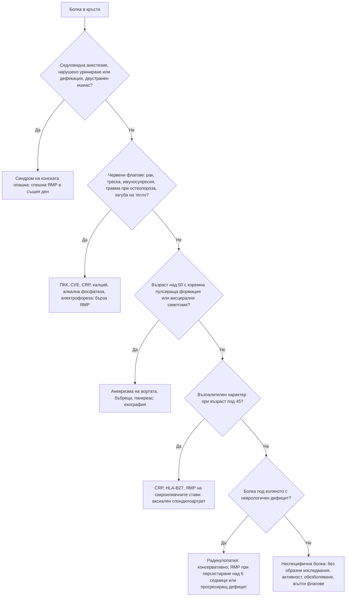

# Глава 49. Болка в гърба

> **Част X. Опорно-двигателен апарат**

## Цели на главата

- Да се класифицира болката в кръста като неспецифична, радикулерна или дължаща се на специфична сериозна патология.
- Да се прилагат червените флагове разумно, като се отчита, че поотделно те имат ниска предсказваща стойност.
- Да се разпознават синдромът на конската опашка, метастатичната компресия и спондилодисцитът като спешни състояния.
- Да се разпознава възпалителната болка в гърба и аксиалният спондилоартрит.
- Да се оценяват психосоциалните („жълтите“) флагове за хронифициране.
- Да се избягват ненужните образни изследвания.

---

## 1. Класификация

| Група | Дял | Същност |
|---|---|---|
| **Неспецифична (механична) болка в кръста** | ≈ 90% | Без установима специфична причина; обикновено се подобрява за 2–6 седмици |
| **Радикулерна болка (ишиас)** | ≈ 5–10% | Болка по хода на нервно коренче, обикновено поради дискова херния или стеноза |
| **Специфична сериозна патология** | ≈ 1–2% | Фрактура, злокачествено заболяване, инфекция, синдром на конската опашка, аксиален спондилоартрит, висцерална болка |

---

## 2. Етиологична класификация

| Група | Причини |
|---|---|
| **Механични** | Неспецифична болка (мускулно-лигаментарна, фасетни стави, дискогенна), дискова херния, спинална стеноза, спондилолистеза, остеопорозна компресионна фрактура, травма |
| **Възпалителни** | **Аксиален спондилоартрит** (анкилозиращ спондилит, болест на Бехтерев), псориатичен артрит, ентеропатичен спондилоартрит, реактивен артрит |
| **Инфекциозни** | **Спондилодисцит**, **епидурален абсцес** (интравенозна употреба на наркотици, диабет, имуносупресия, скорошна процедура на гръбначния стълб, бактериемия), **туберкулозен спондилит** (болест на Pott), **бруцелозен спондилит и сакроилеит** (особено важен в България) |
| **Злокачествени** | **Метастази** (гърда, простата, бял дроб, бъбрек, щитовидна жлеза), **мултиплен миелом**, лимфом, първични тумори |
| **Метаболитни** | **Остеопороза**, остеомалация, болест на Paget, хиперпаратиреоидизъм |
| **Отразена висцерална болка** | **Аневризма на коремната аорта**, дисекация на аортата, пиелонефрит, бъбречна колика, панкреатит, задна пептична язва, холецистит, тазови заболявания (ендометриоза, възпалителна болест на малкия таз), простатит, ретроперитонеални процеси (лимфом, саркоми), **херпес зостер** |
| **Други** | Фибромиалгия, психогенни фактори |

---

## 3. Безопасна диагностична стратегия

| Въпрос | Отговор |
|---|---|
| **Вероятна диагноза** | Неспецифична болка в кръста, дискова херния с радикулопатия, спинална стеноза (при възрастни хора), остеоартроза на фасетните стави |
| **Сериозни заболявания, които не бива да се пропускат** | **Синдром на конската опашка**; **метастатична компресия на гръбначния мозък**; **спондилодисцит и епидурален абсцес**; **миелом**; **фрактура**; **аневризма на коремната аорта** и дисекация на аортата; ретроперитонеални тумори |
| **Чести капани** | **Аксиален спондилоартрит** (средно забавяне на диагнозата с години); **бруцелоза**; остеопорозна фрактура при минимална травма; бъбречно заболяване; херпес зостер преди обрива; ендометриоза; периферна артериална болест („ишиас“ с липсващи пулсации — вж. глава 14) |
| **Маскиращи заболявания** | Депресия, гръбначна дисфункция, инфекция на пикочните пътища, злокачествени заболявания |
| **Психосоциални аспекти** | Страх от движение, катастрофизиране, депресия, неудовлетвореност от работата, спорове за обезщетения |

---

## 4. Червени флагове

Всеки червен флаг поотделно има **ниска положителна предсказваща стойност**. Много хора с неспецифична болка имат някой от тях. Значение имат **съчетанието** и **клиничният контекст**. Най-силният предиктор за злокачествено заболяване е **анамнезата за злокачествено заболяване**.

| Подозирано състояние | Червени флагове |
|---|---|
| **Синдром на конската опашка** | **Седловидна анестезия** (изтръпване в перинеума, седалищната и гениталната област); **нарушено уриниране** (задръжка, променено усещане, затруднено начало, инконтиненция); **фекална инконтиненция** или загуба на усещането при дефекация; **двустранен ишиас**; сексуална дисфункция; прогресираща слабост в краката |
| **Злокачествено заболяване** | **Анамнеза за рак**; необяснима загуба на тегло; възраст над 50 години; болка, която не се подобрява след 4–6 седмици; постоянна **нощна болка** или болка в покой; **гръдна** болка; болка, която се засилва в легнало положение |
| **Инфекция** | Треска, тръпки; **интравенозна употреба на наркотици**; имуносупресия (кортикостероиди, биологични средства, HIV); **диабет**; скорошна инфекция (урогенитална, кожна) или бактериемия; скорошна процедура на гръбначния стълб; **консумация на непастьоризирани млечни продукти и контакт с животни** (бруцелоза) |
| **Фрактура** | Значима травма; **лека травма при възрастни хора или при остеопороза**; **продължителна кортикостероидна терапия**; възраст над 70 години; внезапна силна болка |
| **Висцерална или съдова причина** | Възрастен мъж пушач (аневризма на аортата); пулсираща формация в корема; болка, която не се променя при движение; коремни, уринарни или гинекологични симптоми |
| **Общи** | Прогресиращ неврологичен дефицит; структурна деформация; общо неразположение |

### 4.1. „Жълти флагове“ (психосоциални предиктори на хронифициране)

- Убеждение, че болката е вредна и че движението я влошава.
- Поведение на избягване от страх, пасивност, очакване на пасивно лечение.
- Потиснато настроение, тревожност, социална изолация.
- Неудовлетвореност от работата, спорове за обезщетения, продължителен отпуск по болест.

Рискът от хронифициране в общата практика може да се оцени с въпросника **STarT Back**.

---

## 5. Анамнеза и физикален преглед

**Анамнеза:**

- начало (внезапно, след усилие, постепенно), продължителност;
- локализация, ирадиация (**под коляното** — радикулерна);
- **механичен или възпалителен характер** (вж. т. 6);
- неврологични и **тазови симптоми**;
- общи симптоми;
- анамнеза за злокачествено заболяване, остеопороза, кортикостероиди, имуносупресия;
- психосоциален контекст.

**Физикален преглед:**

- оглед (стойка, деформация), палпация и перкусия (локална болезненост на прешлените — фрактура, инфекция, тумор);
- обем на движение;
- **тест с изправен крак (Lasègue)** и кръстосан тест;
- **неврологичен преглед:** сила (дорзална флексия на палеца — L5, ходене на пръсти — S1, ходене на пети — L5), рефлекси (коленен — L4, ахилесов — S1), сетивност по дерматоми;
- **при подозрение за синдром на конската опашка:** **сетивност в перинеума** и **ректално туше** (тонус на сфинктера), измерване на **остатъчната урина**;
- корем (аневризма, формации), пулсации на краката (съдова клаудикация), сакроилиачните стави, кожата (херпес зостер, псориазис).

---

## 6. Механична или възпалителна болка в гърба

| Белег | Механична | **Възпалителна** (аксиален спондилоартрит) |
|---|---|---|
| Възраст при началото | Всяка | **Под 40–45 години** |
| Начало | Често остро, след натоварване | **Постепенно** |
| Продължителност | Често кратка | **Над 3 месеца** |
| Сутрешна скованост | Кратка (под 30 минути) | **Продължителна (над 30–60 минути)** |
| Физическа активност | Влошава | **Подобрява** |
| Почивка | Облекчава | **Не облекчава** или влошава |
| Нощна болка | Рядко | **Събужда пациента през втората половина на нощта** |
| Болка в седалището | Рядко | **Редуваща се** лява и дясна |
| Отговор на НСПВС | Умерен | **Изразен** (за 24–48 часа) |

**Други белези на спондилоартрит:**

- **преден увеит** (остро болезнено червено око);
- **псориазис**;
- **възпалителни болести на червата**;
- **ентезит** (ахилесово сухожилие, плантарна фасция);
- **дактилит** („наденицовидни“ пръсти);
- периферен артрит;
- **фамилна анамнеза**;
- **HLA-B27**;
- повишен CRP (не при всички).

**Критерии на ASAS за аксиален спондилоартрит** (болка в гърба ≥ 3 месеца, начало преди 45 години):

- **сакроилеит при образно изследване** (ЯМР или рентгенография) + ≥ 1 белег на спондилоартрит, **или**
- **HLA-B27** + ≥ 2 други белега на спондилоартрит.

**Рентгенографията често е нормална в ранния стадий.** Изследване на избор е **ЯМР на сакроилиачните стави**. Забавянето на диагнозата средно е с години.

---

## 7. Специфични състояния

| Заболяване | Ключови белези | Изследване |
|---|---|---|
| **Дискова херния с радикулопатия** | Болка под коляното, по-силна от тази в кръста; положителен тест с изправен крак; дефицит в съответното коренче (L5, S1) | ЯМР при персистиране над 6 седмици, тежък или прогресиращ дефицит или при планиране на операция |
| **Синдром на конската опашка** | Вж. червените флагове | **Спешна ЯМР в същия ден** |
| **Спинална стеноза** | Възрастни хора, неврогенна клаудикация, облекчаване при флексия (вж. глава 14) | ЯМР при планиране на лечение |
| **Остеопорозна компресионна фрактура** | Възрастни жени, кортикостероиди; внезапна болка след минимална травма (кашлица, повдигане); загуба на ръст, кифоза | Рентгенография; при нетипична локализация (над Th7), млада възраст или литични лезии — изключване на миелом и метастази |
| **Метастази, миелом** | Анамнеза за рак, нощна болка, загуба на тегло, възраст над 50 години | ПКК, СУЕ, CRP, калций, алкална фосфатаза, електрофореза и свободни леки вериги, ПСА; **ЯМР** |
| **Спондилодисцит, епидурален абсцес** | Персистираща болка, болезненост при перкусия, треска (често липсва), рискови фактори; повишени CRP и СУЕ | **ЯМР**, хемокултури, биопсия; серология за бруцелоза; изследвания за туберкулоза |
| **Аксиален спондилоартрит** | Възпалителна болка, млади хора | CRP, HLA-B27, **ЯМР на сакроилиачните стави** |
| **Аневризма на коремната аорта** | Възрастен мъж пушач, пулсираща формация, внезапна силна болка с хипотония при руптура | **Ехография**, КТ |
| **Пиелонефрит** | Треска, болезненост в костовертебралния ъгъл, уринарни симптоми | Урина, урокултура |

### 7.1. Болка в гръдния отдел

Болката в гръдния отдел по-често има сериозна причина, отколкото болката в кръста. Трябва да се мисли за:

- метастази, миелом, остеопорозна фрактура;
- **дисекация на аортата**, **миокарден инфаркт**, белодробна тромбемболия, пневмония;
- пептична язва, панкреатит, холецистит;
- **херпес зостер**;
- дискова херния в гръдния отдел;
- болест на Scheuermann при юноши.

---

## 8. Изследвания

- **При неспецифична болка в кръста с давност под 6 седмици без червени флагове образни изследвания не са показани.** Те не подобряват резултата и водят до свръхдиагностика. Дисковите протрузии и дегенеративните промени са много чести и при хора без болка.
- **При червени флагове:**
  - ПКК, СУЕ, CRP, калций, алкална фосфатаза;
  - електрофореза и свободни леки вериги (при възраст над 50 години);
  - ПСА (при мъже, след информиране);
  - изследване на урината;
  - **ЯМР** — спешно при синдром на конската опашка, компресия на гръбначния мозък, инфекция, злокачествено заболяване;
  - рентгенография или КТ при подозрение за фрактура.
- **При възпалителна болка:** CRP, HLA-B27, ЯМР на сакроилиачните стави.

---

## 9. Диагностичен алгоритъм

---

## 10. Особености в общата практика

- Обяснете на пациента, че неспецифичната болка в кръста е честа, обикновено не е опасна и се подобрява. Препоръчайте физическа активност вместо легло.
- Дайте на всеки пациент с ишиас **писмени указания** за симптомите на синдрома на конската опашка и какво да прави, ако се появят.
- Не назначавайте рентгенография „за успокоение“. Находките, като дегенеративни промени и протрузии, могат да увеличат тревожността и да хронифицират болката.
- Преоценете пациента, ако няма подобрение за 4–6 седмици.

---

## 11. Клинични перли

- Синдромът на конската опашка започва незабележимо: с променено усещане при уриниране и слабо изтръпване. Задръжката на урина е късен белег.
- Анамнезата за злокачествено заболяване е най-силният червен флаг за метастази. Новата болка в гърба при пациент с карцином на гърдата или простатата изисква ЯМР.
- Болка в гърба при интравенозен употребител на наркотици, диабетик или пациент на хемодиализа: мислете за спондилодисцит и епидурален абсцес, дори без треска.
- Млад човек с болка в гърба, която се подобрява при движение и събужда сутрин: аксиален спондилоартрит. Попитайте за увеит, псориазис и възпалителни болести на червата.
- В България спондилитът и сакроилеитът при бруцелоза не са рядкост. Питайте за контакт с животни и за непастьоризирани млечни продукти.
- Внезапна болка в гърба при възрастна жена след кашляне: остеопорозна фрактура. При нетипична находка мислете за миелом.
- Възрастен мъж пушач с болка в гърба: изключете аневризма на коремната аорта.

---

## 12. Клиничен случай

**Случай.** Мъж на 32 години от година и половина има болки в кръста и седалището, които сменят страната си. Сутрин е „скован като дърво“ около час. Болките се подобряват след раздвижване и душ и се влошават при продължително седене. Събужда се от болка около 4 ч. сутринта. Преди година е лекуван за „конюнктивит“ на дясното око с болка и фотофобия. Болката в гърба се подобрява значително при прием на ибупрофен. Лумбалната рентгенография е без отклонения. CRP е 18 mg/l.

**Въпроси.** 1) Какъв е характерът на болката? 2) Кои изследвания ще потвърдят диагнозата?

**Обсъждане.** Началото в млада възраст, продължителността над 3 месеца, продължителната сутрешна скованост, подобрението при движение, нощната болка през втората половина на нощта, редуващата се болка в седалището, добрият отговор на НСПВС и епизодът на **преден увеит** (а не конюнктивит) образуват картина на **аксиален спондилоартрит**. Нормалната рентгенография не изключва диагнозата. Изследват се **HLA-B27** (положителен) и **ЯМР на сакроилиачните стави**, която показва активен двустранен сакроилеит (оток на костния мозък). Пациентът е насочен към ревматолог. При недостатъчен ефект от НСПВС са показани биологични средства.

**Поука.** Възпалителната болка в гърба има ясни клинични белези. Питайте за сутрешната скованост, ефекта от движението и за извънставните прояви.
