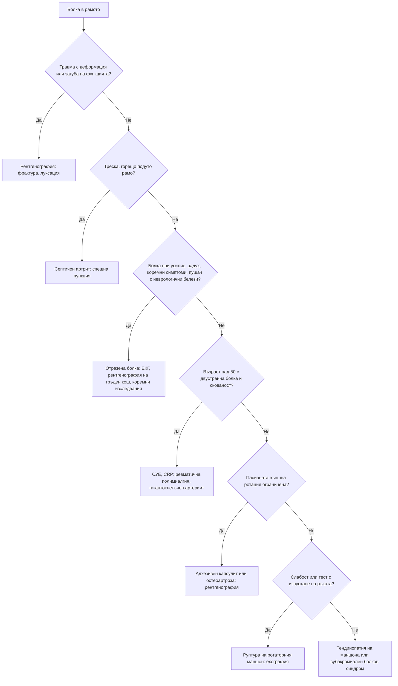

# Глава 50. Болка във врата и рамото

> **Част X. Опорно-двигателен апарат**

## Цели на главата

- Да се разграничават механичната болка във врата, шийната радикулопатия и шийната миелопатия.
- Да се разпознават сериозните причини за болка във врата: дисекация, менингит, инфекции, тумори.
- Да се разграничават вътрешните причини за болка в рамото от отразената болка.
- Да се разпознават тендинопатията на ротаторния маншон, „замръзналото рамо“ и остеоартрозата на раменната става чрез клиничния преглед.
- Да се разпознават извънставните причини за болка в рамото: тумор на Pancoast, миокардна исхемия, дразнене на диафрагмата, ревматична полимиалгия.

## Ключови моменти

- Правилото на Canadian C-spine определя кога след травма е нужно образно изследване на шийния отдел *(SORT B [1])*.
- Болка във врата с главоболие и синдром на Horner е дисекация на шийна артерия до доказване на противното.
- Ограниченото пасивно движение (особено външната ротация) насочва към адхезивен капсулит или остеоартроза. Ограниченото активно при запазено пасивно движение насочва към ротаторния маншон.
- Болезнената дъга е най-полезният тест за заболяване на ротаторния маншон, а тестовете за изоставане — за пълна руптура *(SORT B [2])*.
- Болка в рамото без находка при прегледа на рамото налага търсене на отразена причина: миокардна исхемия, тумор на Pancoast, дразнене на диафрагмата.
- Двустранна болка и скованост в раменете след 50 години с висока СУЕ и CRP насочва към ревматична полимиалгия. Винаги се търсят симптоми на гигантоклетъчен артериит *(SORT B [3, 4])*.

---

## А. Болка във врата

### 1. Причини

*Таблица 50.1. Болка във врата: причини.*

| Група | Причини |
|---|---|
| **Механични** | Неспецифична болка във врата (най-честата), спондилоза, травма тип „камшичен удар“, остър тортиколис |
| **Неврологични** | **Шийна радикулопатия** (болка в ръката по дерматом; тест на Spurling); **шийна миелопатия** (тромавост на ръцете, нарушена походка, хиперрефлексия — вж. глава 47) |
| **Съдови** | **Дисекация на каротидна или вертебрална артерия** (болка във врата и главоболие, синдром на Horner, исхемични симптоми) |
| **Инфекциозни** | Менингит (вратна ригидност), **ретрофарингеален абсцес** (особено при деца), спондилодисцит, епидурален абсцес, шиен лимфаденит |
| **Възпалителни** | **Ревматоиден артрит** (атлантоаксиална сублуксация), аксиален спондилоартрит, **ревматична полимиалгия**, дифузна идиопатична скелетна хиперостоза |
| **Злокачествени** | Метастази, миелом, тумори на шията |
| **Отразена болка** | **Миокардна исхемия**, **тумор на Pancoast**, хранопровод |
| **Други** | **Подостър тиреоидит** (болка в предната част на шията с ирадиация към ушите и челюстта), **субарахноидален кръвоизлив**, дистония (спастичен тортиколис), лекарствена дистонична реакция, синдром на Eagle (удължен стилоиден израстък) |

### 2. Червени флагове при болка във врата

- **Травма** — правило на Canadian C-spine (вж. по-долу).
- **Неврологичен дефицит** или **белези на миелопатия**.
- Треска, общо неразположение, загуба на тегло, анамнеза за злокачествено заболяване.
- **Силна, непрекъсната болка**, нощна болка.
- **Ревматоиден артрит** или синдром на Down (нестабилност на атлантоаксиалната става).
- **Синдром на Horner** или **главоболие** заедно с болката във врата (дисекация).
- **Менингизъм**.
- Болка в предната част на шията с треска (тиреоидит, абсцес, епиглотит).

**Правило на Canadian C-spine** (за пациенти в съзнание след травма) [1]. **Образно изследване е необходимо** при поне един високорисков фактор:

- възраст ≥ 65 години;
- опасен механизъм (падане от височина ≥ 1 m или от 5 стъпала, аксиално натоварване, високоскоростна катастрофа, претъркаляне, катастрофа с мотоциклет или велосипед);
- парестезии в крайниците.

При липса на високорискови фактори и наличие на нискорискови фактори, които позволяват оценка на движението, **без** образно изследване може да се мине, ако пациентът може активно да завърти главата на 45° наляво и надясно.

---

## Б. Болка в рамото

### 3. Причини

*Таблица 50.2. Болка в рамото: причини.*

| Група | Причини |
|---|---|
| **Ротаторен маншон и субакромиално пространство** | **Тендинопатия** на ротаторния маншон и субакромиален болков синдром (най-честата причина); **руптура** на ротаторния маншон (травматична при млади хора, дегенеративна при възрастни); **калцифициращ тендинит** (остра силна болка); субакромиален бурсит |
| **Глено-хумерална става** | **Адхезивен капсулит („замръзнало рамо“)**; **остеоартроза**; септичен артрит; кристални артропатии (включително „милуокско рамо“ при възрастни жени); **нестабилност и луксация** |
| **Акромиоклавикуларна става** | Остеоартроза, травматично разместване |
| **Сухожилие на бицепса** | Тендинопатия, **руптура** (белег на „Попай“; **флуорохинолони** повишават риска от тендинопатия и руптура) |
| **Костни** | **Фрактура на проксималния хумерус** (възрастни хора след падане), метастази |
| **Отразена болка** | **Шийна радикулопатия (C5)**; **миокардна исхемия** (особено вляво); **дразнене на диафрагмата** (белег на Kehr — руптура на слезката, поддиафрагмален абсцес, извънматочна бременност, перфорация, холецистит вдясно); **тумор на Pancoast**; чернодробни и жлъчни заболявания (вдясно) |
| **Системни и неврологични** | **Ревматична полимиалгия** (двустранно); **неврит на брахиалния плексус** (силна болка, последвана от слабост и атрофия); полимиозит |

## 4. Безопасна диагностична стратегия

*Таблица 50.3. Безопасна диагностична стратегия.*

| Въпрос | Отговор |
|---|---|
| **Вероятна диагноза** | Тендинопатия на ротаторния маншон, адхезивен капсулит, механична болка във врата, шийна радикулопатия |
| **Сериозни заболявания, които не бива да се пропускат** | **Миокарден инфаркт**; **тумор на Pancoast**; **дразнене на диафрагмата** от вътрекоремна патология; **септичен артрит**; **дисекация на шийна артерия**; фрактура и луксация; метастази; **гигантоклетъчен артериит и ревматична полимиалгия**; шийна миелопатия |
| **Чести капани** | **Задна луксация** на рамото след епилептичен пристъп или електрически удар (лесно се пропуска); адхезивен капсулит при диабет и заболявания на щитовидната жлеза; калцифициращ тендинит, приет за септичен артрит; болка в рамото, отразена от шията; руптура на сухожилие при флуорохинолони |
| **Маскиращи заболявания** | Захарен диабет, заболявания на щитовидната жлеза, гръбначна дисфункция, депресия |
| **Психосоциални аспекти** | Професионално претоварване, неудовлетвореност от работата |

## 5. Физикален преглед на рамото

1. **Оглед:** асиметрия, атрофия на *m. supraspinatus* и *m. infraspinatus* (руптура на маншона, невропатия на *n. suprascapularis*), деформация (луксация, акромиоклавикуларна става).
2. **Палпация:** акромиоклавикуларна става, сухожилието на бицепса, голямата туберкула.
3. **Активен и пасивен обем на движение:**
   - **ограничено активно, но запазено пасивно движение** — проблем с ротаторния маншон (болка или руптура);
   - **ограничено активно и пасивно движение, особено външната ротация** — **адхезивен капсулит** или **остеоартроза**.
4. **Болезнена дъга** между 60° и 120° абдукция — субакромиален болков синдром. Това е най-информативният тест за провокация на болка при заболяване на ротаторния маншон (LR+ около 3,7) [2].
5. **Специални тестове:**
   - тестове на Hawkins-Kennedy и Neer — субакромиален болков синдром;
   - тест на Jobe (с „празна кутия“) — *m. supraspinatus*;
   - съпротива при външна ротация — *m. infraspinatus*;
   - тест с отделяне от гърба — *m. subscapularis*;
   - **тест с изпускане на ръката** — голяма руптура; за пълна руптура най-точни са тестовете за изоставане при външна и вътрешна ротация [2];
   - тест с кръстосана аддукция — акромиоклавикуларна става.
6. **Преглед на шията** и **неврологичен преглед**.

## 6. Диференциално-диагностична таблица

*Таблица 50.4. Диференциално-диагностична таблица.*

| Заболяване | Типичен пациент | Ключови белези | Изследване |
|---|---|---|---|
| **Тендинопатия на ротаторния маншон** | 35–60 години, работа над главата | Болезнена дъга, болка нощем при лягане върху рамото, запазен пасивен обем | Клинична диагноза; ехография |
| **Руптура на ротаторния маншон** | Над 60 години или след травма | **Слабост**, тест с изпускане на ръката, атрофия | Ехография, ЯМР |
| **Калцифициращ тендинит** | 30–50 години | **Остра, много силна болка**, ограничено движение | Рентгенография (калцификат) |
| **Адхезивен капсулит** | 40–60 години, **диабет**, заболявания на щитовидната жлеза, след имобилизация | Прогресираща болка, после **глобално ограничение**, особено на **пасивната външна ротация**; фази на „замръзване“, „замръзнало рамо“ и „размразяване“ за 1–3 години | Клинична диагноза; рентгенографията е нормална |
| **Остеоартроза на раменната става** | Възрастни хора | Крепитации, ограничено активно и пасивно движение | Рентгенография |
| **Патология на акромиоклавикуларната става** | Физически работещи, спортисти | Локална болка, болка при кръстосана аддукция | Рентгенография |
| **Луксация** | Млади хора, травма; **задна луксация — след пристъп или токов удар** | Деформация, ръката е фиксирана във вътрешна ротация (при задна луксация) | Рентгенография в две проекции |
| **Ревматична полимиалгия** | **Над 50 години** | **Двустранна** болка и скованост на раменния и тазовия пояс, сутрешна скованост > 45 минути, **висока СУЕ и CRP** | СУЕ, CRP; изключване на гигантоклетъчен артериит [3] |
| **Тумор на Pancoast** | Пушач | Болка в рамото и медиалната страна на ръката, **атрофия на малките мускули на дланта**, **синдром на Horner** | **Рентгенография на гръден кош** (върхът на белия дроб), КТ |
| **Шийна радикулопатия (C5–C6)** | Средна възраст | Болка от шията към рамото и ръката, парестезии, положителен тест на Spurling | ЯМР при дефицит |
| **Миокардна исхемия** | Рискови фактори | Болка при усилие, изпотяване, задух | ЕКГ, тропонин |
| **Дразнене на диафрагмата** | — | Болка във върха на рамото с коремни симптоми | Според подозрението (ехография, КТ, тест за бременност) |

---

## 7. Диагностичен алгоритъм при болка в рамото

*Фигура 50.1. Диагностичен алгоритъм при болка в рамото. Схема на авторите въз основа на източниците, цитирани в главата.*

Текстово описание на фигура 50.1

1. Болка в рамото. Следва: към т. 2.
2. **Въпрос:** Травма с деформация или загуба на функцията? Да — към т. 3; Не — към т. 4.
3. Рентгенография: фрактура, луксация.
4. **Въпрос:** Треска, горещо подуто рамо? Да — към т. 5; Не — към т. 6.
5. Септичен артрит: спешна пункция.
6. **Въпрос:** Болка при усилие, задух, коремни симптоми, пушач с неврологични белези? Да — към т. 7; Не — към т. 8.
7. Отразена болка: ЕКГ, рентгенография на гръден кош, коремни изследвания.
8. **Въпрос:** Възраст над 50 с двустранна болка и скованост? Да — към т. 9; Не — към т. 10.
9. СУЕ, CRP: ревматична полимиалгия, гигантоклетъчен артериит.
10. **Въпрос:** Пасивната външна ротация ограничена? Да — към т. 11; Не — към т. 12.
11. Адхезивен капсулит или остеоартроза: рентгенография.
12. **Въпрос:** Слабост или тест с изпускане на ръката? Да — към т. 13; Не — към т. 14.
13. Руптура на ротаторния маншон: ехография.
14. Тендинопатия на маншона или субакромиален болков синдром.

---

## 8. Кога и колко спешно да насочим

*Таблица 50.5. Кога и колко спешно да насочим.*

| Спешност | Клинична ситуация |
|---|---|
| **Незабавно (112 или спешно отделение)** | Болка в рамото или шията с белези на миокардна исхемия; травма на шийния отдел с високорисков фактор [1]; менингизъм; болка в рамото с коремни симптоми и хипотония; горещо, подуто рамо с треска (септичен артрит — спешна пункция) |
| **В същия ден** | Болка във врата с главоболие и синдром на Horner (дисекация); луксация или фрактура; ревматична полимиалгия със симптоми на гигантоклетъчен артериит [4] |
| **Бързо (до 2 седмици)** | Подозрение за тумор на Pancoast — рентгенография на гръдния кош и бързо насочване [5]; прогресиращ неврологичен дефицит или шийна миелопатия; остра травматична руптура на ротаторния маншон при млад човек |
| **Планово** | Болка в рамото, която персистира над 6–12 седмици въпреки лечението; дегенеративна руптура със слабост; адхезивен капсулит без подобрение |
| **Проследяване в общата практика** | Неспецифична болка във врата; тендинопатия на ротаторния маншон — упражнения и обезболяване; неусложнена ревматична полимиалгия — кортикостероид и проследяване [3] |

---

## 9. Клинични перли

- Ограничената пасивна външна ротация на рамото е ключът към диагнозата адхезивен капсулит (и остеоартроза).
- При пациент с диабет „замръзналото рамо“ е често и може да бъде двустранно.
- Рамото, което не може да се завърти навън след епилептичен пристъп, е задна луксация, докато не се докаже противното. На стандартната фасова рентгенография тя лесно се пропуска.
- Болка в рамото и в медиалната страна на ръката при пушач с атрофия на малките мускули на дланта и синдром на Horner: тумор на Pancoast. Погледнете внимателно върха на белия дроб на рентгенографията.
- Болка във върха на лявото рамо при коремна болка: руптура на слезката, извънматочна бременност или перфорация.
- Двустранна болка в раменете и сутрешна скованост при човек над 50 години: ревматична полимиалгия. Попитайте за главоболие и зрителни симптоми.
- Болка във врата с главоболие и синдром на Horner: дисекация на каротидната артерия.
- Тромави ръце и несигурна походка при „шийна спондилоза“: шийна миелопатия. Проверете рефлексите.

---

## 10. Клиничен случай

**Етап 1 — представяне.** Мъж на 62 години, пушач с 50 пакетогодини, от 4 месеца има болка в дясното рамо, която се разпространява по медиалната страна на ръката до малкия пръст. Болката го буди нощем. Лекуван е за „тендинит“ и „шийна дископатия“ без ефект. Отслабнал е с 5 kg.

> **Въпрос 1.** Кои белези не пасват на тендинит или дископатия?

**Етап 2 — преглед.** Движенията в рамото са пълни, но болезнени. Има атрофия на първия междукостен мускул и на хипотенара вдясно. Дясната зеница е по-малка, а клепачът е леко увиснал.

> **Въпрос 2.** Кой синдром е налице?

> **Въпрос 3.** Кое изследване е показано първо и колко спешно е насочването?

Обсъждане и отговори

**Отговор 1.** Нощната болка, загубата на тегло, липсата на ефект от лечението, тежкото тютюнопушене и болката по хода на коренчетата C8–Th1 не пасват на обикновен тендинит или дископатия.

**Отговор 2.** Болката по хода на C8–Th1, атрофията на малките мускули на дланта и **синдромът на Horner** (миоза, птоза) при тежък пушач със загуба на тегло са класическа картина на **тумор на Pancoast**. Това е карцином на върха на белия дроб, който инфилтрира долния брахиален плексус и симпатиковата верига.

**Отговор 3.** Първото изследване е **рентгенография на гръдния кош** с внимание към върха на белия дроб. Пациентът се насочва бързо към пулмоонкологичен екип [5]. Следват КТ с контраст, ЯМР на брахиалния плексус и биопсия.

**Поука.** Болката в рамото без находка при прегледа на рамото изисква търсене на отразена причина. Синдромът на Horner е ключов белег.

---

## Обобщение

- Болката във врата най-често е механична. Радикулопатията, миелопатията, дисекацията, инфекциите и туморите се разпознават по червените флагове.
- Болката в рамото най-често се дължи на ротаторния маншон. Адхезивният капсулит и остеоартрозата ограничават пасивното движение, особено външната ротация.
- Отразената болка в рамото — от сърцето, върха на белия дроб, диафрагмата и шията — се търси, когато прегледът на рамото е нормален.
- Ревматичната полимиалгия и гигантоклетъчният артериит се подозират при двустранна скованост на раменете след 50 години с високи възпалителни показатели.

## Самопроверка

### Въпроси с един верен отговор

**1.** *(основно ниво)* Жена на 55 години с диабет от 3 месеца има нарастваща болка в дясното рамо. Пасивната външна ротация е силно ограничена, а рентгенографията е нормална. Коя е най-вероятната диагноза?

- **А.** Тендинопатия на ротаторния маншон
- **Б.** Адхезивен капсулит
- **В.** Руптура на ротаторния маншон
- **Г.** Калцифициращ тендинит
- **Д.** Шийна радикулопатия

Отговор и обосновка

**Верен отговор: Б.** Глобалното ограничение на движението, особено на пасивната външна ротация, при нормална рентгенография е типично за адхезивен капсулит. Той е по-чест при диабет.

**2.** *(основно ниво)* Мъж на 45 години, бояджия, има болка в рамото нощем при лягане върху него. Има болезнена дъга между 70° и 110° абдукция, а пасивният обем е пълен. Коя е най-вероятната диагноза?

- **А.** Адхезивен капсулит
- **Б.** Тендинопатия на ротаторния маншон
- **В.** Остеоартроза на раменната става
- **Г.** Тумор на Pancoast
- **Д.** Септичен артрит

Отговор и обосновка

**Верен отговор: Б.** Болезнената дъга при запазен пасивен обем и работа над главата насочва към тендинопатия на ротаторния маншон и субакромиален болков синдром [2].

**3.** *(основно ниво)* Мъж на 30 години след генерализиран тонично-клоничен пристъп има силна болка в лявото рамо. Ръката е във вътрешна ротация и не може да се завърти навън. Кое е правилното поведение?

- **А.** НСПВС и контрол след седмица
- **Б.** Рентгенография в две проекции, включително аксиларна или „Y“ проекция
- **В.** Ехография на ротаторния маншон
- **Г.** ЯМР на шийния отдел
- **Д.** Физиотерапия

Отговор и обосновка

**Верен отговор: Б.** Задната луксация на рамото след пристъп лесно се пропуска на фасовата рентгенография. Нужни са допълнителни проекции.

**4.** *(напреднало ниво)* Жена на 68 години от 3 седмици има двустранна болка и скованост в раменете и бедрата, особено сутрин за около час и половина. СУЕ е 60 mm/h. От седмица има и ново главоболие в слепоочията. Кое е правилното поведение?

- **А.** НСПВС и контрол след месец
- **Б.** Спешна оценка за гигантоклетъчен артериит и кортикостероид веднага
- **В.** Само нискодозов преднизолон за ревматична полимиалгия
- **Г.** Рентгенография на раменете
- **Д.** Ехография на раменете и контрол

Отговор и обосновка

**Верен отговор: Б.** Клиничната картина е на ревматична полимиалгия [3]. Новото главоболие обаче налага спешна оценка за гигантоклетъчен артериит и лечение с по-висока доза кортикостероид [4].

**5.** *(напреднало ниво)* Мъж на 40 години с остра коремна болка след падане с велосипед се оплаква и от болка във върха на лявото рамо. Пулсът е 118/min, а АН е 95/60 mmHg. Какво означава болката в рамото?

- **А.** Контузия на рамото
- **Б.** Дразнене на диафрагмата от кръв при руптура на слезката
- **В.** Шийна радикулопатия
- **Г.** Миокардна исхемия
- **Д.** Тендинит

Отговор и обосновка

**Верен отговор: Б.** Болката във върха на лявото рамо при коремна травма и хипотония (белег на Kehr) насочва към кръв под диафрагмата при руптура на слезката. Пациентът се насочва незабавно.

### Задача

Жена на 45 години идва 6 часа след удар отзад в колата ѝ при ниска скорост на светофар. Болката във врата е започнала 2 часа след удара. Ходи самостоятелно, няма болезненост по средната линия на шийните прешлени и може да завърти главата на 45° наляво и надясно. Няма изтръпване. Нужна ли е рентгенография?

Решение

Не. Според правилото на Canadian C-spine пациентката няма високорискови фактори: възрастта е под 65 години, механизмът не е опасен и няма парестезии. Има нискорискови фактори — прост удар отзад, самостоятелно ходене, късно начало на болката и липса на болезненост по средната линия. Може активно да завърти главата на 45° в двете посоки. Образно изследване не е нужно [1]. Дават се указания за обезболяване, активност и признаци за връщане: изтръпване, слабост, силна болка.

### OSCE станция: Преглед на рамото

**Време:** 8 минути. **Ниво:** основно (студенти, специализанти).

**Задача за кандидата.** Мъж на 52 години има болка в дясното рамо от 2 месеца. Прегледайте рамото и предложете диагноза.

**Информация за симулирания пациент (за изпитващия).** Активната абдукция е болезнена между 60° и 120°, а пасивният обем е пълен. Тестът на Jobe е болезнен, но силата е запазена. Тестовете за изоставане са отрицателни.

*Таблица 50.6. OSCE станция: Преглед на рамото — рубрика за оценяване.*

| Критерий | Точки |
|---|---|
| Оглежда за асиметрия, атрофия и деформация | 1 |
| Палпира акромиоклавикуларната става, сухожилието на бицепса и голямата туберкула | 1 |
| Сравнява активния и пасивния обем на движение, включително външната ротация | 2 |
| Търси болезнена дъга | 1 |
| Изследва ротаторния маншон: Jobe, съпротива при външна ротация, тест с отделяне от гърба, тестове за изоставане | 2 |
| Преглежда шията и прави неврологичен скрининг | 1 |
| Обобщава находката като вероятна тендинопатия на маншона и предлага план | 2 |
| **Общо** | **10** |

**Праг за успешно представяне:** 7 от 10 точки, включително сравнението на активния и пасивния обем.

## Литература

1. Stiell IG, Wells GA, Vandemheen KL, Clement CM, Lesiuk H, De Maio VJ, et al. The Canadian C-spine rule for radiography in alert and stable trauma patients. JAMA. 2001;286(15):1841-8. doi:10.1001/jama.286.15.1841. PMID: 11597285.
2. Hermans J, Luime JJ, Meuffels DE, Reijman M, Simel DL, Bierma-Zeinstra SM. Does this patient with shoulder pain have rotator cuff disease?: The Rational Clinical Examination systematic review. JAMA. 2013;310(8):837-47. doi:10.1001/jama.2013.276187. PMID: 23982370.
3. Dasgupta B, Cimmino MA, Maradit-Kremers H, Schmidt WA, Schirmer M, Salvarani C, et al. 2012 provisional classification criteria for polymyalgia rheumatica: a European League Against Rheumatism/American College of Rheumatology collaborative initiative. Ann Rheum Dis. 2012;71(4):484-92. doi:10.1136/annrheumdis-2011-200329. PMID: 22388996.
4. Mackie SL, Dejaco C, Appenzeller S, Camellino D, Duftner C, Gonzalez-Chiappe S, et al. British Society for Rheumatology guideline on diagnosis and treatment of giant cell arteritis. Rheumatology (Oxford). 2020;59(3):e1-e23. doi:10.1093/rheumatology/kez672. PMID: 31970405.
5. National Institute for Health and Care Excellence. Suspected cancer: recognition and referral (NICE guideline NG12). London: NICE; 2015 [актуализирано 2026]. Достъпно на: https://www.nice.org.uk/guidance/ng12

*Последна проверка на съдържанието: септември 2026 г. Следващ планиран преглед: септември 2027 г. (вж. „Политика за актуализация“ в README).*

<!-- навигация -->

---

[← Глава 49. Болка в гърба](49-bolka-v-garba.md) · [Съдържание](../README.md) · [Глава 51. Остър моноартрит →](51-monoartrit.md)
