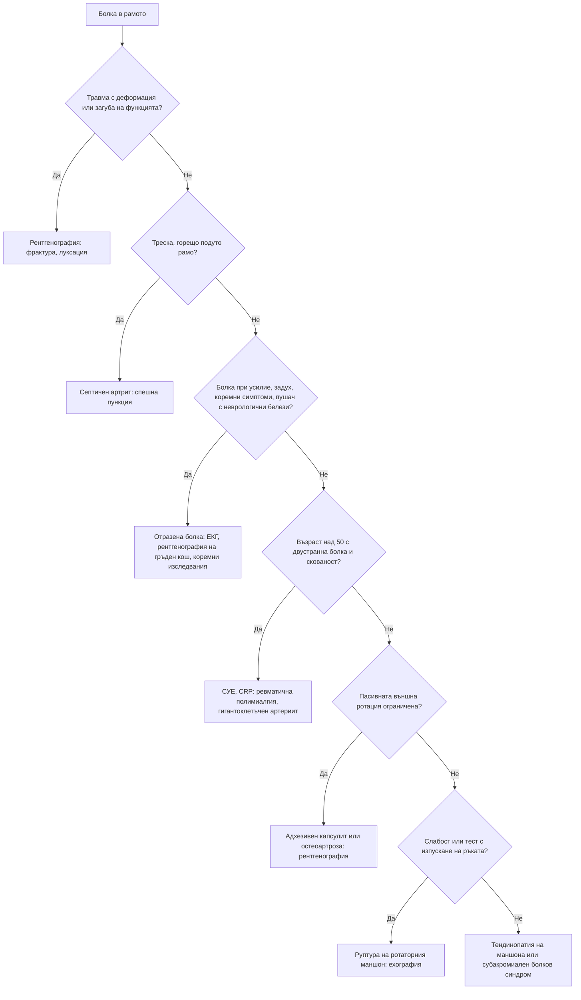

# Глава 50. Болка във врата и рамото

> **Част X. Опорно-двигателен апарат**

## Цели на главата

- Да се разграничават механичната болка във врата, шийната радикулопатия и шийната миелопатия.
- Да се разпознават сериозните причини за болка във врата: дисекация, менингит, инфекции, тумори.
- Да се разграничават вътрешните причини за болка в рамото от отразената болка.
- Да се разпознават тендинопатията на ротаторния маншон, „замръзналото рамо“ и остеоартрозата на раменната става чрез клиничния преглед.
- Да се мисли за тумор на Pancoast, миокардна исхемия, дразнене на диафрагмата и ревматична полимиалгия.

---

## А. БОЛКА ВЪВ ВРАТА

## 1. Причини

| Група | Причини |
|---|---|
| **Механични** | Неспецифична болка във врата (най-честата), спондилоза, травма тип „камшичен удар“, остър тортиколис |
| **Неврологични** | **Шийна радикулопатия** (болка в ръката по дерматом; тест на Spurling); **шийна миелопатия** (тромавост на ръцете, нарушена походка, хиперрефлексия — вж. глава 47) |
| **Съдови** | **Дисекация на каротидна или вертебрална артерия** (болка във врата и главоболие, синдром на Horner, исхемични симптоми) |
| **Инфекциозни** | Менингит (вратна ригидност), **ретрофарингеален абсцес** (особено при деца), спондилодисцит, епидурален абсцес, шиен лимфаденит |
| **Възпалителни** | **Ревматоиден артрит** (атлантоаксиална сублуксация), аксиален спондилоартрит, **ревматична полимиалгия**, дифузна идиопатична скелетна хиперостоза |
| **Злокачествени** | Метастази, миелом, тумори на шията |
| **Отразена болка** | **Миокардна исхемия**, **тумор на Pancoast**, хранопровод |
| **Други** | **Подостър тиреоидит** (болка в предната част на шията с ирадиация към ушите и челюстта), **субарахноидален кръвоизлив**, дистония (спастичен тортиколис), лекарствена дистонична реакция, синдром на Eagle (удължен стилоиден израстък) |

## 2. Червени флагове при болка във врата

- **Травма** — правило на Canadian C-spine (вж. по-долу).
- **Неврологичен дефицит** или **белези на миелопатия**.
- Треска, общо неразположение, загуба на тегло, анамнеза за злокачествено заболяване.
- **Силна, непрекъсната болка**, нощна болка.
- **Ревматоиден артрит** или синдром на Down (нестабилност на атлантоаксиалната става).
- **Синдром на Horner** или **главоболие** заедно с болката във врата (дисекация).
- **Менингизъм**.
- Болка в предната част на шията с треска (тиреоидит, абсцес, епиглотит).

**Правило на Canadian C-spine** (за пациенти в съзнание след травма). **Образно изследване е необходимо** при поне един високорисков фактор:

- възраст ≥ 65 години;
- опасен механизъм (падане от височина ≥ 1 m или от 5 стъпала, аксиално натоварване, високоскоростна катастрофа, претъркаляне, катастрофа с мотоциклет или велосипед);
- парестезии в крайниците.

При липса на високорискови фактори и наличие на нискорискови фактори, които позволяват оценка на движението, **без** образно изследване може да се мине, ако пациентът може активно да завърти главата на 45° наляво и надясно.

---

## Б. БОЛКА В РАМОТО

## 3. Причини

| Група | Причини |
|---|---|
| **Ротаторен маншон и субакромиално пространство** | **Тендинопатия** на ротаторния маншон и субакромиален болков синдром (най-честата причина); **руптура** на ротаторния маншон (травматична при млади хора, дегенеративна при възрастни); **калцифициращ тендинит** (остра силна болка); субакромиален бурсит |
| **Глено-хумерална става** | **Адхезивен капсулит („замръзнало рамо“)**; **остеоартроза**; септичен артрит; кристални артропатии (включително „милуокско рамо“ при възрастни жени); **нестабилност и луксация** |
| **Акромиоклавикуларна става** | Остеоартроза, травматично разместване |
| **Сухожилие на бицепса** | Тендинопатия, **руптура** (белег на „Попай“; **флуорохинолони** повишават риска от тендинопатия и руптура) |
| **Костни** | **Фрактура на проксималния хумерус** (възрастни хора след падане), метастази |
| **Отразена болка** | **Шийна радикулопатия (C5)**; **миокардна исхемия** (особено вляво); **дразнене на диафрагмата** (белег на Kehr — руптура на слезката, поддиафрагмален абсцес, извънматочна бременност, перфорация, холецистит вдясно); **тумор на Pancoast**; чернодробни и жлъчни заболявания (вдясно) |
| **Системни и неврологични** | **Ревматична полимиалгия** (двустранно); **неврит на брахиалния плексус** (силна болка, последвана от слабост и атрофия); полимиозит |

## 4. Безопасна диагностична стратегия

| Въпрос | Отговор |
|---|---|
| **Вероятна диагноза** | Тендинопатия на ротаторния маншон, адхезивен капсулит, механична болка във врата, шийна радикулопатия |
| **Сериозни заболявания, които не бива да се пропускат** | **Миокарден инфаркт**; **тумор на Pancoast**; **дразнене на диафрагмата** от вътрекоремна патология; **септичен артрит**; **дисекация на шийна артерия**; фрактура и луксация; метастази; **гигантоклетъчен артериит и ревматична полимиалгия**; шийна миелопатия |
| **Чести капани** | **Задна луксация** на рамото след епилептичен пристъп или електрически удар (лесно се пропуска); адхезивен капсулит при диабет и заболявания на щитовидната жлеза; калцифициращ тендинит, приет за септичен артрит; болка в рамото, отразена от шията; руптура на сухожилие при флуорохинолони |
| **Маскиращи заболявания** | Захарен диабет, заболявания на щитовидната жлеза, гръбначна дисфункция, депресия |
| **Психосоциални аспекти** | Професионално претоварване, неудовлетвореност от работата |

## 5. Физикален преглед на рамото

1. **Оглед:** асиметрия, атрофия на *m. supraspinatus* и *m. infraspinatus* (руптура на маншона, невропатия на *n. suprascapularis*), деформация (луксация, акромиоклавикуларна става).
2. **Палпация:** акромиоклавикуларна става, сухожилието на бицепса, голямата туберкула.
3. **Активен и пасивен обем на движение:**
   - **ограничено активно, но запазено пасивно движение** — проблем с ротаторния маншон (болка или руптура);
   - **ограничено активно и пасивно движение, особено външната ротация** — **адхезивен капсулит** или **остеоартроза**.
4. **Болезнена дъга** между 60° и 120° абдукция — субакромиален болков синдром.
5. **Специални тестове:**
   - тестове на Hawkins-Kennedy и Neer — субакромиален болков синдром;
   - тест на Jobe (с „празна кутия“) — *m. supraspinatus*;
   - съпротива при външна ротация — *m. infraspinatus*;
   - тест с отделяне от гърба — *m. subscapularis*;
   - **тест с изпускане на ръката** — голяма руптура;
   - тест с кръстосана аддукция — акромиоклавикуларна става.
6. **Преглед на шията** и **неврологичен преглед**.

## 6. Диференциално-диагностична таблица

| Заболяване | Типичен пациент | Ключови белези | Изследване |
|---|---|---|---|
| **Тендинопатия на ротаторния маншон** | 35–60 години, работа над главата | Болезнена дъга, болка нощем при лягане върху рамото, запазен пасивен обем | Клинична диагноза; ехография |
| **Руптура на ротаторния маншон** | Над 60 години или след травма | **Слабост**, тест с изпускане на ръката, атрофия | Ехография, ЯМР |
| **Калцифициращ тендинит** | 30–50 години | **Остра, много силна болка**, ограничено движение | Рентгенография (калцификат) |
| **Адхезивен капсулит** | 40–60 години, **диабет**, заболявания на щитовидната жлеза, след имобилизация | Прогресираща болка, после **глобално ограничение**, особено на **пасивната външна ротация**; фази на „замръзване“, „замръзнало рамо“ и „размразяване“ за 1–3 години | Клинична диагноза; рентгенографията е нормална |
| **Остеоартроза на раменната става** | Възрастни хора | Крепитации, ограничено активно и пасивно движение | Рентгенография |
| **Патология на акромиоклавикуларната става** | Физически работещи, спортисти | Локална болка, болка при кръстосана аддукция | Рентгенография |
| **Луксация** | Млади хора, травма; **задна луксация — след пристъп или токов удар** | Деформация, ръката е фиксирана във вътрешна ротация (при задна луксация) | Рентгенография в две проекции |
| **Ревматична полимиалгия** | **Над 50 години** | **Двустранна** болка и скованост на раменния и тазовия пояс, сутрешна скованост > 45 минути, **висока СУЕ и CRP** | СУЕ, CRP; изключване на гигантоклетъчен артериит |
| **Тумор на Pancoast** | Пушач | Болка в рамото и медиалната страна на ръката, **атрофия на малките мускули на дланта**, **синдром на Horner** | **Рентгенография на гръден кош** (върхът на белия дроб), КТ |
| **Шийна радикулопатия (C5–C6)** | Средна възраст | Болка от шията към рамото и ръката, парестезии, положителен тест на Spurling | ЯМР при дефицит |
| **Миокардна исхемия** | Рискови фактори | Болка при усилие, изпотяване, задух | ЕКГ, тропонин |
| **Дразнене на диафрагмата** | — | Болка във върха на рамото с коремни симптоми | Според подозрението (ехография, КТ, тест за бременност) |

---

## 7. Диагностичен алгоритъм при болка в рамото

---

## 8. Клинични перли

- Ограничената пасивна външна ротация на рамото е ключът към диагнозата адхезивен капсулит (и остеоартроза).
- При пациент с диабет „замръзналото рамо“ е често и може да бъде двустранно.
- Рамото, което не може да се завърти навън след епилептичен пристъп, е задна луксация, докато не се докаже противното. На стандартната фасова рентгенография тя лесно се пропуска.
- Болка в рамото и в медиалната страна на ръката при пушач с атрофия на малките мускули на дланта и синдром на Horner: тумор на Pancoast. Погледнете внимателно върха на белия дроб на рентгенографията.
- Болка във върха на лявото рамо при коремна болка: руптура на слезката, извънматочна бременност или перфорация.
- Двустранна болка в раменете и сутрешна скованост при човек над 50 години: ревматична полимиалгия. Попитайте за главоболие и зрителни симптоми.
- Болка във врата с главоболие и синдром на Horner: дисекация на каротидната артерия.
- Тромави ръце и несигурна походка при „шийна спондилоза“: шийна миелопатия. Проверете рефлексите.

---

## 9. Клиничен случай

**Случай.** Мъж на 62 години, пушач с 50 пакетогодини, от 4 месеца има болка в дясното рамо, която се разпространява по медиалната страна на ръката до малкия пръст. Болката го буди нощем. Лекуван е за „тендинит“ и „шийна дископатия“ без ефект. Отслабнал е с 5 kg. При прегледа: движенията в рамото са пълни, но болезнени; има атрофия на първия междукостен мускул и на хипотенара вдясно; дясната зеница е по-малка, а клепачът леко увиснал.

**Въпроси.** 1) Кой синдром е налице? 2) Кое изследване е показано първо?

**Обсъждане.** Болката по хода на коренчета C8–Th1, атрофията на малките мускули на дланта и **синдромът на Horner** (миоза, птоза) при тежък пушач със загуба на тегло са класическа картина на **тумор на Pancoast** — карцином на върха на белия дроб, който инфилтрира долния брахиален плексус и симпатиковата верига. Първото изследване е **рентгенография на гръдния кош** с внимание към върха. Следват КТ с контраст, ЯМР на брахиалния плексус и биопсия. Пациентът се насочва бързо към пулмоонкологичен екип.

**Поука.** Болката в рамото без находка при прегледа на рамото изисква търсене на отразена причина. Синдромът на Horner е ключов белег.
