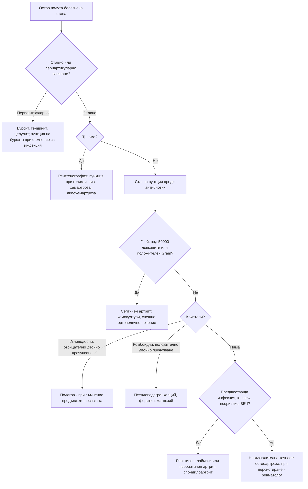

# Глава 51. Остър моноартрит

> **Част X. Опорно-двигателен апарат**

## Цели на главата

- Да се приема, че острият горещ оточен артрит на една става е септичен артрит, докато не се докаже противното.
- Да се разграничава ставното от периартикуларното засягане.
- Да се тълкува анализът на синовиалната течност.
- Да се разграничават подаграта, псевдоподаграта, реактивният артрит и травматичната хемартроза.
- Да се помни, че имуносупресията маскира треската и локалните белези на инфекцията.

---

## 1. Ставно или периартикуларно засягане?

| Белег | Ставно (артрит) | Периартикуларно (бурсит, тендинит, ентезит, целулит) |
|---|---|---|
| Болка при движение | При **всички** движения в ставата, активни и пасивни | При **определени** движения, свързани със засегнатата структура |
| Пасивен обем на движение | Ограничен и болезнен | Често **запазен** |
| Оток | **Изпълване на ставата** (излив) | Локален оток извън ставната капсула (например препателарен или олекранонов бурсит) |
| Болезненост | По ставната цепка | **Точкова**, над засегнатата структура |

**Важно:** при целулит над ставата **не се пунктира през инфектираната кожа**.

---

## 2. Причини

| Група | Причини |
|---|---|
| **Инфекциозни** | **Бактериален (септичен) артрит** — най-често *Staphylococcus aureus*, стрептококи; **гонококов артрит** (млади сексуално активни хора — мигриращи артралгии, **теносиновит**, пустулозни кожни лезии); инфекция на **ставна протеза**; **лаймски артрит** (коляно, голям излив, относително малко болка, ухапване от кърлеж); **бруцелозен** (сакроилиачни стави, коляно, тазобедрена става); **туберкулозен** (хроничен моноартрит — тазобедрена става, коляно); гъбичен |
| **Кристални** | **Подагра** (кристали на мононатриев урат); **псевдоподагра** — отлагане на калциев пирофосфат дихидрат (ОКПФ); рядко базичен калциев фосфат („милуокско рамо“) |
| **Травматични** | **Хемартроза** (скъсване на предната кръстна връзка, фрактура — **липохемартроза** с мастни капки, хемофилия, **антикоагуланти**), вътреставно тяло, увреждане на менискус |
| **Възпалителни** | **Реактивен артрит** (след стомашно-чревна инфекция — *Salmonella*, *Shigella*, *Campylobacter*, *Yersinia* — или след урогенитална инфекция с *Chlamydia*, 1–4 седмици по-късно); **начало на полиартрит** (ревматоиден, псориатичен, спондилоартрит); **саркоидоза** (синдром на Löfgren — глезени); **фамилна средиземноморска треска**; болест на Behçet |
| **Дегенеративни** | **Обостряне на остеоартроза** (невъзпалителен излив) |
| **Други** | Остеонекроза, пигментен вилонодуларен синовит (рецидивиращи хемартрози), костни тумори, остеомиелит в съседство, синовит от растителен трън, ставни прояви на системни заболявания |

---

## 3. Безопасна диагностична стратегия

| Въпрос | Отговор |
|---|---|
| **Вероятна диагноза** | Подагра, псевдоподагра, травма, обостряне на остеоартроза, реактивен артрит |
| **Сериозни заболявания, които не бива да се пропускат** | **Септичен артрит** (смъртност до 10–15% и бързо разрушаване на ставата); **инфекция на ставна протеза**; **гонококов артрит**; остеомиелит; **фрактура**; хемартроза при коагулопатия; тумор |
| **Чести капани** | Септичен артрит без треска при имуносупресия, при възрастни хора и при лечение с кортикостероиди; **съчетание на подагра и инфекция** (кристалите не изключват сепсис); нормална пикочна киселина по време на пристъп на подагра; псевдоподагра, приета за септичен артрит (с треска и висок CRP); лаймски артрит; реактивен артрит с незабелязана предшестваща инфекция; бурсит, приет за артрит |
| **Маскиращи заболявания** | Захарен диабет (предразполага към инфекции), лекарства (диуретици — подагра; антикоагуланти — хемартроза), хемохроматоза (псевдоподагра) |
| **Психосоциални аспекти** | Интравенозна употреба на наркотици, рисково сексуално поведение, алкохол (подагра) |

---

## 4. Анамнеза и физикален преглед

**Анамнеза:**

- **Начало:** за часове с максимум до 24 часа (подагра, псевдоподагра, септичен артрит), след травма (хемартроза).
- **Предишни пристъпи** (подагра, псевдоподагра).
- **Треска**, тръпки, общо неразположение.
- **Рискови фактори за септичен артрит:** възраст над 80 години, ревматоиден артрит, диабет, **ставна протеза**, скорошна **операция** или **вътреставна инжекция**, кожна инфекция, **интравенозна употреба на наркотици**, имуносупресия, ХБЗ.
- **Предшестваща инфекция:** диария, уретрит, конюнктивит (реактивен артрит); **ухапване от кърлеж** (лаймска болест).
- **Сексуална анамнеза.**
- **Лекарства** (диуретици, аспирин в ниска доза, антикоагуланти) и **алкохол**.
- Псориазис, възпалителни болести на червата, увеит.

**Физикален преглед:**

- температура;
- засегната става: затопляне, зачервяване, излив, обем на движение;
- **първа метатарзофалангеална става** (подагра — подагра на палеца);
- **тофи** (ушни миди, лакти, пръсти);
- кожа: входна врата, **пустули** (гонококи), **псориазис**, кератодермия на ходилата (реактивен артрит), **мигриращ еритем** (лаймска болест);
- очи (конюнктивит, увеит);
- гениталии (уретрален секрет, баланит);
- други стави и ентези;
- сърдечни шумове (ендокардит).

---

## 5. Анализ на синовиалната течност

**Ставната пункция е ключовото изследване.** Тя се извършва **преди** започване на антибиотично лечение.

| Показател | Нормална | Невъзпалителна (остеоартроза, травма) | Възпалителна (подагра, псевдоподагра, ревматоиден, реактивен артрит) | **Септична** |
|---|---|---|---|---|
| Вид | Прозрачна, светложълта | Прозрачна | Мътна | **Мътна, гнойна** |
| Левкоцити (/µl) | < 200 | < 2000 | 2000–50 000 (понякога повече) | **Обикновено > 50 000** (често > 100 000) |
| Неутрофили | < 25% | < 25% | > 50% | **> 90%** |
| Оцветяване по Gram и посявка | Отрицателни | Отрицателни | Отрицателни | **Положителни** (оцветяването по Gram е положително само при около половината) |

**Кристали при поляризационна микроскопия:**

- **подагра** — **иглоподобни** кристали на мононатриев урат с **отрицателно** двойно пречупване;
- **псевдоподагра** — **ромбоидни** кристали на калциев пирофосфат със **слабо положително** двойно пречупване.

**Кървава течност:** травма, хемофилия, антикоагуланти, пигментен вилонодуларен синовит, тумори, скорбут. **Мастни капки** — вътреставна фрактура.

**Наличието на кристали не изключва септичен артрит.** Двете състояния могат да съществуват едновременно.

---

## 6. Диференциално-диагностична таблица

| Заболяване | Типичен пациент | Ключови белези | Потвърждение |
|---|---|---|---|
| **Септичен артрит** | Възрастни хора, ревматоиден артрит, диабет, протези, имуносупресия, интравенозни наркотици | Остро горещо подуто коляно (или друга голяма става), невъзможност за натоварване, треска (често липсва) | Пункция, хемокултури |
| **Гонококов артрит** | Млади сексуално активни хора | Мигриращи артралгии, **теносиновит** на китките и глезените, **пустули** по крайниците, после моно- или олигоартрит | NAAT от уретрата, шийката, фаринкса и ректума; хемокултури; синовиална течност |
| **Подагра** | Мъже над 40 години, жени след менопаузата; алкохол, диуретици, ХБЗ, затлъстяване | **Първа метатарзофалангеална става**, глезен, коляно; силна болка, не може да понесе допир дори на чаршафа; зачервяване, десквамация след пристъпа; тофи | Кристали в синовиалната течност; пикочна киселина (**може да е нормална по време на пристъпа** — повторете след 2–4 седмици); ехография (белег на „двойния контур“), двуенергийна КТ |
| **Псевдоподагра** (ОКПФ) | **Възрастни хора** | **Коляно, китка**; често след операция или остро заболяване; може да протече с треска | Кристали; **хондрокалциноза** на рентгенографията; при възраст под 60 години — изследване на калций, феритин (хемохроматоза), магнезий, фосфати |
| **Реактивен артрит** | Млади хора | 1–4 седмици след диария или уретрит; асиметричен олигоартрит на краката, ентезит, конюнктивит, уретрит | Клинична диагноза; изследвания на изпражненията и NAAT за хламидия; HLA-B27 |
| **Лаймски артрит** | Контакт с кърлежи | Коляно, голям, относително неболезнен излив, рецидивиращ | Серология (ELISA и имуноблот) |
| **Хемартроза** | Травма, антикоагуланти, хемофилия | Бързо подуване (минути до часове) след травма | Пункция, рентгенография, коагулация |
| **Обостряне на остеоартроза** | Възрастни хора | Невъзпалителен излив, крепитации | Рентгенография, синовиална течност |
| **Бурсит** (препателарен, олекранонов) | Професии с коленичене, опиране на лакътя | Оток извън ставата, запазено движение; **може да е септичен** | Пункция на бурсата |

---

## 7. Изследвания

- **Ставна пункция** — левкоцити и диференциално броене, оцветяване по Gram, посявка, кристали.
- **Хемокултури** при съмнение за инфекция.
- ПКК, CRP, СУЕ, креатинин, **пикочна киселина**, глюкоза.
- При съответна клиника: NAAT за гонорея и хламидия (от всички възможни места), серология за лаймска болест, HLA-B27, калций, магнезий, феритин, коагулационни показатели.
- **Рентгенография** (фрактура, хондрокалциноза, ерозии — при подагра с „надвиснали ръбове“, остеоартроза, остеомиелит).
- **Ехография** (излив, пункция под контрол, белези на подагра).
- ЯМР при подозрение за остеомиелит или остеонекроза.

---

## 8. Червени флагове

- Треска, тръпки, общо неразположение.
- **Ставна протеза.**
- Имуносупресия, диабет, интравенозна употреба на наркотици.
- Скорошна операция или вътреставна инжекция.
- Невъзможност за натоварване, силна болка при минимално движение.
- Нарушена кожа над ставата или кожна инфекция наблизо.
- Нов сърдечен шум (ендокардит).
- Пустулозни кожни лезии (гонококи).

**При невъзможност за пункция в кабинета пациентът се насочва спешно.**

---

## 9. Диагностичен алгоритъм

---

## 10. Клинични перли

- Острата гореща подута става е септична, докато пункцията не докаже противното.
- Пункцията се прави преди антибиотика. Антибиотикът, даден „за всеки случай“, прави посявката безполезна.
- Кристалите не изключват инфекция. Изпращайте течността и за посявка.
- По време на пристъп на подагра пикочната киселина може да е нормална.
- При пациенти на кортикостероиди, метотрексат или биологична терапия септичният артрит може да протича без треска и може да се сбърка с обостряне на ревматоидния артрит.
- Млад човек с мигриращи болки в ставите, теносиновит на китката и пустули: гонококова инфекция.
- Възрастен пациент с остро подуто коляно или китка след операция или остро заболяване: псевдоподагра. Направете рентгенография за хондрокалциноза.
- Псевдоподагра при човек под 60 години: изследвайте за хемохроматоза и хиперпаратиреоидизъм.
- Тиазидите, бримковите диуретици и ниската доза аспирин повишават пикочната киселина и могат да провокират подагра.

---

## 11. Клиничен случай

**Случай.** Жена на 72 години с ревматоиден артрит, лекувана с метотрексат и 7,5 mg преднизолон дневно, идва с болезнено подуто дясно коляно от 2 дни. Не може да стъпи на крака. Мисли, че е „поредно обостряне на артрита“. Температура 37,3 °C. Останалите стави са спокойни. Коляното е топло, с голям излив. CRP 186 mg/l, левкоцити 13,2 × 10⁹/l.

**Въпроси.** 1) Защо не трябва да се приеме, че това е обостряне на ревматоидния артрит? 2) Какво е изследването на избор?

**Обсъждане.** **Моноартикуларното** засягане при пациент с ревматоиден артрит, чиито други стави са спокойни, особено при **имуносупресия** (метотрексат и кортикостероиди), е подозрително за **септичен артрит**. Ревматоидният артрит сам по себе си е рисков фактор за сепсис. Кортикостероидите маскират треската. Много високият CRP също насочва към инфекция. **Ставната пункция** дава мътна течност с 85 000 левкоцита/µl, 95% неутрофили и Грам-положителни коки в купчини. Посявката изолира *Staphylococcus aureus*. Необходими са спешна хоспитализация, хемокултури, интравенозни антибиотици и дренаж на ставата (артроскопски или чрез повтарящи се пункции).

**Поука.** При имуносупресиран пациент с моноартрит първо се изключва инфекция. „Обостряне“ се приема едва след отрицателна пункция.
