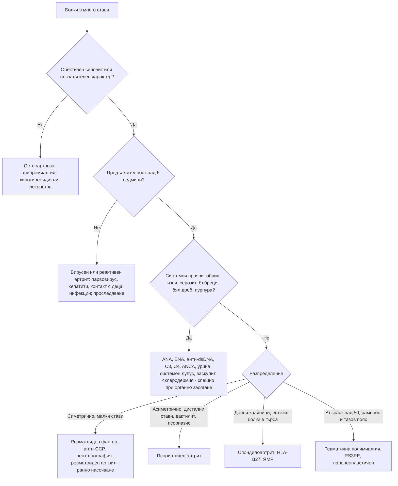

# Глава 52. Полиартрит и системни заболявания на съединителната тъкан

> **Част X. Опорно-двигателен апарат**

## Цели на главата

- Да се класифицира полиартритът според броя, разпределението и продължителността на засягането и да се съставя диференциална диагноза.
- Да се разграничават възпалителните от невъзпалителните ставни болки.
- Да се разпознават ранният ревматоиден артрит и псориатичният артрит и да се насочват навреме.
- Да се разграничават вирусните и реактивните артрити от хроничните.
- Да се разпознават системният лупус еритематодес, системната склероза, синдромът на Sjögren и васкулитите.
- Да се тълкуват правилно ANA, ревматоидният фактор и анти-CCP антителата.

---

## 1. Клиничен подход

1. **Артрит (възпаление) или артралгия (болка без обективно възпаление)?**
2. **Брой на засегнатите стави:** моноартрит (1), олигоартрит (2–4), полиартрит (≥ 5).
3. **Разпределение:**
   - малки или големи стави;
   - **симетрично** или **асиметрично**;
   - горни или долни крайници;
   - засягане на **дисталните интерфалангеални стави**;
   - **аксиално засягане**.
4. **Продължителност:** остър (< 6 седмици — често вирусен или реактивен) или **хроничен** (> 6 седмици).
5. **Модел на протичане:**
   - адитивен (нови стави се добавят);
   - **мигриращ** (ревматична треска, гонококи, лаймска болест, системен лупус еритематодес);
   - интермитентен (палиндромен ревматизъм, кристални артропатии).
6. **Възпалителен характер:** сутрешна скованост над 30–60 минути, оток, затопляне, подобрение при движение.
7. **Извънставни прояви:** кожа, очи, лигавици, бял дроб, бъбреци, нервна система, серозни обвивки, общи симптоми.

### 1.1. Възпалителни и невъзпалителни ставни болки

| Белег | Възпалителни | Невъзпалителни (остеоартроза) |
|---|---|---|
| Сутрешна скованост | **> 30–60 минути** | < 30 минути |
| Ефект на движението | Подобрение | Влошаване |
| Оток | **Мек, синовиален** | Костни задебелявания (възли на Heberden и Bouchard) |
| Затопляне | Да | Не |
| Общи симптоми | Възможни | Няма |
| СУЕ и CRP | Често повишени | Нормални |

---

## 2. Причини за полиартрит

| Група | Заболявания и ключови белези |
|---|---|
| **Ревматоиден артрит** | **Симетричен** артрит на **малките стави** (метакарпофалангеални, проксимални интерфалангеални, китки, метатарзофалангеални); **дисталните интерфалангеални стави са пощадени**; сутрешна скованост > 1 час; положителен **ревматоиден фактор** и **анти-CCP** (висока специфичност); ерозии; извънставни прояви (ревматоидни възли, интерстициална белодробна болест, васкулит, вторичен синдром на Sjögren, синдром на Felty) |
| **Псориатичен артрит** | **Асиметричен** олигоартрит, **дистални интерфалангеални стави**, **дактилит**, **ентезит**, **промени в ноктите** (точковидни вдлъбнатини, онихолиза); **псориазис** (понякога скрит — по скалпа, в пъпа, в междуседалищната гънка) или фамилна анамнеза; аксиално засягане |
| **Вирусни артрити** | **Парвовирус B19** (при възрастни — симетричен полиартрит на малките стави, наподобяващ ревматоиден артрит; контакт с деца със „зашлевени бузи“; отзвучава за седмици); **хепатит B** (продром с уртикария и артрит); **хепатит C** (артралгии, криоглобулинемия); рубеола (и ваксина); HIV; EBV; **чикунгуня** (след пътуване; тежък, продължителен); COVID-19 |
| **Реактивен артрит и периферен спондилоартрит** | Асиметричен олигоартрит на **долните крайници**, ентезит, дактилит; след инфекция; HLA-B27 |
| **Кристални артропатии** | Полиартикуларна подагра (хронична тофозна); **псевдоподагра**, наподобяваща ревматоиден артрит |
| **Остеоартроза** | **Нодуларна** генерализирана остеоартроза (дистални и проксимални интерфалангеални стави, първа карпометакарпална става); ерозивна остеоартроза; възраст над 50 години; кратка скованост |
| **Системен лупус еритематодес** | Жени на 15–45 години; неерозивен артрит; **фоточувствителен обрив по лицето** („пеперуда“), **язви в устата**, алопеция, **серозит**, **нефрит**, цитопении, неврологични и психични прояви, феномен на Raynaud, антифосфолипиден синдром |
| **Синдром на Sjögren** | **Сухота в очите и устата**, уголемяване на паротидите, артралгии, умора; анти-Ro/SSA и анти-La/SSB; **повишен риск от лимфом** |
| **Системна склероза** | **Феномен на Raynaud**, задебеляване на кожата (**склеродактилия**), дигитални язви, дисфагия и рефлукс, **интерстициална белодробна болест**, **белодробна артериална хипертония**, **склеродермна бъбречна криза**; антицентромерни антитела (ограничена форма), анти-Scl-70 (дифузна форма), анти-РНК полимераза III (бъбречна криза, злокачествени заболявания) |
| **Възпалителни миопатии** | Проксимална слабост (вж. глава 46) |
| **Васкулити** | Големи съдове (гигантоклетъчен артериит, артериит на Takayasu); средни съдове (полиартериит нодоза — хепатит B, множествена мононевропатия, болка в тестисите, бъбречни инфаркти); **малки съдове** (ANCA-свързани — грануломатоза с полиангиит, микроскопски полиангиит, **еозинофилна грануломатоза с полиангиит** с астма и еозинофилия; имунокомплексни — **IgA васкулит**, криоглобулинемичен, уртикариален); **болест на Behçet** (**орални и генитални язви**, увеит, **патергия**, венозни тромбози) |
| **Болест на Still при възрастни** | **Висока треска веднъж или два пъти дневно**, **преходен сьомгово-розов обрив**, артрит, болки в гърлото, **много висок феритин**, неутрофилия, повишени чернодробни ензими |
| **Ревматична треска** | След стрептококов фарингит; **мигриращ** полиартрит на големите стави, кардит, хорея, маргинален еритем, подкожни възли (критерии на Jones) |
| **Саркоидоза** | Синдром на Löfgren (артрит на глезените, еритема нодозум, двустранна хилусна лимфаденопатия, треска) |
| **Хемохроматоза** | Артропатия на **II и III метакарпофалангеални стави**, остеофити с форма на „кука“, псевдоподагра |
| **Паранеопластични** | **Хипертрофична остеоартропатия** (карцином на белия дроб, барабанни пръсти, периостит), **синдромът RS3PE** (ремитиращ серонегативен симетричен синовит с оток на дланите, оставящ ямка — възрастни хора), карциноматозен полиартрит |
| **Ендокринни** | Хипотиреоидизъм, акромегалия, хиперпаратиреоидизъм |
| **Лекарства** | **Инхибитори на ароматазата** (артралгии), **имунни чекпойнт инхибитори** (възпалителен артрит), лекарствено индуциран лупус (хидралазин, прокаинамид, изониазид, миноциклин, инхибитори на TNF-α), **серумна болест** (1–2 седмици след лекарство — треска, обрив, артралгии, лимфаденопатия) |
| **Други** | Артрит при възпалителни болести на червата, инфекциозен ендокардит (артралгии, болки в гърба), фибромиалгия (**не е артрит** — няма синовит) |

---

## 3. Безопасна диагностична стратегия

| Въпрос | Отговор |
|---|---|
| **Вероятна диагноза** | Остеоартроза, вирусен артрит, ревматоиден артрит, псориатичен артрит, кристални артропатии |
| **Сериозни заболявания, които не бива да се пропускат** | **Септичен полиартрит** (гонококи, ендокардит); **системни васкулити** с органно засягане (бъбреци, бял дроб, нерви); **системен лупус еритематодес** с нефрит или цитопении; **склеродермна бъбречна криза**; **гигантоклетъчен артериит**; **паранеопластични** синдроми; **ранен ревматоиден артрит** („прозорец на възможност“ за лечение) |
| **Чести капани** | Парвовирус B19, диагностициран като ревматоиден артрит; псориатичен артрит без видим псориазис; хемохроматоза; лекарства (инхибитори на ароматазата, чекпойнт инхибитори); хипотиреоидизъм; фибромиалгия, приета за възпалителен артрит; нискотитрен ANA при здрави хора |
| **Маскиращи заболявания** | Хипотиреоидизъм, злокачествени заболявания, инфекциозен ендокардит, HIV, хепатити |
| **Психосоциални аспекти** | Депресия, фибромиалгия, нарушен сън |

---

## 4. Имунологични изследвания

| Изследване | Тълкуване |
|---|---|
| **ANA** | Чувствителност около 95–98% за системен лупус еритематодес, но **ниска специфичност**. Положителен при **5–15% от здравите хора** (особено в ниски титри, при жени и възрастни хора), при други автоимунни заболявания, при инфекции и при лекарства. **Изследва се само при клинично подозрение.** Отрицателният ANA практически изключва системен лупус еритематодес |
| **Специфични антитела** (ENA) | **Анти-dsDNA** и **анти-Sm** — системен лупус еритематодес (анти-dsDNA корелира с нефрит и активност); **анти-Ro/La** — синдром на Sjögren, неонатален лупус (сърдечен блок); **анти-RNP** — смесено заболяване на съединителната тъкан; **анти-Scl-70, антицентромерни** — системна склероза; **анти-Jo-1** — антисинтетазен синдром; **антихистонови** — лекарствено индуциран лупус |
| **Ревматоиден фактор** | Около 70% при ревматоиден артрит, но също при синдром на Sjögren, системен лупус еритематодес, **криоглобулинемия** (хепатит C), хронични инфекции (ендокардит, туберкулоза), чернодробни заболявания, саркоидоза и **при 5–10% от възрастните хора** |
| **Анти-CCP** | **Специфичност около 95%** за ревматоиден артрит; свързан с ерозивно протичане; може да предшества заболяването с години |
| **ANCA** (c-ANCA/PR3, p-ANCA/MPO) | ANCA-свързани васкулити; p-ANCA е положителен и при възпалителни болести на червата, автоимунен хепатит, лекарства (хидралазин, пропилтиоурацил, левамизол в кокаина) |
| **Комплемент C3, C4** | Понижен при активен системен лупус еритематодес, криоглобулинемия, постинфекциозен гломерулонефрит |
| **HLA-B27** | Спондилоартрити; положителен и при 6–8% от здравите европейци |

---

## 5. Червени флагове

- Треска, загуба на тегло, нощно изпотяване.
- **Органно засягане:**
  - **бъбреци** — хематурия, протеинурия, покачващ се креатинин, хипертония;
  - **бял дроб** — хемоптиза, задух, инфилтрати;
  - **нервна система** — множествена мононевропатия, гърчове, психоза;
  - **сърце** — перикардит, миокардит.
- **Палпируема пурпура**, кожни язви, некрози.
- **Тежък феномен на Raynaud**, дигитална исхемия.
- **Цитопении.**
- Много високи възпалителни показатели.
- Главоболие, зрителни симптоми, челюстна клаудикация при възраст над 50 години.
- Белези на септичен артрит.

### 5.1. Кога да се насочи рано (ранен артрит)

Препоръките на EULAR изискват насочване към ревматолог **до 6 седмици от началото на симптомите** при:

- **≥ 1 подута става** (без ясна причина);
- **положителен тест със стискане** на метакарпофалангеалните или метатарзофалангеалните стави;
- **сутрешна скованост ≥ 30 минути**.

Ранното лечение на ревматоидния артрит („прозорецът на възможност“) предотвратява разрушаването на ставите. **Кортикостероиди не се предписват преди оценката от ревматолог**, освен при крайна необходимост. Те маскират синовита и затрудняват диагнозата.

---

## 6. Диференциално-диагностична таблица

| Белег | Ревматоиден артрит | Псориатичен артрит | Остеоартроза | Системен лупус еритематодес | Вирусен артрит (парвовирус) |
|---|---|---|---|---|---|
| Разпределение | Симетрично, малки стави | Асиметрично, **дистални интерфалангеални стави**, дактилит | **Дистални** и проксимални интерфалангеални стави, първа карпометакарпална става, колене, тазобедрени стави | Симетрично, малки стави | Симетрично, малки стави |
| Дистални интерфалангеални стави | Пощадени | **Засегнати** | **Засегнати** (възли на Heberden) | Пощадени | Пощадени |
| Сутрешна скованост | > 1 час | > 30 минути | < 30 минути | Различна | Различна |
| Ерозии | Да | Да („молив в чашка“) | Не (с изключение на ерозивната форма) | **Не** (деформации на Jaccoud) | Не |
| Извънставни прояви | Възли, бял дроб, очи | Кожа, нокти, очи, ентези | Не | Кожа, бъбреци, серозни обвивки, кръв, ЦНС | Обрив (при деца) |
| Серология | Ревматоиден фактор, **анти-CCP** | Серонегативен | Отрицателна | **ANA**, анти-dsDNA, анти-Sm, нисък комплемент | **Парвовирус B19 IgM**; понякога преходно положителни ревматоиден фактор и ANA |
| Ход | Хроничен | Хроничен | Хроничен, бавно прогресиращ | Хроничен, с обостряния | **Самоограничаващ се** (седмици) |

---

## 7. Изследвания

**Първа линия при полиартрит:**

- ПКК, СУЕ, CRP;
- креатинин, чернодробни ензими, **изследване на урината** (кръв, белтък);
- **ревматоиден фактор и анти-CCP**;
- **ANA** (при клинично подозрение за системно заболяване);
- пикочна киселина;
- серология за **парвовирус B19**, хепатит B и C;
- ТСХ.

**Втора линия:** специфични антитела (ENA), анти-dsDNA, C3 и C4, ANCA, криоглобулини, HLA-B27, феритин и трансферинова сатурация, ангиотензин-конвертиращ ензим, серология за лаймска болест.

**Образна диагностика:**

- рентгенография на ръцете и стъпалата (ерозии, стесняване на ставните цепки, хондрокалциноза);
- **ехография на ставите** (синовит, ерозии, ентезит — по-чувствителна от прегледа);
- рентгенография на гръден кош.

---

## 8. Диагностичен алгоритъм

---

## 9. Клинични перли

- Ранният ревматоиден артрит е спешен в ревматологията. Насочете до 6 седмици.
- Не назначавайте „ревматологичен панел“ при всеки с болки в ставите. Положителният ANA в нисък титър е чест при здрави хора и води до ненужна тревога.
- Отрицателният ANA практически изключва системен лупус еритематодес.
- Симетричен полиартрит при майка на малки деца, започнал внезапно: парвовирус B19. Попитайте за бременност, защото инфекцията е опасна за плода.
- Засегнати дистални интерфалангеални стави при оток: псориатичен артрит (или остеоартроза). Огледайте ноктите, скалпа и пъпа.
- Артропатия на II и III метакарпофалангеални стави с диабет и повишени чернодробни ензими: хемохроматоза.
- Полиартрит с хематурия и протеинурия: системно заболяване с нефрит. Изследвайте урината при всеки пациент с полиартрит.
- Висока треска, преходен розов обрив, артрит и феритин над няколко хиляди: болест на Still при възрастни.
- Жена на инхибитор на ароматазата с болки в ставите: лекарствена артралгия.
- Орални и генитални язви, увеит и тромбози: болест на Behçet.

---

## 10. Клиничен случай

**Случай.** Жена на 34 години, майка на две деца на 4 и 7 години, се оплаква от внезапно започнали болки и оток в малките стави на двете ръце и в китките от 10 дни. Сутрешната скованост продължава около час. Преди 2 седмици по-малкото ѝ дете е имало обрив по бузите, „сякаш е зашлевено“, и по крайниците. При прегледа: симетричен синовит на метакарпофалангеалните и проксималните интерфалангеални стави. Ревматоидният фактор е слабо положителен, анти-CCP е отрицателен, CRP е 14 mg/l.

**Въпроси.** 1) Ревматоиден артрит ли е това? 2) Какво изследване ще изясни диагнозата и какъв въпрос е задължителен?

**Обсъждане.** Острият симетричен полиартрит на малките стави може да наподобява ревматоиден артрит. Внезапното начало, контактът с дете с **инфекциозна еритема** (пета болест, „зашлевени бузи“) и отрицателният анти-CCP насочват към **артрит от парвовирус B19**. IgM антителата срещу парвовирус B19 са положителни. Слабо положителният ревматоиден фактор може да е преходен. Артритът обикновено отзвучава за 2–4 седмици, а при някои възрастни продължава по-дълго. **Задължително е да се попита за бременност.** Инфекцията по време на бременност може да предизвика фетална анемия и хидропс. Пациентката не е бременна. Лечението е симптоматично, с контролен преглед след 6 седмици.

**Поука.** Не всеки симетричен полиартрит е ревматоиден артрит. Анамнезата за контакт с болни и продължителността на симптомите са ключови.

<!-- навигация -->

---

[← Глава 51. Остър моноартрит](51-monoartrit.md) · [Съдържание](../README.md) · [Глава 53. Регионална болка: лакът, китка, тазобедрена става, коляно, глезен и стъпало →](53-regionalna-bolka.md)
