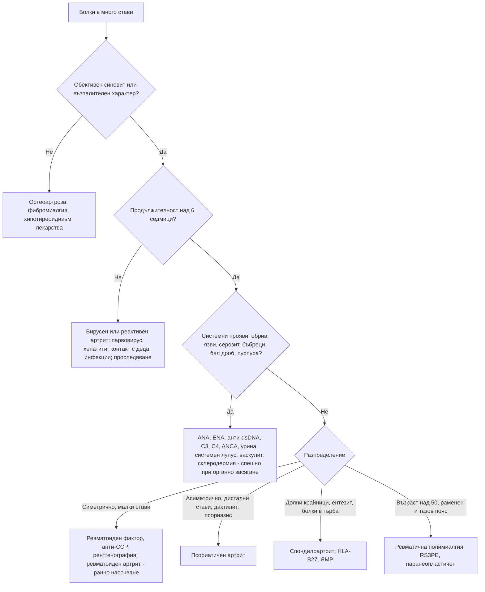

# Глава 52. Полиартрит и системни заболявания на съединителната тъкан

> **Част X. Опорно-двигателен апарат**

## Цели на главата

- Да се класифицира полиартритът според броя, разпределението и продължителността на засягането и да се съставя диференциална диагноза.
- Да се разграничават възпалителните от невъзпалителните ставни болки.
- Да се разпознават ранният ревматоиден артрит и псориатичният артрит и да се насочват навреме.
- Да се разграничават вирусните и реактивните артрити от хроничните.
- Да се разпознават системният лупус еритематодес, системната склероза, синдромът на Sjögren и васкулитите.
- Да се тълкуват правилно ANA, ревматоидният фактор и анти-CCP антителата.

## Ключови моменти

- Първо се установява дали има обективен синовит. Възпалителните болки протичат със сутрешна скованост над 30–60 минути и подобрение при движение.
- Всеки пациент с необяснен синовит трябва да бъде прегледан от ревматолог до 6 седмици от началото, дори при нормални CRP, ревматоиден фактор и анти-CCP *(SORT B [4, 5])*.
- Анти-CCP има специфичност около 95% за ревматоиден артрит, а ревматоидният фактор — около 85% *(SORT A [3])*.
- ANA е положителен при около 14% от населението. Изследва се само при клинично подозрение за системно заболяване *(SORT B [1])*.
- Острият симетричен полиартрит след контакт с деца може да е парвовирусен и да отзвучи за седмици. Задължително се пита за бременност.
- Полиартрит с хематурия, протеинурия, пурпура или дихателни симптоми е системно заболяване с органно засягане до доказване на противното.

---

## 1. Клиничен подход

1. **Артрит (възпаление) или артралгия (болка без обективно възпаление)?**
2. **Брой на засегнатите стави:** моноартрит (1), олигоартрит (2–4), полиартрит (≥ 5).
3. **Разпределение:**
   - малки или големи стави;
   - **симетрично** или **асиметрично**;
   - горни или долни крайници;
   - засягане на **дисталните интерфалангеални стави**;
   - **аксиално засягане**.
4. **Продължителност:** остър (< 6 седмици — често вирусен или реактивен) или **хроничен** (> 6 седмици).
5. **Модел на протичане:**
   - адитивен (нови стави се добавят);
   - **мигриращ** (ревматична треска, гонококи, лаймска болест, системен лупус еритематодес);
   - интермитентен (палиндромен ревматизъм, кристални артропатии).
6. **Възпалителен характер:** сутрешна скованост над 30–60 минути, оток, затопляне, подобрение при движение.
7. **Извънставни прояви:** кожа, очи, лигавици, бял дроб, бъбреци, нервна система, серозни обвивки, общи симптоми.

### 1.1. Възпалителни и невъзпалителни ставни болки

| Белег | Възпалителни | Невъзпалителни (остеоартроза) |
|---|---|---|
| Сутрешна скованост | **> 30–60 минути** | < 30 минути |
| Ефект на движението | Подобрение | Влошаване |
| Оток | **Мек, синовиален** | Костни задебелявания (възли на Heberden и Bouchard) |
| Затопляне | Да | Не |
| Общи симптоми | Възможни | Няма |
| СУЕ и CRP | Често повишени | Нормални |

---

## 2. Причини за полиартрит

| Група | Заболявания и ключови белези |
|---|---|
| **Ревматоиден артрит** | **Симетричен** артрит на **малките стави** (метакарпофалангеални, проксимални интерфалангеални, китки, метатарзофалангеални); **дисталните интерфалангеални стави са пощадени**; сутрешна скованост > 1 час; положителен **ревматоиден фактор** и **анти-CCP** (висока специфичност); ерозии; извънставни прояви (ревматоидни възли, интерстициална белодробна болест, васкулит, вторичен синдром на Sjögren, синдром на Felty) |
| **Псориатичен артрит** | **Асиметричен** олигоартрит, **дистални интерфалангеални стави**, **дактилит**, **ентезит**, **промени в ноктите** (точковидни вдлъбнатини, онихолиза); **псориазис** (понякога скрит — по скалпа, в пъпа, в междуседалищната гънка) или фамилна анамнеза; аксиално засягане |
| **Вирусни артрити** | **Парвовирус B19** (при възрастни — симетричен полиартрит на малките стави, наподобяващ ревматоиден артрит; контакт с деца със „зашлевени бузи“; отзвучава за седмици); **хепатит B** (продром с уртикария и артрит); **хепатит C** (артралгии, криоглобулинемия); рубеола (и ваксина); HIV; EBV; **чикунгуня** (след пътуване; тежък, продължителен); COVID-19 |
| **Реактивен артрит и периферен спондилоартрит** | Асиметричен олигоартрит на **долните крайници**, ентезит, дактилит; след инфекция; HLA-B27 |
| **Кристални артропатии** | Полиартикуларна подагра (хронична тофозна); **псевдоподагра**, наподобяваща ревматоиден артрит |
| **Остеоартроза** | **Нодуларна** генерализирана остеоартроза (дистални и проксимални интерфалангеални стави, първа карпометакарпална става); ерозивна остеоартроза; възраст над 50 години; кратка скованост |
| **Системен лупус еритематодес** | Жени на 15–45 години; неерозивен артрит; **фоточувствителен обрив по лицето** („пеперуда“), **язви в устата**, алопеция, **серозит**, **нефрит**, цитопении, неврологични и психични прояви, феномен на Raynaud, антифосфолипиден синдром |
| **Синдром на Sjögren** | **Сухота в очите и устата**, уголемяване на паротидите, артралгии, умора; анти-Ro/SSA и анти-La/SSB; **повишен риск от лимфом** |
| **Системна склероза** | **Феномен на Raynaud**, задебеляване на кожата (**склеродактилия**), дигитални язви, дисфагия и рефлукс, **интерстициална белодробна болест**, **белодробна артериална хипертония**, **склеродермна бъбречна криза**; антицентромерни антитела (ограничена форма), анти-Scl-70 (дифузна форма), анти-РНК полимераза III (бъбречна криза, злокачествени заболявания) |
| **Възпалителни миопатии** | Проксимална слабост (вж. глава 46) |
| **Васкулити** | Големи съдове (гигантоклетъчен артериит, артериит на Takayasu); средни съдове (полиартериит нодоза — хепатит B, множествена мононевропатия, болка в тестисите, бъбречни инфаркти); **малки съдове** (ANCA-свързани — грануломатоза с полиангиит, микроскопски полиангиит, **еозинофилна грануломатоза с полиангиит** с астма и еозинофилия; имунокомплексни — **IgA васкулит**, криоглобулинемичен, уртикариален); **болест на Behçet** (**орални и генитални язви**, увеит, **патергия**, венозни тромбози) |
| **Болест на Still при възрастни** | **Висока треска веднъж или два пъти дневно**, **преходен сьомгово-розов обрив**, артрит, болки в гърлото, **много висок феритин**, неутрофилия, повишени чернодробни ензими |
| **Ревматична треска** | След стрептококов фарингит; **мигриращ** полиартрит на големите стави, кардит, хорея, маргинален еритем, подкожни възли (критерии на Jones) |
| **Саркоидоза** | Синдром на Löfgren (артрит на глезените, еритема нодозум, двустранна хилусна лимфаденопатия, треска) |
| **Хемохроматоза** | Артропатия на **II и III метакарпофалангеални стави**, остеофити с форма на „кука“, псевдоподагра |
| **Паранеопластични** | **Хипертрофична остеоартропатия** (карцином на белия дроб, барабанни пръсти, периостит), **синдромът RS3PE** (ремитиращ серонегативен симетричен синовит с оток на дланите, оставящ ямка — възрастни хора), карциноматозен полиартрит |
| **Ендокринни** | Хипотиреоидизъм, акромегалия, хиперпаратиреоидизъм |
| **Лекарства** | **Инхибитори на ароматазата** (артралгии), **имунни чекпойнт инхибитори** (възпалителен артрит), лекарствено индуциран лупус (хидралазин, прокаинамид, изониазид, миноциклин, инхибитори на TNF-α), **серумна болест** (1–2 седмици след лекарство — треска, обрив, артралгии, лимфаденопатия) |
| **Други** | Артрит при възпалителни болести на червата, инфекциозен ендокардит (артралгии, болки в гърба), фибромиалгия (**не е артрит** — няма синовит) |

---

## 3. Безопасна диагностична стратегия

| Въпрос | Отговор |
|---|---|
| **Вероятна диагноза** | Остеоартроза, вирусен артрит, ревматоиден артрит, псориатичен артрит, кристални артропатии |
| **Сериозни заболявания, които не бива да се пропускат** | **Септичен полиартрит** (гонококи, ендокардит); **системни васкулити** с органно засягане (бъбреци, бял дроб, нерви); **системен лупус еритематодес** с нефрит или цитопении; **склеродермна бъбречна криза**; **гигантоклетъчен артериит**; **паранеопластични** синдроми; **ранен ревматоиден артрит** („прозорец на възможност“ за лечение) |
| **Чести капани** | Парвовирус B19, диагностициран като ревматоиден артрит; псориатичен артрит без видим псориазис; хемохроматоза; лекарства (инхибитори на ароматазата, чекпойнт инхибитори); хипотиреоидизъм; фибромиалгия, приета за възпалителен артрит; нискотитрен ANA при здрави хора |
| **Маскиращи заболявания** | Хипотиреоидизъм, злокачествени заболявания, инфекциозен ендокардит, HIV, хепатити |
| **Психосоциални аспекти** | Депресия, фибромиалгия, нарушен сън |

---

## 4. Имунологични изследвания

| Изследване | Тълкуване |
|---|---|
| **ANA** | Чувствителност около 95–98% за системен лупус еритематодес, но **ниска специфичност**. Положителен при **около 14% от населението** (18% от жените) [1], особено в ниски титри, при жени и възрастни хора, при други автоимунни заболявания, при инфекции и при лекарства. **Изследва се само при клинично подозрение.** Отрицателният ANA практически изключва системен лупус еритематодес. ANA ≥ 1:80 е входен критерий в класификационните критерии на EULAR/ACR от 2019 г. [2] |
| **Специфични антитела** (ENA) | **Анти-dsDNA** и **анти-Sm** — системен лупус еритематодес (анти-dsDNA корелира с нефрит и активност); **анти-Ro/La** — синдром на Sjögren, неонатален лупус (сърдечен блок); **анти-RNP** — смесено заболяване на съединителната тъкан; **анти-Scl-70, антицентромерни** — системна склероза; **анти-Jo-1** — антисинтетазен синдром; **антихистонови** — лекарствено индуциран лупус |
| **Ревматоиден фактор** | Около 70% при ревматоиден артрит (специфичност около 85%) [3], но също при синдром на Sjögren, системен лупус еритематодес, **криоглобулинемия** (хепатит C), хронични инфекции (ендокардит, туберкулоза), чернодробни заболявания, саркоидоза и **при 5–10% от възрастните хора** |
| **Анти-CCP** | **Специфичност около 95%** (чувствителност около 67%) за ревматоиден артрит [3]; свързан с ерозивно протичане; може да предшества заболяването с години |
| **ANCA** (c-ANCA/PR3, p-ANCA/MPO) | ANCA-свързани васкулити; p-ANCA е положителен и при възпалителни болести на червата, автоимунен хепатит, лекарства (хидралазин, пропилтиоурацил, левамизол в кокаина) |
| **Комплемент C3, C4** | Понижен при активен системен лупус еритематодес, криоглобулинемия, постинфекциозен гломерулонефрит |
| **HLA-B27** | Спондилоартрити; положителен и при 6–8% от здравите европейци |

---

## 5. Червени флагове

- Треска, загуба на тегло, нощно изпотяване.
- **Органно засягане:**
  - **бъбреци** — хематурия, протеинурия, покачващ се креатинин, хипертония;
  - **бял дроб** — хемоптиза, задух, инфилтрати;
  - **нервна система** — множествена мононевропатия, гърчове, психоза;
  - **сърце** — перикардит, миокардит.
- **Палпируема пурпура**, кожни язви, некрози.
- **Тежък феномен на Raynaud**, дигитална исхемия.
- **Цитопении.**
- Много високи възпалителни показатели.
- Главоболие, зрителни симптоми, челюстна клаудикация при възраст над 50 години.
- Белези на септичен артрит.

### 5.1. Кога да се насочи рано (ранен артрит)

Препоръките на EULAR изискват всеки пациент с артрит (подута става с болка или скованост) да бъде прегледан от ревматолог **до 6 седмици от началото на симптомите** [4]. NICE препоръчва спешно насочване при подозрение за персистиращ синовит на малките стави на ръцете или стъпалата, на повече от една става или при забавяне от 3 и повече месеца — дори при нормални CRP, ревматоиден фактор и анти-CCP [5]. Подозрението за ревматоиден артрит се подкрепя от [6]:

- **≥ 3 подути стави**;
- **положителен тест със стискане** на метакарпофалангеалните или метатарзофалангеалните стави;
- **сутрешна скованост ≥ 30 минути**.

Ранното лечение на ревматоидния артрит („прозорецът на възможност“) предотвратява разрушаването на ставите. **Кортикостероиди не се предписват преди оценката от ревматолог**, освен при крайна необходимост. Те маскират синовита и затрудняват диагнозата.

---

## 6. Диференциално-диагностична таблица

| Белег | Ревматоиден артрит | Псориатичен артрит | Остеоартроза | Системен лупус еритематодес | Вирусен артрит (парвовирус) |
|---|---|---|---|---|---|
| Разпределение | Симетрично, малки стави | Асиметрично, **дистални интерфалангеални стави**, дактилит | **Дистални** и проксимални интерфалангеални стави, първа карпометакарпална става, колене, тазобедрени стави | Симетрично, малки стави | Симетрично, малки стави |
| Дистални интерфалангеални стави | Пощадени | **Засегнати** | **Засегнати** (възли на Heberden) | Пощадени | Пощадени |
| Сутрешна скованост | > 1 час | > 30 минути | < 30 минути | Различна | Различна |
| Ерозии | Да | Да („молив в чашка“) | Не (с изключение на ерозивната форма) | **Не** (деформации на Jaccoud) | Не |
| Извънставни прояви | Възли, бял дроб, очи | Кожа, нокти, очи, ентези | Не | Кожа, бъбреци, серозни обвивки, кръв, ЦНС | Обрив (при деца) |
| Серология | Ревматоиден фактор, **анти-CCP** | Серонегативен | Отрицателна | **ANA**, анти-dsDNA, анти-Sm, нисък комплемент | **Парвовирус B19 IgM**; понякога преходно положителни ревматоиден фактор и ANA |
| Ход | Хроничен | Хроничен | Хроничен, бавно прогресиращ | Хроничен, с обостряния | **Самоограничаващ се** (седмици) |

---

## 7. Изследвания

**Първа линия при полиартрит:**

- ПКК, СУЕ, CRP;
- креатинин, чернодробни ензими, **изследване на урината** (кръв, белтък);
- **ревматоиден фактор и анти-CCP**;
- **ANA** (при клинично подозрение за системно заболяване);
- пикочна киселина;
- серология за **парвовирус B19**, хепатит B и C;
- ТСХ.

**Втора линия:** специфични антитела (ENA), анти-dsDNA, C3 и C4, ANCA, криоглобулини, HLA-B27, феритин и трансферинова сатурация, ангиотензин-конвертиращ ензим, серология за лаймска болест.

**Образна диагностика:**

- рентгенография на ръцете и стъпалата (ерозии, стесняване на ставните цепки, хондрокалциноза);
- **ехография на ставите** (синовит, ерозии, ентезит — по-чувствителна от прегледа);
- рентгенография на гръден кош.

---

## 8. Диагностичен алгоритъм

*Фигура 52.1. Диагностичен алгоритъм: полиартрит и системни заболявания на съединителната тъкан. Схема на авторите въз основа на източниците, цитирани в главата.*

Текстово описание на фигура 52.1

1. Болки в много стави. Следва: към т. 2.
2. **Въпрос:** Обективен синовит или възпалителен характер? Не — към т. 3; Да — към т. 4.
3. Остеоартроза, фибромиалгия, хипотиреоидизъм, лекарства.
4. **Въпрос:** Продължителност над 6 седмици? Не — към т. 5; Да — към т. 6.
5. Вирусен или реактивен артрит: парвовирус, хепатити, контакт с деца, инфекции; проследяване.
6. **Въпрос:** Системни прояви: обрив, язви, серозит, бъбреци, бял дроб, пурпура? Да — към т. 7; Не — към т. 8.
7. ANA, ENA, анти-dsDNA, C3, C4, ANCA, урина: системен лупус, васкулит, склеродермия — спешно при органно засягане.
8. **Въпрос:** Разпределение Симетрично, малки стави — към т. 9; Асиметрично, дистални стави, дактилит, псориазис — към т. 10; Долни крайници, ентезит, болки в гърба — към т. 11; Възраст над 50, раменен и тазов пояс — към т. 12.
9. Ревматоиден фактор, анти-CCP, рентгенография: ревматоиден артрит — ранно насочване.
10. Псориатичен артрит.
11. Спондилоартрит: HLA-B27, ЯМР.
12. Ревматична полимиалгия, RS3PE, паранеопластичен.

---

## 9. Кога и колко спешно да насочим

| Спешност | Клинична ситуация |
|---|---|
| **Незабавно (112 или спешно отделение)** | Полиартрит с треска и признаци на сепсис или ендокардит; васкулит с бързо влошаваща се бъбречна функция, хемоптиза или неврологичен дефицит; внезапна тежка хипертония при системна склероза (склеродермна бъбречна криза) |
| **В същия ден** | Подозрение за гигантоклетъчен артериит; системен лупус с нефрит, цитопении или серозит; дигитална исхемия или язви |
| **Бързо (до 2 седмици)** | Персистиращ синовит на малките стави на ръцете или стъпалата или на повече от една става [5]; подозрение за системна склероза, синдром на Sjögren или системен лупус без органно засягане |
| **Планово** | Псориатичен артрит с лека активност; хемохроматозна артропатия; нодуларна остеоартроза с неясна диагноза |
| **Проследяване в общата практика** | Вирусен (парвовирусен) артрит — повторна оценка след 6 седмици; остеоартроза; фибромиалгия; артралгии от инхибитори на ароматазата |

---

## 10. Клинични перли

- Ранният ревматоиден артрит е спешен в ревматологията. Насочете до 6 седмици.
- Не назначавайте „ревматологичен панел“ при всеки с болки в ставите. Положителният ANA в нисък титър е чест при здрави хора и води до ненужна тревога.
- Отрицателният ANA практически изключва системен лупус еритематодес.
- Симетричен полиартрит при майка на малки деца, започнал внезапно: парвовирус B19. Попитайте за бременност, защото инфекцията е опасна за плода.
- Засегнати дистални интерфалангеални стави при оток: псориатичен артрит (или остеоартроза). Огледайте ноктите, скалпа и пъпа.
- Артропатия на II и III метакарпофалангеални стави с диабет и повишени чернодробни ензими: хемохроматоза.
- Полиартрит с хематурия и протеинурия: системно заболяване с нефрит. Изследвайте урината при всеки пациент с полиартрит.
- Висока треска, преходен розов обрив, артрит и феритин над няколко хиляди: болест на Still при възрастни.
- Жена на инхибитор на ароматазата с болки в ставите: лекарствена артралгия.
- Орални и генитални язви, увеит и тромбози: болест на Behçet.

---

## 11. Клиничен случай

**Етап 1 — представяне.** Жена на 34 години, майка на две деца на 4 и 7 години, от 10 дни има внезапно започнали болки и оток в малките стави на двете ръце и в китките. Сутрешната скованост продължава около час.

> **Въпрос 1.** Какви въпроси ще зададете за контакти и за бременност?

**Етап 2 — анамнеза, преглед и изследвания.** Преди 2 седмици по-малкото ѝ дете е имало обрив по бузите, „сякаш е зашлевено“, и по крайниците. При прегледа има симетричен синовит на метакарпофалангеалните и проксималните интерфалангеални стави. Ревматоидният фактор е слабо положителен, анти-CCP е отрицателен, CRP е 14 mg/l.

> **Въпрос 2.** Ревматоиден артрит ли е това?

> **Въпрос 3.** Кое изследване ще изясни диагнозата и какво е поведението?

Обсъждане и отговори

**Отговор 1.** Пита се за контакт с деца с обрив или болни от вирусни инфекции, за пътувания и за полови контакти. **Задължително се пита за бременност**, защото парвовирусната инфекция по време на бременност може да предизвика фетална анемия и хидропс.

**Отговор 2.** Не непременно. Острият симетричен полиартрит на малките стави може да наподобява ревматоиден артрит. Внезапното начало, контактът с дете с **инфекциозна еритема** („зашлевени бузи“) и отрицателният анти-CCP насочват към **артрит от парвовирус B19**. Слабо положителният ревматоиден фактор може да е преходен [3].

**Отговор 3.** IgM антителата срещу парвовирус B19 са положителни. Артритът обикновено отзвучава за 2–4 седмици, а при някои възрастни продължава по-дълго. Пациентката не е бременна. Лечението е симптоматично, с контролен преглед след 6 седмици. Ако синовитът персистира, тя се насочва към ревматолог [4, 5].

**Поука.** Не всеки симетричен полиартрит е ревматоиден артрит. Анамнезата за контакти и продължителността на симптомите са ключови.

---

## Обобщение

- Полиартритът се оценява по наличието на синовит, броя и разпределението на ставите, продължителността и извънставните прояви.
- Ранният ревматоиден артрит изисква преглед от ревматолог до 6 седмици. Нормалните серологични изследвания не го изключват.
- Анти-CCP е по-специфичен от ревматоидния фактор. ANA се изследва само при клинично подозрение, защото е чест при здрави хора.
- Системният лупус, системната склероза, синдромът на Sjögren и васкулитите се търсят при извънставни прояви. Органното засягане изисква спешна оценка.

## Самопроверка

### Въпроси с един верен отговор

**1.** *(основно ниво)* Жена на 45 години от 5 седмици има симетричен оток на метакарпофалангеалните стави и сутрешна скованост около час и половина. Тестът със стискане е положителен. Ревматоидният фактор е отрицателен, а CRP е нормален. Кое е правилното поведение?

- **А.** Успокояване, защото изследванията са нормални
- **Б.** Спешно насочване към ревматолог
- **В.** Преднизолон и контрол след месец
- **Г.** Само рентгенография и контрол след 3 месеца
- **Д.** НСПВС и контрол след 6 месеца

Отговор и обосновка

**Верен отговор: Б.** Персистиращият синовит на малките стави изисква спешно насочване дори при нормални CRP и серология [5]. Кортикостероидите преди оценката затрудняват диагнозата.

**2.** *(основно ниво)* Кое изследване има най-висока специфичност за ревматоиден артрит?

- **А.** Ревматоиден фактор
- **Б.** Анти-CCP
- **В.** ANA
- **Г.** СУЕ
- **Д.** HLA-B27

Отговор и обосновка

**Верен отговор: Б.** Специфичността на анти-CCP е около 95%, а на ревматоидния фактор — около 85% [3].

**3.** *(основно ниво)* Жена на 30 години има умора и болки в ставите без синовит. ANA е положителен в титър 1:80, без други отклонения и без извънставни прояви. Кое е най-правилното тълкуване?

- **А.** Системен лупус еритематодес — започване на лечение
- **Б.** Нискотитрен ANA е чест при здрави жени и сам по себе си не е диагноза
- **В.** Синдром на Sjögren
- **Г.** Ревматоиден артрит
- **Д.** Нужна е бъбречна биопсия

Отговор и обосновка

**Верен отговор: Б.** ANA е положителен при около 14% от населението и при почти 18% от жените [1]. Без клинични белези нискотитрен ANA няма диагностично значение.

**4.** *(напреднало ниво)* Мъж на 48 години има подуване на дисталните интерфалангеални стави, „наденицовидни“ пръсти на крака и точковидни вдлъбнатини по ноктите. Кожата е чиста, но има лющене по скалпа. Коя е най-вероятната диагноза?

- **А.** Ревматоиден артрит
- **Б.** Псориатичен артрит
- **В.** Нодуларна остеоартроза
- **Г.** Подагра
- **Д.** Системен лупус еритематодес

Отговор и обосновка

**Верен отговор: Б.** Засягането на дисталните интерфалангеални стави, дактилитът и промените в ноктите са типични за псориатичен артрит. Псориазисът може да е скрит — по скалпа, в пъпа или в междуседалищната гънка.

**5.** *(напреднало ниво)* Жена на 28 години има полиартрит на малките стави, обрив по лицето след слънце и язви в устата. Лентата за урина показва белтък 2+ и кръв. Кое е правилното поведение?

- **А.** НСПВС и контрол след месец
- **Б.** ANA, анти-dsDNA, C3, C4, съотношение белтък/креатинин и спешна оценка от ревматолог в същия ден
- **В.** Само ANA и контрол след 3 месеца
- **Г.** Антибиотик за уроинфекция
- **Д.** Рентгенография на ръцете

Отговор и обосновка

**Верен отговор: Б.** Картината е на системен лупус еритематодес с вероятен нефрит. Органното засягане изисква спешна оценка.

### Задача

Жена на 67 години приема анастрозол от 4 месеца след операция за рак на гърдата. Има болки и скованост в ставите на ръцете и коленете, без оток. Прегледът не показва синовит. Как ще подходите?

Решение

Най-вероятни са **артралгии от инхибитора на ароматазата** — чест нежелан ефект. Потвърждава се липсата на синовит. При липса на синовит и системни прояви не са нужни ревматоиден фактор, ANA и други серологични изследвания, защото нискотитрените положителни резултати биха объркали картината [1]. Препоръчват се физическа активност и обезболяване, а при нужда се обсъжда с онколога смяна на лекарството. Лечението не се спира самостоятелно. При поява на синовит, треска или извънставни прояви пациентката се преоценява.

### OSCE станция: Преглед на ръцете при полиартрит

**Време:** 8 минути. **Ниво:** основно (студенти, специализанти).

**Задача за кандидата.** Жена на 50 години има болки в ставите на ръцете от 2 месеца. Прегледайте ръцете и определете модела на засягане.

**Информация за симулирания пациент (за изпитващия).** Симетричен мек оток на метакарпофалангеалните и проксималните интерфалангеални стави, положителен тест със стискане, пощадени дистални интерфалангеални стави, нормални нокти.

**Рубрика за оценяване**

| Критерий | Точки |
|---|---|
| Оглежда за оток, деформации, мускулна атрофия, кожни промени и нокти | 2 |
| Разграничава мекия синовиален оток от костните задебелявания | 2 |
| Прави тест със стискане на метакарпофалангеалните стави | 1 |
| Оценява функцията: захват, щипков хват, закопчаване | 1 |
| Преглежда лактите за ревматоидни възли и псориатични плаки | 1 |
| Обобщава модела като симетричен полиартрит на малките стави с пощадени дистални стави | 2 |
| Предлага изследвания и насочване към ревматолог | 1 |
| **Общо** | **10** |

**Праг за успешно представяне:** 7 от 10 точки, включително разграничаването на синовит от костни задебелявания.

## Литература

1. Satoh M, Chan EK, Ho LA, Rose KM, Parks CG, Cohn RD, et al. Prevalence and sociodemographic correlates of antinuclear antibodies in the United States. Arthritis Rheum. 2012;64(7):2319-27. doi:10.1002/art.34380. PMID: 22237992.
2. Aringer M, Costenbader K, Daikh D, Brinks R, Mosca M, Ramsey-Goldman R, et al. 2019 European League Against Rheumatism/American College of Rheumatology Classification Criteria for Systemic Lupus Erythematosus. Arthritis Rheumatol. 2019;71(9):1400-1412. doi:10.1002/art.40930. PMID: 31385462.
3. Nishimura K, Sugiyama D, Kogata Y, Tsuji G, Nakazawa T, Kawano S, et al. Meta-analysis: diagnostic accuracy of anti-cyclic citrullinated peptide antibody and rheumatoid factor for rheumatoid arthritis. Ann Intern Med. 2007;146(11):797-808. doi:10.7326/0003-4819-146-11-200706050-00008. PMID: 17548411.
4. Combe B, Landewe R, Daien CI, Hua C, Aletaha D, Álvaro-Gracia JM, et al. 2016 update of the EULAR recommendations for the management of early arthritis. Ann Rheum Dis. 2017;76(6):948-959. doi:10.1136/annrheumdis-2016-210602. PMID: 27979873.
5. National Institute for Health and Care Excellence. Rheumatoid arthritis in adults: management (NICE guideline NG100). London: NICE; 2018 [актуализирано 2020]. Достъпно на: https://www.nice.org.uk/guidance/ng100
6. Emery P, Breedveld FC, Dougados M, Kalden JR, Schiff MH, Smolen JS. Early referral recommendation for newly diagnosed rheumatoid arthritis: evidence based development of a clinical guide. Ann Rheum Dis. 2002;61(4):290-7. doi:10.1136/ard.61.4.290. PMID: 11874828.

*Последна проверка на съдържанието: септември 2026 г. Следващ планиран преглед: септември 2027 г. (вж. „Политика за актуализация“ в README).*

<!-- навигация -->

---

[← Глава 51. Остър моноартрит](51-monoartrit.md) · [Съдържание](../README.md) · [Глава 53. Регионална болка: лакът, китка, тазобедрена става, коляно, глезен и стъпало →](53-regionalna-bolka.md)
