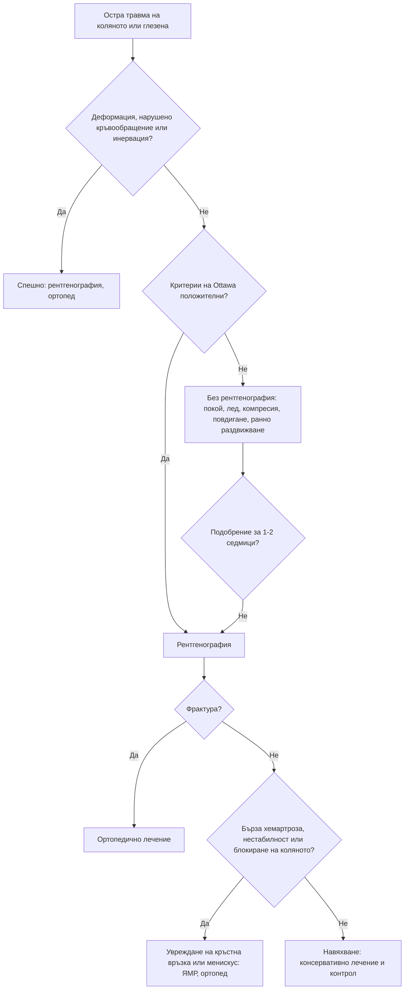

# Глава 53. Регионална болка: лакът, китка, тазобедрена става, коляно, глезен и стъпало

> **Част X. Опорно-двигателен апарат**

## Цели на главата

- Да се познават най-честите и най-опасните причини за болка във всяка анатомична област.
- Да се прилагат правилата на Ottawa за коляното и глезена.
- Да се разпознават често пропусканите травми: фрактура на скафоидната кост, окултна фрактура на шийката на бедрената кост, руптура на ахилесовото сухожилие, задна луксация на рамото (вж. глава 50).
- Да се разпознават спешните състояния на ръката и стъпалото: гноен теносиновит, „ухапване при бой“, диабетно стъпало, невроартропатия на Charcot, компартмент синдром.
- Да се разпознава отразената болка (от тазобедрената става към коляното, от гръбначния стълб към тазобедрената става) при преглед.

## Ключови моменти

- Правилата на Ottawa за коляното и глезена практически изключват фрактура при отрицателен резултат и спестяват ненужни рентгенографии *(SORT A [3, 4])*.
- Болезненост в анатомичната табакера след падане на изпъната ръка е фрактура на скафоидната кост до доказване на противното. NICE препоръчва ЯМР като първо изследване *(SORT B [1])*.
- Възрастен човек с болка в тазобедрената става след падане може да има фрактура, дори ако ходи. При нормална рентгенография се прави ЯМР *(SORT B [2])*.
- Топло, подуто стъпало при диабетик с невропатия е остра невроартропатия на Charcot до доказване на противното. Нужни са разтоварване и насочване до 1 работен ден *(SORT C [7])*.
- Гнойният флексорен теносиновит и „ухапването при бой“ са спешни хирургични състояния.
- Болката в коляното при дете може да идва от тазобедрената става. Винаги се преглежда и тазобедрената става.

---

## 1. Общи червени флагове при регионална болка

- Травма с **деформация** или **невъзможност за натоварване**.
- **Гореща подута става** или треска (септичен артрит, остеомиелит).
- **Нощна болка** и болка в покой, загуба на тегло (тумор, метастази).
- **Нарушено кръвообращение или инервация** на крайника.
- Болка, непропорционална на находката, и болка при пасивно разтягане (**компартмент синдром**).
- Диабет с рана, оток или затопляне на стъпалото.
- Падане на възрастен човек с болка в тазобедрената става (**окултна фрактура**).
- Дете с накуцване или болка в коляното (патология на тазобедрената става — вж. глава 72).

---

## 2. Лакът

*Таблица 53.1. Лакът.*

| Заболяване | Ключови белези |
|---|---|
| **Латерален епикондилит** („тенис лакът“) | Болезненост на латералния епикондил, болка при екстензия на китката срещу съпротива, повтарящи се движения |
| **Медиален епикондилит** („голф лакът“) | Болезненост на медиалния епикондил, болка при флексия на китката срещу съпротива |
| **Олекранонов бурсит** | Оток над олекранона; **септичен** (зачервяване, затопляне, рана), подагрозен или асептичен — при съмнение за инфекция пункция |
| **Синдром на кубиталния тунел** | Изтръпване на IV и V пръст (вж. глава 47) |
| **Руптура на дисталното сухожилие на бицепса** | Мъже при вдигане на тежест; изпъкване на мускула, **положителен „hook“ тест** |
| **Фрактура на главичката на радиуса** | Падане на изпъната ръка, болка при супинация, излив (белег на „мастната възглавничка“ на рентгенографията) |
| **Сублуксация на главичката на радиуса** („дръпнат лакът“) | Деца на 1–4 години, след дърпане за ръката; детето не използва ръката |
| **Отразена болка** | Шийна радикулопатия |

---

## 3. Китка и длан

*Таблица 53.2. Китка и длан.*

| Заболяване | Ключови белези |
|---|---|
| **Синдром на карпалния тунел** | Нощни парестезии в първите 3,5 пръста (вж. глава 47) |
| **Теносиновит на de Quervain** | Болка по радиалната страна на китката, **положителен тест на Finkelstein**; млади майки (повдигане на бебето) |
| **Фрактура на скафоидната кост** | Падане на изпъната ръка; **болезненост в анатомичната табакера**. **Първоначалната рентгенография често е нормална.** Необходими са имобилизация и ЯМР (NICE я препоръчва като първо образно изследване) или повторна рентгенография след 10–14 дни, защото рискът от **аваскуларна некроза** и незарастване е висок [1] |
| **Ганглион** | Мек, гладък оток по гърба или вътрешната страна на китката, светещ при трансилюминация |
| **„Щракащ пръст“** (стенозиращ теносиновит) | Щракане и блокиране на пръста при сгъване; диабет, ревматоиден артрит |
| **Контрактура на Dupuytren** | Възли и въжета в дланта, флексионна контрактура на IV и V пръст; алкохол, диабет, чернодробно заболяване, фамилна анамнеза |
| **Остеоартроза** | Първа карпометакарпална става, дистални и проксимални интерфалангеални стави |
| **Възпалителни артрити** | Ревматоиден (метакарпофалангеални стави, китки), псориатичен (дистални интерфалангеални стави, дактилит), подагра |
| **Гноен флексорен теносиновит** | **Белези на Kanavel:** вретеновиден оток на пръста, свито положение, **болка при пасивна екстензия**, болезненост по хода на сухожилната обвивка. **Спешно хирургично състояние** |
| **„Ухапване при бой“** | Рана над метакарпофалангеалната става след удар в зъби — **висок риск от септичен артрит**; спешна хирургична оценка |
| **Паронихия, панарициум** | Инфекция около нокътя или на пулпата на пръста |
| **Болест на Kienböck** | Остеонекроза на лунатната кост; болка по гърба на китката |
| **Синдром на вибрациите** | Феномен на Raynaud, изтръпване; работа с вибриращи инструменти |

---

## 4. Тазобедрена става

**Локализацията на болката насочва към източника:**

- **в слабините** — вътреставна патология;
- **латерално** — голям трохантер и седалищни сухожилия;
- **отзад, в седалището** — гръбначен стълб, сакроилиачна става, седалищни мускули.

*Таблица 53.3. Тазобедрена става.*

| Заболяване | Ключови белези |
|---|---|
| **Остеоартроза** | Възрастни хора; болка в слабините, **ограничена вътрешна ротация**, скованост |
| **Окултна фрактура на шийката на бедрената кост** | **Възрастен човек след падане**; болка в слабините или бедрото, болка при натоварване. **Пациентът може да ходи**, а рентгенографията може да е нормална — **ЯМР**, а ако тя не е достъпна до 24 часа — КТ [2] |
| **Стрес фрактура на шийката** | Бегачи, остеопороза, жени с хранителни разстройства |
| **Аваскуларна некроза на главата на бедрената кост** | **Кортикостероиди**, **алкохол**, сърповидноклетъчна болест, травма, декомпресионна болест; болка в слабините, в началото с нормална рентгенография — ЯМР |
| **Септичен артрит** | Треска, силна болка, невъзможност за движение |
| **Разкъсване на лабрума, фемороацетабуларен импинджмънт** | Млади активни хора; болка в слабините, щракане, положителен тест FADIR |
| **Синдром на болката в големия трохантер** (тендинопатия на седалищните мускули) | **Латерална** болка, болезненост над трохантера, болка при лягане на засегнатата страна; жени на средна възраст |
| **Мералгия парестетика** | Изтръпване по латералната страна на бедрото (вж. глава 47) |
| **Ингвинална и феморална херния** | Оток в слабините, болка при напъване; **феморалната херния при възрастни жени лесно се пропуска и често се инкарцерира** |
| **Отразена болка** | Лумбална радикулопатия (L2–L3), сакроилиачна става, спинална стеноза; **аневризма на илиачната артерия**, **абсцес на m. psoas**, гинекологични и бъбречни заболявания |
| **Системни** | **Ревматична полимиалгия** (двустранно), костни метастази, миелом, спондилоартрит, преходна остеопороза на тазобедрената става (при бременност) |

---

## 5. Коляно

### 5.1. Остра травма

*Таблица 53.4. Коляно: остра травма.*

| Увреждане | Механизъм и белези | Изследване |
|---|---|---|
| **Скъсване на предната кръстна връзка** | Завъртане с фиксирано стъпало, „пукане“, **бърза хемартроза (в рамките на часове)**, нестабилност | **Тест на Lachman**, ЯМР |
| **Увреждане на менискус** | Усукване, **оток на следващия ден**, **блокиране**, болезненост по ставната цепка | Тест на McMurray, ЯМР |
| **Увреждане на колатералните връзки** | Валгусна или варусна травма; болезненост по хода на връзката | Тестове с натоварване във валгус и варус |
| **Луксация на пателата** | Млади жени, латерална луксация при завъртане | Рентгенография |
| **Фрактури** (тибиално плато, пателата) | Директна травма, падане | Рентгенография по правилото на Ottawa |

**Правило на Ottawa за коляното** (чувствителност около 98,5% за фрактура) [3]. Рентгенография е показана при **поне един** от следните белези:

- възраст ≥ 55 години;
- **изолирана болезненост на пателата**;
- **болезненост на главичката на фибулата**;
- **невъзможност за флексия до 90°**;
- **невъзможност за натоварване** (4 стъпки) веднага след травмата и при прегледа.

### 5.2. Нетравматична болка в коляното

*Таблица 53.5. Нетравматична болка в коляното.*

| Заболяване | Ключови белези |
|---|---|
| **Гонартроза** | Възрастни хора; медиален компартмент, крепитации, варусна деформация, кратка скованост |
| **Пателофеморален болков синдром** | **Предна** болка при слизане по стълби, клякане и **продължително седене** („белегът на киното“); юноши и млади жени |
| **Тендинопатия на пателарното сухожилие** | Спортове със скачане; болка под пателата |
| **Болест на Osgood-Schlatter** | Юноши, болезнена издутина на тибиалната тубероза |
| **Синдром на илиотибиалния тракт** | Бегачи; **латерална** болка |
| **Бурсит на гъшия крак (pes anserinus)** | **Медиална** болка под ставната цепка; жени с наднормено тегло и гонартроза |
| **Препателарен бурсит** | Оток пред пателата; професии с коленичене; може да е септичен |
| **Киста на Baker** | Оток в подколенната ямка; **руптурата имитира тромбоза на дълбоките вени** |
| **Кристални и възпалителни артрити, септичен артрит** | Вж. глави 51 и 52 |
| **Остеонекроза** | Възрастни жени, внезапна медиална болка |
| **Тумори** | **Остеосарком около коляното при юноши** — нощна болка, оток |
| **Отразена болка от тазобедрената става** | **Деца с епифизиолиза на главата на бедрената кост** или с болест на Perthes често се оплакват само от **болка в коляното**; при възрастни — коксартроза |

---

## 6. Глезен и стъпало

### 6.1. Правила на Ottawa

Правилата се прилагат при хора над 5 години [1]. Отрицателният резултат практически изключва фрактура (LR– около 0,08) [4].

**Рентгенография на глезена** е показана при болка в **малеоларната зона** и поне едно от следните:

- болезненост по **задния ръб или върха** на латералния малеол (дисталните 6 cm);
- болезненост по **задния ръб или върха** на медиалния малеол (дисталните 6 cm);
- **невъзможност за натоварване** (4 стъпки) веднага и при прегледа.

**Рентгенография на стъпалото** е показана при болка в **средната част на стъпалото** и поне едно от следните:

- болезненост на **основата на V метатарзална кост**;
- болезненост на **навикуларната кост**;
- невъзможност за натоварване.

### 6.2. Причини

*Таблица 53.6. Глезен и стъпало: причини.*

| Заболяване | Ключови белези |
|---|---|
| **Навяхване на глезена** | Инверсия, болка и оток латерално; правила на Ottawa |
| **Увреждане на синдесмозата** („високо навяхване“) | Болка над глезена, болка при външна ротация на стъпалото |
| **Тендинопатия на ахилесовото сухожилие** | Сутрешна скованост и болка в сухожилието; **флуорохинолони** [5]; спондилоартрит (ентезит) |
| **Руптура на ахилесовото сухожилие** | Внезапно усещане за „ритник“ в прасеца при спринт или отскок; **положителен тест на Thompson/Simmonds** (при стискане на прасеца стъпалото не се флектира плантарно); **често се пропуска** — пациентът все още може да ходи и слабо да флектира стъпалото с другите мускули |
| **Плантарен фасциит** | Болка в петата **при първите стъпки сутрин** и след почивка, болезненост в медиалния калканеален туберкул |
| **Стрес фрактура** | Метатарзалните кости („маршова фрактура“), калканеус; постепенна болка при натоварване |
| **Неврином на Morton** | Пареща болка и изтръпване между III и IV пръст, белег на Mulder |
| **Hallux valgus, hallux rigidus**, метатарзалгия | Деформации, болка при ходене |
| **Подагра** | Първа метатарзофалангеална става |
| **Диабетно стъпало** | Язва, инфекция, **остеомиелит** (ако при сондиране на язвата се стига до кост, вероятността за остеомиелит е висока [6]; нормалните CRP, рентгенография и сондиране обаче не го изключват [7]); често без болка поради невропатията |
| **Невроартропатия на Charcot** | Диабетик с невропатия, **топло, подуто, зачервено стъпало**, често **без болка**, без рана; имитира целулит, подагра и тромбоза. **Разтоварване** до окончателното лечение и насочване до 1 работен ден [7] |
| **Синдром на тарзалния тунел** | Парестезии по ходилото |
| **Периферна артериална болест** | Болка в покой, бледост, липсващи пулсации (вж. глава 14) |
| **Спондилоартрит** | Ентезит на ахилесовото сухожилие и плантарната фасция, дактилит |
| **Компартмент синдром** | Силна болка след травма, болка при пасивно разтягане — спешно |

---

## 7. Безопасна диагностична стратегия

*Таблица 53.7. Безопасна диагностична стратегия.*

| Въпрос | Отговор |
|---|---|
| **Вероятна диагноза** | Тендинопатии, бурсити, навяхвания, остеоартроза, плантарен фасциит, епикондилит |
| **Сериозни заболявания, които не бива да се пропускат** | **Фрактури** (включително окултни), **септичен артрит**, **гноен теносиновит**, „ухапване при бой“, **остеомиелит**, **невроартропатия на Charcot**, **компартмент синдром**, **тумори** (остеосарком, метастази), **аваскуларна некроза**, **руптура на ахилесовото сухожилие**, **инкарцерирана феморална херния** |
| **Чести капани** | Фрактура на скафоидната кост с нормална рентгенография; окултна фрактура на шийката на бедрената кост; отразена болка от тазобедрената става в коляното (особено при деца); руптура на киста на Baker, приета за тромбоза; флуорохинолони и сухожилни увреждания; невроартропатия на Charcot, приета за целулит |
| **Маскиращи заболявания** | Захарен диабет, гръбначна дисфункция, остеопороза, кортикостероиди |
| **Психосоциални аспекти** | Професионално претоварване, спорт, насилие (фрактури при деца и възрастни хора) |

---

## 8. Диагностичен алгоритъм при остра травма на коляното и глезена

*Фигура 53.1. Диагностичен алгоритъм при остра травма на коляното и глезена. Схема на авторите въз основа на източниците, цитирани в главата.*

Текстово описание на фигура 53.1

1. Остра травма на коляното или глезена. Следва: към т. 2.
2. **Въпрос:** Деформация, нарушено кръвообращение или инервация? Да — към т. 3; Не — към т. 4.
3. Спешно: рентгенография, ортопед.
4. **Въпрос:** Критерии на Ottawa положителни? Да — към т. 5; Не — към т. 6.
5. Рентгенография. Следва: към т. 7.
6. Без рентгенография: покой, лед, компресия, повдигане, ранно раздвижване. Следва: към т. 8.
7. **Въпрос:** Фрактура? Да — към т. 9; Не — към т. 10.
8. **Въпрос:** Подобрение за 1-2 седмици? Не — към т. 5.
9. Ортопедично лечение.
10. **Въпрос:** Бърза хемартроза, нестабилност или блокиране на коляното? Да — към т. 11; Не — към т. 12.
11. Увреждане на кръстна връзка или менискус: ЯМР, ортопед.
12. Навяхване: консервативно лечение и контрол.

---

## 9. Кога и колко спешно да насочим

*Таблица 53.8. Кога и колко спешно да насочим.*

| Спешност | Клинична ситуация |
|---|---|
| **Незабавно (112 или спешно отделение)** | Открита фрактура, деформация, нарушено кръвообращение или инервация; компартмент синдром; гноен флексорен теносиновит; „ухапване при бой“; септичен артрит; диабетно стъпало с треска, сепсис, исхемия, дълбока инфекция или гангрена [7] |
| **В същия ден** | Подозрение за фрактура на шийката на бедрената кост или на скафоидната кост [1, 2]; руптура на ахилесовото сухожилие; дете или юноша с накуцване и болка в коляното или тазобедрената става; подозрение за остра невроартропатия на Charcot — до 1 работен ден [7] |
| **Бързо (до 2 седмици)** | Нощна болка около коляното при юноша (рентгенография за костен тумор); блокиране на коляното след травма |
| **Планово** | Нестабилност на коляното след травма; контрактура на Dupuytren с функционално ограничение; синдром на карпалния тунел без ефект от лечението; болезнен hallux valgus |
| **Проследяване в общата практика** | Епикондилит, теносиновит на de Quervain, плантарен фасциит, навяхване на глезена без критерии на Ottawa, синдром на болката в големия трохантер |

---

## 10. Клинични перли

- Болезненост в анатомичната табакера след падане на изпъната ръка означава фрактура на скафоидната кост, докато не се докаже противното, дори при нормална рентгенография.
- Възрастен човек, който е паднал и има болка в тазобедрената става, може да има фрактура на шийката, дори ако ходи. При нормална рентгенография направете ЯМР.
- Болката в коляното при дете или юноша може да идва от тазобедрената става. Винаги прегледайте тазобедрената става.
- Рана над кокалчетата след удар в лицето на друг човек: „ухапване при бой“. Необходима е хирургична ревизия.
- Болка при пасивно разгъване на подут пръст: гноен флексорен теносиновит. Спешно състояние.
- Топло, подуто, неболезнено стъпало при диабетик с невропатия: невроартропатия на Charcot. Не го приемайте за целулит или подагра.
- Пациент, който „може да ходи“ след травма на ахилесовото сухожилие, може да има руптура. Направете теста на Thompson.
- Флуорохинолоните повишават риска от тендинопатия и руптура на сухожилията, особено при възрастни хора и при съпътстващо лечение с кортикостероиди.
- Нощната болка около коляното при юноша изисква рентгенография за изключване на костен тумор.

---

## 11. Клиничен случай

**Етап 1 — представяне.** Мъж на 58 години с диабет тип 2 от 15 години и изразена периферна невропатия идва заради подуто, зачервено и топло дясно стъпало от 10 дни. Болката е минимална. Не помни травма. Няма треска и рана. Предписан му е антибиотик за „целулит“ без ефект.

> **Въпрос 1.** Коя диагноза трябва да се има предвид, освен целулит?

**Етап 2 — преглед и изследвания.** Дясното стъпало е с 3 °C по-топло от лявото и е подуто в средната част. Пулсациите са запазени. Сетивността е силно нарушена до средата на подбедрицата. CRP е 9 mg/l, левкоцитите са нормални. Рентгенографията е без отклонения.

> **Въпрос 2.** Коя е най-вероятната диагноза?

> **Въпрос 3.** Какво е поведението и колко спешно е насочването?

Обсъждане и отговори

**Отговор 1.** **Остра невроартропатия на Charcot.** Тя имитира целулит, подагра и тромбоза и трябва да се подозира дори без деформация и болка [7].

**Отговор 2.** Топло, подуто, **относително неболезнено** стъпало при тежка **диабетна невропатия**, без рана, без треска и с почти нормален CRP, е силно подозрително за **остра невроартропатия на Charcot**. Температурната разлика над 2 °C спрямо другото стъпало е важен белег. Ранната рентгенография често е нормална. ЯМР показва оток на костния мозък и микрофрактури в тарзалните кости.

**Отговор 3.** **Разтоварване** веднага (без натоварване до окончателното лечение) и насочване към екип за диабетно стъпало **до 1 работен ден** [7]. Разтоварването с контактна гипсова превръзка или ботуш предотвратява колапса на свода и деформацията тип „люлеещ се стол“, която води до язви и ампутации.

**Поука.** При диабетик с невропатия топлото подуто стъпало без рана е Charcot, докато не се докаже противното. Всяка седмица забавяне влошава прогнозата.

---

## Обобщение

- Регионалната болка най-често се дължи на тендинопатии, бурсити, навяхвания и остеоартроза, но всяка област има свои опасни причини.
- Правилата на Ottawa определят кога е нужна рентгенография при травма на коляното, глезена и стъпалото.
- Често пропускани са фрактурата на скафоидната кост, окултната фрактура на шийката на бедрената кост и руптурата на ахилесовото сухожилие. Нормалната рентгенография не ги изключва.
- Гнойният теносиновит, „ухапването при бой“, компартмент синдромът, диабетното стъпало и невроартропатията на Charcot изискват спешни действия.

## Самопроверка

### Въпроси с един верен отговор

**1.** *(основно ниво)* Жена на 28 години е навехнала глезена си при инверсия. Може да направи 4 стъпки. Болезнеността е само пред латералния малеол, без болезненост по задния му ръб и върха, по медиалния малеол, основата на V метатарзална кост и навикуларната кост. Нужна ли е рентгенография?

- **А.** Да, при всяко навяхване
- **Б.** Не — правилата на Ottawa са отрицателни
- **В.** Да, на стъпалото
- **Г.** Нужна е ЯМР
- **Д.** Нужна е КТ

Отговор и обосновка

**Верен отговор: Б.** Отрицателните правила на Ottawa практически изключват фрактура [4]. Лечението е консервативно с ранно раздвижване.

**2.** *(основно ниво)* Мъж на 22 години е паднал на изпъната ръка. Има болезненост в анатомичната табакера, а рентгенографията на китката е нормална. Кое е правилното поведение?

- **А.** Успокояване и без имобилизация
- **Б.** Имобилизация и ЯМР
- **В.** Само НСПВС
- **Г.** Физиотерапия
- **Д.** Контрол след 3 месеца

Отговор и обосновка

**Верен отговор: Б.** Фрактурата на скафоидната кост често не се вижда на първата рентгенография. NICE препоръчва ЯМР [1]. Пропуснатата фрактура води до незарастване и аваскуларна некроза.

**3.** *(основно ниво)* Жена на 81 години е паднала и има болка в слабините. Може да ходи трудно. Рентгенографията на тазобедрената става е нормална. Кое е правилното поведение?

- **А.** Обезболяване и раздвижване у дома
- **Б.** ЯМР, а ако не е достъпна до 24 часа — КТ
- **В.** Повторна рентгенография след месец
- **Г.** Денситометрия
- **Д.** Физиотерапия

Отговор и обосновка

**Верен отговор: Б.** При подозрение за фрактура на шийката на бедрената кост с нормална рентгенография се прави ЯМР [2]. Способността за ходене не изключва фрактура.

**4.** *(напреднало ниво)* Мъж на 35 години усеща „ритник“ в прасеца по време на игра на скуош. Може да ходи, но слабо. При стискане на прасеца в легнало положение по корем стъпалото не се флектира плантарно. Коя е диагнозата?

- **А.** Разкъсване на медиалния гастрокнемиус
- **Б.** Руптура на ахилесовото сухожилие
- **В.** Тромбоза на дълбоките вени
- **Г.** Руптура на киста на Baker
- **Д.** Тендинопатия на ахилесовото сухожилие

Отговор и обосновка

**Верен отговор: Б.** Положителният тест на Thompson показва руптура на ахилесовото сухожилие. Способността за ходене не я изключва. Пациентът се насочва в същия ден.

**5.** *(напреднало ниво)* Мъж на 60 години с диабет и невропатия има язва под главата на първата метатарзална кост от 2 месеца. При сондиране се стига до кост. Рентгенографията и CRP са нормални. Как ще тълкувате находката?

- **А.** Остеомиелитът е изключен
- **Б.** Остеомиелитът е вероятен — нужна е ЯМР
- **В.** Нужни са само превръзки
- **Г.** Язвата е чисто исхемична
- **Д.** Нужна е само смяна на обувките

Отговор и обосновка

**Верен отговор: Б.** Положителният тест със сонда до кост прави остеомиелита вероятен [6]. Нормалните CRP и рентгенография не го изключват, а следващото изследване е ЯМР [7].

### Задача

Момче на 13 години с наднормено тегло куца от 3 седмици и се оплаква от болка в лявото коляно. Прегледът на коляното е нормален. Как ще подходите?

Решение

При дете или юноша с болка в коляното и накуцване винаги се преглежда **тазобедрената става**. Ограничената вътрешна ротация и принудителната външна ротация при флексия насочват към **епифизиолиза на главата на бедрената кост**. Тя е честа при юноши с наднормено тегло. Пациентът се насочва в същия ден за рентгенография на тазобедрените стави (предно-задна и странична проекция „жаба“) и ортопедична оценка. До тогава се избягва натоварването. Забавената диагноза води до изместване и аваскуларна некроза (вж. глава 72).

### OSCE станция: Правила на Ottawa при травма на глезена

**Време:** 6 минути. **Ниво:** основно (студенти, специализанти).

**Задача за кандидата.** Жена на 35 години е навехнала глезена си при слизане по стълби преди 2 часа. Прегледайте я и решете дали е нужна рентгенография.

**Информация за симулирания пациент (за изпитващия).** Направи 4 стъпки с накуцване. Има болезненост по задния ръб на латералния малеол 3 cm над върха му. Основата на V метатарзална кост и навикуларната кост не са болезнени.

*Таблица 53.9. OSCE станция: Правила на Ottawa при травма на глезена — рубрика за оценяване.*

| Критерий | Точки |
|---|---|
| Пита за механизма и за способността за натоварване веднага след травмата | 1 |
| Палпира задния ръб и върха на латералния и на медиалния малеол (дисталните 6 cm) | 2 |
| Палпира основата на V метатарзална кост и навикуларната кост | 2 |
| Проверява способността за 4 стъпки | 1 |
| Проверява кръвообращението и сетивността на стъпалото | 1 |
| Заключава правилно, че е нужна рентгенография на глезена | 2 |
| Обяснява на пациентката причината | 1 |
| **Общо** | **10** |

**Праг за успешно представяне:** 7 от 10 точки, включително палпацията и правилното заключение.

## Литература

1. National Institute for Health and Care Excellence. Fractures (non-complex): assessment and management (NICE guideline NG38). London: NICE; 2016. Достъпно на: https://www.nice.org.uk/guidance/ng38
2. National Institute for Health and Care Excellence. Hip fracture: management (Clinical guideline CG124). London: NICE; 2011 [актуализирано 2023]. Достъпно на: https://www.nice.org.uk/guidance/cg124
3. Bachmann LM, Haberzeth S, Steurer J, ter Riet G. The accuracy of the Ottawa knee rule to rule out knee fractures: a systematic review. Ann Intern Med. 2004;140(2):121-4. doi:10.7326/0003-4819-140-5-200403020-00013. PMID: 14734335.
4. Bachmann LM, Kolb E, Koller MT, Steurer J, ter Riet G. Accuracy of Ottawa ankle rules to exclude fractures of the ankle and mid-foot: systematic review. BMJ. 2003;326(7386):417. doi:10.1136/bmj.326.7386.417. PMID: 12595378.
5. van der Linden PD, Sturkenboom MC, Herings RM, Leufkens HG, Stricker BH. Fluoroquinolones and risk of Achilles tendon disorders: case-control study. BMJ. 2002;324(7349):1306-7. doi:10.1136/bmj.324.7349.1306. PMID: 12039823.
6. Lam K, van Asten SA, Nguyen T, La Fontaine J, Lavery LA. Diagnostic Accuracy of Probe to Bone to Detect Osteomyelitis in the Diabetic Foot: A Systematic Review. Clin Infect Dis. 2016;63(7):944-8. doi:10.1093/cid/ciw445. PMID: 27369321.
7. National Institute for Health and Care Excellence. Diabetic foot problems: prevention and management (NICE guideline NG19). London: NICE; 2015 [актуализирано 2019]. Достъпно на: https://www.nice.org.uk/guidance/ng19

*Последна проверка на съдържанието: септември 2026 г. Следващ планиран преглед: септември 2027 г. (вж. „Политика за актуализация“ в README).*

<!-- навигация -->

---

[← Глава 52. Полиартрит и системни заболявания на съединителната тъкан](52-poliartrit.md) · [Съдържание](../README.md) · [Глава 54. Генерализирана мускулно-скелетна болка →](54-generalizirana-bolka.md)
