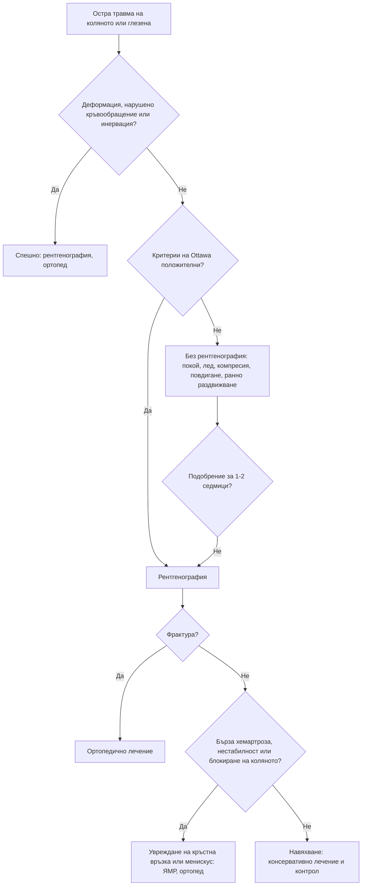

# Глава 53. Регионална болка: лакът, китка, тазобедрена става, коляно, глезен и стъпало

> **Част X. Опорно-двигателен апарат**

## Цели на главата

- Да се познават най-честите и най-опасните причини за болка във всяка анатомична област.
- Да се прилагат правилата на Ottawa за коляното и глезена.
- Да се разпознават често пропусканите травми: фрактура на скафоидната кост, окултна фрактура на шийката на бедрената кост, руптура на ахилесовото сухожилие, задна луксация на рамото (вж. глава 50).
- Да се разпознават спешните състояния на ръката и стъпалото: гноен теносиновит, „ухапване при бой“, диабетно стъпало, невроартропатия на Charcot, компартмент синдром.
- Да се помни отразената болка: тазобедрена става към коляното, гръбначен стълб към тазобедрената става.

---

## 1. Общи червени флагове при регионална болка

- Травма с **деформация** или **невъзможност за натоварване**.
- **Гореща подута става** или треска (септичен артрит, остеомиелит).
- **Нощна болка** и болка в покой, загуба на тегло (тумор, метастази).
- **Нарушено кръвообращение или инервация** на крайника.
- Болка, непропорционална на находката, и болка при пасивно разтягане (**компартмент синдром**).
- Диабет с рана, оток или затопляне на стъпалото.
- Падане на възрастен човек с болка в тазобедрената става (**окултна фрактура**).
- Дете с накуцване или болка в коляното (патология на тазобедрената става — вж. глава 72).

---

## 2. Лакът

| Заболяване | Ключови белези |
|---|---|
| **Латерален епикондилит** („тенис лакът“) | Болезненост на латералния епикондил, болка при екстензия на китката срещу съпротива, повтарящи се движения |
| **Медиален епикондилит** („голф лакът“) | Болезненост на медиалния епикондил, болка при флексия на китката срещу съпротива |
| **Олекранонов бурсит** | Оток над олекранона; **септичен** (зачервяване, затопляне, рана), подагрозен или асептичен — при съмнение за инфекция пункция |
| **Синдром на кубиталния тунел** | Изтръпване на IV и V пръст (вж. глава 47) |
| **Руптура на дисталното сухожилие на бицепса** | Мъже при вдигане на тежест; изпъкване на мускула, **положителен „hook“ тест** |
| **Фрактура на главичката на радиуса** | Падане на изпъната ръка, болка при супинация, излив (белег на „мастната възглавничка“ на рентгенографията) |
| **Сублуксация на главичката на радиуса** („дръпнат лакът“) | Деца на 1–4 години, след дърпане за ръката; детето не използва ръката |
| **Отразена болка** | Шийна радикулопатия |

---

## 3. Китка и длан

| Заболяване | Ключови белези |
|---|---|
| **Синдром на карпалния тунел** | Нощни парестезии в първите 3,5 пръста (вж. глава 47) |
| **Теносиновит на de Quervain** | Болка по радиалната страна на китката, **положителен тест на Finkelstein**; млади майки (повдигане на бебето) |
| **Фрактура на скафоидната кост** | Падане на изпъната ръка; **болезненост в анатомичната табакера**. **Първоначалната рентгенография често е нормална.** Необходими са имобилизация и повторна рентгенография след 10–14 дни или ЯМР, защото рискът от **аваскуларна некроза** и незарастване е висок |
| **Ганглион** | Мек, гладък оток по гърба или вътрешната страна на китката, светещ при трансилюминация |
| **„Щракащ пръст“** (стенозиращ теносиновит) | Щракане и блокиране на пръста при сгъване; диабет, ревматоиден артрит |
| **Контрактура на Dupuytren** | Възли и въжета в дланта, флексионна контрактура на IV и V пръст; алкохол, диабет, чернодробно заболяване, фамилна анамнеза |
| **Остеоартроза** | Първа карпометакарпална става, дистални и проксимални интерфалангеални стави |
| **Възпалителни артрити** | Ревматоиден (метакарпофалангеални стави, китки), псориатичен (дистални интерфалангеални стави, дактилит), подагра |
| **Гноен флексорен теносиновит** | **Белези на Kanavel:** вретеновиден оток на пръста, свито положение, **болка при пасивна екстензия**, болезненост по хода на сухожилната обвивка. **Спешно хирургично състояние** |
| **„Ухапване при бой“** | Рана над метакарпофалангеалната става след удар в зъби — **висок риск от септичен артрит**; спешна хирургична оценка |
| **Паронихия, панарициум** | Инфекция около нокътя или на пулпата на пръста |
| **Болест на Kienböck** | Остеонекроза на лунатната кост; болка по гърба на китката |
| **Синдром на вибрациите** | Феномен на Raynaud, изтръпване; работа с вибриращи инструменти |

---

## 4. Тазобедрена става

**Локализацията на болката насочва към източника:**

- **в слабините** — вътреставна патология;
- **латерално** — голям трохантер и седалищни сухожилия;
- **отзад, в седалището** — гръбначен стълб, сакроилиачна става, седалищни мускули.

| Заболяване | Ключови белези |
|---|---|
| **Остеоартроза** | Възрастни хора; болка в слабините, **ограничена вътрешна ротация**, скованост |
| **Окултна фрактура на шийката на бедрената кост** | **Възрастен човек след падане**; болка в слабините или бедрото, болка при натоварване. **Пациентът може да ходи**, а рентгенографията може да е нормална — **ЯМР** (или КТ) |
| **Стрес фрактура на шийката** | Бегачи, остеопороза, жени с хранителни разстройства |
| **Аваскуларна некроза на главата на бедрената кост** | **Кортикостероиди**, **алкохол**, сърповидноклетъчна болест, травма, декомпресионна болест; болка в слабините, в началото с нормална рентгенография — ЯМР |
| **Септичен артрит** | Треска, силна болка, невъзможност за движение |
| **Разкъсване на лабрума, фемороацетабуларен импинджмънт** | Млади активни хора; болка в слабините, щракане, положителен тест FADIR |
| **Синдром на болката в големия трохантер** (тендинопатия на седалищните мускули) | **Латерална** болка, болезненост над трохантера, болка при лягане на засегнатата страна; жени на средна възраст |
| **Мералгия парестетика** | Изтръпване по латералната страна на бедрото (вж. глава 47) |
| **Ингвинална и феморална херния** | Оток в слабините, болка при напъване; **феморалната херния при възрастни жени лесно се пропуска и често се инкарцерира** |
| **Отразена болка** | Лумбална радикулопатия (L2–L3), сакроилиачна става, спинална стеноза; **аневризма на илиачната артерия**, **абсцес на m. psoas**, гинекологични и бъбречни заболявания |
| **Системни** | **Ревматична полимиалгия** (двустранно), костни метастази, миелом, спондилоартрит, преходна остеопороза на тазобедрената става (при бременност) |

---

## 5. Коляно

### 5.1. Остра травма

| Увреждане | Механизъм и белези | Изследване |
|---|---|---|
| **Скъсване на предната кръстна връзка** | Завъртане с фиксирано стъпало, „пукане“, **бърза хемартроза (в рамките на часове)**, нестабилност | **Тест на Lachman**, ЯМР |
| **Увреждане на менискус** | Усукване, **оток на следващия ден**, **блокиране**, болезненост по ставната цепка | Тест на McMurray, ЯМР |
| **Увреждане на колатералните връзки** | Валгусна или варусна травма; болезненост по хода на връзката | Тестове с натоварване във валгус и варус |
| **Луксация на пателата** | Млади жени, латерална луксация при завъртане | Рентгенография |
| **Фрактури** (тибиално плато, пателата) | Директна травма, падане | Рентгенография по правилото на Ottawa |

**Правило на Ottawa за коляното.** Рентгенография е показана при **поне един** от следните белези:

- възраст ≥ 55 години;
- **изолирана болезненост на пателата**;
- **болезненост на главичката на фибулата**;
- **невъзможност за флексия до 90°**;
- **невъзможност за натоварване** (4 стъпки) веднага след травмата и при прегледа.

### 5.2. Нетравматична болка в коляното

| Заболяване | Ключови белези |
|---|---|
| **Гонартроза** | Възрастни хора; медиален компартмент, крепитации, варусна деформация, кратка скованост |
| **Пателофеморален болков синдром** | **Предна** болка при слизане по стълби, клякане и **продължително седене** („белегът на киното“); юноши и млади жени |
| **Тендинопатия на пателарното сухожилие** | Спортове със скачане; болка под пателата |
| **Болест на Osgood-Schlatter** | Юноши, болезнена издутина на тибиалната тубероза |
| **Синдром на илиотибиалния тракт** | Бегачи; **латерална** болка |
| **Бурсит на гъшия крак (pes anserinus)** | **Медиална** болка под ставната цепка; жени с наднормено тегло и гонартроза |
| **Препателарен бурсит** | Оток пред пателата; професии с коленичене; може да е септичен |
| **Киста на Baker** | Оток в подколенната ямка; **руптурата имитира тромбоза на дълбоките вени** |
| **Кристални и възпалителни артрити, септичен артрит** | Вж. глави 51 и 52 |
| **Остеонекроза** | Възрастни жени, внезапна медиална болка |
| **Тумори** | **Остеосарком около коляното при юноши** — нощна болка, оток |
| **Отразена болка от тазобедрената става** | **Деца с епифизиолиза на главата на бедрената кост** или с болест на Perthes често се оплакват само от **болка в коляното**; при възрастни — коксартроза |

---

## 6. Глезен и стъпало

### 6.1. Правила на Ottawa

**Рентгенография на глезена** е показана при болка в **малеоларната зона** и поне едно от следните:

- болезненост по **задния ръб или върха** на латералния малеол (дисталните 6 cm);
- болезненост по **задния ръб или върха** на медиалния малеол (дисталните 6 cm);
- **невъзможност за натоварване** (4 стъпки) веднага и при прегледа.

**Рентгенография на стъпалото** е показана при болка в **средната част на стъпалото** и поне едно от следните:

- болезненост на **основата на V метатарзална кост**;
- болезненост на **навикуларната кост**;
- невъзможност за натоварване.

### 6.2. Причини

| Заболяване | Ключови белези |
|---|---|
| **Навяхване на глезена** | Инверсия, болка и оток латерално; правила на Ottawa |
| **Увреждане на синдесмозата** („високо навяхване“) | Болка над глезена, болка при външна ротация на стъпалото |
| **Тендинопатия на ахилесовото сухожилие** | Сутрешна скованост и болка в сухожилието; **флуорохинолони**; спондилоартрит (ентезит) |
| **Руптура на ахилесовото сухожилие** | Внезапно усещане за „ритник“ в прасеца при спринт или отскок; **положителен тест на Thompson/Simmonds** (при стискане на прасеца стъпалото не се флектира плантарно); **често се пропуска** — пациентът все още може да ходи и слабо да флектира стъпалото с другите мускули |
| **Плантарен фасциит** | Болка в петата **при първите стъпки сутрин** и след почивка, болезненост в медиалния калканеален туберкул |
| **Стрес фрактура** | Метатарзалните кости („маршова фрактура“), калканеус; постепенна болка при натоварване |
| **Неврином на Morton** | Пареща болка и изтръпване между III и IV пръст, белег на Mulder |
| **Hallux valgus, hallux rigidus**, метатарзалгия | Деформации, болка при ходене |
| **Подагра** | Първа метатарзофалангеална става |
| **Диабетно стъпало** | Язва, инфекция, **остеомиелит** (ако при сондиране на язвата се стига до кост, вероятността за остеомиелит е висока); често без болка поради невропатията |
| **Невроартропатия на Charcot** | Диабетик с невропатия, **топло, подуто, зачервено стъпало**, често **без болка**, без рана; имитира целулит, подагра и тромбоза. **Спешно разтоварване** за предотвратяване на деформацията |
| **Синдром на тарзалния тунел** | Парестезии по ходилото |
| **Периферна артериална болест** | Болка в покой, бледост, липсващи пулсации (вж. глава 14) |
| **Спондилоартрит** | Ентезит на ахилесовото сухожилие и плантарната фасция, дактилит |
| **Компартмент синдром** | Силна болка след травма, болка при пасивно разтягане — спешно |

---

## 7. Безопасна диагностична стратегия

| Въпрос | Отговор |
|---|---|
| **Вероятна диагноза** | Тендинопатии, бурсити, навяхвания, остеоартроза, плантарен фасциит, епикондилит |
| **Сериозни заболявания, които не бива да се пропускат** | **Фрактури** (включително окултни), **септичен артрит**, **гноен теносиновит**, „ухапване при бой“, **остеомиелит**, **невроартропатия на Charcot**, **компартмент синдром**, **тумори** (остеосарком, метастази), **аваскуларна некроза**, **руптура на ахилесовото сухожилие**, **инкарцерирана феморална херния** |
| **Чести капани** | Фрактура на скафоидната кост с нормална рентгенография; окултна фрактура на шийката на бедрената кост; отразена болка от тазобедрената става в коляното (особено при деца); руптура на киста на Baker, приета за тромбоза; флуорохинолони и сухожилни увреждания; невроартропатия на Charcot, приета за целулит |
| **Маскиращи заболявания** | Захарен диабет, гръбначна дисфункция, остеопороза, кортикостероиди |
| **Психосоциални аспекти** | Професионално претоварване, спорт, насилие (фрактури при деца и възрастни хора) |

---

## 8. Диагностичен алгоритъм при остра травма на коляното и глезена

---

## 9. Клинични перли

- Болезненост в анатомичната табакера след падане на изпъната ръка означава фрактура на скафоидната кост, докато не се докаже противното, дори при нормална рентгенография.
- Възрастен човек, който е паднал и има болка в тазобедрената става, може да има фрактура на шийката, дори ако ходи. При нормална рентгенография направете ЯМР.
- Болката в коляното при дете или юноша може да идва от тазобедрената става. Винаги прегледайте тазобедрената става.
- Рана над кокалчетата след удар в лицето на друг човек: „ухапване при бой“. Необходима е хирургична ревизия.
- Болка при пасивно разгъване на подут пръст: гноен флексорен теносиновит. Спешно състояние.
- Топло, подуто, неболезнено стъпало при диабетик с невропатия: невроартропатия на Charcot. Не го приемайте за целулит или подагра.
- Пациент, който „може да ходи“ след травма на ахилесовото сухожилие, може да има руптура. Направете теста на Thompson.
- Флуорохинолоните повишават риска от тендинопатия и руптура на сухожилията, особено при възрастни хора и при съпътстващо лечение с кортикостероиди.
- Нощната болка около коляното при юноша изисква рентгенография за изключване на костен тумор.

---

## 10. Клиничен случай

**Случай.** Мъж на 58 години с диабет тип 2 от 15 години и изразена периферна невропатия идва заради подуто, зачервено и топло дясно стъпало от 10 дни. Болката е минимална. Не помни травма. Няма треска и рана. Предписан му е антибиотик за „целулит“ без ефект. При прегледа: стъпалото е с 3 °C по-топло от лявото, подуто в средната част. Пулсациите са запазени. Сетивността е силно нарушена до средата на подбедрицата. CRP 9 mg/l, левкоцити нормални. Рентгенографията е без отклонения.

**Въпроси.** 1) Коя е вероятната диагноза? 2) Какво е спешното поведение?

**Обсъждане.** Топло, подуто, **относително неболезнено** стъпало при пациент с тежка **диабетна невропатия**, без рана, без треска и с почти нормален CRP, е силно подозрително за **остра невроартропатия на Charcot**. Температурната разлика над 2 °C спрямо другото стъпало е важен белег. Ранната рентгенография често е нормална. ЯМР показва оток на костния мозък и микрофрактури в тарзалните кости. **Спешното разтоварване** (контактна гипсова превръзка или ботуш, който не позволява натоварване) предотвратява колапса на свода и деформацията тип „люлеещ се стол“, която води до язви и ампутации. Пациентът се насочва спешно към екип за диабетно стъпало.

**Поука.** При диабетик с невропатия топлото подуто стъпало без рана е Charcot, докато не се докаже противното. Всяка седмица забавяне влошава прогнозата.

<!-- навигация -->

---

[← Глава 52. Полиартрит и системни заболявания на съединителната тъкан](52-poliartrit.md) · [Съдържание](../README.md) · [Глава 54. Генерализирана мускулно-скелетна болка →](54-generalizirana-bolka.md)
