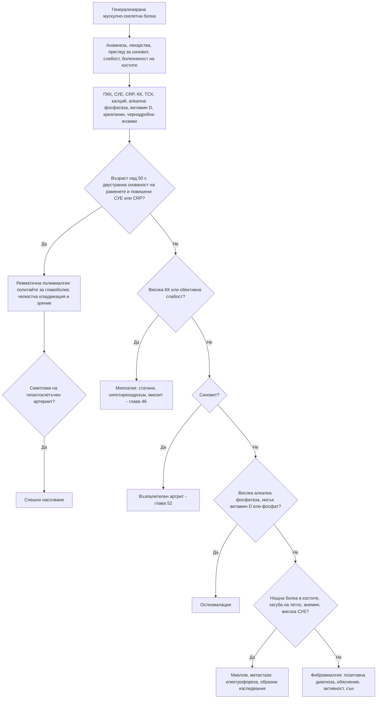

# Глава 54. Генерализирана мускулно-скелетна болка

> **Част X. Опорно-двигателен апарат**

## Цели на главата

- Да се разграничават ставната, мускулната, костната и невропатната болка при пациент с „болки навсякъде“.
- Да се поставя позитивна диагноза фибромиалгия и да се изключват имитаторите ѝ с ограничен набор от изследвания.
- Да се диагностицира ревматичната полимиалгия и да се помни връзката ѝ с гигантоклетъчния артериит.
- Да се разпознават мускулните симптоми, свързани със статините.
- Да се изключват метаболитните костни заболявания, ендокринните причини и злокачествените заболявания с минимален набор изследвания.

---

## 1. Клиничен подход

1. **Откъде идва болката?**
   - **стави** — синовит, скованост (вж. глави 51–52);
   - **мускули** — болезненост, слабост, повишена креатинкиназа (КК);
   - **кости** — дълбока, постоянна, нощна болка, локална болезненост;
   - **ентези** — болка в местата на залавяне на сухожилията (спондилоартрит);
   - **нерви** — парене, изтръпване (невропатия);
   - **централна сенситизация** — дифузна болка без обективни находки (фибромиалгия).
2. **Има ли обективни находки?** Синовит, мускулна слабост, лабораторни отклонения.
3. **Каква е възрастта?** След 50 години трябва да се мисли за ревматична полимиалгия, злокачествени заболявания и миелом.
4. **Има ли общи симптоми?** Треска, загуба на тегло, нощно изпотяване.
5. **Какви лекарства приема пациентът?**

---

## 2. Причини

| Група | Причини |
|---|---|
| **Функционални** | **Фибромиалгия**; синдроми на централна сенситизация |
| **Възпалителни** | **Ревматична полимиалгия**, ранен ревматоиден артрит, спондилоартрит (множество ентезити), системен лупус еритематодес, миозит, васкулити |
| **Лекарства** | **Статини** (миалгия, миопатия); **инхибитори на ароматазата** (артралгии); **бисфосфонати** (грипоподобна реакция след първата доза интравенозно); **флуорохинолони** (тендинопатии); **имунни чекпойнт инхибитори**; спиране на опиоиди и хипералгезия от опиоиди; кортикостероиди (при спиране) |
| **Ендокринни и метаболитни** | **Хипотиреоидизъм** (миалгии, крампи, скованост, висока КК); **дефицит на витамин D и остеомалация** (дифузни болки в костите, проксимална слабост, „патешка“ походка); **хиперпаратиреоидизъм**; хипокалиемия, хипомагнезиемия (крампи); захарен диабет |
| **Инфекции** | **Вирусни** (грип, COVID-19, EBV, хепатити); **бруцелоза**; **трихинелоза**; лаймска болест; инфекциозен ендокардит; поствирусна умора |
| **Злокачествени** | **Мултиплен миелом**, **костни метастази**, лимфоми, левкемии (болки в костите при деца); паранеопластични синдроми |
| **Костни** | Болест на Paget, остеопорозни фрактури |
| **Неврологични** | Полиневропатия, **ранна болест на Parkinson** (скованост и болки), синдром на неспокойните крака |
| **Хипермобилност** | Хипермобилен синдром на Ehlers-Danlos и синдроми на ставна хипермобилност (млади хора, луксации, скала на Beighton, често със синдром на постуралната ортостатична тахикардия) |
| **Психични** | **Депресия** и тревожност (соматични симптоми), нарушения на съня |

---

## 3. Безопасна диагностична стратегия

| Въпрос | Отговор |
|---|---|
| **Вероятна диагноза** | Фибромиалгия, ревматична полимиалгия (над 50 години), статинови мускулни симптоми, вирусни миалгии, депресия |
| **Сериозни заболявания, които не бива да се пропускат** | **Гигантоклетъчен артериит** (при ревматична полимиалгия); **мултиплен миелом** и **костни метастази**; **възпалителна миопатия** (с асоциирано злокачествено заболяване); **рабдомиолиза**; **инфекциозен ендокардит**; системен лупус еритематодес и васкулити; лимфом |
| **Чести капани** | **Хипотиреоидизъм**; **остеомалация**; **статини**; **инхибитори на ароматазата**; ранен ревматоиден артрит, приет за фибромиалгия; ревматична полимиалгия, лекувана с НСПВС; бруцелоза; трихинелоза; обструктивна сънна апнея |
| **Маскиращи заболявания** | Депресия, хипотиреоидизъм, лекарства, анемия, злокачествени заболявания |
| **Психосоциални аспекти** | Депресия, тревожност, травма в миналото, хроничен стрес, нарушен сън, социална изолация |

---

## 4. Фибромиалгия

### 4.1. Клинична картина

- **Генерализирана хронична болка** (над 3 месеца).
- **Умора**, **сън, след който пациентът не се чувства отпочинал**.
- **Когнитивни затруднения** („мъгла в главата“).
- Съпътстващи функционални синдроми: СРЧ, главоболие, синдром на болезнения пикочен мехур, дисфункция на темпоромандибуларната става.
- Тревожност и депресия.
- **Обективен преглед:** без синовит, **без обективна слабост**, дифузна болезненост при натиск.
- **Лабораторни изследвания: нормални.**

### 4.2. Диагностични критерии (ACR 2016)

- **Индекс на разпространената болка** (0–19 области) и **скала за тежестта на симптомите** (0–12):
  - индекс ≥ 7 и скала ≥ 5, **или**
  - индекс 4–6 и скала ≥ 9;
- **генерализирана болка** в поне 4 от 5 области;
- симптоми от **поне 3 месеца**.

**Диагнозата фибромиалгия не изключва друго заболяване.** Фибромиалгията често съпътства ревматоиден артрит, системен лупус еритематодес и спондилоартрит. Тя трябва да се поставя **позитивно**, по характерните белези, а не само чрез изключване.

### 4.3. Изследвания при съмнение за фибромиалгия

Ограничен набор за изключване на имитаторите:

- ПКК, СУЕ, CRP;
- **КК**;
- **ТСХ**;
- калций, алкална фосфатаза, **25-OH витамин D**;
- креатинин, чернодробни ензими, глюкоза.

ANA и ревматоиден фактор се изследват **само при клинични белези** на системно заболяване или артрит.

---

## 5. Ревматична полимиалгия

### 5.1. Клинична картина

- **Възраст над 50 години** (обикновено над 60).
- **Двустранна болка и скованост на раменния пояс** (и често на тазовия пояс и шията).
- **Сутрешна скованост над 45 минути** — затруднено ставане от леглото, обличане, решене.
- Общи симптоми: умора, субфебрилитет, загуба на тегло, депресия.
- **Няма истинска мускулна слабост**, КК е **нормална**.
- **Повишени СУЕ и/или CRP** (нормални при малка част от пациентите).
- **Бърз и изразен ефект** от ниска доза преднизолон (15 mg дневно) — **подобрение ≥ 70% за една седмица**.

### 5.2. Връзка с гигантоклетъчния артериит

При около **15–20%** от пациентите с ревматична полимиалгия има съпътстващ **гигантоклетъчен артериит**. Необходимо е при всеки пациент да се питат и проверяват:

- **ново главоболие**;
- **болезненост на скалпа**;
- **челюстна клаудикация**;
- **зрителни симптоми** (преходна слепота, двойно виждане);
- клаудикация на ръцете, асиметрия на пулса и налягането.

При наличие на такива белези се налага **спешно насочване** и лечение с по-висока доза кортикостероиди.

### 5.3. Имитатори на ревматичната полимиалгия

| Имитатор | Разграничаващи белези |
|---|---|
| **Серонегативен ревматоиден артрит с късно начало** | Периферен синовит (китки, метакарпофалангеални стави) |
| **Синдром RS3PE** | Оток на дланите, оставящ ямка; понякога паранеопластичен |
| **Миозит** | **Истинска слабост**, **висока КК** |
| **Хипотиреоидизъм** | Висок ТСХ, висока КК |
| **Злокачествени заболявания** (миелом, лимфом, метастази) | Нощна болка, загуба на тегло, парапротеин, **слаб отговор на кортикостероиди** |
| **Инфекции** (ендокардит, септичен артрит, спондилодисцит) | Треска, шум, хемокултури |
| **Статинова миопатия** | Прием на статин, висока КК |
| **Двустранен адхезивен капсулит, остеоартроза на раменните стави** | Ограничен пасивен обем, нормални възпалителни показатели |
| **Спондилоартрит с късно начало, псевдоподагра** | Засягане на ставите, хондрокалциноза |
| **Болест на Parkinson** | Ригидност, брадикинезия, тремор |
| **Фибромиалгия** | Нормални възпалителни показатели, липса на ефект от кортикостероиди |
| **Остеомалация, хиперпаратиреоидизъм** | Калций, фосфати, алкална фосфатаза, витамин D, ПТХ |

**Червени флагове за нетипична ревматична полимиалгия:**

- възраст под 60 години;
- хронично начало;
- липса на засягане на раменете;
- липса на скованост;
- изразени общи симптоми, нощна болка;
- неврологични белези;
- периферен артрит;
- **много високи или нормални възпалителни показатели**;
- **слаб отговор** на кортикостероиди.

---

## 6. Мускулни симптоми при статини

| Вид | Характеристика | КК |
|---|---|---|
| **Миалгия** | Симетрична болка и слабост в големите проксимални мускули (бедра, седалище, прасци, гръб); седмици до месеци след началото на лечението или след увеличаване на дозата; отзвучава за седмици след спирането | Нормална |
| **Миопатия** | Мускулни симптоми с повишена КК | > 4–10 пъти над горната граница |
| **Рабдомиолиза** | Тежки симптоми, тъмна урина, ОБУ | > 10 пъти над горната граница (обикновено много по-висока) |
| **Имуномедиирана некротизираща миопатия** | Прогресираща проксимална слабост, **персистира след спиране** на статина | Много висока; антитела срещу HMG-CoA редуктазата |

**Рискови фактори:** висока доза, **взаимодействия** (кларитромицин, азолови антимикотици, циклоспорин, гемфиброзил, амиодарон, верапамил и дилтиазем, сок от грейпфрут), **хипотиреоидизъм**, ХБЗ, напреднала възраст, ниско тегло, интензивни физически натоварвания.

**Преди да се припише болката на статина**, трябва да се изследват ТСХ и витамин D и да се прецени дали симптомите имат друга причина. Много пациенти, които смятат, че не понасят статини, понасят добре повторното им въвеждане.

---

## 7. Остеомалация

- **Причини:** дефицит на витамин D (ниска експозиция на слънце, тъмна кожа, покрито облекло, възрастни хора в институции, малабсорбция — цьолиакия, бариатрична операция), ХБЗ, антиепилептични средства, хипофосфатемия (включително от интравенозно желязо).
- **Клинична картина:** дифузни болки в костите и болезненост при натиск, **проксимална мускулна слабост**, „патешка“ походка, фрактури.
- **Лабораторни белези:** **повишена алкална фосфатаза**, нисък или нормален калций, **нисък фосфат**, **нисък 25-OH витамин D**, повишен ПТХ.
- **Рентгенография:** зони на Looser (псевдофрактури).

---

## 8. Диференциално-диагностична таблица

| Заболяване | Възраст | Слабост | Скованост | СУЕ/CRP | КК | Други |
|---|---|---|---|---|---|---|
| **Фибромиалгия** | 30–60 | Няма обективна | Кратка | Нормални | Нормална | Умора, нарушен сън, дифузна болезненост |
| **Ревматична полимиалгия** | > 50 | Няма | **Продължителна, раменен и тазов пояс** | **Повишени** | Нормална | Бърз ефект от преднизолон |
| **Миозит** | Всяка | **Проксимална** | Малко | Различни | **Висока** | Обрив (дерматомиозит), бял дроб |
| **Хипотиреоидизъм** | Всяка | Лека проксимална | Скованост, крампи | Нормални | Висока | Висок ТСХ |
| **Остеомалация** | Възрастни, рискови групи | Проксимална | — | Нормални | Нормална | Висока алкална фосфатаза, нисък фосфат, нисък витамин D |
| **Статинова миопатия** | Пациенти на статини | Различна | — | Нормални | Нормална до висока | Връзка с лечението |
| **Миелом, метастази** | > 50 | — | — | Висока СУЕ | Нормална | Нощна болка в костите, анемия, хиперкалциемия |
| **Ранен ревматоиден артрит** | Всяка | — | **Сутрешна > 1 час** | Повишени | Нормална | Синовит, анти-CCP |

---

## 9. Диагностичен алгоритъм

---

## 10. Клинични перли

- Фибромиалгията е реално заболяване с позитивни диагностични критерии, но не е обяснение за повишена СУЕ, повишена КК или синовит.
- При всеки пациент с ревматична полимиалгия питайте за главоболие, челюстна клаудикация и зрителни симптоми.
- Ако „ревматичната полимиалгия“ не се повлиява драматично от 15 mg преднизолон за една седмица, преразгледайте диагнозата.
- Пациент на статин с мускулни болки: изследвайте КК, ТСХ и витамин D и проверете за взаимодействия.
- Дифузни болки в костите, проксимална слабост и висока алкална фосфатаза: остеомалация.
- Жена на инхибитор на ароматазата с болки в ставите и скованост: вероятна лекарствена артралгия.
- Възрастен пациент с нощни болки в костите и висока СУЕ: изключете миелом.
- Млад човек с дифузни болки, ставна хипермобилност и повтарящи се сублуксации: синдром на хипермобилност.
- В България при дифузни болки със субфебрилитет и изпотяване помислете за бруцелоза. Периорбиталният оток с миалгии насочва към трихинелоза.

---

## 11. Клиничен случай

**Случай.** Жена на 71 години от 6 седмици има болки и скованост в двете рамене и в бедрата. Сутрин ѝ трябват два часа, за да „се раздвижи“, трудно става от леглото и облича палтото си. Отслабнала е с 3 kg. От около 10 дни има ново главоболие в дясното слепоочие, чувствителност на скалпа при сресване и болка в челюстта при дъвчене. Вчера за няколко минути „ѝ се замъглило“ зрението на дясното око. СУЕ 78 mm/h, CRP 46 mg/l, КК нормална.

**Въпроси.** 1) Какви са двете диагнози? 2) Колко спешно е състоянието?

**Обсъждане.** Двустранната болка и скованост на раменния и тазовия пояс с продължителна сутрешна скованост и високи възпалителни показатели при човек над 50 години отговарят на **ревматична полимиалгия**. Новото главоболие, болезнеността на скалпа, **челюстната клаудикация** и особено **преходното замъгляване на зрението** показват съпътстващ **гигантоклетъчен артериит** със заплаха за зрението. Състоянието е **спешно**. Необходими са **незабавни високи дози кортикостероиди** (без да се чакат потвърждаващите изследвания) и спешно насочване към ревматолог и офталмолог в рамките на същия ден. Ехографията на темпоралните артерии показва белега на „ореола“. Биопсията, ако е необходима, може да се направи до 1–2 седмици след началото на лечението без загуба на диагностичната стойност.

**Поука.** Ревматичната полимиалгия е „сестра“ на гигантоклетъчния артериит. Зрителните симптоми при възрастен пациент с полимиалгия са спешно състояние, защото слепотата е предотвратима.

<!-- навигация -->

---

[← Глава 53. Регионална болка: лакът, китка, тазобедрена става, коляно, глезен и стъпало](53-regionalna-bolka.md) · [Съдържание](../README.md) · [Глава 55. Кожни обриви: морфологичен подход →](55-obrivi.md)
