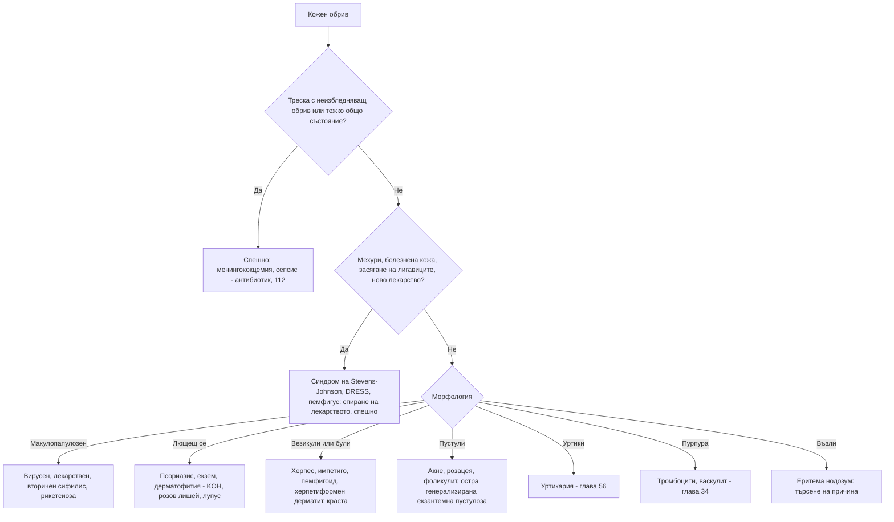

# Глава 55. Кожни обриви: морфологичен подход

> **Част XI. Кожа и придатъци**

## Цели на главата

- Да се описват кожните лезии точно: първична морфология, вторични промени, цвят, разпределение, конфигурация.
- Да се разпознават спешните дерматологични състояния: менингококцемия, синдром на Stevens-Johnson и токсична епидермална некролиза, DRESS, еритродермия, некротизиращ фасциит, херпетичен екзем.
- Да се подхожда систематично към обривите според морфологичната група.
- Да се разпознават лекарствените обриви и обривите с треска.
- Да се помни вторичният сифилис като „велик имитатор“.

---

## 1. Описание на кожните лезии

### 1.1. Първична морфология

| Лезия | Определение |
|---|---|
| **Макула / петно** | Промяна в цвета без релеф; макула < 1 cm, петно > 1 cm |
| **Папула / плака** | Надигната, твърда лезия; папула < 1 cm, плака > 1 cm |
| **Нодул (възел)** | Дълбока, палпируема лезия > 1 cm |
| **Везикула / була** | Мехурче с бистра течност; везикула < 0,5–1 cm, була > 0,5–1 cm |
| **Пустула** | Мехурче с гной |
| **Уртика (уртикариален оток)** | Преходен, сърбящ оток, който изчезва за < 24 часа |
| **Петехии / пурпура** | Кръвоизливи в кожата, **неизбледняващи при натиск**; петехии < 2 mm |
| **Телеангиектазии** | Разширени малки кръвоносни съдове |

### 1.2. Вторични промени

Люспи, крусти, ерозии, язви, екскориации (от чесане), лихенификация (задебеляване при хронично чесане), атрофия, белези.

### 1.3. Разпределение и конфигурация

| Характеристика | Примери |
|---|---|
| **Слънчево експонирани области** | Фототоксични и фотоалергични реакции, системен лупус еритематодес, дерматомиозит, порфирии, пелагра |
| **Флексурни гънки** | Атопичен дерматит, кандидоза, инверзен псориазис, дерматофития в слабините |
| **Екстензорни повърхности** | Псориазис, херпетиформен дерматит |
| **Дерматом** | Херпес зостер |
| **Длани и ходила** | **Вторичен сифилис**, синдром „ръка-крак-уста“, **рикетсиози** (марсилска треска), еритема мултиформе, лекарствени обриви, болест на Kawasaki, дисхидротичен екзем, краста при кърмачета |
| **Центростремително (по трупа)** | Варицела, розов лишей |
| **Себорейни зони** | Себореен дерматит (скалп, назолабиални гънки, вежди, гръдна кост) |
| **Пръстеновидна** | Дерматофития, **мигриращ еритем** (лаймска болест), уртикария, пръстеновиден гранулом (granuloma annulare), подостър кожен лупус |
| **Мишеневидна („таргетна“)** | **Еритема мултиформе** |
| **Линейна** | Контактен дерматит (растения), феномен на Koebner |
| **Групирани везикули** | Херпес симплекс |
| **Мрежовидна** | Ливедо |

---

## 2. Спешни дерматологични състояния

| Състояние | Ключови белези | Поведение |
|---|---|---|
| **Менингококцемия и сепсис** | Треска, **неизбледняващи петехии или пурпура**, тежко общо състояние, студени крайници | Незабавен антибиотик и 112 |
| **Синдром на Stevens-Johnson и токсична епидермална некролиза** | **4–28 дни** след ново лекарство (алопуринол, ламотрижин, карбамазепин, фенитоин, сулфонамиди, НСПВС от групата на оксикамите, невирапин); треска, **болезнена** кожа, мишеневидни или тъмни петна, **мехури и отлепване на епидермиса** (положителен белег на Nikolsky), **засягане на ≥ 2 лигавици** (уста, очи, гениталии) | Спиране на лекарството, спешно към специализирано звено (изгаряния или интензивно отделение) |
| **DRESS синдром** (лекарствена реакция с еозинофилия и системни симптоми) | **2–8 седмици** след лекарство (антиепилептични, алопуринол, сулфонамиди, миноциклин, ванкомицин); треска, генерализиран обрив, **оток на лицето**, **лимфаденопатия**, **еозинофилия**, **хепатит**, нефрит | Спиране на лекарството, хоспитализация |
| **Еритродермия** | Зачервяване на > 90% от кожата; причини — псориазис, екзем, лекарства, Т-клетъчен лимфом (синдром на Sézary); **хипотермия, загуба на течности, сърдечна недостатъчност с висок дебит, инфекции** | Хоспитализация |
| **Синдром на токсичния шок** | Треска, **хипотония**, дифузен еритем, по-късно десквамация на дланите и ходилата; тампони, рани | Спешно |
| **Некротизиращ фасциит** | **Болка, непропорционална на находката**, бързо разпространение, мехури, тъмна кожа, крепитации, системна токсичност | Спешна хирургия |
| **Херпетичен екзем** | Пациент с атопичен дерматит, **еднотипни, „изсечени“ ерозии**, треска | Спешно ацикловир |
| **Генерализирана пустулозна псориазис** | Треска, генерализирани стерилни пустули върху еритем | Хоспитализация |
| **Пемфигус вулгарис** | **Ерозии на лигавиците**, отпуснати мехури, положителен белег на Nikolsky | Спешно към дерматолог |
| **Анафилаксия и ангиоедем** | Уртикария, оток на лицето и гърлото, задух, хипотония | Адреналин интрамускулно, 112 |
| **Морбили** | Треска, кашлица, конюнктивит, хрема, **петна на Koplik**, после макулопапулозен обрив от главата надолу | Изолация, съобщаване |

**Засягането на лигавиците** при обрив е червен флаг за синдром на Stevens-Johnson, пемфигус и еритема мултиформе.

---

## 3. Макулопапулозни (екзантемни) обриви

| Причина | Ключови белези |
|---|---|
| **Вирусни екзантеми** | Морбили, рубеола, EBV (особено след **амоксицилин**), HHV-6, ентеровируси, COVID-19, **остра HIV инфекция**, парвовирус B19 |
| **Лекарствен морбилиформен обрив** | Най-честата лекарствена реакция; **4–14 дни** след началото на лекарството (бета-лактами, сулфонамиди, алопуринол, антиепилептични средства); сърбеж; трябва да се търсят белезите на DRESS и синдрома на Stevens-Johnson |
| **Вторичен сифилис** | **Длани и ходила**, генерализирана лимфаденопатия, широки кондиломи, лигавични плаки, „молеядна“ алопеция; прекаран първичен шанкър |
| **Рикетсиози (марсилска треска)** | **Треска**, **черна некротична коричка** на мястото на ухапването, обрив и по дланите и ходилата; лятото |
| **Скарлатина** | „Шкурка“ на пипане, малинов език, по-наситен цвят в гънките (линии на Pastia), бледост около устата |
| **Болест на Still при възрастни** | Преходен сьомгово-розов обрив по време на треската |
| **Розов лишей** | Млади хора; **„майчина“ плака**, последвана от овални лезии по трупа по хода на ребрата („елха“); **диференциална диагноза с вторичен сифилис** |
| **Гутатен псориазис** | Капковидни лющещи се папули след **стрептококов фарингит** |
| **Еритема мултиформе** | **Мишеневидни лезии**, акрално; провокира се от херпес симплекс и *Mycoplasma* |

---

## 4. Папулосквамозни (лющещи се) обриви

| Заболяване | Ключови белези |
|---|---|
| **Псориазис** | Добре ограничени еритемни плаки със **сребристи люспи**; лакти, колена, скалп, лумбосакрална област; **промени в ноктите**; феномен на Koebner; ставно засягане |
| **Атопичен дерматит** | **Сърбеж**, суха кожа, флексурни гънки (при възрастни), лице и екстензорни повърхности (при кърмачета); атопия |
| **Контактен дерматит** | Разпределение, съответстващо на **експозицията**; иритативен (сапуни, мокра работа) или алергичен (никел, ароматизатори, **боя за коса**, гума, **локални лекарства**) |
| **Себореен дерматит** | Мазни жълтеникави люспи по скалпа, веждите, назолабиалните гънки; по-изразен при **болест на Parkinson** и **HIV** |
| **Дерматофития (тинеа)** | Пръстеновидна лезия с **активен лющещ се ръб** и изсветляващ център; микроскопия с KOH. След локални кортикостероиди картината се променя („тинеа инкогнито“) |
| **Pityriasis versicolor** | Хипо- или хиперпигментирани петна с фини люспи по трупа; *Malassezia* |
| **Лихен планус** | **Пурпурни, полигонални, плоски, сърбящи папули**; мрежа на Wickham; **лезии в устата**; връзка с хепатит C и лекарства |
| **Кожен лупус** | Фоторазпределени пръстеновидни или дисковидни лезии; лекарства (ИПП, тербинафин, тиазиди, калциеви антагонисти) |
| **Mycosis fungoides** (кожен Т-клетъчен лимфом) | Персистиращи петна и плаки в **защитени от слънцето области**, неповлияващи се от лечението; биопсия |
| **Болест на Bowen** | Единична лющеща се еритемна плака, която **не се повлиява** от кортикостероиди (сквамозноклетъчен карцином *in situ*) |

---

## 5. Везикулобулозни обриви

| Заболяване | Ключови белези |
|---|---|
| **Херпес симплекс** | Групирани везикули на еритемна основа, рецидиви на едно и също място |
| **Варицела и херпес зостер** | Варицела — лезии в различни стадии, по трупа. Херпес зостер — дерматомно разпределение, болка преди обрива |
| **Импетиго** | Медено-жълти крусти; булозна форма (*S. aureus*) |
| **Остър контактен дерматит** | Везикули в зоната на контакта |
| **Дисхидротичен екзем** | Везикули по дланите и ходилата, сърбеж |
| **Булозен пемфигоид** | **Възрастни хора**, **напрегнати мехури**, силен сърбеж, уртикариален предбулозен стадий; лекарства (**DPP-4 инхибитори — глиптини**) |
| **Пемфигус вулгарис** | Отпуснати мехури, ерозии, **лигавиците са засегнати** |
| **Херпетиформен дерматит** | Силно сърбящи везикули по лактите, коленете, седалището; **цьолиакия** |
| **Късна кожна порфирия** | Мехури и крехкост на кожата по **гърба на дланите**, хипертрихоза; хепатит C, алкохол, хемохроматоза, естрогени |
| **Фиксирана лекарствена реакция** | Кръгло тъмночервено петно или мехур, **рецидивиращо на същото място** след същото лекарство |
| **Синдром „ръка-крак-уста“** | Вирус Coxsackie; везикули в устата, по дланите и ходилата |
| **Краста** | Везикули и **ходчета** между пръстите, по китките, гениталиите; нощен сърбеж |

---

## 6. Пустулозни обриви

| Заболяване | Ключови белези |
|---|---|
| **Акне** | **Комедони**, папули, пустули; лице, гръб |
| **Розацея** | **Без комедони**; зачервяване, телеангиектазии и пустули по централната част на лицето |
| **Фоликулит** | Бактериален; *Pseudomonas* (след джакузи); гъбичен; стероиден |
| **Остра генерализирана екзантемна пустулоза** | **1–5 дни** след лекарство (аминопеницилини, макролиди, дилтиазем); треска, множество дребни стерилни пустули в гънките; неутрофилия |
| **Пустулозен псориазис** | Генерализиран (спешно) или палмоплантарен |
| **Кандидоза** | Сателитни пустули около еритемна зона в гънките |
| **Гонококцемия** | Малко на брой **хеморагични пустули** по крайниците, артрит, теносиновит |
| **Супуративен хидраденит** | Възли, абсцеси и синусни ходове в подмишниците и слабините |

---

## 7. Нодозни лезии

**Еритема нодозум** — болезнени, червени, топли възли по **пищялите**. Причините са:

- **стрептококови инфекции**;
- **саркоидоза** (синдром на Löfgren);
- **възпалителни болести на червата**;
- бременност и орални контрацептиви;
- **туберкулоза**;
- лекарства (сулфонамиди);
- *Yersinia*, болест на Behçet, лимфоми;
- идиопатична (около една трета).

**Други възли:** кожни метастази, лимфом, ревматоидни възли, тофи, липом, епидермоидна киста, **синдром на Sweet** (болезнени плаки, треска, неутрофилия — хематологични злокачествени заболявания, инфекции, G-CSF), индуриран еритем (туберкулоза, по прасците).

---

## 8. Зачервяване на крака: целулит или не?

| Заболяване | Белези, които го отличават |
|---|---|
| **Целулит** | **Едностранен**, топъл, болезнен, треска, входна врата |
| **Еризипел** | Остро ограничен, надигнат ръб; лице или подбедрица; стрептококи |
| **Стазен дерматит** | **Двустранен**, хроничен, сърбящ, пигментация, варици |
| **Липодерматосклероза** | Твърда, болезнена индурация в долната трета на подбедрицата; „обърната бутилка“ |
| **Тромбоза на дълбоките вени** | Оток на целия крак, болезненост по хода на вените |
| **Подагра** | Засягане на става |
| **Контактен дерматит** | Сърбеж, везикули, ясна връзка с контакта |
| **Мигриращ еритем** | Разширяващ се пръстен след ухапване от кърлеж |
| **Невроартропатия на Charcot** | Диабетик с невропатия, топло подуто стъпало |
| **Некротизиращ фасциит** | Силна болка, системна токсичност |

**Двустранният „целулит“ почти винаги е друго заболяване.**

---

## 9. Обриви и треска

| Причина | Насочващи белези |
|---|---|
| **Менингококцемия** | Петехии и пурпура, тежко общо състояние |
| **Сепсис, синдром на токсичния шок** | Хипотония, еритродермия |
| **Морбили, варицела, скарлатина** | Характерни обриви, контакти, ваксинален статус |
| **EBV, остра HIV инфекция, вторичен сифилис** | Лимфаденопатия, фарингит, язви |
| **Рикетсиози** (марсилска треска) | Коричка, обрив по дланите и ходилата |
| **Лаймска болест** | Мигриращ еритем |
| **Лекарствени реакции** (DRESS, синдром на Stevens-Johnson, остра генерализирана екзантемна пустулоза) | Ново лекарство |
| **Болест на Still, системен лупус еритематодес, васкулити** | Ставни и системни прояви |
| **Инфекциозен ендокардит** | Петехии, хеморагии под ноктите, шум |
| **Болест на Kawasaki** | Деца (вж. глава 69) |
| **Денга, лептоспироза** | Пътуване, експозиция |

---

## 10. Лекарствени обриви

| Вид | Време след началото на лечението | Типични причинители |
|---|---|---|
| Морбилиформен обрив | 4–14 дни | Бета-лактами, сулфонамиди, алопуринол, антиепилептични средства |
| Уртикария, ангиоедем | Минути до часове | Бета-лактами, НСПВС, контрастни вещества, АСЕ инхибитори (ангиоедем без уртикария) |
| **Синдром на Stevens-Johnson / токсична епидермална некролиза** | 4–28 дни | Алопуринол, ламотрижин, карбамазепин, фенитоин, сулфонамиди, оксикамови НСПВС |
| **DRESS** | 2–8 седмици | Антиепилептични средства, алопуринол, сулфонамиди, миноциклин, ванкомицин |
| Остра генерализирана екзантемна пустулоза | 1–5 дни | Аминопеницилини, макролиди, дилтиазем |
| Фиксирана лекарствена реакция | Часове след повторен прием | Сулфонамиди, НСПВС, тетрациклини, парацетамол |
| Фоточувствителност | При излагане на слънце | Доксициклин, тиазиди, амиодарон, НСПВС, флуорохинолони, вориконазол |
| Лихеноидна реакция | Седмици до месеци | Бета-блокери, АСЕ инхибитори, антималарийни средства, тиазиди |
| Лекарствено индуциран пемфигоид | Месеци | DPP-4 инхибитори |
| Акнеиформен обрив | Седмици | Кортикостероиди, EGFR инхибитори, литий |

---

## 11. Безопасна диагностична стратегия

| Въпрос | Отговор |
|---|---|
| **Вероятна диагноза** | Екзем (атопичен, контактен), псориазис, вирусни екзантеми, лекарствени обриви, дерматофитии, акне |
| **Сериозни заболявания, които не бива да се пропускат** | **Менингококцемия**, **синдром на Stevens-Johnson и токсична епидермална некролиза**, **DRESS**, **некротизиращ фасциит**, **херпетичен екзем**, еритродермия, пемфигус, **вторичен сифилис**, **остра HIV инфекция**, **морбили**, кожен лимфом, рикетсиози |
| **Чести капани** | Вторичен сифилис, приет за розов лишей; тинеа инкогнито; двустранен стазен дерматит, лекуван като целулит; скабиес при възрастни хора в институции; лекарствени обриви (включително от глиптини); болест на Bowen, лекувана като екзем |
| **Маскиращи заболявания** | Захарен диабет (инфекции, кандидоза), HIV, лекарства, цьолиакия (херпетиформен дерматит) |
| **Психосоциални аспекти** | Стрес (псориазис, екзем), самонараняване, делюзионна паразитоза |

---

## 12. Изследвания

- **Микроскопия с KOH** и посявка за гъбички.
- **Натривки** за бактерии и PCR за вируси (HSV, VZV).
- **Серология:** сифилис (скринингов и потвърдителен тест), HIV, EBV.
- **Кожна биопсия** (пънч биопсия; директна имунофлуоресценция при булозни заболявания).
- **Кръвни изследвания:** ПКК с еозинофили, чернодробни показатели и креатинин (при DRESS), CRP.
- Дерматоскопия, лампа на Wood.

---

## 13. Диагностичен алгоритъм

---

## 14. Клинични перли

- Обрив по дланите и ходилата при възрастен: мислете за вторичен сифилис.
- Всеки „розов лишей“ при сексуално активен човек изисква изследване за сифилис.
- Болезнената кожа и засягането на лигавиците след ново лекарство са червени флагове за синдром на Stevens-Johnson.
- Обрив, оток на лицето, еозинофилия и повишени трансаминази седмици след започване на антиепилептично средство или алопуринол: DRESS.
- Пръстеновидна лезия, която се разраства след кортикостероиден крем: тинеа инкогнито. Направете микроскопия с KOH.
- Еднотипни „изсечени“ ерозии при дете или възрастен с атопичен дерматит: херпетичен екзем. Започнете ацикловир.
- Възрастен пациент със силен сърбеж, уртикариални плаки и по-късно мехури: булозен пемфигоид. Проверете за глиптини.
- Двустранен „целулит“ почти винаги е стазен дерматит.
- Персистираща лющеща се плака, която не отговаря на кортикостероиди: биопсия (болест на Bowen, mycosis fungoides).
- Треска, черна коричка и обрив по дланите през лятото: марсилска треска.

---

## 15. Клиничен случай

**Случай.** Мъж на 24 години идва заради неболезнен, несърбящ обрив по трупа, дланите и ходилата от 10 дни. Има лек субфебрилитет, болки в гърлото и чувство на отпадналост. Отрича нов прием на лекарства. При прегледа: медно-червени макулопапулозни лезии, включително по дланите и ходилата, генерализирана неболезнена лимфаденопатия, сивкави плаки по лигавицата на устата и петна с оредяла коса по скалпа. При насочен въпрос съобщава за неболезнена язвичка на пениса преди около 7 седмици, която е зараснала сама.

**Въпроси.** 1) Коя е най-вероятната диагноза? 2) Какви изследвания и мерки са необходими?

**Обсъждане.** Обривът по дланите и ходилата, лимфаденопатията, лигавичните плаки, „молеядната“ алопеция и прекараният неболезнен шанкър са класическа картина на **вторичен сифилис**. Изследват се нетрепонемен тест (RPR или VDRL) и трепонемен тест (TPPA или ELISA). Задължително се изследват за **HIV** и другите полово предавани инфекции. Необходими са лечение с пеницилин, **уведомяване и изследване на партньорите** и задължително съобщаване. Сифилисът отново е чест в Европа и е „великият имитатор“ в дерматологията.

**Поука.** Обривът по дланите и ходилата при сексуално активен възрастен изисква изследване за сифилис.
