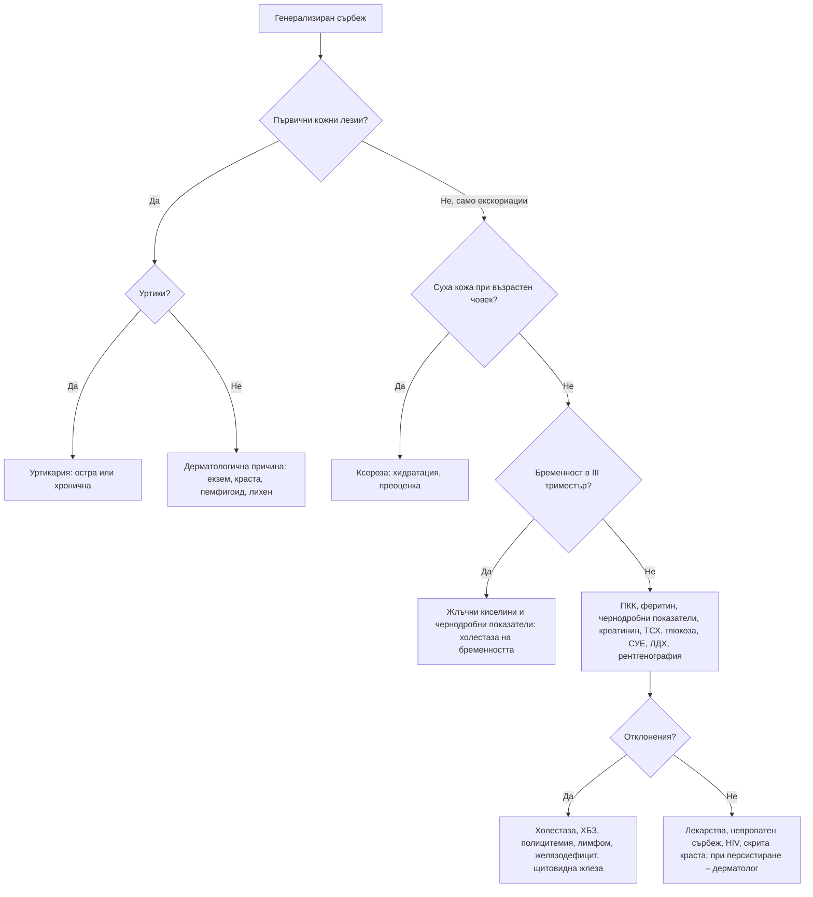

# Глава 56. Сърбеж и уртикария

> **Част XI. Кожа и придатъци**

## Цели на главата

- Да се разграничава сърбежът с първични кожни лезии от сърбежа без обрив.
- Да се познават системните причини за генерализиран сърбеж: холестаза, бъбречна недостатъчност, хематологични и ендокринни заболявания, лекарства.
- Да се разпознават краста и холестазата на бременността.
- Да се класифицира уртикарията на остра и хронична, спонтанна и индуцирана.
- Да се разграничава хистаминовият от брадикининовия ангиоедем.
- Да се разпознава уртикариалният васкулит.

## Ключови моменти

- Първо се определя дали има първични кожни лезии. Сърбежът без обрив налага търсене на системна причина след изключване на сухата кожа и крастата *(SORT C [4])*.
- Нощен сърбеж, който засяга и членовете на семейството, е краста до доказване на противното *(SORT C [1])*.
- Сърбеж по дланите и ходилата в третия триместър изисква изследване на жлъчните киселини. Рискът от мъртво раждане нараства при стойности ≥ 100 µmol/l *(SORT B [2, 3])*.
- Уртикарията е остра (под 6 седмици) или хронична. Хроничната спонтанна уртикария рядко се дължи на храни, а изследванията са ограничени *(SORT C [5])*.
- Уртика, която продължава над 24 часа, боли и оставя синина, е уртикариален васкулит и изисква биопсия.
- Ангиоедемът без уртики е брадикининов (АСЕ инхибитори, наследствен ангиоедем) и не се повлиява от антихистамини и кортикостероиди. При наследствения ангиоедем C4 е нисък *(SORT C [6])*.

---

## А. Сърбеж

### 1. Класификация

*Таблица 56.1. Сърбеж: класификация.*

| Група | Характеристика | Примери |
|---|---|---|
| **Дерматологичен** | Сърбеж с първични кожни лезии | Екзем, уртикария, краста, псориазис, лихен планус, булозен пемфигоид |
| **Системен** | Сърбеж без първични лезии (само с екскориации и вторични промени) | Холестаза, ХБЗ, хематологични, ендокринни заболявания, лекарства |
| **Невропатен** | Локализиран, по хода на нерв | Брахиорадиален пруритус, notalgia paresthetica, постхерпесен сърбеж |
| **Психогенен** | Диагноза след изключване | Делюзионна паразитоза, обсесивно-компулсивно разстройство |
| **Смесен** | Особено при възрастни хора | Суха кожа, невропатия, лекарства |

### 2. Дерматологични причини

*Таблица 56.2. Сърбеж: дерматологични причини.*

| Заболяване | Ключови белези |
|---|---|
| **Суха кожа (ксероза)** | Възрастни хора, зимата, чести вани; най-честата причина за сърбеж при възрастни |
| **Атопичен и контактен дерматит** | Вж. глава 55 |
| **Краста** | Нощен сърбеж, засегнати и членовете на семейството, ходчета между пръстите, по китките, около зърната, по гениталиите (папули по пениса), по седалището. При възрастни хора в институции и при имунокомпрометирани – крустозна (норвежка) краста с дебели крусти и масови огнища [1] |
| **Въшки** | Главови, по тялото (бездомни), срамни |
| **Уртикария** | Вж. раздел Б |
| **Булозен пемфигоид** | Възрастни хора; сърбежът може да предшества мехурите с месеци |
| **Херпетиформен дерматит** | Цьолиакия; изключително сърбящи везикули по екстензорните повърхности |
| **Лихен планус, псориазис, дерматофитии** | Вж. глава 55 |
| **Mycosis fungoides** | Персистиращ сърбеж с петна и плаки |
| **Дерматози на бременността** | Полиморфна ерупция на бременността (стрии на корема, III триместър), пемфигоид на бременността |

### 3. Системни причини за генерализиран сърбеж

*Таблица 56.3. Системни причини за генерализиран сърбеж.*

| Група | Причини и насочващи белези |
|---|---|
| **Холестаза** | Първичен билиарен холангит (жени на средна възраст, антимитохондриални антитела), първичен склерозиращ холангит, обструкция на жлъчните пътища, лекарствена холестаза, интрахепатална холестаза на бременността (сърбеж по дланите и ходилата, III триместър, повишени жлъчни киселини; риск за плода [2]; мъртво раждане при около 3% от бременностите с жлъчни киселини ≥ 100 µmol/l [3]) |
| **ХБЗ** | Уремичен сърбеж, особено при диализа |
| **Хематологични** | Полицитемия вера (сърбеж след топла вана – аквагенен), лимфом на Hodgkin (сърбежът може да предшества лимфома с месеци; болка в лимфните възли след алкохол), желязодефицит (дори без анемия), миелодиспластичен синдром, мастоцитоза |
| **Ендокринни** | Хипер- и хипотиреоидизъм, захарен диабет (локализиран генитален сърбеж при кандидоза) |
| **Инфекции** | HIV (еозинофилен фоликулит), паразити (*Strongyloides*, анкилостоми, шистозоми), острици (нощен перианален сърбеж при деца) |
| **Злокачествени** | Паранеопластичен сърбеж |
| **Лекарства** | Опиоиди, хлорохин, АСЕ инхибитори, лекарства, причиняващи холестаза, хидроксиетил нишесте (продължителен сърбеж) |
| **Невропатни** | Брахиорадиален пруритус (сърбеж по слънчево експонираната външна страна на предмишниците, свързан с шийния отдел), notalgia paresthetica (сърбящо хиперпигментирано петно между лопатките), постхерпесен сърбеж, множествена склероза, невропатия на тънките влакна |
| **Психогенни** | Делюзионна паразитоза (пациентът е убеден, че има паразити, и често носи „проби“ в кутийка), обсесивно-компулсивно разстройство, депресия |

### 4. Изследвания при генерализиран сърбеж без обрив

След изключване на сухата кожа и крастата [4]:

- ПКК с диференциално броене, феритин;
- чернодробни показатели (алкална фосфатаза, ГГТ, билирубин; при бременни – жлъчни киселини);
- креатинин, урея;
- **ТСХ**, глюкоза и HbA1c;
- СУЕ, ЛДХ;
- HIV и хепатити при рискови фактори;
- **рентгенография на гръден кош** (медиастинална лимфаденопатия при лимфом);
- електрофореза на серумните белтъци при възрастни хора;
- при повишен хематокрит – JAK2;
- кожна биопсия при нетипична картина.

### 5. Червени флагове при сърбеж

- Генерализиран сърбеж **без видима кожна причина**, особено при възрастен човек.
- **Нощно изпотяване, загуба на тегло, лимфаденопатия** (лимфом).
- **Жълтеница**, тъмна урина, светли изпражнения.
- **Сърбеж след топла вана** с червено лице (полицитемия вера).
- **Бременна в III триместър** със сърбеж по дланите и ходилата.
- Сърбеж при пациент на нов медикамент с повишени чернодробни ензими.

---

## Б. Уртикария и ангиоедем

### 6. Определения

- **Уртики** – преходни, сърбящи, бледоцентрични отоци на кожата. Всяка отделна уртика изчезва за < 24 часа без следа.
- **Ангиоедем** – по-дълбок оток на кожата и лигавиците (устни, клепачи, език, гениталии), с продължителност до 72 часа. Често е **болезнен или парещ**, а не сърбящ.

### 7. Класификация и причини

*Таблица 56.4. Уртикария и ангиоедем: класификация и причини.*

| Вид [5] | Продължителност | Причини |
|---|---|---|
| **Остра уртикария** | < 6 седмици | Инфекции (вирусни, особено при деца), лекарства (пеницилини, НСПВС, аспирин, опиоиди, контрастни вещества), храни (ядки, ракообразни, яйца, мляко, риба), ужилвания от насекоми, латекс; при около половината – неустановена причина |
| **Хронична спонтанна уртикария** | ≥ 6 седмици, без специфичен външен провокатор | Автоимунна при около половината (свързана с автоимунен тиреоидит); влошава се от НСПВС, стрес, инфекции, алкохол. Храните рядко са причина |
| **Хронична индуцирана уртикария** | ≥ 6 седмици, с определен физически провокатор | Дермографизъм (уртики по линията на драскане), студова (опасност при къпане в студена вода), холинергична (дребни уртики при затопляне, усилие, изпотяване), забавена от натиск, слънчева, аквагенна, вибрационна |

### 8. Уртикариален васкулит

Трябва да се подозира, когато:

- **отделните лезии продължават над 24 часа**;
- лезиите са **болезнени или парещи**, а не сърбящи;
- оставят **кръвонасядане или пигментация**;
- има **системни симптоми**: треска, артралгии, коремна болка, бъбречно засягане;
- **комплементът е нисък** (хипокомплементемичен уртикариален васкулит – свързан със системен лупус еритематодес).

Диагнозата се поставя с **кожна биопсия**.

### 9. Ангиоедем без уртикария (брадикинин-медииран)

*Таблица 56.5. Ангиоедем без уртикария (брадикинин-медииран).*

| Вид | Особености |
|---|---|
| **Индуциран от АСЕ инхибитори** | Може да се появи години след началото на лечението; устни, език, гърло; антихистамините и кортикостероидите не помагат |
| **Наследствен ангиоедем** | Начало в детството или юношеството; рецидивиращи отоци на кожата и лигавиците, пристъпи на силна коремна болка (оток на чревната стена), ларингеален оток; фамилна анамнеза; нисък C4, нисък C1-инхибитор (количествено или функционално); провокира се от травми, стоматологични процедури, естрогени [6] |
| **Придобит дефицит на C1-инхибитор** | Възрастни хора; лимфопролиферативни заболявания, MGUS; нисък C1q |

**Брадикининовият ангиоедем не се повлиява** от антихистамини, кортикостероиди и често от адреналина. Изисква специфично лечение (концентрат на C1-инхибитор, икатибант).

### 10. Мастоцитоза

Кафеникави петна и папули, които се подуват и зачервяват при триене (белег на Darier) – уртикария пигментоза. Възможни са зачервяване, диария, анафилаксия, остеопороза. Изследва се серумна триптаза.

### 11. Изследвания при уртикария

- **Остра уртикария:** обикновено **без изследвания**. При анамнеза за конкретен провокатор (храна, лекарство, ужилване) – насочване към алерголог.
- **Хронична спонтанна уртикария:** ПКК с диференциално броене, CRP или СУЕ, общ IgE и антитела срещу тиреоидната пероксидаза [5]. Други изследвания само при анамнестични данни.
- **Индуцирана уртикария:** провокационни тестове (дермографизъм, тест с кубче лед).
- **Уртикариален васкулит:** биопсия, C3, C4.
- **Ангиоедем без уртикария:** **C4**, C1-инхибитор (количество и функция), C1q.

---

## 12. Безопасна диагностична стратегия

*Таблица 56.6. Безопасна диагностична стратегия.*

| Въпрос | Отговор |
|---|---|
| **Вероятна диагноза** | Суха кожа, екзем, краста, остра уртикария при инфекция, хронична спонтанна уртикария |
| **Сериозни заболявания, които не бива да се пропускат** | Анафилаксия и ларингеален ангиоедем; лимфом на Hodgkin; полицитемия вера; холестаза (включително злокачествена обструкция); интрахепатална холестаза на бременността; уремия; уртикариален васкулит със системно засягане |
| **Чести капани** | Краста (особено крустозна при възрастни хора); желязодефицит като причина за сърбеж; ангиоедем от АСЕ инхибитори след години лечение; холинергична и студова уртикария; брахиорадиален пруритус; булозен пемфигоид в предбулозния стадий; опиоиди |
| **Маскиращи заболявания** | Захарен диабет, заболявания на щитовидната жлеза, лекарства, депресия, ХБЗ |
| **Психосоциални аспекти** | Стрес, депресия, налудност за паразитоза, самонараняване |

---

## 13. Диагностичен алгоритъм при генерализиран сърбеж

*Фигура 56.1. Диагностичен алгоритъм при генерализиран сърбеж. Схема на авторите въз основа на източниците, цитирани в главата.*

Текстово описание на фигура 56.1

1. Генерализиран сърбеж. Следва: към т. 2.
2. **Въпрос:** Първични кожни лезии? Да – към т. 3; Не, само екскориации – към т. 4.
3. **Въпрос:** Уртики? Да – към т. 5; Не – към т. 6.
4. **Въпрос:** Суха кожа при възрастен човек? Да – към т. 7; Не – към т. 8.
5. Уртикария: остра или хронична.
6. Дерматологична причина: екзем, краста, пемфигоид, лихен.
7. Ксероза: хидратация, преоценка.
8. **Въпрос:** Бременност в III триместър? Да – към т. 9; Не – към т. 10.
9. Жлъчни киселини и чернодробни показатели: холестаза на бременността.
10. ПКК, феритин, чернодробни показатели, креатинин, ТСХ, глюкоза, СУЕ, ЛДХ, рентгенография. Следва: към т. 11.
11. **Въпрос:** Отклонения? Да – към т. 12; Не – към т. 13.
12. Холестаза, ХБЗ, полицитемия, лимфом, желязодефицит, щитовидна жлеза.
13. Лекарства, невропатен сърбеж, HIV, скрита краста; при персистиране – дерматолог.

---

## 14. Кога и колко спешно да насочим

*Таблица 56.7. Кога и колко спешно да насочим.*

| Спешност | Клинична ситуация |
|---|---|
| **Незабавно (112 или спешно отделение)** | Анафилаксия; ангиоедем на езика или гърлото, включително от АСЕ инхибитори; пристъп на наследствен ангиоедем с оток на гърлото [6] |
| **В същия ден** | Бременна в третия триместър със сърбеж по дланите и ходилата – жлъчни киселини и акушерска оценка [2]; сърбеж с жълтеница и белези на обструкция на жлъчните пътища; уртикариален васкулит със системни симптоми |
| **Бързо (до 2 седмици)** | Сърбеж с лимфаденопатия, нощно изпотяване или загуба на тегло; сърбеж след топла вана с повишен хематокрит; подозрение за наследствен ангиоедем [6] |
| **Планово** | Хронична спонтанна уртикария, неконтролирана с антихистамин във висока доза [5]; хроничен сърбеж с неясна причина [4]; подозрение за мастоцитоза |
| **Проследяване в общата практика** | Суха кожа; краста – едновременно лечение на всички контактни лица [1]; остра уртикария; хронична спонтанна уртикария, контролирана с антихистамини |

---

## 15. Клинични перли

- При сърбеж, който засяга и членовете на семейството, особено нощем, помислете за краста.
- Възрастен човек със сърбеж без обрив: първо изключете сухата кожа, после търсете системна причина.
- Сърбеж след топла вана с червено лице: полицитемия вера.
- Сърбеж, нощно изпотяване и болка в шийните възли след алкохол при млад човек: лимфом на Hodgkin.
- Сърбежът по дланите и ходилата в третия триместър изисква изследване на жлъчните киселини. Това е заради риска за плода.
- Уртика, която продължава над 24 часа и оставя синина, е уртикариален васкулит. Направете биопсия.
- Ангиоедем без уртики при пациент на АСЕ инхибитор: спрете лекарството, дори ако се приема от години.
- Повтарящи се пристъпи на коремна болка и кожни отоци без уртики: наследствен ангиоедем. Изследвайте C4.
- Хроничната спонтанна уртикария рядко се дължи на храни. Безкрайните елиминационни диети не са оправдани.

---

## 16. Клиничен случай

**Етап 1 – клинична картина.** Жена на 26 години от 4 месеца има генерализиран сърбеж, по-силен нощем. Използвала е различни кремове и антихистамини без ефект. Освен екскориации кожата е без обрив. Членовете на семейството ѝ нямат сърбеж.

> **Въпрос 1.** Каква е следващата стъпка при сърбеж без първични кожни лезии?

**Етап 2 – допълнителна анамнеза, преглед и изследвания.** През последния месец се поти нощем и е отслабнала с 4 kg. Забелязала е, че след чаша вино „я боли вратът“. При прегледа има увеличени, неболезнени, гумено-еластични лимфни възли в лявата надключична ямка. Левкоцитите са 12 × 10⁹/l с еозинофилия и лимфопения, а СУЕ е 64 mm/h.

> **Въпрос 2.** Коя е най-вероятната диагноза?

> **Въпрос 3.** Какви изследвания са необходими и колко спешно?

Обсъждане и отговори

**Отговор 1.** След изключване на сухата кожа и крастата се търси системна причина: ПКК, феритин, чернодробни показатели, креатинин, ТСХ, глюкоза, СУЕ, ЛДХ и рентгенография на гръдния кош [4].

**Отговор 2.** Генерализираният сърбеж без обрив, В-симптомите (нощно изпотяване, загуба на тегло), болката в лимфните възли след алкохол (рядък, но характерен белег), надключичната лимфаденопатия, еозинофилията и високата СУЕ насочват към лимфом на Hodgkin.

**Отговор 3.** Рентгенографията на гръдния кош показва разширен медиастинум. Пациентката се насочва бързо към хематолог за **ексцизионна биопсия** на лимфния възел и ПЕТ/КТ за стадиране.

**Поука.** Упоритият генерализиран сърбеж без кожна причина изисква търсене на системно заболяване. Той може да предшества лимфома с месеци.

---

## Визуални примери

Учебникът не съдържа собствени изображения. Типичните находки могат да се видят в свободно достъпни атласи (връзките са проверени през септември 2026 г.):

- Остра уртикария – [DermNet](https://dermnetnz.org/topics/acute-urticaria)
- Хронична уртикария – [DermNet](https://dermnetnz.org/topics/chronic-urticaria)
- Ангиоедем – [DermNet](https://dermnetnz.org/topics/angioedema)
- Краста – [DermNet](https://dermnetnz.org/topics/scabies)
- Херпетиформен дерматит – [DermNet](https://dermnetnz.org/topics/dermatitis-herpetiformis)

---

## Обобщение

- Сърбежът е дерматологичен (с първични лезии), системен, невропатен, психогенен или смесен. Сухата кожа е най-честата причина при възрастни хора.
- Сърбежът без обрив налага търсене на холестаза, бъбречна недостатъчност, хематологични и ендокринни заболявания и лекарства.
- Крастата и холестазата на бременността не бива да се пропускат.
- Уртикарията е остра или хронична, спонтанна или индуцирана. Уртикариалният васкулит и брадикининовият ангиоедем се разпознават по продължителността на лезиите и липсата на уртики.

## Самопроверка

### Въпроси с един верен отговор

**1.** *(основно ниво)* Майка и двете ѝ деца имат силен сърбеж нощем от 3 седмици. По страничните повърхности на пръстите има тънки сиви линии и папули. Кое е правилното поведение?

- **А.** Антихистамин само за майката
- **Б.** Лечение на цялото семейство едновременно и изпиране на дрехите и спалното бельо
- **В.** Локален кортикостероид
- **Г.** Изследване на чернодробните показатели
- **Д.** Кожна биопсия

Отговор и обосновка

**Верен отговор: Б.** Картината е типична за краста. Всички контактни лица се лекуват едновременно, дори без симптоми [1].

**2.** *(основно ниво)* Бременна в 34-та седмица има силен сърбеж по дланите и ходилата от седмица, без обрив. Кое изследване е най-важно?

- **А.** Пробно лечение с антихистамин
- **Б.** Жлъчни киселини и чернодробни показатели
- **В.** Кожна биопсия
- **Г.** ТСХ
- **Д.** Изследване за краста

Отговор и обосновка

**Верен отговор: Б.** Сърбежът по дланите и ходилата в третия триместър е типичен за интрахепатална холестаза на бременността [2]. Високите жлъчни киселини повишават риска от мъртво раждане [3].

**3.** *(основно ниво)* Мъж на 55 години приема рамиприл от 4 години. Внезапно се подуват устните и езикът му, без уртики и сърбеж. Кое е вярно?

- **А.** Антихистамините бързо ще овладеят отока
- **Б.** Ангиоедемът е брадикининов; рамиприлът се спира и се оценяват дихателните пътища
- **В.** АСЕ инхибиторът не може да е причината след толкова години
- **Г.** Причината е хранителна алергия
- **Д.** Нужно е само наблюдение у дома

Отговор и обосновка

**Верен отговор: Б.** Ангиоедемът от АСЕ инхибитори може да се появи години след началото на лечението и не се повлиява от антихистамини и кортикостероиди. Отокът на езика изисква спешна оценка.

**4.** *(напреднало ниво)* Жена на 45 години има уртикариални лезии, които продължават около 2 дни, парят и оставят синини. Има болки в ставите, а C3 и C4 са ниски. Кое изследване е най-подходящо?

- **А.** Специфичен IgE за храни
- **Б.** Кожна биопсия
- **В.** Тест с кубче лед
- **Г.** Изследване за дермографизъм
- **Д.** Само антихистамин

Отговор и обосновка

**Верен отговор: Б.** Продължителността над 24 часа, парещите лезии, синините, системните симптоми и ниският комплемент насочват към уртикариален васкулит. Диагнозата се потвърждава с биопсия.

**5.** *(напреднало ниво)* Мъж на 22 години има повтарящи се пристъпи на силна коремна болка и отоци на ръцете без уртики. Майка му има подобни оплаквания. Антихистамините не помагат. Кое изследване е най-подходящо първо?

- **А.** Общ IgE
- **Б.** C4 и C1-инхибитор (количество и функция)
- **В.** Триптаза
- **Г.** Антитела срещу TPO
- **Д.** Специфичен IgE за храни

Отговор и обосновка

**Верен отговор: Б.** Рецидивиращите отоци без уртики, коремните пристъпи и фамилната анамнеза насочват към наследствен ангиоедем. Изследват се C4 и C1-инхибиторът [6].

### Задача

Жена на 40 години от 3 месеца има почти ежедневни уртики, които изчезват за часове без следа. Иска „алергични тестове за храни“. Как ще подходите?

Решение

Това е **хронична спонтанна уртикария** – уртики почти ежедневно повече от 6 седмици без специфичен външен провокатор [5]. Храните рядко са причина, затова широките тестове за хранителна алергия и елиминационните диети не са оправдани. Изследват се ПКК с диференциално броене, CRP или СУЕ, общ IgE и антитела срещу TPO [5]. Лечението започва с неседативен антихистамин, чиято доза може да се увеличи до четири пъти. При липса на контрол пациентката се насочва към специалист за биологично лечение. Избягват се НСПВС, които могат да влошат уртикарията.

### OSCE станция: Анамнеза при хроничен сърбеж без обрив

**Време:** 7 минути. **Ниво:** основно (студенти, специализанти).

**Задача за кандидата.** Мъж на 68 години има сърбеж по цялото тяло от 3 месеца. Прегледът показва само екскориации. Снемете насочена анамнеза.

**Информация за симулирания пациент (за изпитващия).** Сърбежът се засилва след топла вана. Лицето му е червено. Не приема нови лекарства. Никой вкъщи няма сърбеж.

*Таблица 56.8. OSCE станция „Анамнеза при хроничен сърбеж без обрив“ – критерии за оценяване.*

| Критерий | Точки |
|---|---|
| Пита за начало, локализация, нощен сърбеж и сърбеж у членовете на семейството | 2 |
| Пита за връзка с топла вана и за общи симптоми (изпотяване, загуба на тегло) | 2 |
| Пита за жълтеница, тъмна урина и светли изпражнения | 1 |
| Пита за лекарства, включително опиоиди и нови лекарства | 1 |
| Пита за бъбречно заболяване, диабет и заболявания на щитовидната жлеза | 1 |
| Предлага подходящи изследвания (ПКК, феритин, чернодробни показатели, креатинин, ТСХ) | 2 |
| Обобщава основните хипотези (полицитемия вера, суха кожа) | 1 |
| **Общо** | **10** |

**Праг за успешно изпълнение:** 7 от 10 точки, включително въпроса за връзката с топла вана.

## Литература

1. Salavastru CM, Chosidow O, Boffa MJ, Janier M, Tiplica GS. European guideline for the management of scabies. J Eur Acad Dermatol Venereol. 2017;31(8):1248-1253. doi:10.1111/jdv.14351. PMID: 28639722.
2. Girling J, Knight CL, Chappell L; Royal College of Obstetricians and Gynaecologists. Intrahepatic cholestasis of pregnancy: Green-top Guideline No. 43 June 2022. BJOG. 2022;129(13):e95-e114. doi:10.1111/1471-0528.17206. PMID: 35942656.
3. Ovadia C, Seed PT, Sklavounos A, Geenes V, Di Ilio C, Chambers J, et al. Association of adverse perinatal outcomes of intrahepatic cholestasis of pregnancy with biochemical markers: results of aggregate and individual patient data meta-analyses. Lancet. 2019;393(10174):899-909. doi:10.1016/S0140-6736(18)31877-4. PMID: 30773280.
4. Weisshaar E, Müller S, Szepietowski JC, Dalgard F, Garcovich S, Kupfer J, et al. European S2k Guideline on Chronic Pruritus. Acta Derm Venereol. 2025;105:adv44220. doi:10.2340/actadv.v105.44220. PMID: 40843597.
5. Zuberbier T, Abdul Latiff AH, Abuzakouk M, Aquilina S, Asero R, Baker D, et al. The international EAACI/GA²LEN/EuroGuiDerm/APAAACI guideline for the definition, classification, diagnosis, and management of urticaria. Allergy. 2022;77(3):734-766. doi:10.1111/all.15090. PMID: 34536239.
6. Maurer M, Magerl M, Betschel S, Aberer W, Ansotegui IJ, Aygören-Pürsün E, et al. The international WAO/EAACI guideline for the management of hereditary angioedema-The 2021 revision and update. Allergy. 2022;77(7):1961-1990. doi:10.1111/all.15214. PMID: 35006617.

*Последна проверка на съдържанието: септември 2026 г. Следващ планиран преглед: септември 2027 г. (вж. „Политика за актуализация“ в README).*

<!-- навигация -->

---

[← Глава 55. Кожни обриви: морфологичен подход](55-obrivi.md) · [Съдържание](../README.md) · [Глава 57. Пигментни лезии и кожни новообразувания →](57-pigmentni-lezii.md)
