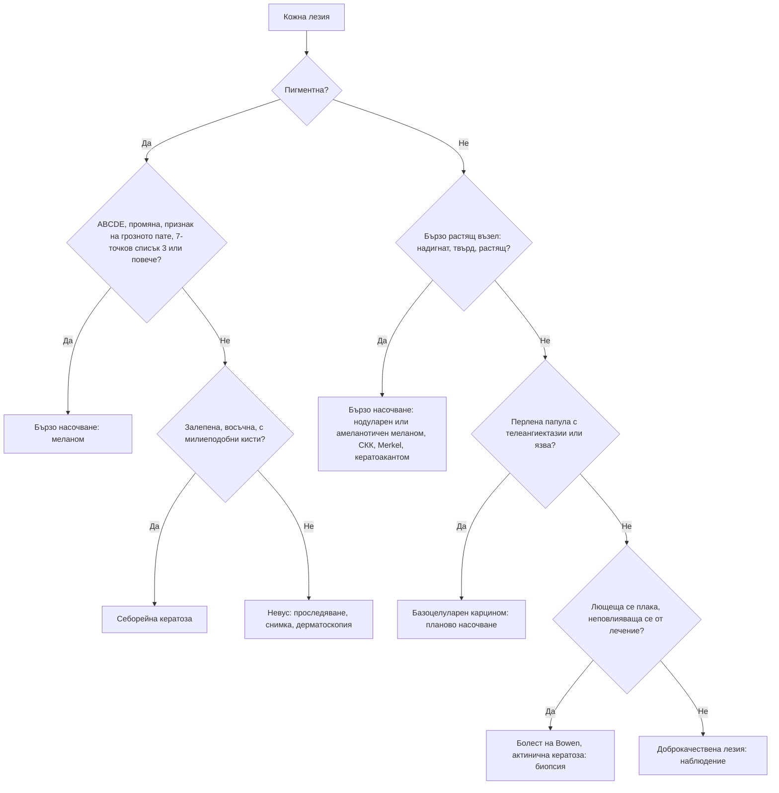

# Глава 57. Пигментни лезии и кожни новообразувания

> **Част XI. Кожа и придатъци**

## Цели на главата

- Да се разпознава меланомът чрез правилото ABCDE, признака на „грозното пате“ и 7-точковия списък.
- Да се помни, че нодуларният и амеланотичният меланом често не отговарят на правилото ABCDE.
- Да се разграничават доброкачествените пигментни лезии (невуси, себорейни кератози, лентиго, дерматофибром) от злокачествените.
- Да се разпознават базоцелуларният и сквамозноклетъчният карцином, актиничната кератоза и болестта на Bowen.
- Да се познават редките, но агресивни тумори: карцином от клетки на Merkel, сарком на Kaposi, кожни метастази.
- Да се определя спешността на насочването.

---

## 1. Меланом

### 1.1. Рискови фактори

- Голям брой невуси (над 50–100), атипични (диспластични) невуси.
- Светла кожа, светли очи, рижа или руса коса, лунички.
- **Слънчеви изгаряния**, особено в детството; **солариуми**.
- **Фамилна анамнеза** за меланом, предшестващ меланом.
- Имуносупресия (трансплантация).
- Големи вродени невуси.

### 1.2. Правило ABCDE

| Буква | Белег |
|---|---|
| **A** | **Асиметрия** |
| **B** | **Неправилни, назъбени граници** (*border*) |
| **C** | **Нееднороден цвят** (*colour*) — няколко нюанса на кафяво, черно, червено, бяло, синьо |
| **D** | **Диаметър > 6 mm** |
| **E** | **Промяна** (*evolution*) — в размера, формата, цвета, релефа; нови симптоми (сърбеж, кървене) |

### 1.3. Седемточков списък (Glasgow)

| Големи критерии (по 2 точки) | Малки критерии (по 1 точка) |
|---|---|
| Промяна в размера | Най-голям диаметър ≥ 7 mm |
| Неправилна форма | Възпаление |
| Неправилен цвят | Мокрене или кървене |
| | Промяна в усещането (сърбеж) |

Британските препоръки (NICE) предвиждат **бързо насочване** при **≥ 3 точки**, а също при дерматоскопия, подозрителна за меланом.

### 1.4. Признак на „грозното пате“

Бенката, която **изглежда различно** от всички останали бенки на пациента, е подозрителна, дори ако отговаря на малко критерии от ABCDE.

### 1.5. Клинични подтипове

| Подтип | Особености |
|---|---|
| **Повърхностно разпространяващ се** | Най-честият; плоска, неправилна, многоцветна лезия; расте хоризонтално месеци до години |
| **Нодуларен** | **Бърз растеж** за седмици–месеци; **не отговаря на ABCD**; **EFG** — надигнат (*elevated*), твърд (*firm*), растящ (*growing*); може да е **амеланотичен** (розов, червен); кърви |
| **Лентиго малигна меланом** | Възрастни хора, слънчево увредено лице; бавно разрастващо се неправилно петно |
| **Акрален лентигинозен** | **Длани, ходила, под нокътя**; по-чест при тъмна кожа; **белег на Hutchinson** — пигментация на нокътната гънка при субунгвален меланом |
| **Амеланотичен** | Розова или червена лезия без пигмент; лесно се бърка с пиогенен гранулом, базоцелуларен карцином или брадавица |
| **Мукозен** | Уста, нос, гениталии, анус |

---

## 2. Доброкачествени пигментни лезии

| Лезия | Ключови белези |
|---|---|
| **Меланоцитни невуси** (бенки) | Симетрични, еднородни, с ясни граници, обикновено < 6 mm; стабилни |
| **Атипични (диспластични) невуси** | По-големи, неравни; маркер за повишен риск; проследяване (дерматоскопия, фотографии) |
| **Син невус** | Синкаво-сив, стабилен |
| **Невус на Spitz** | Деца; розов или кафяв куполовиден възел, бърз растеж — изисква оценка от специалист |
| **Себорейна кератоза** | **„Залепена“** восъчна или брадавичеста лезия, кафява до черна; възрастни хора; при дерматоскопия — **милиеподобни кисти** и **комедоноподобни отвори**. **Внезапната поява на множество себорейни кератози** (белег на Leser-Trélat) може да е паранеопластична (аденокарцином на стомаха) |
| **Соларно лентиго** („старчески петна“) | Равни кафяви петна по слънчево експонираната кожа |
| **Лунички** | Потъмняват през лятото |
| **Дерматофибром** | Твърда папула, обикновено по краката; **„белег на трапчинката“** при притискане отстрани |
| **Ангиом, ангиокератом** | Червени до виолетови папули; „черешовите“ ангиоми са много чести при възрастни хора |
| **Субунгвален хематом** | След травма; **израства с нокътя**. Акралният меланом не израства |
| **Мелазма** | Симетрични кафяви петна по лицето; бременност, орални контрацептиви |
| **Поствъзпалителна хиперпигментация** | На мястото на предишно възпаление |
| **Петна „кафе с мляко“** | При **≥ 6 петна** (> 5 mm преди пубертета, > 15 mm след него) — **неврофиброматоза тип 1** |
| **Acanthosis nigricans** | Кадифено потъмняване в гънките (врат, подмишници); **инсулинова резистентност**; **внезапна и обширна поява** — стомашен аденокарцином |
| **Лекарствена пигментация** | Миноциклин, амиодарон (синкаво-сива), антималарийни средства |
| **Системни причини** | Болест на Addison (кожни гънки, лигавици), хемохроматоза (бронзова кожа), синдром на Peutz-Jeghers (пигментни петна по устните) |

---

## 3. Кератиноцитни карциноми и предракови лезии

| Лезия | Ключови белези | Поведение |
|---|---|---|
| **Базоцелуларен карцином** (най-честият кожен рак) | **Перлено-блестяща папула** с **телеангиектазии** и **навит ръб**, често с централна язва („гризяща язва“); бавен растеж; лице. Разновидности: **повърхностен** (червена лющеща се плака по трупа), **морфеаформен** (подобен на белег) | Рядко метастазира, но локално деструктивен; планово насочване (по-спешно при локализация около очите, носа, ушите и при голям размер) |
| **Сквамозноклетъчен карцином** | Кератотичен възел или язва, често **болезнен**, **бързо растящ**, по слънчево експонираната кожа; висок риск при локализация по **устните и ушите**; **при имуносупресия (трансплантация) рискът е многократно по-висок**; в хронични рани и белези (**язва на Marjolin**) | **Бързо насочване** (метастазира) |
| **Актинична кератоза** | Грапави, лющещи се петна по слънчево експонираната кожа; по-лесно се напипват, отколкото се виждат | Предракова лезия; лечение и проследяване |
| **Болест на Bowen** | Добре ограничена червена лющеща се плака (сквамозноклетъчен карцином *in situ*), неповлияваща се от кортикостероиди | Лечение, биопсия при съмнение |
| **Кератоакантом** | Куполовиден възел с **кератинова тапа**, растящ **бързо за седмици** | Лекува се като сквамозноклетъчен карцином |

---

## 4. Редки, но агресивни кожни тумори

| Тумор | Ключови белези |
|---|---|
| **Карцином от клетки на Merkel** | **Бързо растящ** червен до виолетов възел при възрастни, имунокомпрометирани, по слънчево експонираната кожа. Мнемоника **AEIOU**: безсимптомен (*asymptomatic*), бързо растящ (*expanding rapidly*), имуносупресия, възраст над 50 години (*older*), слънчево експонирана кожа (*UV-exposed*) |
| **Сарком на Kaposi** | Виолетови петна, плаки и възли; **HIV**, трансплантация, **класическа форма при възрастни мъже от Средиземноморието и Балканите** (по подбедриците) |
| **Кожен Т-клетъчен лимфом** (mycosis fungoides) | Персистиращи петна и плаки в защитени от слънцето зони |
| **Дерматофибросарком** | Бавно растяща твърда плака по трупа |
| **Кожни метастази** | Твърди, неболезнени възли; гърда, бял дроб, стомашно-чревен тракт; **възел в пъпа** (на „сестра Мери Джоузеф“) — коремно или тазово злокачествено заболяване |

---

## 5. Други чести кожни новообразувания

| Лезия | Ключови белези |
|---|---|
| **Пиогенен гранулом** | **Бързо растяща, лесно кървяща** червена папула; бременност, травма. **Диференциална диагноза: амеланотичен меланом** — задължителна хистология |
| **Келоид** | Разрастване на белег извън границите на раната |
| **Липом** | Мек, подвижен подкожен възел. Бързо растящ, твърд, > 5 cm или дълбок (под фасцията) — изключване на сарком |
| **Епидермоидна киста** | Възел с централен отвор (пунктум) |
| **Неврофибром** | Мек, „вдлъбващ се“ при натиск възел |
| **Себорейна хиперплазия** | Жълтеникави папули с централна вдлъбнатина по лицето |
| **Ксантелазма** | Жълти плаки по клепачите; изследване на липидите |
| **Молускум контагиозум** | Перлени папули с централна вдлъбнатина; деца; при възрастни — гениталии или **HIV** (при обширни лезии по лицето) |
| **Брадавици** | Вирусни (HPV); плантарни брадавици |

---

## 6. Безопасна диагностична стратегия

| Въпрос | Отговор |
|---|---|
| **Вероятна диагноза** | Меланоцитни невуси, себорейни кератози, соларно лентиго, базоцелуларен карцином, актинична кератоза |
| **Сериозни заболявания, които не бива да се пропускат** | **Меланом** (включително нодуларен, амеланотичен, акрален, субунгвален), **сквамозноклетъчен карцином**, **карцином от клетки на Merkel**, **сарком на Kaposi** (HIV), кожни метастази, кожен лимфом |
| **Чести капани** | **Нодуларен меланом**, който не отговаря на ABCD; **амеланотичен меланом**, приет за пиогенен гранулом или брадавица; **субунгвален меланом**, приет за хематом или гъбична инфекция; болест на Bowen, лекувана като екзем; кератоакантом |
| **Маскиращи заболявания** | Имуносупресия, HIV |
| **Психосоциални аспекти** | Страх от рак; пренебрегване на кожата при възрастни хора, живеещи сами |

---

## 7. Изследвания

- **Пълен преглед на кожата** (включително скалпа, ходилата, между пръстите, ноктите, лигавиците).
- **Дерматоскопия** (от обучен лекар).
- **Фотографско документиране** за проследяване.
- **Ексцизионна биопсия** на подозрителна пигментна лезия с малък резерв. **Частичната (шейвинг) биопсия на подозрителна пигментна лезия не се препоръчва**, защото затруднява определянето на дебелината на меланома.
- Пънч или инцизионна биопсия при другите тумори.

---

## 8. Спешност на насочването

| Находка | Насочване |
|---|---|
| Подозрение за **меланом** (≥ 3 точки по 7-точковия списък, дерматоскопия, признак на „грозното пате“) | **Бързо** (до 2 седмици) |
| Подозрение за **сквамозноклетъчен карцином** | **Бързо** |
| Подозрение за карцином от клетки на Merkel, сарком | **Бързо** |
| **Базоцелуларен карцином** | Планово. По-бързо при локализация около очите, носа, ушите, при голям размер или при имуносупресия |
| Актинична кератоза, себорейна кератоза | Лечение в общата практика или планово насочване |

---

## 9. Диагностичен алгоритъм

---

## 10. Клинични перли

- Нодуларният меланом често е симетричен, малък и едноцветен, но расте бързо. Мислете за „EFG“: надигнат, твърд, растящ.
- Бързо растящата, лесно кървяща червена папула не се премахва без хистологично изследване. Може да е амеланотичен меланом.
- Тъмна надлъжна ивица на нокътя, която се разширява или е с пигментация на околонокътната гънка: субунгвален меланом.
- Субунгвалният хематом израства с нокътя. Меланомът остава на мястото си.
- Пациентите след трансплантация имат многократно по-висок риск от сквамозноклетъчен карцином. Необходими са редовни прегледи на кожата.
- Внезапна поява на множество себорейни кератози или обширна acanthosis nigricans при възрастен човек: търсете злокачествено заболяване на стомашно-чревния тракт.
- Персистираща „язвичка“ по лицето, която кърви и не зараства: базоцелуларен карцином.
- Хронична рана, която се променя или не зараства месеци наред: биопсия (язва на Marjolin).
- Пълният преглед на кожата при всеки удобен случай спасява животи.

---

## 11. Клиничен случай

**Случай.** Мъж на 67 години идва заради „брадавица“ на гърба, която съпругата му е забелязала преди 3 месеца. Оттогава тя е нараснала и е започнала да кърви при триене с дрехите. Лезията е 8 mm, куполовидна, **твърда**, тъмночервена до черна, **симетрична** и сравнително **еднородна** по цвят.

**Въпроси.** 1) Отговаря ли лезията на критериите ABCD? 2) Коя е най-опасната диагноза?

**Обсъждане.** Лезията е симетрична и относително еднородна, т.е. не отговаря на „класическите“ критерии A, B и C. Тя обаче е **надигната, твърда и расте бързо** („EFG“), кърви и е „нова“ при човек над 60 години. Тези белези са силно подозрителни за **нодуларен меланом** — най-агресивният подтип, който расте вертикално и бързо. Пациентът се насочва **бързо** за ексцизионна биопсия. Хистологията показва нодуларен меланом с дебелина по Breslow 3,2 mm и улцерация. Следват стадиране и биопсия на сентинелния лимфен възел.

**Поука.** Правилото ABCDE не улавя всички меланоми. Бързо растящата, твърда, кървяща лезия е подозрителна, независимо от симетрията и цвета.
