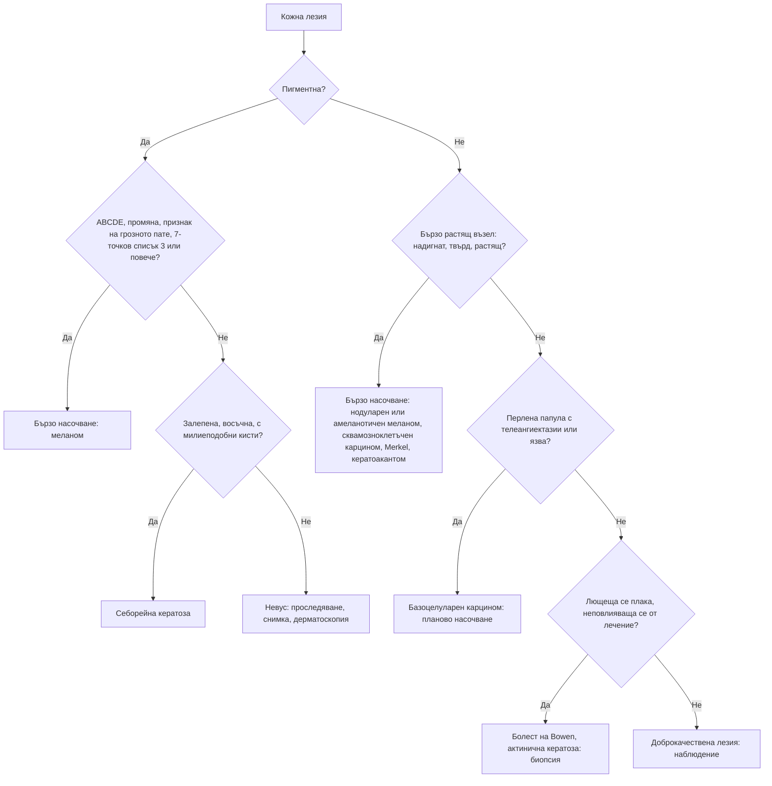

# Глава 57. Пигментни лезии и кожни новообразувания

> **Част XI. Кожа и придатъци**

## Цели на главата

- Да се разпознава меланомът чрез правилото ABCDE, признака на „грозното пате“ и 7-точковия списък.
- Да се разпознават нодуларният и амеланотичният меланом, които често не отговарят на правилото ABCDE (признаци EFG).
- Да се разграничават доброкачествените пигментни лезии (невуси, себорейни кератози, лентиго, дерматофибром) от злокачествените.
- Да се разпознават базоцелуларният и сквамозноклетъчният карцином, актиничната кератоза и болестта на Bowen.
- Да се познават редките, но агресивни тумори: карцином от клетки на Merkel, сарком на Kaposi, кожни метастази.
- Да се определя спешността на насочването.

## Ключови моменти

- Пигментна лезия с 3 или повече точки по претегления 7-точков списък или с дерматоскопия, подозрителна за меланом, се насочва бързо (до 2 седмици) *(SORT C [2])*.
- Нодуларният меланом често е симетричен, едноцветен и непигментиран и не отговаря на ABCD. Надигнат, твърд и растящ възел (EFG) е подозрителен *(SORT B [5])*.
- Дерматоскопията от обучен лекар подобрява точността на диагнозата на меланома в сравнение с огледа с просто око *(SORT B [11])*.
- Подозрителната пигментна лезия се изрязва изцяло с малък резерв. Повърхностна (шейвинг) биопсия не се прави *(SORT C [13])*.
- Сквамозноклетъчният карцином се насочва бързо, а базоцелуларният обикновено планово. Пациентите след трансплантация имат многократно по-висок риск от сквамозноклетъчен карцином *(SORT C [2, 9])*.
- Безболезнен, бързо растящ червен възел при възрастен или имунокомпрометиран човек може да е карцином от клетки на Merkel (AEIOU) *(SORT C [10])*.

---

## 1. Меланом

### 1.1. Рискови фактори

- Голям брой невуси (над 50–100), атипични (диспластични) невуси.
- Светла кожа, светли очи, рижа или руса коса, лунички.
- Слънчеви изгаряния, особено в детството; солариуми.
- **Фамилна анамнеза** за меланом, предшестващ меланом.
- Имуносупресия (трансплантация).
- Големи вродени невуси.

### 1.2. Правило ABCDE

*Таблица 57.1. Меланом: правило ABCDE.*

| Буква | Белег |
|---|---|
| **A** | **Асиметрия** |
| **B** | Неправилни, назъбени граници (*border*) |
| **C** | Нееднороден цвят (*colour*) – няколко нюанса на кафяво, черно, червено, бяло, синьо |
| **D** | **Диаметър > 6 mm** |
| **E** | Промяна (*evolution*) – в размера, формата, цвета, релефа; нови симптоми (сърбеж, кървене) [1] |

### 1.3. Седемточков списък (Glasgow)

*Таблица 57.2. Меланом: седемточков списък (Glasgow).*

| Големи критерии (по 2 точки) | Малки критерии (по 1 точка) |
|---|---|
| Промяна в размера | Най-голям диаметър ≥ 7 mm |
| Неправилна форма | Възпаление |
| Неправилен цвят | Мокрене или кървене |
| | Промяна в усещането (сърбеж) |

Британските препоръки (NICE) предвиждат бързо насочване при ≥ 3 точки, а също при дерматоскопия, подозрителна за меланом [2]. В общата практика списъкът има висока чувствителност за меланом, но ниска специфичност [3].

### 1.4. Признак на „грозното пате“

Бенката, която **изглежда различно** от всички останали бенки на пациента, е подозрителна, дори ако отговаря на малко критерии от ABCDE [4].

### 1.5. Клинични подтипове

*Таблица 57.3. Меланом: клинични подтипове.*

| Подтип | Особености |
|---|---|
| **Повърхностно разпространяващ се** | Най-честият; плоска, неправилна, многоцветна лезия; расте хоризонтално месеци до години |
| **Нодуларен** | Бърз растеж за седмици–месеци; не отговаря на ABCD; EFG – надигнат (*elevated*), твърд (*firm*), растящ (*growing*); може да е амеланотичен (розов, червен); кърви [5] |
| **Лентиго малигна меланом** | Възрастни хора, слънчево увредено лице; бавно разрастващо се неправилно петно |
| **Акрален лентигинозен** | Длани, ходила, под нокътя; по-чест при тъмна кожа; белег на Hutchinson – пигментация на нокътната гънка при субунгвален меланом [6] |
| **Амеланотичен** | Розова или червена лезия без пигмент; лесно се бърка с пиогенен гранулом, базоцелуларен карцином или брадавица |
| **Мукозен** | Уста, нос, гениталии, анус |

---

## 2. Доброкачествени пигментни лезии

*Таблица 57.4. Доброкачествени пигментни лезии.*

| Лезия | Ключови белези |
|---|---|
| **Меланоцитни невуси** (бенки) | Симетрични, еднородни, с ясни граници, обикновено < 6 mm; стабилни |
| **Атипични (диспластични) невуси** | По-големи, неравни; маркер за повишен риск; проследяване (дерматоскопия, фотографии) |
| **Син невус** | Синкаво-сив, стабилен |
| **Невус на Spitz** | Деца; розов или кафяв куполовиден възел, бърз растеж – изисква оценка от специалист |
| **Себорейна кератоза** | „Залепена“ восъчна или брадавичеста лезия, кафява до черна; възрастни хора; при дерматоскопия – милиеподобни кисти и комедоноподобни отвори. Внезапната поява на множество себорейни кератози (белег на Leser-Trélat) може да е паранеопластична (аденокарцином на стомаха) |
| **Соларно лентиго** („старчески петна“) | Равни кафяви петна по слънчево експонираната кожа |
| **Лунички** | Потъмняват през лятото |
| **Дерматофибром** | Твърда папула, обикновено по краката; „белег на трапчинката“ при притискане отстрани |
| **Ангиом, ангиокератом** | Червени до виолетови папули; „черешовите“ ангиоми са много чести при възрастни хора |
| **Субунгвален хематом** | След травма; израства с нокътя. Акралният меланом не израства |
| **Мелазма** | Симетрични кафяви петна по лицето; бременност, орални контрацептиви |
| **Поствъзпалителна хиперпигментация** | На мястото на предишно възпаление |
| **Петна „кафе с мляко“** | При ≥ 6 петна (> 5 mm преди пубертета, > 15 mm след него) – подозрение за неврофиброматоза тип 1; за диагнозата са нужни поне два критерия [7] |
| **Acanthosis nigricans** | Кадифено потъмняване в гънките (врат, подмишници); инсулинова резистентност; внезапна и обширна поява – стомашен аденокарцином |
| **Лекарствена пигментация** | Миноциклин, амиодарон (синкаво-сива), антималарийни средства |
| **Системни причини** | Болест на Addison (кожни гънки, лигавици), хемохроматоза (бронзова кожа), синдром на Peutz-Jeghers (пигментни петна по устните) |

---

## 3. Кератиноцитни карциноми и предракови лезии

*Таблица 57.5. Кератиноцитни карциноми и предракови лезии.*

| Лезия | Ключови белези | Поведение |
|---|---|---|
| **Базоцелуларен карцином** (най-честият кожен рак [8]) | Перлено-блестяща папула с телеангиектазии и навит ръб, често с централна язва („гризяща язва“); бавен растеж; лице. Разновидности: повърхностен (червена лющеща се плака по трупа), морфеаформен (подобен на белег) | Рядко метастазира, но локално деструктивен; планово насочване (по-спешно при локализация около очите, носа, ушите и при голям размер) [2] |
| **Сквамозноклетъчен карцином** | Кератотичен възел или язва, често болезнен, бързо растящ, по слънчево експонираната кожа; висок риск при локализация по устните и ушите; при имуносупресия (трансплантация) рискът е многократно по-висок [9]; в хронични рани и белези (язва на Marjolin) | Бързо насочване (метастазира) [2] |
| **Актинична кератоза** | Грапави, лющещи се петна по слънчево експонираната кожа; по-лесно се напипват, отколкото се виждат | Предракова лезия; лечение и проследяване |
| **Болест на Bowen** | Добре ограничена червена лющеща се плака (сквамозноклетъчен карцином *in situ*), неповлияваща се от кортикостероиди | Лечение, биопсия при съмнение |
| **Кератоакантом** | Куполовиден възел с кератинова тапа, растящ бързо за седмици | Лекува се като сквамозноклетъчен карцином |

---

## 4. Редки, но агресивни кожни тумори

*Таблица 57.6. Редки, но агресивни кожни тумори.*

| Тумор | Ключови белези |
|---|---|
| **Карцином от клетки на Merkel** | Бързо растящ червен до виолетов възел при възрастни, имунокомпрометирани, по слънчево експонираната кожа. Мнемоника AEIOU: безсимптомен (*asymptomatic*), бързо растящ (*expanding rapidly*), имуносупресия, възраст над 50 години (*older*), слънчево експонирана кожа (*UV-exposed*). Около 89% от туморите имат поне три от тези белези, а над половината първоначално се приемат за доброкачествени, най-често за киста [10] |
| **Сарком на Kaposi** | Виолетови петна, плаки и възли; HIV, трансплантация, класическа форма при възрастни мъже от Средиземноморието и Балканите (по подбедриците) |
| **Кожен Т-клетъчен лимфом** (mycosis fungoides) | Персистиращи петна и плаки в защитени от слънцето зони |
| **Дерматофибросарком** | Бавно растяща твърда плака по трупа |
| **Кожни метастази** | Твърди, неболезнени възли; гърда, бял дроб, стомашно-чревен тракт; възел в пъпа (на „сестра Мери Джоузеф“) – коремно или тазово злокачествено заболяване |

---

## 5. Други чести кожни новообразувания

*Таблица 57.7. Други чести кожни новообразувания.*

| Лезия | Ключови белези |
|---|---|
| **Пиогенен гранулом** | Бързо растяща, лесно кървяща червена папула; бременност, травма. Диференциална диагноза: амеланотичен меланом – задължителна хистология |
| **Келоид** | Разрастване на белег извън границите на раната |
| **Липом** | Мек, подвижен подкожен възел. Нарастващ, твърд, > 5 cm или дълбок (под фасцията) – ехография до 2 седмици за изключване на сарком [2] |
| **Епидермоидна киста** | Възел с централен отвор (пунктум) |
| **Неврофибром** | Мек, „вдлъбващ се“ при натиск възел |
| **Себацейна хиперплазия** (хиперплазия на мастните жлези) | Жълтеникави папули с централна вдлъбнатина по лицето; да не се бърка с базоцелуларен карцином |
| **Ксантелазма** | Жълти плаки по клепачите; изследване на липидите |
| **Молускум контагиозум** | Перлени папули с централна вдлъбнатина; деца; при възрастни – гениталии или HIV (при обширни лезии по лицето) |
| **Брадавици** | Вирусни (HPV); плантарни брадавици |

---

## 6. Безопасна диагностична стратегия

*Таблица 57.8. Безопасна диагностична стратегия.*

| Въпрос | Отговор |
|---|---|
| **Вероятна диагноза** | Меланоцитни невуси, себорейни кератози, соларно лентиго, базоцелуларен карцином, актинична кератоза |
| **Сериозни заболявания, които не бива да се пропускат** | Меланом (включително нодуларен, амеланотичен, акрален, субунгвален), сквамозноклетъчен карцином, карцином от клетки на Merkel, сарком на Kaposi (HIV), кожни метастази, кожен лимфом |
| **Чести капани** | Нодуларен меланом, който не отговаря на ABCD; амеланотичен меланом, приет за пиогенен гранулом или брадавица; субунгвален меланом, приет за хематом или гъбична инфекция; болест на Bowen, лекувана като екзем; кератоакантом |
| **Маскиращи заболявания** | Имуносупресия, HIV |
| **Психосоциални аспекти** | Страх от рак; пренебрегване на кожата при възрастни хора, живеещи сами |

---

## 7. Изследвания

- **Пълен преглед на кожата** (включително скалпа, ходилата, между пръстите, ноктите, лигавиците).
- **Дерматоскопия** (от обучен лекар). Добавена към огледа, тя повишава точността: при еднаква специфичност (80%) чувствителността за меланом е около 92% срещу 76% само при оглед [11].
- **Фотографско документиране** за проследяване. При пациенти с висок риск се използват дигитална дерматоскопия и фотографии на цялото тяло [12].
- **Хистологично потвърждение** при всяко подозрение за меланом [12].
- Ексцизионна биопсия на цялата подозрителна пигментна лезия с малък резерв (1–3 mm) [13]. Повърхностната (шейвинг) биопсия не се използва при подозрение за меланом, защото може да пресече тумора и да попречи на определянето на дебелината по Breslow [13]. Частична (инцизионна) биопсия се прави само по изключение, например при много голяма лезия или при локализация по лицето, дланите и ходилата.
- Пънч или инцизионна биопсия при другите тумори. Базоцелуларният карцином често се диагностицира клинично и дерматоскопски, а при съмнение се потвърждава хистологично [8]. Сквамозноклетъчният карцином винаги се потвърждава хистологично [14].

---

## 8. Диагностичен алгоритъм

*Фигура 57.1. Диагностичен алгоритъм: пигментни лезии и кожни новообразувания. Схема на авторите въз основа на източниците, цитирани в главата.*

Текстово описание на фигура 57.1

1. Кожна лезия. Следва: към т. 2.
2. **Въпрос:** Пигментна? Да – към т. 3; Не – към т. 4.
3. **Въпрос:** ABCDE, промяна, признак на грозното пате, 7-точков списък 3 или повече? Да – към т. 5; Не – към т. 6.
4. **Въпрос:** Бързо растящ възел: надигнат, твърд, растящ? Да – към т. 7; Не – към т. 8.
5. Бързо насочване: меланом.
6. **Въпрос:** Залепена, восъчна, с милиеподобни кисти? Да – към т. 9; Не – към т. 10.
7. Бързо насочване: нодуларен или амеланотичен меланом, сквамозноклетъчен карцином, Merkel, кератоакантом.
8. **Въпрос:** Перлена папула с телеангиектазии или язва? Да – към т. 11; Не – към т. 12.
9. Себорейна кератоза.
10. Невус: проследяване, снимка, дерматоскопия.
11. Базоцелуларен карцином: планово насочване.
12. **Въпрос:** Лющеща се плака, неповлияваща се от лечение? Да – към т. 13; Не – към т. 14.
13. Болест на Bowen, актинична кератоза: биопсия.
14. Доброкачествена лезия: наблюдение.

---

## 9. Червени флагове и насочване

### 9.1. Червени флагове

- Нова пигментна лезия при възрастен или промяна в размера, формата или цвета на съществуваща.
- Лезия, която се различава от всички останали („грозното пате“).
- Бързо растящ, надигнат и твърд възел, пигментиран или розов.
- Кървене, разязвяване или мокрене на лезия без травма.
- Тъмна надлъжна ивица на нокътя, която се разширява, или пигментация на околонокътната гънка.
- Бързо растящ безболезнен червен или виолетов възел при възрастен или имунокомпрометиран човек.
- Бързо растящ, болезнен или кератотичен възел по слънчево експонираната кожа, особено по устните и ушите или при имуносупресия.
- Незарастваща рана или язва в стар белег или хронична рана.

### 9.2. Кога и колко спешно да насочим

*Таблица 57.9. Кога и колко спешно да насочим.*

| Спешност | Клинична ситуация |
|---|---|
| **Бързо (до 2 седмици)** | Подозрение за меланом: 3 или повече точки по 7-точковия списък, дерматоскопия, подозрителна за меланом, или лезия, подозрителна за нодуларен меланом [2]; подозрение за сквамозноклетъчен карцином [2]; подозрение за карцином от клетки на Merkel [10]; нарастващ подкожен възел – ехография до 2 седмици за изключване на сарком [2] |
| **Планово** | Базоцелуларен карцином – по-бързо при локализация около очите, носа и ушите, при голям размер или при имуносупресия [2]; невус на Spitz; множество атипични невуси при висок риск – проследяване с дигитална дерматоскопия [12]; пациенти след трансплантация – редовни прегледи на кожата [9] |
| **Проследяване в общата практика** | Себорейни кератози, соларно лентиго, дерматофибром и стабилни невуси; актинична кератоза – лечение и проследяване; фотографско документиране на лезии, които се наблюдават |

---

## 10. Клинични перли

- Нодуларният меланом често е симетричен, малък и едноцветен, но расте бързо. Приложете правилото „EFG“: надигнат, твърд, растящ.
- Бързо растящата, лесно кървяща червена папула не се премахва без хистологично изследване. Може да е амеланотичен меланом.
- Тъмна надлъжна ивица на нокътя, която се разширява или е с пигментация на околонокътната гънка: субунгвален меланом.
- Субунгвалният хематом израства с нокътя. Меланомът остава на мястото си.
- Пациентите след трансплантация имат многократно по-висок риск от сквамозноклетъчен карцином. Необходими са редовни прегледи на кожата.
- Внезапна поява на множество себорейни кератози или обширна acanthosis nigricans при възрастен човек: търсете злокачествено заболяване на стомашно-чревния тракт.
- Персистираща „язвичка“ по лицето, която кърви и не зараства: базоцелуларен карцином.
- Хронична рана, която се променя или не зараства месеци наред: биопсия (язва на Marjolin).
- Пациентът показва една лезия, но подозрителната може да е другаде. Прегледайте цялата кожа, включително скалпа, ходилата и ноктите.

---

## 11. Клиничен случай

**Етап 1 – клинична картина.** Мъж на 67 години идва заради „брадавица“ на гърба, която съпругата му е забелязала преди 3 месеца. Оттогава тя е нараснала и е започнала да кърви при триене с дрехите. Работил е като строител на открито и е имал много слънчеви изгаряния.

> **Въпрос 1.** Какво ще попитате и какво ще прегледате?

**Етап 2 – преглед.** Лезията е 8 mm, куполовидна, твърда, тъмночервена до черна, симетрична и сравнително еднородна по цвят. При допир повърхността ѝ кърви. При пълния преглед на кожата няма други подозрителни лезии, а регионалните лимфни възли не са увеличени.

> **Въпрос 2.** Отговаря ли лезията на критериите ABCD и колко точки има по 7-точковия списък?

> **Въпрос 3.** Колко спешно се насочва пациентът и каква биопсия е подходяща?

Обсъждане и отговори

**Отговор 1.** Питат се началото и промяната на лезията, симптомите (сърбеж, кървене), слънчевите изгаряния, фамилната анамнеза, предишен кожен рак и имуносупресия. Преглеждат се цялата кожа, скалпът, ноктите и лигавиците и се палпират регионалните лимфни възли.

**Отговор 2.** Лезията е симетрична и относително еднородна, т.е. не отговаря на „класическите“ критерии A, B и C. Тя обаче е надигната, твърда и расте бързо („EFG“), кърви и е нова при човек над 60 години. Тези белези са силно подозрителни за нодуларен меланом [5]. По претегления 7-точков списък има 4 точки: промяна в размера (2), диаметър ≥ 7 mm (1) и кървене (1).

**Отговор 3.** Пациентът се насочва **бързо** (до 2 седмици) [2]. Лезията се изрязва изцяло с резерв 1–3 mm, без шейвинг биопсия [13]. Хистологията показва нодуларен меланом с дебелина по Breslow 3,2 mm и улцерация. Следват биопсия на сентинелния лимфен възел и образно стадиране [12].

**Поука.** Правилото ABCDE не улавя всички меланоми. Бързо растящата, твърда, кървяща лезия е подозрителна, независимо от симетрията и цвета.

---

## Визуални примери

Учебникът не съдържа собствени изображения. Типичните находки могат да се видят в свободно достъпни атласи (връзките са проверени през септември 2026 г.):

- Меланом – [DermNet](https://dermnetnz.org/topics/melanoma)
- Базалноклетъчен карцином – [DermNet](https://dermnetnz.org/topics/basal-cell-carcinoma)
- Плоскоклетъчен карцином на кожата – [DermNet](https://dermnetnz.org/topics/cutaneous-squamous-cell-carcinoma)
- Себорейна кератоза – [DermNet](https://dermnetnz.org/topics/seborrhoeic-keratosis)
- Актинична кератоза – [DermNet](https://dermnetnz.org/topics/actinic-keratosis)

---

## Обобщение

- Меланомът се подозира по правилото ABCDE, признака на „грозното пате“ и претегления 7-точков списък. При 3 или повече точки или дерматоскопия, подозрителна за меланом, пациентът се насочва бързо.
- Нодуларният и амеланотичният меланом често не отговарят на ABCD. Надигнат, твърд и растящ възел е подозрителен (EFG).
- Себорейната кератоза, невусите, соларното лентиго и дерматофибромът имат характерни белези. Внезапната поява на множество себорейни кератози или обширна acanthosis nigricans изисква търсене на злокачествено заболяване.
- Сквамозноклетъчният карцином и карциномът от клетки на Merkel се насочват бързо, а базоцелуларният обикновено планово.
- Подозрителната пигментна лезия се изрязва изцяло с малък резерв и се изследва хистологично.

## Самопроверка

### Въпроси с един верен отговор

**1.** *(основно ниво)* Жена на 45 години има бенка на подбедрицата, която се е увеличила през последните 4 месеца. Бенката е с неправилна форма, 6 mm, еднородно кафява, без възпаление, мокрене или сърбеж. Колко точки има по претегления 7-точков списък и какво е поведението?

- **А.** 2 точки – контрол след 3 месеца
- **Б.** 4 точки – бързо насочване (до 2 седмици)
- **В.** 3 точки – планово насочване
- **Г.** 4 точки – шейвинг биопсия в кабинета
- **Д.** 1 точка – успокояване

Отговор и обосновка

**Верен отговор: Б.** Промяната в размера и неправилната форма са големи критерии по 2 точки. При 3 или повече точки пациентът се насочва бързо [2]. Шейвинг биопсия при подозрение за меланом не се прави [13].

**2.** *(основно ниво)* Мъж на 72 години има множество кафяви, „залепени“, восъчни лезии по гърба от години. При дерматоскопия се виждат милиеподобни кисти и комедоноподобни отвори. Коя е най-вероятната диагноза?

- **А.** Меланом
- **Б.** Себорейна кератоза
- **В.** Базоцелуларен карцином
- **Г.** Актинична кератоза
- **Д.** Дерматофибром

Отговор и обосновка

**Верен отговор: Б.** „Залепеният“ восъчен вид, милиеподобните кисти и комедоноподобните отвори са типични за себорейна кератоза. Внезапната поява на множество такива лезии изисква търсене на злокачествено заболяване.

**3.** *(основно ниво)* Мъж на 55 години има тъмна надлъжна ивица на нокътя на палеца от година. Ивицата се разширява, а пигментацията обхваща и околонокътната гънка. Не помни травма. Кое е правилното поведение?

- **А.** Локален антимикотик
- **Б.** Наблюдение, докато нокътят израсне
- **В.** Бързо насочване за биопсия на нокътното легло
- **Г.** Успокояване – субунгвален хематом
- **Д.** Контрол след 12 месеца

Отговор и обосновка

**Верен отговор: В.** Разширяващата се ивица и пигментацията на околонокътната гънка (белег на Hutchinson) са подозрителни за субунгвален меланом [6]. Хематомът израства с нокътя и не засяга гънката.

**4.** *(напреднало ниво)* Жена на 78 години с хронична лимфоцитна левкемия има безболезнен червено-виолетов възел на бузата, нараснал за 6 седмици до 1,5 cm. Коя е най-вероятната диагноза?

- **А.** Епидермоидна киста
- **Б.** Карцином от клетки на Merkel
- **В.** Пиогенен гранулом
- **Г.** Базоцелуларен карцином
- **Д.** Черешов ангиом

Отговор и обосновка

**Верен отговор: Б.** Безболезненият, бързо растящ червен възел по слънчево експонираната кожа при възрастна жена с имуносупресия отговаря на признаците AEIOU. Хроничната лимфоцитна левкемия е над 30 пъти по-честа при болните с карцином от клетки на Merkel [10].

**5.** *(напреднало ниво)* Мъж на 58 години има бързо растяща, лесно кървяща червена папула на ходилото от 2 месеца без предшестваща травма. Колега предлага да я премахне с електрокоагулация. Кое е правилното поведение?

- **А.** Електрокоагулация без хистологично изследване
- **Б.** Криотерапия
- **В.** Ексцизия с хистологично изследване (при нужда след насочване)
- **Г.** Локален антибиотик и контрол след месец
- **Д.** Каутеризация със сребърен нитрат

Отговор и обосновка

**Верен отговор: В.** Бързо растящата кървяща папула може да е амеланотичен меланом, който имитира пиогенен гранулом [5]. Непигментирана лезия, подозрителна за нодуларен меланом, се насочва бързо [2]. Унищожаването без хистология пропуска диагнозата.

### Задача

Мъж на 52 години е с бъбречна трансплантация от 10 години. Има множество актинични кератози, а от месец – бързо растящ, болезнен кератотичен възел на ухото. Как ще подходите?

Решение

Най-вероятен е **сквамозноклетъчен карцином**. Рискът е многократно по-висок при имуносупресия след трансплантация [9]. Пациентът се насочва бързо (до 2 седмици) при подозрение за рак [2]. Диагнозата винаги се потвърждава хистологично [14]. Преглеждат се цялата кожа и регионалните лимфни възли. Трансплантационният екип се информира, защото може да се обсъди промяна на имуносупресията. Пациентът се съветва за строга фотозащита и за редовни прегледи на кожата при дерматолог.

### OSCE станция: Оценка на пигментна лезия и обяснение на пациента

**Време:** 8 минути. **Ниво:** основно (студенти, специализанти).

**Задача за кандидата.** Мъж на 50 години е загрижен за бенка на гърба. Снемете насочена анамнеза, оценете лезията по снимката и обяснете на пациента следващите стъпки.

**Информация за симулирания пациент (за изпитващия).** Бенката е нараснала за 6 месеца и понякога сърби. На снимката е 9 mm, с неправилна форма и с няколко нюанса на кафяво и черно, без възпаление и мокрене. Пациентът е притеснен, че „има рак“.

*Таблица 57.10. OSCE станция „Оценка на пигментна лезия и обяснение на пациента“ – критерии за оценяване.*

| Критерий | Точки |
|---|---|
| Пита за начало, промяна и симптоми (сърбеж, кървене) | 1 |
| Пита за рискови фактори: слънчеви изгаряния, солариум, фамилна анамнеза, предишен меланом, имуносупресия | 2 |
| Прилага ABCDE и признака на „грозното пате“ | 2 |
| Изчислява правилно 7-точковия списък (8 точки) | 2 |
| Предлага преглед на цялата кожа и палпация на регионалните лимфни възли | 1 |
| Обяснява с разбираем език нуждата от бързо насочване и изрязване на лезията и проверява разбирането | 2 |
| **Общо** | **10** |

**Праг за успешно изпълнение:** 7 от 10 точки, включително правилното решение за бързо насочване.

## Литература

1. Abbasi NR, Shaw HM, Rigel DS, Friedman RJ, McCarthy WH, Osman I, et al. Early diagnosis of cutaneous melanoma: revisiting the ABCD criteria. JAMA. 2004;292(22):2771-6. doi:10.1001/jama.292.22.2771. PMID: 15585738.
2. National Institute for Health and Care Excellence. Suspected cancer: recognition and referral (NICE guideline NG12). London: NICE; 2015 [актуализирано 2026]. Достъпно на: https://www.nice.org.uk/guidance/ng12
3. Walter FM, Prevost AT, Vasconcelos J, Hall PN, Burrows NP, Morris HC, et al. Using the 7-point checklist as a diagnostic aid for pigmented skin lesions in general practice: a diagnostic validation study. Br J Gen Pract. 2013;63(610):e345-53. doi:10.3399/bjgp13X667213. PMID: 23643233.
4. Grob JJ, Bonerandi JJ. The 'ugly duckling' sign: identification of the common characteristics of nevi in an individual as a basis for melanoma screening. Arch Dermatol. 1998;134(1):103-4. doi:10.1001/archderm.134.1.103-a. PMID: 9449921.
5. Chamberlain AJ, Fritschi L, Kelly JW. Nodular melanoma: patients' perceptions of presenting features and implications for earlier detection. J Am Acad Dermatol. 2003;48(5):694-701. doi:10.1067/mjd.2003.216. PMID: 12734497.
6. Levit EK, Kagen MH, Scher RK, Grossman M, Altman E. The ABC rule for clinical detection of subungual melanoma. J Am Acad Dermatol. 2000;42(2 Pt 1):269-74. doi:10.1016/S0190-9622(00)90137-3. PMID: 10642684.
7. Legius E, Messiaen L, Wolkenstein P, Pancza P, Avery RA, Berman Y, et al. Revised diagnostic criteria for neurofibromatosis type 1 and Legius syndrome: an international consensus recommendation. Genet Med. 2021;23(8):1506-1513. doi:10.1038/s41436-021-01170-5. PMID: 34012067.
8. Peris K, Fargnoli MC, Kaufmann R, Arenberger P, Bastholt L, Seguin NB, et al. European consensus-based interdisciplinary guideline for diagnosis and treatment of basal cell carcinoma-update 2023. Eur J Cancer. 2023;192:113254. doi:10.1016/j.ejca.2023.113254. PMID: 37604067.
9. Euvrard S, Kanitakis J, Claudy A. Skin cancers after organ transplantation. N Engl J Med. 2003;348(17):1681-91. doi:10.1056/NEJMra022137. PMID: 12711744.
10. Heath M, Jaimes N, Lemos B, Mostaghimi A, Wang LC, Peñas PF, et al. Clinical characteristics of Merkel cell carcinoma at diagnosis in 195 patients: the AEIOU features. J Am Acad Dermatol. 2008;58(3):375-81. doi:10.1016/j.jaad.2007.11.020. PMID: 18280333.
11. Dinnes J, Deeks JJ, Chuchu N, Ferrante di Ruffano L, Matin RN, Thomson DR, et al. Dermoscopy, with and without visual inspection, for diagnosing melanoma in adults. Cochrane Database Syst Rev. 2018;12(12):CD011902. doi:10.1002/14651858.CD011902.pub2. PMID: 30521682.
12. Garbe C, Amaral T, Peris K, Hauschild A, Arenberger P, Basset-Seguin N, et al. European consensus-based interdisciplinary guideline for melanoma. Part 1: Diagnostics - Update 2024. Eur J Cancer. 2025;215:115152. doi:10.1016/j.ejca.2024.115152. PMID: 39700658.
13. Swetter SM, Tsao H, Bichakjian CK, Curiel-Lewandrowski C, Elder DE, Gershenwald JE, et al. Guidelines of care for the management of primary cutaneous melanoma. J Am Acad Dermatol. 2019;80(1):208-250. doi:10.1016/j.jaad.2018.08.055. PMID: 30392755.
14. Stratigos AJ, Dessinioti C, Garbe C, Lebbe C, Amaral T, Bataille V, et al. European consensus-based interdisciplinary guideline for invasive cutaneous squamous cell carcinoma. Part 1: Diagnostics and prevention - Update 2026. Eur J Cancer. 2026;243:116763. doi:10.1016/j.ejca.2026.116763. PMID: 42248744.

*Последна проверка на съдържанието: септември 2026 г. Следващ планиран преглед: септември 2027 г. (вж. „Политика за актуализация“ в README).*

<!-- навигация -->

---

[← Глава 56. Сърбеж и уртикария](56-srabezh-urtikaria.md) · [Съдържание](../README.md) · [Глава 58. Кожни язви, косопад и промени в ноктите →](58-yazvi-kosopad-nokti.md)
