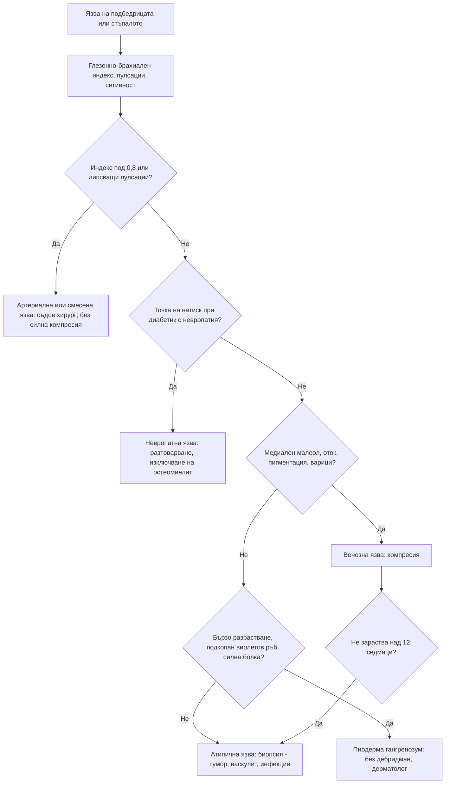

# Глава 58. Кожни язви, косопад и промени в ноктите

> **Част XI. Кожа и придатъци**

## Цели на главата

- Да се разграничават венозните, артериалните, невропатните и атипичните язви на краката.
- Да се определят показанията за биопсия при незарастваща или атипична язва.
- Да се разпознава пиодерма гангренозум и да се избягва дебридманът при нея.
- Да се класифицира косопадът на цикатрициален и нецикатрициален, дифузен и огнищен.
- Да се тълкуват промените в ноктите като признаци на системни заболявания.

---

## А. ЯЗВИ НА ПОДБЕДРИЦАТА И СТЪПАЛОТО

## 1. Основни видове язви

| Белег | **Венозна** (≈ 70%) | **Артериална** (≈ 10–20%) | **Невропатна** (диабетна) |
|---|---|---|---|
| Локализация | **Медиален малеол**, долната трета на подбедрицата („зоната на гамашите“) | **Латерален малеол**, пръсти, пета, места на натиск | **Точки на натоварване по ходилото** (глави на метатарзалните кости, пета) |
| Вид | Повърхностна, **неправилна**, **мокреща**, гранулации | **„Изсечена“**, дълбока, бледа основа, суха | Кръгла, с **ръб от мазол** |
| Болка | Умерена, облекчава се при повдигане на крака | **Силна**, засилва се нощем и при повдигане, облекчава се при спускане на крака | **Липсва** (невропатия) |
| Околна кожа | **Хемосидеринова пигментация**, **липодерматосклероза**, екзем, варици, **оток** | Бледа, студена, лъскава, **без окосмяване** | Суха, напукана, мазоли |
| Пулсации | Запазени | **Отслабени или липсващи** | Обикновено запазени (освен при съпътстваща периферна артериална болест) |
| Глезенно-брахиален индекс | > 0,8 | < 0,8 (< 0,5 при тежка исхемия) | Може да е фалшиво висок (калцирани артерии) |

**Преди компресивна терапия задължително се измерва глезенно-брахиалният индекс.** Компресията е опасна при значима артериална недостатъчност.

## 2. Атипични язви

| Причина | Ключови белези |
|---|---|
| **Пиодерма гангренозум** | **Бързо разрастваща се, много болезнена** язва с **подкопан виолетов ръб**; **патергия** (влошаване след травма и **дебридман**); свързана с **възпалителни болести на червата**, ревматоиден артрит, хематологични злокачествени заболявания. **Не се дебридира!** |
| **Васкулитна** | Болезнени, множествени язви с пурпура по ръба; ревматоиден артрит, системен лупус еритематодес, криоглобулинемия |
| **Злокачествена** | **Сквамозноклетъчен карцином** (включително в хронична рана — **язва на Marjolin**), базоцелуларен карцином, меланом, лимфом |
| **Инфекциозна** | Ектима (стрептококи), туберкулоза, **кожна лайшманиоза** (пътувания; спорадично в Средиземноморието), *Mycobacterium marinum* (аквариуми), **антракс** (неболезнена черна некротична коричка с оток — контакт с болни животни и кожи; спорадично в България), туларемия (улцерогландуларна форма) |
| **Хематологична** | Сърповидноклетъчна болест, наследствена сфероцитоза, полицитемия, криоглобулинемия |
| **Калцифилаксия** | Пациенти на **диализа**; много болезнени некротични язви с ливедо |
| **Лекарствена** | **Хидроксиурея** (язви около малеолите), никорандил (орални, анални и язви по краката), метотрексат |
| **Хипертонична исхемична язва на Martorell** | **Много болезнена** язва по латералната страна на подбедрицата при дългогодишна хипертония |
| **Некробиоза липоидика** | Жълтеникави атрофични плаки по пищялите при диабет, които могат да разязвят |
| **Декубитални язви** | Сакрум, пети, трохантери при обездвижени пациенти |
| **Изкуствени (самопричинени)** | Странни форми, прави ръбове, недостъпни за пациента места рядко са засегнати |

## 3. Изследвания при язва

- **Глезенно-брахиален индекс**, доплерова ехография на артериите и вените.
- Глюкоза и HbA1c, ПКК, СУЕ, CRP, албумин, креатинин.
- **Натривка само при клинични белези на инфекция** (всички язви са колонизирани).
- **Биопсия от ръба** при язва, която не зараства **над 12 седмици** въпреки адекватно лечение, при атипичен вид или при съмнение за злокачествено заболяване.
- Рентгенография или ЯМР при съмнение за **остеомиелит** (при диабетно стъпало — ако при сондиране на язвата се стига до кост, вероятността за остеомиелит е висока).
- Имунологични изследвания при съмнение за васкулит.

---

## Б. КОСОПАД (АЛОПЕЦИЯ)

## 4. Класификация

| Тип | Нецикатрициална (фоликулите са запазени, обратима) | Цикатрициална (фоликулите са разрушени, необратима) |
|---|---|---|
| **Дифузна** | **Телогенен ефлувиум**, **андрогенна алопеция**, анагенен ефлувиум, заболявания на щитовидната жлеза, желязодефицит, системен лупус еритематодес, вторичен сифилис, недохранване, лекарства | Фронтална фиброзираща алопеция (дифузно отстъпване на челната линия) |
| **Огнищна** | **Алопеция ареата**, **тинеа на скалпа**, **трихотиломания**, тракционна алопеция, вторичен сифилис („молеядна“) | **Дискоиден лупус**, **лихен планопиларис**, декалвиращ фоликулит, морфея, тумори, изгаряния, облъчване |

**Цикатрициалната алопеция** се разпознава по **липсата на фоликулни отвори** и по гладката, лъскава кожа. Тя изисква **спешно насочване към дерматолог и биопсия**, защото загубата на коса е необратима.

## 5. Основни причини

| Причина | Ключови белези |
|---|---|
| **Телогенен ефлувиум** | Дифузен косопад **2–3 месеца след провокиращ фактор**: **раждане**, висока температура, операция, **рязка загуба на тегло**, тежък стрес, лекарства (започване или спиране на контрацептиви, ретиноиди, антикоагуланти, бета-блокери), **заболявания на щитовидната жлеза**, **желязодефицит**. Положителен тест с издърпване на косъмчета. Отзвучава за около 6 месеца |
| **Андрогенна алопеция** | Мъже — фронтотемпорално оредяване и оредяване на темето. Жени — **разширяване на пътя**, запазена челна линия. При жени с белези на хиперандрогенизъм (хирзутизъм, акне, нарушения на цикъла) — изследване за синдром на поликистозните яйчници (вж. глава 39) |
| **Анагенен ефлувиум** | Бърз, масивен косопад: **химиотерапия**, облъчване, **отравяне с талий** |
| **Алопеция ареата** | **Гладки, кръгли огнища** без възпаление; **косъмчета като удивителен знак** по ръба; **точковидни вдлъбнатини по ноктите**; автоимунни заболявания (щитовидна жлеза, витилиго); може да прогресира до тотална или универсална алопеция |
| **Тинеа на скалпа** | **Деца**; лющене, **начупени косъмчета**, понякога **керион** (болезнена, оточна, гнойна маса — **не се инцизира**), лимфаденопатия; посявка и микроскопия; лампа на Wood (за *Microsporum*) |
| **Трихотиломания** | Неправилни огнища с **косъмчета с различна дължина**; психично разстройство |
| **Тракционна алопеция** | Стегнати прически (опашки, плитки), по челната линия |
| **Вторичен сифилис** | „Молеядни“ огнища |
| **Фронтална фиброзираща алопеция** | Жени след менопаузата; **отстъпване на челната линия и загуба на веждите** |

**Изследвания при дифузен косопад:** ПКК, **феритин**, **ТСХ**; при съответни белези — ANA, серология за сифилис, андрогени; преглед на лекарствата и хранителния режим.

---

## В. ПРОМЕНИ В НОКТИТЕ

## 6. Промени в ноктите и тяхното значение

| Промяна | Описание | Причини |
|---|---|---|
| **Барабанни пръсти** | Загуба на ъгъла на Lovibond (> 180°), изпъкнало нокътно легло, белег на Schamroth (липса на „прозорче“ при допиране на ноктите) | **Белодробни:** карцином, интерстициални болести, бронхиектазии, муковисцидоза, абсцес, емпием, мезотелиом. **Сърдечни:** цианотични вродени пороци, **ендокардит**. **Стомашно-чревни:** възпалителни болести на червата, цироза, цьолиакия. Тиреоидна акропахия. Фамилни. **ХОББ не причинява барабанни пръсти** |
| **Койлонихия** | Лъжицовидни нокти | **Желязодефицит**, травми, професионални фактори |
| **Точковидни вдлъбнатини** | Дребни вдлъбнатини по нокътната плочка | **Псориазис**, алопеция ареата, екзем |
| **Онихолиза** | Отделяне на нокътя от ложето | **Псориазис**, **хипертиреоидизъм**, травми, гъбична инфекция, фотоонихолиза (тетрациклини) |
| **Линии на Beau** | Напречни вдлъбнатини | Тежко заболяване или химиотерапия; по разстоянието от кожичката може да се определи кога е било заболяването |
| **Линии на Mees** | Напречни бели ивици | **Арсен**, **талий**, химиотерапия |
| **Линии на Muehrcke** | Двойни бели напречни ивици (не се придвижват с растежа) | **Хипоалбуминемия** (нефрозен синдром, цироза) |
| **Нокти на Terry** | Бяла проксимална част с тясна розова дистална ивица | **Цироза**, ХБЗ, сърдечна недостатъчност, диабет, стареене |
| **Нокти „половин-половина“ (на Lindsay)** | Бяла проксимална и кафеникава дистална половина | **ХБЗ** |
| **Кръвоизливи тип „треска“** | Тънки тъмночервени надлъжни линии | **Инфекциозен ендокардит**, травми, васкулити, псориазис, антифосфолипиден синдром |
| **Онихомикоза** | Жълти, задебелени, ронещи се нокти с подногтеви маси | Гъбична инфекция. **Потвърждава се с изследване преди лечението** (псориазисът изглежда подобно) |
| **Надлъжна меланонихия** | Кафява до черна надлъжна ивица | **Единична, широка (> 3 mm), неравна, потъмняваща, с пигментация на околонокътната гънка (белег на Hutchinson) — субунгвален меланом**. Множество ивици — етнически вариант, лекарства (зидовудин, хидроксиурея), болест на Addison, синдром на Peutz-Jeghers |
| **Промени в капилярите на нокътната гънка** | Разширени капиляри, кръвоизливи | **Системна склероза**, **дерматомиозит**, системен лупус еритематодес |
| **Паронихия** | Възпаление на околонокътната гънка | Остра — бактериална; хронична — кандида, мокра работа |
| **Синдром на жълтите нокти** | Жълти, задебелени, бавно растящи нокти | Съчетание с **лимфедем** и **плеврален излив** |
| **Зелени нокти** | Зелено оцветяване | *Pseudomonas* |
| **Сини лунули** | Синкава лунула | Болест на Wilson, аргирия, зидовудин |
| **Левконихия** | Бели петна или цял бял нокът | Травми (точковидна), хипоалбуминемия (тотална) |

---

## 7. Безопасна диагностична стратегия

| Въпрос | Отговор |
|---|---|
| **Вероятна диагноза** | Венозна язва, диабетна невропатна язва; телогенен ефлувиум, андрогенна алопеция, алопеция ареата; онихомикоза, псориазис на ноктите |
| **Сериозни заболявания, които не бива да се пропускат** | **Критична исхемия** на крайника; **остеомиелит** при диабетно стъпало; **злокачествена язва** (сквамозноклетъчен карцином, меланом); **васкулит**; **субунгвален меланом**; **цикатрициална алопеция**; **инфекциозен ендокардит** (кръвоизливи под ноктите); белодробен карцином (барабанни пръсти); отравяне с талий или арсен |
| **Чести капани** | **Пиодерма гангренозум**, влошена от дебридман; компресия при нераспозната артериална болест; биопсия, която не е направена на незарастваща язва; тинеа на скалпа, лекувана с кортикостероиди; телогенен ефлувиум след раждане или диета, приет за „болест“; желязодефицит и хипотиреоидизъм при косопад; онихомикоза, лекувана без потвърждение |
| **Маскиращи заболявания** | Захарен диабет, анемия, заболявания на щитовидната жлеза, възпалителни болести на червата, лекарства |
| **Психосоциални аспекти** | Трихотиломания, самопричинени язви, депресия, пренебрегване при възрастни хора |

---

## 8. Диагностичен алгоритъм при язва на подбедрицата

---

## 9. Клинични перли

- Измерете глезенно-брахиалния индекс преди компресия.
- Всяка язва, която не зараства за 3 месеца или изглежда необичайно, трябва да се биопсира.
- Язва, която се влошава след дебридман, може да е пиодерма гангренозум. Попитайте за възпалителни болести на червата.
- Ако при сондиране на диабетна язва се стига до кост, диагнозата остеомиелит е много вероятна.
- Масивен косопад 2–3 месеца след раждане, висока температура или рязко отслабване: телогенен ефлувиум. Обикновено отзвучава спонтанно.
- При косопад изследвайте феритина и ТСХ.
- Гладка, лъскава кожа без фоликулни отвори при косопад: цикатрициална алопеция. Необходимо е спешно насочване.
- Жена след менопаузата с отстъпваща челна линия и изчезнали вежди: фронтална фиброзираща алопеция.
- Барабанни пръсти при пушач: рентгенография на гръден кош.
- Кръвоизливи под ноктите при треска: ендокардит, докато не се докаже противното.
- Широка, неравна, потъмняваща ивица на нокътя: субунгвален меланом.

---

## 10. Клиничен случай

**Случай.** Жена на 45 години с улцерозен колит развива болезнена пустула на подбедрицата след удар в масата. За 10 дни тя се превръща в язва с диаметър 5 cm. Приета е за „инфектирана рана“ и е направен хирургичен дебридман. След него язвата бързо се разраства до 9 cm. Ръбът е **виолетов, подкопан**, болката е силна. Посявката изолира само колонизиращи бактерии. Антибиотиците не помагат.

**Въпроси.** 1) Коя е най-вероятната диагноза? 2) Какъв е механизмът на влошаването?

**Обсъждане.** Бързо разрастващата се, много болезнена язва с виолетов подкопан ръб при пациентка с **възпалително заболяване на червата** е типична за **пиодерма гангренозум**. Това е неутрофилна дерматоза, а не инфекция. Влошаването след дебридмана се дължи на **патергия** — прекомерна възпалителна реакция на кожата към травма. Диагнозата е клинична и след изключване на другите причини. Биопсията от ръба помага да се изключат васкулит, инфекция и тумор. Лечението включва системни кортикостероиди или циклоспорин и контрол на подлежащото заболяване. Хирургичните интервенции трябва да се избягват в активната фаза.

**Поука.** Язва, която се влошава след хирургично лечение и не се повлиява от антибиотици, при пациент с възпалително заболяване на червата е пиодерма гангренозум, докато не се докаже противното.

<!-- навигация -->

---

[← Глава 57. Пигментни лезии и кожни новообразувания](57-pigmentni-lezii.md) · [Съдържание](../README.md) · [Глава 59. Червено око →](59-cherveno-oko.md)
