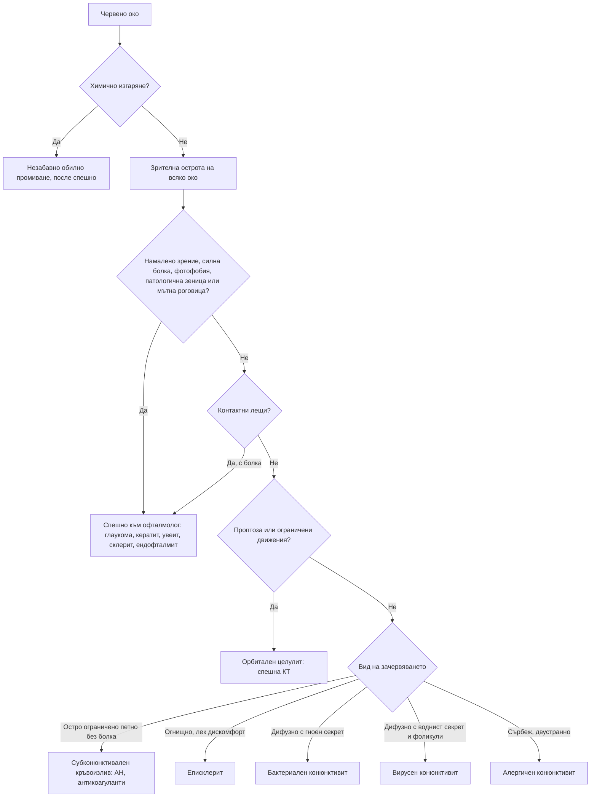

# Глава 59. Червено око

> **Част XII. Очи, уши, нос, гърло и шия**

## Цели на главата

- Да се използват ключовите белези (зрителна острота, болка, фотофобия, секрет, зеница, роговица, разпределение на зачервяването) за разграничаване на доброкачествените от застрашаващите зрението състояния.
- Да се разпознават острата закритоъгълна глаукома, кератитът, предният увеит, склеритът и ендофталмитът като спешни състояния.
- Да се насочва в същия ден носителят на контактни лещи с болезнено червено око (подозрение за кератит).
- Да се разграничават пресепталният и орбиталният целулит.
- Да се обяснява защо локални кортикостероиди не се предписват при недиагностицирано червено око.

## Ключови моменти

- Зрителната острота се измерва при всяко очно оплакване. Червено око с намалено зрение, силна болка, фотофобия или патологична зеница е спешно *(SORT C [1])*.
- Носител на контактни лещи с болезнено червено око има кератит до доказване на противното и се насочва в същия ден *(SORT C [4])*.
- Слепените клепачи сутрин и липсата на сърбеж насочват към бактериален конюнктивит, а сърбежът – към алергичен *(SORT B [2])*.
- Везикулите по върха на носа при херпес зостер офталмикус (белег на Hutchinson) увеличават около три пъти риска от очно възпаление *(SORT B [5])*.
- Острият преден увеит засяга около една трета от болните със спондилоартрит. Обикновено е едностранен и рецидивира *(SORT B [6])*.
- При химично изгаряне промиването започва веднага, преди всичко друго *(SORT C [10])*.
- Локални кортикостероиди не се предписват при недиагностицирано червено око *(SORT C [1])*.

### Първите 60 секунди

- **Химично изгаряне:** започнете обилно промиване с чешмяна вода или физиологичен разтвор веднага, преди прегледа, и продължете поне 15–30 минути. Отстранете частиците от сводовете [10].
- Измерете зрителната острота на всяко око (при изгаряне – след промиването).
- **Подозрение за остра закритоъгълна глаукома** (силна болка, повръщане, ореоли, мътна роговица, средно широка нереагираща зеница): незабавно към офталмолог. Не разширявайте зеницата.
- **Подозрение за проникваща травма:** не притискайте окото, поставете твърд предпазен щит и насочете спешно.
- Не давайте кортикостероидни или упойващи капки за вкъщи.

---

## 1. Ключови белези

*Таблица 59.1. Ключови белези при червено око.*

| Белег | Доброкачествено състояние | **Застрашаващо зрението състояние** |
|---|---|---|
| **Зрителна острота** | Нормална (може да се подобри при мигане, ако секретът я замъглява) | **Намалена** |
| **Болка** | Дразнене, парене, сърбеж | **Силна, дълбока болка** |
| **Фотофобия** | Лека или липсва | Изразена (включително консенсуална – болка при осветяване на здравото око) |
| **Секрет** | Гноен, воднист или лигав | Обикновено воднист (сълзене) |
| **Разпределение на зачервяването** | Дифузно конюнктивално (по-силно към сводовете) | Около роговицата (цилиарна инжекция) или огнищно дълбоко виолетово |
| **Роговица** | Прозрачна | Мътна, язва, инфилтрат |
| **Зеница** | Нормална | Средно широка, нереагираща (глаукома) или малка, неправилна (увеит) |
| **Вътреочно налягане** | Нормално | Високо (глаукома) |

Зрителната острота е „жизненият показател“ на окото. Тя се измерва за всяко око поотделно, с очила или през стеноплеична дупка, при всеки пациент с очно оплакване [1].

---

## 2. Причини

*Таблица 59.2. Причини за червено око.*

| Заболяване | Ключови белези |
|---|---|
| **Бактериален конюнктивит** | Гноен секрет, слепени клепачи сутрин, често двустранен, нормално зрение. Хиперакутен (изобилен гной, бърз ход) – гонококов (новородени и сексуално активни възрастни; риск от перфорация на роговицата). Слепените клепачи сутрин и липсата на сърбеж са най-силните белези на бактериалната етиология [2] |
| **Вирусен конюнктивит** | Воднист секрет, фоликули, преаурикуларна лимфаденопатия, инфекция на горните дихателни пътища; силно заразен (аденовирус); при кератоконюнктивит – фотофобия и намалено зрение |
| **Алергичен конюнктивит** | Сърбеж, двустранен, хемоза (оток на конюнктивата), сезонен, атопия; сърбежът е най-постоянният белег [2] |
| **Хламидиен конюнктивит** | Хроничен фоликуларен конюнктивит при сексуално активни хора; при новородени |
| **Субконюнктивален кръвоизлив** | Яркочервено, остро ограничено петно, без болка, нормално зрение; напъване, травма, хипертония, антикоагуланти. При рецидиви – АН, INR, хемостаза. При травма – изключване на руптура на булба и фрактура на орбитата |
| **Еписклерит** | Огнищно зачервяване, лек дискомфорт, избледнява при фенилефрин; доброкачествен; ревматоиден артрит, възпалителни болести на червата |
| **Склерит** | Силна, пробиваща болка, която буди нощем, болезненост при допир, дълбоко виолетово зачервяване, възможно намалено зрение; ревматоиден артрит, грануломатоза с полиангиит, системен лупус еритематодес, възпалителни болести на червата, херпес зостер. Некротизиращият склерит е спешно състояние. Около една трета от пациентите със склерит имат съпътстващо системно заболяване, което понякога се открива едва след склерита [3] |
| **Бактериален кератит** | Контактни лещи; болка, фотофобия, намалено зрение, бял инфилтрат или язва на роговицата; *Pseudomonas* – спешно в същия ден [4] |
| **Херпесен кератит** | Дендритна язва при оцветяване с флуоресцеин; кортикостероидите го влошават |
| **Акантамебен кератит** | Контактни лещи и контакт с вода (плуване, чешмяна вода); болка, непропорционална на находката [4] |
| **Херпес зостер офталмикус** | Обрив по челото; белег на Hutchinson (везикули по върха на носа) – около 3 пъти по-висок риск от очно възпаление [5] |
| **Ерозия на роговицата, чуждо тяло** | Травма, усещане за чуждо тяло, оцветяване с флуоресцеин. Работа с чук по метал → вътреочно чуждо тяло – рентгенография или КТ на орбитата |
| **UV кератит** | Заваряване без защита, сняг; силна болка 6–12 часа след експозицията, двустранно |
| **Преден увеит (ирит)** | Болка, фотофобия, цилиарна инжекция, малка, неправилна зеница, намалено зрение, хипопион. Свързан е с HLA-B27 и аксиален спондилоартрит (при около една трета от болните) [6], възпалителни болести на червата, псориазис, реактивен артрит, саркоидоза, болест на Behçet, туберкулоза, сифилис, херпесни инфекции. При деца с ювенилен идиопатичен артрит протича безсимптомно (нужен е скрининг) [7] |
| **Остра закритоъгълна глаукома** | Силна болка в окото и главоболие, гадене и повръщане, замъглено зрение, ореоли около светлините, червено око, мътна роговица, средно широка овална нереагираща зеница, твърдо око при палпация. Хиперметропи, възрастни хора, жени. Провокира се от полумрак и лекарства (антихолинергични средства, антихистамини, трициклични антидепресанти, топирамат – двустранна [8], небулизиран ипратропиум, мидриатици, деконгестанти) – спешно |
| **Ендофталмит** | След очна операция (катаракта), интравитреална инжекция или травма; болка, намалено зрение, хипопион – спешно |
| **Орбитален целулит** | Проптоза, болезнени и ограничени движения на окото, диплопия, намалено зрение, аферентен зеничен дефект, треска; обикновено от синузит – спешна КТ [9] |
| **Пресептален (периорбитален) целулит** | Оток и зачервяване на клепачите без проптоза, без ограничени движения, с нормално зрение |
| **Блефарит, халацион, хордеолум** | Възпаление на ръба на клепача, болезнен възел (хордеолум) или неболезнен (халацион) |
| **Синдром на сухото око** | Парене, усещане за пясък; синдром на Sjögren, контактни лещи, работа с екрани, лекарства |
| **Тиреоидна орбитопатия** | Ретракция на клепача, проптоза, зачервяване над мускулите |
| **Каротидно-кавернозна фистула** | Пулсираща проптоза, хемоза, шум над окото; след травма |
| **Химично изгаряне** | Незабавно обилно промиване (минимум 15–30 минути) преди всичко друго; основите (вар, цимент) са по-опасни от киселините [10] |

---

## 3. Безопасна диагностична стратегия

*Таблица 59.3. Безопасна диагностична стратегия.*

| Въпрос | Отговор |
|---|---|
| **Вероятна диагноза** | Вирусен, бактериален и алергичен конюнктивит, субконюнктивален кръвоизлив, блефарит, синдром на сухото око |
| **Сериозни заболявания, които не бива да се пропускат** | Остра закритоъгълна глаукома; бактериален и акантамебен кератит; херпесен кератит; преден увеит; склерит; ендофталмит; орбитален целулит; химично изгаряне; вътреочно чуждо тяло; гонококов конюнктивит; херпес зостер офталмикус |
| **Чести капани** | Конюнктивит при носител на контактни лещи (всъщност кератит); острата глаукома, приета за мигрена или гастроентерит; увеитът при спондилоартрит, приет за конюнктивит; херпесен кератит, влошен от кортикостероидни капки; вътреочно чуждо тяло след работа с чук; тиреоидна орбитопатия |
| **Маскиращи заболявания** | Системни заболявания на съединителната тъкан, спондилоартрити, възпалителни болести на червата, саркоидоза, захарен диабет |
| **Психосоциални аспекти** | Трудова злополука, насилие, самонараняване |

---

## 4. Червени флагове

- **Намалена зрителна острота.**
- **Силна болка** (не само дразнене), болка при движение на окото.
- **Фотофобия.**
- **Цилиарна инжекция.**
- **Мътна роговица**, инфилтрат, язва, хипопион.
- **Патологична зеница.**
- **Носител на контактни лещи** с болезнено червено око.
- **Травма**: високоскоростна, проникваща, химична.
- **Новородено.**
- **Херпес зостер офталмикус** (особено с белег на Hutchinson).
- **Проптоза**, ограничени движения на окото, диплопия.
- **Скорошна очна операция** или интравитреална инжекция.
- Имунокомпрометиран пациент.
- Липса на подобрение след лечение.

**Локални кортикостероиди не се предписват** при недиагностицирано червено око. Те могат да влошат херпесния кератит, да предизвикат глаукома и катаракта и да маскират инфекция [1].

---

## 5. Изследвания в кабинета

- **Зрителна острота** (таблица на Snellen, стеноплеична дупка).
- Оглед с фенерче: разпределение на зачервяването, роговица, предна камера (хипопион), зеници.
- **Оцветяване с флуоресцеин** и синя светлина: ерозии, дендритни язви, чужди тела.
- Обръщане на горния клепач (чуждо тяло).
- Движения на очите, проптоза.
- Палпаторна оценка на вътреочното налягане (сравнение на двете очи) или тонометрия.
- При хиперакутен конюнктивит, при новородени и при съмнение за полово предавана инфекция – натривка и посявка, NAAT.

---

## 6. Диагностичен алгоритъм

*Фигура 59.1. Диагностичен алгоритъм при червено око. Схема на авторите въз основа на източниците, цитирани в главата.*

Текстово описание на фигура 59.1

1. Червено око. Следва: към т. 2.
2. **Въпрос:** Химично изгаряне? Да – към т. 3; Не – към т. 4.
3. Незабавно обилно промиване, после спешно.
4. Зрителна острота на всяко око. Следва: към т. 5.
5. **Въпрос:** Намалено зрение, силна болка, фотофобия, патологична зеница или мътна роговица? Да – към т. 6; Не – към т. 7.
6. Спешно към офталмолог: глаукома, кератит, увеит, склерит, ендофталмит.
7. **Въпрос:** Контактни лещи? Да, с болка – към т. 6; Не – към т. 8.
8. **Въпрос:** Проптоза или ограничени движения? Да – към т. 9; Не – към т. 10.
9. Орбитален целулит: спешна КТ.
10. **Въпрос:** Вид на зачервяването Остро ограничено петно без болка – към т. 11; Огнищно, лек дискомфорт – към т. 12; Дифузно с гноен секрет – към т. 13; Дифузно с воднист секрет и фоликули – към т. 14; Сърбеж, двустранно – към т. 15.
11. Субконюнктивален кръвоизлив: АН, антикоагуланти.
12. Еписклерит.
13. Бактериален конюнктивит.
14. Вирусен конюнктивит.
15. Алергичен конюнктивит.

---

## 7. Кога и колко спешно да насочим

*Таблица 59.4. Кога и колко спешно да насочим.*

| Спешност | Клинична ситуация |
|---|---|
| **Незабавно (112 или спешно отделение)** | Химично изгаряне – след промиване на място [10]; проникваща травма или подозрение за руптура на булба; орбитален целулит (проптоза, болезнени или ограничени движения, диплопия, намалено зрение) [9]; остра закритоъгълна глаукома [8]; ендофталмит след операция или интравитреална инжекция |
| **В същия ден** | Подозрение за кератит, особено при носител на контактни лещи [4]; преден увеит [6]; склерит [3]; херпес зостер офталмикус с белег на Hutchinson или с очни симптоми [5]; хиперакутен (гонококов) конюнктивит [2]; конюнктивит при новородено; вътреочно чуждо тяло или чуждо тяло, което не може да се отстрани; червено око с намалено зрение без ясна причина |
| **Бързо (до 2 седмици)** | Рецидивиращ еписклерит – търсене на системно заболяване [3]; тиреоидна орбитопатия без засягане на зрението; конюнктивит, който не се подобрява след 7–10 дни лечение |
| **Планово** | Хроничен блефарит или синдром на сухото око без ефект от лечението; халацион, който не отзвучава; деца с ювенилен идиопатичен артрит – редовен офталмологичен скрининг по график [7] |
| **Проследяване в общата практика** | Вирусен, бактериален и алергичен конюнктивит [2]; субконюнктивален кръвоизлив (с измерване на АН, при рецидиви – изследване на хемостазата); еписклерит; блефарит; хордеолум |

---

## 8. Клинични перли

- Измерете зрителната острота. Червеното око с намалено зрение е спешно.
- Конюнктивитът не намалява зрението и не причинява фотофобия. При тези белези помислете за кератит, увеит или глаукома.
- Носител на контактни лещи с болезнено червено око има кератит до доказване на противното. Спешна оценка в същия ден.
- Главоболие, повръщане и червено око при възрастен човек: остра закритоъгълна глаукома, а не мигрена или гастроентерит.
- Топирамат, антихолинергичните средства и деконгестантите могат да провокират остра закритоъгълна глаукома.
- Червено болезнено око с фотофобия при млад човек с болки в гърба: преден увеит при спондилоартрит.
- Не давайте кортикостероидни капки при недиагностицирано червено око.
- Работа с чук по метал и „нещо влезе в окото“: изключете вътреочно чуждо тяло с рентгенография или КТ.
- Везикули по върха на носа при херпес зостер на челото: висок риск от очно засягане. Спешно към офталмолог.
- Проптоза и болезнени движения на окото при синузит: орбитален целулит.

---

## 9. Клиничен случай

**Етап 1 – клинична картина.** Жена на 29 години носи месечни контактни лещи и понякога плува с тях. От два дни дясното ѝ око е зачервено, болезнено, сълзи и не понася светлина. Зрението ѝ е замъглено. Капвала е капки „против конюнктивит“ от аптеката без ефект.

> **Въпрос 1.** Кои белези отличават състоянието от конюнктивит и какво ще прегледате?

**Етап 2 – преглед.** Зрителната острота е 0,4 вдясно и 1,0 вляво. Около роговицата има изразено зачервяване (цилиарна инжекция). На роговицата се вижда бяло петно с диаметър 2 mm, което се оцветява с флуоресцеин. Хипопион няма.

> **Въпрос 2.** Каква е диагнозата и кои причинители са най-вероятни?

> **Въпрос 3.** Какво е поведението?

Обсъждане и отговори

**Отговор 1.** Конюнктивитът не намалява зрението и не причинява фотофобия. Болката, фотофобията и замъгленото зрение при носител на контактни лещи насочват към кератит. Измерва се зрителната острота на всяко око, оглеждат се разпределението на зачервяването, роговицата, предната камера и зениците и се прави оцветяване с флуоресцеин [1].

**Отговор 2.** **Микробен кератит.** Контактните лещи са основен рисков фактор. Най-вероятните причинители са *Pseudomonas aeruginosa* и, при контакт с вода, *Acanthamoeba* [4].

**Отговор 3.** Състоянието застрашава зрението и изисква оценка от офталмолог в същия ден: намазка и посявка от роговицата и интензивно локално антимикробно лечение. Контактните лещи и кутийката се носят за изследване. Кортикостероидни капки не се дават [1]. Пациентката не носи лещи до пълното излекуване и никога не плува и не се къпе с тях.

**Поука.** При носител на контактни лещи „конюнктивитът“ с болка и намалено зрение е кератит.

---

## Визуални примери

Учебникът не съдържа собствени изображения. Типичните находки могат да се видят в свободно достъпни атласи (връзките са проверени през септември 2026 г.):

- Конюнктивит – [EyeWiki](https://eyewiki.org/Conjunctivitis)
- Склерит – [EyeWiki](https://eyewiki.org/Scleritis)
- Херпес симплекс кератит – [EyeWiki](https://eyewiki.org/Herpes_Simplex_Epithelial_Keratitis)

---

## Обобщение

- Ключовите белези при червено око са зрителната острота, болката, фотофобията, секретът, разпределението на зачервяването, роговицата и зеницата.
- Конюнктивитите, субконюнктивалният кръвоизлив, еписклеритът и блефаритът са доброкачествени. Кератитът, увеитът, склеритът, острата закритоъгълна глаукома, ендофталмитът и орбиталният целулит застрашават зрението.
- Носителят на контактни лещи с болезнено червено око се насочва в същия ден.
- Химичното изгаряне се промива веднага. Кортикостероидни капки не се дават без диагноза.

## Самопроверка

### Въпроси с един верен отговор

**1.** *(основно ниво)* Жена на 68 години с далекогледство получава внезапна силна болка в дясното око и главоболие вечерта в киното. Повръща и вижда ореоли около светлините. Окото е червено, роговицата е мътна, а зеницата е средно широка и не реагира на светлина. Коя е най-вероятната диагноза?

- **А.** Мигрена с аура
- **Б.** Остра закритоъгълна глаукома
- **В.** Преден увеит
- **Г.** Вирусен конюнктивит
- **Д.** Субарахноидален кръвоизлив

Отговор и обосновка

**Верен отговор: Б.** Силната болка, повръщането, ореолите, мътната роговица и средно широката нереагираща зеница при далекогледа възрастна жена след престой в полумрак са типични за остра закритоъгълна глаукома [1]. Необходимо е незабавно насочване към офталмолог.

**2.** *(основно ниво)* Дете на 5 години има гноен секрет от двете очи и слепени клепачи сутрин. Не го сърби, зрението е нормално, фотофобия няма. Кое твърдение е вярно?

- **А.** Нужно е спешно насочване към офталмолог
- **Б.** Най-вероятен е бактериален конюнктивит, който обикновено отзвучава за 1–2 седмици
- **В.** Показани са кортикостероидни капки
- **Г.** Необходим е системен антибиотик
- **Д.** Най-вероятен е алергичен конюнктивит

Отговор и обосновка

**Верен отговор: Б.** Слепените клепачи и липсата на сърбеж са най-силните белези на бактериален конюнктивит. Той обикновено отзвучава за 1–2 седмици, а локалният антибиотик скъсява продължителността му [2].

**3.** *(основно ниво)* Мъж на 70 години има болезнен везикулозен обрив по челото от 2 дни. Има везикули и по върха на носа, а дясното око е леко зачервено. Кое е правилното поведение?

- **А.** Перорален антивирусен препарат и контрол след 2 седмици
- **Б.** Системен антивирусен препарат и оценка от офталмолог в същия ден
- **В.** Кортикостероидни капки за окото
- **Г.** Само обезболяване
- **Д.** Локален антибиотик за окото

Отговор и обосновка

**Верен отговор: Б.** Везикулите по върха на носа (белег на Hutchinson) показват засягане на назоцилиарния нерв и увеличават около три пъти риска от очно възпаление [5]. Нужни са системно антивирусно лечение и офталмологична оценка в същия ден.

**4.** *(напреднало ниво)* Жена на 32 години е започнала топирамат за профилактика на мигрена преди 10 дни. Внезапно получава двустранно замъглено зрение, болка и зачервяване на двете очи. Кое е вярно?

- **А.** Това е мигренозна аура – увеличава се дозата
- **Б.** Вероятна е двустранна вторична закритоъгълна глаукома – топираматът се спира и пациентката се насочва незабавно
- **В.** Става дума за двустранен вирусен конюнктивит
- **Г.** Необходима е само корекция с очила
- **Д.** Периферната лазерна иридотомия е лечението на избор

Отговор и обосновка

**Верен отговор: Б.** Топираматът може да предизвика двустранна вторична закритоъгълна глаукома и остра миопия, обикновено в първите седмици от лечението. Промените са обратими при ранно спиране на лекарството, а периферната иридотомия не е ефективна [8].

**5.** *(напреднало ниво)* Жена на 55 години с ревматоиден артрит има силна пробиваща болка в дясното око, която я буди нощем. Зачервяването е дълбоко виолетово, окото е болезнено при допир, а зачервяването не избледнява след фенилефрин. Коя е най-вероятната диагноза и какво е поведението?

- **А.** Еписклерит – наблюдение
- **Б.** Склерит – оценка от офталмолог в същия ден
- **В.** Бактериален конюнктивит – локален антибиотик
- **Г.** Субконюнктивален кръвоизлив – измерване на АН
- **Д.** Синдром на сухото око – изкуствени сълзи

Отговор и обосновка

**Верен отговор: Б.** Силната болка, която буди нощем, болезнеността и дълбокото зачервяване, което не избледнява след фенилефрин, отличават склерита от еписклерита. Склеритът застрашава зрението и често е свързан със системно заболяване [3].

### Задача

Мъж на 28 години има болки в кръста от 2 години, по-силни сутрин и облекчаващи се с движение. От 2 дни лявото му око е червено и болезнено, с фотофобия и леко замъглено зрение. Как ще подходите?

Решение

Най-вероятен е остър преден увеит при недиагностициран аксиален спондилоартрит. Възпалителната болка в гърба и едностранният остър преден увеит са типично съчетание [6]. Пациентът се насочва към офталмолог в същия ден за преглед с биомикроскоп и лечение. Кортикостероидни капки не се дават без диагноза [1]. След овладяване на увеита пациентът се насочва към ревматолог за изследване на HLA-B27 и ЯМР на сакроилиачните стави. Той трябва да знае, че увеитът рецидивира при около половината от болните и при нов епизод трябва да потърси помощ веднага [6].

### OSCE станция: Оценка на червено око

**Време:** 8 минути. **Ниво:** основно (студенти, специализанти).

**Задача за кандидата.** Мъж на 40 години има червено ляво око от един ден. Снемете насочена анамнеза, прегледайте окото и решете колко спешно е насочването.

**Информация за симулирания пациент (за изпитващия).** Носи контактни лещи. Окото боли, сълзи и светлината го дразни. Зрението е леко замъглено.

*Таблица 59.5. OSCE станция „Оценка на червено око“ – критерии за оценяване.*

| Критерий | Точки |
|---|---|
| Пита за болка, фотофобия, зрение, секрет и сърбеж | 2 |
| Пита за контактни лещи, травма, работа с чук, химикали, предишни епизоди и системни заболявания | 2 |
| Измерва зрителната острота на всяко око поотделно (с очила или през стеноплеична дупка) | 2 |
| Оглежда разпределението на зачервяването, роговицата, предната камера и зениците | 1 |
| Прави оцветяване с флуоресцеин и обръща горния клепач | 1 |
| Разпознава червените флагове и насочва в същия ден към офталмолог | 1 |
| Съветва пациента да спре лещите, да ги донесе с кутийката и да не използва кортикостероидни капки | 1 |
| **Общо** | **10** |

**Праг за успешно изпълнение:** 7 от 10 точки, включително измерването на зрителната острота и решението за насочване в същия ден.

## Литература

1. Cronau H, Kankanala RR, Mauger T. Diagnosis and management of red eye in primary care. Am Fam Physician. 2010;81(2):137-44. PMID: 20082509.
2. Azari AA, Barney NP. Conjunctivitis: a systematic review of diagnosis and treatment. JAMA. 2013;310(16):1721-9. doi:10.1001/jama.2013.280318. PMID: 24150468.
3. Sainz de la Maza M, Molina N, Gonzalez-Gonzalez LA, Doctor PP, Tauber J, Foster CS. Clinical characteristics of a large cohort of patients with scleritis and episcleritis. Ophthalmology. 2012;119(1):43-50. doi:10.1016/j.ophtha.2011.07.013. PMID: 21963265.
4. Ting DSJ, Ho CS, Deshmukh R, Said DG, Dua HS. Infectious keratitis: an update on epidemiology, causative microorganisms, risk factors, and antimicrobial resistance. Eye (Lond). 2021;35(4):1084-1101. doi:10.1038/s41433-020-01339-3. PMID: 33414529.
5. Zaal MJ, Völker-Dieben HJ, D'Amaro J. Prognostic value of Hutchinson's sign in acute herpes zoster ophthalmicus. Graefes Arch Clin Exp Ophthalmol. 2003;241(3):187-91. doi:10.1007/s00417-002-0609-1. PMID: 12644941.
6. Zeboulon N, Dougados M, Gossec L. Prevalence and characteristics of uveitis in the spondyloarthropathies: a systematic literature review. Ann Rheum Dis. 2008;67(7):955-9. doi:10.1136/ard.2007.075754. PMID: 17962239.
7. Constantin T, Foeldvari I, Anton J, de Boer J, Czitrom-Guillaume S, Edelsten C, et al. Consensus-based recommendations for the management of uveitis associated with juvenile idiopathic arthritis: the SHARE initiative. Ann Rheum Dis. 2018;77(8):1107-1117. doi:10.1136/annrheumdis-2018-213131. PMID: 29592918.
8. Fraunfelder FW, Fraunfelder FT, Keates EU. Topiramate-associated acute, bilateral, secondary angle-closure glaucoma. Ophthalmology. 2004;111(1):109-11. doi:10.1016/j.ophtha.2003.04.004. PMID: 14711721.
9. Fokkens WJ, Lund VJ, Hopkins C, Hellings PW, Kern R, Reitsma S, et al. Executive summary of EPOS 2020 including integrated care pathways. Rhinology. 2020;58(2):82-111. doi:10.4193/Rhin20.601. PMID: 32226949.
10. Eslani M, Baradaran-Rafii A, Movahedan A, Djalilian AR. The ocular surface chemical burns. J Ophthalmol. 2014;2014:196827. doi:10.1155/2014/196827. PMID: 25105018.

*Последна проверка на съдържанието: септември 2026 г. Следващ планиран преглед: септември 2027 г. (вж. „Политика за актуализация“ в README).*

<!-- навигация -->

---

[← Глава 58. Кожни язви, косопад и промени в ноктите](58-yazvi-kosopad-nokti.md) · [Съдържание](../README.md) · [Глава 60. Нарушения на зрението →](60-zrenie.md)
