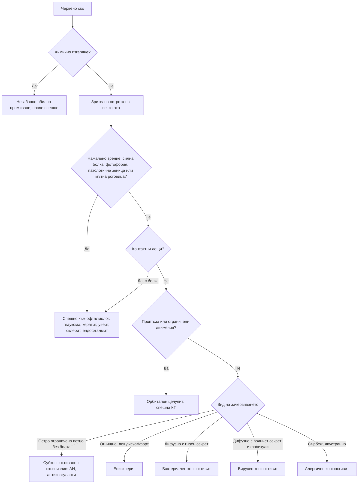

# Глава 59. Червено око

> **Част XII. Очи, уши, нос, гърло и шия**

## Цели на главата

- Да се използват ключовите белези (зрителна острота, болка, фотофобия, секрет, зеница, роговица, разпределение на зачервяването) за разграничаване на доброкачествените от застрашаващите зрението състояния.
- Да се разпознават острата закритоъгълна глаукома, кератитът, предният увеит, склеритът и ендофталмитът като спешни състояния.
- Да се насочва в същия ден носителят на контактни лещи с болезнено червено око (подозрение за кератит).
- Да се разграничават пресепталният и орбиталният целулит.
- Да се обяснява защо локални кортикостероиди не се предписват при недиагностицирано червено око.

---

## 1. Ключови белези

| Белег | Доброкачествено състояние | **Застрашаващо зрението състояние** |
|---|---|---|
| **Зрителна острота** | Нормална (може да се подобри при мигане, ако секретът я замъглява) | **Намалена** |
| **Болка** | Дразнене, парене, сърбеж | **Силна, дълбока болка** |
| **Фотофобия** | Лека или липсва | **Изразена** (включително **консенсуална** — болка при осветяване на здравото око) |
| **Секрет** | Гноен, воднист или лигав | Обикновено воднист (сълзене) |
| **Разпределение на зачервяването** | Дифузно конюнктивално (по-силно към сводовете) | **Около роговицата** (цилиарна инжекция) или огнищно дълбоко виолетово |
| **Роговица** | Прозрачна | **Мътна**, язва, инфилтрат |
| **Зеница** | Нормална | **Средно широка, нереагираща** (глаукома) или **малка, неправилна** (увеит) |
| **Вътреочно налягане** | Нормално | **Високо** (глаукома) |

**Зрителната острота** е „жизненият показател“ на окото. Тя се измерва за всяко око поотделно, с очила или през стеноплеична дупка, при **всеки** пациент с очно оплакване.

---

## 2. Причини

| Заболяване | Ключови белези |
|---|---|
| **Бактериален конюнктивит** | Гноен секрет, слепени клепачи сутрин, често двустранен, нормално зрение. **Хиперакутен** (изобилен гной, бърз ход) — **гонококов** (новородени и сексуално активни възрастни; риск от перфорация на роговицата) |
| **Вирусен конюнктивит** | Воднист секрет, **фоликули**, **преаурикуларна лимфаденопатия**, инфекция на горните дихателни пътища; силно заразен (аденовирус); при кератоконюнктивит — фотофобия и намалено зрение |
| **Алергичен конюнктивит** | **Сърбеж**, двустранен, хемоза (оток на конюнктивата), сезонен, атопия |
| **Хламидиен конюнктивит** | Хроничен фоликуларен конюнктивит при сексуално активни хора; при новородени |
| **Субконюнктивален кръвоизлив** | Ярко червено, **остро ограничено** петно, без болка, нормално зрение; напъване, травма, хипертония, антикоагуланти. При рецидиви — АН, INR, хемостаза. При травма — изключване на руптура на булба и фрактура на орбитата |
| **Еписклерит** | **Огнищно** зачервяване, лек дискомфорт, **избледнява при фенилефрин**; доброкачествен; ревматоиден артрит, възпалителни болести на червата |
| **Склерит** | **Силна, пробиваща болка**, която **буди нощем**, болезненост при допир, дълбоко виолетово зачервяване, възможно намалено зрение; **ревматоиден артрит, грануломатоза с полиангиит, системен лупус еритематодес, възпалителни болести на червата**, херпес зостер. **Некротизиращият склерит е спешно състояние** |
| **Бактериален кератит** | **Контактни лещи**; болка, фотофобия, намалено зрение, **бял инфилтрат или язва на роговицата**; *Pseudomonas* — **спешно в същия ден** |
| **Херпесен кератит** | **Дендритна язва** при оцветяване с флуоресцеин; **кортикостероидите го влошават** |
| **Акантамебен кератит** | Контактни лещи и **контакт с вода** (плуване, чешмяна вода); **болка, непропорционална на находката** |
| **Херпес зостер офталмикус** | Обрив по челото; **белег на Hutchinson** (везикули по върха на носа) — висок риск от очно засягане |
| **Ерозия на роговицата, чуждо тяло** | Травма, усещане за чуждо тяло, оцветяване с флуоресцеин. **Работа с чук по метал** → **вътреочно чуждо тяло** — рентгенография или КТ на орбитата |
| **UV кератит** | Заваряване без защита, сняг; силна болка **6–12 часа** след експозицията, двустранно |
| **Преден увеит (ирит)** | Болка, **фотофобия**, **цилиарна инжекция**, **малка, неправилна зеница**, намалено зрение, хипопион. Свързан е с **HLA-B27** и **аксиален спондилоартрит**, **възпалителни болести на червата**, псориазис, реактивен артрит, **саркоидоза**, **болест на Behçet**, туберкулоза, сифилис, херпесни инфекции. **При деца с ювенилен идиопатичен артрит протича безсимптомно** (нужен е скрининг) |
| **Остра закритоъгълна глаукома** | **Силна болка** в окото и **главоболие**, **гадене и повръщане**, замъглено зрение, **ореоли около светлините**, червено око, **мътна роговица**, **средно широка овална нереагираща зеница**, **твърдо око** при палпация. Хиперметропи, възрастни хора, жени. Провокира се от **полумрак** и **лекарства** (антихолинергични средства, антихистамини, трициклични антидепресанти, **топирамат** — двустранна, небулизиран ипратропиум, мидриатици, деконгестанти) — **спешно** |
| **Ендофталмит** | След **очна операция** (катаракта), интравитреална инжекция или травма; болка, намалено зрение, хипопион — **спешно** |
| **Орбитален целулит** | **Проптоза**, **болезнени и ограничени движения на окото**, **диплопия**, намалено зрение, аферентен зеничен дефект, треска; обикновено от синузит — **спешна КТ** |
| **Пресептален (периорбитален) целулит** | Оток и зачервяване на клепачите **без** проптоза, без ограничени движения, с нормално зрение |
| **Блефарит, халацион, хордеолум** | Възпаление на ръба на клепача, болезнен възел (хордеолум) или неболезнен (халацион) |
| **Синдром на сухото око** | Парене, усещане за пясък; синдром на Sjögren, контактни лещи, работа с екрани, лекарства |
| **Тиреоидна орбитопатия** | Ретракция на клепача, проптоза, зачервяване над мускулите |
| **Каротидно-кавернозна фистула** | **Пулсираща** проптоза, хемоза, шум над окото; след травма |
| **Химично изгаряне** | **Незабавно обилно промиване** (минимум 15–30 минути) преди всичко друго; основите (вар, цимент) са по-опасни от киселините |

---

## 3. Безопасна диагностична стратегия

| Въпрос | Отговор |
|---|---|
| **Вероятна диагноза** | Вирусен, бактериален и алергичен конюнктивит, субконюнктивален кръвоизлив, блефарит, синдром на сухото око |
| **Сериозни заболявания, които не бива да се пропускат** | **Остра закритоъгълна глаукома**; **бактериален и акантамебен кератит**; **херпесен кератит**; **преден увеит**; **склерит**; **ендофталмит**; **орбитален целулит**; **химично изгаряне**; **вътреочно чуждо тяло**; гонококов конюнктивит; херпес зостер офталмикус |
| **Чести капани** | Конюнктивит при носител на контактни лещи (всъщност кератит); острата глаукома, приета за мигрена или гастроентерит; увеитът при спондилоартрит, приет за конюнктивит; херпесен кератит, влошен от кортикостероидни капки; вътреочно чуждо тяло след работа с чук; тиреоидна орбитопатия |
| **Маскиращи заболявания** | Системни заболявания на съединителната тъкан, спондилоартрити, възпалителни болести на червата, саркоидоза, захарен диабет |
| **Психосоциални аспекти** | Трудова злополука, насилие, самонараняване |

---

## 4. Червени флагове

- **Намалена зрителна острота.**
- **Силна болка** (не само дразнене), болка при движение на окото.
- **Фотофобия.**
- **Цилиарна инжекция.**
- **Мътна роговица**, инфилтрат, язва, хипопион.
- **Патологична зеница.**
- **Носител на контактни лещи** с болезнено червено око.
- **Травма**: високоскоростна, проникваща, химична.
- **Новородено.**
- **Херпес зостер офталмикус** (особено с белег на Hutchinson).
- **Проптоза**, ограничени движения на окото, диплопия.
- **Скорошна очна операция** или интравитреална инжекция.
- Имунокомпрометиран пациент.
- Липса на подобрение след лечение.

**Локални кортикостероиди не се предписват** при недиагностицирано червено око. Те могат да влошат херпесния кератит, да предизвикат глаукома и катаракта и да маскират инфекция.

---

## 5. Изследвания в кабинета

- **Зрителна острота** (таблица на Snellen, стеноплеична дупка).
- Оглед с фенерче: разпределение на зачервяването, роговица, предна камера (хипопион), зеници.
- **Оцветяване с флуоресцеин** и синя светлина: ерозии, дендритни язви, чужди тела.
- Обръщане на горния клепач (чуждо тяло).
- Движения на очите, проптоза.
- Палпаторна оценка на вътреочното налягане (сравнение на двете очи) или тонометрия.
- При хиперакутен конюнктивит, при новородени и при съмнение за полово предавана инфекция — натривка и посявка, NAAT.

---

## 6. Диагностичен алгоритъм

---

## 7. Клинични перли

- Измерете зрителната острота. Червеното око с намалено зрение е спешно.
- Конюнктивитът не намалява зрението и не причинява фотофобия. При тези белези мислете за кератит, увеит или глаукома.
- Носител на контактни лещи с болезнено червено око има кератит, докато не се докаже противното. Спешна оценка в същия ден.
- Главоболие, повръщане и червено око при възрастен човек: остра закритоъгълна глаукома, а не мигрена или гастроентерит.
- Топирамат, антихолинергичните средства и деконгестантите могат да провокират остра закритоъгълна глаукома.
- Червено болезнено око с фотофобия при млад човек с болки в гърба: преден увеит при спондилоартрит.
- Не давайте кортикостероидни капки при недиагностицирано червено око.
- Работа с чук по метал и „нещо влезе в окото“: изключете вътреочно чуждо тяло с рентгенография или КТ.
- Везикули по върха на носа при херпес зостер на челото: висок риск от очно засягане. Спешно към офталмолог.
- Проптоза и болезнени движения на окото при синузит: орбитален целулит.

---

## 8. Клиничен случай

**Случай.** Жена на 29 години носи месечни контактни лещи и понякога плува с тях. От два дни дясното ѝ око е зачервено, болезнено, сълзи и не понася светлина. Зрението ѝ е замъглено. Капвала е капки „против конюнктивит“ от аптеката без ефект. Зрителната острота е 0,4 вдясно и 1,0 вляво. Около роговицата има изразено зачервяване, а на роговицата се вижда бяло петно с диаметър 2 mm, което се оцветява с флуоресцеин.

**Въпроси.** 1) Каква е диагнозата? 2) Какво е поведението?

**Обсъждане.** Болезненото червено око с фотофобия, **намалено зрение** и **инфилтрат на роговицата** при **носител на контактни лещи**, който плува с тях, е **микробен кератит**. Най-вероятните причинители са *Pseudomonas aeruginosa* и *Acanthamoeba*. Състоянието **застрашава зрението** и изисква **спешна оценка от офталмолог в същия ден**: намазка и посявка от роговицата и интензивно локално антимикробно лечение. Контактните лещи и кутийката се носят за изследване. Пациентката не бива да носи лещи до пълното излекуване. Трябва да бъде обучена никога да не плува и да не се къпе с тях.

**Поука.** При носител на контактни лещи „конюнктивитът“ с болка и намалено зрение е кератит.

<!-- навигация -->

---

[← Глава 58. Кожни язви, косопад и промени в ноктите](58-yazvi-kosopad-nokti.md) · [Съдържание](../README.md) · [Глава 60. Нарушения на зрението →](60-zrenie.md)
