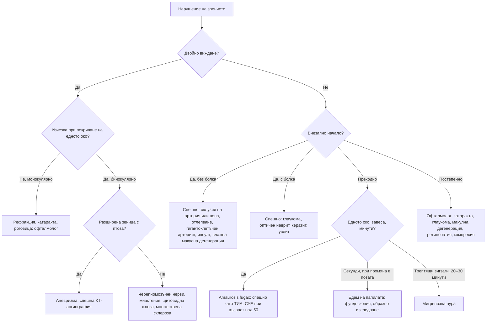

# Глава 60. Нарушения на зрението

> **Част XII. Очи, уши, нос, гърло и шия**

## Цели на главата

- Да се класифицират нарушенията на зрението по начало (внезапно, постепенно, преходно), болка и засягане на едното или двете очи.
- Да се разпознава внезапната безболезнена загуба на зрението като спешно състояние, включително като „еквивалент на инсулт“.
- Да се разграничават преходните зрителни нарушения: amaurosis fugax, преходни замъглявания при едем на папилата, мигренозна аура.
- Да се разграничава монокулярната от бинокулярната диплопия и да се локализира засегнатият черепномозъчен нерв.
- Да се тълкуват зеничните нарушения: анизокория, синдром на Horner, аферентен зеничен дефект.

## Ключови моменти

- Внезапната безболезнена загуба на зрението на едното око е инсулт на ретината до доказване на противното и се насочва спешно по протокола за остър инсулт *(SORT C [1])*.
- Около един от четирима пациенти с исхемична монокулярна загуба на зрението има остри мозъчни инфаркти при ЯМР *(SORT B [11])*.
- При внезапна загуба на зрението след 50-годишна възраст се изследват СУЕ и CRP. При подозрение за гигантоклетъчен артериит кортикостероидите се започват веднага *(SORT C [3])*.
- Проблясъците и „мушиците“ с намалено зрение или „завеса“ изискват офталмологична оценка в същия ден *(SORT B [2])*.
- Внезапното изкривяване на линиите при възрастен човек е влажна макулна дегенерация до доказване на противното. Насочването е до 1 работен ден *(SORT C [4])*.
- Изолираната пареза на III, IV или VI черепномозъчен нерв след 50-годишна възраст изисква ЯМР дори при съдови рискови фактори *(SORT B [9])*.
- Двустранният оток на папилите изисква спешно образно изследване *(SORT C [8])*.

### Първите 60 секунди

- Попитайте дали е засегнато едното или двете очи, кога точно е започнало и дали има болка, главоболие или челюстна клаудикация.
- Измерете зрителната острота на всяко око и проверете за аферентен зеничен дефект.
- Внезапна безболезнена загуба на зрението на едното око или внезапен дефект в зрителното поле: обадете се на 112 и насочете по протокола за остър инсулт [1].
- След 50-годишна възраст изследвайте СУЕ и CRP. При симптоми на гигантоклетъчен артериит започнете кортикостероиди веднага, без да чакате резултатите [3].
- Не разширявайте зеницата при подозрение за закритоъгълна глаукома и не отлагайте насочването заради изследвания.

---

## 1. Основен подход

1. **Едното или двете очи?** Помолете пациента да покрие всяко око поотделно. Хомонимната хемианопсия (например при инсулт в тилния дял) често се възприема като проблем с едното око.
2. **Начало:** внезапно (минути–часове), постепенно (седмици–години), преходно.
3. **Болка:** болезнено или безболезнено.
4. **Характер:** замъгляване, дефект в зрителното поле, изкривяване на линиите (метаморфопсия), проблясъци и „мушици“, двойно виждане, ореоли.

### 1.1. Изследване в кабинета

- **Зрителна острота** за всяко око (с очила или стеноплеична дупка).
- **Зрителни полета** по конфронтационния метод.
- **Зеници:** размер, реакции, **аферентен зеничен дефект** (тест с люлеещ се фенер).
- **Движения на очите**, тест с покриване (*cover test*).
- **Фундоскопия.**
- **Мрежа на Amsler** (функция на макулата).
- Десатурация на червения цвят (оптичен неврит).
- АН; СУЕ и CRP при възраст над 50 години.

---

## 2. Внезапна безболезнена загуба на зрението на едното око

*Таблица 60.1. Внезапна безболезнена загуба на зрението на едното око.*

| Заболяване | Ключови белези | Поведение |
|---|---|---|
| **Оклузия на централната ретинна артерия** | Внезапна, тежка загуба, аферентен зеничен дефект; „черешово-червено петно“ в макулата, бледа ретина; емболи от каротидите или сърцето; гигантоклетъчен артериит | Еквивалент на инсулт – спешно по протокола за остър инсулт; оценка на каротидите и сърцето; СУЕ, CRP [1] |
| **Оклузия на централната ретинна вена** | Внезапно или подостро замъгляване; картина на „смачкан домат“ – обилни ретинни кръвоизливи; хипертония, диабет, глаукома, хипервискозитет | Спешно към офталмолог; контрол на рисковите фактори |
| **Отлепване на ретината** | Проблясъци, внезапни „мушици“, „завеса“ или сянка, която се разширява; миопия, травма, след операция на катаракта. При остра поява на проблясъци и „мушици“ около 14% от пациентите имат разкъсване на ретината; субективното намаляване на зрението и кръвоизливът в стъкловидното тяло повишават вероятността [2] | Спешно (особено ако макулата е запазена) |
| **Кръвоизлив в стъкловидното тяло** | Внезапна поява на множество „мушици“ или „червен дъжд“; диабетна ретинопатия, задно отлепване на стъкловидното тяло с разкъсване на ретината, травма | Спешно |
| **Предна исхемична оптична невропатия – артериитна** | Възраст над 50 години, главоболие, челюстна клаудикация, болезненост на скалпа, високи СУЕ и CRP, бледа оточна папила | Незабавно високи дози кортикостероиди – другото око е застрашено [3] |
| **Предна исхемична оптична невропатия – неартериитна** | Съдови рискови фактори, оток на папилата, хоризонтален (алтитудинален) дефект в зрителното поле | Контрол на рисковите фактори; изключване на гигантоклетъчен артериит |
| **Влажна възрастова макулна дегенерация** | Внезапно изкривяване на линиите (метаморфопсия), централно замъгляване; възрастни хора | Спешно насочване към макулен център, обикновено до 1 работен ден (лечение с анти-VEGF) [4] |
| **Инсулт в тилния дял** | Хомонимна хемианопсия (в двете очи), често възприемана като едностранна | Спешно по протокола за остър инсулт |

---

## 3. Внезапна болезнена загуба на зрението

*Таблица 60.2. Внезапна болезнена загуба на зрението.*

| Заболяване | Ключови белези |
|---|---|
| **Остра закритоъгълна глаукома** | Червено око, мътна роговица, средно широка зеница, главоболие, повръщане (вж. глава 59) |
| **Оптичен неврит** | Млади жени; болка при движение на окото; намалено зрение за часове–дни, намалено цветно зрение (десатурация на червения цвят), централен скотом, аферентен зеничен дефект; папилата може да е нормална (ретробулбарен неврит). Възстановяване за седмици. Свързан е с множествена склероза. Нетипичен ход (двустранен, без болка, без възстановяване, тежък) – невромиелит оптика, заболяване, свързано с антитела срещу MOG, саркоидоза, инфекции [5] |
| **Кератит, увеит, ендофталмит** | Вж. глава 59 |
| **Склерит, орбитален целулит** | Вж. глава 59 |
| **Травма** | Руптура на булба, хифема, отлепване на ретината |

---

## 4. Постепенна загуба на зрението

*Таблица 60.3. Постепенна загуба на зрението.*

| Заболяване | Ключови белези |
|---|---|
| **Рефракционни аномалии** | Пресбиопия след 40 години (трудно четене отблизо), миопия, хиперметропия; зрението се подобрява през стеноплеична дупка |
| **Катаракта** | Възрастни хора; заслепяване от светлини (особено при шофиране нощем), намален контраст, ореоли; кортикостероиди, диабет, травма |
| **Първична откритоъгълна глаукома** | Безсимптомна периферна загуба на зрителното поле; фамилна анамнеза, миопия, възраст, африкански произход; изисква скрининг |
| **Суха възрастова макулна дегенерация** | Бавна загуба на централното зрение, друзи |
| **Диабетна ретинопатия и макулопатия** | Често безсимптомна до късен стадий; изисква скрининг |
| **Хипертонична ретинопатия** | Хипертония; при малигнена хипертония – едем на папилата, кръвоизливи |
| **Лекарствена токсичност** | Хидроксихлорохин (макулопатия тип „око на бик“ – годишен скрининг след 5 години лечение, а при доза над 5 mg/kg/ден, съпътстващ прием на тамоксифен или eGFR < 60 – след 1 година [6]), етамбутол (оптична невропатия, цветно зрение), амиодарон, вигабатрин (зрителни полета) |
| **Компресивна оптична невропатия** | Тумор на хипофизата – битемпорална хемианопсия; менингиом; прогресираща безболезнена загуба |
| **Токсична и хранителна оптична невропатия** | Метанол (остра), дефицит на B12, алкохол и тютюн |
| **Наследствена оптична невропатия на Leber** | Млади мъже, последователно засягане на двете очи |
| **Едем на папилата** | Повишено вътречерепно налягане; в късен стадий – трайна загуба на зрението |
| **Кератоконус, дистрофии на роговицата** | Прогресиращ астигматизъм |

---

## 5. Преходни зрителни нарушения

*Таблица 60.4. Преходни зрителни нарушения.*

| Нарушение | Продължителност | Характеристики | Значение |
|---|---|---|---|
| **Преходна монокулярна слепота** (amaurosis fugax) | Секунди–минути | Загуба на зрението на едното око, като „спускаща се завеса“ | Емболия от каротидите или сърцето – спешно като ТИА; доплерова ехография на каротидите; при възраст над 50 години изключване на гигантоклетъчен артериит [7] |
| **Преходни замъглявания на зрението** | **Секунди** | Двустранно, при промяна в положението (изправяне, навеждане) | Едем на папилата (идиопатична интракраниална хипертензия, тумор) – спешна фундоскопия и образно изследване [8] |
| **Мигренозна аура** | 5–60 минути | Бинокулярна, позитивни феномени (трептящи зигзаги, сцинтилиращ скотом), постепенно разрастване, последвана от главоболие | Доброкачествена (първа аура след 50 години изисква изключване на ТИА) |
| **Вертебробазиларна ТИА** | Минути | Двустранна загуба на зрението, съчетана с други стволови симптоми | Спешно като ТИА |
| **Гигантоклетъчен артериит** | Минути | Преходна загуба на зрението или двойно виждане | **Спешно – кортикостероиди** |
| **Промяна в рефракцията при хипергликемия** | Дни | Колебания в зрението при неконтролиран диабет | Контрол на гликемията |

---

## 6. Диплопия

### 6.1. Монокулярна или бинокулярна?

- **Монокулярна** – продължава при покриване на другото око, изчезва при гледане през стеноплеична дупка. Причини: рефракционни аномалии, катаракта, заболявания на роговицата, сухо око, сублуксация на лещата. Не е неврологична.
- **Бинокулярна** – **изчезва** при покриване на което и да е око. Дължи се на нарушено съвместно движение на очите.

### 6.2. Причини за бинокулярна диплопия

*Таблица 60.5. Причини за бинокулярна диплопия.*

| Причина | Ключови белези |
|---|---|
| **Пареза на III нерв** | Птоза, окото е отклонено „надолу и навън“. С разширена зеница – аневризма на задната комуникантна артерия (спешно състояние). Без засягане на зеницата – обикновено микросъдова (диабет, хипертония). При изолирана пареза на III, IV или VI нерв след 50-годишна възраст около 1 от 6 пациенти има друга причина (тумор, гигантоклетъчен артериит, инсулт), затова се прави ЯМР [9] |
| **Пареза на IV нерв** | Вертикална диплопия, по-изразена при поглед надолу (стълби), компенсаторно накланяне на главата; травма, микросъдова |
| **Пареза на VI нерв** | Хоризонтална диплопия, по-изразена при гледане в далечина; повишено вътречерепно налягане („фалшиво локализиращ“ белег), микросъдова, тумори, енцефалопатия на Wernicke |
| **Миастения гравис** | Променлива диплопия, която се засилва при умора; птоза, нормални зеници |
| **Тиреоидна орбитопатия** | Рестриктивна (най-често засяга долния прав мускул), проптоза, ретракция на клепачите |
| **Орбитални процеси** | Фрактура, целулит, тумор |
| **Междуядрена офталмоплегия** | Нарушена аддукция на едното око с нистагъм на другото; множествена склероза (млади хора), инсулт (възрастни хора) |
| **Синдром на кавернозния синус** | Засягане на няколко черепномозъчни нерва (III, IV, VI), нарушена сетивност в зоната на V1–V2 и синдром на Horner; тромбоза, тумор, фистула |
| **Други** | Синдром на Miller Fisher (атаксия, арефлексия, офталмоплегия), ботулизъм, гигантоклетъчен артериит, декомпенсирана хетерофория, вертикално отклонение при стволов инсулт |

---

## 7. Зенични нарушения

*Таблица 60.6. Зенични нарушения.*

| Нарушение | Белези | Причини |
|---|---|---|
| **Физиологична анизокория** | Разлика ≤ 1 mm, еднаква на светло и на тъмно | Норма (при около 20% от хората) |
| **Синдром на Horner** | Птоза (лека), миоза, анхидроза; анизокорията е по-изразена на тъмно | Дисекация на каротидната артерия (болка във врата или лицето – спешно [10]), тумор на Pancoast, латерален медуларен инсулт, клъстерно главоболие, сирингомиелия, травма и операции на шията, вроден (хетерохромия) |
| **Пареза на III нерв** | Разширена зеница с птоза и нарушени движения; анизокорията е по-изразена на светло | Аневризма, херниация |
| **Тонична зеница на Adie** | Разширена зеница с бавна реакция на светлина, по-добра реакция при гледане отблизо; млади жени; понижени сухожилни рефлекси (синдром на Holmes-Adie) | Доброкачествена |
| **Фармакологична мидриаза** | Разширена, нереагираща зеница без птоза и без нарушени движения | Мидриатици, скополаминов пластир, небулизиран ипратропиум, растения (татул) |
| **Аферентен зеничен дефект** | При теста с люлеещ се фенер засегнатата зеница се разширява, когато светлината се премести върху нея | Заболяване на зрителния нерв (оптичен неврит, исхемична невропатия, компресия) или тежко ретинно заболяване |

---

## 8. Оток на папилата на зрителния нерв

- Двустранен оток (едем на папилата) – повишено вътречерепно налягане: тумор, идиопатична интракраниална хипертензия, тромбоза на венозните синуси, хидроцефалия, малигнена хипертония. Спешно образно изследване [8].
- **Едностранен** оток – оптичен неврит, предна исхемична оптична невропатия, оклузия на централната ретинна вена, компресия.
- **Псевдоедем** – друзи на папилата, хиперметропия.

---

## 9. Безопасна диагностична стратегия

*Таблица 60.7. Безопасна диагностична стратегия.*

| Въпрос | Отговор |
|---|---|
| **Вероятна диагноза** | Рефракционни аномалии, катаракта, възрастова макулна дегенерация, диабетна ретинопатия, мигренозна аура |
| **Сериозни заболявания, които не бива да се пропускат** | Оклузия на централната ретинна артерия (еквивалент на инсулт); гигантоклетъчен артериит; отлепване на ретината; остра закритоъгълна глаукома; amaurosis fugax (ТИА); пареза на III нерв с разширена зеница (аневризма); едем на папилата; дисекация на каротидната артерия (синдром на Horner); тумор на хипофизата; инсулт в тилния дял; отравяне с метанол |
| **Чести капани** | Хомонимна хемианопсия, приета за „проблем в едното око“; оптичен неврит като първа проява на множествена склероза; идиопатична интракраниална хипертензия с преходни замъглявания; лекарствена токсичност (хидроксихлорохин, етамбутол); миастения, приета за инсулт; монокулярна диплопия, изследвана неврологично |
| **Маскиращи заболявания** | Захарен диабет, хипертония, заболявания на щитовидната жлеза, лекарства, множествена склероза |
| **Психосоциални аспекти** | Функционална загуба на зрението (диагноза след изключване, при несъответствие в изследванията) |

---

## 10. Диагностичен алгоритъм

*Фигура 60.1. Диагностичен алгоритъм при нарушения на зрението. Схема на авторите въз основа на източниците, цитирани в главата.*

Текстово описание на фигура 60.1

1. Нарушение на зрението. Следва: към т. 2.
2. **Въпрос:** Двойно виждане? Да – към т. 3; Не – към т. 4.
3. **Въпрос:** Изчезва при покриване на едното око? Не, монокулярно – към т. 5; Да, бинокулярно – към т. 6.
4. **Въпрос:** Внезапно начало? Да, без болка – към т. 7; Да, с болка – към т. 8; Преходно – към т. 9; Постепенно – към т. 10.
5. Рефракция, катаракта, роговица: офталмолог.
6. **Въпрос:** Разширена зеница с птоза? Да – към т. 11; Не – към т. 12.
7. Спешно: оклузия на артерия или вена, отлепване, гигантоклетъчен артериит, инсулт, влажна макулна дегенерация.
8. Спешно: глаукома, оптичен неврит, кератит, увеит.
9. **Въпрос:** Едното око, завеса, минути? Да – към т. 13; Секунди, при промяна в позата – към т. 14; Трептящи зигзаги, 20–30 минути – към т. 15.
10. Офталмолог: катаракта, глаукома, макулна дегенерация, ретинопатия, компресия.
11. Аневризма: спешна КТ-ангиография.
12. Черепномозъчни нерви, миастения, щитовидна жлеза, множествена склероза.
13. Amaurosis fugax: спешно като ТИА, СУЕ при възраст над 50.
14. Едем на папилата: фундоскопия, образно изследване.
15. Мигренозна аура.

---

## 11. Червени флагове и насочване

### 11.1. Червени флагове

- Внезапна загуба на зрението или внезапен дефект в зрителното поле.
- Преходна загуба на зрението на едното око („завеса“).
- Нови проблясъци, много „мушици“ или сянка, която се разширява.
- Главоболие, челюстна клаудикация или болезненост на скалпа след 50-годишна възраст.
- Болезнено червено око с намалено зрение.
- Внезапно изкривяване на линиите.
- Двойно виждане с птоза и разширена зеница.
- Синдром на Horner с болка във врата, лицето или окото.
- Двустранен оток на папилите или преходни замъглявания при промяна на позата.
- Нова диплопия с други неврологични симптоми.

### 11.2. Кога и колко спешно да насочим

*Таблица 60.8. Кога и колко спешно да насочим.*

| Спешност | Клинична ситуация |
|---|---|
| **Незабавно (112 или спешно отделение)** | Внезапна безболезнена загуба на зрението на едното око или хомонимен дефект – протокол за остър инсулт [1]; пареза на III нерв с разширена зеница – спешна КТ-ангиография; синдром на Horner с остра болка във врата или лицето – изключване на дисекация [10]; остра закритоъгълна глаукома; оток на папилите с главоболие, повръщане или нарушено съзнание |
| **В същия ден** | Подозрение за гигантоклетъчен артериит със зрителни симптоми – кортикостероиди веднага и оценка от специалист [3]; проблясъци и „мушици“ с намалено зрение или „завеса“ [2]; оклузия на ретинна вена; оптичен неврит [5]; преходна монокулярна слепота – оценка като ТИА до 24 часа [7]; двустранен оток на папилите без тежки симптоми [8]; влажна макулна дегенерация – до 1 работен ден [4]; нова диплопия с други неврологични симптоми или с болка |
| **Бързо (до 2 седмици)** | Битемпорален дефект в зрителното поле (тумор на хипофизата) – образно изследване; изолирана пареза на IV или VI нерв без други симптоми – ЯМР [9]; подозрение за миастения – невролог |
| **Планово** | Катаракта, която пречи на ежедневието; подозрение за глаукома; суха макулна дегенерация – рехабилитация при намалено зрение; хидроксихлорохин – годишен скрининг след 5 години лечение [6] |
| **Проследяване в общата практика** | Пресбиопия и рефракционни аномалии – оптометрист; скрининг за диабетна ретинопатия по програма; типична мигренозна аура; контрол на рисковите фактори след неартериитна исхемична оптична невропатия |

---

## 12. Клинични перли

- Внезапната безболезнена загуба на зрението на едното око е „инсулт на окото“. Действайте по протокола за остър инсулт.
- При всеки пациент над 50 години с внезапна загуба на зрението изследвайте СУЕ и CRP и попитайте за главоболие и челюстна клаудикация.
- Проблясъци, внезапни „мушици“ и „завеса“: отлепване на ретината. Необходимо е насочване в същия ден.
- Внезапното изкривяване на линиите при възрастен човек означава влажна макулна дегенерация. Бързото лечение запазва зрението.
- Двустранният оток на папилите е спешен. Изключете тумор и тромбоза на синусите, преди да приемете идиопатична интракраниална хипертензия.
- Пареза на III нерв с разширена зеница: аневризма до доказване на противното.
- Синдром на Horner с болка във врата: дисекация на каротидната артерия.
- Изменчивата диплопия и птоза, които се влошават вечер, насочват към миастения.
- Млада жена с болка при движение на окото и намалено цветно зрение: оптичен неврит.
- Пациентите, лекувани с хидроксихлорохин, се нуждаят от периодичен офталмологичен скрининг.
- Разширена нереагираща зеница след небулизация с ипратропиум: фармакологична мидриаза, а не неврологично спешно състояние.

---

## 13. Клиничен случай

**Етап 1 – клинична картина.** Мъж на 68 години с предсърдно мъждене е спрял сам антикоагуланта си преди месец. Преди 2 часа внезапно е загубил зрението на дясното око, „като че ли някой е изключил лампата“. Няма болка и главоболие.

> **Въпрос 1.** Какво ще изследвате в кабинета и колко спешно е състоянието?

**Етап 2 – преглед.** Зрителната острота вдясно е „брои пръсти“ на 1 m, вляво – 0,8. Има десен аферентен зеничен дефект. При фундоскопия ретината е бледа, с **черешово-червено петно** в макулата. Бързо изследваните СУЕ (18 mm/h) и CRP са нормални. Пациентът отрича главоболие, болезненост на скалпа и челюстна клаудикация.

> **Въпрос 2.** Каква е диагнозата и най-вероятната причина?

> **Въпрос 3.** Какво е поведението и защо е нужно образно изследване на мозъка?

Обсъждане и отговори

**Отговор 1.** Измерват се зрителната острота на всяко око, зениците (аферентен дефект), зрителните полета и АН, прави се фундоскопия. Внезапната безболезнена загуба на зрението на едното око е спешно състояние, което се лекува като инсулт [1].

**Отговор 2.** Внезапната тежка безболезнена загуба на зрението, аферентният зеничен дефект и черешово-червеното петно са класическа картина на оклузия на централната ретинна артерия. Най-вероятната причина е кардиоемболия при спряна антикоагулация. Нормалните възпалителни показатели и липсата на симптоми правят гигантоклетъчния артериит малко вероятен [3].

**Отговор 3.** Оклузията на ретинната артерия е форма на исхемичен инсулт. Пациентът се насочва **незабавно** по протокола за остър инсулт, където се обсъжда и тромболиза [1]. Образно изследване на мозъка е нужно, защото около една четвърт от пациентите имат остри мозъчни инфаркти [11]. Следват доплерова ехография на каротидите, ехокардиография и вторична профилактика. Решението за антикоагулацията се взема в болницата.

**Поука.** Внезапната загуба на зрението на едното око е съдова катастрофа, която изисква същата спешност и същото изследване като инсулта.

---

## Визуални примери

Учебникът не съдържа собствени изображения. Типичните находки могат да се видят в свободно достъпни атласи (връзките са проверени през септември 2026 г.):

- Едем на папилата – [EyeWiki](https://eyewiki.org/Papilledema)
- Оклузия на централната ретинна артерия – [EyeWiki](https://eyewiki.org/Central_Retinal_Artery_Occlusion)
- Отлепване на ретината – [EyeWiki](https://eyewiki.org/Retinal_Detachment)

---

## Обобщение

- Нарушенията на зрението се класифицират по началото (внезапно, постепенно, преходно), болката и засягането на едното или двете очи.
- Внезапната безболезнена загуба на зрението на едното око е инсулт на ретината или гигантоклетъчен артериит до доказване на противното.
- Преходната монокулярна слепота е ТИА. Преходните замъглявания при промяна на позата насочват към едем на папилата, а бинокулярните позитивни феномени – към мигренозна аура.
- Бинокулярната диплопия се дължи на неврологично, мускулно или орбитно заболяване. Пареза на III нерв с разширена зеница е аневризма до доказване на противното, а синдромът на Horner с болка – дисекация.

## Самопроверка

### Въпроси с един верен отговор

**1.** *(основно ниво)* Мъж на 60 години с късогледство вижда от 2 часа проблясъци и много нови „мушици“ в лявото око. Сега забелязва и сянка в горната част на зрителното поле, която се разширява. Кое е правилното поведение?

- **А.** Успокояване – отлепване на стъкловидното тяло е безвредно
- **Б.** Оценка от офталмолог в същия ден
- **В.** Контрол след 6 седмици
- **Г.** Насочване към невролог
- **Д.** Капки за сухо око

Отговор и обосновка

**Верен отговор: Б.** Проблясъците, новите „мушици“ и разширяващата се сянка насочват към разкъсване и отлепване на ретината. Намаленото зрение и кръвоизливът в стъкловидното тяло повишават вероятността за разкъсване, затова е нужна оценка в същия ден [2].

**2.** *(основно ниво)* Жена на 76 години от 2 седмици има главоболие в слепоочията и болка в челюстта при дъвчене. Днес е имала 5-минутна загуба на зрението на дясното око. СУЕ е 78 mm/h. Кое е правилното поведение?

- **А.** Аспирин и насочване към кардиолог
- **Б.** Високи дози кортикостероиди веднага и оценка от специалист в същия ден
- **В.** Изчакване на биопсията на темпоралната артерия преди лечение
- **Г.** Насочване към офталмолог в рамките на 2 седмици
- **Д.** ЯМР на главата и контрол след седмица

Отговор и обосновка

**Верен отговор: Б.** Преходната загуба на зрението при подозрение за гигантоклетъчен артериит е предупреждение за необратима слепота. Кортикостероидите се започват веднага, без да се чака биопсията [3].

**3.** *(основно ниво)* Мъж на 74 години от 3 дни вижда правите линии изкривени с централното зрение на дясното око. Коя е най-вероятната диагноза и какво е поведението?

- **А.** Катаракта – планово насочване
- **Б.** Влажна възрастова макулна дегенерация – насочване към макулен център до 1 работен ден
- **В.** Пресбиопия – очила
- **Г.** Суха макулна дегенерация – наблюдение
- **Д.** Мигренозна аура – успокояване

Отговор и обосновка

**Верен отговор: Б.** Внезапната метаморфопсия при възрастен човек е влажна макулна дегенерация до доказване на противното. Препоръчва се насочване обикновено до 1 работен ден [4].

**4.** *(напреднало ниво)* Жена на 45 години има остра болка в дясната половина на шията и лицето след масаж. Има лека птоза и по-малка зеница вдясно. Коя е най-вероятната диагноза и какво е поведението?

- **А.** Клъстерно главоболие – кислород
- **Б.** Дисекация на каротидната артерия – спешна КТ-ангиография
- **В.** Физиологична анизокория – успокояване
- **Г.** Пареза на III нерв – ЯМР след месец
- **Д.** Мускулна болка – НСПВС

Отговор и обосновка

**Верен отговор: Б.** Синдромът на Horner с остра болка във врата или лицето е дисекация на каротидната артерия до доказване на противното. Нужно е спешно образно изследване, за предпочитане КТ-ангиография [10].

**5.** *(напреднало ниво)* Мъж на 66 години с диабет и хипертония има хоризонтална диплопия от 2 дни поради пареза на десния VI нерв. Няма други неврологични симптоми, а СУЕ и CRP са нормални. Кое твърдение е вярно?

- **А.** Причината със сигурност е микросъдова и изследване не е нужно
- **Б.** Около 1 от 6 такива пациенти има друга причина, затова се прави ЯМР
- **В.** Необходима е спешна лумбална пункция
- **Г.** Диплопията е монокулярна
- **Д.** Показана е тромболиза

Отговор и обосновка

**Верен отговор: Б.** Дори при съдови рискови фактори значителна част от пациентите над 50 години с изолирана пареза на III, IV или VI нерв имат друга причина, например тумор, възпаление или мозъчен инфаркт [9].

### Задача

Жена на 27 години с наднормено тегло има главоболие от 2 месеца, по-силно сутрин, и секундни притъмнявания на зрението при изправяне. Понякога чува пулсиращ шум в ушите. Какво ще направите?

Решение

Преходните замъглявания при промяна на позата, главоболието и пулсиращият шум в ушите насочват към повишено вътречерепно налягане, най-често идиопатична интракраниална хипертензия. Прави се фундоскопия в същия ден. При двустранен оток на папилите пациентката се насочва спешно за образно изследване (ЯМР с венография), за да се изключат тумор и тромбоза на венозните синуси, преди да се приеме идиопатична форма [8]. Нужна е и оценка на зрителните полета, защото загубата на зрение е основната опасност. Прави се преглед на лекарствата (тетрациклини, ретиноиди).

### OSCE станция: Изследване на зрението и зениците

**Време:** 8 минути. **Ниво:** основно (студенти, специализанти).

**Задача за кандидата.** Жена на 58 години съобщава, че от сутринта „вижда по-лошо с дясното око“. Прегледайте зрението и зениците и решете колко спешно е насочването.

**Информация за симулирания пациент (за изпитващия).** Зрението на дясното око е намалено до 0,3. Има десен аферентен зеничен дефект. Отрича главоболие и болка в челюстта.

*Таблица 60.9. OSCE станция „Изследване на зрението и зениците“ – критерии за оценяване.*

| Критерий | Точки |
|---|---|
| Пита за началото, болката, засягането на едното или двете очи и симптомите на гигантоклетъчен артериит | 2 |
| Измерва зрителната острота на всяко око поотделно (с очила или през стеноплеична дупка) | 2 |
| Изследва зрителните полета по конфронтационния метод | 1 |
| Изследва зениците, включително тест с люлеещ се фенер | 2 |
| Изследва движенията на очите | 1 |
| Предлага СУЕ и CRP поради възрастта | 1 |
| Насочва незабавно и обяснява причината на пациентката | 1 |
| **Общо** | **10** |

**Праг за успешно изпълнение:** 7 от 10 точки, включително измерването на зрителната острота и теста с люлеещ се фенер.

## Литература

1. Mac Grory B, Schrag M, Biousse V, Furie KL, Gerhard-Herman M, Lavin PJ, et al. Management of Central Retinal Artery Occlusion: A Scientific Statement From the American Heart Association. Stroke. 2021;52(6):e282-e294. doi:10.1161/STR.0000000000000366. PMID: 33677974.
2. Hollands H, Johnson D, Brox AC, Almeida D, Simel DL, Sharma S. Acute-onset floaters and flashes: is this patient at risk for retinal detachment? JAMA. 2009;302(20):2243-9. doi:10.1001/jama.2009.1714. PMID: 19934426.
3. Mackie SL, Dejaco C, Appenzeller S, Camellino D, Duftner C, Gonzalez-Chiappe S, et al. British Society for Rheumatology guideline on diagnosis and treatment of giant cell arteritis. Rheumatology (Oxford). 2020;59(3):e1-e23. doi:10.1093/rheumatology/kez672. PMID: 31970405.
4. National Institute for Health and Care Excellence. Age-related macular degeneration (NICE guideline NG82). London: NICE; 2018. Достъпно на: https://www.nice.org.uk/guidance/ng82
5. Petzold A, Fraser CL, Abegg M, Alroughani R, Alshowaeir D, Alvarenga R, et al. Diagnosis and classification of optic neuritis. Lancet Neurol. 2022;21(12):1120-1134. doi:10.1016/S1474-4422(22)00200-9. PMID: 36179757.
6. Yusuf IH, Foot B, Lotery AJ. The Royal College of Ophthalmologists recommendations on monitoring for hydroxychloroquine and chloroquine users in the United Kingdom (2020 revision): executive summary. Eye (Lond). 2021;35(6):1532-1537. doi:10.1038/s41433-020-01380-2. PMID: 33423043.
7. National Institute for Health and Care Excellence. Stroke and transient ischaemic attack in over 16s: diagnosis and initial management (NICE guideline NG128). London: NICE; 2019 [актуализирано 2022]. Достъпно на: https://www.nice.org.uk/guidance/ng128
8. Mollan SP, Davies B, Silver NC, Shaw S, Mallucci CL, Wakerley BR, et al. Idiopathic intracranial hypertension: consensus guidelines on management. J Neurol Neurosurg Psychiatry. 2018;89(10):1088-1100. doi:10.1136/jnnp-2017-317440. PMID: 29903905.
9. Tamhankar MA, Biousse V, Ying GS, Prasad S, Subramanian PS, Lee MS, et al. Isolated third, fourth, and sixth cranial nerve palsies from presumed microvascular versus other causes: a prospective study. Ophthalmology. 2013;120(11):2264-9. doi:10.1016/j.ophtha.2013.04.009. PMID: 23747163.
10. Davagnanam I, Fraser CL, Miszkiel K, Daniel CS, Plant GT. Adult Horner's syndrome: a combined clinical, pharmacological, and imaging algorithm. Eye (Lond). 2013;27(3):291-8. doi:10.1038/eye.2012.281. PMID: 23370415.
11. Helenius J, Arsava EM, Goldstein JN, Cestari DM, Buonanno FS, Rosen BR, et al. Concurrent acute brain infarcts in patients with monocular visual loss. Ann Neurol. 2012;72(2):286-93. doi:10.1002/ana.23597. PMID: 22926859.

*Последна проверка на съдържанието: септември 2026 г. Следващ планиран преглед: септември 2027 г. (вж. „Политика за актуализация“ в README).*

<!-- навигация -->

---

[← Глава 59. Червено око](59-cherveno-oko.md) · [Съдържание](../README.md) · [Глава 61. Болка в ухото, намален слух и шум в ушите →](61-uho.md)
