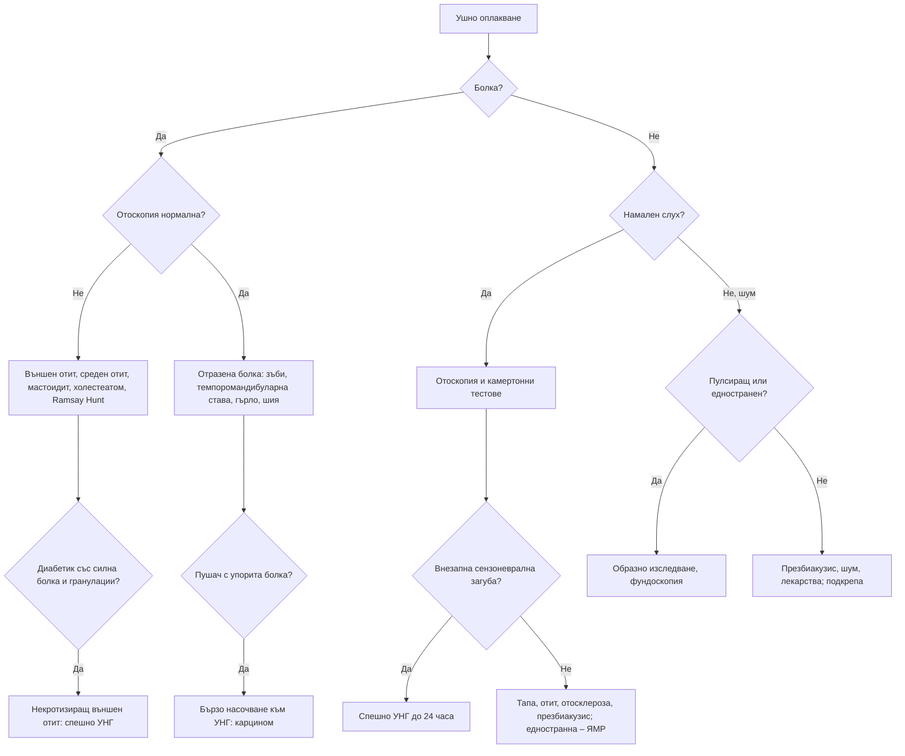

# Глава 61. Болка в ухото, намален слух и шум в ушите

> **Част XII. Очи, уши, нос, гърло и шия**

## Цели на главата

- Да се разграничава първичната (от ухото) от отразената болка в ухото.
- Да се насочва бързо пациентът с упорита болка в ухото и нормален отоскопски статус, при който може да има карцином на главата и шията.
- Да се разпознава некротизиращият външен отит при възрастни диабетици.
- Да се разграничават кондуктивната и сензоневралната загуба на слуха с камертонни тестове.
- Да се третира внезапната сензоневрална загуба на слуха като спешно състояние.
- Да се определят показанията за образно изследване при едностранен и пулсиращ шум в ушите.

## Ключови моменти

- Упоритата болка в ухото при нормален отоскопски статус налага търсене на отразена болка. При пушач или злоупотребяващ с алкохол човек се изключва карцином на главата и шията *(SORT C [4])*.
- Силна нощна болка в ухото с гранулации в слуховия проход при възрастен диабетик е некротизиращ външен отит до доказване на противното *(SORT C [1])*.
- Внезапната загуба на слуха (развила се за до 3 дни през последните 30 дни) се насочва за преглед до 24 часа *(SORT C [3])*.
- Камертонните тестове помагат да се различи кондуктивната от сензоневралната загуба, но точността им варира и не заместват аудиометрията *(SORT B [5])*.
- Едностранният или асиметричният шум в ушите и сензоневралната загуба на слуха налагат обсъждане на ЯМР на вътрешните слухови проходи *(SORT C [6, 7])*.
- Пулсиращият шум в ушите изисква образно изследване и фундоскопия *(SORT C [7])*.

---

## А. Болка в ухото

### 1. Първична болка в ухото (от ухото)

*Таблица 61.1. Причини за първична болка в ухото.*

| Заболяване | Ключови белези |
|---|---|
| **Външен отит** | Болка при дърпане на ушната мида или натиск върху трагуса, оток на слуховия проход, секрет; плуване, влажна среда, травма от клечки за уши |
| **Некротизиращ (малигнен) външен отит** | Възрастни диабетици или имунокомпрометирани; силна, упорита, нощна болка, гноен секрет, гранулации в слуховия проход, пареза на лицевия нерв и други черепномозъчни нерви; *Pseudomonas*; остеомиелит на основата на черепа – спешно [1] |
| **Остър среден отит** | По-чест при деца; болка, треска, изпъкнала, зачервена тъпанчева мембрана; при перфорация – секрет и облекчаване на болката [2] |
| **Секреторен отит** | Намален слух, усещане за пълнота; при възрастни – едностранният персистиращ секреторен отит изисква оглед на назофаринкса (карцином на назофаринкса; особено при произход от Китай и Югоизточна Азия) [3] |
| **Мастоидит** | Болка и оток зад ухото, изпъкнала ушна мида, треска – спешно |
| **Холестеатом** | Хроничен секрет с неприятна миризма, кондуктивна загуба на слуха, ретракционен джоб; риск от усложнения (пареза на лицевия нерв, менингит, абсцес) |
| **Херпес зостер отикус (синдром на Ramsay Hunt)** | Силна болка, везикули в ухото, периферна пареза на лицевия нерв, световъртеж, загуба на слуха |
| **Перихондрит** | Зачервяване и оток на ушната мида, без засягане на меката част (лобулуса); пиърсинг на хрущяла; *Pseudomonas* |
| **Фурункул, баротравма, чуждо тяло, церуменова тапа** | Съответната анамнеза и находка |
| **Тумори на външното ухо** | Плоскоклетъчен и базоцелуларен карцином по ушната мида (слънчева експозиция) |

### 2. Отразена болка в ухото (при нормален отоскопски статус)

При възрастни значителна част от случаите на болка в ухото са **отразени** [4]. Причините са:

- зъби (кътници), темпоромандибуларна става (най-честите);
- фарингит, тонзилит, **перитонзиларен абсцес**, след тонзилектомия;
- **шиен отдел на гръбначния стълб**;
- тригеминална и глософарингеална невралгия;
- паротит, синузит;
- гастроезофагеален рефлукс;
- гигантоклетъчен артериит, тиреоидит, каротидодиния;
- **карциноми на ларинкса, фаринкса и корена на езика** – **пушач или злоупотребяващ с алкохол човек с упорита едностранна болка в ухото и нормален отоскопски статус се насочва бързо към УНГ** [4].

---

## Б. Намален слух

### 3. Кондуктивна или сензоневрална загуба?

#### 3.1. Камертонни тестове (512 Hz)

*Таблица 61.2. Камертонни тестове (512 Hz).*

| Тест | Кондуктивна загуба | Сензоневрална загуба |
|---|---|---|
| **Rinne** (въздушна срещу костна проводимост) | Костната > въздушната (отрицателен тест) на засегнатото ухо | Въздушната > костната (положителен тест), но и двете са намалени |
| **Weber** (камертон на средата на челото) | Звукът се латерализира към засегнатото ухо | Звукът се латерализира към здравото ухо |

Точността на камертонните тестове варира значително между изследванията. Например чувствителността на теста на Rinne за кондуктивна загуба с камертон 512 Hz е между 16% и 87%. Затова тестовете не заместват аудиометрията [5].

#### 3.2. Причини

*Таблица 61.3. Причини за кондуктивна и сензоневрална загуба на слуха.*

| Кондуктивна (външно и средно ухо) | Сензоневрална (кохлея и слухов нерв) |
|---|---|
| **Церуменова тапа** (най-честата) | Презбиакузис (двустранен, симетричен, високочестотен) |
| Секреторен отит, остър среден отит | Шумова травма (типичен спад при 4 kHz) |
| Перфорация на тъпанчевата мембрана | Ототоксични лекарства: аминогликозиди, цисплатин, бримкови диуретици (високи интравенозни дози), макролиди и салицилати във високи дози (обратимо), хинин |
| **Отосклероза** (млади жени, прогресираща, фамилна, влошава се при бременност; нормална тъпанчева мембрана) | Болест на Menière (флуктуираща нискочестотна загуба с вертиго) |
| Холестеатом | Вестибуларен шваном (едностранна прогресираща загуба) |
| Прекъсване на слуховата верижка (травма) | **Внезапна сензоневрална загуба на слуха** |
| Чуждо тяло, екзостози | Инфекции (паротит, морбили, менингит, сифилис, лаймска болест, HIV, CMV при новородени) |
| | Автоимунно заболяване на вътрешното ухо, генетични, травма (фрактура на темпоралната кост), инсулт |

### 4. Внезапна сензоневрална загуба на слуха

- **Определение:** загуба на ≥ 30 dB в 3 последователни честоти за **≤ 72 часа** [6].
- Обикновено едностранна, често със **шум в ухото**, пълнота, понякога вертиго.
- Лесно се бърка с церуменова тапа или „запушване от настинка“. Камертонните тестове разграничават: при кондуктивна загуба тестът на Weber се латерализира към засегнатото ухо, а при сензоневрална – към здравото.
- **Спешно състояние:** насочване към УНГ в **рамките на 24 часа** (аудиометрия, кортикостероиди – най-ефективни при ранно начало) [3, 6].
- **Причини:** идиопатична (най-често), инсулт в басейна на предната долна мозъчечна артерия (особено с вертиго и други неврологични белези), множествена склероза, вестибуларен шваном, сифилис, автоимунни заболявания, вирусни инфекции.
- **ЯМР на вътрешните слухови проходи** за изключване на вестибуларен шваном [6].

---

## В. Шум в ушите (тинитус)

### 5. Класификация

*Таблица 61.4. Шум в ушите (тинитус): класификация.*

| Вид | Причини |
|---|---|
| **Непулсиращ, двустранен** | Презбиакузис, шумова травма, ототоксични лекарства (салицилати, хинин, аминогликозиди), церуменова тапа, секреторен отит; тревожността и депресията го засилват |
| **Непулсиращ, едностранен** | Вестибуларен шваном (ЯМР [7]), болест на Menière, внезапна загуба на слуха, отосклероза, дисфункция на темпоромандибуларната става |
| **Пулсиращ** (синхронен с пулса) | Идиопатична интракраниална хипертензия (млади жени с наднормено тегло), дурална артериовенозна фистула, каротидна стеноза или дисекация, гломусен тумор (червена маса зад тъпанчевата мембрана), артериовенозни малформации, състояния с висок сърдечен дебит (анемия, тиреотоксикоза, бременност), венозно бучене, дивертикул на сигмоидния синус |
| **Обективен „щракащ“** | Миоклонус на мекото небце, дисфункция на евстахиевата тръба |

Пулсиращият шум в ушите изисква образно изследване (КТ или ЯМР ангиография и венография) и фундоскопия (едем на папилата) [7].

---

## 6. Безопасна диагностична стратегия

*Таблица 61.5. Безопасна диагностична стратегия.*

| Въпрос | Отговор |
|---|---|
| **Вероятна диагноза** | Външен отит, остър среден отит, церуменова тапа, отразена болка от зъбите и темпоромандибуларната става, презбиакузис, шумова травма |
| **Сериозни заболявания, които не бива да се пропускат** | Некротизиращ външен отит; мастоидит; карцином на главата и шията (отразена болка); внезапна сензоневрална загуба на слуха; вестибуларен шваном; холестеатом; карцином на назофаринкса (едностранен секреторен отит при възрастен); инсулт; дурална артериовенозна фистула и идиопатична интракраниална хипертензия (пулсиращ шум); менингит като усложнение |
| **Чести капани** | Внезапна сензоневрална загуба на слуха, приета за тапа или отит; болка в ухото от темпоромандибуларната става и зъбите; синдром на Ramsay Hunt преди везикулите; ототоксични лекарства; отосклероза при млада жена |
| **Маскиращи заболявания** | Захарен диабет, лекарства, гръбначна дисфункция (шиен отдел), депресия (тинитус) |
| **Психосоциални аспекти** | Тревожност и депресия, свързани с тинитуса; социална изолация поради загуба на слуха |

---

## 7. Червени флагове

- **Внезапна загуба на слуха.**
- **Едностранна** или асиметрична сензоневрална загуба на слуха или шум в ухото.
- **Пулсиращ** шум в ухото.
- **Неврологични белези**: пареза на лицевия нерв, вертиго, атаксия, други черепномозъчни нерви.
- Силна болка при диабетик или имунокомпрометиран, гранулации в слуховия проход.
- **Оток зад ухото**, изпъкнала ушна мида (мастоидит).
- **Едностранен персистиращ секреторен отит при възрастен.**
- **Упорита болка в ухото при нормален отоскопски статус** у пушач (карцином).
- Кървав секрет, признаци на холестеатом.
- Травма на главата със загуба на слуха, изтичане на бистра течност (ликвор) или пареза на лицевия нерв.

---

## 8. Диагностичен алгоритъм

*Фигура 61.1. Диагностичен алгоритъм при болка в ухото, намален слух и шум в ушите. Схема на авторите въз основа на източниците, цитирани в главата.*

Текстово описание на фигура 61.1

1. Ушно оплакване. Следва: към т. 2.
2. **Въпрос:** Болка? Да – към т. 3; Не – към т. 4.
3. **Въпрос:** Отоскопия нормална? Не – към т. 5; Да – към т. 6.
4. **Въпрос:** Намален слух? Да – към т. 7; Не, шум – към т. 8.
5. Външен отит, среден отит, мастоидит, холестеатом, Ramsay Hunt. Следва: към т. 9.
6. Отразена болка: зъби, темпоромандибуларна става, гърло, шия. Следва: към т. 10.
7. Отоскопия и камертонни тестове. Следва: към т. 11.
8. **Въпрос:** Пулсиращ или едностранен? Да – към т. 12; Не – към т. 13.
9. **Въпрос:** Диабетик със силна болка и гранулации? Да – към т. 14.
10. **Въпрос:** Пушач с упорита болка? Да – към т. 15.
11. **Въпрос:** Внезапна сензоневрална загуба? Да – към т. 16; Не – към т. 17.
12. Образно изследване, фундоскопия.
13. Презбиакузис, шум, лекарства; подкрепа.
14. Некротизиращ външен отит: спешно УНГ.
15. Бързо насочване към УНГ: карцином.
16. Спешно УНГ до 24 часа.
17. Тапа, отит, отосклероза, презбиакузис; едностранна – ЯМР.

---

## 9. Кога и колко спешно да насочим

*Таблица 61.6. Кога и колко спешно да насочим.*

| Спешност | Клинична ситуация |
|---|---|
| **Незабавно (112 или спешно отделение)** | Едностранна загуба на слуха с изтръпване или изкривяване на лицето на същата страна при подозрение за инсулт – инсултен път [3]; шум в ушите с внезапни значими неврологични симптоми или неовладяно вертиго [7]; мастоидит; травма на главата с изтичане на ликвор или пареза на лицевия нерв |
| **В същия ден** | Внезапна загуба на слуха (за до 3 дни) през последните 30 дни – УНГ или спешно отделение до 24 часа [3]; некротизиращ външен отит [1]; имунокомпрометиран пациент с болка и секрет от ухото без подобрение за 72 часа [3]; синдром на Ramsay Hunt; перихондрит; шум в ушите с висок суициден риск – кризисен екип [7] |
| **Бързо (до 2 седмици)** | Внезапна загуба на слуха преди повече от 30 дни или бързо влошаване за 4–90 дни [3]; упорита едностранна болка в ухото при нормален отоскопски статус у пушач [4]; едностранен секреторен отит при възрастен без инфекция на горните дихателни пътища [3]; шум в ушите със силен дистрес въпреки подкрепата [7] |
| **Планово** | Едностранна или асиметрична загуба на слуха или шум в ухото – ЯМР [6, 7]; постоянен пулсиращ шум в ушите – образно изследване [7]; флуктуираща загуба на слуха; подозрение за холестеатом; хроничен секрет от ухото; отосклероза |
| **Проследяване в общата практика** | Външен отит; неусложнен остър среден отит; церуменова тапа; презбиакузис – аудиологична оценка и слухов апарат; двустранен непулсиращ шум в ушите без други симптоми – информация и подкрепа [7] |

---

## 10. Клинични перли

- При упорита болка в ухото и нормален отоскопски статус огледайте зъбите, темпоромандибуларната става, гърлото и шията. При пушач помислете за карцином.
- Възрастен диабетик със силна болка в ухото, която не се повлиява от капки: некротизиращ външен отит. Потърсете пареза на лицевия нерв.
- Внезапната загуба на слуха не е „запушване“. Направете тест на Weber и насочете спешно при сензоневрална загуба.
- Едностранен шум в ухото или едностранна сензоневрална загуба: ЯМР за вестибуларен шваном.
- Пулсиращ шум при млада жена с наднормено тегло и главоболие: идиопатична интракраниална хипертензия. Направете фундоскопия.
- Едностранен секреторен отит при възрастен: огледайте назофаринкса.
- Силна болка в ухото, последвана от везикули и слабост на лицето: синдром на Ramsay Hunt.
- Проверете за ототоксични лекарства при нова загуба на слуха и шум.

---

## 11. Клиничен случай

**Етап 1 – клинична картина.** Мъж на 67 години с диабет тип 2 (HbA1c 9,4%) се оплаква от силна болка в дясното ухо от 4 седмици. Болката го буди нощем и има гноен секрет. Три курса ушни капки не са помогнали.

> **Въпрос 1.** Кои белези в анамнезата са тревожни?

**Етап 2 – преглед и изследвания.** От два дни пациентът не може да затвори дясното си око и устата му е „изкривена“. При отоскопия в долната стена на слуховия проход се виждат гранулации. CRP е 48 mg/l, а СУЕ – 86 mm/h.

> **Въпрос 2.** Каква е диагнозата и какво означава парезата на лицевия нерв?

> **Въпрос 3.** Какво е поведението?

Обсъждане и отговори

**Отговор 1.** Лошо контролираният диабет при възрастен човек, силната нощна болка и липсата на ефект от капките са тревожни белези. Те насочват към некротизиращ външен отит, а не към обикновен външен отит [1, 4].

**Отговор 2.** Силната, упорита болка, гнойният секрет и гранулациите в слуховия проход при лошо контролиран възрастен диабетик са типични за некротизиращ (малигнен) външен отит. Причинителят обикновено е *Pseudomonas aeruginosa*. Периферната пареза на лицевия нерв показва, че инфекцията е преминала в остеомиелит на основата на черепа [1].

**Отговор 3.** Пациентът се насочва **спешно** към УНГ. Необходими са КТ и ЯМР, посявка, биопсия на гранулациите (за изключване на карцином), продължително интравенозно антипсевдомонасно лечение и добър контрол на гликемията [1].

**Поука.** „Упорит външен отит“ при възрастен диабетик не е банално заболяване. Той може да е животозастрашаващ остеомиелит.

---

## Обобщение

- Болката в ухото е първична или отразена. При нормален отоскопски статус се търсят причини в зъбите, темпоромандибуларната става, гърлото и шията, а при пушач – карцином.
- Некротизиращият външен отит при възрастен диабетик и мастоидитът са спешни.
- Камертонните тестове разграничават кондуктивната от сензоневралната загуба на слуха. Внезапната сензоневрална загуба се насочва за преглед до 24 часа.
- Едностранният или пулсиращият шум в ушите изисква изследване, а двустранният непулсиращ шум без други симптоми – информация и подкрепа.

## Самопроверка

### Въпроси с един верен отговор

**1.** *(основно ниво)* Мъж на 45 години се събужда със „запушено“ ляво ухо и шум в него. Отоскопията е нормална. Тестът на Weber се латерализира към дясното ухо. Кое е правилното поведение?

- **А.** Деконгестант и контрол след седмица
- **Б.** Насочване към УНГ или спешно отделение за преглед до 24 часа
- **В.** Промиване на ухото
- **Г.** Антибиотик за среден отит
- **Д.** Планова аудиометрия след месец

Отговор и обосновка

**Верен отговор: Б.** Латерализацията към здравото ухо при нормална отоскопия показва сензоневрална загуба. Внезапната загуба на слуха през последните 30 дни изисква преглед до 24 часа [3]. Кортикостероидите са най-ефективни при ранно начало [6].

**2.** *(основно ниво)* Мъж на 62 години, пушач, който пие редовно алкохол, има болка в лявото ухо от 6 седмици. Отоскопията е нормална, но има лека болка при преглъщане. Кое е правилното поведение?

- **А.** Ушни капки
- **Б.** Бързо насочване към УНГ за изключване на карцином на фаринкса или ларинкса
- **В.** Антибиотик за среден отит
- **Г.** Успокояване
- **Д.** Рентгенография на шийния отдел на гръбначния стълб

Отговор и обосновка

**Верен отговор: Б.** Упоритата болка в ухото при нормален отоскопски статус у пушач и злоупотребяващ с алкохол човек може да е отразена болка от карцином на главата и шията [4].

**3.** *(основно ниво)* Жена на 30 години има постепенно намаляващ слух в дясното ухо. Тъпанчевата мембрана е нормална. Тестът на Rinne е отрицателен вдясно, а тестът на Weber се латерализира вдясно. Какъв е видът на загубата и най-вероятната причина?

- **А.** Сензоневрална – вестибуларен шваном
- **Б.** Кондуктивна – отосклероза
- **В.** Сензоневрална – презбиакузис
- **Г.** Кондуктивна – перфорация на тъпанчевата мембрана
- **Д.** Слухът е нормален

Отговор и обосновка

**Верен отговор: Б.** Отрицателният тест на Rinne и латерализацията към засегнатото ухо показват кондуктивна загуба. При нормална тъпанчева мембрана у млада жена най-вероятна е отосклерозата. Поради променливата точност на камертонните тестове е нужна аудиометрия [5].

**4.** *(напреднало ниво)* Жена на 29 години с ИТМ 36 има пулсиращ шум в двете уши, главоболие и секундни притъмнявания на зрението при изправяне. Кое е най-важното следващо действие?

- **А.** Успокояване и звукова терапия
- **Б.** Фундоскопия и образно изследване
- **В.** Само аудиометрия
- **Г.** Антихистамин
- **Д.** Промиване на ушите

Отговор и обосновка

**Верен отговор: Б.** Пулсиращият шум в ушите изисква образно изследване и фундоскопия [7]. Картината насочва към идиопатична интракраниална хипертензия с едем на папилата.

**5.** *(напреднало ниво)* Мъж на 50 години има шум в дясното ухо от година. Аудиограмата показва асиметрична сензоневрална загуба на слуха вдясно. Понякога е неустойчив при ходене. Кое изследване е най-подходящо?

- **А.** КТ на синусите
- **Б.** ЯМР на вътрешните слухови проходи
- **В.** Доплерова ехография на каротидите
- **Г.** ЕЕГ
- **Д.** Не е нужно изследване

Отговор и обосновка

**Верен отговор: Б.** Едностранният шум в ухото с асиметрична сензоневрална загуба и неустойчивост налага ЯМР на вътрешните слухови проходи за изключване на вестибуларен шваном [6, 7].

### Задача

Мъж на 55 години, пушач, от 2 месеца има пълнота и намален слух в лявото ухо без предшестваща настинка. Тъпанчевата мембрана е ретрахирана, зад нея се вижда ниво на течност. Как ще подходите?

Решение

Едностранният персистиращ секреторен отит при възрастен без инфекция на горните дихателни пътища изисква оглед на назофаринкса за изключване на **карцином на назофаринкса**. Рискът е особено висок при произход от Китай и Югоизточна Азия, при които NICE препоръчва бързо насочване при подозрение за рак [3]. Питат се кръвотечение от носа, запушване на носа и симптоми от черепномозъчните нерви и се палпират лимфните възли на шията. Пациентът се насочва към УНГ за назофарингоскопия, аудиометрия и тимпанометрия.

### OSCE станция: Отоскопия и камертонни тестове при намален слух

**Време:** 7 минути. **Ниво:** основно (студенти, специализанти).

**Задача за кандидата.** Жена на 40 години съобщава за намален слух в дясното ухо от 2 дни. Прегледайте ушите, направете камертонните тестове, тълкувайте ги и решете колко спешно е насочването.

**Информация за симулирания пациент (за изпитващия).** Отоскопията е нормална. Тестът на Weber се латерализира вляво, а тестът на Rinne е положителен двустранно. Има шум в дясното ухо.

*Таблица 61.7. OSCE станция „Отоскопия и камертонни тестове при намален слух“ – критерии за оценяване.*

| Критерий | Точки |
|---|---|
| Пита за началото, едностранността, шума, вертигото, болката, секрета, травмата и лекарствата | 2 |
| Прави отоскопия правилно на двете уши | 2 |
| Прави теста на Weber правилно (камертон 512 Hz) | 1 |
| Прави теста на Rinne правилно | 1 |
| Тълкува правилно находката като сензоневрална загуба вдясно | 2 |
| Насочва за преглед до 24 часа и обяснява причината на пациентката | 2 |
| **Общо** | **10** |

**Праг за успешно изпълнение:** 7 от 10 точки, включително правилното тълкуване и насочването до 24 часа.

## Литература

1. Hopkins ME, Bennett A, Henderson N, MacSween KF, Baring D, Sutherland R. A retrospective review and multi-specialty, evidence-based guideline for the management of necrotising otitis externa. J Laryngol Otol. 2020;134(6):487-492. doi:10.1017/S0022215120001061. PMID: 32498757.
2. Lieberthal AS, Carroll AE, Chonmaitree T, Ganiats TG, Hoberman A, Jackson MA, et al. The diagnosis and management of acute otitis media. Pediatrics. 2013;131(3):e964-99. doi:10.1542/peds.2012-3488. PMID: 23439909.
3. National Institute for Health and Care Excellence. Hearing loss in adults: assessment and management (NICE guideline NG98). London: NICE; 2018 [актуализирано 2023]. Достъпно на: https://www.nice.org.uk/guidance/ng98
4. Harrison E, Cronin M. Otalgia. Aust Fam Physician. 2016;45(7):493-7. PMID: 27610432.
5. Kelly EA, Li B, Adams ME. Diagnostic Accuracy of Tuning Fork Tests for Hearing Loss: A Systematic Review. Otolaryngol Head Neck Surg. 2018;159(2):220-230. doi:10.1177/0194599818770405. PMID: 29661046.
6. Chandrasekhar SS, Tsai Do BS, Schwartz SR, Bontempo LJ, Faucett EA, Finestone SA, et al. Clinical Practice Guideline: Sudden Hearing Loss (Update). Otolaryngol Head Neck Surg. 2019;161(1_suppl):S1-S45. doi:10.1177/0194599819859885. PMID: 31369359.
7. National Institute for Health and Care Excellence. Tinnitus: assessment and management (NICE guideline NG155). London: NICE; 2020. Достъпно на: https://www.nice.org.uk/guidance/ng155

*Последна проверка на съдържанието: септември 2026 г. Следващ планиран преглед: септември 2027 г. (вж. „Политика за актуализация“ в README).*

<!-- навигация -->

---

[← Глава 60. Нарушения на зрението](60-zrenie.md) · [Съдържание](../README.md) · [Глава 62. Гърло, нос, устна кухина и шия →](62-garlo-nos-shia.md)
