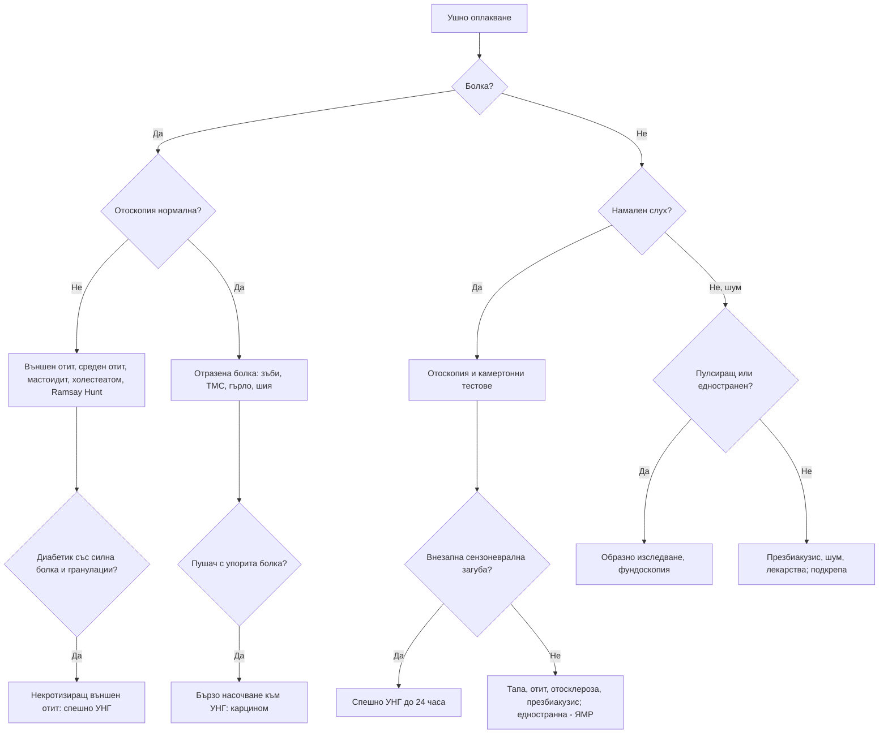

# Глава 61. Болка в ухото, намален слух и шум в ушите

> **Част XII. Очи, уши, нос, гърло и шия**

## Цели на главата

- Да се разграничава първичната (от ухото) от отразената болка в ухото.
- Да се помни, че упоритата болка в ухото при нормален отоскопски статус може да е проява на карцином на главата и шията.
- Да се разпознава некротизиращият външен отит при възрастни диабетици.
- Да се разграничават кондуктивната и сензоневралната загуба на слуха с камертонни тестове.
- Да се третира внезапната сензоневрална загуба на слуха като спешно състояние.
- Да се подхожда към едностранния и пулсиращия шум в ушите.

---

## А. БОЛКА В УХОТО

## 1. Първична болка в ухото (от ухото)

| Заболяване | Ключови белези |
|---|---|
| **Външен отит** | Болка при **дърпане на ушната мида** или натиск върху трагуса, оток на слуховия проход, секрет; плуване, влажна среда, травма от клечки за уши |
| **Некротизиращ (малигнен) външен отит** | **Възрастни диабетици** или имунокомпрометирани; **силна, упорита, нощна болка**, гноен секрет, **гранулации** в слуховия проход, **пареза на лицевия нерв** и други черепномозъчни нерви; *Pseudomonas*; остеомиелит на основата на черепа — **спешно** |
| **Остър среден отит** | По-чест при деца; болка, треска, **изпъкнала, зачервена тъпанчева мембрана**; при перфорация — секрет и облекчаване на болката |
| **Секреторен отит** | Намален слух, усещане за пълнота; **при възрастни — едностранният персистиращ секреторен отит изисква оглед на назофаринкса** (карцином на назофаринкса) |
| **Мастоидит** | Болка и оток **зад ухото**, изпъкнала ушна мида, треска — спешно |
| **Холестеатом** | Хроничен секрет с **неприятна миризма**, кондуктивна загуба на слуха, ретракционен джоб; риск от усложнения (пареза на лицевия нерв, менингит, абсцес) |
| **Херпес зостер отикус (синдром на Ramsay Hunt)** | Силна болка, **везикули** в ухото, **периферна пареза на лицевия нерв**, световъртеж, загуба на слуха |
| **Перихондрит** | Зачервяване и оток на ушната мида, **без засягане на меката част (лобулуса)**; пиърсинг на хрущяла; *Pseudomonas* |
| **Фурункул, баротравма, чуждо тяло, церуменова тапа** | Съответната анамнеза и находка |
| **Тумори на външното ухо** | Сквамозноклетъчен и базоцелуларен карцином по ушната мида (слънчева експозиция) |

## 2. Отразена болка в ухото (при нормален отоскопски статус)

При възрастни около половината от случаите на болка в ухото са **отразени**. Причините са:

- **зъби** (кътници), **темпоромандибуларна става** (най-честите);
- фарингит, тонзилит, **перитонзиларен абсцес**, след тонзилектомия;
- **шиен отдел на гръбначния стълб**;
- тригеминална и глософарингеална невралгия;
- паротит, синузит;
- гастроезофагеален рефлукс;
- гигантоклетъчен артериит, тиреоидит, каротидодиния;
- **карциноми на ларинкса, фаринкса и корена на езика** — **пушач или злоупотребяващ с алкохол човек с упорита едностранна болка в ухото и нормален отоскопски статус се насочва бързо към УНГ**.

---

## Б. НАМАЛЕН СЛУХ

## 3. Кондуктивна или сензоневрална загуба?

### 3.1. Камертонни тестове (512 Hz)

| Тест | Кондуктивна загуба | Сензоневрална загуба |
|---|---|---|
| **Rinne** (въздушна срещу костна проводимост) | **Костната > въздушната** (отрицателен тест) на засегнатото ухо | Въздушната > костната (положителен тест), но и двете са намалени |
| **Weber** (камертон на средата на челото) | Звукът се **латерализира към засегнатото** ухо | Звукът се **латерализира към здравото** ухо |

### 3.2. Причини

| Кондуктивна (външно и средно ухо) | Сензоневрална (кохлея и слухов нерв) |
|---|---|
| **Церуменова тапа** (най-честата) | **Презбиакузис** (двустранен, симетричен, високочестотен) |
| Секреторен отит, остър среден отит | **Шумова травма** (типичен спад при 4 kHz) |
| Перфорация на тъпанчевата мембрана | **Ототоксични лекарства**: аминогликозиди, цисплатин, бримкови диуретици (високи интравенозни дози), макролиди и салицилати във високи дози (обратимо), хинин |
| **Отосклероза** (млади жени, прогресираща, фамилна, влошава се при бременност; нормална тъпанчева мембрана) | **Болест на Menière** (флуктуираща нискочестотна загуба с вертиго) |
| Холестеатом | **Вестибуларен шваном** (едностранна прогресираща загуба) |
| Прекъсване на слуховата верижка (травма) | **Внезапна сензоневрална загуба на слуха** |
| Чуждо тяло, екзостози | Инфекции (паротит, морбили, менингит, сифилис, лаймска болест, HIV, CMV при новородени) |
| | Автоимунно заболяване на вътрешното ухо, генетични, травма (фрактура на темпоралната кост), инсулт |

## 4. Внезапна сензоневрална загуба на слуха

- **Определение:** загуба на ≥ 30 dB в 3 последователни честоти за **≤ 72 часа**.
- Обикновено едностранна, често със **шум в ухото**, пълнота, понякога вертиго.
- **Лесно се бърка** с церуменова тапа или „запушване от настинка“. **Камертонните тестове разграничават**: при кондуктивна загуба тестът на Weber се латерализира към засегнатото ухо, а при сензоневрална — към здравото.
- **Спешно състояние:** насочване към УНГ в **рамките на 24 часа** (аудиометрия, кортикостероиди — най-ефективни при ранно начало).
- **Причини:** идиопатична (най-често), **инсулт** в басейна на предната долна мозъчечна артерия (особено с вертиго и други неврологични белези), множествена склероза, вестибуларен шваном, **сифилис**, автоимунни заболявания, вирусни инфекции.
- **ЯМР на вътрешните слухови проходи** за изключване на вестибуларен шваном.

---

## В. ШУМ В УШИТЕ (ТИНИТУС)

## 5. Класификация

| Вид | Причини |
|---|---|
| **Непулсиращ, двустранен** | Презбиакузис, шумова травма, ототоксични лекарства (салицилати, хинин, аминогликозиди), церуменова тапа, секреторен отит; тревожността и депресията го засилват |
| **Непулсиращ, едностранен** | **Вестибуларен шваном** (ЯМР), **болест на Menière**, внезапна загуба на слуха, отосклероза, дисфункция на темпоромандибуларната става |
| **Пулсиращ** (синхронен с пулса) | **Идиопатична интракраниална хипертензия** (млади жени с наднормено тегло), **дурална артериовенозна фистула**, **каротидна стеноза или дисекация**, **гломусен тумор** (червена маса зад тъпанчевата мембрана), артериовенозни малформации, **състояния с висок сърдечен дебит** (анемия, тиреотоксикоза, бременност), венозно бучене, дивертикул на сигмоидния синус |
| **Обективен „щракащ“** | Миоклонус на мекото небце, дисфункция на евстахиевата тръба |

**Пулсиращият шум в ушите** изисква **образно изследване** (КТ или МР ангиография и венография) и фундоскопия (едем на папилата).

---

## 6. Безопасна диагностична стратегия

| Въпрос | Отговор |
|---|---|
| **Вероятна диагноза** | Външен отит, остър среден отит, церуменова тапа, отразена болка от зъбите и темпоромандибуларната става, презбиакузис, шумова травма |
| **Сериозни заболявания, които не бива да се пропускат** | **Некротизиращ външен отит**; **мастоидит**; **карцином на главата и шията** (отразена болка); **внезапна сензоневрална загуба на слуха**; **вестибуларен шваном**; **холестеатом**; **карцином на назофаринкса** (едностранен секреторен отит при възрастен); **инсулт**; дурална артериовенозна фистула и **идиопатична интракраниална хипертензия** (пулсиращ шум); менингит като усложнение |
| **Чести капани** | Внезапна сензоневрална загуба на слуха, приета за тапа или отит; болка в ухото от темпоромандибуларната става и зъбите; синдром на Ramsay Hunt преди везикулите; ототоксични лекарства; отосклероза при млада жена |
| **Маскиращи заболявания** | Захарен диабет, лекарства, гръбначна дисфункция (шиен отдел), депресия (тинитус) |
| **Психосоциални аспекти** | Тревожност и депресия, свързани с тинитуса; социална изолация поради загуба на слуха |

---

## 7. Червени флагове

- **Внезапна загуба на слуха.**
- **Едностранна** или асиметрична сензоневрална загуба на слуха или шум в ухото.
- **Пулсиращ** шум в ухото.
- **Неврологични белези**: пареза на лицевия нерв, вертиго, атаксия, други черепномозъчни нерви.
- **Силна болка при диабетик** или имунокомпрометиран, **гранулации** в слуховия проход.
- **Оток зад ухото**, изпъкнала ушна мида (мастоидит).
- **Едностранен персистиращ секреторен отит при възрастен.**
- **Упорита болка в ухото при нормален отоскопски статус** у пушач (карцином).
- Кървав секрет, признаци на холестеатом.
- Травма на главата със загуба на слуха, изтичане на бистра течност (ликвор) или пареза на лицевия нерв.

---

## 8. Диагностичен алгоритъм

---

## 9. Клинични перли

- При упорита болка в ухото и нормален отоскопски статус огледайте зъбите, темпоромандибуларната става, гърлото и шията. При пушач мислете за карцином.
- Възрастен диабетик със силна болка в ухото, която не се повлиява от капки: некротизиращ външен отит. Потърсете пареза на лицевия нерв.
- Внезапната загуба на слуха не е „запушване“. Направете тест на Weber и насочете спешно при сензоневрална загуба.
- Едностранен шум в ухото или едностранна сензоневрална загуба: ЯМР за вестибуларен шваном.
- Пулсиращ шум при млада жена с наднормено тегло и главоболие: идиопатична интракраниална хипертензия. Направете фундоскопия.
- Едностранен секреторен отит при възрастен: огледайте назофаринкса.
- Силна болка в ухото, последвана от везикули и слабост на лицето: синдром на Ramsay Hunt.
- Проверете за ототоксични лекарства при нова загуба на слуха и шум.

---

## 10. Клиничен случай

**Случай.** Мъж на 67 години с диабет тип 2 (HbA1c 9,4%) се оплаква от силна болка в дясното ухо от 4 седмици, която го буди нощем. Има гноен секрет. Три курса ушни капки не помагат. От два дни не може да затвори дясното си око и устата му е „изкривена“. При отоскопия в долната стена на слуховия проход се виждат гранулации. CRP 48 mg/l, СУЕ 86 mm/h.

**Въпроси.** 1) Каква е диагнозата? 2) Какво означава парезата на лицевия нерв?

**Обсъждане.** Силната, упорита, нощна болка, гнойният секрет и **гранулациите** в слуховия проход при **лошо контролиран възрастен диабетик** са типични за **некротизиращ (малигнен) външен отит**. Причинителят обикновено е *Pseudomonas aeruginosa*. **Периферната пареза на лицевия нерв** показва, че инфекцията е преминала в **остеомиелит на основата на черепа**. Пациентът се насочва **спешно** за КТ и ЯМР, посявка, биопсия (за изключване на карцином) и продължително интравенозно антипсевдомонасно лечение.

**Поука.** „Упорит външен отит“ при възрастен диабетик не е банално заболяване. Той може да е животозастрашаващ остеомиелит.

<!-- навигация -->

---

[← Глава 60. Нарушения на зрението](60-zrenie.md) · [Съдържание](../README.md) · [Глава 62. Гърло, нос, устна кухина и шия →](62-garlo-nos-shia.md)
