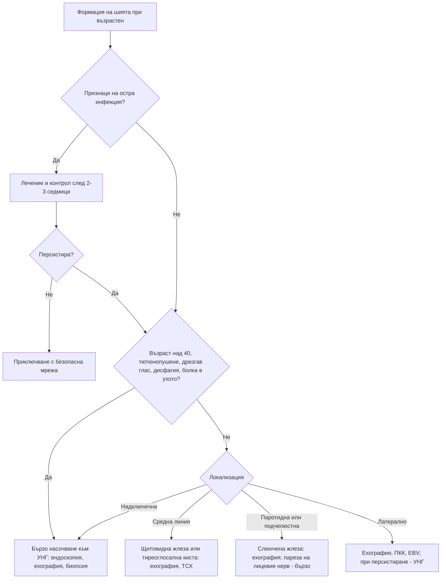

# Глава 62. Гърло, нос, устна кухина и шия

> **Част XII. Очи, уши, нос, гърло и шия**

## Цели на главата

- Да се разграничават вирусният и стрептококовият тонзилит и да се разпознават опасните причини за болки в гърлото: перитонзиларен абсцес, епиглотит, синдром на Lemierre, агранулоцитоза.
- Да се помни, че дрезгавият глас над 3 седмици изисква ларингоскопия.
- Да се разпознават едностранните носни симптоми като червен флаг.
- Да се подхожда към кървенето от носа, аносмията и язвите в устата.
- Да се оценяват формациите на шията според възрастта и локализацията.

---

## А. БОЛКИ В ГЪРЛОТО

## 1. Причини

| Причина | Ключови белези |
|---|---|
| **Вирусен фарингит** | Най-честата причина; хрема, кашлица, конюнктивит, дрезгав глас |
| **Стрептококов тонзилит** | Ексудат по сливиците, болезнени предни шийни възли, треска, **липса на кашлица** |
| **Инфекциозна мононуклеоза** | Млади хора; ексудат, **задни шийни възли**, петехии по небцето, умора, спленомегалия; обрив след амоксицилин |
| **Остра HIV инфекция** | Фарингит, обрив, язви, лимфаденопатия (вж. глава 7) |
| **Гонококов фарингит** | Орален секс; често безсимптомен |
| **Херпангина, синдром „ръка-крак-уста“** | Везикули и язвички по небцето (Coxsackie) |
| **Херпесен гингивостоматит** | Деца; болезнени везикули и язви по венците |
| **Кандидоза** | Инхалаторни кортикостероиди, имуносупресия, HIV |
| **Агранулоцитоза** | **Некротичен тонзилит** при пациент на **метамизол, тиамазол, карбимазол, клозапин, сулфасалазин** — незабавна ПКК |
| **Остра левкемия** | Язви, кървене от венците, бледост, петехии |
| **Дифтерия** | Сива псевдомембрана, която кърви при отстраняване, „бичи врат“; неваксинирани; рядко, но трябва да се помни |

### 1.1. Скали за стрептококов тонзилит

**FeverPAIN** (по 1 точка):

- **F** — треска през последните 24 часа;
- **P** — гноен ексудат (*purulence*);
- **A** — търсене на помощ до 3 дни от началото (*attend rapidly*);
- **I** — силно възпалени сливици (*inflamed*);
- **N** — липса на кашлица и хрема (*no cough or coryza*).

При 0–1 точки вероятността за стрептококи е 13–18%, при 2–3 точки — 34–40%, при 4–5 точки — 62–65%.

**Centor** (по 1 точка): ексудат, болезнени предни шийни възли, треска, липса на кашлица. При 3–4 точки се обсъжда бърз тест или антибиотик.

## 2. Опасни причини и усложнения

| Състояние | Ключови белези |
|---|---|
| **Перитонзиларен абсцес** | **Силна едностранна болка**, **тризмус**, **„гореща картоф“ реч**, **отклонение на увулата**, слюноотделяне, невъзможност за гълтане — спешно |
| **Епиглотит** (включително при възрастни) | **Силна болка при гълтане при относително нормален фаринкс**, слюноотделяне, приглушен глас, **стридор**, седнало положение, наведено напред. **Не се преглежда гърлото с шпатула** (риск от ларингоспазъм) — спешно |
| **Ретрофарингеален и парафарингеален абсцес** | Болка и скованост на шията, тортиколис, дисфагия, треска |
| **Синдром на Lemierre** | Млади хора след фарингит; **болка и оток на шията** (по хода на вътрешната югуларна вена), **тръпки**, висока температура, септични белодробни емболи; *Fusobacterium necrophorum* |
| **Ангина на Ludwig** | Инфекция на подчелюстното пространство от зъбите; твърд оток на пода на устата, повдигнат език — застрашени дихателни пътища |

## 3. Червени флагове при болки в гърлото

- Стридор, затруднено дишане, **невъзможност за гълтане на слюнка**, слюноотделяне.
- Тризмус, отклонение на увулата, едностранен оток.
- Силна болка при относително нормален фаринкс.
- Оток или болка на шията, тортиколис.
- Продължителност **над 1–2 седмици** (HIV, левкемия, карцином).
- **Едностранно уголемена сливица** (лимфом, сквамозноклетъчен карцином — включително **HPV-свързан** при по-млади непушачи).
- Имуносупресия, прием на лекарства, предизвикващи агранулоцитоза.
- Обрив със засягане на лигавиците.

---

## Б. ДРЕЗГАВ ГЛАС (ДИСФОНИЯ)

## 4. Причини

| Група | Причини |
|---|---|
| **Остри** | Вирусен ларингит, претоварване на гласа |
| **Хронични доброкачествени** | Ларингофарингеален рефлукс, тютюнопушене (оток на Reinke), **възли и полипи на гласните гънки** (гласови професии), **инхалаторни кортикостероиди** (кандидоза), хипотиреоидизъм, функционална дисфония, спастична дисфония |
| **Злокачествени** | **Карцином на ларинкса** (пушачи, алкохол) |
| **Пареза на *n. laryngeus recurrens*** (по-често вляво поради по-дългия ход) | **Карцином на белия дроб** (хилусни и медиастинални лимфни възли), **операция или карцином на щитовидната жлеза**, карцином на хранопровода, **аневризма на аортната дъга**, увеличено ляво предсърдие (синдром на Ortner); проявява се с **задъхан глас**, слаба кашлица, аспирация |
| **Неврологични** | Болест на Parkinson, множествена склероза, амиотрофична латерална склероза, миастения, инсулт |
| **Други** | Ревматоиден артрит (крикоаритеноиден артрит), амилоидоза |

**Дрезгав глас над 3 седмици** (особено при пушач) изисква **ларингоскопия**. Британските препоръки (NICE) предвиждат бързо насочване при персистиращ необясним дрезгав глас при възраст ≥ 45 години.

---

## В. НОС И СИНУСИ

## 5. Ринит и риносинузит

| Състояние | Ключови белези |
|---|---|
| **Алергичен ринит** | Кихане, сърбеж, воднист секрет, запушване; сезонен или целогодишен; атопия |
| **Медикаментозен ринит** | **Продължителна употреба на деконгестантни спрейове** (над 5–7 дни) — рикошетно запушване |
| **Лекарствен ринит** | Бета-блокери, алфа-блокери, инхибитори на PDE5, орални контрацептиви; **аспирин и НСПВС** (триада на Samter: астма, носни полипи, непоносимост към аспирин) |
| **Хормонален ринит** | Бременност, хипотиреоидизъм |
| **Остър риносинузит** | Обикновено вирусен. **Бактериален** е вероятен при симптоми **над 10 дни**, при „**двойно влошаване**“ (подобрение, последвано от влошаване) или при тежко протичане (треска над 38,5 °C, гноен секрет, силна лицева болка) |
| **Хроничен риносинузит** | Над 12 седмици; със или без носни полипи |

**Усложнения на синузита (червени флагове):** периорбитален оток, **изместване на булбуса**, **диплопия**, **намалено зрение**, силно челно главоболие, неврологични симптоми, менингизъм. Възможни са орбитален целулит, остеомиелит на челната кост (подуване на челото), менингит, тромбоза на кавернозния синус, мозъчен абсцес.

## 6. Едностранни носни симптоми

**При възрастен** едностранното запушване, **кървав секрет**, **рецидивиращо кървене от носа**, **загуба на обонянието**, изтръпване или **оток на лицето**, **разклатени зъби** и **проптоза** са червени флагове за **злокачествен тумор на носа и синусите**. Рисковите фактори са **дървопреработването** (аденокарцином на етмоидалните синуси), обработката на кожи и никелът. Пациентът се насочва бързо към УНГ.

**При дете** едностранният секрет с неприятна миризма е **чуждо тяло**, докато не се докаже противното.

**Носни полипи:** обикновено двустранни. **Едностранният полип** изисква изключване на тумор (инвертиран папилом, карцином). **Полипи при дете** изискват изключване на **муковисцидоза**.

## 7. Кървене от носа (епистаксис)

| Вид | Особености |
|---|---|
| **Предно** (зоната на Little) | Най-често; травма, сухота, бъркане в носа, инфекции на горните дихателни пътища |
| **Задно** | Възрастни хора, хипертония, антикоагуланти; по-обилно, стича се в гърлото |

**Причини:**

- **локални:** травма, чуждо тяло, **тумори** (**ювенилен ангиофибром на назофаринкса при момчета в пубертета**, карциноми), **перфорация на септума** (кокаин, грануломатоза с полиангиит);
- **системни:** **антикоагуланти и антитромбоцитни средства**, **болест на von Willebrand**, хемофилия, тромбоцитопения, чернодробно заболяване, **наследствена хеморагична телеангиектазия** (телеангиектазии по устните, езика и пръстите, фамилна анамнеза), хипертония (свързана е с по-тежко кървене).

**Червени флагове:** рецидивиращо едностранно кървене със запушване (тумор), кървене и от други места (коагулопатия), телеангиектазии, анемия, задно кървене.

## 8. Загуба на обонянието (аносмия, хипосмия)

- **След вирусна инфекция** (включително COVID-19).
- **Хроничен риносинузит и полипи.**
- Травма на главата.
- **Невродегенеративни заболявания** — болест на Parkinson и болест на Alzheimer (продромален симптом).
- Синдром на Kallmann (с хипогонадизъм).
- **Тумори** — менингиом на олфакторната ямка (с промени в личността), тумори на носа.
- Лекарства, възраст, тютюнопушене.

---

## Г. УСТНА КУХИНА

## 9. Язви в устата

| Причина | Ключови белези |
|---|---|
| **Рецидивиращ афтозен стоматит** | Малки (< 1 cm), болезнени, кръгли язви с жълтеникава основа и червен ореол; заздравяват за 1–2 седмици |
| **Травматични** | Протези, зъби, ухапване |
| **Вирусни** | Херпес симплекс, херпангина, синдром „ръка-крак-уста“ |
| **Системни заболявания** | **Болест на Behçet** (рецидивиращи орални и **генитални** язви, увеит), **болест на Crohn**, **цьолиакия**, **системен лупус еритематодес**, реактивен артрит, **пемфигус вулгарис**, мукозен пемфигоид, синдром на Stevens-Johnson, еритема мултиформе |
| **Хематологични** | **Неутропения и агранулоцитоза**, **левкемия**, дефицит на **желязо, B12 и фолиева киселина** |
| **Инфекции** | HIV, **сифилис** (шанкър, лигавични плаки), туберкулоза |
| **Лекарства** | **Метотрексат** (язвите в устата са **ранен белег на токсичност**), никорандил, НСПВС, химиотерапия; **бисфосфонати и деносумаб** — остеонекроза на челюстта |
| **Злокачествени** | **Сквамозноклетъчен карцином** — **незарастваща язва над 3 седмици**, твърда основа, страничната повърхност на езика и пода на устата; тютюнопушене, алкохол, HPV |

**Незарастваща язва в устата над 3 седмици** изисква бързо насочване.

## 10. Други промени в устната кухина

| Промяна | Значение |
|---|---|
| **Левкоплакия** | Бяло петно, което **не може да се изстърже**; предраково (тютюнопушене, алкохол) |
| **Еритроплакия** | Червено петно; **висок риск от злокачествено заболяване** |
| **Лихен планус** | Бели мрежести ивици; ерозивна форма |
| **Кандидоза** | Бели налепи, които се изстъргват |
| **Сухота в устата** | Синдром на Sjögren, **лекарства** (антихолинергични, антидепресанти, антихистамини, диуретици), облъчване, дехидратация, диабет |
| **Хиперплазия на венците** | **Фенитоин**, **циклоспорин**, **калциеви антагонисти** (нифедипин, амлодипин); **остра миелоидна левкемия** (моноцитна); бременност; скорбут (кървене от венците) |
| **Лош дъх** | Зъби и пародонт (най-често), тонзилолити, синузит, дивертикул на Zenker, ГЕРБ, кетоацидоза, уремия, чернодробна недостатъчност, белодробен абсцес, бронхиектазии |
| **Глосит** | Дефицит на B12, желязо, фолиева киселина |
| **Макроглосия** | Амилоидоза, хипотиреоидизъм, акромегалия |
| **Синдром на парещата уста** | Жени след менопаузата; изключване на дефицити, диабет, кандидоза, сухота |

---

## Д. ФОРМАЦИИ НА ШИЯТА

## 11. Причини според възрастта и локализацията

**Деца и млади хора:** най-често **реактивни лимфни възли**. Възможни са вродени формации (киста на тиреоглосалния канал, бранхиогенна киста, дермоидна киста, лимфни малформации) и инфекции (EBV, токсоплазмоза, болест от котешко одраскване, **туберкулоза** — сраснали възли, „студен“ абсцес, фистули).

**Възрастни над 40 години:** **злокачествено заболяване, докато не се докаже противното** — **метастаза от плоскоклетъчен карцином** на главата и шията (тютюнопушене, алкохол, **HPV** — орофарингеален карцином), **лимфом**, **карцином на щитовидната жлеза**, метастази от органи под ключицата (ляв надключичен възел).

| Локализация | Причини |
|---|---|
| **Средна линия** | **Щитовидна жлеза**, **киста на тиреоглосалния канал** (**движи се нагоре при изплезване на езика**), дермоидна киста |
| **Преден триъгълник** | Лимфни възли, **бранхиогенна киста** (пред *m. sternocleidomastoideus*, млади възрастни), **тумор на каротидното гломусно тяло** (пулсиращ, движи се настрани, но не вертикално), **подчелюстна слюнчена жлеза** (камъни — подуване и болка при хранене; тумори), щитовидна жлеза |
| **Заден триъгълник** | Лимфни възли (EBV, **лимфом**, **карцином на назофаринкса**), шийно ребро, липом |
| **Паротидна област** | **Тумори на паротидата** (плеоморфен аденом — бавен растеж; **пареза на лицевия нерв → злокачествен тумор**), паротит (заушка, бактериален паротит при дехидратирани възрастни хора, камъни), синдром на Sjögren, саркоидоза, HIV, сиаладеноза (булимия, алкохол) |
| **Надключична** | Злокачествено заболяване (вж. глава 7) |

## 12. Червени флагове при формация на шията

- **Възраст над 40 години.**
- Твърда, фиксирана формация, > 1,5–2 cm.
- **Персистиране над 3–6 седмици** или нарастване.
- **Дрезгав глас, дисфагия, болка при гълтане, болка в ухото**, едностранни носни симптоми, стридор.
- B-симптоми.
- Тютюнопушене и алкохол.
- **Пареза на лицевия нерв** при формация в паротидата.
- **Надключична** локализация.

**Изследвания:** ехография (с тънкоиглена аспирационна или дебелоиглена биопсия), ПКК, серология за EBV, функция на щитовидната жлеза, **УНГ преглед с назофаринголарингоскопия**. **При подозрение за метастаза от плоскоклетъчен карцином не се прави открита ексцизионна биопсия преди УНГ оценката.** Тя затруднява последващото лечение. Пациентът се насочва към специализиран кабинет за формации на шията.

---

## 13. Безопасна диагностична стратегия

| Въпрос | Отговор |
|---|---|
| **Вероятна диагноза** | Вирусен фарингит, стрептококов тонзилит, вирусен ларингит, алергичен ринит, остър риносинузит, афтозен стоматит, реактивни лимфни възли |
| **Сериозни заболявания, които не бива да се пропускат** | **Епиглотит**, **перитонзиларен и дълбоки абсцеси на шията**, **синдром на Lemierre**, **агранулоцитоза**, **левкемия**, **карцином на ларинкса, фаринкса и устната кухина**, **тумори на носа и синусите**, **карцином на назофаринкса**, лимфом, **орбитален целулит** и вътречерепни усложнения на синузита, **дифтерия** |
| **Чести капани** | Епиглотит при възрастен с „обикновена“ болка в гърлото; некротичен тонзилит при агранулоцитоза; остра HIV инфекция; HPV-свързан орофарингеален карцином с кистозна метастаза, приета за бранхиогенна киста; медикаментозен ринит; ангиофибром при юноша с кървене от носа |
| **Маскиращи заболявания** | Лекарства, HIV, захарен диабет, дефицитни анемии |
| **Психосоциални аспекти** | Тютюнопушене и алкохол, орален секс (HPV, гонорея), злоупотреба с кокаин (перфорация на септума) |

---

## 14. Диагностичен алгоритъм при формация на шията при възрастен

---

## 15. Клинични перли

- Силна болка при гълтане при почти нормален фаринкс: мислете за епиглотит. Не използвайте шпатула.
- Некротичен тонзилит при пациент на метамизол или тиреостатици: незабавна ПКК.
- Болка и оток на шията с тръпки след фарингит при млад човек: синдром на Lemierre.
- Дрезгав глас над 3 седмици при пушач: ларингоскопия.
- Задъхан глас след операция на щитовидната жлеза или при хилусна формация: пареза на рекурентния нерв.
- Едностранни носни симптоми при възрастен: изключете тумор.
- Рецидивиращо едностранно кървене от носа при момче в пубертета: ювенилен ангиофибром.
- Незарастваща язва в устата над 3 седмици: биопсия.
- Язви в устата при пациент на метотрексат: признак на токсичност. Изследвайте ПКК.
- Формация на шията при възрастен е злокачествена до доказване на противното. Не я отстранявайте „за всеки случай“ без УНГ оценка.
- Кистозна „бранхиогенна киста“ при възрастен може да е метастаза от HPV-свързан карцином на сливицата.

---

## 16. Клиничен случай

**Случай.** Мъж на 52 години, който никога не е пушил и пие рядко, забелязва неболезнена формация вляво на шията от 6 седмици. Няма болки в гърлото и треска. Получил е курс антибиотик без ефект. Формацията е 2,5 cm, еластична, под ъгъла на долната челюст, пред *m. sternocleidomastoideus*. Ехографията показва **кистозен** лимфен възел. Първоначално е поставена диагноза „бранхиогенна киста“.

**Въпроси.** 1) Защо диагнозата „бранхиогенна киста“ е съмнителна? 2) Каква е вероятната диагноза?

**Обсъждане.** Бранхиогенните кисти се проявяват обикновено при по-млади хора. **Нова кистозна формация на шията след 40-годишна възраст е метастаза, докато не се докаже противното.** Метастазите от **HPV-свързания орофарингеален плоскоклетъчен карцином** често са **кистозни**. Първичният тумор (в сливицата или корена на езика) може да е малък и да не дава симптоми. Засягат се по-млади хора, **непушачи**, и това е свързано с орален секс. Тънкоиглената аспирационна биопсия показва плоскоклетъчен карцином, положителен за p16 (HPV). УНГ оценката с ендоскопия и ПЕТ/КТ открива малък тумор в лявата небна сливица. Прогнозата на HPV-свързания карцином е значително по-добра от тази на карцинома, свързан с тютюнопушене.

**Поука.** Формация на шията при възрастен, която не изчезва след 3–6 седмици, изисква бързо УНГ изследване, дори при непушач.
