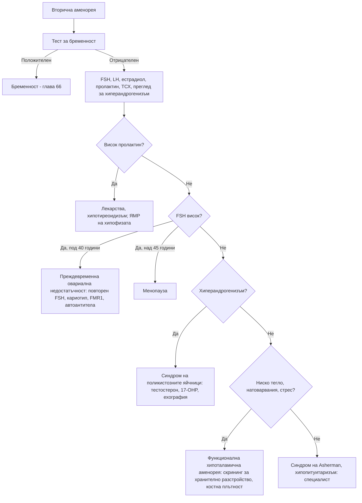

# Глава 63. Аменорея и анормално маточно кървене

> **Част XIII. Репродуктивно здраве и бременност**

## Цели на главата

- Да се изключва бременност като първа стъпка при всяко нарушение на менструалния цикъл.
- Да се разграничават първичната и вторичната аменорея и основните им причини.
- Да се разпознава преждевременната овариална недостатъчност.
- Да се класифицира анормалното маточно кървене по системата PALM-COEIN.
- Да се третират кървенето след менопаузата и посткоиталното кървене като червени флагове.

---

## А. АМЕНОРЕЯ

## 1. Определения

- **Първична аменорея:** липса на менструация до **15-годишна възраст** при нормално развити вторични полови белези или до **13-годишна възраст** без развитие на гърдите.
- **Вторична аменорея:** липса на менструация **≥ 3 месеца** при жена с редовен цикъл преди това или **≥ 6 месеца** при нередовен цикъл.
- **Олигоменорея:** менструации през интервал > 35 дни.

## 2. Причини за първична аменорея

| Група | Причини и насочващи белези |
|---|---|
| **Конституционално забавяне** | Фамилна анамнеза, забавен растеж и пубертет |
| **Хипоталамични** | Ниско тегло, спорт, стрес, хронични заболявания (възпалителни болести на червата, цьолиакия, муковисцидоза), **синдром на Kallmann** (аносмия) |
| **Хипофизни** | Тумори, хиперпролактинемия |
| **Гонадни** | **Синдром на Turner** (45,X — нисък ръст, крилата шия, висок FSH), гонадна дисгенезия |
| **Анатомични** | **Неперфориран химен** (циклична коремна болка, хематоколпос — синкаво изпъкнал химен), напречна вагинална преграда, **синдром на Mayer-Rokitansky-Küster-Hauser** (нормални гърди и окосмяване, **липсваща матка**, нормален кариотип) |
| **Андрогенна нечувствителност** | Кариотип 46,XY; развити гърди, **оскъдно или липсващо пубисно окосмяване**, сляпо завършваща вагина, ингвинални формации (тестиси) |
| **Други ендокринни** | Синдром на поликистозните яйчници, вродена надбъбречна хиперплазия, хипотиреоидизъм |

## 3. Причини за вторична аменорея

| Причина | Ключови белези | Лабораторни находки |
|---|---|---|
| **Бременност** | **Винаги първо изключете** | Положителен hCG |
| **Синдром на поликистозните яйчници** | Олигоменорея, хирзутизъм, акне, наднормено тегло | Нормални или повишени LH, тестостерон; поликистозна морфология (вж. глава 39) |
| **Функционална хипоталамична аменорея** | **Ниско тегло**, хранителни разстройства, **прекомерни физически натоварвания** (относителен енергиен дефицит в спорта), стрес | **Ниски или нормални LH и FSH, нисък естрадиол** |
| **Хиперпролактинемия** | Галакторея, главоболие, зрителни нарушения; **лекарства** (антипсихотици) | Висок пролактин (вж. глава 38) |
| **Заболявания на щитовидната жлеза** | Хипо- или хипертиреоидизъм | ТСХ |
| **Преждевременна овариална недостатъчност** | **Възраст под 40 години**, горещи вълни, нощно изпотяване, сухота във влагалището | **FSH > 25 IU/l** при две изследвания с интервал ≥ 4 седмици, нисък естрадиол |
| **Менопауза** | Средна възраст около 51 години | Висок FSH (не е необходим за диагнозата след 45 години) |
| **Синдром на Asherman** | Вътрематочни сраствания след кюретаж или инфекция | Нормални хормони; хистероскопия |
| **Синдром на Sheehan** | След масивен следродилен кръвоизлив; липса на лактация | Хипопитуитаризъм |
| **Лекарства** | Прогестагенни контрацептиви, депо-медроксипрогестерон, агонисти на GnRH, антипсихотици, химиотерапия | — |
| **След спиране на контрацептивите** | Обикновено се възстановява за 3 месеца | При по-дълга аменорея — изследване |
| **Други** | Синдром на Cushing, андроген-секретиращи тумори (вирилизация), кърмене, цервикална стеноза | Според клиниката |

### 3.1. Преждевременна овариална недостатъчност

Причините са автоимунни (често съчетани с **автоимунен тиреоидит** и **болест на Addison**), генетични (**премутация във FMR1** — синдром на фрагилната X хромозома, синдром на Turner с мозаицизъм), ятрогенни (химиотерапия, лъчетерапия, операции) или неизяснени. Последиците са **остеопороза**, **сърдечно-съдов риск** и безплодие. Необходими са кариотип, изследване за премутация във FMR1, антитела срещу надбъбречната кора и тиреоидната пероксидаза и хормонозаместителна терапия до възрастта на естествената менопауза.

## 4. Изследвания при вторична аменорея

1. **Тест за бременност.**
2. **FSH, LH, естрадиол, пролактин, ТСХ.**
3. При хиперандрогенизъм: **тестостерон**, SHBG, DHEAS, 17-хидроксипрогестерон.
4. **Трансвагинална ехография.**
5. При висок пролактин или централна причина — **ЯМР на хипофизата**.
6. При преждевременна овариална недостатъчност или първична аменорея — **кариотип**.

---

## Б. АНОРМАЛНО МАТОЧНО КЪРВЕНЕ

## 5. Класификация PALM-COEIN (FIGO)

| Структурни причини (PALM) | Неструктурни причини (COEIN) |
|---|---|
| **P** — **полипи** (ендометриални, цервикални) | **C** — **коагулопатия** (**болест на von Willebrand** — обилни менструации от менархето; антикоагуланти) |
| **A** — **аденомиоза** | **O** — **овулаторна дисфункция** (синдром на поликистозните яйчници, заболявания на щитовидната жлеза, хиперпролактинемия, перименопауза, юношество, затлъстяване) |
| **L** — **лейомиоми** (миоми) | **E** — ендометриални (първични нарушения, **ендометрит** — хламидия) |
| **M** — **злокачествени заболявания и хиперплазия** | **I** — **ятрогенни** (антикоагуланти, медна вътрематочна спирала, хормонална контрацепция — пробивно кървене, тамоксифен) |
| | **N** — некласифицирани (артериовенозни малформации, „ниша“ след цезарово сечение) |

## 6. Видове анормално кървене

### 6.1. Обилно менструално кървене

Определя се субективно — кървене, което влошава качеството на живот. Обективни белези: **„наводняване“**, **съсиреци > 2,5 cm**, смяна на превръзката **по-често от 2 часа**, двойна защита, **желязодефицитна анемия**.

**Изследвания:** ПКК, феритин; при кървене от менархето — **изследване за болест на von Willebrand**; ТСХ при симптоми; ехография при уголемена матка, подозрение за структурна патология или неуспех на лечението.

### 6.2. Междуменструално и посткоитално кървене

**Причини:**

- шийката на матката: **ектропион**, **цервицит (хламидия!)**, полипи, **карцином на шийката**;
- ендометриални полипи, хиперплазия и карцином;
- **пробивно кървене** при хормонална контрацепция;
- вътрематочна спирала;
- бременност и нейните усложнения;
- лезии на влагалището.

**Изследвания:** оглед със спекулум, **NAAT за хламидия и гонорея**, проверка на цервикалния скрининг. **При подозрителен вид на шийката — бързо насочване за колпоскопия.** При персистиращо посткоитално кървене — колпоскопия дори при нормален скрининг. **При възраст ≥ 45 години с персистиращо междуменструално кървене** или неуспех на лечението — оценка на ендометриума.

### 6.3. Кървене след менопаузата

**Кървене ≥ 12 месеца след последната менструация е карцином на ендометриума, докато не се докаже противното.** Карцином се открива при около 5–10% от жените с кървене след менопаузата.

| Причина | Особености |
|---|---|
| **Атрофичен вагинит и атрофичен ендометриум** | Най-честата причина |
| **Ендометриални полипи** | — |
| **Хиперплазия и карцином на ендометриума** | **Рискови фактори:** затлъстяване, самостоятелен прием на естрогени (без прогестаген), **тамоксифен**, липса на раждания, късна менопауза, **диабет**, синдром на поликистозните яйчници, **синдром на Lynch** |
| **Карцином на шийката на матката** | Кървене, течение |
| **Хормонозаместителна терапия** | Непланирано кървене |
| **Естроген-продуциращи тумори на яйчника** | Гранулозоклетъчен тумор |

**Изследвания:** **бързо насочване** (до 2 седмици) за **трансвагинална ехография** (дебелина на ендометриума **≥ 4 mm → биопсия**) и/или хистероскопия. Трябва да се уточни, че кървенето наистина е от влагалището, а не от уретрата или ректума.

---

## 7. Безопасна диагностична стратегия

| Въпрос | Отговор |
|---|---|
| **Вероятна диагноза** | Бременност, синдром на поликистозните яйчници, функционална хипоталамична аменорея, миоми, полипи, овулаторна дисфункция, пробивно кървене |
| **Сериозни заболявания, които не бива да се пропускат** | **Извънматочна бременност**; **карцином на ендометриума** (кървене след менопаузата); **карцином на шийката** (посткоитално кървене); **тумори на хипофизата**; **преждевременна овариална недостатъчност**; андроген-секретиращ тумор; **тежка анемия** от кървене; **хранително разстройство** |
| **Чести капани** | Бременност при „невъзможна“ бременност; **болест на von Willebrand** при обилно кървене от менархето; **хламидиен цервицит** при посткоитално кървене; антипсихотици и хиперпролактинемия; хипотиреоидизъм; кървене след менопаузата, приписано на „хормоните“; тамоксифен |
| **Маскиращи заболявания** | Заболявания на щитовидната жлеза, лекарства, захарен диабет, депресия |
| **Психосоциални аспекти** | Хранителни разстройства, прекомерни натоварвания, стрес, насилие |

---

## 8. Червени флагове

- **Кървене след менопаузата.**
- **Персистиращо посткоитално кървене** или подозрителен вид на шийката.
- Формация в малкия таз.
- Кървене с **хемодинамична нестабилност** или тежка анемия.
- Положителен тест за бременност с болка или кървене.
- **Вирилизация** или бързо прогресиращ хирзутизъм.
- **Главоболие и зрителни нарушения** при аменорея (тумор на хипофизата).
- Аменорея с **ниско тегло** и признаци на хранително разстройство.

---

## 9. Диагностичен алгоритъм при вторична аменорея

---

## 10. Клинични перли

- Първият тест при всяка аменорея е тестът за бременност.
- Обилни менструации от менархето: изследвайте за болест на von Willebrand.
- Посткоитално кървене при млада жена: изследвайте за хламидия и огледайте шийката.
- Кървенето след менопаузата се насочва бързо, дори ако е еднократно и малко.
- Жена на тамоксифен с вагинално кървене се нуждае от оценка на ендометриума.
- Жена под 40 години с аменорея и горещи вълни: преждевременна овариална недостатъчност. Необходима е хормонозаместителна терапия за костите и сърцето.
- Спортистка с аменорея не е „просто във форма“. Функционалната хипоталамична аменорея води до остеопороза и стрес фрактури.
- Циклична коремна болка без менструация при момиче: неперфориран химен.
- Аменорея с галакторея при пациентка на антипсихотици: лекарствена хиперпролактинемия.

---

## 11. Клиничен случай

**Случай.** Жена на 58 години с наднормено тегло (ИТМ 36 kg/m²), захарен диабет тип 2 и хипертония съобщава мимоходом, че от 3 месеца има „зацапване“ веднъж-два пъти месечно. Менопаузата е била преди 7 години. Мисли, че „хормоните още играят“. Не приема хормонозаместителна терапия. Няма деца.

**Въпроси.** 1) Кое е най-опасното обяснение? 2) Какво трябва да се направи?

**Обсъждане.** Всяко кървене след менопаузата изисква изключване на **карцином на ендометриума**. Пациентката има няколко рискови фактора: **затлъстяване** (периферна конверсия на андрогени в естрогени), **диабет**, **липса на раждания** и хипертония. Тя се насочва **бързо**. Трансвагиналната ехография показва задебелен ендометриум — 14 mm. Хистероскопията с биопсия потвърждава добре диференциран ендометриоиден аденокарцином. Ранната диагноза (кървенето е ранен симптом) дава много добра прогноза при хирургично лечение.

**Поука.** Кървенето след менопаузата не се обяснява с „хормоните“. То е най-важният ранен симптом на карцинома на ендометриума.

<!-- навигация -->

---

[← Глава 62. Гърло, нос, устна кухина и шия](62-garlo-nos-shia.md) · [Съдържание](../README.md) · [Глава 64. Тазова болка и вагинално течение →](64-tazova-bolka-techenie.md)
