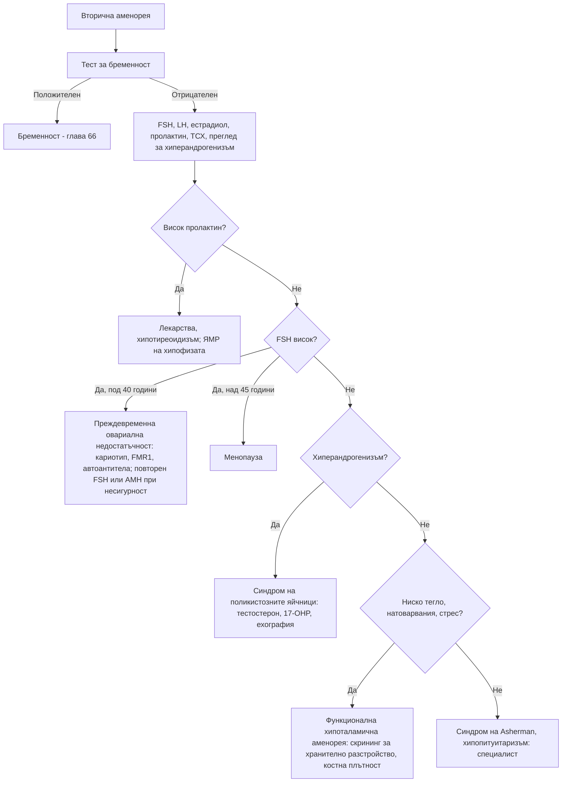

# Глава 63. Аменорея и анормално маточно кървене

> **Част XIII. Репродуктивно здраве и бременност**

## Цели на главата

- Да се изключва бременност като първа стъпка при всяко нарушение на менструалния цикъл.
- Да се разграничават първичната и вторичната аменорея и основните им причини.
- Да се разпознава преждевременната овариална недостатъчност.
- Да се класифицира анормалното маточно кървене по системата PALM-COEIN.
- Да се третират кървенето след менопаузата и посткоиталното кървене като червени флагове.

## Ключови моменти

- При всяко нарушение на менструалния цикъл първо се изключва бременност *(SORT C [1])*.
- Преждевременната овариална недостатъчност (под 40 години) се диагностицира при нарушен цикъл и FSH > 25 IU/l. Тя засяга около 3,5% от жените и изисква хормонозаместителна терапия *(SORT C [4])*.
- Функционалната хипоталамична аменорея е диагноза след изключване на другите причини. Тя води до загуба на костна маса *(SORT C [3])*.
- При обилно менструално кървене се изследва ПКК, а при кървене от менархето с анамнеза за кървене — болест на von Willebrand *(SORT C [6])*.
- Около 9% от жените с кървене след менопаузата имат карцином на ендометриума. Жените на 55 и повече години с необяснено кървене се насочват по пътеката за подозрение за рак *(SORT B [7, 9])*.
- Персистиращото посткоитално кървене изисква оглед на шийката, изследване за хламидия и колпоскопия *(SORT C [7, 8])*.

---

## А. Аменорея

### 1. Определения

- **Първична аменорея:** липса на менструация до **15-годишна възраст** при нормално развити вторични полови белези или до **13-годишна възраст** без развитие на гърдите.
- **Вторична аменорея:** липса на менструация **≥ 3 месеца** при жена с редовен цикъл преди това или **≥ 6 месеца** при нередовен цикъл [1].
- **Олигоменорея:** менструации през интервал > 35 дни.

### 2. Причини за първична аменорея

| Група | Причини и насочващи белези |
|---|---|
| **Конституционално забавяне** | Фамилна анамнеза, забавен растеж и пубертет |
| **Хипоталамични** | Ниско тегло, спорт, стрес, хронични заболявания (възпалителни болести на червата, цьолиакия, муковисцидоза), **синдром на Kallmann** (аносмия) |
| **Хипофизни** | Тумори, хиперпролактинемия |
| **Гонадни** | **Синдром на Turner** (45,X — нисък ръст, крилата шия, висок FSH), гонадна дисгенезия |
| **Анатомични** | **Неперфориран химен** (циклична коремна болка, хематоколпос — синкаво изпъкнал химен), напречна вагинална преграда, **синдром на Mayer-Rokitansky-Küster-Hauser** (нормални гърди и окосмяване, **липсваща матка**, нормален кариотип) |
| **Андрогенна нечувствителност** | Кариотип 46,XY; развити гърди, **оскъдно или липсващо пубисно окосмяване**, сляпо завършваща вагина, ингвинални формации (тестиси) |
| **Други ендокринни** | Синдром на поликистозните яйчници, вродена надбъбречна хиперплазия, хипотиреоидизъм |

### 3. Причини за вторична аменорея

| Причина | Ключови белези | Лабораторни находки |
|---|---|---|
| **Бременност** | **Винаги първо изключете** | Положителен hCG |
| **Синдром на поликистозните яйчници** | Олигоменорея, хирзутизъм, акне, наднормено тегло | Нормални или повишени LH, тестостерон; поликистозна морфология (вж. глава 39) [2] |
| **Функционална хипоталамична аменорея** | **Ниско тегло**, хранителни разстройства, **прекомерни физически натоварвания** (относителен енергиен дефицит в спорта), стрес | **Ниски или нормални LH и FSH, нисък естрадиол** [3] |
| **Хиперпролактинемия** | Галакторея, главоболие, зрителни нарушения; **лекарства** (антипсихотици) | Висок пролактин (вж. глава 38) |
| **Заболявания на щитовидната жлеза** | Хипо- или хипертиреоидизъм | ТСХ |
| **Преждевременна овариална недостатъчност** | **Възраст под 40 години**, горещи вълни, нощно изпотяване, сухота във влагалището | **FSH > 25 IU/l** и нисък естрадиол; по ESHRE (2024) е достатъчно едно измерване, а повторно FSH или AMH се изследват при диагностична несигурност (по-старият критерий е две измервания през ≥ 4 седмици) [4] |
| **Менопауза** | Средна възраст около 51 години | Висок FSH (не е необходим за диагнозата след 45 години) |
| **Синдром на Asherman** | Вътрематочни сраствания след кюретаж или инфекция | Нормални хормони; хистероскопия |
| **Синдром на Sheehan** | След масивен следродилен кръвоизлив; липса на лактация | Хипопитуитаризъм |
| **Лекарства** | Прогестагенни контрацептиви, депо-медроксипрогестерон, агонисти на GnRH, антипсихотици, химиотерапия | — |
| **След спиране на контрацептивите** | Обикновено се възстановява за 3 месеца | При по-дълга аменорея — изследване |
| **Други** | Синдром на Cushing, андроген-секретиращи тумори (вирилизация), кърмене, цервикална стеноза | Според клиниката |

#### 3.1. Преждевременна овариална недостатъчност

Причините са автоимунни (често съчетани с **автоимунен тиреоидит** и **болест на Addison**), генетични (**премутация във FMR1** — синдром на фрагилната X хромозома, синдром на Turner с мозаицизъм), ятрогенни (химиотерапия, лъчетерапия, операции) или неизяснени. Последиците са **остеопороза**, **сърдечно-съдов риск** и безплодие. Необходими са кариотип, изследване за премутация във FMR1, антитела срещу надбъбречната кора и тиреоидната пероксидаза и хормонозаместителна терапия до възрастта на естествената менопауза. По нови данни състоянието засяга около 3,5% от жените [4].

### 4. Изследвания при вторична аменорея

1. **Тест за бременност.**
2. **FSH, LH, естрадиол, пролактин, ТСХ.**
3. При хиперандрогенизъм: **тестостерон**, SHBG, DHEAS, 17-хидроксипрогестерон.
4. **Трансвагинална ехография.**
5. При висок пролактин или централна причина — **ЯМР на хипофизата**.
6. При преждевременна овариална недостатъчност или първична аменорея — **кариотип**.

---

## Б. Анормално маточно кървене

### 5. Класификация PALM-COEIN (FIGO)

| Структурни причини (PALM) [5] | Неструктурни причини (COEIN) |
|---|---|
| **P** — **полипи** (ендометриални, цервикални) | **C** — **коагулопатия** (**болест на von Willebrand** — обилни менструации от менархето; антикоагуланти) |
| **A** — **аденомиоза** | **O** — **овулаторна дисфункция** (синдром на поликистозните яйчници, заболявания на щитовидната жлеза, хиперпролактинемия, перименопауза, юношество, затлъстяване) |
| **L** — **лейомиоми** (миоми) | **E** — ендометриални (първични нарушения, **ендометрит** — хламидия) |
| **M** — **злокачествени заболявания и хиперплазия** | **I** — **ятрогенни** (антикоагуланти, медна вътрематочна спирала, хормонална контрацепция — пробивно кървене, тамоксифен) |
| | **N** — некласифицирани (артериовенозни малформации, „ниша“ след цезарово сечение) |

### 6. Видове анормално кървене

#### 6.1. Обилно менструално кървене

Определя се субективно — кървене, което влошава качеството на живот. Обективни белези: **„наводняване“**, **съсиреци > 2,5 cm**, смяна на превръзката **по-често от 2 часа**, двойна защита, **желязодефицитна анемия**.

**Изследвания:** ПКК при всички жени с обилно менструално кървене; феритин при съмнение за железен дефицит. При обилно кървене от менархето и лична или фамилна анамнеза за кървене — **изследване за болест на von Willebrand**. ТСХ се изследва само при симптоми на заболяване на щитовидната жлеза, а половите хормони не се изследват. При данни за полип, субмукозен миом или патология на ендометриума (например персистиращо междуменструално кървене) се предпочита хистероскопия, а при палпаторно уголемена матка или формация в таза — ехография [6].

#### 6.2. Междуменструално и посткоитално кървене

**Причини:**

- шийката на матката: **ектропион**, **цервицит (хламидия!)**, полипи, **карцином на шийката**;
- ендометриални полипи, хиперплазия и карцином;
- **пробивно кървене** при хормонална контрацепция;
- вътрематочна спирала;
- бременност и нейните усложнения;
- лезии на влагалището.

**Изследвания:** оглед със спекулум, **NAAT за хламидия и гонорея**, проверка на цервикалния скрининг. **При подозрителен вид на шийката — бързо насочване за колпоскопия** [7]. При персистиращо посткоитално кървене — колпоскопия дори при нормален скрининг. Рискът от карцином на шийката при посткоитално кървене нараства с възрастта — от около 1 на 44 000 при 20–24 години до около 1 на 2 400 при 45–54 години [8]. **При възраст ≥ 45 години с персистиращо междуменструално кървене** или неуспех на лечението — оценка на ендометриума.

#### 6.3. Кървене след менопаузата

**Кървене ≥ 12 месеца след последната менструация е карцином на ендометриума, докато не се докаже противното.** Карцином се открива при около 9% от жените с кървене след менопаузата, а над 90% от жените с карцином на ендометриума имат такова кървене [9].

| Причина | Особености |
|---|---|
| **Атрофичен вагинит и атрофичен ендометриум** | Най-честата причина |
| **Ендометриални полипи** | — |
| **Хиперплазия и карцином на ендометриума** | **Рискови фактори:** затлъстяване, самостоятелен прием на естрогени (без прогестаген), **тамоксифен**, липса на раждания, късна менопауза, **диабет**, синдром на поликистозните яйчници, **синдром на Lynch** |
| **Карцином на шийката на матката** | Кървене, течение |
| **Хормонозаместителна терапия** | Непланирано кървене |
| **Естроген-продуциращи тумори на яйчника** | Гранулозоклетъчен тумор |

**Изследвания:** **бързо насочване** (до 2 седмици) за **трансвагинална ехография** (при дебелина на ендометриума **≥ 4 mm — биопсия**; праг от 3 mm изключва карцинома по-надеждно [10]; при повторно кървене се прави хистероскопия независимо от дебелината) и/или хистероскопия. По NICE NG12 (актуализация 2026) необясненото кървене след менопаузата, което не се дължи на хормонозаместителна терапия, налага насочване по пътеката за подозрение за карцином при жени на **55 и повече години**; при по-млади жени насочването се **обсъжда** според клиничната картина [7]. Непланираното кървене при хормонозаместителна терапия се оценява по препоръките на British Menopause Society. Трябва да се уточни, че кървенето наистина е от влагалището, а не от уретрата или ректума.

---

## 7. Безопасна диагностична стратегия

| Въпрос | Отговор |
|---|---|
| **Вероятна диагноза** | Бременност, синдром на поликистозните яйчници, функционална хипоталамична аменорея, миоми, полипи, овулаторна дисфункция, пробивно кървене |
| **Сериозни заболявания, които не бива да се пропускат** | **Извънматочна бременност**; **карцином на ендометриума** (кървене след менопаузата); **карцином на шийката** (посткоитално кървене); **тумори на хипофизата**; **преждевременна овариална недостатъчност**; андроген-секретиращ тумор; **тежка анемия** от кървене; **хранително разстройство** |
| **Чести капани** | Бременност при „невъзможна“ бременност; **болест на von Willebrand** при обилно кървене от менархето; **хламидиен цервицит** при посткоитално кървене; антипсихотици и хиперпролактинемия; хипотиреоидизъм; кървене след менопаузата, приписано на „хормоните“; тамоксифен |
| **Маскиращи заболявания** | Заболявания на щитовидната жлеза, лекарства, захарен диабет, депресия |
| **Психосоциални аспекти** | Хранителни разстройства, прекомерни натоварвания, стрес, насилие |

---

## 8. Червени флагове

- **Кървене след менопаузата.**
- **Персистиращо посткоитално кървене** или подозрителен вид на шийката.
- Формация в малкия таз.
- Кървене с **хемодинамична нестабилност** или тежка анемия.
- Положителен тест за бременност с болка или кървене.
- **Вирилизация** или бързо прогресиращ хирзутизъм.
- **Главоболие и зрителни нарушения** при аменорея (тумор на хипофизата).
- Аменорея с **ниско тегло** и признаци на хранително разстройство.

---

## 9. Диагностичен алгоритъм при вторична аменорея

---

## 10. Кога и колко спешно да насочим

| Спешност | Клинична ситуация |
|---|---|
| **Незабавно (112 или спешно отделение)** | Положителен тест за бременност с коремна болка, кървене или хемодинамична нестабилност (извънматочна бременност); обилно маточно кървене с хемодинамична нестабилност; внезапно силно главоболие и зрителни нарушения при тумор на хипофизата |
| **В същия ден** | Обилно кървене с тежка симптомна анемия; кървене в ранна бременност — кабинет за ранна бременност |
| **Бързо (до 2 седмици)** | Кървене след менопаузата — пътека за подозрение за рак при възраст ≥ 55 години и обсъждане при по-млади жени [7]; вид на шийката, подозрителен за карцином [7]; персистиращо посткоитално кървене — колпоскопия [8]; вирилизация или бързо прогресиращ хирзутизъм; вагинално кървене при прием на тамоксифен |
| **Планово** | Първична аменорея; преждевременна овариална недостатъчност [4]; хиперпролактинемия без спешни симптоми [11]; обилно менструално кървене без ефект от лечението или с подозрение за структурна патология [6]; функционална хипоталамична аменорея — мултидисциплинарна оценка [3]; подозрение за болест на von Willebrand — хематолог [6] |
| **Проследяване в общата практика** | Синдром на поликистозните яйчници [2]; обилно менструално кървене без други симптоми — медикаментозно лечение [6]; пробивно кървене при хормонална контрацепция след изключване на бременност и хламидия; менопауза |

---

## 11. Клинични перли

- Първият тест при всяка аменорея е тестът за бременност.
- Обилни менструации от менархето с лична или фамилна анамнеза за кървене: изследвайте за болест на von Willebrand.
- Посткоитално кървене при млада жена: изследвайте за хламидия и огледайте шийката.
- Кървенето след менопаузата се насочва бързо, дори ако е еднократно и малко.
- Жена на тамоксифен с вагинално кървене се нуждае от оценка на ендометриума.
- Жена под 40 години с аменорея и горещи вълни: преждевременна овариална недостатъчност. Необходима е хормонозаместителна терапия за костите и сърцето.
- Спортистка с аменорея не е „просто във форма“. Функционалната хипоталамична аменорея води до остеопороза и стрес фрактури.
- Циклична коремна болка без менструация при момиче: неперфориран химен.
- Аменорея с галакторея при пациентка на антипсихотици: лекарствена хиперпролактинемия.

---

## 12. Клиничен случай

**Етап 1 — представяне.** Жена на 58 години с наднормено тегло (ИТМ 36 kg/m²), захарен диабет тип 2 и хипертония съобщава мимоходом, че от 3 месеца има „зацапване“ веднъж-два пъти месечно. Менопаузата е била преди 7 години. Не приема хормонозаместителна терапия и няма деца. Мисли, че „хормоните още играят“.

> **Въпрос 1.** Кое е най-опасното обяснение и какви рискови фактори има пациентката?

**Етап 2 — преглед.** Шийката на матката е без видими промени, а лигавицата на влагалището е леко атрофична. Трансвагиналната ехография показва ендометриум с дебелина 14 mm.

> **Въпрос 2.** Може ли атрофията да обясни кървенето и какво е следващото изследване?

> **Въпрос 3.** Колко спешно се насочва пациентката?

Обсъждане и отговори

**Отговор 1.** Най-опасното обяснение е **карцином на ендометриума**, който се открива при около 9% от жените с кървене след менопаузата [9]. Пациентката има няколко рискови фактора: **затлъстяване** (превръщане на андрогените в естрогени в мастната тъкан), **диабет**, **липса на раждания** и хипертония.

**Отговор 2.** Атрофията е най-честата причина за кървене след менопаузата, но не се приема, преди да се изключи карцином. Ендометриум от 14 mm далеч надхвърля прага от 3–4 mm [10]. Нужни са хистероскопия и биопсия.

**Отговор 3.** Жена на 55 или повече години с необяснено кървене след менопаузата без хормонозаместителна терапия се насочва **по пътеката за подозрение за рак** (до 2 седмици) [7]. Хистероскопията с биопсия потвърждава добре диференциран ендометриоиден аденокарцином. Ранната диагноза дава много добра прогноза при хирургично лечение.

**Поука.** Кървенето след менопаузата не се обяснява с „хормоните“. То е най-важният ранен симптом на карцинома на ендометриума.

---

## Обобщение

- При всяко нарушение на менструалния цикъл първо се изключва бременност.
- Първичната аменорея се изследва след 15-годишна възраст или след 13 години без развитие на гърдите. Вторичната аменорея се изследва след 3 месеца при редовен или след 6 месеца при нередовен цикъл. Честите причини са синдромът на поликистозните яйчници, функционалната хипоталамична аменорея, хиперпролактинемията, заболяванията на щитовидната жлеза и преждевременната овариална недостатъчност.
- Анормалното маточно кървене се класифицира по системата PALM-COEIN.
- Кървенето след менопаузата и персистиращото посткоитално кървене са червени флагове за рак и се насочват бързо.

## Самопроверка

### Въпроси с един верен отговор

**1.** *(основно ниво)* Жена на 24 години няма менструация от 4 месеца. Преди това циклите ѝ са били редовни. Коя е първата стъпка?

- **А.** FSH и LH
- **Б.** Тест за бременност
- **В.** Пролактин
- **Г.** Трансвагинална ехография
- **Д.** Прогестеронов тест

Отговор и обосновка

**Верен отговор: Б.** При всяко нарушение на менструалния цикъл първо се изключва бременност [1].

**2.** *(основно ниво)* Бегачка на 19 години с ИТМ 17,5 kg/m² няма менструация от 8 месеца и е получила стрес фрактура. LH и FSH са ниско-нормални, естрадиолът е нисък, а пролактинът и ТСХ са нормални. Тестът за бременност е отрицателен. Коя е най-вероятната диагноза?

- **А.** Синдром на поликистозните яйчници
- **Б.** Функционална хипоталамична аменорея
- **В.** Преждевременна овариална недостатъчност
- **Г.** Хиперпролактинемия
- **Д.** Синдром на Asherman

Отговор и обосновка

**Верен отговор: Б.** Ниското тегло, интензивните натоварвания, ниско-нормалните гонадотропини и ниският естрадиол са типични за функционална хипоталамична аменорея. Тя води до загуба на костна маса и стрес фрактури [3].

**3.** *(основно ниво)* Жена на 34 години няма менструация от 6 месеца и има горещи вълни. FSH е 68 IU/l, естрадиолът е нисък, а тестът за бременност е отрицателен. Кое е правилното поведение?

- **А.** Успокояване — това е ранна менопауза и не изисква лечение
- **Б.** Изследвания за причината (кариотип, премутация във FMR1, автоантитела) и хормонозаместителна терапия до възрастта на естествената менопауза
- **В.** Лечение на синдром на поликистозните яйчници
- **Г.** ЯМР на хипофизата
- **Д.** Повторно изследване след година без лечение

Отговор и обосновка

**Верен отговор: Б.** Аменореята с висок FSH преди 40-годишна възраст е преждевременна овариална недостатъчност. Търси се причината, а хормонозаместителната терапия предпазва костите и сърдечно-съдовата система [4].

**4.** *(напреднало ниво)* Момиче на 16 години има обилни менструации от менархето и кървене от венците при миене на зъбите. Майка ѝ също има обилни менструации. Хемоглобинът е 98 g/l. Кое изследване е най-важно освен ПКК и феритин?

- **А.** ТСХ
- **Б.** Изследване за болест на von Willebrand
- **В.** Полови хормони
- **Г.** Ехография на корема
- **Д.** Пролактин

Отговор и обосновка

**Верен отговор: Б.** Обилното кървене от менархето с лична и фамилна анамнеза за кървене налага изследване за коагулопатия, най-често болест на von Willebrand [6].

**5.** *(напреднало ниво)* Жена на 48 години има посткоитално кървене от 3 месеца. Цервикалният скрининг преди година е нормален. При огледа шийката е без видими промени, а изследването за хламидия е отрицателно. Кое е правилното поведение?

- **А.** Успокояване, защото скринингът е нормален
- **Б.** Насочване за колпоскопия
- **В.** Антибиотик за цервицит
- **Г.** Повторен скрининг след 3 години
- **Д.** Смяна на контрацептива

Отговор и обосновка

**Верен отговор: Б.** Персистиращото посткоитално кървене налага колпоскопия дори при нормален скрининг. Рискът от карцином на шийката при посткоитално кървене нараства с възрастта [8].

### Задача

Жена на 27 години има галакторея и няма менструация от 5 месеца. От година приема рисперидон. Тестът за бременност е отрицателен, пролактинът е два пъти над горната граница, а ТСХ е нормален. Как ще подходите?

Решение

Най-вероятна е **лекарствена хиперпролактинемия** от рисперидона. Изключени са бременност и хипотиреоидизъм; изследва се и бъбречната функция. Антипсихотикът не се спира самостоятелно. С психиатъра се обсъжда смяна с лекарство, което не повишава пролактина, и повторно изследване [11]. При главоболие, зрителни нарушения или пролактин, който не се нормализира след смяната, се прави ЯМР на хипофизата [11]. При продължителен хипоестрогенизъм се обсъждат костното здраве и контрацепцията.

### OSCE станция: Анамнеза при вторична аменорея

**Време:** 8 минути. **Ниво:** основно (студенти, специализанти).

**Задача за кандидата.** Жена на 22 години няма менструация от 5 месеца. Снемете насочена анамнеза и предложете първоначални изследвания.

**Информация за симулирания пациент (за изпитващия).** Студентка, която тренира за маратон и е отслабнала с 8 kg. Сексуално активна е и използва презерватив. Няма галакторея, хирзутизъм или главоболие.

**Рубрика за оценяване**

| Критерий | Точки |
|---|---|
| Пита за последната менструация, предишния цикъл, възможността за бременност и контрацепцията | 2 |
| Пита за теглото, храненето, физическите натоварвания и стреса (хранително разстройство) | 2 |
| Пита за галакторея, главоболие и зрителни нарушения | 1 |
| Пита за хирзутизъм, акне, горещи вълни и симптоми на заболяване на щитовидната жлеза | 1 |
| Пита за лекарства и предишни гинекологични интервенции | 1 |
| Предлага тест за бременност, FSH, LH, естрадиол, пролактин и ТСХ | 2 |
| Обяснява плана с разбираем език и обсъжда костното здраве | 1 |
| **Общо** | **10** |

**Праг за успешно представяне:** 7 от 10 точки, включително теста за бременност.

## Литература

1. Klein DA, Paradise SL, Reeder RM. Amenorrhea: A Systematic Approach to Diagnosis and Management. Am Fam Physician. 2019;100(1):39-48. PMID: 31259490.
2. Teede HJ, Tay CT, Laven JJE, Dokras A, Moran LJ, Piltonen TT, et al. Recommendations From the 2023 International Evidence-based Guideline for the Assessment and Management of Polycystic Ovary Syndrome. J Clin Endocrinol Metab. 2023;108(10):2447-2469. doi:10.1210/clinem/dgad463. PMID: 37580314.
3. Gordon CM, Ackerman KE, Berga SL, Kaplan JR, Mastorakos G, Misra M, et al. Functional Hypothalamic Amenorrhea: An Endocrine Society Clinical Practice Guideline. J Clin Endocrinol Metab. 2017;102(5):1413-1439. doi:10.1210/jc.2017-00131. PMID: 28368518.
4. Panay N, Anderson RA, Bennie A, Cedars M, Davies M, Ee C, et al. Evidence-based guideline: premature ovarian insufficiency. Hum Reprod Open. 2024;2024(4):hoae065. doi:10.1093/hropen/hoae065. PMID: 39660328.
5. Munro MG, Critchley HOD, Fraser IS; FIGO Menstrual Disorders Committee. The two FIGO systems for normal and abnormal uterine bleeding symptoms and classification of causes of abnormal uterine bleeding in the reproductive years: 2018 revisions. Int J Gynaecol Obstet. 2018;143(3):393-408. doi:10.1002/ijgo.12666. PMID: 30198563.
6. National Institute for Health and Care Excellence. Heavy menstrual bleeding: assessment and management (NICE guideline NG88). London: NICE; 2018 [актуализирано 2026]. Достъпно на: https://www.nice.org.uk/guidance/ng88
7. National Institute for Health and Care Excellence. Suspected cancer: recognition and referral (NICE guideline NG12). London: NICE; 2015 [актуализирано 2026]. Достъпно на: https://www.nice.org.uk/guidance/ng12
8. Shapley M, Jordan J, Croft PR. A systematic review of postcoital bleeding and risk of cervical cancer. Br J Gen Pract. 2006;56(527):453-60. PMID: 16762128.
9. Clarke MA, Long BJ, Del Mar Morillo A, Arbyn M, Bakkum-Gamez JN, Wentzensen N. Association of Endometrial Cancer Risk With Postmenopausal Bleeding in Women: A Systematic Review and Meta-analysis. JAMA Intern Med. 2018;178(9):1210-1222. doi:10.1001/jamainternmed.2018.2820. PMID: 30083701.
10. Timmermans A, Opmeer BC, Khan KS, Bachmann LM, Epstein E, Clark TJ, et al. Endometrial thickness measurement for detecting endometrial cancer in women with postmenopausal bleeding: a systematic review and meta-analysis. Obstet Gynecol. 2010;116(1):160-167. doi:10.1097/AOG.0b013e3181e3e7e8. PMID: 20567183.
11. Melmed S, Casanueva FF, Hoffman AR, Kleinberg DL, Montori VM, Schlechte JA, et al. Diagnosis and treatment of hyperprolactinemia: an Endocrine Society clinical practice guideline. J Clin Endocrinol Metab. 2011;96(2):273-88. doi:10.1210/jc.2010-1692. PMID: 21296991.

*Последна проверка на съдържанието: септември 2026 г. Следващ планиран преглед: септември 2027 г. (вж. „Политика за актуализация“ в README).*

<!-- навигация -->

---

[← Глава 62. Гърло, нос, устна кухина и шия](62-garlo-nos-shia.md) · [Съдържание](../README.md) · [Глава 64. Тазова болка и вагинално течение →](64-tazova-bolka-techenie.md)
